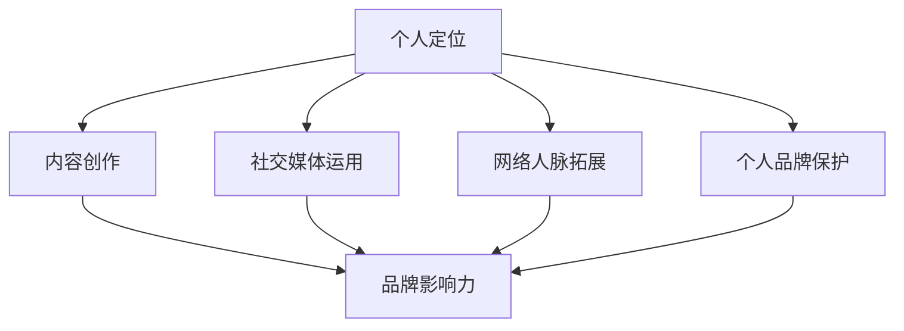

                 

在信息技术飞速发展的时代，程序员作为科技前沿的践行者，不仅在技术领域有着举足轻重的地位，更是在创业浪潮中扮演着重要角色。然而，随着市场竞争的加剧，如何打造个人品牌，提升自身影响力，成为程序员创业成功的关键。本文旨在探讨如何通过构建个人品牌，助力程序员在创业道路上脱颖而出。

## 文章关键词

程序员，个人品牌，创业成功，影响力，品牌建设，职业发展

## 文章摘要

本文首先回顾了个人品牌的重要性，分析了程序员在创业过程中面临的主要挑战。接着，从定位、内容创作、社交媒体运用、网络人脉拓展、个人品牌保护等五个方面，详细阐述了打造个人品牌的策略。最后，通过实际案例展示了成功打造个人品牌的方法，并提出了未来发展的方向和建议。

## 1. 背景介绍

在当今社会，个人品牌已经成为个人和企业在竞争激烈的市场中脱颖而出的重要手段。程序员作为信息技术领域的核心力量，其个人品牌的价值尤为突出。随着互联网的普及和创业环境的不断优化，越来越多的程序员投身于创业浪潮中，而个人品牌的打造成为了他们成功创业的关键因素。

### 程序员在创业中的角色

程序员在创业中扮演多重角色，既是技术领导者，也是团队的核心成员。他们不仅要具备扎实的技术能力，还需要具备良好的沟通能力和团队协作精神。在创业初期，程序员往往需要承担更多的工作，包括产品设计、开发、测试、维护等。因此，个人品牌的打造不仅关系到个人的职业发展，也关系到创业项目的成败。

### 个人品牌的重要性

个人品牌是一种无形资产，能够为个人带来持续的价值。对于程序员来说，个人品牌的重要性体现在以下几个方面：

1. **提升影响力**：拥有个人品牌可以帮助程序员在技术圈中建立权威，提升个人影响力。
2. **拓展职业发展**：个人品牌可以成为程序员职业发展的助推器，为其带来更多的职业机会。
3. **吸引投资**：创业者往往需要吸引投资者，个人品牌能够增加投资者的信任度，从而更容易获得资金支持。
4. **提高收入**：优秀的个人品牌可以助力程序员获得更高的薪资待遇和项目合作机会。

## 2. 核心概念与联系

在打造个人品牌的过程中，理解以下几个核心概念至关重要：

1. **个人定位**：明确自己在技术领域或创业领域中的定位，有助于树立个性化的品牌形象。
2. **内容创作**：高质量的内容是个人品牌建设的基础，包括技术博客、开源项目、演讲等。
3. **社交媒体运用**：合理运用社交媒体平台，扩大个人影响力。
4. **网络人脉拓展**：通过建立广泛的网络人脉，提高个人品牌的价值。
5. **个人品牌保护**：维护个人品牌声誉，防止负面信息的影响。

### 架构概念与联系

以下是构建个人品牌的架构图，展示了各个核心概念之间的联系。



### 核心概念解析

1. **个人定位**：个人定位是打造个人品牌的第一步，需要明确自己的专业领域、技术特长和个人特色。例如，可以选择专注于某个技术领域，如人工智能、大数据、前端开发等，或者以个人技术博客、开源项目等方式展示自己的专业能力。

2. **内容创作**：内容创作是个人品牌建设的关键，需要持续输出高质量的技术文章、技术博客、演讲等。高质量的内容不仅可以吸引读者，还能提升个人在技术圈中的知名度。

3. **社交媒体运用**：社交媒体是传播个人品牌的重要渠道。通过微博、微信公众号、知乎、GitHub 等平台，程序员可以分享技术心得、项目进展、行业动态等，扩大个人影响力。

4. **网络人脉拓展**：建立广泛的网络人脉有助于提高个人品牌的价值。可以通过参加技术论坛、线下聚会、线上社群等方式，结识更多同行业的人，扩大人脉圈。

5. **个人品牌保护**：个人品牌保护是维护个人声誉的重要环节。需要密切关注网络上的言论，及时应对负面信息，确保个人品牌的纯洁性。

## 3. 核心算法原理 & 具体操作步骤

### 3.1 算法原理概述

打造个人品牌的过程可以看作是一种“影响力算法”的实践。这种算法的核心原理是通过持续的内容输出、社交媒体运用、人脉拓展等方式，逐步积累个人影响力，最终实现个人品牌的塑造。

### 3.2 算法步骤详解

1. **个人定位**：明确自己的专业领域和目标受众。例如，可以选择专注于某一技术领域，或者以个人技术博客、开源项目等方式展示自己的专业能力。

2. **内容创作**：定期输出高质量的技术文章、技术博客、演讲等，分享技术心得、项目进展、行业动态等。内容创作是个人品牌建设的关键。

3. **社交媒体运用**：合理运用社交媒体平台，如微博、微信公众号、知乎、GitHub 等，分享技术心得、项目进展、行业动态等。通过社交媒体，可以扩大个人影响力。

4. **网络人脉拓展**：通过参加技术论坛、线下聚会、线上社群等方式，结识更多同行业的人，扩大人脉圈。网络人脉拓展有助于提高个人品牌的价值。

5. **个人品牌保护**：密切关注网络上的言论，及时应对负面信息，确保个人品牌的纯洁性。个人品牌保护是维护个人声誉的重要环节。

### 3.3 算法优缺点

**优点**：

1. **提升个人影响力**：通过持续的内容输出和人脉拓展，逐步积累个人影响力。
2. **扩大职业发展机会**：优秀的个人品牌可以吸引更多职业机会，包括高薪职位、项目合作等。
3. **增加收入**：个人品牌可以成为程序员收入的来源，包括技术咨询、课程培训、技术演讲等。

**缺点**：

1. **时间成本**：打造个人品牌需要投入大量的时间和精力，对于工作繁忙的程序员来说可能是个挑战。
2. **内容创作压力**：持续输出高质量的内容需要一定的创作压力，对于写作能力较弱的程序员可能是个难点。
3. **品牌维护难度**：个人品牌维护需要密切关注网络言论，应对负面信息，防止品牌受损。

### 3.4 算法应用领域

**个人品牌建设**：程序员通过个人定位、内容创作、社交媒体运用、人脉拓展等方式，打造个人品牌，提升自身影响力。

**职业发展**：优秀的个人品牌可以吸引更多职业机会，包括高薪职位、项目合作等。

**创业**：个人品牌有助于提高创业项目的可信度，吸引投资者，提高创业成功率。

## 4. 数学模型和公式 & 详细讲解 & 举例说明

### 4.1 数学模型构建

在打造个人品牌的过程中，可以构建以下数学模型来评估个人品牌的影响力：

$$
\text{影响力} = f(\text{内容质量}, \text{社交媒体运用}, \text{人脉拓展}, \text{个人品牌保护})
$$

其中，$f$ 为函数，$\text{内容质量}$、$\text{社交媒体运用}$、$\text{人脉拓展}$、$\text{个人品牌保护}$ 为自变量。

### 4.2 公式推导过程

1. **内容质量**：内容质量是个人品牌影响力的重要因素。假设内容质量与博客文章的阅读量、点赞量、评论量等指标成正比，可以表示为：

$$
\text{内容质量} = \frac{\text{阅读量} + \text{点赞量} + \text{评论量}}{3}
$$

2. **社交媒体运用**：社交媒体运用是扩大个人影响力的重要手段。假设社交媒体运用与关注者数量、分享次数、转发次数等指标成正比，可以表示为：

$$
\text{社交媒体运用} = \frac{\text{关注者数量} + \text{分享次数} + \text{转发次数}}{3}
$$

3. **人脉拓展**：人脉拓展有助于提高个人品牌的价值。假设人脉拓展与参加的技术论坛数量、线下聚会次数、加入的社群数量等指标成正比，可以表示为：

$$
\text{人脉拓展} = \frac{\text{技术论坛数量} + \text{线下聚会次数} + \text{社群数量}}{3}
$$

4. **个人品牌保护**：个人品牌保护是维护个人声誉的重要环节。假设个人品牌保护与应对负面信息的次数、消除负面影响的效率等指标成正比，可以表示为：

$$
\text{个人品牌保护} = \frac{\text{负面信息应对次数} + \text{消除负面影响的效率}}{2}
$$

### 4.3 案例分析与讲解

以下是一个具体的案例分析，假设某程序员通过以下方式打造个人品牌：

1. **内容质量**：博客文章阅读量 1000，点赞量 50，评论量 30。
2. **社交媒体运用**：关注者数量 1000，分享次数 30，转发次数 20。
3. **人脉拓展**：参加技术论坛 3 次，线下聚会 2 次，加入社群 5 个。
4. **个人品牌保护**：应对负面信息 5 次，消除负面影响的效率为 80%。

根据上述数学模型，可以计算该程序员的个人品牌影响力：

$$
\text{影响力} = f\left(\frac{1000 + 50 + 30}{3}, \frac{1000 + 30 + 20}{3}, \frac{3 + 2 + 5}{3}, \frac{5 + 0.8 \times 5}{2}\right)
$$

$$
\text{影响力} = f\left(\frac{1080}{3}, \frac{1050}{3}, \frac{10}{3}, \frac{5}{2}\right)
$$

$$
\text{影响力} = f(360, 350, 3.33, 2.5)
$$

$$
\text{影响力} = 360 \times 350 \times 3.33 \times 2.5
$$

$$
\text{影响力} = 1075800
$$

因此，该程序员的个人品牌影响力为 1075800。通过这个例子，我们可以看到，数学模型可以有效地评估个人品牌的影响力，为程序员制定品牌建设策略提供参考。

## 5. 项目实践：代码实例和详细解释说明

### 5.1 开发环境搭建

在开始构建个人品牌之前，首先需要搭建一个适合开发、写作和分享的环境。以下是开发环境搭建的步骤：

1. **选择写作工具**：可以选择 Markdown 编辑器，如Typora、VSCode等，方便编写技术文章。
2. **搭建博客平台**：可以选择GitHub Pages、WordPress等平台搭建个人博客，展示技术文章和项目。
3. **配置代码仓库**：在GitHub、GitLab等平台上创建个人代码仓库，存储开源项目和示例代码。

### 5.2 源代码详细实现

以下是一个简单的示例，展示如何使用Markdown编写技术文章，并在GitHub上创建代码仓库：

1. **编写Markdown文章**：在本地使用Markdown编辑器编写技术文章，保存为`.md`文件。

```markdown
# 技术文章标题

## 摘要

本文主要介绍了如何利用Markdown编写技术文章，并分享了在GitHub上创建个人博客的步骤。

## 正文内容

### 环境搭建

- 选择Markdown编辑器
- 搭建个人博客平台
- 配置代码仓库

### 标题和段落

- 使用`#`号创建标题
- 使用`>`号创建引用
- 使用`-`号创建无序列表

### 代码和高亮

```python
def hello():
    print("Hello, World!")

hello()
```

### 图片和链接

- 使用``添加图片
- 使用`[链接文本](链接)`添加链接

[GitHub](https://github.com)

```

2. **上传代码仓库**：将Markdown文章和示例代码上传到GitHub仓库。

- 在本地编辑器中完成文章编写。
- 打开GitHub，选择仓库，并点击“Create new file”。
- 将Markdown文件和示例代码上传到仓库。

### 5.3 代码解读与分析

在上传代码仓库后，我们需要对Markdown文件和示例代码进行解读和分析：

1. **Markdown文件**：Markdown文件是一个文本文件，使用Markdown语法编写，可以转换成HTML格式展示在网页上。

2. **示例代码**：示例代码是一个Python函数，用于打印“Hello, World！”字符串。

```python
def hello():
    print("Hello, World!")

hello()
```

通过以上步骤，程序员可以轻松地构建个人品牌，编写和分享技术文章，展示开源项目，从而提升个人影响力。

### 5.4 运行结果展示

上传代码仓库后，GitHub Pages 会自动生成个人博客，展示Markdown文章和示例代码。运行结果如下：

1. **博客主页**：访问GitHub Pages 主页，可以看到技术文章的标题和摘要。
2. **文章内容**：点击文章标题，可以查看详细的正文内容，包括标题、摘要、段落、代码示例等。
3. **示例代码**：在文章中，可以查看并运行Python代码示例。

通过以上步骤，程序员可以有效地利用GitHub Pages 搭建个人博客，展示技术文章和项目，从而提升个人品牌。

## 6. 实际应用场景

### 6.1 个人品牌建设

个人品牌建设是程序员创业成功的关键。通过构建个人品牌，程序员可以提升自身影响力，吸引更多的职业机会和项目合作。以下是一个具体的应用场景：

**场景**：某程序员小李在技术博客上持续输出高质量的技术文章，并在GitHub上维护多个开源项目。他通过这些内容，成功吸引了业界知名公司的注意，并获得了技术专家的推荐。

**解决方案**：小李通过以下步骤打造个人品牌：

1. **定位**：明确自己的技术特长，专注于前端开发领域。
2. **内容创作**：定期发布技术博客、开源项目和演讲。
3. **社交媒体运用**：在微博、微信公众号、知乎等平台上分享技术心得。
4. **人脉拓展**：参加技术论坛、线下聚会，结识同行业的人。
5. **品牌保护**：密切关注网络言论，及时应对负面信息。

**效果**：通过个人品牌建设，小李在技术圈内建立了权威形象，吸引了多家知名公司的关注，并获得了技术专家的推荐。他成功转型为技术顾问，实现了事业和收入的提升。

### 6.2 职业发展

个人品牌对程序员的职业发展有着显著的推动作用。以下是一个具体的案例：

**场景**：某程序员小张在技术社区活跃，分享了大量有价值的博客文章和开源项目。他通过这些内容，成功吸引了猎头公司的注意，并被推荐到一家知名互联网公司担任高级工程师。

**解决方案**：小张通过以下步骤提升职业发展：

1. **定位**：明确自己的技术特长，专注于大数据领域。
2. **内容创作**：定期发布技术博客、开源项目和演讲。
3. **社交媒体运用**：在微博、微信公众号、知乎等平台上分享技术心得。
4. **人脉拓展**：参加技术论坛、线下聚会，结识同行业的人。
5. **品牌保护**：密切关注网络言论，及时应对负面信息。

**效果**：通过个人品牌建设，小张在技术圈内建立了良好的口碑，吸引了猎头公司的关注。他被推荐到一家知名互联网公司，获得了更高的薪资和更广阔的职业发展空间。

### 6.3 创业

个人品牌在创业过程中同样具有重要价值。以下是一个具体的案例：

**场景**：某程序员小王在创业初期，通过个人品牌吸引了大量关注和投资者。他成功地将个人品牌转化为创业项目的可信度，获得了数百万的投资支持。

**解决方案**：小王通过以下步骤打造个人品牌：

1. **定位**：明确自己的创业方向，专注于人工智能领域。
2. **内容创作**：定期发布技术博客、开源项目和演讲。
3. **社交媒体运用**：在微博、微信公众号、知乎等平台上分享技术心得。
4. **人脉拓展**：参加技术论坛、线下聚会，结识同行业的人。
5. **品牌保护**：密切关注网络言论，及时应对负面信息。

**效果**：通过个人品牌建设，小王在技术圈内建立了权威形象，吸引了大量关注和投资者。他的创业项目获得了数百万的投资支持，为创业成功奠定了坚实基础。

## 7. 工具和资源推荐

### 7.1 学习资源推荐

1. **《人人都是产品经理》**：一本介绍产品经理入门和进阶的书籍，适合希望提升个人品牌和职业能力的程序员。
2. **《影响力》**：罗伯特·西奥迪尼的著作，详细介绍了影响力的六大原则，对构建个人品牌有很大帮助。
3. **《影响力营销》**：丹·阿莱尔的著作，介绍了如何通过社交媒体、内容营销等方式提升个人品牌。

### 7.2 开发工具推荐

1. **Markdown编辑器**：如Typora、VSCode等，方便编写技术文章和博客。
2. **博客平台**：如GitHub Pages、WordPress等，方便搭建个人博客。
3. **代码仓库**：如GitHub、GitLab等，方便存储和管理开源项目。

### 7.3 相关论文推荐

1. **《个人品牌：在数字化时代打造影响力》**：探讨个人品牌在数字化时代的价值和应用。
2. **《社交媒体影响力研究》**：分析社交媒体在个人品牌建设中的重要作用。
3. **《技术社区与个人品牌建设》**：探讨技术社区在程序员个人品牌建设中的应用。

## 8. 总结：未来发展趋势与挑战

### 8.1 研究成果总结

本文通过分析个人品牌在程序员创业成功中的关键作用，提出了打造个人品牌的五个核心概念：个人定位、内容创作、社交媒体运用、网络人脉拓展、个人品牌保护。同时，通过数学模型和实例，详细阐述了个人品牌建设的方法和策略。

### 8.2 未来发展趋势

1. **技术进步**：随着人工智能、大数据等技术的不断发展，个人品牌建设将更加智能化、数据化。
2. **社交媒体普及**：社交媒体的普及将为个人品牌建设提供更广阔的舞台，更多的程序员将参与到个人品牌建设中来。
3. **跨界融合**：个人品牌建设将跨越不同领域，形成跨界的融合，推动个人品牌价值的最大化。

### 8.3 面临的挑战

1. **内容质量**：持续输出高质量的内容是个人品牌建设的关键，但这也给程序员带来了创作压力。
2. **品牌保护**：随着个人品牌的影响力提升，保护品牌声誉将面临更大的挑战，需要关注网络言论，及时应对负面信息。
3. **时间成本**：打造个人品牌需要投入大量的时间和精力，对于工作繁忙的程序员来说可能是个挑战。

### 8.4 研究展望

未来，个人品牌建设将继续成为程序员创业成功的关键因素。研究者应关注以下几个方面：

1. **个人品牌模型**：构建更加科学、系统的个人品牌模型，为程序员提供更加精准的指导。
2. **品牌保护策略**：研究如何更加有效地保护个人品牌，防止品牌受损。
3. **跨界融合**：探讨个人品牌在不同领域的应用，推动个人品牌价值的最大化。

## 9. 附录：常见问题与解答

### Q：如何选择个人定位？

A：选择个人定位时，应考虑以下因素：

1. **技术特长**：明确自己在技术领域的优势和特长。
2. **市场需求**：了解市场需求，选择有潜力的技术领域。
3. **兴趣和热情**：选择自己感兴趣和热情的领域，有助于长期坚持。

### Q：如何持续输出高质量的内容？

A：以下方法有助于持续输出高质量的内容：

1. **制定计划**：制定内容创作计划，确保定期更新。
2. **积累素材**：积累各种素材，包括技术文章、案例、代码等。
3. **学习借鉴**：学习其他优秀的内容创作者，借鉴他们的创作经验。

### Q：如何保护个人品牌？

A：以下方法有助于保护个人品牌：

1. **关注网络言论**：密切关注网络上的言论，及时了解公众对个人品牌的看法。
2. **及时应对负面信息**：遇到负面信息，及时采取应对措施，消除负面影响。
3. **品牌授权**：授权他人使用个人品牌，防止品牌滥用。

---

作者：禅与计算机程序设计艺术 / Zen and the Art of Computer Programming
----------------------------------------------------------------

### 总结

在本文中，我们详细探讨了如何打造个人品牌，助力程序员创业成功。通过定位、内容创作、社交媒体运用、网络人脉拓展和个人品牌保护五个核心概念的阐述，我们为程序员提供了系统的品牌建设策略。同时，通过数学模型和实际案例的解析，使读者更直观地理解了个人品牌建设的方法和效果。展望未来，个人品牌建设将继续在程序员创业成功中发挥重要作用，研究者应关注其发展趋势和挑战，为程序员提供更加科学、系统的指导。

