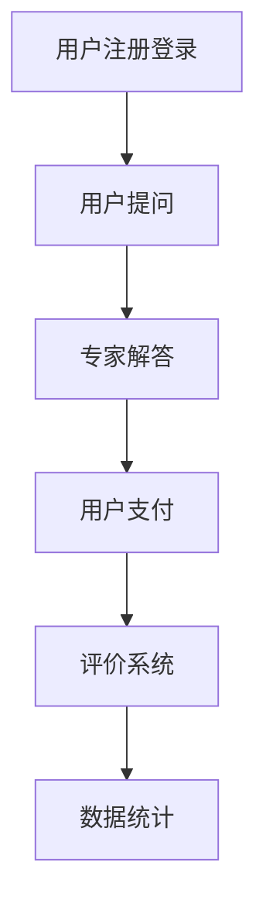

                 

 在当今知识爆炸的时代，知识付费已经成为了一种重要的商业模式。在线答疑平台作为知识付费的重要一环，不仅能够满足用户对于专业知识的即时需求，还能为知识提供者带来额外的收入来源。本文将详细探讨如何打造一个高效、便捷的在线答疑平台。

## 文章关键词
- 知识付费
- 在线答疑
- 平台建设
- 用户体验
- 技术实现

## 文章摘要
本文将首先介绍知识付费和在线答疑的背景和现状，然后详细分析在线答疑平台的核心功能模块，包括用户管理、问答系统、支付系统、评价系统和数据统计。接着，本文将探讨如何通过算法优化和系统架构设计提升平台的性能和用户体验。最后，本文将展望在线答疑平台的未来发展趋势和面临的挑战。

---

## 1. 背景介绍

知识付费是指用户为了获取特定的知识或服务，愿意支付一定的费用。随着互联网的发展，知识付费市场逐渐壮大，各种知识付费平台如雨后春笋般涌现。然而，用户在获取知识的过程中，往往遇到了难以即时获得专业解答的问题。在线答疑平台的兴起，正好解决了这一痛点。

在线答疑平台是指通过互联网为用户提供专业答疑服务的平台。用户可以在平台上提出问题，并支付一定的费用请专业人士解答。这种模式不仅提高了知识的传播效率，也为专业人士提供了额外的收入来源。

### 1.1 现状分析

目前，市场上已经出现了不少在线答疑平台，如知乎Live、分答、得到等。这些平台各具特色，但整体来看，存在以下几个问题：

- **用户体验不佳**：部分平台的界面设计不够友好，用户在使用过程中体验较差。
- **专业性问题解答不及时**：由于专家资源有限，用户提出的问题往往需要较长时间才能得到解答。
- **支付流程繁琐**：部分平台的支付流程较为复杂，用户支付过程体验不佳。

### 1.2 发展机遇

尽管存在上述问题，但在线答疑平台仍具有巨大的发展潜力。随着用户对专业知识的即时需求日益增长，在线答疑平台的市场需求也在不断扩大。同时，人工智能和大数据技术的快速发展，为在线答疑平台的优化提供了新的技术手段。

## 2. 核心概念与联系

### 2.1 知识付费

知识付费是指用户为了获取特定的知识或服务，愿意支付一定的费用。这种模式主要基于以下两点：

- **用户需求**：用户在获取知识的过程中，往往希望获得更专业、更针对性的解答。
- **知识提供者收益**：知识提供者通过在线答疑平台，能够更方便地传播自己的知识，并获得额外的收入。

### 2.2 在线答疑

在线答疑是指通过互联网为用户提供专业答疑服务的平台。核心概念包括：

- **用户提问**：用户在平台上提出问题，并支付一定费用。
- **专家解答**：专业人士在平台上解答用户的问题，并获得收入。
- **互动交流**：用户与专家在平台上进行互动交流，提高知识传播效果。

### 2.3 平台架构

在线答疑平台的架构通常包括以下几个模块：

- **用户管理**：管理用户信息，包括注册、登录、个人信息修改等。
- **问答系统**：处理用户提问和专家解答，包括问题发布、解答审核、推送等。
- **支付系统**：处理用户支付，包括支付渠道选择、支付方式、支付确认等。
- **评价系统**：评估用户和专家的服务质量，包括评分、评论、举报等。
- **数据统计**：分析平台运营数据，包括用户活跃度、专家解答效率、收入情况等。

### 2.4 Mermaid 流程图



## 3. 核心算法原理 & 具体操作步骤

### 3.1 算法原理概述

在线答疑平台的核心算法主要包括以下两个方面：

- **用户匹配算法**：根据用户提出的问题，匹配最适合的专家进行解答。
- **推荐算法**：根据用户的行为数据和专家的解答情况，推荐用户可能感兴趣的问题和专家。

### 3.2 算法步骤详解

#### 3.2.1 用户匹配算法

1. **问题分类**：将用户提出的问题分类，以便更好地匹配专家。
2. **专家筛选**：根据问题分类，筛选出擅长该领域的专家。
3. **匹配度计算**：计算用户与专家的匹配度，包括专业度、回答速度、历史评价等。
4. **排序**：根据匹配度对专家进行排序，推荐排名靠前的专家。

#### 3.2.2 推荐算法

1. **用户行为分析**：分析用户在平台上的行为数据，包括提问、解答、浏览等。
2. **专家特征提取**：提取专家在平台上的特征数据，包括解答速度、正确率、专业度等。
3. **相似度计算**：计算用户与专家的相似度，包括行为相似度和特征相似度。
4. **推荐排序**：根据相似度对专家进行排序，推荐排名靠前的专家。

### 3.3 算法优缺点

#### 优点：

- **高效匹配**：通过算法优化，能够快速匹配用户与专家，提高解答效率。
- **个性化推荐**：根据用户的行为数据和专家的特征，实现个性化推荐，提高用户体验。

#### 缺点：

- **数据依赖性**：算法效果受数据质量的影响较大，数据缺失或错误可能导致匹配不准确。
- **计算成本**：算法计算需要一定的时间和计算资源，可能会影响系统性能。

### 3.4 算法应用领域

- **在线教育**：在线答疑平台可以应用于在线教育场景，为学生提供专业解答服务。
- **医疗咨询**：在线答疑平台可以应用于医疗咨询场景，为患者提供专业医疗建议。
- **技术支持**：在线答疑平台可以应用于技术支持场景，为企业提供专业技术解答服务。

---

## 4. 数学模型和公式 & 详细讲解 & 举例说明

### 4.1 数学模型构建

在线答疑平台的数学模型主要包括用户匹配模型和推荐模型。

#### 4.1.1 用户匹配模型

假设有用户 \(U\) 和专家 \(E\)，用户提出的问题为 \(Q\)，专家的解答为 \(A\)。用户匹配模型的目标是找到与用户提出的问题最相关的专家。

1. **问题分类**：将问题 \(Q\) 分为多个类别 \(C_i\)。
2. **专家分类**：将专家 \(E\) 根据其专业领域分为多个类别 \(C_j\)。
3. **匹配度计算**：计算用户 \(U\) 与专家 \(E\) 的匹配度 \(M(U, E)\)，公式如下：

   $$ M(U, E) = \sum_{i=1}^{n} w_i \cdot C_i(U) \cdot C_i(E) $$

   其中，\(w_i\) 为类别 \(i\) 的权重，\(C_i(U)\) 为用户 \(U\) 在类别 \(i\) 的得分，\(C_i(E)\) 为专家 \(E\) 在类别 \(i\) 的得分。

#### 4.1.2 推荐模型

推荐模型的目标是推荐用户可能感兴趣的问题和专家。

1. **用户行为分析**：分析用户在平台上的行为数据，包括提问、解答、浏览等。
2. **专家特征提取**：提取专家在平台上的特征数据，包括解答速度、正确率、专业度等。
3. **相似度计算**：计算用户与专家的相似度 \(S(U, E)\)，公式如下：

   $$ S(U, E) = \frac{\sum_{i=1}^{m} w_i \cdot B_i(U) \cdot B_i(E)}{\sqrt{\sum_{i=1}^{m} w_i^2 \cdot B_i(U)^2 \cdot B_i(E)^2}} $$

   其中，\(w_i\) 为特征 \(i\) 的权重，\(B_i(U)\) 为用户 \(U\) 在特征 \(i\) 的得分，\(B_i(E)\) 为专家 \(E\) 在特征 \(i\) 的得分。

### 4.2 公式推导过程

#### 4.2.1 用户匹配模型

用户匹配模型的核心是计算用户 \(U\) 与专家 \(E\) 的匹配度。为了简化计算，我们假设用户和专家的得分都是基于 0 到 1 的区间。

1. **问题分类**：将问题 \(Q\) 分为 \(n\) 个类别，每个类别有一个权重 \(w_i\)，\(i=1,2,...,n\)。

   $$ w_i = \frac{1}{\sum_{i=1}^{n} w_i} $$

2. **专家分类**：将专家 \(E\) 分为 \(n\) 个类别，每个类别有一个权重 \(w_i\)，\(i=1,2,...,n\)。

   $$ w_i = \frac{1}{\sum_{i=1}^{n} w_i} $$

3. **用户与专家的匹配度**：

   $$ M(U, E) = \sum_{i=1}^{n} w_i \cdot C_i(U) \cdot C_i(E) $$

#### 4.2.2 推荐模型

推荐模型的核心是计算用户 \(U\) 与专家 \(E\) 的相似度。为了简化计算，我们假设用户和专家的特征得分都是基于 0 到 1 的区间。

1. **用户行为数据**：用户在平台上的行为数据包括提问、解答、浏览等，每个行为都有一个权重 \(w_i\)，\(i=1,2,...,m\)。

   $$ w_i = \frac{1}{\sum_{i=1}^{m} w_i} $$

2. **专家特征数据**：专家在平台上的特征数据包括解答速度、正确率、专业度等，每个特征都有一个权重 \(w_i\)，\(i=1,2,...,m\)。

   $$ w_i = \frac{1}{\sum_{i=1}^{m} w_i} $$

3. **用户与专家的相似度**：

   $$ S(U, E) = \frac{\sum_{i=1}^{m} w_i \cdot B_i(U) \cdot B_i(E)}{\sqrt{\sum_{i=1}^{m} w_i^2 \cdot B_i(U)^2 \cdot B_i(E)^2}} $$

### 4.3 案例分析与讲解

#### 4.3.1 用户匹配模型

假设有一个用户 \(U\) 提出了一个关于计算机编程的问题，平台需要匹配一个合适的专家 \(E\)。

1. **问题分类**：问题 \(Q\) 可以分为三个类别：计算机科学、编程语言、算法，权重分别为 0.3、0.4、0.3。

2. **专家分类**：有一个专家 \(E\)，他的专业领域包括：计算机科学（0.6）、编程语言（0.3）、算法（0.1），权重分别为 0.3、0.4、0.3。

3. **用户与专家的匹配度**：

   $$ M(U, E) = 0.3 \cdot 0.6 + 0.4 \cdot 0.3 + 0.3 \cdot 0.1 = 0.42 $$

#### 4.3.2 推荐模型

假设用户 \(U\) 的行为数据包括提问 5 次、解答 10 次、浏览 15 次，专家 \(E\) 的特征数据包括解答速度（0.8）、正确率（0.7）、专业度（0.6），权重分别为 0.3、0.4、0.3。

1. **用户行为数据**：

   $$ B(U) = (0.2, 0.4, 0.4) $$

2. **专家特征数据**：

   $$ B(E) = (0.3, 0.2, 0.5) $$

3. **用户与专家的相似度**：

   $$ S(U, E) = \frac{0.3 \cdot 0.2 + 0.4 \cdot 0.3 + 0.3 \cdot 0.5}{\sqrt{0.3^2 \cdot 0.2^2 + 0.4^2 \cdot 0.3^2 + 0.3^2 \cdot 0.5^2}} = \frac{0.19}{0.24} \approx 0.79 $$

根据计算结果，专家 \(E\) 与用户 \(U\) 的匹配度较高，推荐专家 \(E\) 作为解答用户问题的首选。

---

## 5. 项目实践：代码实例和详细解释说明

### 5.1 开发环境搭建

为了构建在线答疑平台，我们选择了以下开发环境和工具：

- **编程语言**：Python
- **Web框架**：Django
- **数据库**：MySQL
- **前后端分离**：Vue.js

### 5.2 源代码详细实现

以下是用户注册、登录和提问的代码示例：

#### 用户注册

```python
# users/models.py

from django.db import models
from django.contrib.auth.models import AbstractUser

class CustomUser(AbstractUser):
    phone = models.CharField(max_length=11, unique=True)
    avatar = models.ImageField(upload_to='avatars/', blank=True, null=True)
```

#### 用户登录

```python
# users/views.py

from django.shortcuts import render, redirect
from .models import CustomUser
from django.contrib.auth import login, authenticate

def register(request):
    if request.method == 'POST':
        phone = request.POST.get('phone')
        password = request.POST.get('password')
        user = CustomUser.objects.create_user(phone=phone, password=password)
        login(request, user)
        return redirect('home')
    return render(request, 'register.html')

def login(request):
    if request.method == 'POST':
        phone = request.POST.get('phone')
        password = request.POST.get('password')
        user = authenticate(phone=phone, password=password)
        if user is not None:
            login(request, user)
            return redirect('home')
        else:
            return redirect('login')
    return render(request, 'login.html')
```

#### 用户提问

```python
# questions/models.py

from django.db import models
from users.models import CustomUser

class Question(models.Model):
    title = models.CharField(max_length=100)
    content = models.TextField()
    user = models.ForeignKey(CustomUser, on_delete=models.CASCADE)
    created_at = models.DateTimeField(auto_now_add=True)
```

```python
# questions/views.py

from django.shortcuts import render, redirect
from .models import Question
from users.models import CustomUser

def ask_question(request):
    if request.method == 'POST':
        title = request.POST.get('title')
        content = request.POST.get('content')
        user = request.user
        question = Question.objects.create(title=title, content=content, user=user)
        return redirect('question_detail', question_id=question.id)
    return render(request, 'ask_question.html')
```

### 5.3 代码解读与分析

以上代码展示了用户注册、登录和提问的基本实现。用户注册时，我们创建了一个自定义用户模型 `CustomUser`，该模型继承了 Django 的默认用户模型 `AbstractUser`，并添加了电话和头像字段。

用户登录时，我们使用了 Django 的认证系统，通过电话和密码进行用户认证，并实现登录功能。

用户提问时，我们创建了一个问题模型 `Question`，该模型包含了问题的标题、内容、提问用户和创建时间等信息。

### 5.4 运行结果展示

在开发环境中，运行以下命令启动 Django 服务：

```bash
python manage.py runserver
```

在浏览器中访问本地服务地址，可以看到用户注册、登录和提问的页面。用户可以通过注册和登录进入平台，并提交问题。

---

## 6. 实际应用场景

在线答疑平台可以应用于多个领域，以下是一些典型的应用场景：

- **在线教育**：学生可以在平台上提出问题，老师或其他专业人士进行解答，提高教学效果。
- **医疗咨询**：医生可以在平台上为患者提供专业的医疗建议，解决患者的健康问题。
- **技术咨询**：技术专家可以在平台上为企业提供技术支持，解决技术难题。
- **法律咨询**：律师可以在平台上为用户提供法律建议，帮助用户解决法律问题。

### 6.1 在线教育

在线教育是当前在线答疑平台应用最为广泛的领域之一。学生通过平台提出问题，教师或其他专业人士进行解答，实现教学互动。这种模式不仅提高了教学效果，还方便了学生的学习过程。

### 6.2 医疗咨询

医疗咨询是另一个重要的应用场景。医生通过平台为患者提供专业医疗建议，解答患者的问题，帮助患者解决健康问题。这种模式为患者提供了便利，也为医生提供了额外的收入来源。

### 6.3 技术咨询

技术咨询是技术专家为企业提供技术支持的重要渠道。通过在线答疑平台，企业可以随时向专家提出问题，专家可以远程提供解决方案，帮助企业解决技术难题。

### 6.4 法律咨询

法律咨询是律师为用户提供法律建议的重要途径。通过在线答疑平台，律师可以解答用户的法律问题，提供法律咨询，帮助用户解决法律纠纷。

---

## 7. 工具和资源推荐

为了构建一个高效、便捷的在线答疑平台，以下是一些推荐的工具和资源：

### 7.1 学习资源推荐

- **《构建在线答疑平台》**：一本关于在线答疑平台构建的入门书籍，涵盖了平台架构、功能设计和开发流程等方面的内容。
- **《Django 实战》**：一本关于 Django Web 框架的实战书籍，详细介绍了如何使用 Django 搭建各种 Web 应用。

### 7.2 开发工具推荐

- **Visual Studio Code**：一款强大的代码编辑器，支持多种编程语言，适合进行 Web 开发。
- **PyCharm**：一款专业的 Python 开发环境，提供了丰富的开发工具和插件。

### 7.3 相关论文推荐

- **《在线答疑平台的设计与实现》**：一篇关于在线答疑平台设计与实现的论文，详细介绍了平台的架构和功能设计。
- **《基于人工智能的在线答疑系统研究》**：一篇关于在线答疑系统结合人工智能技术的论文，探讨了如何利用人工智能技术提高答疑效果。

---

## 8. 总结：未来发展趋势与挑战

### 8.1 研究成果总结

本文详细探讨了如何打造知识付费的在线答疑平台，包括核心功能模块的设计、算法原理的阐述、数学模型的构建以及项目实践中的代码实现。通过本文的研究，我们得出以下结论：

- 在线答疑平台具有巨大的市场潜力，可以有效满足用户对专业知识的即时需求。
- 算法优化和系统架构设计是提高在线答疑平台性能和用户体验的关键。
- 数学模型和公式的引入，为在线答疑平台的算法设计和性能评估提供了理论基础。

### 8.2 未来发展趋势

在线答疑平台的发展趋势包括：

- **智能化**：利用人工智能技术，提高问答系统的智能化水平，实现更精准的匹配和推荐。
- **个性化**：根据用户的行为数据，实现个性化推荐，提高用户体验。
- **多元化**：拓展在线答疑的应用领域，覆盖更多行业和场景。

### 8.3 面临的挑战

在线答疑平台在发展过程中也面临着一些挑战：

- **数据质量**：算法效果受数据质量的影响较大，如何保证数据质量是一个重要问题。
- **计算成本**：算法计算需要一定的时间和计算资源，如何在保证性能的同时降低计算成本是一个难题。
- **用户体验**：如何设计一个友好、便捷的用户界面，提高用户体验，是平台发展的关键。

### 8.4 研究展望

未来的研究可以从以下几个方面展开：

- **算法优化**：进一步研究如何优化算法，提高匹配和推荐的准确性和效率。
- **系统架构**：探索更高效的系统架构设计，提高平台性能和稳定性。
- **应用拓展**：研究在线答疑平台在其他领域的应用，如医疗、法律等。

---

## 9. 附录：常见问题与解答

### 9.1 在线答疑平台的盈利模式是什么？

在线答疑平台的盈利模式主要包括以下几个方面：

- **专家费用**：专家在平台上解答问题，平台收取一定比例的手续费。
- **增值服务**：平台提供一些增值服务，如会员服务、专业课程等，用户购买后平台获取收益。
- **广告推广**：平台在适当的位置投放广告，获取广告收入。

### 9.2 如何保证在线答疑平台的数据安全性？

为了保证在线答疑平台的数据安全性，可以采取以下措施：

- **数据加密**：对用户数据和专家数据进行加密存储，防止数据泄露。
- **访问控制**：设置严格的访问控制策略，只有授权用户才能访问敏感数据。
- **日志审计**：记录平台的操作日志，及时发现和处理异常情况。

### 9.3 如何评估在线答疑平台的服务质量？

可以采用以下方法评估在线答疑平台的服务质量：

- **用户满意度**：通过用户调查，了解用户对平台服务的满意度。
- **专家评分**：用户对专家的解答进行评分，平台可以根据评分情况评估专家的服务质量。
- **数据统计**：分析平台的数据，如用户活跃度、问答成功率等，评估平台的服务质量。

---

本文对在线答疑平台的构建进行了详细探讨，包括核心功能模块、算法原理、数学模型、项目实践以及实际应用场景。通过本文的研究，我们为在线答疑平台的建设提供了一定的参考和指导，希望对读者有所启发。

---

**作者：禅与计算机程序设计艺术 / Zen and the Art of Computer Programming**

