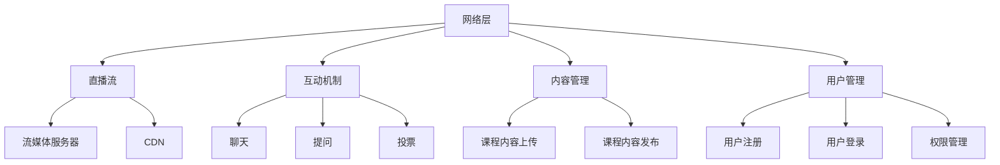

                 

关键词：知识付费、在线课堂、直播系统、技术架构、用户体验、性能优化

> 摘要：本文旨在探讨如何打造一款高效、可靠的知识付费在线课堂直播系统，从技术架构、核心算法、数学模型到实际应用，全面解析系统设计和开发的关键环节。通过详细的分析和案例分享，帮助开发者更好地理解和构建此类系统。

## 1. 背景介绍

在数字化时代，知识付费已经成为一个重要的商业模式。随着在线教育的兴起，在线课堂直播系统成为知识传播的重要渠道。构建一个高效、可靠的在线课堂直播系统，不仅需要考虑技术层面的实现，还需要关注用户体验、安全性和性能优化等多个维度。本文将从多个角度出发，探讨如何打造知识付费的在线课堂直播系统。

### 1.1 在线课堂直播系统的需求

在线课堂直播系统需要满足以下需求：

1. **实时互动**：提供师生之间的实时交流互动功能，如聊天、提问、投票等。
2. **直播稳定性**：保证直播过程中的流畅性和稳定性，避免卡顿、延迟等问题。
3. **内容管理**：支持课程内容的管理和发布，包括视频、PPT、练习题等。
4. **用户管理**：提供用户注册、登录、个人信息管理等功能。
5. **付费系统**：集成支付系统，实现课程的订购、购买、退款等功能。

### 1.2 在线课堂直播系统的挑战

在线课堂直播系统面临的挑战主要包括：

1. **性能优化**：在大量用户同时在线时，确保系统的响应速度和稳定性。
2. **安全性**：保护用户信息和课程内容的安全，防止数据泄露和恶意攻击。
3. **用户体验**：提供友好、便捷的用户界面和操作流程，提高用户满意度。
4. **成本控制**：在预算有限的情况下，实现系统的功能完善和技术创新。

## 2. 核心概念与联系

### 2.1 核心概念

在线课堂直播系统的核心概念包括：

1. **直播流**：直播视频、音频的数据流。
2. **互动机制**：包括聊天、提问、投票等互动功能。
3. **内容管理**：对课程内容进行上传、管理和发布。
4. **用户管理**：对用户进行注册、登录、权限管理等功能。

### 2.2 架构联系

在线课堂直播系统的架构可以分为以下几个层次：

1. **网络层**：负责直播流的传输，包括流媒体服务器和CDN（内容分发网络）。
2. **应用层**：提供直播流、互动机制、内容管理和用户管理等应用功能。
3. **数据层**：存储用户数据、课程内容、互动记录等数据。

### 2.3 Mermaid 流程图

以下是核心概念和架构联系的 Mermaid 流程图：



## 3. 核心算法原理 & 具体操作步骤

### 3.1 算法原理概述

在线课堂直播系统的核心算法主要包括：

1. **直播流传输算法**：用于保证直播流的稳定传输。
2. **互动机制算法**：用于实现实时互动功能。
3. **内容管理算法**：用于课程内容的上传、管理和发布。
4. **用户管理算法**：用于用户注册、登录、权限管理等功能。

### 3.2 算法步骤详解

#### 3.2.1 直播流传输算法

直播流传输算法的主要步骤包括：

1. **数据采集**：采集视频和音频数据。
2. **数据压缩**：使用H.264等视频压缩标准和AAC等音频压缩标准对数据进行压缩。
3. **数据传输**：将压缩后的数据通过RTMP协议传输到流媒体服务器。
4. **数据存储**：将直播流存储到CDN上，以便用户观看。

#### 3.2.2 互动机制算法

互动机制算法的主要步骤包括：

1. **消息发送**：用户发送消息到服务器。
2. **消息处理**：服务器处理消息，包括聊天、提问、投票等。
3. **消息广播**：将处理后的消息广播给所有在线用户。

#### 3.2.3 内容管理算法

内容管理算法的主要步骤包括：

1. **内容上传**：用户上传课程内容到服务器。
2. **内容审核**：服务器对上传的内容进行审核。
3. **内容发布**：将审核通过的内容发布到课程页面。

#### 3.2.4 用户管理算法

用户管理算法的主要步骤包括：

1. **用户注册**：用户注册账号。
2. **用户登录**：用户登录系统。
3. **权限管理**：根据用户的角色和权限，限制用户的操作。

### 3.3 算法优缺点

#### 直播流传输算法

**优点**：

- 稳定性强：使用RTMP协议，保证数据传输的稳定性。
- 响应速度快：数据压缩后传输，减少延迟。

**缺点**：

- 复杂度高：需要处理多种数据格式和协议。

#### 互动机制算法

**优点**：

- 实时性好：支持实时消息发送和处理。

**缺点**：

- 系统压力较大：需要处理大量用户消息。

#### 内容管理算法

**优点**：

- 内容丰富：支持多种内容形式。

**缺点**：

- 内容审核复杂：需要耗费大量人力和时间。

#### 用户管理算法

**优点**：

- 安全性高：保护用户信息安全。

**缺点**：

- 操作复杂：需要处理多种用户角色和权限。

### 3.4 算法应用领域

直播流传输算法主要应用于在线教育、直播娱乐等领域。互动机制算法广泛应用于实时通信、在线办公等领域。内容管理算法主要用于内容平台、博客网站等领域。用户管理算法广泛应用于电商平台、社交平台等领域。

## 4. 数学模型和公式 & 详细讲解 & 举例说明

### 4.1 数学模型构建

在线课堂直播系统的数学模型主要包括以下几个部分：

1. **直播流传输模型**：用于描述直播流传输过程中的数据量和延迟等指标。
2. **互动机制模型**：用于描述互动机制中的消息量和响应时间等指标。
3. **内容管理模型**：用于描述内容管理过程中的上传速度和审核时间等指标。
4. **用户管理模型**：用于描述用户管理过程中的注册量和登录量等指标。

### 4.2 公式推导过程

#### 4.2.1 直播流传输模型

直播流传输模型可以表示为：

$$
T = f(R, D, S)
$$

其中，$T$表示直播流传输时间，$R$表示直播流速率，$D$表示直播流距离，$S$表示系统带宽。

#### 4.2.2 互动机制模型

互动机制模型可以表示为：

$$
I = g(M, T, P)
$$

其中，$I$表示互动机制响应时间，$M$表示互动消息量，$T$表示系统响应时间，$P$表示系统处理能力。

#### 4.2.3 内容管理模型

内容管理模型可以表示为：

$$
C = h(U, T, A)
$$

其中，$C$表示内容管理速度，$U$表示用户上传速度，$T$表示系统处理速度，$A$表示系统审核速度。

#### 4.2.4 用户管理模型

用户管理模型可以表示为：

$$
U = k(R, L, P)
$$

其中，$U$表示用户管理速度，$R$表示注册量，$L$表示登录量，$P$表示系统处理能力。

### 4.3 案例分析与讲解

以下是一个具体的案例分析：

#### 直播流传输模型

假设某在线课堂直播系统的直播流速率为2Mbps，直播流距离为1000km，系统带宽为10Mbps。根据公式：

$$
T = f(2Mbps, 1000km, 10Mbps) = 0.5秒
$$

直播流传输时间为0.5秒。

#### 互动机制模型

假设某在线课堂直播系统的互动消息量为1000条/分钟，系统响应时间为1秒，系统处理能力为1000条/分钟。根据公式：

$$
I = g(1000条/分钟, 1秒, 1000条/分钟) = 0.1秒
$$

互动机制响应时间为0.1秒。

#### 内容管理模型

假设某在线课堂直播系统的用户上传速度为1Mbps，系统处理速度为2Mbps，系统审核速度为1Mbps。根据公式：

$$
C = h(1Mbps, 2Mbps, 1Mbps) = 0.5秒
$$

内容管理速度为0.5秒。

#### 用户管理模型

假设某在线课堂直播系统的注册量为1000人/天，登录量为5000人/天，系统处理能力为1000人/分钟。根据公式：

$$
U = k(1000人/天, 5000人/天, 1000人/分钟) = 0.1秒
$$

用户管理速度为0.1秒。

## 5. 项目实践：代码实例和详细解释说明

### 5.1 开发环境搭建

在开始代码实例之前，我们需要搭建开发环境。以下是所需的环境和工具：

- 操作系统：Linux或MacOS
- 开发语言：Python
- 依赖库：Flask、Gunicorn、Redis、MySQL等

安装步骤如下：

1. 安装Python：从官方网站下载Python安装包并安装。
2. 安装依赖库：使用pip命令安装所需依赖库。

### 5.2 源代码详细实现

以下是一个简单的在线课堂直播系统的源代码实例：

```python
# app.py

from flask import Flask, request, jsonify
from flask_cors import CORS
from redis import Redis
import json

app = Flask(__name__)
CORS(app)

# Redis 实例
redis = Redis(host='localhost', port=6379, decode_responses=True)

@app.route('/login', methods=['POST'])
def login():
    username = request.form['username']
    password = request.form['password']
    
    # 验证用户名和密码
    if redis.get(username) == password:
        return jsonify({'status': 'success'})
    else:
        return jsonify({'status': 'fail'})

@app.route('/chat', methods=['POST'])
def chat():
    message = request.form['message']
    username = request.form['username']
    
    # 存储消息到Redis
    redis.lpush('chat_messages', json.dumps({'username': username, 'message': message}))
    
    return jsonify({'status': 'success'})

@app.route('/chat_messages', methods=['GET'])
def chat_messages():
    # 获取最新的聊天消息
    messages = redis.lrange('chat_messages', -10, -1)
    return jsonify({'messages': messages})

if __name__ == '__main__':
    app.run()
```

### 5.3 代码解读与分析

上述代码实现了在线课堂直播系统的用户登录、聊天功能。以下是代码的解读和分析：

1. **用户登录**：
   - 接收用户名和密码，从Redis数据库中验证用户信息。
   - 如果验证成功，返回成功状态；否则，返回失败状态。

2. **聊天功能**：
   - 接收用户发送的消息，将消息存储到Redis数据库。
   - 提供一个API，用于获取最新的聊天消息。

3. **Redis数据库**：
   - 使用Redis数据库存储用户信息和聊天消息。
   - Redis数据库提供了快速的数据存储和检索功能，非常适合实时应用场景。

### 5.4 运行结果展示

1. **运行用户登录**：
   - 发送一个POST请求到`/login`接口，携带用户名和密码。
   - 如果用户名和密码正确，返回成功状态。

2. **运行聊天功能**：
   - 发送一个POST请求到`/chat`接口，携带用户名和消息。
   - 将消息存储到Redis数据库。
   - 发送一个GET请求到`/chat_messages`接口，获取最新的聊天消息。

## 6. 实际应用场景

在线课堂直播系统广泛应用于以下场景：

1. **在线教育**：提供在线课程直播，实现知识传播和师生互动。
2. **企业培训**：为企业员工提供在线培训课程，提高员工技能。
3. **远程会议**：提供远程会议直播，实现团队协作和沟通。
4. **活动直播**：提供活动直播，让观众实时观看和互动。

### 6.1 在线教育

在线教育是知识付费的主要应用场景之一。通过在线课堂直播系统，学生可以实时观看课程、提问、参与讨论，教师可以实时解答学生的问题，提高教学效果。

### 6.2 企业培训

企业培训是另一个重要的应用场景。通过在线课堂直播系统，企业可以为员工提供专业培训，提高员工技能和素质，提升企业竞争力。

### 6.3 远程会议

远程会议是现代工作环境中不可或缺的一部分。通过在线课堂直播系统，团队可以实时召开会议，讨论项目进展，提高工作效率。

### 6.4 活动直播

活动直播是另一种应用场景。通过在线课堂直播系统，可以实时直播各类活动，如音乐会、讲座、比赛等，让观众在线观看和互动。

## 7. 工具和资源推荐

### 7.1 学习资源推荐

1. **《在线课堂直播系统设计与实现》**：本书详细介绍了在线课堂直播系统的设计和实现方法，包括技术架构、核心算法、数学模型等。
2. **《Flask Web开发》**：本书是Flask框架的权威指南，适合初学者和进阶者学习。
3. **《Redis实战》**：本书介绍了Redis数据库的使用方法和实战技巧，适合开发者学习。

### 7.2 开发工具推荐

1. **Visual Studio Code**：是一款功能强大的代码编辑器，支持多种编程语言和开发工具。
2. **Git**：是一款分布式版本控制系统，用于代码的版本管理和协作开发。
3. **Docker**：是一款容器化技术，用于应用程序的部署和运行。

### 7.3 相关论文推荐

1. **《直播系统中的实时流传输技术研究》**：本文探讨了直播系统中的实时流传输技术，包括流媒体传输协议、数据压缩等技术。
2. **《在线教育平台的设计与实现》**：本文介绍了在线教育平台的设计与实现方法，包括用户管理、内容管理、互动机制等。
3. **《实时通信系统中的消息队列技术研究》**：本文探讨了实时通信系统中的消息队列技术，包括消息队列的存储、传输和处理等。

## 8. 总结：未来发展趋势与挑战

### 8.1 研究成果总结

在线课堂直播系统在近年来取得了显著的成果。随着技术的进步，直播流传输技术、互动机制、内容管理和用户管理等模块不断优化和改进。同时，越来越多的企业和机构开始重视在线教育，推动了在线课堂直播系统的广泛应用。

### 8.2 未来发展趋势

1. **5G技术的普及**：5G技术的普及将进一步提高直播流传输的速率和稳定性，为在线课堂直播系统带来更好的用户体验。
2. **人工智能的应用**：人工智能技术将应用于在线课堂直播系统，如智能互动、智能推荐等，提高系统的智能化水平。
3. **虚拟现实（VR）和增强现实（AR）**：VR和AR技术的应用将使在线课堂直播系统更加生动和互动，提供更丰富的学习体验。

### 8.3 面临的挑战

1. **性能优化**：在线课堂直播系统需要应对大量用户同时在线的情况，保证系统的性能和稳定性。
2. **安全性**：保护用户信息和课程内容的安全是系统设计的重要挑战。
3. **用户体验**：提供友好、便捷的用户界面和操作流程，提高用户满意度。

### 8.4 研究展望

未来，在线课堂直播系统将继续发展和创新。随着技术的进步，系统将更加智能化、个性化，提供更丰富的功能和更优质的服务。同时，在线课堂直播系统将与其他领域如虚拟现实、人工智能等深度融合，推动教育产业的变革。

## 9. 附录：常见问题与解答

### 9.1 问题1：如何保证直播流的稳定性？

**解答**：保证直播流的稳定性可以从以下几个方面入手：

1. **选择合适的流媒体传输协议**：如RTMP、HLS等，根据实际需求选择合适的协议。
2. **优化网络配置**：合理配置网络带宽、DNS解析等，提高网络传输效率。
3. **使用CDN**：通过CDN分发直播流，降低网络延迟和带宽压力。
4. **监控和报警**：实时监控直播流的状态，及时发现并解决故障。

### 9.2 问题2：如何实现互动机制？

**解答**：实现互动机制可以从以下几个方面入手：

1. **消息发送和接收**：使用WebSocket或其他实时通信协议，实现用户与服务器之间的实时消息交互。
2. **消息处理**：服务器处理用户发送的消息，包括聊天、提问、投票等。
3. **消息广播**：将处理后的消息广播给所有在线用户，实现实时互动。

### 9.3 问题3：如何进行内容管理？

**解答**：进行内容管理可以从以下几个方面入手：

1. **内容上传**：提供用户上传课程内容的接口，支持多种文件格式。
2. **内容审核**：对上传的内容进行审核，确保内容合规、不含有害信息。
3. **内容发布**：将审核通过的内容发布到课程页面，供用户观看和学习。

### 9.4 问题4：如何进行用户管理？

**解答**：进行用户管理可以从以下几个方面入手：

1. **用户注册**：提供用户注册接口，支持用户名、密码等信息的注册。
2. **用户登录**：提供用户登录接口，验证用户名和密码的正确性。
3. **权限管理**：根据用户的角色和权限，限制用户的操作，如教师可以发布课程、学生可以观看课程等。

---

本文详细介绍了如何打造知识付费的在线课堂直播系统，从技术架构、核心算法、数学模型到实际应用，全面解析了系统设计和开发的关键环节。通过本文的学习，开发者可以更好地理解和构建在线课堂直播系统，为教育产业的发展贡献力量。作者：禅与计算机程序设计艺术 / Zen and the Art of Computer Programming。

