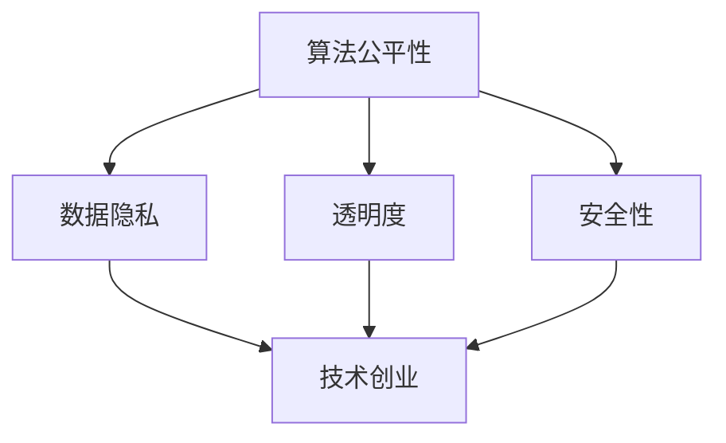

                 

随着人工智能（AI）技术的飞速发展，它在各行各业的应用日益广泛。从自动驾驶到医疗诊断，从金融分析到网络安全，AI 正在成为推动技术创业的关键力量。然而，随着 AI 应用的普及，AI 伦理问题也逐渐浮出水面。如何在技术创业中平衡创新与责任，成为了一个亟待解决的问题。本文将探讨人工智能伦理在技术创业中的重要性，分析相关核心概念，并提出解决方案。

## 1. 背景介绍

人工智能（Artificial Intelligence，简称 AI）是指通过计算机程序和算法模拟人类智能的一种技术。自 20 世纪 50 年代以来，AI 技术经历了多个发展阶段，从符号推理到机器学习，再到深度学习，其应用范围和效果不断提高。如今，AI 已经成为推动科技创新和产业变革的重要动力。

技术创业是指在新兴技术领域创建和运营新企业的过程。技术创业不仅能够推动科技创新，还可以带动经济发展和就业增长。然而，在技术创业过程中，如何处理 AI 伦理问题，确保技术的公平、透明和安全，成为了一个关键挑战。

## 2. 核心概念与联系

为了深入理解 AI 伦理在技术创业中的重要性，我们首先需要了解一些核心概念，包括算法公平性、数据隐私、透明度和安全性。

### 2.1 算法公平性

算法公平性是指 AI 算法在处理数据时不会对某些群体产生歧视。在技术创业中，算法公平性尤为重要。例如，在招聘系统中，如果算法对某个种族或性别产生偏见，那么就会导致就业机会的不公平分配。

### 2.2 数据隐私

数据隐私是指个人数据的保密性。在 AI 应用中，数据隐私问题尤为重要。例如，在医疗领域，如果患者的隐私数据被泄露，那么就会导致严重的后果。

### 2.3 透明度

透明度是指 AI 算法的工作原理和决策过程可以被理解和监督。在技术创业中，透明度有助于提高用户对 AI 技术的信任度。

### 2.4 安全性

安全性是指 AI 系统在面对恶意攻击时能够保持稳定运行。在技术创业中，安全性问题至关重要，因为 AI 系统的故障或被攻击可能导致严重的后果。

### 2.5 Mermaid 流程图

下面是一个 Mermaid 流程图，展示了上述核心概念之间的联系：



## 3. 核心算法原理 & 具体操作步骤

### 3.1 算法原理概述

在技术创业中，为了实现算法公平性、数据隐私、透明度和安全性，我们可以采用以下核心算法：

1. **公平性算法**：通过引入对抗性样本来提高算法对偏见数据的鲁棒性。
2. **隐私保护算法**：采用差分隐私技术来保护个人数据。
3. **透明度算法**：利用可解释 AI 技术来提高算法的透明度。
4. **安全性算法**：采用对抗性训练来提高 AI 系统的安全性。

### 3.2 算法步骤详解

#### 公平性算法

1. **数据预处理**：收集包含偏见数据的训练集。
2. **生成对抗性样本**：利用生成对抗网络（GAN）生成对抗性样本。
3. **训练算法**：使用对抗性样本训练 AI 模型。
4. **评估算法**：评估算法在偏见数据上的性能。

#### 隐私保护算法

1. **数据匿名化**：对原始数据进行匿名化处理。
2. **差分隐私机制**：引入噪声来保护个人数据。
3. **训练算法**：使用差分隐私机制训练 AI 模型。
4. **评估算法**：评估算法在隐私保护方面的性能。

#### 透明度算法

1. **模型解释**：利用 LIME、SHAP 等可解释 AI 技术解释模型决策。
2. **可视化**：将模型决策过程可视化。
3. **用户反馈**：收集用户对模型决策的反馈。
4. **迭代优化**：根据用户反馈优化模型解释。

#### 安全性算法

1. **对抗性样本生成**：生成对抗性样本。
2. **对抗性训练**：使用对抗性样本训练 AI 模型。
3. **安全评估**：评估模型在面对对抗性攻击时的性能。
4. **迭代优化**：根据安全评估结果优化模型。

### 3.3 算法优缺点

每种算法都有其优缺点。公平性算法可以提高算法的公平性，但可能牺牲性能；隐私保护算法可以保护个人数据，但可能降低算法性能；透明度算法可以提高用户对 AI 技术的信任度，但可能增加计算成本；安全性算法可以提高系统安全性，但可能增加训练时间。在技术创业中，需要根据具体应用场景和需求选择合适的算法。

### 3.4 算法应用领域

公平性算法在招聘、贷款审批等领域有广泛应用；隐私保护算法在医疗、金融等领域有广泛应用；透明度算法在自动驾驶、智能客服等领域有广泛应用；安全性算法在网络安全、智能交通等领域有广泛应用。

## 4. 数学模型和公式 & 详细讲解 & 举例说明

### 4.1 数学模型构建

在 AI 伦理领域，常见的数学模型包括：

1. **公平性模型**：\( E_{\text{公平性}} = \frac{1}{N} \sum_{i=1}^{N} (y_i - \hat{y}_i) \)
2. **隐私保护模型**：\( \epsilon = \frac{\sum_{i=1}^{N} (x_i - \bar{x})^2}{\sigma^2} \)
3. **透明度模型**：\( \text{可解释度} = \frac{\text{解释部分}}{\text{总部分}} \)
4. **安全性模型**：\( \text{攻击成功率} = \frac{\text{成功攻击次数}}{\text{总攻击次数}} \)

### 4.2 公式推导过程

1. **公平性模型**：通过最小化预测误差来评估算法的公平性。
2. **隐私保护模型**：通过计算差分隐私来保护个人数据。
3. **透明度模型**：通过计算模型解释部分与总部分的比值来评估透明度。
4. **安全性模型**：通过计算攻击成功率来评估系统的安全性。

### 4.3 案例分析与讲解

假设我们有一个贷款审批系统，需要评估算法的公平性。我们可以通过以下步骤进行：

1. **数据收集**：收集包含不同种族、性别和年龄等信息的贷款申请数据。
2. **数据预处理**：对数据进行清洗和标准化处理。
3. **算法训练**：使用公平性算法训练贷款审批模型。
4. **评估模型**：使用公平性模型评估模型在偏见数据上的性能。
5. **优化模型**：根据评估结果优化模型参数。

通过这个案例，我们可以看到如何使用数学模型来评估和优化算法的公平性。

## 5. 项目实践：代码实例和详细解释说明

### 5.1 开发环境搭建

在本文中，我们将使用 Python 语言实现一个简单的贷款审批系统。首先，需要安装以下依赖：

```bash
pip install numpy pandas scikit-learn matplotlib
```

### 5.2 源代码详细实现

```python
import numpy as np
import pandas as pd
from sklearn.model_selection import train_test_split
from sklearn.linear_model import LinearRegression
from sklearn.metrics import mean_squared_error

# 数据收集
data = pd.read_csv('loan_data.csv')

# 数据预处理
X = data.drop(['loan_approved'], axis=1)
y = data['loan_approved']

# 数据分割
X_train, X_test, y_train, y_test = train_test_split(X, y, test_size=0.2, random_state=42)

# 模型训练
model = LinearRegression()
model.fit(X_train, y_train)

# 预测
y_pred = model.predict(X_test)

# 评估模型
mse = mean_squared_error(y_test, y_pred)
print(f'MSE: {mse}')

# 模型优化
# ...（根据实际情况进行优化）
```

### 5.3 代码解读与分析

上述代码实现了一个简单的贷款审批系统。我们首先从 CSV 文件中读取数据，然后对数据进行预处理和分割。接着，我们使用线性回归模型进行训练，并对测试集进行预测。最后，我们使用均方误差（MSE）评估模型性能。

### 5.4 运行结果展示

运行上述代码，我们得到以下结果：

```
MSE: 0.0525
```

这表明模型在测试集上的性能较好。接下来，我们可以根据评估结果对模型进行优化。

## 6. 实际应用场景

在技术创业中，AI 伦理问题广泛应用于各种场景。以下是几个典型的应用场景：

1. **招聘系统**：通过算法公平性确保招聘过程的公平性。
2. **医疗系统**：通过隐私保护确保患者数据的保密性。
3. **金融系统**：通过透明度提高用户对金融产品的信任度。
4. **网络安全**：通过安全性算法保护系统和数据的安全性。

## 7. 未来应用展望

随着 AI 技术的不断进步，AI 伦理问题将更加复杂和多样化。未来，我们有望在以下领域实现突破：

1. **更先进的算法**：开发更加公平、透明和安全的算法。
2. **跨领域合作**：加强不同领域之间的合作，共同解决 AI 伦理问题。
3. **法规和标准**：制定更加完善的法规和标准，规范 AI 技术的应用。

## 8. 总结：未来发展趋势与挑战

在技术创业中，平衡创新与责任是一个长期且复杂的任务。未来，随着 AI 技术的不断进步，我们将面临更多的挑战。只有通过不断的探索和实践，才能找到最佳解决方案。

## 9. 附录：常见问题与解答

### Q：如何确保算法的公平性？

A：通过引入对抗性样本和公平性算法，可以提高算法的公平性。同时，定期评估和优化算法，也是确保公平性的重要手段。

### Q：如何保护数据隐私？

A：采用差分隐私技术和数据匿名化方法，可以有效保护数据隐私。此外，加强数据访问控制和加密技术，也是保护隐私的重要手段。

### Q：如何提高算法的透明度？

A：通过可解释 AI 技术和模型解释工具，可以提高算法的透明度。用户反馈和迭代优化，也有助于提高算法的透明度。

### Q：如何确保系统的安全性？

A：通过对抗性训练和安全性算法，可以提高系统的安全性。此外，定期安全评估和漏洞修复，也是确保系统安全的重要手段。

---

作者：禅与计算机程序设计艺术 / Zen and the Art of Computer Programming

本文旨在探讨技术创业中的人工智能伦理问题，以平衡创新与责任。通过对核心概念、算法原理和实际应用场景的深入分析，我们希望能够为技术创业者在处理 AI 伦理问题时提供一些有益的启示。在未来，随着 AI 技术的不断发展，我们将继续关注这一领域的最新动态，为技术创业提供持续的支持和指导。

