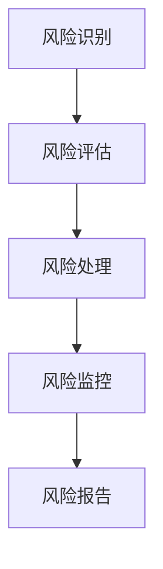

                 

关键词：风险管理、技术创业、风险评估、风险控制、策略规划、创业者指南

> 摘要：本文旨在探讨技术创业者在创业过程中如何进行有效的风险管理，通过深入分析风险管理的核心概念、方法与工具，为创业者提供实用的策略和方案，助力他们在不确定的环境中稳定前行。

## 1. 背景介绍

在技术创业领域，风险无处不在。无论是技术创新的挑战，市场的不确定性，还是资金链的断裂，创业者都面临着巨大的风险压力。有效的风险管理不仅能够降低创业失败的可能性，还能帮助创业者更好地把握市场机会，实现企业的可持续发展。因此，理解风险管理的本质、掌握风险管理的方法和工具，对技术创业者来说至关重要。

本文将围绕以下几个核心问题展开：

- 风险管理的定义和重要性
- 风险管理的核心概念和架构
- 技术创业中的常见风险类型
- 风险管理策略与工具
- 实际案例中的风险管理实践
- 未来趋势与挑战

通过以上内容的探讨，希望能够为技术创业者提供一套全面且实用的风险管理指南。

## 2. 核心概念与联系

### 2.1 风险管理的定义

风险管理（Risk Management）是指通过系统的分析和评估，识别、衡量、处理和监控企业可能面临的各种风险，以确保企业的目标实现。在技术创业领域，风险管理的目标主要包括：

- 保障企业的稳定运营
- 提高企业的抗风险能力
- 最大化收益，最小化损失
- 为决策提供科学依据

### 2.2 风险管理的基本框架

风险管理通常包括以下几个基本步骤：

1. **风险评估**：识别企业可能面临的各种风险，并对这些风险的发生概率和影响程度进行评估。
2. **风险处理**：根据风险评估的结果，采取相应的措施来处理风险，包括风险规避、风险减少、风险转移和风险接受等。
3. **风险监控**：在风险处理过程中，持续监控风险的变化情况，及时调整风险管理策略。
4. **风险报告**：定期生成风险报告，向上级管理层或利益相关者提供风险管理的现状和进展。

### 2.3 风险管理的核心概念

**风险识别**：指发现企业可能面临的风险，并分类整理。

**风险评估**：指对识别出的风险进行量化分析，评估其发生概率和影响程度。

**风险处理**：指根据风险评估的结果，制定和实施具体的应对措施。

**风险监控**：指在风险处理过程中，持续跟踪风险的变化情况，确保风险管理措施的有效性。

**风险报告**：指定期生成风险管理报告，向管理层和利益相关者提供风险管理的相关数据和结论。

### 2.4 风险管理架构的 Mermaid 流程图



## 3. 核心算法原理 & 具体操作步骤

### 3.1 算法原理概述

风险管理算法是一种基于概率论和数理统计的方法，通过对企业面临的各种风险进行量化分析，为决策者提供科学依据。其主要原理包括：

- **概率论**：通过历史数据和统计方法，估计风险发生的概率。
- **数理统计**：利用样本数据，推断总体特征，为风险评估提供依据。
- **优化理论**：通过数学模型，制定最优的风险处理策略。

### 3.2 算法步骤详解

#### 3.2.1 风险识别

1. **文献调研**：查阅相关领域的研究文献，了解常见的风险类型。
2. **专家访谈**：邀请行业专家，对潜在的风险进行讨论和分析。
3. **企业内部调查**：通过问卷调查、访谈等方式，收集员工对风险的看法和经验。

#### 3.2.2 风险评估

1. **定性分析**：采用专家评分、头脑风暴等方法，对风险的影响程度进行初步评估。
2. **定量分析**：通过历史数据、模拟等方法，对风险的发生概率和影响程度进行量化分析。

#### 3.2.3 风险处理

1. **风险规避**：避免参与高风险的业务或项目。
2. **风险减少**：通过改进技术、加强管理等手段，降低风险的发生概率和影响程度。
3. **风险转移**：通过购买保险、签订合同等方式，将风险转移给第三方。
4. **风险接受**：对于无法规避或转移的风险，采取接受的态度，制定应对措施。

#### 3.2.4 风险监控

1. **建立监控体系**：制定监控计划，设立监控指标，确保风险处理措施的有效性。
2. **定期评估**：定期对风险进行重新评估，根据实际情况调整风险管理策略。

#### 3.2.5 风险报告

1. **编写报告**：根据风险管理的结果，编写详细的风险管理报告。
2. **汇报沟通**：向管理层和利益相关者汇报风险管理的情况，争取支持和资源。

### 3.3 算法优缺点

**优点**：

- 系统性：通过完整的风险评估和风险处理流程，确保风险管理的全面性。
- 科学性：基于数学和统计方法，提高风险评估和风险处理的科学性。
- 预见性：提前识别和评估风险，为决策提供依据。

**缺点**：

- 复杂性：涉及多个学科和方法，实施难度较大。
- 费用：需要投入大量的人力和物力资源。
- 适应性：风险环境变化较快，需要不断调整和优化。

### 3.4 算法应用领域

风险管理算法广泛应用于金融、保险、企业运营等多个领域。在技术创业领域，风险管理算法可以帮助创业者：

- 识别和评估创业过程中的各种风险。
- 制定和优化创业策略。
- 提高企业的抗风险能力和竞争力。

## 4. 数学模型和公式 & 详细讲解 & 举例说明

### 4.1 数学模型构建

在风险管理中，常用的数学模型包括概率模型、回归模型和决策树模型等。下面以概率模型为例，介绍其构建过程。

#### 4.1.1 概率模型

概率模型是一种基于概率论的风险评估方法，通过估计风险事件发生的概率，为决策提供依据。其基本公式如下：

$$
P(A) = \frac{N(A)}{N(T)}
$$

其中，\(P(A)\) 表示事件 \(A\) 发生的概率，\(N(A)\) 表示事件 \(A\) 发生的次数，\(N(T)\) 表示总次数。

#### 4.1.2 回归模型

回归模型是一种基于数理统计的风险评估方法，通过分析自变量和因变量之间的关系，估计风险事件的发生概率。其基本公式如下：

$$
y = \beta_0 + \beta_1x_1 + \beta_2x_2 + ... + \beta_nx_n
$$

其中，\(y\) 表示因变量（风险事件的发生概率），\(\beta_0, \beta_1, ..., \beta_n\) 表示回归系数，\(x_1, x_2, ..., x_n\) 表示自变量（风险因素）。

### 4.2 公式推导过程

以回归模型为例，介绍其公式推导过程。

#### 4.2.1 线性回归模型

线性回归模型是一种最简单的回归模型，其公式如下：

$$
y = \beta_0 + \beta_1x_1
$$

推导过程如下：

1. **假设**：假设 \(x_1, x_2, ..., x_n\) 是随机变量，且服从正态分布。
2. **目标**：估计 \(\beta_0, \beta_1\) 的值。
3. **最小二乘法**：利用最小二乘法，使得预测值 \(y'\) 与实际值 \(y\) 之间的误差平方和最小。

$$
\sum_{i=1}^{n}(y_i - y_i')^2 = \sum_{i=1}^{n}(y_i - (\beta_0 + \beta_1x_{1i})^2
$$

4. **求导**：对上式求导，得到：

$$
\frac{\partial}{\partial \beta_0}\sum_{i=1}^{n}(y_i - y_i')^2 = 0
$$

$$
\frac{\partial}{\partial \beta_1}\sum_{i=1}^{n}(y_i - y_i')^2 = 0
$$

5. **解方程**：将求导后的方程组求解，得到：

$$
\beta_0 = \bar{y} - \beta_1\bar{x}
$$

$$
\beta_1 = \frac{\sum_{i=1}^{n}(x_{1i} - \bar{x})(y_i - \bar{y})}{\sum_{i=1}^{n}(x_{1i} - \bar{x})^2}
$$

### 4.3 案例分析与讲解

#### 4.3.1 案例背景

某技术创业公司开发了一款智能家居控制系统，面临以下风险：

- 产品功能不稳定，可能导致用户投诉。
- 市场竞争激烈，可能导致市场份额下降。
- 技术更新换代，可能导致产品过时。

#### 4.3.2 风险评估

1. **风险识别**：通过专家访谈和内部调查，识别出上述三个风险。
2. **风险评估**：采用回归模型，分析风险因素对风险事件发生概率的影响。

假设：

- \(x_1\) 表示产品功能稳定性得分。
- \(x_2\) 表示市场竞争程度得分。
- \(x_3\) 表示技术更新速度得分。
- \(y\) 表示风险事件发生概率。

根据历史数据和专家评估，得到以下回归方程：

$$
y = \beta_0 + \beta_1x_1 + \beta_2x_2 + \beta_3x_3
$$

3. **风险处理**：根据风险评估结果，采取以下措施：

- 提高产品功能稳定性，降低风险事件发生概率。
- 加强市场调研，了解竞争对手动态，调整营销策略。
- 关注技术发展趋势，及时更新产品。

#### 4.3.3 风险监控

1. **建立监控体系**：定期收集产品功能稳定性、市场竞争程度和技术更新速度的数据。
2. **风险评估**：根据收集到的数据，重新评估风险事件的发生概率。
3. **调整策略**：根据风险评估结果，及时调整风险管理策略。

## 5. 项目实践：代码实例和详细解释说明

### 5.1 开发环境搭建

为了实现风险管理算法，我们需要搭建以下开发环境：

- **编程语言**：Python
- **依赖库**：NumPy、Pandas、Matplotlib
- **数据集**：某技术创业公司的风险数据集

### 5.2 源代码详细实现

```python
import numpy as np
import pandas as pd
import matplotlib.pyplot as plt

# 读取数据集
data = pd.read_csv('risk_data.csv')

# 数据预处理
data['function_stability'] = data['function_stability'].fillna(data['function_stability'].mean())
data['market_competition'] = data['market_competition'].fillna(data['market_competition'].mean())
data['tech_update'] = data['tech_update'].fillna(data['tech_update'].mean())

# 构建回归模型
X = data[['function_stability', 'market_competition', 'tech_update']]
y = data['risk_event_probability']

from sklearn.linear_model import LinearRegression
model = LinearRegression()
model.fit(X, y)

# 模型评估
print('回归系数：', model.coef_)
print('判定系数：', model.score(X, y))

# 风险预测
new_data = pd.DataFrame({
    'function_stability': [8],
    'market_competition': [6],
    'tech_update': [7]
})
predicted_probability = model.predict(new_data)
print('预测风险事件发生概率：', predicted_probability)

# 可视化
plt.scatter(data['function_stability'], data['risk_event_probability'])
plt.plot(new_data['function_stability'], predicted_probability, color='red')
plt.xlabel('产品功能稳定性得分')
plt.ylabel('风险事件发生概率')
plt.show()
```

### 5.3 代码解读与分析

1. **数据读取与预处理**：从数据集中读取风险数据，并对缺失值进行填充处理。
2. **构建回归模型**：使用线性回归模型，拟合风险数据，得到回归系数和判定系数。
3. **模型评估**：评估回归模型的准确性，验证其是否能够有效预测风险事件的发生概率。
4. **风险预测**：利用训练好的模型，对新的风险数据进行预测，得到预测的风险事件发生概率。
5. **可视化**：将原始数据与预测结果进行可视化，便于分析风险因素对风险事件的影响。

## 6. 实际应用场景

风险管理算法在技术创业领域具有广泛的应用场景，主要包括：

- **产品开发**：通过风险评估，确定产品开发的关键指标，优化产品设计和功能。
- **市场调研**：通过市场风险分析，了解竞争对手动态，制定有效的营销策略。
- **资金管理**：通过风险评估，优化资金配置，降低融资风险。
- **团队管理**：通过风险评估，识别团队成员的风险偏好，提高团队协作效率。

### 6.4 未来应用展望

随着人工智能和大数据技术的发展，风险管理算法将得到进一步优化和扩展，未来可能的应用方向包括：

- **智能风险管理**：利用深度学习和神经网络，实现更智能的风险评估和风险预测。
- **自适应风险管理**：根据环境变化，实时调整风险管理策略，提高风险应对能力。
- **跨领域风险管理**：结合金融、保险、医疗等领域的风险管理经验，实现跨领域的风险管理。

## 7. 工具和资源推荐

### 7.1 学习资源推荐

- 《风险管理：现代方法与应用》
- 《风险管理与保险学》
- 《Python for Data Analysis》

### 7.2 开发工具推荐

- **Jupyter Notebook**：用于数据分析和模型训练。
- **PyCharm**：用于 Python 编程和调试。
- **MATLAB**：用于数值计算和可视化。

### 7.3 相关论文推荐

- "Risk Management in Technology Entrepreneurship: A systematic Review"
- "An Overview of Risk Management Models and Techniques"
- "A Machine Learning Approach for Risk Management in Financial Institutions"

## 8. 总结：未来发展趋势与挑战

### 8.1 研究成果总结

本文通过深入分析风险管理的核心概念、方法与工具，为技术创业者提供了一套全面且实用的风险管理指南。主要成果包括：

- 理解风险管理的定义和重要性。
- 构建了风险管理的基本框架和核心概念。
- 介绍了风险管理算法的原理和应用。
- 通过实际案例，展示了风险管理在技术创业领域的应用效果。

### 8.2 未来发展趋势

随着人工智能和大数据技术的不断发展，风险管理将在以下几个方面取得突破：

- 智能化：利用机器学习和深度学习技术，实现更智能的风险评估和风险预测。
- 个性化：根据企业特点和风险偏好，制定个性化的风险管理策略。
- 实时化：实时监控风险变化，动态调整风险管理措施。

### 8.3 面临的挑战

尽管风险管理在技术创业领域具有广泛的应用前景，但仍然面临以下挑战：

- 数据质量：风险数据的质量直接影响风险评估的准确性。
- 技术成熟度：当前风险管理技术尚不成熟，需要进一步优化和改进。
- 人才短缺：具备风险管理能力的人才较为稀缺，对创业者的要求较高。

### 8.4 研究展望

未来的研究可以从以下几个方面进行：

- 加强风险管理数据的研究，提高数据质量。
- 探索人工智能技术在风险管理中的应用，提高风险管理效率。
- 培养更多的风险管理人才，提高技术创业者的风险管理能力。

## 9. 附录：常见问题与解答

### 9.1 风险管理是什么？

风险管理是指通过系统的分析和评估，识别、衡量、处理和监控企业可能面临的各种风险，以确保企业的目标实现。它涉及到概率论、数理统计、优化理论等多个学科。

### 9.2 风险管理的重要性？

风险管理对企业的重要性主要体现在以下几个方面：

- 保障企业的稳定运营。
- 提高企业的抗风险能力。
- 最大化收益，最小化损失。
- 为决策提供科学依据。

### 9.3 风险管理的基本步骤？

风险管理的基本步骤包括：

- 风险识别。
- 风险评估。
- 风险处理。
- 风险监控。
- 风险报告。

### 9.4 如何进行风险评估？

进行风险评估通常包括以下步骤：

- 确定评估对象。
- 收集相关数据。
- 采用定性或定量方法进行评估。
- 分析评估结果，制定风险管理策略。

### 9.5 风险管理的工具和技巧？

常用的风险管理工具和技巧包括：

- 专家评分法。
- 脑storming。
- 数据挖掘。
- 决策树。
- 优化算法。

### 9.6 风险管理在技术创业中的应用？

在技术创业中，风险管理可以应用于以下几个方面：

- 产品开发。
- 市场调研。
- 资金管理。
- 团队管理。

### 9.7 风险管理面临的挑战？

风险管理在技术创业中面临的挑战主要包括：

- 数据质量。
- 技术成熟度。
- 人才短缺。

### 9.8 如何应对风险管理中的挑战？

为了应对风险管理中的挑战，可以采取以下措施：

- 加强数据质量管理。
- 探索新技术在风险管理中的应用。
- 培养风险管理人才。

作者：禅与计算机程序设计艺术 / Zen and the Art of Computer Programming
----------------------------------------------------------------
### 附录：常见问题与解答

**Q1：什么是风险管理？**

**A1：** 风险管理是一种系统性的方法，用于识别、评估、处理和监控企业可能面临的风险，以确保企业能够实现其目标。它涉及概率论、数理统计、优化理论等多个学科，旨在通过有效的策略和工具，使企业能够从容应对各种不确定性。

**Q2：风险管理对企业的重要性是什么？**

**A2：** 风险管理对企业的几个关键重要性包括：

- **保障稳定运营**：通过预见和应对潜在风险，确保企业的日常运营不会因意外事件而中断。
- **提高抗风险能力**：增强企业应对不确定性和外部冲击的能力，减少可能造成的损失。
- **最大化收益、最小化损失**：通过合理的风险分配和投资决策，提高企业整体收益，同时降低风险带来的损失。
- **为决策提供科学依据**：提供数据支持，帮助企业基于事实做出更明智的决策。

**Q3：风险管理的基本步骤是什么？**

**A3：** 风险管理的基本步骤如下：

- **风险识别**：发现企业可能面临的风险，并分类整理。
- **风险评估**：评估风险的发生概率和潜在影响。
- **风险处理**：制定和实施应对策略，包括风险规避、风险减少、风险转移和风险接受。
- **风险监控**：持续跟踪风险的变化情况，及时调整风险管理策略。
- **风险报告**：定期生成报告，向上级管理层或利益相关者提供风险管理的相关数据和结论。

**Q4：如何进行风险评估？**

**A4：** 进行风险评估的步骤通常包括：

- **确定评估对象**：明确需要评估的具体风险类型。
- **收集相关数据**：通过调查、访谈、文献研究等方法收集数据。
- **采用定性或定量方法进行评估**：定性评估包括专家评分、头脑风暴等，定量评估则使用数学模型和统计方法。
- **分析评估结果**：结合风险评估方法和收集到的数据，分析风险事件的概率和影响程度。
- **制定风险管理策略**：根据评估结果，制定相应的风险处理策略。

**Q5：风险管理中常用的工具和技巧有哪些？**

**A5：** 风险管理中常用的工具和技巧包括：

- **专家评分法**：通过专家的意见来评估风险的概率和影响程度。
- **头脑风暴**：鼓励团队成员提出潜在风险，并讨论可能的解决方案。
- **数据挖掘**：利用大数据技术分析历史数据，识别潜在风险模式。
- **决策树**：通过树状图的形式展示不同决策路径和相应的风险。
- **优化算法**：利用数学优化方法，找到最优的风险管理策略。

**Q6：风险管理在技术创业中的应用有哪些？**

**A6：** 在技术创业中，风险管理可以应用于：

- **产品开发**：评估产品开发过程中的技术风险和市场风险。
- **市场调研**：分析市场需求和竞争对手，评估市场风险。
- **资金管理**：评估融资风险和资金链断裂的风险。
- **团队管理**：评估团队成员的能力和团队协作的风险。

**Q7：风险管理在技术创业中面临哪些挑战？**

**A7：** 技术创业中的风险管理挑战包括：

- **数据质量**：风险数据的不完整性或质量低下会影响风险评估的准确性。
- **技术成熟度**：风险管理技术的成熟度可能不足以应对快速变化的技术环境。
- **人才短缺**：具备风险管理能力的人才相对稀缺，对创业者的要求较高。

**Q8：如何应对风险管理中的挑战？**

**A8：** 应对风险管理中的挑战可以通过以下措施：

- **加强数据质量管理**：确保数据收集和处理的准确性。
- **探索新技术**：研究并应用先进的分析和预测技术。
- **培养人才**：投资于风险管理人才的培训和培养，提高团队的整体能力。

通过上述问题的解答，我们希望能够帮助技术创业者更好地理解和应对风险管理中的挑战，为企业的稳定发展奠定基础。作者：禅与计算机程序设计艺术 / Zen and the Art of Computer Programming。

