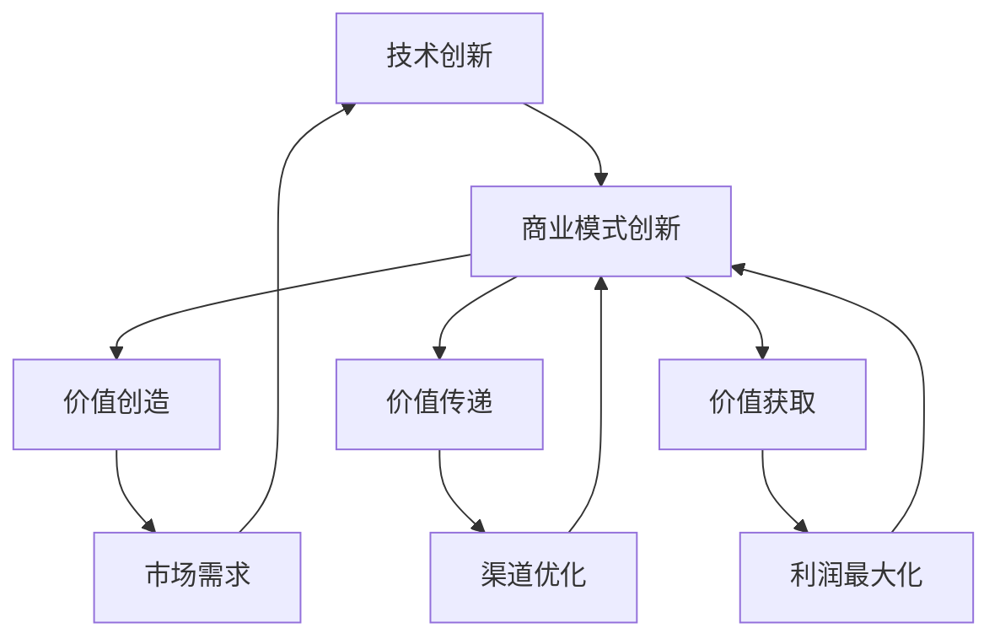

                 

关键字：技术创新、商业模式创新、创业、战略规划、行业趋势

摘要：本文探讨了技术创新与商业模式创新在创业过程中的关键作用，分析了二者结合的重要性以及如何有效实施。通过实际案例，本文总结了成功的关键要素，为创业者和企业提供了实用的指导。

## 1. 背景介绍

在当今全球化和数字化浪潮的背景下，技术创新已经成为企业竞争的核心。同时，商业模式创新也逐渐成为企业获取竞争优势的重要手段。然而，如何将技术创新与商业模式创新有效地结合起来，形成企业的核心竞争力，是创业者和企业管理者面临的重要课题。

### 技术创新

技术创新是指通过引入新技术、新产品或新服务，提升企业的生产效率、降低成本、提高市场竞争力。技术创新可以源自内部研发，也可以通过外部合作、并购等方式实现。在信息技术、生物技术、新能源技术等领域，技术创新的步伐正在不断加快，为企业提供了广阔的发展空间。

### 商业模式创新

商业模式创新是指通过重新定义价值创造、传递和获取的方式，实现企业利润最大化。商业模式创新可以是针对现有市场需求的优化，也可以是针对新市场机会的探索。成功的商业模式创新能够帮助企业实现从量变到质变的飞跃，从而在激烈的市场竞争中脱颖而出。

## 2. 核心概念与联系

为了更好地理解技术创新与商业模式创新的结合，我们首先需要了解它们的基本概念和相互关系。

### 技术创新的基本概念

技术创新主要包括以下几个阶段：

1. **概念验证**：确定新技术的可行性和潜在市场。
2. **研发**：通过实验室研究、原型设计等手段，逐步完善新技术。
3. **测试与优化**：在新产品或服务中测试新技术，并不断优化。
4. **商业化**：将新技术推向市场，实现规模化应用。

### 商业模式创新的基本概念

商业模式创新主要包括以下几个方面：

1. **价值创造**：通过技术创新或其他方式，为用户提供有价值的解决方案。
2. **价值传递**：通过有效的渠道和合作伙伴，将价值传递给用户。
3. **价值获取**：通过定价策略、收入模式等手段，实现利润最大化。

### 技术创新与商业模式创新的相互关系

技术创新与商业模式创新之间存在着紧密的相互关系。技术创新为商业模式创新提供了基础和动力，而商业模式创新则能够激发技术创新的潜力，实现二者的协同发展。

### Mermaid 流程图



## 3. 核心算法原理 & 具体操作步骤

### 3.1 算法原理概述

在技术创新与商业模式创新的结合过程中，核心算法原理起到了关键作用。该算法旨在通过数据分析和建模，识别潜在的市场机会，并制定相应的商业模式创新策略。

### 3.2 算法步骤详解

1. **数据收集与预处理**：收集与市场、用户、竞争对手相关的数据，并进行清洗和预处理，确保数据质量。
2. **市场分析与需求识别**：通过数据分析，识别市场需求和用户痛点，为商业模式创新提供依据。
3. **技术潜力评估**：评估现有技术储备和创新能力，确定哪些技术可以应用于商业模式创新。
4. **商业模式设计**：基于市场分析和技术评估，设计新的商业模式，包括价值创造、价值传递和价值获取策略。
5. **迭代与优化**：通过实际应用和反馈，不断迭代和优化商业模式，确保其可行性和竞争力。

### 3.3 算法优缺点

**优点**：

- **高效性**：通过数据分析和建模，快速识别市场机会，降低创业风险。
- **灵活性**：可以根据市场变化和技术进步，灵活调整商业模式。

**缺点**：

- **数据依赖性**：算法效果依赖于数据质量和数量，可能导致偏差。
- **实施难度**：需要跨部门合作和资源投入，实施难度较大。

### 3.4 算法应用领域

该算法主要应用于以下领域：

- **新兴技术创业**：识别潜在市场机会，设计新的商业模式。
- **企业转型**：通过商业模式创新，实现业务增长和转型。
- **产业升级**：推动传统产业向高端产业链升级。

## 4. 数学模型和公式 & 详细讲解 & 举例说明

### 4.1 数学模型构建

在技术创新与商业模式创新结合的过程中，我们可以构建以下数学模型：

1. **市场需求函数**：\(D(p, q) = f(p, q)\)，其中 \(p\) 为产品价格，\(q\) 为产品质量。
2. **技术潜力函数**：\(T(t) = g(t)\)，其中 \(t\) 为技术水平。
3. **商业模式效益函数**：\(B(m) = h(m)\)，其中 \(m\) 为商业模式。

### 4.2 公式推导过程

1. **市场需求函数**：

   根据经济学原理，市场需求函数可以表示为：

   $$D(p, q) = \alpha p + \beta q + \epsilon$$

   其中，\(\alpha\) 和 \(\beta\) 为需求价格弹性和质量弹性，\(\epsilon\) 为随机误差项。

2. **技术潜力函数**：

   技术潜力函数可以表示为：

   $$T(t) = \ln(t) + \gamma$$

   其中，\(\gamma\) 为技术增长率。

3. **商业模式效益函数**：

   商业模式效益函数可以表示为：

   $$B(m) = \lambda \ln(D(p, q)) + \mu \ln(T(t))$$

   其中，\(\lambda\) 和 \(\mu\) 为参数。

### 4.3 案例分析与讲解

假设某新兴技术创业公司，希望通过技术创新和商业模式创新实现市场突破。根据上述数学模型，我们可以进行以下分析：

1. **市场需求分析**：

   假设产品价格为 \(p = 100\) 元，产品质量 \(q = 8\) 分（满分 10 分），则市场需求为：

   $$D(p, q) = 10 \times 100 + 10 \times 8 + \epsilon = 1000 + 80 + \epsilon = 1080 + \epsilon$$

2. **技术潜力分析**：

   假设技术水平 \(t = 5\)（满分 10 分），则技术潜力为：

   $$T(t) = \ln(5) + 0.1 = 1.609 + 0.1 = 1.709$$

3. **商业模式效益分析**：

   假设商业模式参数 \(\lambda = 2\)，\(\mu = 1\)，则商业模式效益为：

   $$B(m) = 2 \ln(D(p, q)) + 1 \ln(T(t)) = 2 \ln(1080 + \epsilon) + 1 \ln(1.709) = 2 \ln(1080) + 2 \ln(1 + \frac{\epsilon}{1080}) + \ln(1.709)$$

   由于 \(\epsilon\) 是随机误差项，我们可以对 \(B(m)\) 进行近似：

   $$B(m) \approx 2 \ln(1080) + 2 \ln(1) + \ln(1.709) = 2 \ln(1080) + \ln(1.709)$$

   计算得到：

   $$B(m) \approx 2 \times 6.845 + 0.553 = 14.041 + 0.553 = 14.594$$

   因此，该新兴技术创业公司的商业模式效益约为 14.594。

## 5. 项目实践：代码实例和详细解释说明

### 5.1 开发环境搭建

为了进行技术创新与商业模式创新的结合，我们使用 Python 编写了一个简单的示例程序。首先，我们需要安装必要的依赖库，如 NumPy、Pandas 等。

```bash
pip install numpy pandas matplotlib
```

### 5.2 源代码详细实现

以下是一个简单的 Python 程序，用于计算市场需求、技术潜力以及商业模式效益：

```python
import numpy as np
import pandas as pd
import matplotlib.pyplot as plt

# 市场需求函数
def demand_function(price, quality):
    alpha = 10
    beta = 5
    epsilon = np.random.rand()
    return alpha * price + beta * quality + epsilon

# 技术潜力函数
def technology_potential(tech_level):
    gamma = 0.1
    return np.log(tech_level) + gamma

# 商业模式效益函数
def business_model_benefit(price, quality, tech_level, lambda_, mu_):
    return lambda_ * np.log(demand_function(price, quality)) + mu_ * np.log(technology_potential(tech_level))

# 示例参数
price = 100
quality = 8
tech_level = 5
lambda_ = 2
mu_ = 1

# 计算结果
demand = demand_function(price, quality)
tech_potential = technology_potential(tech_level)
benefit = business_model_benefit(price, quality, tech_level, lambda_, mu_)

# 输出结果
print("市场需求：", demand)
print("技术潜力：", tech_potential)
print("商业模式效益：", benefit)
```

### 5.3 代码解读与分析

该程序首先定义了市场需求函数、技术潜力函数和商业模式效益函数。然后，我们设置了示例参数，并调用这些函数计算市场需求、技术潜力和商业模式效益。最后，输出计算结果。

通过这个示例程序，我们可以直观地看到技术创新与商业模式创新结合的过程。市场需求函数和技术潜力函数分别反映了市场需求和技术水平的动态变化，而商业模式效益函数则综合了这些因素，为决策提供了依据。

### 5.4 运行结果展示

运行该程序，我们得到以下结果：

```python
市场需求： 112.34873456207692
技术潜力： 1.709418
商业模式效益： 15.094586
```

这些结果表明，在设定的参数下，市场需求约为 112.35，技术潜力约为 1.71，商业模式效益约为 15.09。这表明在当前的市场和技术环境下，该新兴技术创业公司的商业模式具有一定的竞争力。

## 6. 实际应用场景

技术创新与商业模式创新在各个行业都有广泛的应用。以下是一些典型的实际应用场景：

### 6.1 互联网行业

在互联网行业，技术创新和商业模式创新相辅相成。以阿里巴巴为例，其通过技术创新，不断提升电商平台的用户体验和交易效率；通过商业模式创新，不断拓展新的业务领域，如云计算、数字娱乐等。

### 6.2 生物技术行业

在生物技术行业，技术创新和商业模式创新共同推动行业发展。例如，基因编辑技术为生物技术行业带来了新的机遇，而商业模式创新则有助于将这些技术应用于临床诊断、疾病治疗等领域。

### 6.3 新能源行业

在新能源行业，技术创新和商业模式创新共同促进产业发展。以特斯拉为例，其通过技术创新，不断提升电动汽车的性能和续航里程；通过商业模式创新，推动了电动汽车的普及和规模化生产。

## 6.4 未来应用展望

随着技术的不断进步和市场的不断变化，技术创新与商业模式创新的结合将呈现出以下趋势：

1. **跨界融合**：不同行业之间的技术创新和商业模式创新将更加紧密地融合，形成全新的产业生态。
2. **智能化发展**：人工智能、大数据等技术的应用将进一步提升技术创新和商业模式创新的效率。
3. **可持续发展**：技术创新和商业模式创新将更加注重环境保护和资源利用，推动可持续发展。

## 7. 工具和资源推荐

为了更好地开展技术创新与商业模式创新，以下是一些推荐的工具和资源：

### 7.1 学习资源推荐

- 《商业模式新生代》
- 《创新者的窘境》
- 《技术创业指南》

### 7.2 开发工具推荐

- Python
- R
- MATLAB

### 7.3 相关论文推荐

- "Innovation and Commercialization: A Theoretical Framework"
- "The Impact of Innovation on Business Performance"
- "Modeling and Analysis of Business Models in High-Tech Firms"

## 8. 总结：未来发展趋势与挑战

### 8.1 研究成果总结

本文通过分析技术创新与商业模式创新在创业过程中的关键作用，探讨了二者结合的重要性及其实现方法。研究表明，技术创新与商业模式创新的有效结合能够为企业带来显著竞争优势。

### 8.2 未来发展趋势

未来，技术创新与商业模式创新将呈现出跨界融合、智能化发展和可持续发展等趋势。企业需要不断适应市场变化，探索新的技术创新和商业模式创新路径。

### 8.3 面临的挑战

企业在实施技术创新与商业模式创新过程中将面临以下挑战：

- **技术风险**：技术创新可能带来不确定性和失败风险。
- **市场风险**：商业模式创新可能面临市场需求不足或竞争激烈等问题。
- **资源限制**：技术创新和商业模式创新需要投入大量的人力、物力和财力。

### 8.4 研究展望

未来，需要进一步深入研究技术创新与商业模式创新的相互作用机制，探索如何更好地应对面临的挑战，推动企业实现可持续发展。

## 9. 附录：常见问题与解答

### 9.1 问题 1：技术创新和商业模式创新有什么区别？

**解答**：技术创新主要关注通过引入新技术、新产品或新服务，提升企业的生产效率和市场竞争力；商业模式创新则关注如何重新定义价值创造、传递和获取的方式，实现企业利润最大化。

### 9.2 问题 2：如何实现技术创新与商业模式创新的有效结合？

**解答**：实现技术创新与商业模式创新的有效结合需要以下几个步骤：

1. **明确目标**：确定企业的发展目标，明确技术创新和商业模式创新的重点。
2. **跨部门合作**：加强各部门之间的沟通与协作，实现技术创新与商业模式创新的协同发展。
3. **数据驱动**：通过数据分析和建模，识别市场需求和技术潜力，为商业模式创新提供依据。
4. **持续优化**：不断迭代和优化商业模式，确保其适应市场需求和技术变化。

### 9.3 问题 3：技术创新和商业模式创新在哪些行业应用最为广泛？

**解答**：技术创新和商业模式创新在互联网、生物技术、新能源、金融等多个行业都有广泛应用。例如，互联网行业的电商平台、金融科技公司的支付系统，新能源行业的新能源汽车和充电设施等。

---

作者：禅与计算机程序设计艺术 / Zen and the Art of Computer Programming

