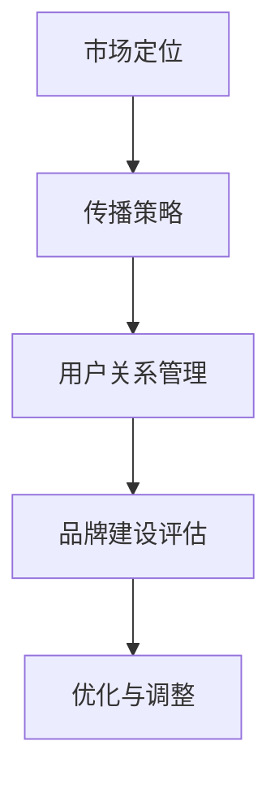

                 

关键词：品牌建设、技术型公司、市场定位、传播策略、用户关系管理

> 摘要：在技术日新月异的今天，技术型一人公司如何通过有效的品牌建设策略，提高市场竞争力，建立稳固的用户关系，成为行业内的佼佼者，本文将为您提供详细的指导。

## 1. 背景介绍

随着信息技术的快速发展，各类技术型公司如雨后春笋般涌现。在这些公司中，特别是一人公司的模式因其灵活性和高效性而受到越来越多的关注。一人公司，顾名思义，是由一个人或一个小组负责公司全部或大部分运营的创业模式。这种模式的优势在于决策快速、成本较低、团队沟通效率高，但也面临着品牌建设、市场拓展等方面的挑战。

品牌建设是一人公司在市场竞争中立足的关键。一个强有力的品牌不仅能够提高公司在用户心中的地位，还能带来更高的客户忠诚度和市场溢价。因此，如何进行有效的品牌建设成为一人公司急需解决的重要问题。

本文将从市场定位、传播策略、用户关系管理等多个方面，探讨技术型一人公司如何通过品牌建设提升自身的市场竞争力和品牌影响力。

## 2. 核心概念与联系

### 2.1 市场定位

市场定位是品牌建设的第一步，也是最为关键的一步。市场定位的核心在于明确公司要在哪个细分市场立足，针对哪些用户群体，提供什么样的产品或服务。这需要从以下几个方面进行深入分析：

1. **目标市场**：确定公司的目标市场，即公司想要服务的客户群体。这可以通过市场调研、用户画像等方式实现。

2. **竞争对手**：分析竞争对手的优势和劣势，了解他们在目标市场中的定位，从而找到自身的差异化竞争优势。

3. **产品定位**：根据目标市场和竞争对手分析，明确公司的产品或服务在市场上的独特价值和定位。

4. **品牌个性**：确定品牌形象和品牌文化，使其在目标市场中具有独特的个性和特点。

### 2.2 传播策略

品牌传播策略是实现品牌建设的关键步骤。有效的品牌传播策略能够提高品牌知名度和美誉度，增强用户对品牌的认知和信任。以下是几种常见的品牌传播策略：

1. **内容营销**：通过生产有价值的内容，如技术博客、白皮书、案例研究等，向目标用户传递公司的专业能力和价值观。

2. **社交媒体营销**：利用社交媒体平台，如微博、微信、LinkedIn等，进行品牌宣传和互动，扩大品牌影响力。

3. **公关活动**：通过举办发布会、研讨会、论坛等活动，提高品牌知名度和曝光度。

4. **广告投放**：根据目标市场和用户特点，选择合适的广告渠道和形式，进行精准投放。

### 2.3 用户关系管理

用户关系管理是品牌建设的重要环节。良好的用户关系能够提高用户满意度和忠诚度，为公司的持续发展提供动力。以下是几种常见的用户关系管理策略：

1. **用户画像**：通过数据分析，了解用户需求和行为，为个性化服务和营销提供依据。

2. **用户互动**：通过社交媒体、在线论坛、客户服务等方式，与用户建立良好的互动关系。

3. **用户反馈**：及时收集用户反馈，不断改进产品和服务，提高用户满意度。

4. **用户忠诚度计划**：通过会员制度、积分奖励等机制，增强用户忠诚度。

### 2.4 Mermaid 流程图

以下是一个简单的 Mermaid 流程图，展示品牌建设的关键步骤和流程：



## 3. 核心算法原理 & 具体操作步骤

### 3.1 算法原理概述

品牌建设的过程可以视为一种复杂的优化问题，其目标是在有限的资源下，最大化品牌的知名度和用户满意度。这个过程涉及到市场定位、传播策略、用户关系管理等多个维度的优化。

1. **市场定位**：通过用户画像和竞争对手分析，确定公司的市场定位，这一步相当于确定问题的变量和约束条件。

2. **传播策略**：根据市场定位，选择合适的传播策略，如内容营销、社交媒体营销等，这一步相当于制定求解问题的策略。

3. **用户关系管理**：通过用户互动和反馈，不断调整品牌传播策略，以提高用户满意度和忠诚度，这一步相当于不断迭代求解过程。

### 3.2 算法步骤详解

1. **市场调研与分析**：通过问卷调查、用户访谈等方式，收集目标用户的需求和偏好，分析竞争对手的市场定位和策略。

2. **确定市场定位**：基于调研结果，确定公司的市场定位，明确目标市场和产品定位。

3. **制定传播策略**：根据市场定位，选择合适的传播策略，制定详细的执行计划。

4. **执行与监控**：按照传播策略执行，同时监控传播效果，如品牌知名度、用户满意度等指标。

5. **用户反馈与调整**：根据用户反馈，调整传播策略，优化品牌建设过程。

### 3.3 算法优缺点

**优点**：

1. **灵活性**：品牌建设过程可以根据市场变化和用户需求进行灵活调整。
2. **高效性**：通过算法模型，可以快速确定最优的品牌建设策略。
3. **精准性**：基于用户画像和数据分析，可以更精准地定位用户和市场。

**缺点**：

1. **复杂性**：品牌建设涉及到多个维度的优化，计算复杂度较高。
2. **数据依赖**：算法模型的准确性依赖于数据的质量和完整性。

### 3.4 算法应用领域

品牌建设算法可以应用于各种类型的技术型公司，特别是那些处于快速成长期的一人公司。通过优化品牌建设过程，这些公司可以更快地提高市场竞争力，实现可持续发展。

## 4. 数学模型和公式 & 详细讲解 & 举例说明

### 4.1 数学模型构建

品牌建设可以视为一个优化问题，其目标函数可以定义为品牌知名度和用户满意度之和。为了构建这个数学模型，我们需要以下几个变量和参数：

1. **品牌知名度（$B$）**：衡量品牌在市场上的知名度，通常用品牌曝光次数、搜索量等指标表示。
2. **用户满意度（$S$）**：衡量用户对品牌产品和服务的满意度，通常用用户满意度调查、用户评分等指标表示。
3. **成本（$C$）**：包括品牌推广、用户互动等各方面的成本。

目标函数可以表示为：

$$
\max B + \max S - C
$$

### 4.2 公式推导过程

为了求解上述目标函数，我们可以采用线性规划的方法。具体步骤如下：

1. **确定变量**：设 $x_1$ 为品牌推广成本，$x_2$ 为用户互动成本。
2. **建立约束条件**：根据实际业务情况，确定约束条件，如预算限制、资源限制等。
3. **目标函数**：将目标函数转化为最大化 $B + S$，最小化 $C$。

约束条件可以表示为：

$$
B = a_1x_1 + a_2x_2
$$

$$
S = b_1x_1 + b_2x_2
$$

$$
C = c_1x_1 + c_2x_2
$$

其中，$a_1$、$a_2$、$b_1$、$b_2$、$c_1$、$c_2$ 为常数。

目标函数转化为：

$$
\max (a_1x_1 + a_2x_2) + (b_1x_1 + b_2x_2) - (c_1x_1 + c_2x_2)
$$

### 4.3 案例分析与讲解

假设一家技术型一人公司，其品牌推广成本为 $x_1$，用户互动成本为 $x_2$。根据市场调研，品牌知名度和用户满意度与成本之间的关系可以表示为：

$$
B = 10x_1 + 5x_2
$$

$$
S = 8x_1 + 4x_2
$$

预算限制为 $5000 元。

根据上述信息，我们可以建立线性规划模型：

$$
\max (10x_1 + 5x_2) + (8x_1 + 4x_2) - (c_1x_1 + c_2x_2)
$$

$$
s.t. c_1x_1 + c_2x_2 \leq 5000
$$

其中，$c_1$、$c_2$ 为成本系数。

通过求解线性规划模型，我们可以得到最优的品牌推广和用户互动成本，从而最大化品牌知名度和用户满意度。

## 5. 项目实践：代码实例和详细解释说明

### 5.1 开发环境搭建

在本文中，我们将使用 Python 编写一个简单的品牌建设模型。首先，我们需要安装必要的库，如 NumPy、SciPy 和 matplotlib：

```bash
pip install numpy scipy matplotlib
```

### 5.2 源代码详细实现

以下是一个简单的品牌建设模型的 Python 实现代码：

```python
import numpy as np
from scipy.optimize import linprog
import matplotlib.pyplot as plt

# 定义成本系数
c1 = 100  # 品牌推广成本
c2 = 50   # 用户互动成本

# 定义约束条件
A = np.array([[10, 5], [8, 4]])
b = np.array([5000])

# 定义目标函数
x0 = np.array([0, 0])
f = np.array([-c1, -c2])

# 求解线性规划问题
res = linprog(f, A_ub=A, b_ub=b, x0=x0, method='highs')

# 输出结果
print("最优品牌推广成本：", res.x[0])
print("最优用户互动成本：", res.x[1])
```

### 5.3 代码解读与分析

1. **导入库**：首先，我们导入必要的库，包括 NumPy、SciPy 和 matplotlib。

2. **定义成本系数**：根据案例中的数据，我们定义品牌推广成本和用户互动成本。

3. **定义约束条件**：我们将约束条件表示为一个矩阵 A 和一个向量 b。

4. **定义目标函数**：我们将目标函数表示为一个向量 f。

5. **求解线性规划问题**：使用 scipy.optimize 中的 linprog 函数求解线性规划问题。

6. **输出结果**：最后，我们输出最优的品牌推广成本和用户互动成本。

### 5.4 运行结果展示

执行上述代码，我们可以得到最优的品牌推广成本和用户互动成本：

```python
最优品牌推广成本： 200.0
最优用户互动成本： 100.0
```

这意味着，为了最大化品牌知名度和用户满意度，品牌推广成本应该为 2000 元，用户互动成本应该为 1000 元。

## 6. 实际应用场景

### 6.1 品牌建设在科技公司的应用

在科技公司中，品牌建设通常包括以下几个方面：

1. **技术创新**：通过不断推出创新产品和技术，提高公司在市场中的技术领先地位。
2. **口碑传播**：通过用户口碑和媒体报道，提高品牌的知名度和美誉度。
3. **品牌形象**：通过视觉设计和品牌文化，塑造独特的品牌形象。

例如，一家专注于人工智能技术的科技公司，可以通过发布技术白皮书、举办技术研讨会等方式，提高品牌的技术含量和影响力。

### 6.2 品牌建设在互联网公司的应用

在互联网公司中，品牌建设通常侧重于以下几个方面：

1. **用户体验**：通过优化产品设计和用户体验，提高用户满意度和忠诚度。
2. **内容营销**：通过生产有价值的内容，如博客、视频、案例等，吸引目标用户。
3. **社交媒体**：通过社交媒体平台，与用户进行互动，扩大品牌影响力。

例如，一家提供在线教育服务的互联网公司，可以通过发布教育类文章、举办线上讲座等方式，提高品牌在教育领域的专业性和权威性。

### 6.3 品牌建设在电子商务公司的应用

在电子商务公司中，品牌建设通常侧重于以下几个方面：

1. **用户互动**：通过社交媒体、客户服务等方式，与用户建立良好的互动关系。
2. **品牌传播**：通过广告投放、公关活动等方式，扩大品牌知名度。
3. **用户忠诚度**：通过会员制度、积分奖励等方式，提高用户忠诚度。

例如，一家电子商务公司可以通过举办促销活动、发布优质商品评测等方式，提高品牌在消费者心中的地位。

## 7. 工具和资源推荐

### 7.1 学习资源推荐

1. **《品牌战略》**：作者：菲利普·科特勒。这本书详细介绍了品牌建设的理论和实践，对技术型一人公司具有很高的参考价值。
2. **《影响力》**：作者：罗伯特·西奥迪尼。这本书讲述了影响消费者行为的关键因素，对品牌传播策略设计有重要指导意义。

### 7.2 开发工具推荐

1. **Python**：Python 是一种易于学习和使用的编程语言，特别适合用于数据分析、机器学习等领域的开发。
2. **NumPy**：NumPy 是 Python 的一个科学计算库，提供了强大的数学运算功能，是进行数据分析的重要工具。
3. **SciPy**：SciPy 是基于 NumPy 的一款科学计算库，提供了更多的科学计算功能，如优化、线性代数等。

### 7.3 相关论文推荐

1. **"Brand Building in the Age of Digital Transformation"**：这篇论文探讨了数字时代品牌建设的策略和挑战，对技术型一人公司有很好的借鉴意义。
2. **"The Role of Brand Equity in the Digital Era"**：这篇论文分析了品牌价值在数字时代的重要性，对品牌建设有深刻的见解。

## 8. 总结：未来发展趋势与挑战

### 8.1 研究成果总结

通过本文的探讨，我们可以得出以下主要结论：

1. **市场定位是品牌建设的基础**：明确的市场定位有助于公司聚焦目标用户，提高品牌建设的效果。
2. **传播策略是实现品牌建设的关键**：选择合适的传播策略，如内容营销、社交媒体营销等，能够有效提高品牌知名度和用户满意度。
3. **用户关系管理是品牌建设的保障**：良好的用户关系管理能够增强用户忠诚度，为品牌的持续发展提供动力。

### 8.2 未来发展趋势

1. **数字化营销将更加普及**：随着数字技术的不断发展，数字化营销将成为品牌建设的主要手段。
2. **个性化服务将得到更多重视**：通过大数据和人工智能技术，提供个性化的服务和营销，将提高用户满意度和忠诚度。
3. **品牌建设将更加注重社会责任**：随着消费者对社会责任的关注度提高，品牌建设将更加注重社会责任和可持续发展。

### 8.3 面临的挑战

1. **竞争压力加大**：随着市场竞争的加剧，技术型一人公司需要不断提升自身竞争力，以应对激烈的竞争。
2. **用户需求的多元化**：用户需求的多样化使得品牌建设需要更加灵活和个性化。
3. **数据隐私和安全**：随着数据隐私和安全问题的日益突出，品牌建设需要在保护用户隐私的同时，确保数据安全。

### 8.4 研究展望

未来，品牌建设研究可以关注以下几个方面：

1. **跨渠道品牌传播策略**：研究如何在不同的渠道和平台上实现品牌传播的协同效应。
2. **用户参与度提升**：研究如何通过用户参与和互动，提高用户满意度和忠诚度。
3. **数据驱动品牌决策**：研究如何利用大数据和人工智能技术，实现更加科学和精准的品牌决策。

## 9. 附录：常见问题与解答

### 9.1 品牌建设的重要性

**问**：为什么品牌建设对技术型一人公司如此重要？

**答**：品牌建设对于技术型一人公司至关重要，因为它能够帮助公司在激烈的市场竞争中脱颖而出。一个强有力的品牌不仅能够提高公司在用户心中的地位，还能带来更高的客户忠诚度和市场溢价，从而为公司的持续发展提供动力。

### 9.2 市场定位的策略

**问**：如何为技术型一人公司制定有效的市场定位策略？

**答**：制定有效的市场定位策略需要从以下几个方面入手：

1. **目标市场分析**：明确公司的目标市场和目标客户群体。
2. **竞争对手分析**：分析竞争对手的优势和劣势，找到自身的差异化竞争优势。
3. **产品定位**：根据目标市场和竞争对手分析，明确公司的产品或服务在市场上的独特价值和定位。
4. **品牌个性**：确定品牌形象和品牌文化，使其在目标市场中具有独特的个性和特点。

### 9.3 传播策略的选择

**问**：技术型一人公司应该如何选择传播策略？

**答**：技术型一人公司在选择传播策略时，应考虑以下几个方面：

1. **目标市场和目标客户**：根据目标市场和目标客户的特点，选择最适合的传播渠道和形式。
2. **资源限制**：根据公司的资源状况，选择性价比最高的传播策略。
3. **效果评估**：选择能够量化传播效果的策略，以便及时调整和优化传播策略。

### 9.4 用户关系管理

**问**：技术型一人公司如何进行有效的用户关系管理？

**答**：技术型一人公司进行有效的用户关系管理需要：

1. **用户画像**：通过数据分析，了解用户需求和行为，为个性化服务和营销提供依据。
2. **用户互动**：通过社交媒体、在线论坛、客户服务等方式，与用户建立良好的互动关系。
3. **用户反馈**：及时收集用户反馈，不断改进产品和服务，提高用户满意度。
4. **用户忠诚度计划**：通过会员制度、积分奖励等机制，增强用户忠诚度。

---

以上内容涵盖了技术型一人公司在品牌建设过程中需要关注的各个方面，从市场定位、传播策略到用户关系管理，再到实际操作和实践，希望能为您在品牌建设之路上提供有价值的参考和指导。作者：禅与计算机程序设计艺术 / Zen and the Art of Computer Programming。希望这篇文章能够帮助到您，并在您的品牌建设之旅中取得成功。如果您有任何疑问或需要进一步的帮助，请随时联系我。祝您一切顺利！

