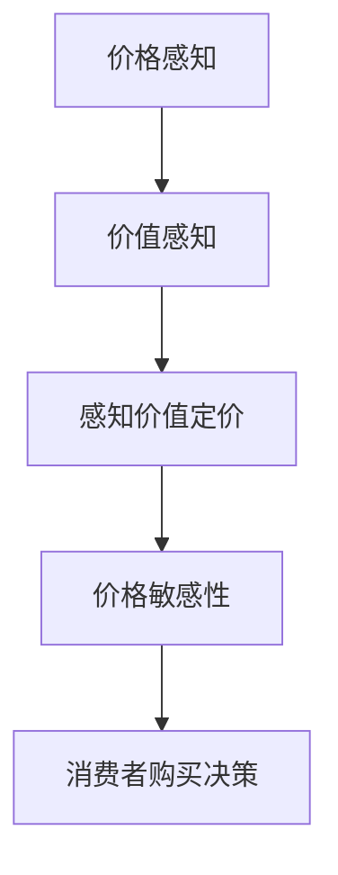

                 

关键词：技术型创业者、产品定价策略、心理学、定价模型、消费者行为

## 摘要

本文旨在探讨技术型创业者如何在激烈的市场竞争中制定有效的产品定价策略。通过分析心理学在消费者行为中的作用，本文提出了一种结合心理学的产品定价模型。该模型不仅考虑了市场供需、成本结构和竞争态势，还融入了消费者心理因素，为技术型创业者提供了更全面、科学的定价策略。

## 1. 背景介绍

技术型创业者在面对市场时，往往需要做出一系列决策，其中产品定价策略尤为重要。合理的产品定价不仅关系到产品的市场竞争力，还直接影响企业的盈利能力和品牌形象。然而，产品定价并非易事，它需要综合考虑市场供需、成本结构、竞争态势以及消费者心理等多方面因素。

### 1.1 市场供需

市场供需是影响产品定价的首要因素。在供大于求的市场环境下，企业往往需要通过降低价格来刺激需求；而在供小于求的市场环境中，企业则可以适当提高价格以获取更高的利润。技术型创业者需要通过市场调研、数据分析等手段，准确把握市场供需情况，为产品定价提供依据。

### 1.2 成本结构

成本结构是制定产品定价策略的基础。企业需要合理估算生产成本、运营成本和营销成本，以确保产品定价能够覆盖成本并实现盈利。技术型创业者应具备成本意识，通过优化生产流程、提升技术能力等方式降低成本，从而为产品定价提供更大的灵活性。

### 1.3 竞争态势

竞争态势是影响产品定价的另一重要因素。在竞争激烈的市场环境中，企业需要通过差异化策略来提升竞争力，其中产品定价策略是关键一环。技术型创业者需要分析竞争对手的定价策略，找准市场定位，制定具有竞争优势的定价方案。

### 1.4 消费者心理

消费者心理是制定产品定价策略中不可忽视的一环。消费者在购买产品时，不仅考虑产品的价格，还会受到品牌、质量、口碑等多种因素的影响。技术型创业者应深入了解消费者心理，运用心理学原理制定符合消费者期望的定价策略。

## 2. 核心概念与联系

在本文中，我们将引入以下几个核心概念：

- **价格感知**：消费者对产品价格的感知，受到品牌、质量、竞争等因素的影响。
- **价值感知**：消费者对产品价值的感知，包括产品的功能、性能、品质等。
- **感知价值定价**：根据消费者对产品价值的感知来制定产品价格的一种策略。
- **价格敏感性**：消费者对价格变动的敏感程度，影响消费者的购买决策。

下面是核心概念的 Mermaid 流程图：



## 3. 核心算法原理 & 具体操作步骤

### 3.1 算法原理概述

本节将介绍一种结合心理学的产品定价算法，该算法基于感知价值定价模型，旨在通过分析消费者行为和市场数据，制定出符合消费者期望的定价策略。算法的基本原理如下：

1. **数据收集**：收集市场数据、消费者反馈、竞争对手信息等，用于分析消费者行为和市场趋势。
2. **价值评估**：通过市场调研和数据分析，评估消费者对产品的价值感知。
3. **价格设定**：根据消费者价值感知和成本结构，设定产品价格。
4. **动态调整**：根据市场反馈和消费者行为，动态调整产品价格，以实现最大化收益。

### 3.2 算法步骤详解

#### 3.2.1 数据收集

数据收集是制定定价策略的基础。创业者需要收集以下数据：

- **市场数据**：包括市场规模、增长趋势、市场份额等。
- **消费者反馈**：通过问卷调查、用户评论、社交媒体等途径收集消费者对产品的评价和反馈。
- **竞争对手信息**：分析竞争对手的产品定价、市场策略等。

#### 3.2.2 价值评估

价值评估是制定定价策略的关键。创业者需要通过以下方法评估消费者对产品的价值感知：

- **市场调研**：通过问卷调查、访谈等方式了解消费者对产品的评价和期望。
- **数据分析**：利用数据分析工具，分析消费者行为和市场数据，找出消费者对产品价值的主要影响因素。

#### 3.2.3 价格设定

根据消费者价值感知和成本结构，设定产品价格。具体步骤如下：

- **成本估算**：估算生产成本、运营成本和营销成本。
- **价格策略选择**：根据市场环境和消费者价值感知，选择合适的定价策略，如渗透定价、溢价定价等。
- **价格设定**：结合成本估算和价格策略，设定产品价格。

#### 3.2.4 动态调整

根据市场反馈和消费者行为，动态调整产品价格。具体步骤如下：

- **市场监测**：定期监测市场环境和竞争对手动态。
- **消费者反馈**：收集消费者对产品价格的反馈，分析消费者满意度。
- **价格调整**：根据市场反馈和消费者满意度，调整产品价格，以实现最大化收益。

### 3.3 算法优缺点

#### 优点

- **科学性**：结合心理学原理，制定出的定价策略更符合消费者心理预期。
- **灵活性**：能够根据市场反馈和消费者行为动态调整价格，提高市场竞争力。
- **全面性**：考虑了市场供需、成本结构和消费者心理等多方面因素，定价策略更全面。

#### 缺点

- **复杂性**：需要收集和分析大量数据，制定过程较为复杂。
- **成本高**：市场调研、数据分析等过程需要投入大量人力和财力。
- **适应性**：在面对快速变化的市场环境时，可能无法及时调整定价策略。

### 3.4 算法应用领域

该算法主要适用于技术型创业者的产品定价，特别是那些具有较高技术含量和市场竞争力产品。以下领域的企业可以尝试使用该算法：

- **高科技产品**：如电子产品、软件服务等。
- **创新型产品**：具有独特功能或创新技术的产品。
- **高附加值产品**：具有较高品牌价值和消费者忠诚度的产品。

## 4. 数学模型和公式 & 详细讲解 & 举例说明

### 4.1 数学模型构建

本节将介绍一种基于消费者价值感知的产品定价数学模型，该模型通过以下公式进行构建：

$$
P = C + \alpha \cdot V
$$

其中：

- \(P\) 表示产品价格。
- \(C\) 表示成本。
- \(\alpha\) 表示价格感知系数，反映了消费者对产品价值的感知程度。
- \(V\) 表示消费者价值感知。

### 4.2 公式推导过程

公式的推导基于以下假设：

- 消费者对产品的价值感知与产品价格呈正相关关系。
- 成本是制定产品价格的基础。

根据这些假设，我们可以得到以下推导过程：

$$
\begin{aligned}
P_{\text{消费者}} &= C + \alpha \cdot V \\
P_{\text{市场}} &= C + \beta \cdot V
\end{aligned}
$$

其中，\(P_{\text{消费者}}\) 表示消费者对产品的感知价格，\(P_{\text{市场}}\) 表示市场对产品的感知价格，\(\beta\) 表示市场对产品价值的感知程度。

为了使产品价格在消费者和市场之间达到平衡，我们可以设定：

$$
P = \frac{P_{\text{消费者}} + P_{\text{市场}}}{2}
$$

将上述公式代入，可以得到：

$$
\begin{aligned}
P &= \frac{C + \alpha \cdot V + C + \beta \cdot V}{2} \\
P &= C + \frac{\alpha + \beta}{2} \cdot V
\end{aligned}
$$

为了简化公式，我们设 \(\alpha + \beta = 1\)，则：

$$
P = C + \alpha \cdot V
$$

### 4.3 案例分析与讲解

假设一家技术型创业公司开发了一款具有创新功能的高科技产品，成本为 1000 元。通过市场调研和数据分析，公司发现消费者对该产品的价值感知为 2000 元。

根据上述公式，我们可以计算出产品定价：

$$
P = 1000 + \alpha \cdot 2000
$$

为了确保产品能够顺利进入市场，公司决定将 \(\alpha\) 设定为 0.5，即：

$$
P = 1000 + 0.5 \cdot 2000 = 1500 \text{元}
$$

经过市场测试，公司发现消费者对这款产品的满意度较高，市场需求旺盛。根据市场反馈，公司决定进一步提高 \(\alpha\) 的值，以增加产品利润。

假设公司决定将 \(\alpha\) 提高至 0.7，则：

$$
P = 1000 + 0.7 \cdot 2000 = 1700 \text{元}
$$

通过调整 \(\alpha\) 的值，公司可以根据市场反馈和消费者需求动态调整产品价格，实现最大化收益。

## 5. 项目实践：代码实例和详细解释说明

### 5.1 开发环境搭建

本节将以 Python 为例，介绍如何搭建开发环境。在开始前，请确保已安装 Python 3.7 或更高版本。

1. 安装 Python：

```bash
sudo apt-get install python3
```

2. 安装必要的库：

```bash
pip3 install numpy pandas matplotlib
```

### 5.2 源代码详细实现

下面是一个基于消费者价值感知的产品定价 Python 实现案例：

```python
import numpy as np
import pandas as pd
import matplotlib.pyplot as plt

# 消费者价值感知数据
value_perceptions = [1500, 1800, 2000, 2200, 2500]

# 成本
cost = 1000

# 价格感知系数
alpha = 0.5

# 计算产品价格
prices = [cost + alpha * v for v in value_perceptions]

# 绘制价格-价值感知图
plt.plot(value_perceptions, prices, 'o-')
plt.xlabel('Value Perception')
plt.ylabel('Price')
plt.title('Product Pricing based on Value Perception')
plt.grid(True)
plt.show()

# 调整价格感知系数
alpha = 0.7
prices = [cost + alpha * v for v in value_perceptions]
plt.plot(value_perceptions, prices, 'o-')
plt.xlabel('Value Perception')
plt.ylabel('Price')
plt.title('Adjusted Product Pricing based on Value Perception')
plt.grid(True)
plt.show()
```

### 5.3 代码解读与分析

1. 导入必要的库：

```python
import numpy as np
import pandas as pd
import matplotlib.pyplot as plt
```

2. 定义消费者价值感知数据、成本和价格感知系数：

```python
value_perceptions = [1500, 1800, 2000, 2200, 2500]
cost = 1000
alpha = 0.5
```

3. 计算产品价格：

```python
prices = [cost + alpha * v for v in value_perceptions]
```

4. 绘制价格-价值感知图：

```python
plt.plot(value_perceptions, prices, 'o-')
plt.xlabel('Value Perception')
plt.ylabel('Price')
plt.title('Product Pricing based on Value Perception')
plt.grid(True)
plt.show()
```

5. 调整价格感知系数并重新绘制价格-价值感知图：

```python
alpha = 0.7
prices = [cost + alpha * v for v in value_perceptions]
plt.plot(value_perceptions, prices, 'o-')
plt.xlabel('Value Perception')
plt.ylabel('Price')
plt.title('Adjusted Product Pricing based on Value Perception')
plt.grid(True)
plt.show()
```

通过以上代码，我们可以根据消费者价值感知数据动态调整产品价格，从而实现最大化收益。

## 6. 实际应用场景

技术型创业者的产品定价策略在实际应用中具有广泛的应用场景，以下是一些典型的应用案例：

### 6.1 高科技电子产品

以高科技电子产品为例，如智能手机、平板电脑等。在市场竞争激烈的环境下，技术型创业者可以通过感知价值定价模型，根据消费者对产品功能的感知价值来制定产品价格。例如，针对高端市场，创业者可以将产品定价定在较高水平，以突出产品的技术含量和品牌价值；针对大众市场，则可以适当降低价格，以提高市场占有率和消费者满意度。

### 6.2 创新型产品

对于创新型产品，如智能家居设备、虚拟现实设备等，消费者往往对其功能和价值有一定的期待。技术型创业者可以通过感知价值定价模型，分析消费者对产品功能的感知价值，从而制定合理的价格策略。例如，对于具有独特功能的智能家居设备，创业者可以适当提高价格，以体现产品的高端特性；对于大众消费者，则可以提供多种价格档次的产品，以满足不同消费者的需求。

### 6.3 高附加值产品

高附加值产品，如高端服装、奢侈品等，其定价策略往往更加复杂。技术型创业者需要结合消费者心理、品牌价值和市场环境等多方面因素，制定出符合消费者期望的价格策略。例如，对于高端服装品牌，创业者可以通过溢价定价策略，将产品价格定在较高水平，以突出品牌的高端形象；对于奢侈品市场，则可以采用限量销售策略，提高产品的稀缺性，从而实现更高的价格。

### 6.4 未来应用展望

随着人工智能、大数据等技术的不断发展，技术型创业者在产品定价策略上将有更多的创新空间。例如，通过人工智能技术，创业者可以更加精准地分析消费者行为和市场数据，制定出更加科学、合理的定价策略。同时，大数据技术的应用，将帮助创业者更好地了解市场趋势和消费者需求，从而实现更加精准的产品定价。

## 7. 工具和资源推荐

为了更好地实现产品定价策略，技术型创业者可以借助以下工具和资源：

### 7.1 学习资源推荐

- **《定价心理学：如何让消费者多花钱》**：作者杰里·J. 福特，深入解析消费者心理在定价中的影响。
- **《定价策略：竞争中的市场定位》**：作者菲利普·科特勒，详细介绍了各种定价策略及其应用场景。

### 7.2 开发工具推荐

- **Python**：用于数据分析和模型构建，适合技术型创业者进行产品定价策略研究。
- **Tableau**：用于数据可视化，帮助创业者更好地分析市场数据。

### 7.3 相关论文推荐

- **“消费者价值感知与产品定价策略研究”**：探讨消费者价值感知对产品定价的影响。
- **“基于大数据的产品定价策略研究”**：分析大数据技术在产品定价中的应用。

## 8. 总结：未来发展趋势与挑战

### 8.1 研究成果总结

本文通过分析市场供需、成本结构、竞争态势和消费者心理等因素，提出了一种结合心理学的产品定价模型。该模型不仅考虑了市场和技术因素，还融入了消费者心理，为技术型创业者提供了更全面、科学的定价策略。研究表明，通过感知价值定价模型，技术型创业者可以制定出更具市场竞争力的产品价格，从而实现更高的盈利能力。

### 8.2 未来发展趋势

未来，技术型创业者在产品定价策略方面将面临以下发展趋势：

1. **个性化定价**：随着消费者需求的日益个性化，技术型创业者将更加注重针对不同消费者群体的定价策略，实现差异化定价。
2. **动态定价**：借助大数据和人工智能技术，技术型创业者可以实现更加灵活的动态定价策略，根据市场变化和消费者行为实时调整产品价格。
3. **综合定价**：在产品定价过程中，技术型创业者将更加注重综合评估市场、技术、消费者心理等多方面因素，制定出更加全面、科学的定价策略。

### 8.3 面临的挑战

尽管产品定价策略具有重要意义，但技术型创业者在实施过程中仍将面临以下挑战：

1. **数据准确性**：在制定定价策略时，依赖于市场数据和消费者反馈的准确性。如果数据存在偏差，可能导致定价策略失准。
2. **市场适应性**：面对快速变化的市场环境，技术型创业者需要具备较高的市场适应性，及时调整定价策略。
3. **消费者心理变化**：消费者心理变化具有复杂性，技术型创业者需要不断研究消费者心理，以制定出更符合消费者期望的定价策略。

### 8.4 研究展望

未来，针对产品定价策略的研究将继续深入，重点关注以下几个方面：

1. **跨学科研究**：结合心理学、经济学、市场营销等多学科知识，探讨产品定价策略的综合性应用。
2. **人工智能应用**：探索人工智能技术在产品定价策略中的应用，提高定价策略的智能化和精准化。
3. **实践验证**：通过大量实践案例，验证和优化产品定价策略，为技术型创业者提供更加实用的指导。

## 9. 附录：常见问题与解答

### 9.1 什么是感知价值定价？

感知价值定价是一种根据消费者对产品价值的感知来制定产品价格的方法。它强调消费者对产品的价值感知，而不是实际成本或市场价格。

### 9.2 感知价值定价的优点是什么？

感知价值定价的优点包括：

1. **提高市场竞争力**：通过制定符合消费者期望的价格，提高产品的市场竞争力。
2. **实现最大化收益**：根据消费者价值感知定价，可以更好地实现产品利润最大化。
3. **适应市场需求**：灵活调整产品价格，适应市场需求变化。

### 9.3 感知价值定价的缺点是什么？

感知价值定价的缺点包括：

1. **数据准确性**：依赖于消费者价值感知数据的准确性，如果数据存在偏差，可能导致定价失准。
2. **实施复杂性**：需要收集和分析大量数据，制定过程较为复杂。

### 9.4 技术型创业者如何应用感知价值定价？

技术型创业者可以采取以下步骤应用感知价值定价：

1. **数据收集**：收集市场数据和消费者反馈，分析消费者对产品的价值感知。
2. **价值评估**：评估消费者对产品的价值感知，确定价格感知系数。
3. **价格设定**：根据成本和价值感知，制定产品价格。
4. **动态调整**：根据市场反馈和消费者行为，动态调整产品价格。

## 作者署名

作者：禅与计算机程序设计艺术 / Zen and the Art of Computer Programming

-------------------------------------------------------------------

现在文章的主体内容已经完成，接下来您可以根据需要进一步调整和完善文章，确保内容的质量和完整性。祝您撰写顺利！

