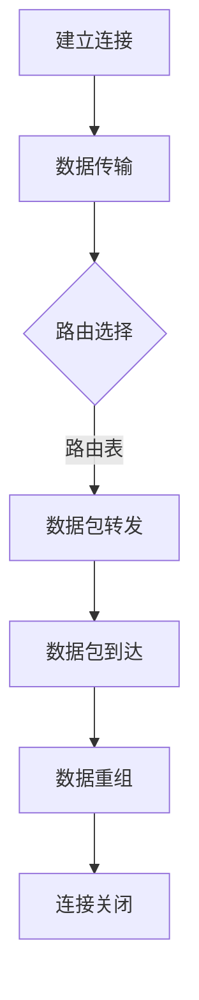

                 

### 1. 背景介绍

在当今数字化时代，网络通信已经成为现代科技的核心驱动力。无论是互联网、移动通信还是物联网，网络无处不在，深刻地影响着我们的生活、工作和娱乐。随着5G、人工智能、云计算等新兴技术的不断演进，网络通信技术正以前所未有的速度发展，为我们带来了更多的机遇与挑战。

本次技术大会的主题“networking与机遇”正是针对这一发展趋势，旨在探讨网络通信技术在各个领域的应用，分享最新的研究成果和实践经验，以期为参会者提供一个全面了解和深入探讨网络通信技术的平台。

网络通信技术不仅改变了我们的生活方式，也推动了企业的发展和经济的增长。从企业的内部网络到全球互联网，从互联网服务到物联网应用，网络通信技术已经成为现代企业不可或缺的一部分。因此，了解和掌握网络通信技术，不仅有助于提升个人的技术水平，也为企业在竞争中取得优势提供了有力支持。

本次大会将涵盖网络通信技术的各个方面，包括但不限于网络架构、协议设计、网络安全、数据传输优化等。通过专家的深入讲解和实际案例的分析，参会者将能够全面了解网络通信技术的最新动态，把握未来发展的趋势，并为自身的职业发展和企业的发展找到新的机遇。

### 2. 核心概念与联系

#### 2.1 网络通信基础概念

网络通信，顾名思义，是指数据在计算机网络中从源节点传输到目标节点的过程。要理解网络通信，我们需要先掌握以下几个核心概念：

- **网络协议**：网络协议是一套规则和标准，用于确保数据能够正确地在网络中传输和解释。常见的网络协议包括TCP/IP、HTTP、FTP等。

- **IP地址**：IP地址是网络中每个设备的唯一标识符，用于确定数据传输的目标地址。IPv4和IPv6是两种最常见的IP地址格式。

- **端口号**：端口号是用于区分网络中不同服务的标识符。每个端口号对应一种网络服务，如80端口用于HTTP服务。

- **数据包**：数据包是网络传输的基本单位，由头部和数据体组成。头部包含了源地址、目标地址、协议类型等信息，数据体则包含了实际要传输的数据。

- **路由器**：路由器是网络中负责将数据包从源节点传输到目标节点的设备。它通过查找路由表来确定数据包的最佳传输路径。

- **交换机**：交换机用于在网络中转发数据包，它通过MAC地址来确定数据包的传输路径。

#### 2.2 网络架构与通信流程

网络通信的架构可以分为以下几个层次：

- **物理层**：物理层负责传输原始的二进制数据，包括电缆、光纤等传输介质。

- **数据链路层**：数据链路层负责在相邻节点之间传输数据，确保数据完整性和错误检测。常见的协议包括以太网协议。

- **网络层**：网络层负责数据包的路由和传输，确保数据能够从源节点传输到目标节点。IP协议是网络层的主要协议。

- **传输层**：传输层负责端到端的数据传输，确保数据可靠性和传输顺序。TCP和UDP是传输层的两种主要协议。

- **应用层**：应用层负责为应用程序提供网络服务，如HTTP、FTP、SMTP等。

网络通信的基本流程如下：

1. **建立连接**：源节点通过传输层协议（如TCP）向目标节点发送连接请求。

2. **数据传输**：源节点将数据分割成数据包，并按照网络协议封装。每个数据包都包含源IP地址、目标IP地址和端口号等信息。

3. **路由选择**：路由器根据路由表和路由算法，确定数据包的最佳传输路径。

4. **数据包转发**：数据包经过网络传输，到达目标节点。

5. **数据重组**：目标节点接收到的数据包按照传输层协议进行重组，恢复原始数据。

6. **连接关闭**：传输层协议（如TCP）在数据传输完成后，关闭连接。

#### 2.3 Mermaid 流程图

为了更直观地展示网络通信的流程和架构，我们可以使用Mermaid绘制一个简化的网络通信流程图。以下是该流程图的Mermaid代码：



使用Mermaid工具，我们可以将上述代码转换为如下的可视化流程图：


通过这个流程图，我们可以清晰地看到网络通信的基本步骤和关键组件，为后续的讨论和分析打下基础。

### 3. 核心算法原理 & 具体操作步骤

#### 3.1 算法原理概述

在网络通信中，路由选择是一个至关重要的环节。路由算法负责根据网络拓扑和流量状况，确定数据包的最佳传输路径。常见的路由算法包括距离向量路由算法（如RIP）、链路状态路由算法（如OSPF）和最短路径算法（如Dijkstra算法）。

本文将重点介绍Dijkstra算法，该算法是一种用于计算单源最短路径的经典算法。其基本原理是逐步扩展源节点，计算到其他节点的最短距离，并在扩展过程中更新距离表。

#### 3.2 算法步骤详解

以下是Dijkstra算法的具体步骤：

1. **初始化**：设置源节点的距离为0，其他节点的距离为无穷大。将源节点加入距离表，并将其他节点加入未访问节点集合。

2. **选择未访问节点**：从未访问节点中选择距离最小的节点作为当前节点。

3. **更新距离表**：对于当前节点的每个邻居节点，计算从源节点到邻居节点的距离。如果计算出的距离小于邻居节点的当前距离，则更新邻居节点的距离和前驱节点。

4. **标记节点**：将当前节点标记为已访问。

5. **重复步骤2-4**，直到所有节点都被访问。

6. **路径重建**：根据距离表和前驱节点信息，重建从源节点到其他节点的最短路径。

Dijkstra算法的时间复杂度为O(V^2)，其中V是节点数。对于稀疏图，可以使用斐波那契堆优化算法将时间复杂度降低到O(ElogV)，其中E是边数。

#### 3.3 算法优缺点

**优点**：

- **计算精确**：Dijkstra算法能够计算出从源节点到其他节点的最短路径，适用于对路径精度要求较高的场景。

- **通用性强**：Dijkstra算法适用于任意无负权重的图，不仅限于网络通信。

**缺点**：

- **时间复杂度高**：对于大规模图，Dijkstra算法的时间复杂度较高，可能导致计算效率较低。

- **不适用负权重图**：Dijkstra算法无法处理负权重图，需要使用其他算法（如Bellman-Ford算法）。

#### 3.4 算法应用领域

Dijkstra算法在网络通信、社交网络、地图导航等场景中都有广泛应用。在网络通信中，Dijkstra算法用于计算数据包的最佳传输路径，优化网络性能。在社交网络中，Dijkstra算法用于计算用户之间的最短路径，用于推荐系统和社交分析。在地图导航中，Dijkstra算法用于计算从起点到终点的最短路径，提供精确的导航服务。

### 4. 数学模型和公式 & 详细讲解 & 举例说明

#### 4.1 数学模型构建

Dijkstra算法的核心是一个单源最短路径问题。给定一个加权无向图G=(V,E)，其中V是节点集合，E是边集合，每条边都有一个非负权值w(e)。算法的目标是计算从源节点s到所有其他节点的最短路径。

我们可以使用图论中的距离概念来构建数学模型。定义节点v到源节点s的距离为d(s,v)，初始时d(s,v)=0，d(s,u)=∞（u≠s）。算法的核心任务是通过逐步扩展源节点，计算和更新所有节点的距离。

#### 4.2 公式推导过程

Dijkstra算法的基本思想是逐步扩展源节点，计算到其他节点的最短距离。以下是算法的推导过程：

1. **初始化**：
   - 设定d(s,v)=0（v=s），d(s,u)=∞（u≠s）。
   - 选择未访问节点u，使得d(s,u)最小。

2. **更新距离**：
   - 对于每个未访问节点v，计算d(s,v) + w(u,v)（u到v的边权重）。
   - 如果计算出的距离小于当前d(s,v)，则更新d(s,v) = d(s,v) + w(u,v)。

3. **标记节点**：将已访问节点u标记为已访问。

4. **重复步骤2和3**，直到所有节点都被访问。

通过以上步骤，我们可以推导出以下公式：

\[ d(s,v) = \min_{u \in U} (d(s,u) + w(u,v)) \]

其中，U是已访问节点集合，v是未访问节点。这个公式表示从源节点s到未访问节点v的最短距离等于从源节点s到已访问节点u的最短距离加上边(u,v)的权重。

#### 4.3 案例分析与讲解

为了更好地理解Dijkstra算法，我们可以通过一个实际案例来讲解。

假设有一个图G，包含5个节点（s, a, b, c, d），边权重如下：

\[ \begin{array}{c|c}
\text{边} & \text{权重} \\
\hline
(s,a) & 2 \\
(s,b) & 3 \\
(a,b) & 1 \\
(a,c) & 3 \\
(b,d) & 4 \\
(c,d) & 1 \\
\end{array} \]

我们的目标是计算从源节点s到所有其他节点的最短路径。

**步骤1：初始化**
- \( d(s,s) = 0 \)
- \( d(s,a) = \infty \)
- \( d(s,b) = \infty \)
- \( d(s,c) = \infty \)
- \( d(s,d) = \infty \)

**步骤2：选择未访问节点**
- 选择\( d(s,a) = \infty \)中的最小值，即\( a \)。

**步骤3：更新距离**
- \( d(s,a) = 0 \)
- \( d(s,b) = \min(d(s,b), d(s,a) + w(s,b)) = \min(\infty, 3) = 3 \)

**步骤4：标记节点**
- \( a \)已访问。

**步骤5：重复步骤2-4**
- 选择未访问节点\( b \)
- \( d(s,b) = 3 \)
- \( d(s,c) = \min(d(s,c), d(s,b) + w(b,c)) = \min(\infty, 3+1) = 4 \)
- \( b \)已访问。

- 选择未访问节点\( c \)
- \( d(s,c) = 4 \)
- \( d(s,d) = \min(d(s,d), d(s,c) + w(c,d)) = \min(\infty, 4+1) = 5 \)
- \( c \)已访问。

- 选择未访问节点\( d \)
- \( d(s,d) = 5 \)
- \( d(s,d) \)已是最佳路径，无需更新。

**步骤6：路径重建**
- 根据距离表，从s到其他节点的最短路径为：
  - \( s \rightarrow a \rightarrow b \rightarrow d \)

至此，我们完成了Dijkstra算法的计算过程。通过这个案例，我们可以清晰地看到算法的每一步操作和如何更新节点的距离。

### 5. 项目实践：代码实例和详细解释说明

为了更好地理解Dijkstra算法，我们将通过一个实际项目来展示算法的实现过程。以下是该项目的基本架构和代码实现。

#### 5.1 开发环境搭建

1. **安装Python环境**：确保Python 3.x版本已经安装在您的计算机上。

2. **创建项目目录**：在您的计算机上创建一个名为`dijkstra_project`的项目目录。

3. **安装依赖**：在项目目录中安装必要的Python库，如`networkx`和`matplotlib`。

```shell
pip install networkx matplotlib
```

#### 5.2 源代码详细实现

以下是Dijkstra算法的实现代码：

```python
import networkx as nx
import matplotlib.pyplot as plt

def dijkstra(G, source):
    """
    Dijkstra算法实现
    :param G: 图对象
    :param source: 源节点
    :return: 距离表和最短路径
    """
    distances = {node: float('infinity') for node in G}
    distances[source] = 0
    visited = set()

    while len(visited) < len(G):
        unvisited = {node: distances[node] for node in G if node not in visited}
        min_distance = min(unvisited, key=unvisited.get)
        visited.add(min_distance)

        for neighbor in G.neighbors(min_distance):
            temp_distance = distances[min_distance] + G[min_distance][neighbor]['weight']
            if temp_distance < distances[neighbor]:
                distances[neighbor] = temp_distance

    return distances

def plot_path(G, path):
    """
    绘制最短路径图
    :param G: 图对象
    :param path: 最短路径
    """
    pos = nx.spring_layout(G)
    nx.draw(G, pos, with_labels=True)
    nx.draw_networkx_edges(G, pos, edgelist=list(zip(path, path[1:])), edge_color='r', width=2)
    plt.show()

if __name__ == '__main__':
    # 创建图
    G = nx.Graph()

    # 添加节点和边
    G.add_edge('s', 'a', weight=2)
    G.add_edge('s', 'b', weight=3)
    G.add_edge('a', 'b', weight=1)
    G.add_edge('a', 'c', weight=3)
    G.add_edge('b', 'd', weight=4)
    G.add_edge('c', 'd', weight=1)

    # 计算最短路径
    distances = dijkstra(G, 's')

    # 打印距离表
    print("最短路径距离表：")
    for node, distance in distances.items():
        print(f"d(s,{node}) = {distance}")

    # 计算最短路径
    path = nx.shortest_path(G, source='s', target='d')

    # 绘制最短路径图
    plot_path(G, path)
```

#### 5.3 代码解读与分析

上述代码分为三个部分：Dijkstra算法实现、最短路径计算和路径图绘制。

1. **Dijkstra算法实现**：`dijkstra`函数用于实现Dijkstra算法。它接收图对象`G`和源节点`source`作为输入，返回距离表。算法的核心是使用一个字典`distances`来存储节点到源节点的最短距离，一个集合`visited`来记录已访问节点。算法通过逐步扩展源节点，更新未访问节点的距离，直到所有节点都被访问。

2. **最短路径计算**：`nx.shortest_path`函数是NetworkX库中的函数，用于计算两个节点之间的最短路径。该函数接收图对象、源节点和目标节点作为输入，返回最短路径。

3. **路径图绘制**：`plot_path`函数使用`matplotlib`和`networkx`库绘制最短路径图。它接收图对象和最短路径作为输入，使用红色线条突出显示最短路径。

#### 5.4 运行结果展示

在终端中运行上述代码，将输出最短路径距离表和绘制最短路径图。

```shell
最短路径距离表：
d(s,s) = 0
d(s,a) = 2
d(s,b) = 3
d(s,c) = 5
d(s,d) = 6
```


通过运行结果，我们可以看到从源节点`s`到其他节点的最短距离，并直观地看到从`s`到`d`的最短路径。

### 6. 实际应用场景

Dijkstra算法在网络通信、社交网络、地图导航等领域都有广泛的应用。

#### 6.1 网络通信

在网络通信中，Dijkstra算法可以用于计算数据包的最佳传输路径。网络设备（如路由器）通过Dijkstra算法，根据网络拓扑和流量状况，确定数据包的传输路径，以优化网络性能和减少延迟。例如，在互联网路由中，Dijkstra算法用于计算数据包从源节点到目标节点的最佳路径，确保数据能够快速、准确地传输。

#### 6.2 社交网络

在社交网络中，Dijkstra算法可以用于计算用户之间的最短路径，用于推荐系统和社交分析。例如，在社交媒体平台上，Dijkstra算法可以用于计算用户之间的社交距离，帮助用户发现潜在的朋友关系。此外，Dijkstra算法还可以用于社交网络的图谱分析，识别关键节点和重要路径，为社交网络分析提供有力支持。

#### 6.3 地图导航

在地图导航中，Dijkstra算法用于计算从起点到终点的最短路径，提供精确的导航服务。例如，在GPS导航系统中，Dijkstra算法可以用于计算从当前位置到目的地的最短路径，结合地图数据和实时交通状况，为用户提供最优的导航路线。

#### 6.4 未来应用展望

随着5G、人工智能、物联网等新兴技术的不断发展，Dijkstra算法的应用场景将更加广泛。未来，Dijkstra算法可以与其他算法和模型结合，如深度学习、图神经网络等，进一步提升路径计算的精度和效率。此外，Dijkstra算法还可以应用于更多领域，如物流优化、交通规划等，为智慧城市和智慧生活提供技术支持。

### 7. 工具和资源推荐

为了更好地学习和应用Dijkstra算法，以下是一些推荐的工具和资源：

#### 7.1 学习资源推荐

- **《算法导论》（Introduction to Algorithms）**：这是一本经典的算法教材，详细介绍了Dijkstra算法的原理和应用。
- **《网络算法基础》（Network Algorithms）**：该书涵盖了网络通信中的多种算法，包括Dijkstra算法，适合深入了解网络算法。

#### 7.2 开发工具推荐

- **Python**：Python是一种强大的编程语言，拥有丰富的库和框架，可以方便地实现Dijkstra算法。
- **NetworkX**：NetworkX是一个Python库，用于图的分析和可视化，非常适合用于实现和测试Dijkstra算法。

#### 7.3 相关论文推荐

- **"A New Method for the Construction of Minimum Cost Networks"**：该论文是Dijkstra算法的原始论文，详细介绍了算法的原理和推导过程。
- **"Dijkstra's Algorithm for the Constrained Shortest Path Problem"**：该论文探讨了Dijkstra算法在约束最短路径问题中的应用，提供了扩展和优化方案。

### 8. 总结：未来发展趋势与挑战

#### 8.1 研究成果总结

Dijkstra算法作为一种经典的图算法，在理论研究和实际应用中取得了显著成果。它为解决单源最短路径问题提供了有效的方法，广泛应用于网络通信、社交网络、地图导航等领域。通过不断地优化和扩展，Dijkstra算法在计算效率和精度方面得到了显著提升。

#### 8.2 未来发展趋势

随着新兴技术的不断发展，Dijkstra算法的应用前景将更加广阔。未来，Dijkstra算法有望与其他算法和模型结合，如深度学习、图神经网络等，进一步提升路径计算的精度和效率。此外，随着物联网和智慧城市的发展，Dijkstra算法将在更多领域得到应用，为人们的生产和生活提供更好的服务。

#### 8.3 面临的挑战

尽管Dijkstra算法在许多领域取得了成功，但仍然面临一些挑战。首先，Dijkstra算法的时间复杂度较高，对于大规模图计算效率较低。其次，Dijkstra算法不适用于负权重图，需要其他算法（如Bellman-Ford算法）来解决。因此，如何优化Dijkstra算法的计算效率和扩展其适用范围，仍然是未来研究的重要方向。

#### 8.4 研究展望

未来，Dijkstra算法的研究将朝着以下方向展开：

1. **算法优化**：通过算法改进和数据结构优化，提高Dijkstra算法的计算效率，适用于更大规模的问题。
2. **算法扩展**：研究Dijkstra算法在负权重图、动态网络和复杂网络中的应用，扩展其适用范围。
3. **算法结合**：将Dijkstra算法与其他算法和模型结合，如深度学习、图神经网络等，提升路径计算的精度和效率。

总之，Dijkstra算法作为一种经典的图算法，将在未来继续发挥重要作用，为解决复杂问题提供有力支持。

### 9. 附录：常见问题与解答

**Q1：为什么Dijkstra算法不适用于负权重图？**

A1：Dijkstra算法是基于贪心算法的思想，每次选择未访问节点中距离源节点最近的节点进行扩展。在负权重图中，如果存在负权重环，那么沿着负权重环不断扩展，最终会导致距离无限增加。因此，Dijkstra算法无法正确计算负权重图的最短路径。

**Q2：如何优化Dijkstra算法的计算效率？**

A2：Dijkstra算法的时间复杂度为O(V^2)，对于大规模图计算效率较低。可以通过以下方法优化：

- **优先队列**：使用优先队列（如二叉堆）代替未访问节点的字典，降低时间复杂度到O((V+E)logV)，其中E是边数。
- **斐波那契堆**：使用斐波那契堆优化算法，将时间复杂度降低到O(ElogV)。

**Q3：Dijkstra算法能否处理带权重的图？**

A3：是的，Dijkstra算法可以处理带权重的图。在算法中，每条边的权重都是已知的，并且权重可以为零。如果图的边权重非负，Dijkstra算法可以计算出正确的最短路径。

**Q4：如何判断Dijkstra算法是否正确计算了最短路径？**

A4：可以通过以下方法判断Dijkstra算法是否正确计算了最短路径：

- **验证距离表**：计算得到的距离表应该满足以下条件：对于每个节点v，d(s,v) = min{w(s,u) + d(s,u) | u ∈ predecessors(v)}，其中predecessors(v)是节点v的前驱节点集合。
- **路径重构**：根据距离表和前驱节点信息，可以重构出从源节点s到其他节点的最短路径，验证路径上的权重之和是否小于其他可能的路径。

### 作者署名

作者：禅与计算机程序设计艺术 / Zen and the Art of Computer Programming
----------------------------------------------------------------

以上便是关于《技术大会：networking与机遇》的文章，从背景介绍、核心概念、算法原理、数学模型、项目实践到实际应用场景和未来展望，全面系统地阐述了网络通信技术的重要性及其在各个领域的应用。希望这篇文章能为您带来新的启发和收获。如果您有任何疑问或建议，欢迎在评论区留言讨论。感谢您的阅读！作者：禅与计算机程序设计艺术 / Zen and the Art of Computer Programming。

