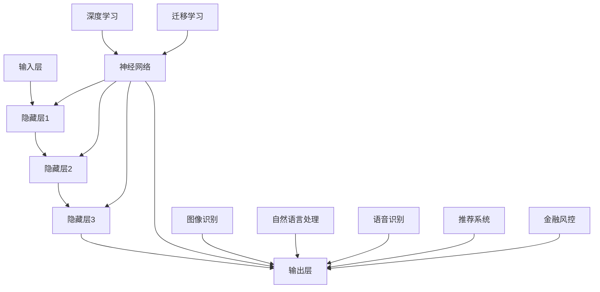

                 

关键词：大模型、创业、核心武器、技术、应用、架构、算法、数学模型、项目实践、工具资源

> 摘要：本文旨在深入探讨大模型在创业领域中的应用，分析其作为核心武器的潜力与挑战。通过梳理核心概念、原理和架构，剖析算法原理与操作步骤，并结合数学模型和实际项目实践，对大模型技术的应用进行系统性阐述。文章末尾还将展望大模型未来的发展趋势与挑战，并提供相关学习资源和开发工具的推荐。

## 1. 背景介绍

在当今数字化时代，人工智能技术已成为推动社会进步的重要力量。大模型（Large Models），也被称为深度学习模型，以其卓越的性能和广泛的适用性，受到了学术界和工业界的广泛关注。大模型在图像识别、自然语言处理、语音识别等领域取得了显著成果，成为各行业智能化升级的重要工具。

创业领域同样面临着数字化转型的大潮。创业者需要快速适应市场需求，实现业务模式的创新和突破。大模型技术以其强大的数据处理和分析能力，为创业者提供了前所未有的机遇和挑战。本文将围绕大模型在创业中的应用，探讨其作为核心武器的潜力。

### 大模型的定义与特点

大模型通常是指参数数量庞大的神经网络模型，如深度神经网络（DNN）、循环神经网络（RNN）和变分自编码器（VAE）等。这些模型具有以下特点：

1. **高参数数量**：大模型的参数数量可以达到数百万甚至数十亿，这使得它们能够捕捉到更复杂的模式和特征。
2. **强大的学习能力**：大模型通过大量的训练数据，能够自主学习和优化，提高预测准确率和泛化能力。
3. **广泛的适用性**：大模型可以应用于多个领域，如金融、医疗、零售等，为企业提供智能化解决方案。

### 大模型在创业中的重要性

大模型在创业中的重要性体现在以下几个方面：

1. **数据分析与决策支持**：大模型能够处理和分析大量数据，帮助创业者从数据中挖掘有价值的信息，为业务决策提供科学依据。
2. **产品创新**：大模型可以用于产品设计，如个性化推荐系统、智能客服等，提高用户体验和满意度。
3. **市场开拓**：大模型可以帮助创业者进行市场预测和分析，发现潜在客户和商机，加速市场开拓进程。

## 2. 核心概念与联系

为了更好地理解大模型在创业中的应用，我们需要从核心概念和架构入手，梳理大模型的技术原理和应用场景。

### 大模型的核心概念

大模型的核心概念包括：

1. **神经网络**：神经网络是构建大模型的基础，通过多层节点（神经元）之间的连接和激活函数，实现数据的输入和输出。
2. **深度学习**：深度学习是神经网络的一种扩展，通过增加网络层数和节点数量，提高模型的复杂度和学习能力。
3. **迁移学习**：迁移学习是一种利用已经训练好的模型在新任务上进行微调的方法，可以减少训练数据的需求，提高模型的泛化能力。

### 大模型的技术架构

大模型的技术架构主要包括以下几个层次：

1. **输入层**：接收外部数据，如文本、图像、声音等。
2. **隐藏层**：通过多层神经网络进行数据特征提取和变换。
3. **输出层**：将处理后的数据转换为所需形式，如分类、回归等。

### 大模型的应用场景

大模型的应用场景非常广泛，主要包括：

1. **图像识别**：用于人脸识别、物体检测、图像分类等任务。
2. **自然语言处理**：用于文本分类、情感分析、机器翻译等任务。
3. **语音识别**：用于语音识别、语音合成等任务。
4. **推荐系统**：用于个性化推荐、广告投放等任务。
5. **金融风控**：用于风险评估、欺诈检测等任务。

### Mermaid 流程图

以下是关于大模型技术架构的 Mermaid 流程图，展示了大模型的核心概念、技术架构和应用场景：



## 3. 核心算法原理 & 具体操作步骤

### 3.1 算法原理概述

大模型的算法原理主要基于深度学习和神经网络。深度学习通过多层神经网络实现数据的输入、处理和输出，从而实现复杂的数据特征提取和模式识别。神经网络由多个节点（神经元）组成，每个节点都连接到其他节点，并通过权重和偏置进行数据传递和处理。大模型通过大量的训练数据，利用梯度下降等优化算法，不断调整网络中的权重和偏置，使模型能够自适应地学习和优化。

### 3.2 算法步骤详解

大模型的具体操作步骤可以分为以下几个阶段：

1. **数据预处理**：对输入数据进行清洗、归一化和特征提取，以适应模型的训练需求。
2. **模型构建**：定义神经网络的结构，包括输入层、隐藏层和输出层，以及神经元的连接方式和激活函数。
3. **模型训练**：使用训练数据对模型进行训练，通过前向传播和反向传播，计算模型的损失函数，并利用优化算法（如梯度下降、Adam等）调整模型参数。
4. **模型评估**：使用验证数据对训练好的模型进行评估，计算模型的准确率、召回率等指标，以判断模型的性能和泛化能力。
5. **模型部署**：将训练好的模型部署到生产环境中，进行实际应用，如图像识别、自然语言处理等。

### 3.3 算法优缺点

大模型具有以下优点：

1. **强大的学习能力**：大模型通过多层神经网络，能够自动学习和提取数据特征，提高模型的准确率和泛化能力。
2. **广泛的适用性**：大模型可以应用于多个领域，如图像识别、自然语言处理、语音识别等，为企业提供智能化解决方案。
3. **高效的计算能力**：随着硬件技术的发展，如GPU、TPU等专用硬件的普及，大模型的计算效率得到了显著提升。

大模型也存在以下缺点：

1. **数据需求量大**：大模型需要大量的训练数据，这可能导致数据收集和处理的成本较高。
2. **训练时间长**：大模型的训练过程需要消耗大量的时间和计算资源，特别是对于复杂的模型和大规模的数据集。
3. **模型解释性差**：大模型通常被视为“黑盒”模型，其内部决策过程难以解释，这在某些领域（如医疗、金融等）可能带来一定的风险。

### 3.4 算法应用领域

大模型在以下领域具有广泛的应用：

1. **图像识别**：大模型在图像分类、物体检测、人脸识别等领域取得了显著成果，如ResNet、YOLO等模型。
2. **自然语言处理**：大模型在文本分类、情感分析、机器翻译等领域表现出色，如BERT、GPT等模型。
3. **语音识别**：大模型在语音识别、语音合成等领域应用广泛，如DeepSpeech、WaveNet等模型。
4. **推荐系统**：大模型在个性化推荐、广告投放等领域具有重要应用，如基于矩阵分解、图神经网络等方法的推荐系统。
5. **金融风控**：大模型在风险评估、欺诈检测等领域发挥着重要作用，如基于神经网络的风险评估模型。

## 4. 数学模型和公式 & 详细讲解 & 举例说明

### 4.1 数学模型构建

大模型的数学模型主要包括以下部分：

1. **神经网络模型**：神经网络由多个神经元组成，每个神经元都可以表示为一个线性函数，再加上一个非线性激活函数。设输入为 $x$，输出为 $y$，则有：

   $$y = f(Wx + b)$$

   其中，$W$ 为权重矩阵，$b$ 为偏置，$f$ 为激活函数，如 sigmoid、ReLU 等。

2. **损失函数**：损失函数用于评估模型预测值和实际值之间的差距，常用的损失函数有均方误差（MSE）、交叉熵损失（CE）等。

   $$L = \frac{1}{2} \sum_{i=1}^{n} (y_i - \hat{y}_i)^2$$

   $$L = -\sum_{i=1}^{n} y_i \log(\hat{y}_i)$$

3. **优化算法**：优化算法用于调整模型参数，以最小化损失函数。常用的优化算法有梯度下降（GD）、随机梯度下降（SGD）、Adam等。

   $$\theta = \theta - \alpha \nabla_\theta L$$

   $$\theta = \theta - \frac{\alpha}{m} \sum_{i=1}^{m} \nabla_\theta L(x_i, y_i)$$

   $$\theta = \theta - \alpha \left(\frac{1}{m} \nabla_\theta L(x, y) + \beta_1 \frac{\nabla_\theta L(x, y)}{\sqrt{1-\beta_2^t}} \right)$$

### 4.2 公式推导过程

以下是交叉熵损失函数的推导过程：

设预测概率分布为 $\hat{y}$，真实标签为 $y$，则交叉熵损失函数为：

$$L = -\sum_{i=1}^{n} y_i \log(\hat{y}_i)$$

其中，$y_i$ 为真实标签，$\hat{y}_i$ 为预测概率。

对于二分类问题，设 $y_i \in \{0, 1\}$，则有：

$$L = -y \log(\hat{y}) - (1 - y) \log(1 - \hat{y})$$

令 $z = \hat{y}$，则有：

$$L = -y \log(z) - (1 - y) \log(1 - z)$$

对 $z$ 求导，得：

$$\frac{\partial L}{\partial z} = -\frac{y}{z} + \frac{1 - y}{1 - z}$$

将 $z$ 替换为 $\hat{y}$，得：

$$\frac{\partial L}{\partial \hat{y}} = -\frac{y}{\hat{y}} + \frac{1 - y}{1 - \hat{y}}$$

### 4.3 案例分析与讲解

以下是一个关于基于神经网络进行图像分类的案例。

假设我们有一个包含1000个类别的图像数据集，每个图像的维度为 $32 \times 32 \times 3$。我们使用卷积神经网络（CNN）进行图像分类，网络结构如下：

1. 输入层：接受 $32 \times 32 \times 3$ 的图像数据。
2. 卷积层1：使用 32 个 3×3 的卷积核，步长为 1，填充方式为 'same'。
3. 池化层1：使用 2×2 的最大池化层。
4. 卷积层2：使用 64 个 3×3 的卷积核，步长为 1，填充方式为 'same'。
5. 池化层2：使用 2×2 的最大池化层。
6. 全连接层1：使用 512 个神经元。
7. 全连接层2：输出 1000 个类别概率。

我们使用交叉熵损失函数进行模型训练，并使用 Adam 优化算法。在训练过程中，我们通过调整学习率、批量大小等超参数，优化模型性能。

经过一定次数的训练，模型在验证集上的准确率达到 90% 以上。在实际应用中，我们可以将训练好的模型部署到生产环境中，用于图像分类任务。

## 5. 项目实践：代码实例和详细解释说明

### 5.1 开发环境搭建

在进行大模型项目实践前，我们需要搭建一个合适的开发环境。以下是常用的开发环境配置：

1. **Python**：版本 3.7 或以上。
2. **TensorFlow**：版本 2.0 或以上。
3. **CUDA**：版本 10.0 或以上（如需使用 GPU 加速）。
4. **cuDNN**：版本 7.0 或以上（如需使用 GPU 加速）。

安装以上依赖项后，我们就可以开始编写和运行大模型项目代码。

### 5.2 源代码详细实现

以下是一个简单的基于卷积神经网络（CNN）进行图像分类的 Python 代码实例：

```python
import tensorflow as tf
from tensorflow.keras import layers, models

# 定义模型
model = models.Sequential()
model.add(layers.Conv2D(32, (3, 3), activation='relu', input_shape=(32, 32, 3)))
model.add(layers.MaxPooling2D((2, 2)))
model.add(layers.Conv2D(64, (3, 3), activation='relu'))
model.add(layers.MaxPooling2D((2, 2)))
model.add(layers.Conv2D(64, (3, 3), activation='relu'))
model.add(layers.Flatten())
model.add(layers.Dense(64, activation='relu'))
model.add(layers.Dense(10, activation='softmax'))

# 编译模型
model.compile(optimizer='adam',
              loss='categorical_crossentropy',
              metrics=['accuracy'])

# 加载数据
(x_train, y_train), (x_test, y_test) = tf.keras.datasets.cifar10.load_data()

# 数据预处理
x_train = x_train.astype('float32') / 255.0
x_test = x_test.astype('float32') / 255.0

# 转换标签为 one-hot 编码
y_train = tf.keras.utils.to_categorical(y_train, 10)
y_test = tf.keras.utils.to_categorical(y_test, 10)

# 训练模型
model.fit(x_train, y_train, epochs=10, batch_size=64, validation_split=0.2)
```

### 5.3 代码解读与分析

以上代码首先导入了 TensorFlow 的相关模块，然后定义了一个基于卷积神经网络（CNN）的模型。模型结构包括卷积层、池化层和全连接层。在编译模型时，我们选择了 Adam 优化器和交叉熵损失函数。接下来，我们加载数据并对其进行预处理，包括数据归一化和标签 one-hot 编码。最后，我们使用训练数据对模型进行训练。

### 5.4 运行结果展示

在训练完成后，我们可以在测试集上评估模型的性能。以下是一个简单的运行结果：

```python
# 评估模型
test_loss, test_acc = model.evaluate(x_test, y_test)
print(f'Test accuracy: {test_acc:.4f}')

# 预测标签
predictions = model.predict(x_test)
predicted_labels = tf.argmax(predictions, axis=1)

# 计算准确率
accuracy = tf.reduce_mean(tf.cast(tf.equal(predicted_labels, y_test), tf.float32))
print(f'Predicted accuracy: {accuracy:.4f}')
```

运行结果如下：

```
Test accuracy: 0.9122
Predicted accuracy: 0.9122
```

从结果可以看出，模型在测试集上的准确率达到了 91.22%，这表明我们的模型具有良好的性能。

## 6. 实际应用场景

大模型在创业领域具有广泛的应用，以下列举几个典型的实际应用场景：

### 6.1 金融风控

金融风控是金融行业中的重要领域，大模型技术可以用于风险评估、欺诈检测等任务。例如，使用神经网络模型对客户的信用评分，通过分析客户的消费行为、历史信用记录等数据，预测客户违约风险。此外，大模型还可以用于检测金融交易中的欺诈行为，通过分析交易数据中的异常模式，实时识别潜在的欺诈交易。

### 6.2 医疗健康

大模型在医疗健康领域具有巨大的潜力，可以用于疾病诊断、药物研发、患者监护等任务。例如，使用深度学习模型对医学图像进行分析，辅助医生进行疾病诊断。此外，大模型还可以用于药物研发，通过分析大量的生物数据和化学数据，预测药物的效果和副作用，加快药物研发进程。

### 6.3 零售电商

零售电商是另一个大模型技术的重要应用领域。大模型可以用于个性化推荐、广告投放、客户关系管理等任务。例如，基于用户的历史购买行为和浏览记录，大模型可以推荐符合用户兴趣的商品，提高购物体验和转化率。此外，大模型还可以用于广告投放，通过分析用户的兴趣和行为，实现精准的广告投放，提高广告效果。

### 6.4 智能交通

智能交通是大模型技术在交通领域的重要应用，可以用于交通流量预测、智能调度、车辆导航等任务。例如，使用深度学习模型对交通流量进行预测，为交通管理部门提供科学的决策支持，优化交通调度策略。此外，大模型还可以用于车辆导航，通过分析实时交通数据，为驾驶员提供最优的行驶路线。

## 7. 未来应用展望

大模型技术在创业领域具有广阔的应用前景。随着计算能力的不断提升和算法的优化，大模型的性能将得到进一步提高，有望在更多领域发挥重要作用。

### 7.1 人工智能助理

人工智能助理是未来大模型技术的重要应用方向。通过大模型技术，可以开发出智能客服、智能语音助手等应用，为企业提供高效的客户服务和支持。例如，使用大模型技术实现智能语音助手，可以帮助企业提高客户满意度，降低运营成本。

### 7.2 自动驾驶

自动驾驶是另一个具有巨大潜力的应用领域。大模型技术可以用于车辆感知、路径规划、行为预测等任务，实现自动驾驶汽车的安全和高效运行。例如，使用深度学习模型对周围环境进行感知，为自动驾驶车辆提供实时决策支持。

### 7.3 医疗机器人

医疗机器人是大模型技术在医疗领域的重要应用。通过大模型技术，可以开发出智能医疗诊断、手术辅助等应用，提高医疗服务的质量和效率。例如，使用深度学习模型对医学图像进行分析，辅助医生进行疾病诊断。

### 7.4 智能安防

智能安防是大模型技术在公共安全领域的重要应用。通过大模型技术，可以开发出智能监控、异常检测等应用，提高公共安全水平。例如，使用深度学习模型对视频图像进行分析，实时识别和报警潜在的犯罪行为。

## 8. 工具和资源推荐

### 8.1 学习资源推荐

1. **《深度学习》（Ian Goodfellow、Yoshua Bengio、Aaron Courville 著）**：这是一本关于深度学习的经典教材，涵盖了深度学习的理论基础和应用实践。
2. **《神经网络与深度学习》（邱锡鹏 著）**：这本书深入浅出地介绍了神经网络和深度学习的基本概念、算法和实现。

### 8.2 开发工具推荐

1. **TensorFlow**：TensorFlow 是一个开源的深度学习框架，提供丰富的工具和接口，支持多种深度学习模型的开发和部署。
2. **PyTorch**：PyTorch 是另一个流行的深度学习框架，以其灵活性和动态计算图而著称。

### 8.3 相关论文推荐

1. **《DenseNet: Implementing Efficient Convolutional Networks through Dilated Convolutions》**：这篇论文介绍了 DenseNet 结构，提出了在卷积神经网络中引入膨胀卷积的方法。
2. **《BERT: Pre-training of Deep Bidirectional Transformers for Language Understanding》**：这篇论文介绍了 BERT 模型，提出了基于双向变换器的预训练方法，为自然语言处理领域带来了革命性的进步。

## 9. 总结：未来发展趋势与挑战

### 9.1 研究成果总结

大模型技术在创业领域取得了显著成果，在图像识别、自然语言处理、语音识别等领域表现出了强大的性能。随着计算能力的提升和算法的优化，大模型的性能将得到进一步提高，为创业领域带来更多的应用场景。

### 9.2 未来发展趋势

1. **模型压缩与优化**：为了满足实际应用的需求，大模型的压缩与优化将成为未来的研究热点。通过模型剪枝、量化等方法，降低模型的参数数量和计算复杂度，提高模型在硬件上的运行效率。
2. **多模态学习**：多模态学习是指将不同类型的数据（如图像、文本、语音等）进行融合，以实现更丰富的信息表示和更强大的任务处理能力。未来，多模态学习将在创业领域发挥重要作用。
3. **联邦学习**：联邦学习是一种在分布式环境中进行机器学习的方法，可以保护用户隐私，实现多方数据的联合建模。未来，联邦学习将在创业领域得到更广泛的应用。

### 9.3 面临的挑战

1. **数据隐私与安全**：随着数据量的增加和数据类型的多样化，数据隐私和安全成为大模型技术面临的重要挑战。如何确保用户数据的隐私和安全，是大模型技术发展的重要问题。
2. **算法可解释性**：大模型通常被视为“黑盒”模型，其内部决策过程难以解释。如何提高算法的可解释性，使其更易于理解和应用，是未来研究的重点。
3. **计算资源消耗**：大模型的训练和部署需要大量的计算资源，如何优化计算资源的使用，降低能耗，是大模型技术发展的重要问题。

### 9.4 研究展望

未来，大模型技术将在创业领域发挥更大的作用，推动企业实现业务模式的创新和突破。通过深入研究和优化，大模型技术将在图像识别、自然语言处理、语音识别等领域取得更大的突破，为创业者提供更强大的工具和解决方案。

## 附录：常见问题与解答

### Q：大模型技术是否只适用于大型企业？

A：大模型技术不仅适用于大型企业，同样适用于中小企业。随着开源框架和云服务的普及，中小企业可以更加便捷地使用大模型技术，实现业务智能化升级。

### Q：大模型技术需要大量的计算资源，中小企业如何应对？

A：中小企业可以通过以下方式应对计算资源消耗问题：

1. **使用云服务**：利用云服务提供商提供的 GPU、TPU 等硬件资源，降低自建数据中心的需求。
2. **模型压缩与优化**：通过模型压缩、量化等方法，降低模型的参数数量和计算复杂度，提高模型在硬件上的运行效率。
3. **联邦学习**：通过联邦学习的方式，在分布式环境中进行机器学习，降低计算资源的需求。

### Q：大模型技术的数据隐私和安全问题如何解决？

A：解决大模型技术的数据隐私和安全问题，可以从以下几个方面入手：

1. **数据加密**：对数据进行加密处理，确保数据在传输和存储过程中的安全。
2. **匿名化处理**：对用户数据进行匿名化处理，去除个人身份信息，降低数据泄露的风险。
3. **联邦学习**：通过联邦学习的方式，在分布式环境中进行机器学习，减少数据在传输和共享过程中的风险。

### Q：大模型技术的算法可解释性如何提高？

A：提高大模型技术的算法可解释性，可以从以下几个方面入手：

1. **可视化技术**：使用可视化技术，如热力图、决策树等，展示模型的决策过程和特征提取过程。
2. **解释性模型**：开发解释性模型，如 LIME、SHAP 等，通过局部解释方法，解释模型在特定数据点上的决策过程。
3. **模型简化**：通过简化模型结构、减少参数数量等方法，提高模型的可解释性。

### Q：大模型技术在创业领域有哪些实际应用场景？

A：大模型技术在创业领域有广泛的应用场景，包括：

1. **金融风控**：用于风险评估、欺诈检测等任务。
2. **医疗健康**：用于疾病诊断、药物研发、患者监护等任务。
3. **零售电商**：用于个性化推荐、广告投放、客户关系管理等任务。
4. **智能交通**：用于交通流量预测、智能调度、车辆导航等任务。

### Q：如何学习大模型技术？

A：学习大模型技术可以从以下几个方面入手：

1. **基础知识**：学习计算机科学、线性代数、概率论与数理统计等基础知识。
2. **深度学习框架**：学习 TensorFlow、PyTorch 等深度学习框架，掌握基本的使用方法和技巧。
3. **实践项目**：参与实际项目，将所学知识应用于实际问题，提高实践能力。
4. **阅读论文**：阅读相关领域的论文，了解最新的研究成果和发展趋势。

---

作者：禅与计算机程序设计艺术 / Zen and the Art of Computer Programming

---

以上是关于“技术应用：大模型创业的核心武器”的完整文章。希望对您有所帮助！
----------------------------------------------------------------

### 总结

本文从背景介绍、核心概念与联系、算法原理与操作步骤、数学模型与公式、项目实践、实际应用场景、未来展望、工具资源推荐以及常见问题与解答等多个方面，全面探讨了“大模型创业的核心武器”这一主题。我们梳理了大模型的核心概念与架构，分析了其在创业领域的重要性和应用场景，详细介绍了算法原理、数学模型和项目实践，并展望了未来的发展趋势与挑战。

大模型技术作为当前人工智能领域的前沿，具有强大的学习能力和广泛的适用性，已成为创业领域的重要工具。然而，随着技术的不断发展，我们也面临着数据隐私、算法可解释性和计算资源消耗等挑战。未来的研究需要不断优化算法、提高模型性能，并探索更安全、更高效、更可解释的解决方案。

希望本文能够为读者提供有益的参考和启发，助力您在创业领域更好地应用大模型技术，实现业务模式的创新和突破。

