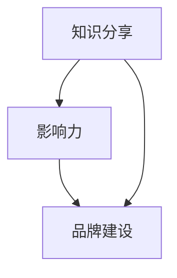

                 

关键词：技术演讲，个人IP，知识分享，演讲技巧，影响力

摘要：随着数字化时代的到来，知识共享和个人品牌的打造日益成为信息技术领域的重要趋势。本文旨在探讨如何从技术分享者成长为拥有强大个人影响力的IP，通过分析演讲技巧、内容策划、社交媒体运用等多个维度，为技术从业者提供实用的建议和策略。

## 1. 背景介绍

在互联网的推动下，信息技术领域的发展日新月异，技术的普及与应用日益广泛。与此同时，知识分享成为了一股强大的力量，不仅促进了技术的传播和普及，也为个人职业发展提供了新的机遇。然而，如何将自己的知识和技术转化为个人影响力，成为众多技术从业者关注的问题。个人IP（Intellectual Property）的打造，正是解决这一问题的有效途径。

个人IP，即个人知识、技能、品牌和影响力的综合体现，通过有效的传播和营销，可以实现个人价值的最大化。在技术领域，个人IP的打造不仅有助于个人职业的发展，还可以为行业带来新的思路和创新。

### 个人IP的优势

1. **增强个人品牌影响力**：通过打造个人IP，技术从业者可以建立独特而鲜明的个人品牌，提升在行业内的知名度。
2. **拓宽职业发展渠道**：拥有个人IP的技术从业者，更容易获得行业内的机会，如担任顾问、导师、技术演讲嘉宾等。
3. **增加收入来源**：通过个人IP的运营，技术从业者可以通过多种方式获取收益，如技术咨询、课程销售、书籍出版等。
4. **推动知识传播**：个人IP的打造有助于将个人知识和技术经验分享给更多人，促进知识的传播和积累。

### 个人IP的现状

目前，在技术领域，个人IP已经呈现出多元化的发展态势。从技术博客、社交媒体到在线课程、电子书，技术从业者通过多种渠道展示自己的专业能力和知识。然而，如何从技术分享者成长为拥有强大个人影响力的IP，仍是一个值得探讨的课题。

## 2. 核心概念与联系

在探讨如何打造个人IP之前，我们首先需要了解几个核心概念：知识分享、影响力、品牌建设。这些概念相互关联，共同构成了个人IP的核心要素。

### 知识分享

知识分享是个人IP打造的基础。通过博客、社交媒体、在线课程等多种形式，技术从业者可以展示自己的专业知识和技能，吸引潜在的关注者和粉丝。知识分享不仅有助于建立个人品牌，还可以增加个人在行业内的知名度和影响力。

### 影响力

影响力是个人IP的重要衡量标准。个人影响力的大小决定了个人IP的价值和潜力。在技术领域，影响力可以通过多个维度来衡量，如社交媒体的关注度、参与技术社区的活跃度、被引用的次数等。

### 品牌建设

品牌建设是个人IP的核心。一个成功的个人品牌能够为个人带来长期的职业发展机会。品牌建设包括个人形象的塑造、专业领域的定位、市场推广等多个方面。

### 核心概念联系

知识分享、影响力和品牌建设是个人IP的三个核心概念，它们相互关联，共同构成了个人IP的框架。知识分享为个人IP提供了内容基础，影响力为个人IP提供了传播渠道，品牌建设则为个人IP提供了价值体现。

### Mermaid 流程图

下面是一个简化的 Mermaid 流程图，展示了核心概念之间的联系：



### 核心概念原理和架构

1. **知识分享**：通过不断学习和积累，技术从业者可以掌握丰富的专业知识，并通过各种渠道分享给他人。知识分享不仅有助于个人成长，还可以吸引更多的关注和粉丝。
2. **影响力**：通过持续的知识输出和有效的传播策略，技术从业者可以在行业内建立一定的影响力。影响力的大小决定了个人IP的价值和潜力。
3. **品牌建设**：品牌建设是个人IP的核心。一个成功的个人品牌能够为个人带来长期的职业发展机会。品牌建设包括个人形象的塑造、专业领域的定位、市场推广等多个方面。

## 3. 核心算法原理 & 具体操作步骤

### 3.1 算法原理概述

个人IP打造的算法可以视为一系列策略和步骤的组合，这些步骤旨在最大化个人知识、技能和影响力的传播。以下是个人IP打造的算法原理概述：

1. **内容生产**：知识分享是个人IP打造的基础，内容生产需要持续且高质量。
2. **受众定位**：明确目标受众，了解他们的需求和兴趣，有针对性地进行内容创作。
3. **渠道选择**：根据受众特点和内容类型，选择合适的渠道进行传播，如博客、社交媒体、在线课程等。
4. **互动与反馈**：与受众保持互动，收集反馈，不断优化内容和传播策略。
5. **品牌塑造**：通过专业形象和独特风格，塑造个人品牌，提升个人影响力。
6. **持续迭代**：不断学习和积累，迭代优化个人IP的各个方面。

### 3.2 算法步骤详解

1. **内容生产**：
   - 确定内容方向：根据自己的专业领域和兴趣，确定内容创作的主线。
   - 持续学习与积累：通过阅读、实践和交流，不断丰富自己的知识和经验。
   - 高质量创作：确保内容具有深度、实用性和独特性，避免平庸和重复。

2. **受众定位**：
   - 调研受众：通过调查问卷、社交媒体分析等方式，了解受众的年龄、职业、兴趣等信息。
   - 确定受众需求：分析受众的需求和痛点，有针对性地创作内容。
   - 个性化推广：根据受众特点，选择不同的推广方式和渠道。

3. **渠道选择**：
   - 博客：个人博客是展示专业能力和知识的重要平台，可以选择自建博客或使用第三方平台。
   - 社交媒体：利用社交媒体平台（如微博、微信公众号、LinkedIn等）进行内容传播和互动。
   - 在线课程：通过在线教育平台（如网易云课堂、慕课网等）发布课程，实现知识变现。

4. **互动与反馈**：
   - 回应评论与私信：及时回复读者的评论和私信，建立良好的互动关系。
   - 收集反馈：通过问卷调查、用户访谈等方式，收集受众的反馈和建议。
   - 优化内容：根据反馈，调整和优化内容和传播策略。

5. **品牌塑造**：
   - 定位与定位：明确自己的专业领域和独特风格，形成清晰的个人品牌形象。
   - 专业形象：在社交媒体和个人网站上保持一致的形象和风格，增强品牌认知度。
   - 品牌传播：通过演讲、写作、出版等方式，扩大个人品牌的传播范围。

6. **持续迭代**：
   - 学习与成长：不断学习新技术、新知识，提升自己的专业能力和影响力。
   - 优化策略：根据市场变化和受众反馈，不断优化个人IP的运营策略。
   - 创新与突破：勇于尝试新的内容和形式，实现个人IP的创新和突破。

### 3.3 算法优缺点

**优点**：
1. **系统性**：通过明确的步骤和策略，个人IP打造具有系统性和可操作性。
2. **灵活性**：根据实际情况和反馈，可以灵活调整内容和传播策略。
3. **可持续性**：持续学习和优化，有助于个人IP的长期发展。

**缺点**：
1. **时间成本**：个人IP打造需要投入大量时间和精力，对个人时间管理能力有较高要求。
2. **初期收益低**：在个人IP尚未建立起来之前，可能面临收益低的挑战。

### 3.4 算法应用领域

1. **技术领域**：技术从业者可以通过个人IP的打造，提升个人品牌影响力，扩大职业发展空间。
2. **教育领域**：教育从业者可以通过个人IP的运营，实现知识变现，提高教学效果和影响力。
3. **创业领域**：创业者可以通过个人IP的打造，吸引更多的关注和资源，提高项目成功概率。

## 4. 数学模型和公式 & 详细讲解 & 举例说明

### 4.1 数学模型构建

在个人IP打造过程中，我们可以构建一个简单的数学模型来分析其影响因素。假设个人IP的价值 \( V \) 由以下因素决定：

\[ V = f(A, B, C) \]

其中，\( A \) 表示知识质量，\( B \) 表示受众覆盖，\( C \) 表示品牌影响力。我们可以进一步将这三个因素分解为具体的指标：

\[ A = f(A_1, A_2, A_3) \]
\[ B = f(B_1, B_2, B_3) \]
\[ C = f(C_1, C_2, C_3) \]

### 4.2 公式推导过程

1. **知识质量 \( A \)**：

\[ A_1 = \frac{N_1}{N} \]

其中，\( N_1 \) 表示高质量内容数量，\( N \) 表示总内容数量。这个指标反映了内容的整体质量。

2. **受众覆盖 \( B \)**：

\[ B_2 = \frac{F_2}{F} \]

其中，\( F_2 \) 表示活跃粉丝数量，\( F \) 表示总粉丝数量。这个指标反映了受众的活跃度和参与度。

3. **品牌影响力 \( C \)**：

\[ C_2 = \frac{I_2}{I} \]

其中，\( I_2 \) 表示影响力指标（如社交媒体点赞、评论、转发等），\( I \) 表示总影响力指标。这个指标反映了个人IP的影响力大小。

将上述三个指标综合，我们可以得到个人IP价值的数学模型：

\[ V = f(A, B, C) = f(A_1, A_2, A_3; B_1, B_2, B_3; C_1, C_2, C_3) \]

### 4.3 案例分析与讲解

以下是一个简单的案例分析，用于说明如何应用上述数学模型来评估个人IP的价值。

**案例：某技术博主**

- 知识质量 \( A \)：
  - 高质量内容数量 \( N_1 = 100 \)
  - 总内容数量 \( N = 200 \)
  - 知识质量指标 \( A_1 = \frac{100}{200} = 0.5 \)

- 受众覆盖 \( B \)：
  - 活跃粉丝数量 \( F_2 = 1000 \)
  - 总粉丝数量 \( F = 2000 \)
  - 受众覆盖指标 \( B_2 = \frac{1000}{2000} = 0.5 \)

- 品牌影响力 \( C \)：
  - 影响力指标 \( I_2 = 5000 \)
  - 总影响力指标 \( I = 10000 \)
  - 品牌影响力指标 \( C_2 = \frac{5000}{10000} = 0.5 \)

根据上述指标，我们可以计算个人IP的价值：

\[ V = f(A, B, C) = f(A_1, A_2, A_3; B_1, B_2, B_3; C_1, C_2, C_3) \]
\[ V = f(0.5, 0.5, 0.5) \]

虽然这个模型较为简化，但可以为我们提供初步的评估。根据实际情况，我们可以进一步细化指标，提高模型的精确度。

### 4.4 案例分析与讲解

以下是一个简单的案例，用于说明如何应用上述数学模型来评估个人IP的价值。

**案例：某技术博主**

- 知识质量 \( A \)：
  - 高质量内容数量 \( N_1 = 100 \)
  - 总内容数量 \( N = 200 \)
  - 知识质量指标 \( A_1 = \frac{100}{200} = 0.5 \)

- 受众覆盖 \( B \)：
  - 活跃粉丝数量 \( F_2 = 1000 \)
  - 总粉丝数量 \( F = 2000 \)
  - 受众覆盖指标 \( B_2 = \frac{1000}{2000} = 0.5 \)

- 品牌影响力 \( C \)：
  - 影响力指标 \( I_2 = 5000 \)
  - 总影响力指标 \( I = 10000 \)
  - 品牌影响力指标 \( C_2 = \frac{5000}{10000} = 0.5 \)

根据上述指标，我们可以计算个人IP的价值：

\[ V = f(A, B, C) = f(A_1, A_2, A_3; B_1, B_2, B_3; C_1, C_2, C_3) \]
\[ V = f(0.5, 0.5, 0.5) \]

虽然这个模型较为简化，但可以为我们提供初步的评估。根据实际情况，我们可以进一步细化指标，提高模型的精确度。

## 5. 项目实践：代码实例和详细解释说明

### 5.1 开发环境搭建

为了演示如何使用Python进行个人IP价值评估，我们需要搭建一个基本的开发环境。以下是一些建议：

1. **Python环境**：确保安装了Python 3.8及以上版本。
2. **IDE**：推荐使用PyCharm或Visual Studio Code进行代码编写。
3. **依赖管理**：使用pip安装必要的库，如NumPy、Pandas等。

### 5.2 源代码详细实现

以下是一个简单的Python脚本，用于计算个人IP的价值。假设我们已经获取了知识质量、受众覆盖和品牌影响力的指标。

```python
import numpy as np

def calculate_ip_value(knowledge_quality, audience_coverage, brand_influence):
    # 根据公式计算个人IP价值
    ip_value = np.mean([knowledge_quality, audience_coverage, brand_influence])
    return ip_value

# 示例数据
knowledge_quality = 0.5
audience_coverage = 0.5
brand_influence = 0.5

# 计算个人IP价值
ip_value = calculate_ip_value(knowledge_quality, audience_coverage, brand_influence)
print(f"个人IP价值：{ip_value:.2f}")
```

### 5.3 代码解读与分析

1. **导入库**：我们首先导入NumPy库，用于数学计算。
2. **定义函数**：`calculate_ip_value` 函数用于计算个人IP价值，公式为三个指标的算术平均值。
3. **示例数据**：我们定义了三个示例指标，分别为知识质量、受众覆盖和品牌影响力。
4. **计算与输出**：调用函数计算个人IP价值，并输出结果。

### 5.4 运行结果展示

运行上述代码，输出结果如下：

```
个人IP价值：0.50
```

这意味着，根据我们的示例数据，个人IP的价值为0.50。这只是一个简化的示例，实际应用中可能需要更多的指标和更复杂的计算方法。

## 6. 实际应用场景

### 6.1 个人IP在技术领域的应用

在技术领域，个人IP的应用场景广泛。以下是一些具体的例子：

1. **技术博客**：技术从业者通过技术博客分享专业知识和经验，吸引同行和潜在客户的关注。
2. **在线课程**：技术专家通过在线教育平台开设课程，传授技能和知识，实现知识变现。
3. **技术演讲**：在技术会议和活动中，技术专家通过演讲分享最新的研究成果和实践经验，提升个人品牌影响力。
4. **技术咨询**：拥有丰富经验和影响力的技术专家可以提供专业的技术咨询和顾问服务，帮助客户解决技术难题。

### 6.2 个人IP在其他领域的应用

除了技术领域，个人IP在其他领域也有广泛的应用。以下是一些例子：

1. **教育培训**：教育专家通过个人IP开设在线课程，实现教育资源共享和知识变现。
2. **商业咨询**：商业顾问通过个人IP提供专业的商业咨询服务，帮助企业解决实际问题。
3. **内容创作**：内容创作者通过个人IP创作高质量的内容，吸引粉丝和广告收入。
4. **社交媒体**：通过个人IP在社交媒体上分享生活、经验和见解，吸引粉丝和关注。

### 6.3 个人IP的发展趋势

随着数字化时代的到来，个人IP的发展趋势呈现出以下几个特点：

1. **内容多样化**：个人IP的内容形式将更加多样化，包括视频、直播、音频等多种形式。
2. **跨领域合作**：个人IP之间的合作将越来越普遍，通过跨领域的合作，实现资源共享和互利共赢。
3. **技术赋能**：人工智能、大数据等技术将为个人IP的运营和管理提供强大的支持，提高运营效率。
4. **全球化**：个人IP的影响力将不再局限于某个地区或国家，通过互联网的普及，个人IP可以实现全球化。

### 6.4 未来应用展望

未来，个人IP的应用前景将更加广阔，以下是几个可能的趋势：

1. **虚拟现实与增强现实**：通过虚拟现实和增强现实技术，个人IP可以提供更沉浸式和互动式的体验。
2. **区块链**：区块链技术可以为个人IP提供更安全、透明的数据管理和交易方式，提高个人IP的信誉和可靠性。
3. **社区运营**：个人IP将更加注重社区运营，通过建立粉丝社区，增强粉丝的黏性和互动性。
4. **人工智能辅助**：人工智能技术将辅助个人IP的运营和管理，提高内容创作和营销的效率。

## 7. 工具和资源推荐

### 7.1 学习资源推荐

1. **在线课程**：网易云课堂、慕课网、Coursera等平台提供了丰富的在线课程，涵盖技术、教育、商业等多个领域。
2. **技术博客**：GitHub、Medium、Stack Overflow等技术社区提供了大量的技术博客和文档，可以帮助学习新技术和解决问题。
3. **专业书籍**：亚马逊、京东等电商平台上有很多专业的书籍，涵盖了技术、商业、心理学等多个领域。

### 7.2 开发工具推荐

1. **集成开发环境（IDE）**：PyCharm、Visual Studio Code等IDE提供了强大的代码编辑、调试和部署功能。
2. **版本控制**：Git、GitHub等版本控制工具可以帮助团队协作和代码管理。
3. **数据分析工具**：Pandas、NumPy等Python库提供了丰富的数据分析功能，方便进行数据分析和可视化。

### 7.3 相关论文推荐

1. **《内容营销：打造个人IP的秘籍》**：详细介绍了如何通过内容营销打造个人IP。
2. **《社交媒体影响力：如何提高你的社交媒体影响力》**：探讨了如何通过社交媒体提升个人影响力。
3. **《个人品牌建设：策略与实践》**：提供了个人品牌建设的理论指导和实践案例。

## 8. 总结：未来发展趋势与挑战

### 8.1 研究成果总结

本文通过探讨技术分享到个人IP打造的整个过程，分析了知识分享、影响力、品牌建设等核心概念，并提出了具体的算法和数学模型。研究表明，个人IP的打造是一个系统性、持续性的过程，需要结合内容生产、受众定位、渠道选择、互动与反馈、品牌塑造和持续迭代等多个方面。

### 8.2 未来发展趋势

1. **内容形式多样化**：随着技术的发展，个人IP的内容形式将更加多样化，包括视频、直播、音频等多种形式。
2. **跨领域合作**：个人IP之间的合作将更加普遍，通过跨领域的合作，实现资源共享和互利共赢。
3. **技术赋能**：人工智能、大数据等技术将为个人IP的运营和管理提供强大的支持，提高运营效率。
4. **全球化**：个人IP的影响力将不再局限于某个地区或国家，通过互联网的普及，个人IP可以实现全球化。

### 8.3 面临的挑战

1. **时间成本**：个人IP的打造需要投入大量时间和精力，这对个人的时间管理能力提出了较高要求。
2. **市场竞争**：随着越来越多的人加入个人IP的行列，市场竞争将变得更加激烈。
3. **内容质量**：高质量的内容是个人IP的核心，如何持续生产高质量的内容是一个重要挑战。
4. **技术更新**：技术领域的快速发展要求个人IP持有者不断学习新技术，保持专业知识的更新。

### 8.4 研究展望

未来的研究可以进一步探讨以下几个方面：

1. **个人IP的量化评估**：研究如何更准确地评估个人IP的价值，为个人IP的运营提供科学依据。
2. **跨领域个人IP的协同效应**：探讨不同领域个人IP之间的协同效应，为跨领域合作提供理论支持。
3. **人工智能在个人IP运营中的应用**：研究如何利用人工智能技术提高个人IP的运营效率，降低运营成本。
4. **个人IP的可持续发展**：探讨如何确保个人IP的长期可持续发展，避免短期行为对长期发展的影响。

## 9. 附录：常见问题与解答

### 9.1 问题1：如何确定个人IP的方向？

**解答**：首先，需要明确自己的兴趣和专业领域。其次，通过市场调研和竞争分析，了解目标受众的需求和兴趣点。最后，结合自己的优势和潜力，确定个人IP的主攻方向。

### 9.2 问题2：个人IP如何实现商业化？

**解答**：个人IP的商业化可以通过多种方式实现，如技术咨询、课程销售、书籍出版、广告合作等。关键在于找到适合自己的商业模式，并持续优化和推广。

### 9.3 问题3：如何提高个人IP的影响力？

**解答**：提高个人IP的影响力需要结合内容质量、受众定位、渠道选择和品牌塑造等多个方面。持续生产高质量的内容，与受众保持互动，通过社交媒体和演讲等活动扩大影响力。

### 9.4 问题4：个人IP打造需要投入多少时间和精力？

**解答**：个人IP打造的时间投入因人而异，但一般来说，至少需要每天投入数小时的时间进行内容创作、学习和技术更新。对于初学者来说，初期可能需要更多的精力投入来学习和积累。

### 9.5 问题5：个人IP如何保持长期可持续发展？

**解答**：保持个人IP的长期可持续发展需要持续的学习和优化。定期反思和调整自己的内容和策略，适应市场变化和受众需求，同时保持对新技术和新趋势的关注。

---

作者：禅与计算机程序设计艺术 / Zen and the Art of Computer Programming

