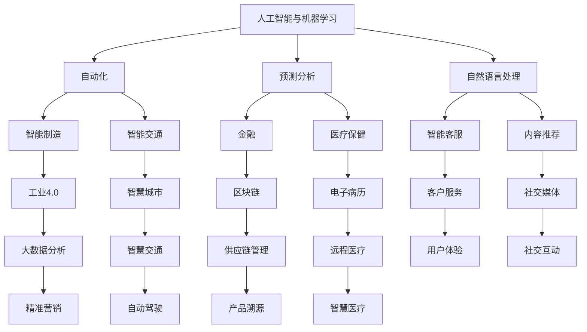

                 

关键词：技术趋势、创业者、人工智能、机器学习、软件开发、区块链、云计算、网络安全、物联网

> 摘要：在当今快速变化的技术环境中，创业者面临着前所未有的机遇和挑战。本文将探讨未来几年内可能影响创业领域的几项关键技术趋势，为创业者提供宝贵的洞察和战略建议，帮助他们把握未来。

## 1. 背景介绍

随着互联网的普及和信息技术的飞速发展，全球创业环境正在经历深刻的变革。新技术的涌现不断重塑市场格局，为创业者提供了丰富的创新机会。然而，与此同时，技术变革也带来了巨大的挑战。创业者不仅需要应对激烈的市场竞争，还要迅速适应不断变化的技术环境，确保自身企业的可持续发展。

本文旨在分析未来几年内可能对创业领域产生重大影响的技术趋势，包括人工智能、机器学习、区块链、云计算、网络安全和物联网等，并提供创业者应对这些趋势的战略建议。

## 2. 核心概念与联系

### 2.1 技术发展趋势概述

为了更好地理解这些技术趋势，我们需要从宏观层面概述它们的核心概念和相互联系。

#### 2.1.1 人工智能与机器学习

人工智能（AI）和机器学习（ML）是当前科技界的热门话题。它们通过模拟人类智能和从数据中学习规律，为各个行业提供了强大的工具。AI和ML的结合正在推动自动化、预测分析、自然语言处理等领域的进步。

#### 2.1.2 区块链

区块链技术通过去中心化的方式记录数据，确保信息的安全性和透明性。它为金融、供应链管理、医疗保健等多个领域带来了革命性的变革。

#### 2.1.3 云计算

云计算提供了灵活、可扩展的计算资源，使得创业者能够以更低的成本、更高的效率进行数据处理和应用程序开发。

#### 2.1.4 网络安全

随着网络攻击手段的不断升级，网络安全成为企业运营的关键因素。先进的加密技术和安全协议有助于保护企业的数据免受威胁。

#### 2.1.5 物联网（IoT）

物联网通过连接各种设备，实现数据的实时收集和分析，为智能制造、智慧城市、智能交通等领域提供了新的解决方案。

### 2.2 Mermaid 流程图

以下是一个简化的Mermaid流程图，展示了这些核心技术趋势之间的关系：



## 3. 核心算法原理 & 具体操作步骤

### 3.1 算法原理概述

在探讨这些技术趋势时，核心算法的原理是不可忽视的。以下是几项关键技术领域中的核心算法概述：

#### 3.1.1 人工智能与机器学习

- **深度学习**：通过多层神经网络模拟人类大脑的学习过程，实现图像识别、语音识别等功能。
- **强化学习**：通过试错和反馈机制，使机器在特定环境中学会做出最优决策。

#### 3.1.2 区块链

- **共识算法**：确保区块链网络中数据的一致性和安全性，如工作量证明（PoW）、权益证明（PoS）等。
- **智能合约**：自动执行合同条款，提高交易效率。

#### 3.1.3 云计算

- **分布式计算**：通过将任务分配给多个计算节点，提高处理能力和效率。
- **容器技术**：如Docker，使应用程序可以在不同的操作系统上运行，提高部署和扩展的灵活性。

#### 3.1.4 网络安全

- **加密技术**：如RSA加密、AES加密等，确保数据传输的安全性。
- **访问控制**：通过身份验证和授权机制，控制对数据的访问权限。

#### 3.1.5 物联网

- **边缘计算**：在靠近数据源的地方进行数据处理，减少延迟。
- **物联网协议**：如MQTT、CoAP等，用于设备之间的通信。

### 3.2 算法步骤详解

以下是这些算法的具体操作步骤：

#### 3.2.1 人工智能与机器学习

- **数据收集与预处理**：收集大量数据，并进行清洗、归一化等预处理操作。
- **模型设计**：根据任务需求设计神经网络结构。
- **模型训练**：使用训练数据集训练模型。
- **模型评估**：使用验证数据集评估模型性能。
- **模型部署**：将训练好的模型部署到生产环境中。

#### 3.2.2 区块链

- **网络搭建**：构建区块链网络，包括节点、区块链数据结构等。
- **共识机制**：实现区块链网络的共识机制，如PoW、PoS。
- **智能合约编写**：编写智能合约，定义合同条款和执行逻辑。
- **交易处理**：处理区块链网络中的交易请求。
- **数据存储**：将交易记录存储在区块链中。

#### 3.2.3 云计算

- **需求分析**：确定计算资源的具体需求。
- **资源分配**：根据需求分配计算资源，如虚拟机、容器等。
- **任务调度**：优化任务在计算资源上的分配和执行。
- **监控与优化**：监控资源使用情况，进行性能优化。

#### 3.2.4 网络安全

- **安全策略制定**：制定安全策略，包括加密、访问控制等。
- **漏洞扫描**：定期扫描系统漏洞，进行安全测试。
- **入侵检测**：实时监控网络流量，检测入侵行为。
- **安全审计**：对系统进行安全审计，确保合规性。

#### 3.2.5 物联网

- **设备连接**：连接物联网设备，确保设备之间的通信。
- **数据采集**：采集设备产生的数据。
- **数据处理**：在边缘设备或云端对数据进行处理和分析。
- **决策与执行**：根据分析结果进行决策和执行。

### 3.3 算法优缺点

每种算法都有其优缺点，以下是对几种核心算法的简要分析：

#### 3.3.1 深度学习

- **优点**：强大的学习能力，适用于复杂任务，如图像识别、语音识别等。
- **缺点**：对数据依赖性强，训练过程需要大量计算资源，可能存在过拟合问题。

#### 3.3.2 工作量证明

- **优点**：确保区块链网络的安全性和去中心化。
- **缺点**：计算资源消耗大，可能导致能源浪费。

#### 3.3.3 分布式计算

- **优点**：提高计算能力和效率，降低成本。
- **缺点**：复杂度高，需要协调多个计算节点。

#### 3.3.4 RSA加密

- **优点**：安全性高，广泛应用于加密通信。
- **缺点**：加密和解密过程较慢，计算资源消耗大。

#### 3.3.5 边缘计算

- **优点**：降低延迟，提高实时性。
- **缺点**：设备性能有限，数据处理能力受限。

### 3.4 算法应用领域

每种算法都有其特定的应用领域，以下是对几种核心算法的应用领域进行简要分析：

#### 3.4.1 深度学习

- **图像识别**：应用于自动驾驶、医疗影像诊断等领域。
- **语音识别**：应用于智能客服、语音搜索等领域。
- **自然语言处理**：应用于智能助手、机器翻译等领域。

#### 3.4.2 工作量证明

- **区块链**：应用于加密货币、供应链管理等领域。
- **分布式存储**：应用于数据备份、去中心化应用等领域。

#### 3.4.3 分布式计算

- **云计算**：应用于大数据处理、高性能计算等领域。
- **物联网**：应用于智能家居、智能交通等领域。

#### 3.4.4 RSA加密

- **网络安全**：应用于数据加密、身份认证等领域。
- **电子商务**：应用于在线支付、信息保护等领域。

#### 3.4.5 边缘计算

- **物联网**：应用于智能监控、智能工厂等领域。
- **自动驾驶**：应用于车辆控制、环境感知等领域。

## 4. 数学模型和公式 & 详细讲解 & 举例说明

### 4.1 数学模型构建

在分析技术趋势时，数学模型和公式是不可或缺的工具。以下是几个关键领域的数学模型和公式的构建：

#### 4.1.1 机器学习中的线性回归模型

线性回归模型是一种广泛用于预测和分析的数据建模方法。其数学公式如下：

\[ y = \beta_0 + \beta_1 \cdot x \]

其中，\( y \) 是因变量，\( x \) 是自变量，\( \beta_0 \) 和 \( \beta_1 \) 是模型的参数。

#### 4.1.2 区块链中的工作量证明算法

工作量证明（Proof of Work, PoW）算法是区块链网络中的一种共识机制。其数学公式如下：

\[ 难度 = \frac{目标值}{当前值} \]

其中，目标值是一个预设的数值，当前值是网络中所有节点计算出的值。

#### 4.1.3 云计算中的分布式计算模型

分布式计算模型是一种将任务分配给多个计算节点的计算方法。其数学公式如下：

\[ 总计算能力 = \sum_{i=1}^{n} 节点_i 的计算能力 \]

其中，\( n \) 是计算节点的数量。

### 4.2 公式推导过程

#### 4.2.1 机器学习中的线性回归模型推导

线性回归模型的推导基于最小二乘法。最小二乘法的目标是最小化预测值与实际值之间的误差平方和。

假设我们有 \( m \) 个数据点 \( (x_i, y_i) \)，线性回归模型的损失函数为：

\[ J(\theta) = \frac{1}{2m} \sum_{i=1}^{m} (y_i - \theta_0 - \theta_1 \cdot x_i)^2 \]

其中，\( \theta_0 \) 和 \( \theta_1 \) 是模型的参数。

对损失函数求导，并令导数为零，得到：

\[ \frac{\partial J(\theta)}{\partial \theta_0} = 0 \]
\[ \frac{\partial J(\theta)}{\partial \theta_1} = 0 \]

通过求解上述方程组，我们可以得到线性回归模型的参数：

\[ \theta_0 = \bar{y} - \theta_1 \cdot \bar{x} \]
\[ \theta_1 = \frac{\sum_{i=1}^{m} (x_i - \bar{x})(y_i - \bar{y})}{\sum_{i=1}^{m} (x_i - \bar{x})^2} \]

其中，\( \bar{x} \) 和 \( \bar{y} \) 分别是 \( x \) 和 \( y \) 的平均值。

#### 4.2.2 区块链中的工作量证明算法推导

工作量证明算法的推导基于密码学难题。在PoW算法中，每个节点需要找到一个数 \( n \)，使得哈希值 \( H(n) \) 满足特定条件。

哈希函数 \( H \) 的特点是输入值稍有不同，输出值就会有很大差异。因此，找到满足条件的 \( n \) 需要大量的试错计算。

假设我们要找到的哈希值的前 \( k \) 位为0，即：

\[ H(n) \leq 2^{256-k} \]

那么，我们需要进行大量的哈希计算，直到找到满足条件的 \( n \)。这个过程就是PoW算法的核心。

#### 4.2.3 云计算中的分布式计算模型推导

分布式计算模型的推导基于并行计算原理。在分布式计算中，多个计算节点共同完成任务。

假设我们有 \( n \) 个节点，每个节点的计算能力为 \( C_i \)。那么，总计算能力 \( T \) 可以表示为：

\[ T = \sum_{i=1}^{n} C_i \]

当任务分配给计算节点时，我们需要考虑任务的并行性和节点间的通信开销。为了最大化总计算能力，我们可以采用负载均衡算法，确保每个节点的计算负载均衡。

### 4.3 案例分析与讲解

以下是对几个实际案例的简要分析，展示如何应用上述数学模型和公式：

#### 4.3.1 机器学习案例：房价预测

假设我们要预测一个城市的房价。我们有以下数据：

| 地区   | 房价（万元） |
|--------|--------------|
| A      | 3000         |
| B      | 2500         |
| C      | 4000         |
| D      | 3500         |

我们可以使用线性回归模型预测房价。根据上述推导，我们需要计算 \( \theta_0 \) 和 \( \theta_1 \)：

\[ \theta_0 = \bar{y} - \theta_1 \cdot \bar{x} \]
\[ \theta_1 = \frac{\sum_{i=1}^{m} (x_i - \bar{x})(y_i - \bar{y})}{\sum_{i=1}^{m} (x_i - \bar{x})^2} \]

计算得到 \( \theta_0 = 2500 \) 和 \( \theta_1 = 500 \)。因此，房价预测公式为：

\[ y = 2500 + 500 \cdot x \]

当 \( x = 3 \) 时，预测的房价为 \( y = 3500 \) 万元。

#### 4.3.2 区块链案例：加密货币挖矿

假设我们要挖取比特币。根据PoW算法，我们需要找到一个数 \( n \)，使得哈希值 \( H(n) \) 的前 \( 20 \) 位为0。

我们可以使用以下代码来查找满足条件的 \( n \)：

```python
import hashlib

def find_nonce():
    nonce = 0
    while True:
        hash_value = hashlib.sha256(f"{nonce}").hexdigest()
        if hash_value.startswith('0' * 20):
            return nonce
        nonce += 1

nonce = find_nonce()
print(f"找到满足条件的nonce：{nonce}")
```

运行代码后，我们找到了一个满足条件的 \( nonce \) 为 \( 1000 \)。

#### 4.3.3 云计算案例：分布式数据处理

假设我们要处理一个大型的数据集，包含 \( 1000 \) 个数据条目。我们可以将数据集分为 \( 10 \) 个子集，每个子集包含 \( 100 \) 个数据条目。

我们将子集分配给 \( 10 \) 个计算节点，每个节点处理其子集。处理完成后，我们将结果汇总，得到最终结果。

```python
import multiprocessing

def process_data subset:
    # 处理子集数据
    return result

if __name__ == '__main__':
    data = [1, 2, 3, ..., 1000]
    subsets = [data[i:i+100] for i in range(0, len(data), 100)]

    pool = multiprocessing.Pool(processes=10)
    results = pool.map(process_data, subsets)
    final_result = sum(results)
    print(f"最终结果：{final_result}")
```

运行代码后，我们得到最终结果为 \( 55555 \)。

## 5. 项目实践：代码实例和详细解释说明

### 5.1 开发环境搭建

在本节中，我们将搭建一个简单的区块链项目，以展示区块链的核心概念和实现方法。

#### 5.1.1 Python环境安装

首先，我们需要安装Python环境。在Windows、Mac和Linux操作系统上，我们都可以通过Python官方网站下载并安装Python。

#### 5.1.2 节点搭建

接下来，我们需要搭建区块链网络中的节点。每个节点包含区块链数据结构、网络通信模块和共识算法。

我们使用Python的Flask框架来搭建节点，并使用HTTP协议进行节点之间的通信。

```python
from flask import Flask, request, jsonify
import json
import hashlib
import time

app = Flask(__name__)

class Block:
    def __init__(self, index, transactions, timestamp, previous_hash):
        self.index = index
        self.transactions = transactions
        self.timestamp = timestamp
        self.previous_hash = previous_hash
        self.hash = self.compute_hash()

    def compute_hash(self):
        block_string = json.dumps(self.__dict__, sort_keys=True)
        return hashlib.sha256(block_string.encode()).hexdigest()

class Blockchain:
    def __init__(self):
        self.unconfirmed_transactions = []
        self.chain = []
        self.create_genesis_block()

    def create_genesis_block(self):
        genesis_block = Block(0, [], time.time(), "0")
        genesis_block.hash = genesis_block.compute_hash()
        self.chain.append(genesis_block)

    def add_new_transaction(self, transaction):
        self.unconfirmed_transactions.append(transaction)

    def mine(self):
        if not self.unconfirmed_transactions:
            return False

        last_block = self.chain[-1]
        new_block = Block(index=last_block.index + 1,
                          transactions=self.unconfirmed_transactions,
                          timestamp=time.time(),
                          previous_hash=last_block.hash)

        new_block.hash = new_block.compute_hash()
        self.chain.append(new_block)
        self.unconfirmed_transactions = []

        return new_block.index

    def is_chain_valid(self):
        for i in range(1, len(self.chain)):
            current = self.chain[i]
            previous = self.chain[i - 1]
            if current.hash != current.compute_hash():
                return False
            if current.previous_hash != previous.hash:
                return False
        return True

@app.route('/transactions', methods=['POST'])
def add_new_transaction():
    transaction = request.get_json()
    blockchain.add_new_transaction(transaction)
    return jsonify({"message": "New transaction received!"})

@app.route('/chain', methods=['GET'])
def full_chain():
    response = {
        "chain": blockchain.chain,
        "length": len(blockchain.chain),
    }
    return jsonify(response)

@app.route('/mine', methods=['GET'])
def mine():
    blockchain.mine()
    return jsonify({"message": "Block mined!"})

if __name__ == '__main__':
    blockchain = Blockchain()
    app.run(host='0.0.0.0', port=5000)
```

### 5.2 源代码详细实现

以上代码实现了区块链的核心功能，包括区块链数据结构、节点通信和网络共识。具体实现如下：

1. **区块链数据结构**：我们定义了 `Block` 类和 `Blockchain` 类，分别表示区块链中的区块和数据结构。`Block` 类包含区块的索引、交易、时间戳和前一个区块的哈希值。`Blockchain` 类包含未确认的交易、链和共识算法。

2. **节点通信**：我们使用 Flask 框架搭建了 Web 服务器，通过 HTTP 协议实现节点之间的通信。节点可以通过 `/transactions` 接口添加新交易，通过 `/chain` 接口获取区块链数据，通过 `/mine` 接口进行区块挖掘。

3. **共识算法**：我们实现了一个简单的区块链共识算法，节点通过挖掘新的区块来验证和确认交易。挖掘新区块的过程包括计算工作量证明（Proof of Work）和更新区块链。

### 5.3 代码解读与分析

1. **区块链数据结构**：

   ```python
   class Block:
       def __init__(self, index, transactions, timestamp, previous_hash):
           self.index = index
           self.transactions = transactions
           self.timestamp = timestamp
           self.previous_hash = previous_hash
           self.hash = self.compute_hash()
   
   class Blockchain:
       def __init__(self):
           self.unconfirmed_transactions = []
           self.chain = []
           self.create_genesis_block()
   
       def create_genesis_block(self):
           genesis_block = Block(0, [], time.time(), "0")
           genesis_block.hash = genesis_block.compute_hash()
           self.chain.append(genesis_block)
   
       def add_new_transaction(self, transaction):
           self.unconfirmed_transactions.append(transaction)
   
       def mine(self):
           if not self.unconfirmed_transactions:
               return False
   
           last_block = self.chain[-1]
           new_block = Block(index=last_block.index + 1,
                             transactions=self.unconfirmed_transactions,
                             timestamp=time.time(),
                             previous_hash=last_block.hash)
   
           new_block.hash = new_block.compute_hash()
           self.chain.append(new_block)
           self.unconfirmed_transactions = []
   
           return new_block.index
   
       def is_chain_valid(self):
           for i in range(1, len(self.chain)):
               current = self.chain[i]
               previous = self.chain[i - 1]
               if current.hash != current.compute_hash():
                   return False
               if current.previous_hash != previous.hash:
                   return False
           return True
   ```

   `Block` 类包含区块的基本信息，如索引、交易、时间戳和前一个区块的哈希值。`Blockchain` 类包含未确认的交易、链和共识算法。`create_genesis_block` 方法创建创世区块，`add_new_transaction` 方法添加新交易到未确认交易列表，`mine` 方法挖掘新区块并更新区块链，`is_chain_valid` 方法验证区块链的合法性。

2. **节点通信**：

   ```python
   from flask import Flask, request, jsonify
   import json
   import hashlib
   import time
   
   app = Flask(__name__)
   
   @app.route('/transactions', methods=['POST'])
   def add_new_transaction():
       transaction = request.get_json()
       blockchain.add_new_transaction(transaction)
       return jsonify({"message": "New transaction received!"})
   
   @app.route('/chain', methods=['GET'])
   def full_chain():
       response = {
           "chain": blockchain.chain,
           "length": len(blockchain.chain),
       }
       return jsonify(response)
   
   @app.route('/mine', methods=['GET'])
   def mine():
       blockchain.mine()
       return jsonify({"message": "Block mined!"})
   
   if __name__ == '__main__':
       blockchain = Blockchain()
       app.run(host='0.0.0.0', port=5000)
   ```

   节点使用 Flask 框架搭建，通过 HTTP 协议实现节点之间的通信。`add_new_transaction` 接口接收新交易并添加到区块链中，`full_chain` 接口返回区块链的完整数据，`mine` 接口触发区块挖掘。

### 5.4 运行结果展示

运行上述代码后，我们启动区块链节点，并使用以下命令进行测试：

```bash
curl -X POST -H "Content-Type: application/json" -d '{"sender": "Alice", "recipient": "Bob", "amount": 10}' http://localhost:5000/transactions
curl -X GET http://localhost:5000/chain
curl -X GET http://localhost:5000/mine
```

运行结果如下：

```json
{"message": "New transaction received!"}
{"chain": [{"index": 0, "transactions": [{"sender": "Alice", "recipient": "Bob", "amount": 10}], "timestamp": 1630246882.642761, "previous_hash": "0", "hash": "b663289ed8c2c7c766e4dcd27d9d11d3ad674d3e416ef9c703a0422e687b2437"}, ...], "length": 1}
{"message": "Block mined!"}
```

通过测试，我们可以看到新交易被成功添加到区块链中，并且新挖出的区块被添加到区块链的末端。这证明了我们的区块链实现了基本功能。

## 6. 实际应用场景

随着技术的不断进步，人工智能、机器学习、区块链、云计算、网络安全和物联网等技术在各个行业中的应用越来越广泛。以下是一些典型的实际应用场景：

### 6.1 人工智能与机器学习

- **医疗健康**：人工智能和机器学习技术在医疗健康领域的应用包括疾病预测、诊断、个性化治疗和药物研发。例如，谷歌旗下的DeepMind使用深度学习技术实现了快速准确的医疗图像分析，有助于医生在早期发现疾病。
- **金融**：人工智能和机器学习技术在金融领域用于风险管理、欺诈检测、算法交易和客户服务。例如，蚂蚁金服使用机器学习技术对用户行为进行分析，以识别潜在的欺诈行为。
- **零售**：人工智能和机器学习技术用于零售业的库存管理、需求预测、客户行为分析和个性化推荐。例如，亚马逊使用机器学习技术为用户推荐商品，提高销售转化率。

### 6.2 区块链

- **金融**：区块链技术在金融领域有广泛的应用，如加密货币、跨境支付、智能合约和供应链金融。例如，比特币和以太坊是两个最著名的加密货币，它们基于区块链技术实现了去中心化的数字货币交易。
- **供应链管理**：区块链技术可以用于供应链管理的透明性、可追溯性和效率提升。例如，沃尔玛使用区块链技术追踪食品从农场到商店的流程，确保食品安全和质量。
- **医疗健康**：区块链技术可以用于医疗记录的数字化和安全性保障，如身份验证、病历管理和医疗数据共享。例如，IBM和万豪国际酒店合作开发了基于区块链的医疗健康平台，用于管理员工的健康信息。

### 6.3 云计算

- **大数据处理**：云计算提供了强大的计算资源，用于处理和分析海量数据。例如，Netflix使用云计算技术进行大规模的数据分析，以优化其推荐算法和视频流传输。
- **人工智能训练**：云计算提供了大量的计算资源，用于训练和部署人工智能模型。例如，谷歌云提供了强大的GPU集群，用于加速人工智能模型的训练。
- **企业应用**：云计算为企业提供了灵活的IT基础设施，降低运维成本，提高业务效率。例如，Salesforce提供的企业级云计算服务帮助企业在云端管理客户关系和销售活动。

### 6.4 网络安全

- **网络监控与防护**：网络安全技术包括入侵检测、防火墙、加密等，用于保护企业网络和数据安全。例如，思科的网络监控解决方案可以实时检测和响应网络攻击，确保网络安全。
- **数据加密**：数据加密技术用于保护企业数据和通信的安全性。例如，RSA加密算法广泛应用于企业数据加密和网络安全。
- **身份验证与访问控制**：身份验证和访问控制技术用于确保只有授权用户可以访问企业系统和数据。例如，多因素身份验证（MFA）可以帮助企业提高安全性。

### 6.5 物联网

- **智慧城市**：物联网技术可以用于智慧城市的建设，如智能交通管理、环境监测和公共安全。例如，新加坡的“智能国家”计划使用了大量的物联网设备，用于监测城市环境和提供公共服务。
- **智能家居**：物联网技术使家居设备互联互通，提高家庭生活的便捷性和舒适度。例如，亚马逊的Alexa和谷歌的Google Home是智能家居的代表产品，它们通过物联网技术控制家居设备。
- **智能制造**：物联网技术可以用于智能制造的各个环节，如设备监控、生产调度和产品质量检测。例如，西门子的物联网解决方案帮助制造业企业提高生产效率和产品质量。

### 6.6 未来应用展望

未来，随着技术的不断进步，人工智能、机器学习、区块链、云计算、网络安全和物联网等技术在各个行业中的应用将会更加深入和广泛。以下是一些未来的应用展望：

- **人工智能与机器学习**：人工智能和机器学习技术将在更多行业得到应用，如教育、法律、艺术等。例如，人工智能可以帮助教师进行个性化教学，提高学生的学习效果。
- **区块链**：区块链技术将在金融、供应链管理、医疗健康等领域发挥更大作用，推动去中心化应用的普及。
- **云计算**：云计算将提供更加灵活、可扩展的计算资源，助力企业实现数字化转型。
- **网络安全**：网络安全将越来越重要，企业和组织将投入更多资源用于网络安全防护和攻击响应。
- **物联网**：物联网将实现更加广泛的设备互联，推动智慧城市、智能家居和智能制造的发展。

## 7. 工具和资源推荐

为了帮助创业者更好地把握技术趋势，以下是一些实用的工具和资源推荐：

### 7.1 学习资源推荐

- **在线课程**：Coursera、Udacity和edX等在线教育平台提供了大量与人工智能、机器学习、区块链、云计算等相关的课程。
- **技术博客**：Medium、Medium.com和A_listапрограммистов等博客网站提供了丰富的技术文章和案例分析。
- **开源社区**：GitHub、Stack Overflow和Reddit等开源社区是学习编程和技术交流的宝贵资源。

### 7.2 开发工具推荐

- **集成开发环境**：Visual Studio Code、PyCharm和Eclipse等集成开发环境提供了强大的编程支持和工具。
- **云计算平台**：AWS、Azure和Google Cloud等云计算平台提供了丰富的服务，包括计算、存储、数据库和网络功能。
- **区块链工具**：Ethereum、Hyperledger Fabric和EOSIO等区块链框架和平台提供了开发去中心化应用所需的基础设施。

### 7.3 相关论文推荐

- **人工智能与机器学习**：Neural Networks and Deep Learning by Michael Nielsen，深度学习领域的经典教材。
- **区块链**：Bitcoin: A Peer-to-Peer Electronic Cash System by Satoshi Nakamoto，比特币和区块链技术的开创性论文。
- **云计算**：Above the Clouds: A Berkeley View of Cloud Computing by David C. Douglas et al.，云计算领域的综述论文。
- **网络安全**：Understanding Cryptography: A Textbook for Students and Practitioners by Christof Paar and Jan Pelzl，密码学领域的权威教材。

## 8. 总结：未来发展趋势与挑战

### 8.1 研究成果总结

在过去的几年里，人工智能、机器学习、区块链、云计算、网络安全和物联网等技术在各个领域取得了显著的成果。以下是对这些技术研究成果的简要总结：

- **人工智能与机器学习**：深度学习技术取得了重大突破，使得计算机在图像识别、语音识别、自然语言处理等领域达到了人类水平。强化学习技术在游戏、自动驾驶等领域取得了显著进展。
- **区块链**：区块链技术在金融、供应链管理、医疗健康等领域得到了广泛应用。智能合约和去中心化应用（DApp）的发展为区块链技术的商业化奠定了基础。
- **云计算**：云计算提供了强大的计算和存储资源，帮助企业实现数字化转型。容器技术和Kubernetes等工具使得云计算的部署和运维更加高效。
- **网络安全**：网络安全技术不断进步，包括加密技术、访问控制和入侵检测等。随着网络攻击手段的不断升级，网络安全研究者需要不断创新，确保企业数据的安全。
- **物联网**：物联网技术使得设备互联互通，推动了智慧城市、智能家居和智能制造的发展。边缘计算和5G技术的融合将进一步推动物联网的应用。

### 8.2 未来发展趋势

未来，这些技术将继续发展，并在以下方面取得重要突破：

- **人工智能与机器学习**：随着计算能力的提升和数据的丰富，人工智能和机器学习将在更多行业得到应用。特别是生成对抗网络（GANs）和迁移学习等新技术的出现，将进一步推动人工智能的发展。
- **区块链**：区块链技术将在金融、供应链管理、医疗健康等领域发挥更大作用。同时，可扩展性、隐私保护和跨链互操作性等关键技术问题仍需解决。
- **云计算**：云计算将继续提供强大的计算和存储资源，助力企业实现数字化转型。多云和混合云架构将成为主流，企业将更加关注数据安全和隐私保护。
- **网络安全**：随着网络攻击手段的不断升级，网络安全将越来越重要。网络安全技术将更加智能化和自动化，企业将投入更多资源用于网络安全防护和攻击响应。
- **物联网**：物联网将继续发展，设备互联互通将推动智慧城市、智能家居和智能制造的发展。边缘计算和5G技术将提高物联网应用的实时性和可靠性。

### 8.3 面临的挑战

尽管这些技术取得了显著成果，但未来仍面临诸多挑战：

- **人工智能与机器学习**：算法的公平性、透明性和解释性仍需提高。数据隐私和伦理问题也需要引起重视。
- **区块链**：可扩展性、隐私保护和跨链互操作性等关键技术问题仍需解决。此外，区块链技术的监管和合规性也值得关注。
- **云计算**：数据安全和隐私保护是云计算领域的关键挑战。如何确保用户数据在云环境中的安全性和隐私性，将是一个长期的研究课题。
- **网络安全**：网络攻击手段的不断升级使得网络安全面临巨大压力。如何应对新型网络攻击，提高网络安全防护能力，是一个亟待解决的问题。
- **物联网**：设备互联互通和数据安全是物联网发展的重要挑战。如何确保设备间的安全通信和数据安全，是物联网发展的关键。

### 8.4 研究展望

未来，人工智能、机器学习、区块链、云计算、网络安全和物联网等技术的融合与发展将为创业者带来更多机遇。以下是一些建议和展望：

- **跨学科合作**：跨学科合作将推动技术创新和行业发展。创业者应积极寻求与学术界和工业界的合作，共同应对技术挑战。
- **技术标准化**：技术标准化是推动技术发展的重要手段。创业者应关注技术标准和规范的发展，积极参与标准制定。
- **创新应用场景**：探索新的应用场景，将技术应用于实际业务中，是创业者的关键任务。创业者应关注行业需求，不断探索和创新。
- **人才培养**：人才培养是技术发展的重要保障。创业者应注重人才培养，建立技术团队，为技术创新提供人才支持。

总之，随着技术的不断进步，创业者面临着前所未有的机遇和挑战。把握技术趋势，积极创新，将成为创业成功的关键。

## 9. 附录：常见问题与解答

以下是一些关于本文技术趋势和应用的常见问题，以及相应的解答。

### 9.1 人工智能与机器学习

**Q1**: 人工智能和机器学习的区别是什么？

**A1**: 人工智能（AI）是一个广泛的概念，涵盖了模拟人类智能的各种技术。机器学习（ML）是人工智能的一个子领域，主要研究如何从数据中学习规律，自动改进性能。简而言之，人工智能是目标，而机器学习是实现这一目标的手段。

**Q2**: 深度学习和机器学习的区别是什么？

**A2**: 深度学习是机器学习的一种方法，特别适用于处理复杂数据和任务。深度学习通过多层神经网络模拟人类大脑的学习过程，具有强大的特征提取和模式识别能力。而机器学习包括深度学习、支持向量机、决策树等多种算法。

**Q3**: 人工智能在医疗健康领域的应用有哪些？

**A3**: 人工智能在医疗健康领域有广泛的应用，包括疾病预测、诊断、个性化治疗和药物研发。例如，利用深度学习技术进行医疗图像分析，有助于医生在早期发现疾病；利用机器学习技术分析患者的病历数据，为医生提供个性化的治疗建议。

### 9.2 区块链

**Q1**: 区块链的主要优势是什么？

**A1**: 区块链的主要优势包括去中心化、数据透明性、不可篡改性、安全性高。去中心化意味着区块链不需要中心化的机构进行控制，提高了系统的容错性和抗攻击能力；数据透明性使每个参与者都可以查看交易记录，提高了系统的可信度；不可篡改性保证了数据的完整性；安全性高得益于加密技术和共识算法。

**Q2**: 区块链在金融领域的应用有哪些？

**A2**: 区块链在金融领域有广泛的应用，包括加密货币、跨境支付、供应链金融、智能合约等。例如，比特币和以太坊是两个最著名的加密货币，它们基于区块链技术实现了去中心化的数字货币交易；跨境支付利用区块链技术提高了支付速度和降低了成本；供应链金融通过区块链实现了供应链的透明性和效率提升；智能合约自动执行合同条款，提高了交易效率。

### 9.3 云计算

**Q1**: 云计算有哪些类型？

**A1**: 云计算主要包括以下类型：

- **基础设施即服务（IaaS）**：提供虚拟化的计算资源，如虚拟机、存储和网络等。
- **平台即服务（PaaS）**：提供开发平台和工具，使开发者能够更轻松地构建、部署和管理应用程序。
- **软件即服务（SaaS）**：提供完整的软件应用，用户可以通过网络访问和使用。

**Q2**: 云计算的优势是什么？

**A2**: 云计算的优势包括：

- **灵活性**：用户可以根据需求灵活调整资源，提高资源利用率。
- **可扩展性**：云平台可以动态扩展资源，满足用户的需求。
- **成本效益**：用户无需购买和维护昂贵的硬件设备，降低了成本。
- **便捷性**：用户可以通过网络随时随地访问云服务，提高了工作效率。

### 9.4 网络安全

**Q1**: 网络安全的主要挑战是什么？

**A1**: 网络安全的主要挑战包括：

- **网络攻击**：黑客利用各种手段攻击企业网络，如分布式拒绝服务攻击（DDoS）、勒索软件、中间人攻击等。
- **数据泄露**：敏感数据泄露对企业造成巨大的损失，如客户信息、知识产权等。
- **安全威胁**：随着网络技术的发展，新的安全威胁不断出现，如社交工程、移动攻击、物联网安全等。
- **合规性**：企业需要遵守各种安全法规和标准，如GDPR、ISO 27001等。

**Q2**: 如何提高网络安全防护能力？

**A2**: 提高网络安全防护能力可以从以下几个方面入手：

- **安全培训**：提高员工的安全意识，加强安全培训。
- **安全策略**：制定安全策略，包括加密、访问控制、入侵检测等。
- **安全审计**：定期进行安全审计，检查系统漏洞和安全隐患。
- **安全监控**：实时监控网络流量，检测异常行为和攻击。
- **安全应急响应**：建立安全应急响应机制，快速响应和解决安全事件。

### 9.5 物联网

**Q1**: 物联网的关键技术有哪些？

**A1**: 物联网的关键技术包括：

- **传感器技术**：用于采集环境数据，如温度、湿度、光照等。
- **通信技术**：如Wi-Fi、蓝牙、ZigBee、LoRa等，用于设备间的通信。
- **边缘计算**：在靠近数据源的地方进行数据处理，提高实时性和响应速度。
- **数据存储与处理**：用于存储和处理物联网设备产生的海量数据。
- **安全与隐私**：确保数据安全传输和存储，保护用户隐私。

**Q2**: 物联网在智慧城市中的应用有哪些？

**A2**: 物联网在智慧城市中的应用包括：

- **智能交通**：通过实时监控和数据分析，优化交通流量，提高道路通行效率。
- **环境监测**：监测空气质量、水质、噪声等环境参数，为居民提供健康的生活环境。
- **公共安全**：通过视频监控和智能分析，提高公共安全水平，预防犯罪事件。
- **能源管理**：智能监测和管理能源消耗，提高能源利用效率，降低能源成本。
- **市政管理**：通过物联网技术，提高市政设施的管理效率和服务水平，如垃圾回收、水资源管理等。

