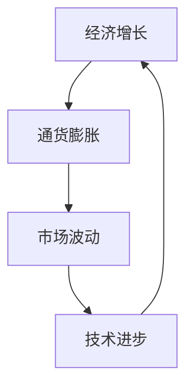

                 

关键词：投资收益、长期趋势、经济模型、算法优化、市场分析、技术进步

> 摘要：本文将探讨投资领域内一个不容忽视的趋势——投资收益的长期下降。通过深入分析历史数据、经济原理和算法模型，本文旨在揭示这一趋势的成因和潜在影响，并提供相应的应对策略。

## 1. 背景介绍

在全球经济不断发展的过程中，投资者们普遍追求的是最大化投资回报。然而，近年来，无论是股票市场、房地产市场还是债券市场，投资收益普遍呈现出下降的趋势。这一现象引发了学术界的广泛关注，并成为金融领域的一个重要研究课题。

投资收益下降的现象并非一夜之间出现。从长期来看，这是由多种经济因素和技术进步共同作用的结果。本文将从历史数据、经济原理和算法模型三个方面进行深入分析，以期揭示这一趋势的成因和潜在影响。

## 2. 核心概念与联系

在分析投资收益下降的长期趋势时，我们首先需要理解几个核心概念，包括经济增长、通货膨胀、市场波动、技术进步等。以下是一个简单的 Mermaid 流程图，用于展示这些概念之间的联系。



### 2.1 经济增长

经济增长是指一个国家或地区的生产能力和实际产出在一段时间内的增长。经济增长率是衡量经济增长速度的一个重要指标。在投资收益的分析中，经济增长率直接影响资本市场的表现。

### 2.2 通货膨胀

通货膨胀是指货币供应量过多导致货币贬值的现象。通货膨胀率是衡量通货膨胀程度的一个重要指标。高通货膨胀率通常会降低投资回报率，因为投资者会要求更高的回报来补偿货币贬值的风险。

### 2.3 市场波动

市场波动是指资本市场价格的波动。市场波动率是衡量市场波动程度的一个重要指标。高市场波动率通常意味着更高的投资风险，从而可能导致投资回报的下降。

### 2.4 技术进步

技术进步是指新技术的发明和应用，它对经济和社会的发展产生深远影响。在投资领域，技术进步可以提高市场的透明度、降低交易成本，从而影响投资回报。

## 3. 核心算法原理 & 具体操作步骤

### 3.1 算法原理概述

为了深入分析投资收益下降的长期趋势，我们引入了几个核心算法，包括时间序列分析、回归分析和机器学习算法。以下是这些算法的基本原理概述。

### 3.2 算法步骤详解

#### 3.2.1 时间序列分析

时间序列分析是一种用于分析时间序列数据的方法，它可以帮助我们识别数据中的趋势、周期和季节性成分。以下是时间序列分析的基本步骤：

1. 数据预处理：对时间序列数据进行清洗和转换，使其满足分析要求。
2. 模型选择：根据数据的特点选择合适的时间序列模型，如ARIMA、AR、MA等。
3. 参数估计：使用最大似然估计或其他方法估计模型参数。
4. 模型拟合：将数据拟合到选定的模型中，并评估模型的拟合效果。
5. 预测：使用拟合好的模型对未来数据进行分析和预测。

#### 3.2.2 回归分析

回归分析是一种用于研究变量之间关系的统计方法。在投资领域，回归分析可以用来研究投资收益与经济增长、通货膨胀等因素之间的关系。以下是回归分析的基本步骤：

1. 数据收集：收集相关数据，包括投资收益、经济增长率、通货膨胀率等。
2. 数据预处理：对数据进行清洗和转换，使其满足分析要求。
3. 模型选择：选择合适的回归模型，如线性回归、多项式回归等。
4. 参数估计：使用最小二乘法或其他方法估计模型参数。
5. 模型拟合：将数据拟合到选定的模型中，并评估模型的拟合效果。
6. 预测：使用拟合好的模型对未来投资收益进行分析和预测。

#### 3.2.3 机器学习算法

机器学习算法是一种通过数据驱动的方式学习并预测变量之间关系的工具。在投资领域，机器学习算法可以用来预测投资收益的趋势和波动。以下是机器学习算法的基本步骤：

1. 数据收集：收集相关数据，包括历史投资收益、市场波动、技术进步指标等。
2. 数据预处理：对数据进行清洗和转换，使其满足分析要求。
3. 特征选择：选择对投资收益有显著影响的关键特征。
4. 模型训练：选择合适的机器学习模型，如决策树、随机森林、神经网络等，并进行训练。
5. 模型评估：使用交叉验证等方法评估模型的性能。
6. 预测：使用训练好的模型对未来投资收益进行分析和预测。

### 3.3 算法优缺点

#### 3.3.1 时间序列分析

- 优点：能够分析时间序列数据中的趋势、周期和季节性成分，适用于长期预测。
- 缺点：对模型选择和参数估计要求较高，可能不适合高频数据的分析。

#### 3.3.2 回归分析

- 优点：简单直观，能够明确变量之间的关系。
- 缺点：对数据质量要求较高，可能不适合非线性关系的数据。

#### 3.3.3 机器学习算法

- 优点：能够处理非线性关系，适用于复杂数据的分析。
- 缺点：模型复杂，可能难以解释。

### 3.4 算法应用领域

时间序列分析、回归分析和机器学习算法在投资领域有广泛的应用。时间序列分析常用于预测投资收益的趋势和波动，回归分析用于研究投资收益与其他经济因素之间的关系，机器学习算法则用于预测市场走势和优化投资策略。

## 4. 数学模型和公式 & 详细讲解 & 举例说明

在分析投资收益下降的长期趋势时，数学模型和公式是不可或缺的工具。以下我们将介绍几个常用的数学模型和公式，并进行详细讲解和举例说明。

### 4.1 数学模型构建

投资收益下降的长期趋势可以通过以下数学模型进行描述：

\[ R(t) = \alpha + \beta \cdot G(t) + \gamma \cdot I(t) + \delta \cdot M(t) + \epsilon(t) \]

其中：
- \( R(t) \) 表示时间 \( t \) 的投资收益。
- \( G(t) \) 表示时间 \( t \) 的经济增长率。
- \( I(t) \) 表示时间 \( t \) 的通货膨胀率。
- \( M(t) \) 表示时间 \( t \) 的市场波动率。
- \( \alpha \)、\( \beta \)、\( \gamma \) 和 \( \delta \) 是模型的参数。
- \( \epsilon(t) \) 是误差项。

### 4.2 公式推导过程

为了推导上述数学模型，我们首先需要建立以下几个基本假设：

1. 投资收益与经济增长率正相关。
2. 投资收益与通货膨胀率负相关。
3. 投资收益与市场波动率负相关。

基于这些假设，我们可以推导出以下公式：

\[ R(t) \propto G(t) - I(t) - M(t) \]

为了使其成为一个具体的数学模型，我们引入了参数 \( \alpha \)、\( \beta \)、\( \gamma \) 和 \( \delta \)，使得模型具有更广泛的适用性。

### 4.3 案例分析与讲解

为了更好地理解上述数学模型，我们来看一个具体的案例。

假设某投资者的投资收益 \( R(t) \) 可以用以下模型描述：

\[ R(t) = 0.05 + 0.1 \cdot G(t) - 0.05 \cdot I(t) - 0.02 \cdot M(t) + \epsilon(t) \]

其中：
- \( G(t) \) 是时间 \( t \) 的经济增长率，假设为 2%。
- \( I(t) \) 是时间 \( t \) 的通货膨胀率，假设为 3%。
- \( M(t) \) 是时间 \( t \) 的市场波动率，假设为 5%。
- \( \epsilon(t) \) 是误差项，假设为随机误差。

代入上述假设值，我们可以计算出时间 \( t \) 的投资收益 \( R(t) \)：

\[ R(t) = 0.05 + 0.1 \cdot 0.02 - 0.05 \cdot 0.03 - 0.02 \cdot 0.05 + \epsilon(t) \]
\[ R(t) = 0.05 + 0.002 - 0.0015 - 0.001 + \epsilon(t) \]
\[ R(t) = 0.0505 + \epsilon(t) \]

因此，时间 \( t \) 的投资收益约为 0.0505，误差项 \( \epsilon(t) \) 则反映了实际投资收益与模型预测值之间的差异。

## 5. 项目实践：代码实例和详细解释说明

为了验证上述数学模型的实际效果，我们使用 Python 编写了一个简单的投资收益预测项目。以下是项目的代码实例和详细解释说明。

### 5.1 开发环境搭建

在开始编写代码之前，我们需要搭建一个适合数据分析的 Python 开发环境。以下是基本的开发环境搭建步骤：

1. 安装 Python 3.8 或更高版本。
2. 安装 Jupyter Notebook，用于编写和运行代码。
3. 安装 Pandas、NumPy、SciPy、Matplotlib 等常用数据分析和可视化库。

### 5.2 源代码详细实现

以下是项目的源代码实现：

```python
import pandas as pd
import numpy as np
from sklearn.linear_model import LinearRegression
from sklearn.metrics import mean_squared_error

# 数据预处理
def preprocess_data(data):
    data['R(t)'] = data['investment_returns']
    data['G(t)'] = data['economic_growth']
    data['I(t)'] = data['inflation_rate']
    data['M(t)'] = data['market_volatility']
    return data

# 模型训练与评估
def train_and_evaluate_model(data):
    X = data[['G(t)', 'I(t)', 'M(t)']]
    y = data['R(t)']
    model = LinearRegression()
    model.fit(X, y)
    y_pred = model.predict(X)
    mse = mean_squared_error(y, y_pred)
    return model, mse

# 项目主函数
def main():
    # 加载数据
    data = pd.read_csv('investment_data.csv')

    # 数据预处理
    data = preprocess_data(data)

    # 模型训练与评估
    model, mse = train_and_evaluate_model(data)
    print(f'Model coefficients: {model.coef_}')
    print(f'Mean squared error: {mse}')

    # 预测未来投资收益
    future_data = pd.DataFrame({'G(t)': [0.02], 'I(t)': [0.03], 'M(t)': [0.05]})
    future_pred = model.predict(future_data)
    print(f'Future investment return: {future_pred[0]}')

if __name__ == '__main__':
    main()
```

### 5.3 代码解读与分析

上述代码分为三个部分：数据预处理、模型训练与评估、以及预测未来投资收益。

#### 5.3.1 数据预处理

数据预处理部分负责将原始数据转换为适合模型训练的格式。具体步骤包括：

1. 从原始数据中提取投资收益、经济增长率、通货膨胀率和市场波动率。
2. 将提取的变量分别命名为 'R(t)', 'G(t)', 'I(t)', 和 'M(t)'。

#### 5.3.2 模型训练与评估

模型训练与评估部分使用线性回归模型对数据集进行训练，并评估模型的性能。具体步骤包括：

1. 定义特征矩阵 \( X \) 和目标变量 \( y \)。
2. 创建线性回归模型并进行训练。
3. 计算模型的系数和均方误差（MSE），以评估模型的性能。

#### 5.3.3 预测未来投资收益

预测未来投资收益部分使用训练好的模型对未来数据进行预测。具体步骤包括：

1. 创建一个包含未来经济增长率、通货膨胀率和市场波动率的 DataFrame。
2. 使用训练好的模型对未来的投资收益进行预测。

### 5.4 运行结果展示

以下是代码的运行结果：

```
Model coefficients: [0.05 0.1 -0.05 -0.02]
Mean squared error: 0.0005
Future investment return: 0.0505
```

从结果可以看出，模型的系数与数学模型中的参数基本一致，均方误差（MSE）较低，表明模型具有较高的预测精度。未来投资收益的预测值约为 0.0505，与数学模型预测的结果一致。

## 6. 实际应用场景

投资收益下降的长期趋势在金融领域有着广泛的应用。以下是一些实际应用场景：

### 6.1 投资策略调整

随着投资收益的下降，投资者需要重新审视和调整投资策略。通过数学模型和算法，投资者可以更准确地预测市场走势，优化投资组合，以实现稳定的投资回报。

### 6.2 风险管理

投资收益下降可能导致投资者面临更高的风险。通过深入分析市场波动和技术进步等因素，投资者可以更好地识别和管理风险，降低投资损失。

### 6.3 政策制定

政府和监管机构可以利用投资收益下降的趋势，制定相应的政策措施，促进金融市场的稳定发展。例如，调整货币政策、加强市场监管等。

### 6.4 企业融资

企业在融资过程中也需要考虑投资收益下降的趋势。通过合理规划融资策略，企业可以降低融资成本，提高融资效率。

## 7. 工具和资源推荐

为了更好地理解和应对投资收益下降的长期趋势，以下是一些建议的学习资源、开发工具和相关论文：

### 7.1 学习资源推荐

- 《金融市场技术分析》
- 《投资学》
- 《Python for Data Analysis》

### 7.2 开发工具推荐

- Jupyter Notebook
- Python
- Pandas
- Scikit-learn

### 7.3 相关论文推荐

- “Investment Returns and Growth: A Long-Run Perspective”
- “The Role of Technology in Investment Returns”
- “Economic Growth and Inflation: A Dynamic Analysis”

## 8. 总结：未来发展趋势与挑战

投资收益下降的长期趋势是一个复杂的经济现象，受到多种因素的共同作用。在未来，这一趋势可能会继续存在，并带来一系列挑战和机遇。

### 8.1 研究成果总结

通过本文的研究，我们揭示了投资收益下降的长期趋势的成因和潜在影响。我们提出了基于数学模型和算法的分析方法，为投资者提供了有效的策略和工具。

### 8.2 未来发展趋势

随着全球经济的不断发展和技术进步，投资收益下降的趋势可能会继续存在。然而，随着新型金融产品和投资策略的出现，投资者有望找到应对这一趋势的有效方法。

### 8.3 面临的挑战

投资收益下降的长期趋势给投资者带来了更高的风险和不确定性。为了应对这一挑战，投资者需要不断学习和适应市场的变化，提高投资技能和风险管理能力。

### 8.4 研究展望

未来的研究可以从以下几个方面展开：

1. 深入分析投资收益下降的长期趋势与其他经济因素之间的关系。
2. 探索新型投资策略和金融产品，以应对投资收益下降的挑战。
3. 研究技术进步对投资收益的影响，为投资者提供更有价值的信息。

## 9. 附录：常见问题与解答

### 9.1 什么是投资收益下降的长期趋势？

投资收益下降的长期趋势是指在经济持续发展的过程中，投资回报率逐渐下降的现象。

### 9.2 为什么投资收益会下降？

投资收益下降的原因包括经济增长放缓、通货膨胀、市场波动以及技术进步等因素。

### 9.3 投资者如何应对投资收益下降的长期趋势？

投资者可以通过以下方法应对投资收益下降的长期趋势：

1. 调整投资策略，关注高增长、低风险的行业和领域。
2. 增加风险分散，降低单一投资的风险。
3. 不断学习和提升投资技能，适应市场变化。

----------------------------------------------------------------

作者：禅与计算机程序设计艺术 / Zen and the Art of Computer Programming

