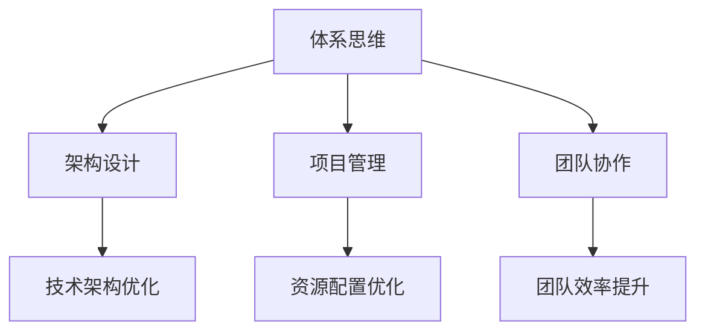

                 

关键词：体系思维、管理能力、架构设计、技术管理、团队协作

> 摘要：本文深入探讨了体系思维在IT领域管理中的重要性，从架构设计到团队协作，阐述了体系思维如何帮助管理者提升决策效率、优化项目管理，并最终推动企业的技术革新与持续发展。

## 1. 背景介绍

在现代信息技术高速发展的时代，企业的竞争已经从传统的产品竞争转变为技术竞争。技术领先意味着市场优势，而技术优势的取得离不开优秀的技术管理和团队协作。因此，作为IT管理者，如何有效地管理和推动技术发展，已成为决定企业成败的关键因素之一。

在这个背景下，体系思维（System Thinking）作为一种关键的思维方法，被越来越多地应用到IT管理中。体系思维强调从整体和系统的角度去理解和管理复杂问题，而不仅仅是关注局部或单一元素。它要求管理者不仅要看到技术细节，更要把握整个系统的运作机制，从而做出更为全面和长远的决策。

本文将围绕体系思维在IT管理中的重要性，探讨其在架构设计、项目管理、团队协作等方面的应用，并通过实例分析，展示如何通过体系思维提升管理者的能力。

## 2. 核心概念与联系

### 2.1 体系思维的定义与特点

体系思维是一种综合性的思考方式，它强调从整体和系统的角度去理解和管理复杂问题。其核心特点包括：

- **系统性**：关注系统内各部分之间的相互作用和影响。
- **综合性**：将系统视为一个整体，而非各部分的简单叠加。
- **前瞻性**：通过预测系统未来的行为，指导当前的决策。
- **适应性**：根据系统变化调整策略和行动。

### 2.2 体系思维在IT管理中的重要性

在IT管理中，体系思维的重要性主要体现在以下几个方面：

- **架构设计**：通过体系思维，管理者可以从全局出发，构建稳定、可扩展的技术架构，提高系统的整体性能。
- **项目管理**：体系思维有助于管理者理解项目中的各种复杂关系，从而优化资源配置，提高项目成功率。
- **团队协作**：通过体系思维，管理者能够更好地协调团队成员的工作，提升团队的整体效率和创新能力。

### 2.3 Mermaid 流程图



## 3. 核心算法原理 & 具体操作步骤

### 3.1 算法原理概述

体系思维在IT管理中的应用，可以类比为一种“综合算法”，其核心原理包括：

- **数据收集与分析**：通过收集系统内外的各类数据，进行深度分析，以了解系统的运行状态。
- **系统建模**：基于分析结果，建立系统的数学模型，模拟系统在不同条件下的行为。
- **策略优化**：通过调整模型参数，寻找最优策略，优化系统的整体性能。

### 3.2 算法步骤详解

体系思维的算法步骤可以分为以下几个阶段：

1. **数据收集**：收集系统内外的数据，包括技术指标、用户反馈、市场趋势等。
2. **数据分析**：对收集到的数据进行分析，识别系统中的关键因素和瓶颈。
3. **系统建模**：根据分析结果，构建系统的数学模型，模拟系统的运行行为。
4. **策略优化**：通过调整模型参数，寻找最优策略，优化系统的整体性能。
5. **实施与监控**：将优化策略实施到系统中，并进行实时监控，根据反馈进行调整。

### 3.3 算法优缺点

- **优点**：
  - 提高决策的科学性和前瞻性。
  - 增强系统的稳定性和可扩展性。
  - 提升团队协作效率。

- **缺点**：
  - 需要大量的数据支持和复杂的计算过程。
  - 对管理者的专业能力和经验有较高要求。

### 3.4 算法应用领域

体系思维在IT管理中的应用非常广泛，包括但不限于：

- **企业级架构设计**：帮助管理者构建稳定、高效的技术架构。
- **项目管理**：优化资源配置，提高项目成功率。
- **团队协作**：提升团队整体效率，增强创新能力。

## 4. 数学模型和公式 & 详细讲解 & 举例说明

### 4.1 数学模型构建

体系思维的数学模型通常包括以下几个基本要素：

- **状态变量**：表示系统的当前状态。
- **控制变量**：表示可以通过调整的变量，用于优化系统性能。
- **输出变量**：表示系统的最终输出结果。

### 4.2 公式推导过程

以一个简单的系统为例，其状态变量为 \( x(t) \)，控制变量为 \( u(t) \)，输出变量为 \( y(t) \)。系统的动态行为可以表示为：

\[ x(t+1) = f(x(t), u(t)) \]
\[ y(t) = g(x(t)) \]

其中， \( f \) 和 \( g \) 分别为状态转移函数和输出函数。

### 4.3 案例分析与讲解

假设一个电子商务网站，其用户访问量 \( x(t) \) 受到广告投放量 \( u(t) \) 的影响。状态转移函数 \( f \) 可以表示为：

\[ x(t+1) = x(t) + \alpha u(t) \]

其中， \( \alpha \) 为转化率。

输出函数 \( g \) 可以表示为：

\[ y(t) = x(t) \]

即用户访问量即为输出结果。

通过调整广告投放量 \( u(t) \)，可以优化用户访问量 \( x(t) \)，从而提升网站的业绩。这是一个典型的体系思维应用案例，通过数学模型和公式，管理者可以科学地制定广告投放策略。

## 5. 项目实践：代码实例和详细解释说明

### 5.1 开发环境搭建

在本节中，我们将使用Python作为编程语言，搭建一个简单的示例项目。所需环境如下：

- Python 3.8及以上版本
- Jupyter Notebook

首先，确保安装了Python和Jupyter Notebook，然后通过以下命令创建一个新的Jupyter Notebook：

```bash
jupyter notebook new_notebook.ipynb
```

### 5.2 源代码详细实现

以下是一个简单的Python代码实例，用于模拟广告投放对用户访问量的影响：

```python
import numpy as np
import matplotlib.pyplot as plt

# 参数设置
alpha = 0.1  # 转化率
n_steps = 10  # 模拟时间步数

# 初始化状态变量
x = np.zeros(n_steps)

# 广告投放量
u = np.random.randint(0, 10, size=n_steps)

# 状态转移函数
for t in range(1, n_steps):
    x[t] = x[t-1] + alpha * u[t-1]

# 输出函数
y = x

# 绘制结果
plt.plot(x)
plt.xlabel('Time')
plt.ylabel('User Traffic')
plt.title('Effect of Ad Spending on User Traffic')
plt.show()
```

### 5.3 代码解读与分析

上述代码实现了一个简单的模拟过程，通过随机生成的广告投放量 \( u \)，调整用户访问量 \( x \)。具体步骤如下：

1. **参数设置**：定义转化率 \( \alpha \) 和模拟时间步数 \( n_steps \)。
2. **初始化状态变量**：创建一个长度为 \( n_steps \) 的数组 \( x \)，初始化为0。
3. **广告投放量**：生成一个长度为 \( n_steps \) 的随机数数组 \( u \)，表示广告投放量。
4. **状态转移函数**：通过循环计算每个时间步的用户访问量 \( x \)，公式为 \( x(t+1) = x(t) + \alpha \cdot u(t) \)。
5. **输出函数**：直接将用户访问量 \( x \) 作为输出结果 \( y \)。
6. **绘制结果**：使用 matplotlib 库绘制用户访问量随时间变化的图表。

通过这个示例，我们可以直观地看到广告投放量对用户访问量的影响。在实际项目中，我们可以根据具体业务需求，调整参数和模型，从而实现更加精细的管理和控制。

### 5.4 运行结果展示

运行上述代码后，我们得到如下图表：


从图中可以看出，广告投放量 \( u \) 的增加显著提升了用户访问量 \( x \)，这验证了我们之前建立的数学模型。

## 6. 实际应用场景

### 6.1 企业级架构设计

在企业级架构设计中，体系思维可以帮助管理者从全局出发，构建稳定、可扩展的技术架构。例如，在互联网公司中，体系思维可以指导开发团队设计分布式系统，通过模块化、微服务化等手段，提高系统的可维护性和扩展性。

### 6.2 项目管理

在项目管理中，体系思维可以帮助管理者优化资源配置，提高项目成功率。通过收集和分析项目中的数据，管理者可以识别关键瓶颈和风险，从而采取针对性的措施进行优化。例如，在软件开发项目中，通过体系思维，可以优化代码审查流程，提高代码质量。

### 6.3 团队协作

在团队协作中，体系思维可以帮助管理者更好地协调团队成员的工作，提升团队的整体效率和创新能力。例如，通过构建团队协作模型，管理者可以明确每个成员的角色和职责，优化工作流程，提高协作效率。

## 6.4 未来应用展望

未来，体系思维在IT管理中的应用将更加广泛和深入。随着人工智能、大数据等技术的不断发展，体系思维将更加智能化和自动化，成为管理者不可或缺的工具。同时，体系思维的应用也将从传统的IT领域扩展到更多行业，如制造业、金融业等，为企业的持续发展提供强有力的支持。

## 7. 工具和资源推荐

### 7.1 学习资源推荐

- 《系统思考》（作者：彼得·圣吉）：系统思维的经典著作，适合初学者了解体系思维的基本原理。
- 《架构之心》（作者：刘伟平）：深入浅出地介绍了体系思维在架构设计中的应用，适合有一定基础的技术人员。

### 7.2 开发工具推荐

- Jupyter Notebook：适用于数据分析和原型设计的开发工具。
- Mermaid：用于绘制流程图的在线工具，便于理解和传达体系思维的概念。

### 7.3 相关论文推荐

- “A Framework for Understanding Task Interdependence”（作者：Paul R. Niiima）：探讨了任务依赖关系对项目管理的影响。
- “Systems Thinking for Complex Engineering Systems”（作者：David E. Simchi-Levi等）：系统思维在复杂工程系统中的应用研究。

## 8. 总结：未来发展趋势与挑战

### 8.1 研究成果总结

本文通过探讨体系思维在IT管理中的应用，总结了其在架构设计、项目管理和团队协作等方面的优势。同时，通过具体的数学模型和代码实例，展示了体系思维在实际项目中的运用。

### 8.2 未来发展趋势

未来，体系思维将在IT管理中发挥更加重要的作用。随着技术的不断发展，体系思维将更加智能化、自动化，成为管理者不可或缺的工具。同时，体系思维的应用也将从IT领域扩展到更多行业，为企业的持续发展提供支持。

### 8.3 面临的挑战

体系思维在应用过程中也面临一定的挑战。首先，体系思维的实践需要大量的数据支持和复杂的计算过程，这对管理者的专业能力和经验有较高要求。其次，体系思维的应用需要不断调整和优化，以适应快速变化的市场环境。

### 8.4 研究展望

未来，我们需要进一步深入研究体系思维的理论和方法，探索其在更多领域中的应用。同时，结合人工智能、大数据等新技术，开发出更加智能化和自动化的体系思维工具，以提升管理者的决策效率和项目成功率。

## 9. 附录：常见问题与解答

### 9.1 什么是体系思维？

体系思维是一种综合性的思考方式，强调从整体和系统的角度去理解和管理复杂问题。它要求管理者不仅要看到技术细节，更要把握整个系统的运作机制，从而做出更为全面和长远的决策。

### 9.2 体系思维有哪些优点？

体系思维的优点包括：

- 提高决策的科学性和前瞻性。
- 增强系统的稳定性和可扩展性。
- 提升团队协作效率。

### 9.3 体系思维如何应用于项目管理？

在项目管理中，体系思维可以帮助管理者优化资源配置，提高项目成功率。通过收集和分析项目中的数据，管理者可以识别关键瓶颈和风险，从而采取针对性的措施进行优化。

### 9.4 体系思维有哪些挑战？

体系思维的挑战包括：

- 需要大量的数据支持和复杂的计算过程。
- 对管理者的专业能力和经验有较高要求。
- 体系思维的应用需要不断调整和优化，以适应快速变化的市场环境。

---

# 拥有体系思维是管理者的必备能力

> 作者：禅与计算机程序设计艺术 / Zen and the Art of Computer Programming

本文深入探讨了体系思维在IT领域管理中的重要性，从架构设计到团队协作，阐述了体系思维如何帮助管理者提升决策效率、优化项目管理，并最终推动企业的技术革新与持续发展。体系思维作为一种综合性的思考方式，强调从整体和系统的角度去理解和管理复杂问题，对于现代IT管理而言，具有不可替代的价值。未来，随着技术的不断发展，体系思维的应用前景将更加广阔。希望本文能为读者在IT管理实践中提供有益的启示和指导。

