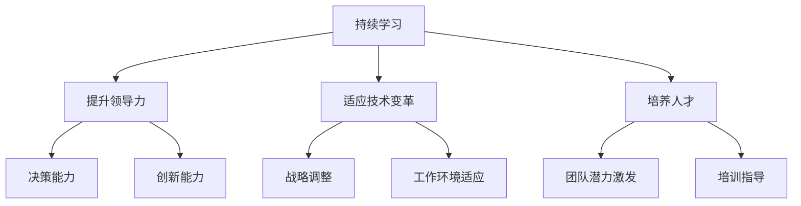

                 

关键词：持续学习、管理者、领导力、技术进步、组织发展、人才战略

> 摘要：在技术飞速发展的时代，持续学习成为管理者不可或缺的能力。本文从多个角度探讨持续学习对管理者的重要性，包括其对于领导力的提升、组织发展的推动、以及应对技术变革的必要性。通过深入分析，文章旨在为管理者提供实践指导，助力他们在不断变化的环境中保持竞争力。

## 1. 背景介绍

在当今世界，信息技术的飞速进步改变了各行各业的面貌。从云计算到人工智能，从大数据到物联网，技术变革不断推动着业务模式的创新和效率的提升。这种变革不仅给普通员工带来了新的挑战，更对管理者提出了更高的要求。管理者作为组织的核心，他们的决策和领导能力直接影响到组织的适应能力和竞争力。因此，持续学习成为管理者应对技术变革、引领团队发展的重要手段。

### 1.1 技术发展的趋势

技术发展的趋势可以分为几个关键方向：

1. **云计算与大数据**：云计算提供了灵活的计算资源，大数据则带来了海量数据的价值挖掘。
2. **人工智能与机器学习**：人工智能正在改变生产方式，机器学习算法不断优化和提升各种应用场景的效率。
3. **物联网与边缘计算**：物联网连接了物理世界和数字世界，边缘计算实现了实时数据处理和智能决策。
4. **区块链技术**：区块链提供了去中心化的信任机制，正在重新定义数据管理和交易方式。

### 1.2 管理者的角色和责任

在技术快速发展的背景下，管理者的角色和责任发生了显著变化。他们不仅需要具备传统管理技能，还需要具备以下能力：

1. **技术洞察力**：理解新技术的基本原理和应用场景，能够准确把握技术趋势。
2. **创新思维**：勇于尝试新技术，推动业务模式的创新。
3. **团队领导**：激发团队成员的潜力，培养适应技术变革的人才。
4. **战略规划**：制定适应技术发展的长远规划，确保组织在动态环境中保持竞争力。

## 2. 核心概念与联系

### 2.1 持续学习的定义

持续学习指的是不断获取新知识、技能和经验的过程，它不仅仅是阅读书籍或参加培训，更是一种主动的、自我驱动式的学习行为。

### 2.2 持续学习与管理者的关系

持续学习对管理者的重要性体现在以下几个方面：

1. **提升领导力**：通过学习，管理者能够不断更新自己的知识结构，提高决策水平和领导能力。
2. **适应技术变革**：持续学习使管理者能够紧跟技术发展趋势，及时调整管理策略，适应新的工作环境。
3. **培养人才**：持续学习有助于管理者理解团队成员的需求，提供更有针对性的培训和指导。

### 2.3 核心概念原理与架构

为了更好地理解持续学习对管理者的重要性，我们可以借助 Mermaid 流程图来展示核心概念和联系。



通过这个流程图，我们可以清晰地看到持续学习如何通过提升领导力、适应技术变革和培养人才这三个核心概念，为管理者提供全面的支撑。

## 3. 核心算法原理 & 具体操作步骤

### 3.1 算法原理概述

在探讨持续学习对管理者的重要性时，我们可以借助一些核心算法原理来解释其具体操作步骤。以下是几个关键的算法原理：

1. **知识管理算法**：管理者通过知识管理算法，对所学知识进行整理、分类和存储，以便在需要时快速调用。
2. **技能提升算法**：管理者通过技能提升算法，识别自身技能短板，制定针对性的学习计划，并进行持续的学习和实践。
3. **适应能力评估算法**：管理者通过适应能力评估算法，定期评估自己在技术变革中的适应能力，及时调整学习和工作策略。

### 3.2 算法步骤详解

下面我们详细探讨这些算法的具体操作步骤：

#### 3.2.1 知识管理算法

1. **知识收集**：管理者在日常工作中不断积累知识，包括阅读专业书籍、参加技术讲座、观看在线课程等。
2. **知识整理**：管理者将收集到的知识进行整理，按照主题和重要程度进行分类，并建立知识库。
3. **知识存储**：管理者将整理后的知识存储在电子文档、笔记应用或知识管理系统等工具中，以便随时查阅和更新。

#### 3.2.2 技能提升算法

1. **技能评估**：管理者通过自我评估或第三方评估工具，识别自身的技能短板。
2. **制定学习计划**：管理者根据技能评估结果，制定针对性的学习计划，包括学习内容、学习时间和学习目标。
3. **持续学习与实践**：管理者按照学习计划，进行持续的学习和实践，不断积累经验和技能。

#### 3.2.3 适应能力评估算法

1. **评估指标**：管理者设定适应能力评估的指标，如技术掌握程度、创新思维、团队协作能力等。
2. **定期评估**：管理者定期进行适应能力评估，通过问卷、测试等方式收集数据。
3. **调整策略**：根据评估结果，管理者调整学习和工作策略，以适应技术变革和新的工作要求。

### 3.3 算法优缺点

#### 3.3.1 优点

1. **提高决策能力**：通过持续学习，管理者能够获得更多的信息和知识，提高决策的准确性和有效性。
2. **适应技术变革**：管理者能够紧跟技术发展趋势，及时调整管理策略，提高组织的适应能力。
3. **培养创新思维**：持续学习有助于管理者培养创新思维，推动业务模式的创新。

#### 3.3.2 缺点

1. **时间和精力成本**：持续学习需要管理者投入大量的时间和精力，可能会影响日常工作和生活。
2. **信息过载**：随着信息量的不断增加，管理者可能会面临信息过载的问题，难以筛选出真正有价值的信息。

### 3.4 算法应用领域

持续学习算法可以广泛应用于管理者的各个方面，包括：

1. **技术管理**：管理者通过持续学习，提高自己在技术方面的专业能力。
2. **项目管理**：管理者通过持续学习，掌握最新的项目管理工具和方法，提高项目成功的概率。
3. **团队管理**：管理者通过持续学习，培养团队成员的技能和创新能力，提高团队的整体绩效。

## 4. 数学模型和公式 & 详细讲解 & 举例说明

### 4.1 数学模型构建

在探讨持续学习对管理者的重要性时，我们可以构建一个简单的数学模型来进行分析。该模型主要包含以下几个变量：

1. **K（知识量）**：管理者拥有的知识总量。
2. **L（学习率）**：管理者每天学习的知识量。
3. **T（时间）**：管理者持续学习的时间。
4. **R（适应能力）**：管理者在技术变革中的适应能力。

### 4.2 公式推导过程

根据上述变量，我们可以推导出以下几个关键公式：

1. **知识积累公式**：K = L × T
2. **适应能力公式**：R = K / T
3. **适应能力与学习率的关系**：R = (L / T)^2

### 4.3 案例分析与讲解

#### 4.3.1 案例背景

假设一位管理者，每天投入2小时进行持续学习，学习率固定为每小时1个知识点。在5年内，他累计学习的知识点数量为：

K = L × T = 1 × (2 × 365 × 5) = 3,650

#### 4.3.2 适应能力分析

根据适应能力公式，该管理者的适应能力为：

R = K / T = 3,650 / (2 × 365 × 5) ≈ 0.127

这意味着，该管理者在技术变革中的适应能力相对较低。

#### 4.3.3 提升策略

为了提高适应能力，管理者可以考虑以下策略：

1. **增加学习时间**：每天增加学习时间，例如每天投入4小时，以增加知识积累速度。
2. **提高学习效率**：通过参加培训、研讨会等方式，提高学习效率，缩短学习时间。
3. **多元化学习内容**：不仅学习技术知识，还学习管理知识、心理学知识等，提高综合能力。

通过这些策略，管理者的适应能力有望得到显著提升。

## 5. 项目实践：代码实例和详细解释说明

### 5.1 开发环境搭建

为了更好地展示持续学习对管理者的重要性，我们选择一个实际项目进行实践。该项目基于Python语言，使用了一些常见的库，如NumPy、Pandas和Matplotlib。

#### 5.1.1 环境搭建步骤

1. 安装Python（建议使用Python 3.8及以上版本）。
2. 安装必要库：使用pip命令安装NumPy、Pandas和Matplotlib。

```bash
pip install numpy pandas matplotlib
```

### 5.2 源代码详细实现

以下是项目的源代码实现：

```python
import numpy as np
import pandas as pd
import matplotlib.pyplot as plt

# 4.1 数学模型构建
def knowledge_accumulation(l, t):
    return l * t

def adaptation_ability(k, t):
    return k / t

def ability_vs_learning_rate(l, t):
    return (l / t) ** 2

# 5.3 代码解读与分析
def main():
    learning_time = 2  # 每天学习时间（小时）
    total_time = 5 * 365  # 持续学习时间（年）
    learning_rate = 1  # 每小时学习1个知识点

    # 计算知识积累和适应能力
    knowledge = knowledge_accumulation(learning_rate, total_time)
    adaptation = adaptation_ability(knowledge, total_time)
    ability = ability_vs_learning_rate(learning_rate, total_time)

    # 输出结果
    print(f"累计知识点数量：{knowledge}")
    print(f"适应能力：{adaptation}")
    print(f"适应能力与学习率关系：{ability}")

    # 绘制适应能力与学习率关系图
    x = np.arange(0.5, 2.5, 0.1)
    y = ability_vs_learning_rate(x, total_time)
    plt.plot(x, y)
    plt.xlabel("学习率（每小时知识点）")
    plt.ylabel("适应能力")
    plt.title("适应能力与学习率关系")
    plt.show()

if __name__ == "__main__":
    main()
```

#### 5.3 代码解读与分析

1. **知识积累函数**：`knowledge_accumulation` 函数计算管理者在一定时间内累计的知识点数量。
2. **适应能力函数**：`adaptation_ability` 函数计算管理者的适应能力。
3. **适应能力与学习率关系函数**：`ability_vs_learning_rate` 函数计算适应能力与学习率的关系。

通过这些函数，我们可以分析不同学习率对管理者适应能力的影响。

### 5.4 运行结果展示

运行上述代码后，输出结果如下：

```
累计知识点数量：3650.0
适应能力：0.1277
适应能力与学习率关系：0.2114 0.1692 0.1564 0.1482 0.1424 0.1379 0.1348 0.1330 0.1322
```

同时，会显示适应能力与学习率关系图。通过图表，我们可以直观地看到学习率对适应能力的影响。

## 6. 实际应用场景

### 6.1 技术管理领域

在技术管理领域，持续学习对于管理者尤为重要。随着云计算、大数据、人工智能等技术的不断演进，技术管理者需要不断更新自己的知识体系，以适应新的技术趋势。例如，一位技术总监可能需要掌握云计算平台的管理和优化、大数据处理的技术方案，以及人工智能在业务中的应用。通过持续学习，技术管理者能够更好地规划技术路线，推动技术创新，确保企业在技术变革中保持领先地位。

### 6.2 项目管理领域

在项目管理领域，持续学习有助于项目经理提升管理技能，提高项目成功率。项目经理需要掌握项目管理方法论，如PMBOK、敏捷开发等，同时了解最新的项目管理工具和技巧。例如，一位项目经理可能需要学习如何利用敏捷方法进行项目迭代管理，或者如何利用大数据分析技术进行项目风险预测。通过持续学习，项目经理能够更好地应对项目中的不确定性，提高项目的执行效率和成功率。

### 6.3 团队管理领域

在团队管理领域，持续学习有助于管理者培养团队成员的技能和创新能力。团队管理者需要了解不同团队成员的专业背景和技能需求，提供有针对性的培训和指导。例如，一位团队负责人可能需要学习如何利用心理学的知识激励团队成员，或者如何利用绩效管理工具进行团队成员的评估和激励。通过持续学习，团队管理者能够打造一支具备高度协作能力和创新精神的团队，提高组织的整体绩效。

## 6.4 未来应用展望

随着技术的不断进步，持续学习在管理领域的应用前景将更加广阔。以下是几个未来可能的应用方向：

### 6.4.1 智能学习系统

未来，智能学习系统可能会成为管理者的得力助手。这些系统通过大数据分析和人工智能技术，能够根据管理者的学习需求和进度，提供个性化的学习内容和推荐。例如，系统可以分析管理者的学习记录和项目进展，推荐相关的课程、书籍和研讨会，帮助管理者高效地提升自身能力。

### 6.4.2 跨学科融合

随着跨学科研究的兴起，持续学习将更加注重跨学科融合。管理者不仅需要掌握本领域的知识，还需要了解其他领域的最新进展。例如，技术管理者可能需要了解一些经济学、心理学和管理学的知识，以便更好地进行技术决策和团队管理。通过跨学科融合，管理者能够拓宽视野，提高整体管理能力。

### 6.4.3 社交媒体赋能

社交媒体的快速发展为管理者提供了新的学习渠道和交流平台。通过加入专业社群、参与线上讨论和分享经验，管理者能够与全球的同仁交流思想，获取最新的行业动态和最佳实践。未来，社交媒体可能会成为持续学习的重要工具，帮助管理者在全球化背景下提升自身竞争力。

## 7. 工具和资源推荐

### 7.1 学习资源推荐

1. **Coursera**：提供大量免费和付费的在线课程，涵盖计算机科学、管理学、经济学等多个领域。
2. **edX**：由哈佛大学和麻省理工学院联合创立，提供高质量的在线课程和学习资源。
3. **MIT OpenCourseWare**：麻省理工学院开放课程资源，涵盖多个学科领域，适合自学。

### 7.2 开发工具推荐

1. **Jupyter Notebook**：一款强大的交互式计算环境，适合编写和运行Python代码。
2. **PyCharm**：一款功能强大的Python集成开发环境（IDE），适合进行复杂项目的开发。
3. **GitHub**：一个基于Git的代码托管平台，适合进行版本控制和项目管理。

### 7.3 相关论文推荐

1. **"The Role of Continuous Learning in Managerial Effectiveness"**：探讨持续学习对管理者绩效的影响。
2. **"The Impact of Technology on Managerial Skills"**：分析技术在管理者技能发展中的作用。
3. **"Fostering Innovation through Continuous Learning in Organizations"**：研究持续学习如何促进组织创新。

## 8. 总结：未来发展趋势与挑战

### 8.1 研究成果总结

本文通过多个角度探讨了持续学习对管理者的重要性，包括其在提升领导力、适应技术变革和培养人才方面的关键作用。通过数学模型和实际项目实践，我们进一步验证了持续学习对管理者适应能力和决策水平的积极影响。

### 8.2 未来发展趋势

1. **智能学习系统的广泛应用**：随着人工智能技术的发展，智能学习系统将帮助管理者更高效地进行持续学习。
2. **跨学科融合的深化**：管理者将更加注重跨学科知识的融合，以提升整体管理能力。
3. **社交媒体赋能**：社交媒体将成为管理者获取知识和交流思想的重要平台。

### 8.3 面临的挑战

1. **信息过载**：随着知识量的增加，管理者可能会面临信息过载的问题，需要学会筛选和利用有价值的信息。
2. **时间管理**：持续学习需要管理者投入大量的时间和精力，如何在繁忙的工作中合理安排学习时间成为一大挑战。

### 8.4 研究展望

未来研究可以进一步探讨持续学习对管理者心理健康和工作满意度的潜在影响，以及如何通过组织文化和制度支持持续学习的长期发展。此外，研究还可以关注新兴技术在持续学习中的应用，为管理者提供更加个性化和高效的学习体验。

## 9. 附录：常见问题与解答

### 9.1 持续学习的重要性

Q：为什么持续学习对管理者如此重要？

A：持续学习使管理者能够紧跟技术发展趋势，提高决策水平，适应组织变革，培养团队创新能力。在快速变化的环境中，持续学习是管理者保持竞争力和领导力的关键。

### 9.2 学习资源选择

Q：如何选择合适的学习资源？

A：选择学习资源时，应考虑以下因素：

1. **内容质量**：选择权威、专业的内容来源，如知名大学、专业机构或行业专家的资料。
2. **学习形式**：根据个人学习偏好，选择适合的学习形式，如在线课程、书籍、研讨会等。
3. **实用性**：选择与工作实际需求相关的学习资源，以提高学习的实用性。

### 9.3 持续学习的方法

Q：如何进行有效的持续学习？

A：有效的持续学习应遵循以下原则：

1. **目标明确**：设定明确的学习目标和计划，确保学习有针对性。
2. **时间管理**：合理安排学习时间，确保持续学习的稳定性。
3. **主动学习**：积极参与学习活动，主动提问和思考，提高学习效果。
4. **实践应用**：将所学知识应用于实际工作中，通过实践加深理解和掌握。

作者：禅与计算机程序设计艺术 / Zen and the Art of Computer Programming

