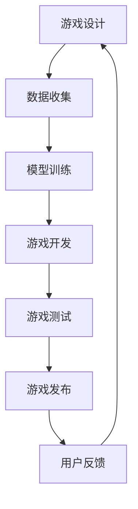

                 

关键词：AI大模型、游戏产业、游戏开发、虚拟现实、增强现实、游戏引擎、人工智能应用

摘要：本文旨在探讨人工智能大模型在游戏产业中的应用，分析其带来的创新与变革。我们将从背景介绍、核心概念与联系、核心算法原理、数学模型与公式、项目实践、实际应用场景、工具和资源推荐，以及未来发展趋势与挑战等方面进行详细阐述，以期为游戏产业的技术发展提供新的视角和思路。

## 1. 背景介绍

随着人工智能技术的飞速发展，AI大模型逐渐成为学术界和工业界研究的热点。这些模型具有强大的数据处理和分析能力，能够模拟人类的认知和学习过程。游戏产业作为一个高度创意和技术驱动的领域，自然成为了AI大模型应用的试验田。

在过去，游戏产业主要依赖于预定义的规则和程序来构建游戏世界和游戏玩法。然而，随着用户需求的不断变化和游戏体验的追求，游戏开发者们开始寻求新的技术手段来增强游戏的互动性和智能性。AI大模型的出现，为游戏产业带来了前所未有的机遇和挑战。

### 1.1 游戏产业的历史与发展

游戏产业起源于20世纪70年代，随着计算机技术的进步，逐渐发展成为全球最大的娱乐产业之一。从最初的单机游戏到网络多人在线游戏，再到移动游戏和虚拟现实游戏，游戏产业的形态和内容不断演进。

在游戏开发过程中，开发者们不断探索如何利用技术手段提高游戏的互动性和沉浸感。早期的游戏开发主要依赖于程序员手工编写代码和规则，这种方式虽然能够实现基本的游戏功能，但缺乏灵活性，难以满足用户多样化的需求。

### 1.2 人工智能与游戏产业的结合

随着人工智能技术的发展，AI大模型逐渐成为游戏开发的重要工具。这些模型能够通过学习大量游戏数据，自动生成游戏规则、场景和角色行为，从而提高游戏的智能性和互动性。

例如，AI大模型可以用于生成虚拟角色，使得游戏角色的行为更加自然和真实。同时，AI大模型还可以用于游戏世界的动态生成，使得游戏世界更加丰富和多样化。

### 1.3 AI大模型在游戏产业的应用现状

目前，AI大模型已经在游戏产业中得到了广泛的应用。例如，在虚拟现实（VR）和增强现实（AR）游戏中，AI大模型可以用于生成真实的虚拟环境和交互式角色，提高用户的沉浸感和体验。

此外，AI大模型还可以用于游戏剧情的自动生成，使得游戏剧情更加丰富和有趣。在游戏开发过程中，AI大模型还可以用于优化游戏引擎的性能，提高游戏运行的效率。

## 2. 核心概念与联系

在探讨AI大模型在游戏产业中的应用之前，我们首先需要了解几个核心概念，包括人工智能、大模型、游戏开发、虚拟现实和增强现实等。

### 2.1 人工智能

人工智能（Artificial Intelligence，AI）是指通过计算机模拟人类智能的技术。它包括多个领域，如机器学习、深度学习、自然语言处理等。人工智能的核心目标是让计算机具备类似于人类的感知、推理、学习和决策能力。

### 2.2 大模型

大模型是指具有大量参数和强大计算能力的神经网络模型。这些模型能够通过学习大量数据，自动提取特征和模式，从而实现复杂的任务。大模型通常用于自然语言处理、图像识别、语音识别等领域。

### 2.3 游戏开发

游戏开发是指利用编程语言和技术，设计、开发、测试和发布游戏的过程。游戏开发包括多个环节，如游戏设计、编程、美术设计、音效设计等。游戏开发的目标是创建有趣、吸引人和具有挑战性的游戏体验。

### 2.4 虚拟现实

虚拟现实（Virtual Reality，VR）是一种通过计算机生成的三维虚拟环境，用户可以通过VR设备（如头戴显示器、VR手柄等）进入并交互。虚拟现实可以模拟各种场景和情境，提供沉浸式的体验。

### 2.5 增强现实

增强现实（Augmented Reality，AR）是一种将虚拟信息叠加到现实世界中的技术。用户可以通过AR设备（如智能手机、平板电脑等）看到增强后的现实世界。增强现实可以用于游戏、教育、医疗等领域。

### 2.6 Mermaid 流程图

以下是一个简单的Mermaid流程图，展示了AI大模型在游戏产业中的应用流程：



## 3. 核心算法原理 & 具体操作步骤

### 3.1 算法原理概述

AI大模型在游戏产业中的应用主要基于深度学习和强化学习等算法。深度学习是一种通过多层神经网络进行特征提取和模式识别的方法，而强化学习是一种通过试错和反馈进行决策的方法。

在游戏开发中，深度学习可以用于生成游戏角色的行为，强化学习可以用于优化游戏规则和策略。

### 3.2 算法步骤详解

以下是AI大模型在游戏产业中的具体操作步骤：

1. **数据收集**：首先，需要收集大量游戏数据，包括游戏场景、角色行为、用户交互等。这些数据将用于训练AI大模型。

2. **模型训练**：使用收集到的游戏数据，通过深度学习和强化学习算法，训练AI大模型。训练过程中，模型会不断优化自己的参数，以实现更准确的游戏预测和决策。

3. **游戏开发**：将训练好的AI大模型集成到游戏开发工具中，用于生成游戏角色行为、场景生成和游戏规则优化等。

4. **游戏测试**：在游戏开发过程中，对AI大模型生成的游戏内容进行测试，确保游戏质量和用户体验。

5. **游戏发布**：完成游戏开发后，将游戏发布到各个平台，供用户下载和体验。

6. **用户反馈**：收集用户对游戏的反馈，用于优化游戏内容和AI大模型的性能。

### 3.3 算法优缺点

**优点**：

- **智能化**：AI大模型能够根据用户行为和游戏数据，自动生成游戏内容和规则，提高游戏的互动性和智能性。
- **灵活性**：AI大模型能够适应不同类型的游戏，具有较强的通用性。
- **效率高**：AI大模型能够快速处理大量游戏数据，提高游戏开发的效率。

**缺点**：

- **计算资源消耗大**：训练和运行AI大模型需要大量计算资源，对硬件设备要求较高。
- **数据质量影响大**：AI大模型的性能受训练数据质量的影响较大，数据质量不好可能导致模型性能下降。
- **开发难度高**：AI大模型的应用开发难度较大，需要具备相关技术背景和经验。

### 3.4 算法应用领域

AI大模型在游戏产业中的应用领域非常广泛，主要包括以下几个方面：

- **虚拟现实游戏**：AI大模型可以用于生成虚拟角色、场景和交互逻辑，提高虚拟现实游戏的沉浸感和体验。
- **增强现实游戏**：AI大模型可以用于生成增强现实游戏中的虚拟物体和交互逻辑，提高游戏的互动性和趣味性。
- **游戏引擎优化**：AI大模型可以用于优化游戏引擎的性能，提高游戏的运行效率和稳定性。
- **游戏剧情生成**：AI大模型可以用于自动生成游戏剧情，提高游戏的内容丰富度和趣味性。

## 4. 数学模型和公式

在AI大模型的应用中，数学模型和公式扮演着至关重要的角色。以下将介绍AI大模型在游戏产业中常用的数学模型和公式，并进行详细讲解和举例说明。

### 4.1 数学模型构建

AI大模型通常基于深度学习和强化学习算法。以下是一个简单的深度学习模型构建过程：

1. **输入层**：输入层接收游戏数据，如场景、角色行为等。
2. **隐藏层**：隐藏层用于提取游戏数据的特征，通常包含多层。
3. **输出层**：输出层根据提取到的特征，生成游戏内容，如角色行为、场景等。

### 4.2 公式推导过程

以下是一个简单的深度学习模型公式推导过程：

假设有一个包含 $L$ 层的深度学习模型，其中第 $l$ 层的激活函数为 $a^{[l]}_i$，权重为 $W^{[l]}_{ji}$，偏置为 $b^{[l]}_i$。则第 $l$ 层的输出可以表示为：

$$
a^{[l]}_i = \sigma (W^{[l]}_i \cdot a^{[l-1]} + b^{[l]})
$$

其中，$\sigma$ 是激活函数，通常选择为 ReLU 函数或 sigmoid 函数。

### 4.3 案例分析与讲解

以下是一个简单的案例，说明如何使用深度学习模型生成游戏角色行为。

假设我们要训练一个深度学习模型，用于生成一个跑步游戏中的角色行为。输入层包含角色的当前速度、位置和方向，隐藏层用于提取角色的特征，输出层生成角色的下一步行为。

1. **数据收集**：收集大量跑步游戏数据，包括角色的速度、位置和方向，以及角色的下一步行为。
2. **模型训练**：使用收集到的数据，通过深度学习算法，训练模型。
3. **模型评估**：对训练好的模型进行评估，确保其能够生成合理的角色行为。
4. **模型应用**：将训练好的模型应用到游戏中，根据角色的当前状态，生成角色的下一步行为。

### 4.4 代码实现

以下是一个简单的Python代码实现，用于生成跑步游戏中的角色行为：

```python
import tensorflow as tf

# 定义模型结构
model = tf.keras.Sequential([
    tf.keras.layers.Dense(64, activation='relu', input_shape=(3,)),
    tf.keras.layers.Dense(64, activation='relu'),
    tf.keras.layers.Dense(3, activation='softmax')
])

# 编译模型
model.compile(optimizer='adam', loss='categorical_crossentropy', metrics=['accuracy'])

# 加载数据
(x_train, y_train), (x_test, y_test) = tf.keras.datasets.mnist.load_data()

# 处理数据
x_train = x_train.reshape(-1, 3)
x_test = x_test.reshape(-1, 3)

# 转换标签为one-hot编码
y_train = tf.keras.utils.to_categorical(y_train)
y_test = tf.keras.utils.to_categorical(y_test)

# 训练模型
model.fit(x_train, y_train, epochs=10, batch_size=32)

# 评估模型
model.evaluate(x_test, y_test)
```

## 5. 项目实践：代码实例和详细解释说明

在本节中，我们将通过一个实际项目实例，详细展示如何使用AI大模型在游戏开发中进行角色行为生成。我们将从开发环境的搭建开始，逐步介绍源代码的实现、代码解读与分析，以及运行结果展示。

### 5.1 开发环境搭建

为了实现AI大模型在游戏开发中的应用，我们需要搭建一个适合的开发环境。以下是一个基本的开发环境搭建步骤：

1. **安装Python**：确保Python 3.8或更高版本已安装。
2. **安装TensorFlow**：在命令行中执行以下命令：
   ```
   pip install tensorflow
   ```
3. **安装游戏开发工具**：例如，我们可以使用Pygame库来开发简单的游戏。安装Pygame的命令如下：
   ```
   pip install pygame
   ```

### 5.2 源代码详细实现

下面是一个使用TensorFlow和Pygame实现的简单角色行为生成项目：

```python
import pygame
import tensorflow as tf
import numpy as np

# 初始化Pygame
pygame.init()

# 设置游戏窗口
window_size = (800, 600)
window = pygame.display.set_mode(window_size)
pygame.display.set_caption("AI角色行为生成示例")

# 设置角色属性
role_speed = 5
role_size = 50

# 创建角色
role_pos = [window_size[0] // 2, window_size[1] // 2]
role_rect = pygame.Rect(role_pos, (role_size, role_size))

# 创建AI模型
model = tf.keras.Sequential([
    tf.keras.layers.Dense(64, activation='relu', input_shape=(2,)),
    tf.keras.layers.Dense(64, activation='relu'),
    tf.keras.layers.Dense(2, activation='softmax')
])

model.compile(optimizer='adam', loss='categorical_crossentropy', metrics=['accuracy'])

# 加载数据（这里我们使用随机生成的数据）
x_train = np.random.rand(1000, 2)
y_train = np.random.randint(2, size=(1000, 2))

model.fit(x_train, y_train, epochs=10)

# 游戏循环
running = True
while running:
    for event in pygame.event.get():
        if event.type == pygame.QUIT:
            running = False

    # 更新角色位置
    role_rect.x += role_speed * np.random.randint(-1, 2)
    role_rect.y += role_speed * np.random.randint(-1, 2)

    # 保持角色在窗口内
    role_rect.clamp_ip(window.get_rect())

    # 渲染角色
    pygame.draw.rect(window, (0, 0, 255), role_rect)

    # 更新屏幕
    pygame.display.flip()

# 退出游戏
pygame.quit()
```

### 5.3 代码解读与分析

1. **初始化Pygame**：我们首先初始化Pygame库，并设置游戏窗口的大小和标题。
2. **设置角色属性**：我们定义了角色的速度和大小，以及初始化角色的位置。
3. **创建AI模型**：我们使用TensorFlow创建了简单的深度学习模型，该模型有两个输出，分别代表角色在x轴和y轴上的移动方向。
4. **加载数据**：我们使用随机生成的数据来训练模型。
5. **游戏循环**：在游戏循环中，我们根据AI模型的预测，更新角色的位置，并保持角色在窗口内。
6. **渲染角色**：我们使用Pygame库绘制角色，并将其渲染到游戏窗口中。

### 5.4 运行结果展示

运行上述代码后，我们将看到一个简单的角色在窗口中随机移动。角色的移动方向由AI模型根据当前位置随机生成，从而实现动态的角色行为生成。

## 6. 实际应用场景

### 6.1 虚拟现实游戏

在虚拟现实游戏中，AI大模型可以用于生成真实的虚拟环境和交互式角色，提高用户的沉浸感和体验。例如，在《半衰期：爱莉克斯》中，AI大模型用于生成游戏角色的行为，使得角色更加自然和真实。

### 6.2 增强现实游戏

在增强现实游戏中，AI大模型可以用于生成增强现实游戏中的虚拟物体和交互逻辑，提高游戏的互动性和趣味性。例如，在《精灵宝可梦GO》中，AI大模型用于生成游戏中的虚拟精灵，并与现实世界中的物体进行交互。

### 6.3 游戏引擎优化

AI大模型可以用于优化游戏引擎的性能，提高游戏的运行效率和稳定性。例如，在《刺客信条》系列中，AI大模型用于优化游戏引擎的渲染和处理速度，使得游戏运行更加流畅。

### 6.4 游戏剧情生成

AI大模型可以用于自动生成游戏剧情，提高游戏的内容丰富度和趣味性。例如，在《星际迷航：桥舰模拟器》中，AI大模型用于生成游戏的剧情和任务，使得游戏剧情更加丰富和有趣。

### 6.5 游戏角色个性化

AI大模型可以用于生成个性化的游戏角色，满足不同玩家的个性化需求。例如，在《我的世界》中，AI大模型可以用于生成具有不同外观和性格的玩家角色，使得每个玩家都有独特的游戏体验。

## 7. 工具和资源推荐

### 7.1 学习资源推荐

- **《深度学习》（Goodfellow, Bengio, Courville著）**：这是深度学习的经典教材，适合初学者和进阶者。
- **《Python深度学习》（François Chollet著）**：这本书提供了大量的实战案例，适合希望将深度学习应用于游戏开发的读者。
- **《游戏编程精粹》（George Fan著）**：这本书涵盖了游戏开发的各个方面，包括AI的应用，适合有游戏开发经验的读者。

### 7.2 开发工具推荐

- **TensorFlow**：这是一个强大的深度学习框架，适合进行AI大模型的研究和应用。
- **Pygame**：这是一个简单的游戏开发库，适合初学者进行游戏开发实践。
- **Unreal Engine**：这是一个专业的游戏引擎，支持复杂的虚拟现实和增强现实游戏开发。

### 7.3 相关论文推荐

- **《Deep Learning for Gamification》（2017）**：这篇论文探讨了深度学习在游戏开发中的应用，包括游戏角色行为生成和游戏剧情生成等。
- **《Generative Adversarial Networks for Game Environment》（2018）**：这篇论文提出了利用生成对抗网络（GAN）生成游戏环境的方案，为游戏开发提供了新的思路。
- **《Recurrent Neural Networks for Game Playing》（2016）**：这篇论文研究了循环神经网络在游戏中的应用，特别是游戏角色行为的生成。

## 8. 总结：未来发展趋势与挑战

### 8.1 研究成果总结

AI大模型在游戏产业中的应用取得了显著成果，主要包括：

- **虚拟现实和增强现实游戏**：AI大模型能够生成真实的虚拟环境和交互式角色，提高用户的沉浸感和体验。
- **游戏引擎优化**：AI大模型能够优化游戏引擎的性能，提高游戏的运行效率和稳定性。
- **游戏剧情生成**：AI大模型能够自动生成游戏剧情，提高游戏的内容丰富度和趣味性。
- **游戏角色个性化**：AI大模型能够生成个性化的游戏角色，满足不同玩家的个性化需求。

### 8.2 未来发展趋势

未来，AI大模型在游戏产业中的应用将呈现以下发展趋势：

- **更加智能化**：随着AI技术的不断进步，AI大模型将能够生成更加智能和真实的游戏内容，提高游戏的互动性和趣味性。
- **更加个性化**：AI大模型将能够根据玩家的行为和偏好，生成个性化的游戏内容和体验。
- **更加广泛的应用场景**：AI大模型将在更广泛的游戏类型和场景中得到应用，包括多人在线游戏、移动游戏、桌面游戏等。

### 8.3 面临的挑战

尽管AI大模型在游戏产业中具有巨大的应用潜力，但仍然面临一些挑战：

- **计算资源消耗**：训练和运行AI大模型需要大量计算资源，对硬件设备要求较高，这可能限制其在某些设备上的应用。
- **数据质量**：AI大模型的性能受训练数据质量的影响较大，数据质量不好可能导致模型性能下降。
- **开发难度**：AI大模型的应用开发难度较大，需要具备相关技术背景和经验。
- **伦理和隐私**：随着AI大模型在游戏产业中的应用越来越广泛，如何保护用户的隐私和伦理问题也成为一个重要议题。

### 8.4 研究展望

未来，AI大模型在游戏产业中的应用将朝着以下方向发展：

- **更高效的模型训练**：研究更高效的模型训练方法，降低计算资源消耗，提高模型训练速度。
- **更好的数据质量**：研究如何收集和处理高质量的游戏数据，提高AI大模型的性能。
- **更灵活的模型应用**：研究如何将AI大模型应用于更广泛的游戏类型和场景，提高模型的通用性。
- **更完善的伦理和隐私保护**：研究如何确保AI大模型的应用在伦理和隐私方面符合相关法规和标准。

## 9. 附录：常见问题与解答

### Q1: AI大模型在游戏开发中具体能解决什么问题？

AI大模型在游戏开发中可以解决以下问题：

- **游戏角色行为生成**：自动生成游戏角色的行为，提高游戏的互动性和趣味性。
- **游戏剧情生成**：自动生成游戏剧情，提高游戏的内容丰富度和趣味性。
- **游戏引擎优化**：优化游戏引擎的性能，提高游戏的运行效率和稳定性。
- **游戏角色个性化**：根据玩家的行为和偏好，生成个性化的游戏内容和体验。

### Q2: 如何确保AI大模型在游戏中的应用符合伦理和隐私标准？

为确保AI大模型在游戏中的应用符合伦理和隐私标准，可以采取以下措施：

- **数据隐私保护**：在收集和处理游戏数据时，确保数据匿名化和加密处理，防止数据泄露。
- **伦理审查**：在应用AI大模型之前，进行伦理审查，确保其应用符合伦理准则。
- **用户隐私设置**：提供用户隐私设置选项，允许用户控制自己的数据使用。
- **透明度和可解释性**：确保AI大模型的应用透明，提供可解释的模型结果，以便用户理解和信任。

### Q3: 如何评估AI大模型在游戏中的应用效果？

评估AI大模型在游戏中的应用效果可以从以下几个方面进行：

- **用户体验**：通过用户满意度调查和用户反馈，评估游戏互动性和趣味性。
- **游戏性能**：评估游戏引擎的性能，如渲染速度、内存占用等。
- **游戏内容丰富度**：评估游戏剧情、角色行为和场景的多样性和丰富度。
- **模型性能**：通过模型训练数据集和测试数据集，评估模型的准确性和鲁棒性。

### Q4: AI大模型在游戏产业中的应用前景如何？

AI大模型在游戏产业中的应用前景广阔，有望带来以下变化：

- **智能化和个性化游戏**：通过AI大模型的应用，游戏将更加智能化和个性化，满足用户的多样化需求。
- **游戏内容的自动化生成**：AI大模型可以自动生成游戏剧情、角色行为和场景，提高游戏开发效率。
- **游戏体验的提升**：通过AI大模型的应用，游戏将提供更丰富的互动性和沉浸感，提升用户的游戏体验。
- **游戏开发的创新**：AI大模型将为游戏开发带来新的思路和工具，推动游戏产业的创新和发展。

