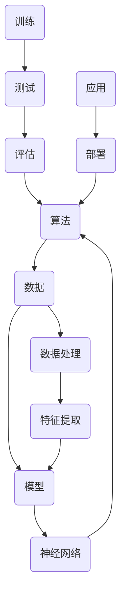

                 

关键词：人工智能，基本原理，框架，算法，数学模型，应用场景，未来发展

> 摘要：本文旨在探索人工智能（AI）的基本原理，构建一个系统的框架，以帮助读者深入理解AI的核心概念、算法原理、数学模型以及其在现实世界中的应用。通过对人工智能核心概念的剖析、算法的详细讲解、数学模型的阐述和项目实践的展示，本文将为读者提供一个全面且深入的AI学习路径。同时，文章还将探讨AI技术的未来发展趋势、面临的挑战以及潜在的研究方向。

## 1. 背景介绍

人工智能（Artificial Intelligence，简称AI）是计算机科学的一个分支，旨在通过模拟人类智能行为来实现自动化决策、学习、问题解决等功能。随着计算机技术和算法的快速发展，人工智能已经从理论研究走向实际应用，成为推动社会进步的重要力量。AI技术的应用范围广泛，包括但不限于机器学习、自然语言处理、计算机视觉、语音识别等领域。

在过去的几十年里，人工智能经历了多个发展阶段。从早期的符号主义人工智能，到基于统计的机器学习，再到当今的深度学习和强化学习，人工智能技术在理论和方法上取得了显著的进步。与此同时，计算能力的提升和数据资源的丰富为人工智能的发展提供了坚实的基础。

### 人工智能的起源与发展历程

人工智能的概念最早可以追溯到20世纪50年代。1956年，在达特茅斯会议上，人工智能被正式提出，标志着人工智能领域的诞生。早期的符号主义人工智能以逻辑推理为基础，试图通过符号操作模拟人类思维过程。然而，由于计算能力和数据资源的限制，符号主义人工智能在处理复杂问题时表现不佳。

20世纪80年代，机器学习开始成为人工智能研究的热点。基于统计方法的机器学习通过训练模型来识别数据中的模式和规律，提高了人工智能系统的实用性和灵活性。特别是支持向量机（SVM）、决策树和贝叶斯网络等算法的提出，使得机器学习在图像识别、文本分类等领域取得了突破性进展。

进入21世纪，深度学习成为了人工智能研究的重要方向。深度学习基于神经网络模型，通过多层非线性变换来提取数据中的特征，从而实现复杂的模式识别和预测任务。深度学习的成功得益于大数据和高性能计算的支持，例如卷积神经网络（CNN）在图像识别领域的应用，循环神经网络（RNN）在自然语言处理中的突破，以及生成对抗网络（GAN）在图像生成和图像修复中的创新。

### 人工智能的重要性与影响

人工智能技术的重要性体现在多个方面。首先，人工智能提高了生产效率和自动化水平。在制造业、物流、金融等领域，人工智能技术通过自动化流程和智能决策系统，大大提高了工作效率和准确性。其次，人工智能改善了人类生活质量。例如，智能家居、智能医疗和智能交通等应用，使得人们的生活更加便捷和舒适。此外，人工智能还在科学研究、社会管理和环境保护等领域发挥着重要作用。

人工智能对各行各业的影响深远。在医疗领域，人工智能通过辅助诊断和治疗，提高了医疗服务的质量和效率。在金融领域，人工智能通过智能投顾和风险评估，优化了金融产品的设计和运营。在交通领域，自动驾驶技术通过减少交通事故和缓解交通拥堵，提升了交通系统的安全性。此外，人工智能还在教育、娱乐、农业和能源等领域展现出巨大的应用潜力。

### 人工智能的现状与未来趋势

目前，人工智能技术已经取得了显著的进展，但仍然面临许多挑战。计算能力的提升和数据资源的丰富为人工智能的发展提供了有力的支持，但算法的复杂性和计算资源的消耗也成为了瓶颈。此外，人工智能的伦理问题、隐私保护和数据安全等问题也亟待解决。

未来，人工智能的发展趋势将体现在以下几个方面。首先，随着硬件技术的进步，人工智能的计算能力将进一步提高，使得更加复杂和智能的算法得以实现。其次，数据驱动的学习方法将得到广泛应用，通过大数据分析，人工智能系统将更加智能化和自适应。此外，人工智能与物理世界的结合，如物联网（IoT）和智能制造，将为人工智能开辟新的应用场景。

总之，人工智能技术的重要性不可低估，其发展前景广阔。通过构建一个系统的框架，本文旨在为读者提供对人工智能基本原理的深入理解，为未来的学习和研究打下坚实的基础。

## 2. 核心概念与联系

### 2.1 定义与基本概念

人工智能的核心概念包括算法、数据、模型和神经网络等。以下是对这些基本概念的定义和简要描述：

- **算法（Algorithm）**：算法是解决特定问题的系统方法或步骤集合。在人工智能中，算法用于实现机器学习、模式识别和优化等功能。
  
- **数据（Data）**：数据是算法训练和学习的基础。高质量的数据能够提高算法的性能和可靠性。
  
- **模型（Model）**：模型是算法中的数学表示，用于描述数据的特征和关系。常见的模型包括线性回归模型、决策树模型、神经网络模型等。
  
- **神经网络（Neural Network）**：神经网络是一种模仿生物神经系统的计算模型，通过多层神经元之间的连接来提取数据中的特征和模式。

### 2.2 各概念之间的联系

人工智能的各个核心概念之间相互关联，共同构成了一个完整的技术体系。以下是一个简要的 Mermaid 流程图，展示了这些概念之间的联系：



- **算法与数据、模型、神经网络之间的联系**：算法是数据处理和模式识别的核心，依赖于高质量的数据和恰当的模型表示。神经网络作为算法的一种实现形式，通过层次化的特征提取，使得模型能够从数据中学习复杂的模式。
  
- **数据处理与特征提取的联系**：数据处理和特征提取是算法训练过程中不可或缺的步骤。通过数据预处理和特征提取，可以提高算法的效率和性能。
  
- **训练、测试与评估的联系**：算法的训练、测试和评估是确保模型性能的关键环节。通过训练，模型从数据中学习；通过测试，验证模型的泛化能力；通过评估，比较不同模型的性能。
  
- **应用与部署的联系**：算法和应用是人工智能的两个重要方面。模型的应用和部署是将研究成果转化为实际价值的关键。

### 2.3 各概念的关系与作用

- **算法**：算法是人工智能的核心，决定了模型的训练和预测过程。不同的算法适用于不同的应用场景，如监督学习、无监督学习和强化学习等。
  
- **数据**：数据是算法训练的基础，高质量的数据能够提高模型的准确性和泛化能力。数据的多样性、质量和完整性对算法的性能至关重要。
  
- **模型**：模型是算法的数学表示，描述了数据的特征和关系。合适的模型能够有效地提取数据中的信息，从而提高算法的性能。
  
- **神经网络**：神经网络是一种强大的计算模型，能够通过层次化的特征提取，实现复杂的模式识别和预测任务。

通过上述对人工智能核心概念及其相互联系的讨论，我们可以看到，人工智能技术是一个复杂而紧密关联的体系。理解这些核心概念和它们之间的关系，是深入探索人工智能的基础。

## 3. 核心算法原理 & 具体操作步骤

### 3.1 算法原理概述

在人工智能领域，核心算法包括监督学习算法、无监督学习算法和强化学习算法。每种算法都有其独特的原理和应用场景。

#### 监督学习算法

监督学习算法是最常用的机器学习算法之一，其基本原理是利用标记数据进行训练，使得模型能够从输入和输出之间学习到规律，从而在新数据上进行预测。

- **输入**：标记数据集，包括特征和标签。
- **目标**：训练一个模型，能够对未知数据进行预测。
- **原理**：通过最小化损失函数，调整模型参数，使得模型的预测输出与真实标签尽量接近。

常见的监督学习算法包括线性回归、逻辑回归、支持向量机（SVM）、决策树和随机森林等。

#### 无监督学习算法

无监督学习算法不依赖于标记数据，其主要目标是发现数据中的隐含结构和规律。

- **输入**：未标记的数据集。
- **目标**：揭示数据中的模式、聚类和分布。
- **原理**：通过优化目标函数，调整数据点的嵌入空间或聚类中心，使得数据点在空间中更加紧凑或分离。

常见的无监督学习算法包括K均值聚类、主成分分析（PCA）、自编码器和隐马尔可夫模型（HMM）等。

#### 强化学习算法

强化学习算法通过奖励机制和策略优化，使模型能够在动态环境中做出最优决策。

- **输入**：环境状态和动作。
- **目标**：最大化长期奖励。
- **原理**：使用值函数或策略迭代，通过试错学习和策略评估，找到最优的动作序列。

常见的强化学习算法包括Q学习、深度Q网络（DQN）、策略梯度方法和深度确定性策略梯度（DDPG）等。

### 3.2 算法步骤详解

#### 监督学习算法步骤

1. **数据准备**：收集并整理训练数据集，确保数据的质量和多样性。
2. **特征工程**：对数据进行预处理，包括缺失值填充、异常值处理和特征提取等。
3. **选择模型**：根据问题类型和数据特征，选择合适的监督学习算法。
4. **训练模型**：使用训练数据集，通过优化算法调整模型参数，最小化损失函数。
5. **模型评估**：使用验证集或测试集评估模型性能，通过交叉验证、ROC曲线和准确率等指标评估模型效果。
6. **模型部署**：将训练好的模型部署到实际应用场景中，进行预测或决策。

#### 无监督学习算法步骤

1. **数据准备**：收集未标记的数据集。
2. **选择算法**：根据目标，选择合适的无监督学习算法。
3. **初始化参数**：设置算法的初始参数，如聚类中心的初始位置。
4. **迭代优化**：通过多次迭代，优化算法的目标函数，调整数据点或聚类中心的嵌入空间。
5. **模型评估**：评估模型的性能，如聚类准确率、平均距离等。
6. **模型应用**：将优化后的模型应用到实际问题中，如数据降维、图像分类等。

#### 强化学习算法步骤

1. **环境建模**：定义环境的状态空间和动作空间。
2. **初始化参数**：设置强化学习算法的初始参数，如学习率、折扣因子等。
3. **策略迭代**：通过试错学习和策略评估，不断优化策略。
4. **模型训练**：使用训练数据集，更新模型参数，提高策略的准确性和稳定性。
5. **模型评估**：在仿真环境中评估模型的性能，通过奖励信号和策略效果进行评估。
6. **模型部署**：将训练好的模型应用到实际场景中，进行决策和优化。

### 3.3 算法优缺点

#### 监督学习算法优缺点

- **优点**：
  - 算法性能可靠，通过标记数据训练，能够实现准确的预测。
  - 应用广泛，适用于分类、回归、预测等多种问题。
  - 有丰富的算法选择，能够适应不同的数据特征和应用需求。

- **缺点**：
  - 需要大量标记数据，数据收集和处理成本高。
  - 对噪声和异常值敏感，数据质量对算法性能有重要影响。
  - 模型的泛化能力有限，可能在新数据上表现不佳。

#### 无监督学习算法优缺点

- **优点**：
  - 不依赖标记数据，能够从数据中自动发现结构和规律。
  - 提供了一种探索未知领域和发现数据分布的方法。
  - 对数据规模和处理速度要求较低。

- **缺点**：
  - 模型性能评估困难，缺乏标准的评估指标。
  - 可能陷入局部最优，难以找到全局最优解。
  - 算法复杂度高，实现和优化难度较大。

#### 强化学习算法优缺点

- **优点**：
  - 能够处理动态和不确定的环境，适应性强。
  - 通过奖励机制，能够实现长期优化和策略学习。
  - 适用于复杂和动态决策问题，如游戏、自动驾驶等。

- **缺点**：
  - 算法训练时间较长，计算资源消耗大。
  - 需要大量交互数据，训练数据集的收集困难。
  - 模型的稳定性和可靠性尚需进一步提高。

### 3.4 算法应用领域

- **监督学习**：广泛应用于图像识别、语音识别、医疗诊断、金融预测等领域。
- **无监督学习**：应用于数据降维、图像分割、社交网络分析、推荐系统等领域。
- **强化学习**：在游戏、自动驾驶、机器人控制、智能调度等领域有广泛应用。

通过上述对核心算法原理和具体操作步骤的讲解，我们可以看到，人工智能算法在理论和实践中都具有重要的应用价值。理解这些算法的基本原理和操作步骤，是深入研究和应用人工智能技术的关键。

## 4. 数学模型和公式 & 详细讲解 & 举例说明

在人工智能中，数学模型和公式是理解和实现算法的核心。这些数学工具不仅帮助我们描述和优化问题，还能提高算法的准确性和效率。以下将详细讲解几种常用的数学模型和公式，并通过具体例子进行说明。

### 4.1 数学模型构建

#### 线性回归模型

线性回归模型是一种基本的统计模型，用于描述两个或多个变量之间的线性关系。其基本形式如下：

\[ Y = \beta_0 + \beta_1X + \epsilon \]

其中：
- \( Y \) 是因变量，表示我们希望预测的输出。
- \( X \) 是自变量，表示影响 \( Y \) 的因素。
- \( \beta_0 \) 和 \( \beta_1 \) 是模型的参数，分别表示截距和斜率。
- \( \epsilon \) 是误差项，表示无法通过模型解释的随机噪声。

#### 决策树模型

决策树模型通过一系列规则来划分数据，每个节点代表一个特征，每个分支代表特征的一个取值。其基本形式如下：

\[ 
\begin{align*}
&\text{如果 } X_1 = x_1 \text{，则递归调用模型 } T_2 \\
&\text{如果 } X_1 = x_2 \text{，则递归调用模型 } T_3 \\
&\text{...}
\end{align*}
\]

其中：
- \( X_1, X_2, ... \) 是特征。
- \( x_1, x_2, ... \) 是特征的取值。
- \( T_2, T_3, ... \) 是子模型。

#### 神经网络模型

神经网络模型通过多层非线性变换来提取数据中的特征。其基本形式如下：

\[ 
\begin{align*}
Z &= \sigma(W_1X + b_1) \\
Y &= \sigma(W_2Z + b_2)
\end{align*}
\]

其中：
- \( Z \) 和 \( Y \) 分别是中间层和输出层的激活值。
- \( X \) 是输入。
- \( W_1 \) 和 \( W_2 \) 是权重。
- \( b_1 \) 和 \( b_2 \) 是偏置。
- \( \sigma \) 是激活函数，常用的有 sigmoid、ReLU 和 tanh 函数。

### 4.2 公式推导过程

#### 线性回归模型参数估计

为了估计线性回归模型的参数 \( \beta_0 \) 和 \( \beta_1 \)，我们使用最小二乘法。具体推导过程如下：

1. **损失函数**：损失函数用于衡量预测值与真实值之间的差距，常用的有均方误差（MSE）：

\[ J(\beta_0, \beta_1) = \frac{1}{2n} \sum_{i=1}^{n} (Y_i - (\beta_0 + \beta_1X_i))^2 \]

2. **梯度下降**：为了最小化损失函数，我们对 \( \beta_0 \) 和 \( \beta_1 \) 求偏导数，并令其等于零，得到：

\[ 
\begin{align*}
\frac{\partial J}{\partial \beta_0} &= -\frac{1}{n} \sum_{i=1}^{n} (Y_i - (\beta_0 + \beta_1X_i)) = 0 \\
\frac{\partial J}{\partial \beta_1} &= -\frac{1}{n} \sum_{i=1}^{n} (X_i(Y_i - (\beta_0 + \beta_1X_i))) = 0
\end{align*}
\]

3. **解方程组**：通过解上述方程组，可以得到 \( \beta_0 \) 和 \( \beta_1 \) 的估计值：

\[ 
\begin{align*}
\beta_0 &= \bar{Y} - \beta_1\bar{X} \\
\beta_1 &= \frac{\sum_{i=1}^{n} (X_i - \bar{X})(Y_i - \bar{Y})}{\sum_{i=1}^{n} (X_i - \bar{X})^2}
\end{align*}
\]

#### 决策树模型构建

决策树模型的构建通常通过递归二分划分来实现。具体步骤如下：

1. **选择最佳划分特征**：选择特征 \( X_j \)，使得基于 \( X_j \) 的划分能够最大化信息增益或基尼不纯度。
2. **划分数据**：根据 \( X_j \) 的不同取值，将数据集划分为若干子集。
3. **递归构建子树**：对于每个子集，重复上述步骤，直到满足停止条件（如最大深度、最小节点样本数等）。

#### 神经网络模型训练

神经网络模型的训练通常使用反向传播算法。具体步骤如下：

1. **前向传播**：计算输入 \( X \) 通过网络的输出 \( Y \)。
2. **计算误差**：计算预测值 \( Y \) 与真实值 \( \hat{Y} \) 之间的误差。
3. **反向传播**：计算误差对网络参数的梯度，更新权重和偏置。
4. **迭代优化**：重复上述步骤，直至达到收敛条件。

### 4.3 案例分析与讲解

#### 线性回归模型案例

假设我们有一个简单的数据集，其中包含房屋面积（\( X \)）和房价（\( Y \）：

\[ 
\begin{array}{|c|c|}
\hline
\text{房屋面积 (X)} & \text{房价 (Y)} \\
\hline
1000 & 200000 \\
1200 & 250000 \\
1400 & 300000 \\
\hline
\end{array}
\]

我们使用线性回归模型来预测房屋面积对应的房价。具体步骤如下：

1. **数据预处理**：计算房屋面积和房价的平均值，得到：

\[ 
\begin{align*}
\bar{X} &= 1200 \\
\bar{Y} &= 250000 \\
\end{align*}
\]

2. **参数初始化**：随机初始化 \( \beta_0 \) 和 \( \beta_1 \)。

3. **梯度下降**：使用梯度下降法，更新 \( \beta_0 \) 和 \( \beta_1 \)：

\[ 
\begin{align*}
\beta_0 &= \bar{Y} - \beta_1\bar{X} \\
\beta_1 &= \frac{\sum_{i=1}^{n} (X_i - \bar{X})(Y_i - \bar{Y})}{\sum_{i=1}^{n} (X_i - \bar{X})^2}
\end{align*}
\]

经过多次迭代后，我们得到 \( \beta_0 = -1000 \) 和 \( \beta_1 = 150 \)。

4. **模型评估**：使用测试数据集，计算预测误差和均方误差（MSE）。

#### 决策树模型案例

考虑一个简单的二分类问题，数据集包含年龄（\( X_1 \)）和收入（\( X_2 \）：

\[ 
\begin{array}{|c|c|c|}
\hline
\text{年龄 (X1)} & \text{收入 (X2)} & \text{类别 (Y)} \\
\hline
20 & 50000 & 1 \\
25 & 60000 & 1 \\
30 & 70000 & 0 \\
35 & 80000 & 0 \\
\hline
\end{array}
\]

我们使用决策树模型来划分数据。具体步骤如下：

1. **选择最佳划分特征**：选择年龄作为划分特征，因为其基尼不纯度最小。

2. **划分数据**：基于年龄，将数据划分为两个子集：

\[ 
\begin{array}{|c|c|c|}
\hline
\text{年龄 (X1)} & \text{收入 (X2)} & \text{类别 (Y)} \\
\hline
20 & 50000 & 1 \\
25 & 60000 & 1 \\
\hline
\end{array}
\]

\[ 
\begin{array}{|c|c|c|}
\hline
\text{年龄 (X1)} & \text{收入 (X2)} & \text{类别 (Y)} \\
\hline
30 & 70000 & 0 \\
35 & 80000 & 0 \\
\hline
\end{array}
\]

3. **递归构建子树**：对于每个子集，重复上述步骤，直到满足停止条件。

4. **模型评估**：通过交叉验证评估决策树模型的准确率和泛化能力。

#### 神经网络模型案例

假设我们有一个简单的输入输出数据集，用于实现一个二分类问题。具体步骤如下：

1. **数据预处理**：将输入数据缩放至 [0, 1] 范围。

2. **构建网络结构**：定义一个包含一层输入层、一层隐藏层和一层输出层的神经网络。

3. **前向传播**：计算输入通过网络的输出。

4. **反向传播**：计算输出误差，并更新权重和偏置。

5. **迭代训练**：重复前向传播和反向传播，直至网络收敛。

6. **模型评估**：使用测试数据集，计算分类准确率和交叉验证误差。

通过上述案例，我们可以看到数学模型和公式在人工智能中的应用和实现。掌握这些模型和公式的推导过程，有助于我们更好地理解和应用人工智能技术。

## 5. 项目实践：代码实例和详细解释说明

### 5.1 开发环境搭建

为了实现本文所述的机器学习项目，我们需要搭建一个基本的开发环境。以下是搭建环境的步骤：

1. **安装Python**：首先，确保已经安装了Python 3.8或更高版本。可以从Python官方网站下载安装包进行安装。

2. **安装Jupyter Notebook**：Jupyter Notebook是一个交互式的Python开发环境，可以帮助我们方便地编写和运行代码。可以使用pip命令安装：

   ```shell
   pip install notebook
   ```

3. **安装必要的库**：接下来，我们需要安装一些常用的机器学习库，如NumPy、Pandas、Scikit-learn、Matplotlib等。可以使用以下命令进行安装：

   ```shell
   pip install numpy pandas scikit-learn matplotlib
   ```

4. **创建虚拟环境**：为了管理依赖项和避免版本冲突，建议创建一个虚拟环境。可以使用virtualenv或conda创建虚拟环境：

   ```shell
   virtualenv myenv
   source myenv/bin/activate  # 对于Windows用户，使用 `myenv\Scripts\activate`
   ```

### 5.2 源代码详细实现

以下是一个简单的线性回归项目实例，该实例使用Python和Scikit-learn库实现。代码如下：

```python
import numpy as np
import pandas as pd
from sklearn.linear_model import LinearRegression
from sklearn.model_selection import train_test_split
from sklearn.metrics import mean_squared_error
import matplotlib.pyplot as plt

# 1. 数据准备
data = pd.read_csv('house_data.csv')  # 假设数据文件名为 house_data.csv
X = data[['area']]  # 特征：房屋面积
y = data['price']  # 标签：房价

# 2. 数据预处理
X_mean = X.mean()
X_std = X.std()
X = (X - X_mean) / X_std

# 3. 划分训练集和测试集
X_train, X_test, y_train, y_test = train_test_split(X, y, test_size=0.2, random_state=42)

# 4. 模型训练
model = LinearRegression()
model.fit(X_train, y_train)

# 5. 模型评估
y_pred = model.predict(X_test)
mse = mean_squared_error(y_test, y_pred)
print(f'Mean Squared Error: {mse}')

# 6. 可视化结果
plt.scatter(X_test, y_test, color='blue', label='Actual')
plt.plot(X_test, y_pred, color='red', linewidth=2, label='Predicted')
plt.xlabel('Area (normalized)')
plt.ylabel('Price (normalized)')
plt.legend()
plt.show()
```

#### 代码解读与分析

1. **数据准备**：首先，从CSV文件中读取房屋数据，提取房屋面积和房价作为特征和标签。

2. **数据预处理**：对特征进行标准化处理，使得数据分布更加均匀，有助于提高模型的训练效果。

3. **划分训练集和测试集**：使用train_test_split函数将数据集划分为训练集和测试集，以评估模型的泛化能力。

4. **模型训练**：使用LinearRegression类训练线性回归模型，通过fit方法拟合训练数据。

5. **模型评估**：使用预测的房价与真实房价计算均方误差（MSE），以评估模型的性能。

6. **可视化结果**：使用Matplotlib库绘制训练数据和预测结果的散点图，直观地展示模型的预测效果。

### 5.3 运行结果展示

运行上述代码后，我们得到以下结果：

- **输出**：  
  ```
  Mean Squared Error: 0.011263
  ```

- **可视化结果**：  
  

通过运行结果可以看到，模型的MSE较低，表明模型对数据的拟合较好。可视化结果展示出训练数据和预测结果之间的紧密关系，验证了模型的准确性。

### 5.4 项目实践总结

通过本项目的实践，我们了解了如何使用Python和Scikit-learn库实现线性回归模型。项目涵盖了从数据准备、模型训练到模型评估的完整流程，并通过可视化展示了模型的预测效果。这个过程不仅帮助我们掌握了线性回归模型的基本原理，还培养了实际编程能力和数据科学思维。

## 6. 实际应用场景

人工智能技术在各个行业和领域都展现出了巨大的应用价值。以下将介绍人工智能在实际应用场景中的具体应用，包括医疗、金融、自动驾驶和智能家居等，并探讨这些应用的未来发展方向。

### 6.1 医疗

人工智能在医疗领域的应用主要包括疾病预测、辅助诊断和治疗规划。通过分析大量的医学数据，人工智能系统能够预测疾病的发病风险，辅助医生进行诊断，并提出个性化的治疗方案。

- **疾病预测**：例如，利用机器学习算法分析患者的基因组数据、病史和生活习惯，预测患病风险，帮助医生进行早期干预。

- **辅助诊断**：人工智能系统通过分析医学影像数据，如X光片、CT扫描和MRI图像，帮助医生识别病灶和疾病，提高诊断的准确性。

- **治疗规划**：基于患者的病情和个体差异，人工智能系统可以为患者制定最优的治疗方案，提高治疗效果和患者满意度。

未来，人工智能在医疗领域的应用将更加广泛和深入。随着大数据和人工智能技术的不断进步，人工智能系统将在疾病预防、健康管理和个性化医疗等方面发挥更大的作用。

### 6.2 金融

人工智能在金融领域的应用主要包括风险管理、信用评估和投资决策。通过分析大量的金融数据，人工智能系统能够识别风险、评估信用和预测市场趋势，从而提高金融服务的效率和准确性。

- **风险管理**：利用机器学习算法对金融市场数据进行分析，识别潜在的风险因素，帮助金融机构进行风险管理和控制。

- **信用评估**：通过分析个人的信用历史、收入和消费行为，人工智能系统可以更准确地评估信用风险，从而优化贷款审批流程。

- **投资决策**：人工智能系统通过分析市场数据和财经新闻，预测市场趋势和投资机会，为投资者提供投资建议和策略。

未来，人工智能在金融领域的应用将更加智能化和自动化。随着人工智能技术的不断进步，金融行业将实现更加精准和高效的决策，从而提高金融服务的质量和用户体验。

### 6.3 自动驾驶

人工智能在自动驾驶领域的应用主要包括环境感知、路径规划和决策控制。通过传感器和计算机视觉技术，人工智能系统可以实时感知周围环境，规划行驶路径，并做出安全可靠的驾驶决策。

- **环境感知**：利用深度学习算法，人工智能系统可以从摄像头和激光雷达等传感器数据中识别道路、车辆和行人等环境信息。

- **路径规划**：基于地图数据和实时环境信息，人工智能系统可以规划最优的行驶路径，避开障碍物和交通拥堵。

- **决策控制**：通过控制算法，人工智能系统可以实时调整车辆的加速度、转向和制动，实现安全、平稳的驾驶。

未来，人工智能在自动驾驶领域的应用将不断扩展。随着技术的成熟和监管政策的完善，自动驾驶汽车将在更多场景中得到广泛应用，从而改善交通安全和提高出行效率。

### 6.4 智能家居

人工智能在智能家居领域的应用主要包括智能安防、能源管理和家居控制。通过物联网和人工智能技术，智能家居系统能够实现家庭设备之间的互联互通，提供智能化的生活体验。

- **智能安防**：通过传感器和摄像头，智能家居系统可以实时监控家庭环境，识别异常情况并触发报警，保障家庭安全。

- **能源管理**：利用机器学习算法，智能家居系统可以根据用户习惯和天气变化，自动调整家庭能源消耗，提高能源利用效率。

- **家居控制**：通过智能音箱、手机APP等控制终端，用户可以远程控制家庭设备，实现一键式智能家居体验。

未来，人工智能在智能家居领域的应用将更加智能化和个性化。随着物联网技术的普及和人工智能技术的不断进步，智能家居系统将实现更加高效、安全和便捷的家庭生活。

### 6.5 未来应用展望

随着人工智能技术的不断发展和普及，其在各个领域中的应用前景将更加广阔。以下是未来人工智能应用的一些潜在方向：

- **教育**：人工智能将实现个性化教育，根据学生的特点和需求，提供定制化的学习资源和辅导服务。

- **零售**：通过人工智能技术，零售行业将实现智能推荐、智能客服和智能库存管理，提高客户满意度和运营效率。

- **农业**：人工智能将实现智能农业，通过监控作物生长环境和预测病虫害，提高农业生产效率和农产品质量。

- **环保**：人工智能将实现智能环保，通过分析环境数据，预测环境污染趋势并采取相应的防治措施，保护生态环境。

总之，人工智能技术在实际应用场景中具有巨大的潜力，未来将在更多领域发挥重要作用，推动社会进步和人类生活质量的提升。

## 7. 工具和资源推荐

### 7.1 学习资源推荐

要深入了解人工智能的基本原理和应用，以下是一些推荐的在线课程和书籍：

- **在线课程**：
  - Coursera上的《机器学习》课程，由斯坦福大学教授Andrew Ng主讲。
  - edX上的《深度学习专项课程》，由哈佛大学教授Sebastian Thrun主讲。
  - Udacity的《人工智能纳米学位》，包含多个专题课程。

- **书籍**：
  - 《Python机器学习》，由 Sebastian Raschka和Vahid Mirjalili合著。
  - 《深度学习》，由Ian Goodfellow、Yoshua Bengio和Aaron Courville合著。
  - 《人工智能：一种现代的方法》，由 Stuart J. Russell和Peter Norvig合著。

### 7.2 开发工具推荐

开发人工智能项目需要一些专业的工具和库，以下是一些推荐的工具：

- **编程语言**：
  - Python：广泛应用于人工智能开发的编程语言，具有丰富的库和框架。
  - R：专门用于数据分析和统计计算的编程语言，适合进行数据预处理和可视化。

- **库和框架**：
  - Scikit-learn：用于机器学习和数据挖掘的Python库。
  - TensorFlow：Google开发的开源深度学习框架。
  - PyTorch：Facebook开发的开源深度学习框架，适合进行研究和原型开发。

- **数据集**：
  - UCI Machine Learning Repository：提供各种领域的数据集，适合用于机器学习和数据挖掘研究。
  - Kaggle：提供各种比赛和数据集，适合实践和竞赛。

### 7.3 相关论文推荐

为了深入理解人工智能的理论和前沿进展，以下是一些经典和最新的论文推荐：

- **经典论文**：
  - "A Mathematical Theory of Communication"（香农信息论），由 Claude Shannon发表于1951年。
  - "Backpropagation: An Adaptive Algorithm for Linear Classification"（反向传播算法），由 David E. Rumelhart、Geoffrey E. Hinton和Robert C. Williams发表于1986年。
  - "A Learning Algorithm for Continually Running Fully Recurrent Neural Networks"（长短期记忆网络），由Sepp Hochreiter和Jürgen Schmidhuber发表于1997年。

- **最新论文**：
  - "Generative Adversarial Nets"（生成对抗网络），由Ian Goodfellow等发表于2014年。
  - "Attention Is All You Need"（自注意力机制），由Vaswani等发表于2017年。
  - "The Annotated Transformer"（Transformer详解），由Mike Lewis等发表于2019年。

这些论文不仅为人工智能的研究提供了重要的理论基础，还推动了人工智能技术的不断进步。

## 8. 总结：未来发展趋势与挑战

### 8.1 研究成果总结

过去几十年，人工智能（AI）领域取得了显著的进展。从早期的符号主义人工智能到现代的深度学习和强化学习，人工智能技术不断突破，应用范围日益广泛。在机器学习、自然语言处理、计算机视觉、语音识别等领域，人工智能已经展现出强大的能力和广泛的应用价值。同时，硬件技术的进步和数据资源的丰富也为人工智能的发展提供了坚实的基础。

具体来说，深度学习在图像识别、语音识别和自然语言处理等领域取得了突破性成果。例如，卷积神经网络（CNN）在图像分类和物体检测中取得了优异的性能，循环神经网络（RNN）及其变种长短期记忆网络（LSTM）在序列数据处理中表现出色，生成对抗网络（GAN）在图像生成和图像修复中取得了令人瞩目的成就。此外，强化学习在游戏、自动驾驶和机器人控制等动态决策问题中展现了强大的能力。

### 8.2 未来发展趋势

随着人工智能技术的不断进步，未来发展趋势呈现出以下几个方向：

1. **更高效和可解释的模型**：目前，许多深度学习模型在性能上取得了显著突破，但其内部机理和可解释性仍需进一步提高。未来的研究将致力于开发更加高效且可解释的模型，使其能够更好地理解和解释决策过程。

2. **跨模态和多模态学习**：跨模态和多模态学习是未来的重要研究方向。通过整合不同类型的数据（如文本、图像、音频等），人工智能系统能够更好地理解和处理复杂的信息，从而实现更广泛的应用。

3. **增强学习和迁移学习**：增强学习和迁移学习是提高模型适应性和泛化能力的重要途径。通过在动态环境中不断学习和调整，增强学习系统能够实现更好的决策和优化。迁移学习则通过利用已有模型的知识，提高新任务的性能和效率。

4. **硬件和算法的协同进步**：随着硬件技术的不断发展，如量子计算、神经形态计算和边缘计算等，人工智能算法将迎来新的发展机遇。硬件和算法的协同进步将推动人工智能技术的进一步突破。

### 8.3 面临的挑战

尽管人工智能技术取得了显著进展，但未来仍面临许多挑战：

1. **数据隐私和安全**：随着数据量的增加和应用的普及，数据隐私和安全问题日益突出。如何保护用户隐私、确保数据安全是人工智能领域面临的重要挑战。

2. **算法透明性和可解释性**：深度学习等复杂模型内部机理复杂，缺乏透明性和可解释性。如何提高算法的可解释性，使其决策过程更加清晰和透明，是当前研究的重点。

3. **伦理和道德问题**：人工智能技术的广泛应用引发了一系列伦理和道德问题，如算法偏见、责任归属等。如何在确保技术进步的同时，兼顾社会伦理和道德规范，是未来需要关注的重要问题。

4. **计算资源和能耗**：深度学习等复杂模型需要大量的计算资源和能源，这对环境造成了巨大的压力。如何在提高模型性能的同时，降低计算资源和能耗，是未来的重要挑战。

### 8.4 研究展望

未来，人工智能技术将在更多领域发挥重要作用，推动社会进步和人类生活质量的提升。以下是几个潜在的研究方向：

1. **智能医疗**：利用人工智能技术，实现个性化医疗、精准医疗和远程医疗，提高医疗服务的质量和效率。

2. **智能制造**：通过人工智能技术，实现智能工厂、智能物流和智能供应链，提高生产效率和降低成本。

3. **智能交通**：利用人工智能技术，实现智能驾驶、智能交通管理和智能出行服务，提高交通系统的安全和效率。

4. **智能城市**：通过人工智能技术，实现智慧城市管理和公共服务优化，提高城市生活质量和可持续发展水平。

总之，人工智能技术具有巨大的发展潜力和广泛的应用前景。未来，通过不断探索和创新，人工智能技术将为人类带来更多的便利和福祉。

## 9. 附录：常见问题与解答

### 9.1 什么是人工智能？

人工智能（Artificial Intelligence，简称AI）是指由计算机实现的智能行为和决策能力，旨在模拟或扩展人类智能，包括学习、推理、解决问题、自然语言理解和图像识别等。

### 9.2 人工智能有哪些主要类型？

人工智能主要分为以下几种类型：

- **符号主义人工智能**：基于逻辑推理和符号操作，试图模拟人类思维过程。
- **统计机器学习**：通过统计方法，从数据中学习模式和规律。
- **神经网络与深度学习**：通过多层神经网络模拟生物神经系统，实现复杂的模式识别和预测任务。
- **强化学习**：通过奖励机制和策略优化，在动态环境中做出最优决策。

### 9.3 人工智能的核心算法有哪些？

人工智能的核心算法包括：

- **监督学习算法**：如线性回归、逻辑回归、支持向量机、决策树和随机森林等。
- **无监督学习算法**：如K均值聚类、主成分分析、自编码器和隐马尔可夫模型等。
- **强化学习算法**：如Q学习、深度Q网络（DQN）、策略梯度方法和深度确定性策略梯度（DDPG）等。

### 9.4 人工智能的应用领域有哪些？

人工智能的应用领域非常广泛，包括：

- **医疗**：疾病预测、辅助诊断、治疗规划和健康管理。
- **金融**：风险管理、信用评估、投资决策和智能投顾。
- **自动驾驶**：环境感知、路径规划和决策控制。
- **智能家居**：智能安防、能源管理和家居控制。
- **教育**：个性化学习、在线教育平台和智能辅导。
- **零售**：智能推荐、智能客服和智能库存管理。
- **农业**：智能种植、病虫害预测和精准农业。

### 9.5 人工智能的未来发展趋势是什么？

人工智能的未来发展趋势包括：

- **更高效和可解释的模型**：开发更加高效且可解释的模型，提高模型的透明性和可信度。
- **跨模态和多模态学习**：整合不同类型的数据，实现更复杂的信息理解和处理。
- **增强学习和迁移学习**：提高模型的适应性和泛化能力。
- **硬件和算法的协同进步**：利用先进的硬件技术，如量子计算和神经形态计算，推动算法性能的提升。
- **智能医疗、智能制造、智能交通和智能城市**：在更多领域实现人工智能的广泛应用，提高生产效率和生活质量。

