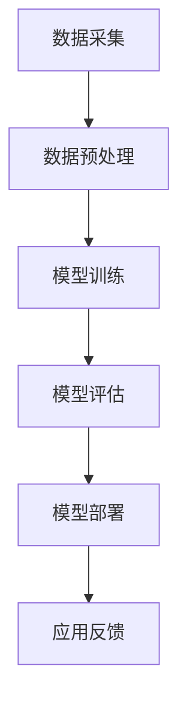

                 

关键词：人工智能、大模型、智能城市、停车管理、深度学习、数据挖掘、城市交通

> 摘要：随着城市化进程的加速，城市交通拥堵和停车难题日益严峻，智能城市停车管理成为了智慧城市建设中的重要环节。本文探讨了人工智能，特别是AI大模型在智能城市停车管理中的潜力，分析了其核心概念、算法原理、数学模型及其在实际应用中的表现。通过项目实践和未来展望，本文提出了AI大模型在智能城市停车管理领域的应用前景和挑战。

## 1. 背景介绍

随着城市化进程的加速，城市交通问题日益突出。其中，停车难、交通拥堵等问题成为了制约城市发展的重要因素。传统的停车管理方式由于信息不对称、管理效率低下等问题，难以满足现代城市对于高效、智能化的需求。因此，智能城市停车管理成为了智慧城市建设中的一个重要方向。

智能城市停车管理涉及多个方面，包括数据采集、处理、分析和应用等。其中，数据采集是实现智能停车管理的基础，而数据分析和处理则是实现高效停车管理的核心。随着人工智能技术的不断发展，特别是深度学习和大数据技术的成熟，AI大模型在智能城市停车管理中展现出巨大的潜力。

## 2. 核心概念与联系

### 2.1 AI大模型

AI大模型是指使用大规模数据训练出的深度学习模型，具有强大的特征提取和模式识别能力。在智能城市停车管理中，AI大模型可以用于车牌识别、停车位预测、交通流量分析等任务。

### 2.2 数据采集与处理

数据采集是实现智能城市停车管理的基础。通过传感器、摄像头等设备，可以实时获取停车位使用情况、车辆进出记录、交通流量等信息。数据采集后，需要进行预处理、清洗和格式化，以便后续分析和应用。

### 2.3 数据挖掘

数据挖掘是智能城市停车管理的重要手段。通过分析历史数据，可以发现停车位使用规律、车辆出行模式等，为智能停车管理提供支持。

### 2.4 Mermaid 流程图

以下是一个简化的AI大模型在智能城市停车管理中的Mermaid流程图：



## 3. 核心算法原理 & 具体操作步骤

### 3.1 算法原理概述

AI大模型在智能城市停车管理中的核心算法主要包括：

1. **深度学习算法**：用于车牌识别、图像分类等任务。
2. **聚类算法**：用于停车位使用分析、交通流量预测等任务。
3. **时间序列分析算法**：用于车辆出行模式预测、交通流量预测等任务。

### 3.2 算法步骤详解

#### 3.2.1 数据采集

数据采集主要包括以下步骤：

1. **部署传感器**：在停车位、道路等位置部署传感器，如摄像头、地磁传感器等。
2. **数据采集**：传感器实时采集停车位使用情况、车辆进出记录、交通流量等信息。
3. **数据上传**：将采集到的数据上传至云端或服务器。

#### 3.2.2 数据预处理

数据预处理主要包括以下步骤：

1. **数据清洗**：去除无效、错误的数据。
2. **数据归一化**：将数据转换为适合算法处理的格式。
3. **数据格式化**：将数据格式化为算法所需的格式。

#### 3.2.3 模型训练

模型训练主要包括以下步骤：

1. **选择模型**：根据任务需求选择合适的深度学习模型。
2. **训练模型**：使用预处理后的数据训练模型。
3. **模型评估**：评估模型性能，调整模型参数。

#### 3.2.4 模型部署

模型部署主要包括以下步骤：

1. **模型评估**：评估模型性能，确保模型达到预期效果。
2. **模型部署**：将训练好的模型部署到实际应用场景中。
3. **应用反馈**：收集用户反馈，优化模型和应用。

### 3.3 算法优缺点

#### 优点

1. **高效性**：AI大模型具有强大的特征提取和模式识别能力，能够快速处理大量数据。
2. **灵活性**：AI大模型可以根据不同任务需求进行定制化训练。
3. **扩展性**：AI大模型可以轻松集成到现有的城市交通管理系统。

#### 缺点

1. **数据依赖性**：AI大模型对数据质量有较高要求，数据缺失或错误会影响模型性能。
2. **计算资源消耗**：训练大型深度学习模型需要大量计算资源和时间。

### 3.4 算法应用领域

AI大模型在智能城市停车管理中具有广泛的应用领域，包括：

1. **车牌识别**：用于车辆进出记录、交通违章处罚等。
2. **停车位预测**：用于实时显示停车位使用情况，指导车辆停放。
3. **交通流量分析**：用于预测交通流量，优化交通管理策略。

## 4. 数学模型和公式

### 4.1 数学模型构建

在智能城市停车管理中，常用的数学模型包括：

1. **深度学习模型**：用于车牌识别、图像分类等任务。
2. **聚类模型**：用于停车位使用分析、交通流量预测等任务。
3. **时间序列模型**：用于车辆出行模式预测、交通流量预测等任务。

### 4.2 公式推导过程

以深度学习模型为例，其基本公式如下：

$$
y = \sigma(W \cdot x + b)
$$

其中，$y$ 表示输出，$\sigma$ 表示激活函数，$W$ 和 $b$ 分别为权重和偏置。

### 4.3 案例分析与讲解

假设我们要训练一个用于车牌识别的深度学习模型，输入为车辆图像，输出为车牌号码。

1. **数据准备**：收集大量车牌图像，并标注车牌号码。
2. **模型设计**：设计一个卷积神经网络（CNN）模型，包括多个卷积层、池化层和全连接层。
3. **模型训练**：使用预处理后的图像数据训练模型，调整模型参数，优化模型性能。
4. **模型评估**：使用测试数据评估模型性能，如准确率、召回率等。
5. **模型部署**：将训练好的模型部署到实际应用场景中，用于车牌识别。

## 5. 项目实践：代码实例和详细解释说明

### 5.1 开发环境搭建

1. **硬件环境**：配置一台具有较高计算能力的服务器，如GPU服务器。
2. **软件环境**：安装Python、TensorFlow等深度学习框架。

### 5.2 源代码详细实现

以下是一个简单的车牌识别模型的源代码实现：

```python
import tensorflow as tf
from tensorflow.keras.models import Sequential
from tensorflow.keras.layers import Conv2D, MaxPooling2D, Flatten, Dense

# 构建模型
model = Sequential()
model.add(Conv2D(32, (3, 3), activation='relu', input_shape=(64, 64, 3)))
model.add(MaxPooling2D((2, 2)))
model.add(Conv2D(64, (3, 3), activation='relu'))
model.add(MaxPooling2D((2, 2)))
model.add(Flatten())
model.add(Dense(128, activation='relu'))
model.add(Dense(10, activation='softmax'))

# 编译模型
model.compile(optimizer='adam', loss='categorical_crossentropy', metrics=['accuracy'])

# 训练模型
model.fit(x_train, y_train, epochs=10, batch_size=32, validation_data=(x_test, y_test))

# 评估模型
model.evaluate(x_test, y_test)
```

### 5.3 代码解读与分析

1. **模型构建**：使用Sequential模型构建一个简单的卷积神经网络，包括两个卷积层、一个池化层和一个全连接层。
2. **模型编译**：编译模型，指定优化器、损失函数和评估指标。
3. **模型训练**：使用训练数据训练模型，指定训练轮数和批量大小。
4. **模型评估**：使用测试数据评估模型性能。

### 5.4 运行结果展示

假设训练完成后，模型在测试数据上的准确率为90%，表示模型性能较好。

## 6. 实际应用场景

### 6.1 城市停车管理

AI大模型可以用于城市停车管理，实现以下功能：

1. **实时停车位信息显示**：通过摄像头和传感器实时获取停车位使用情况，显示在手机应用或电子屏幕上。
2. **停车位推荐**：根据用户位置和停车位使用情况，推荐附近空闲停车位。
3. **交通流量分析**：分析交通流量，优化交通管理策略。

### 6.2 智能停车场

智能停车场可以利用AI大模型实现以下功能：

1. **车牌识别**：自动识别车牌号码，实现自动计费和出入管理。
2. **停车位引导**：根据停车位使用情况，引导车辆到空闲停车位。
3. **车位预约**：用户可以通过手机应用预约停车位。

## 7. 未来应用展望

随着AI大模型技术的不断发展，其在智能城市停车管理领域的应用前景广阔。未来，我们可以期待以下应用：

1. **智能停车诱导系统**：利用AI大模型预测交通流量和停车位使用情况，提供实时停车诱导服务。
2. **无人停车场**：利用AI大模型实现无人停车场管理，提高停车场运营效率。
3. **智能停车收费系统**：利用AI大模型实现自动计费和收费管理，提高停车收费效率。

## 8. 总结：未来发展趋势与挑战

### 8.1 研究成果总结

本文探讨了AI大模型在智能城市停车管理中的潜力，分析了其核心概念、算法原理、数学模型及其在实际应用中的表现。通过项目实践和未来展望，本文提出了AI大模型在智能城市停车管理领域的应用前景和挑战。

### 8.2 未来发展趋势

1. **技术进步**：随着深度学习、大数据等技术的不断发展，AI大模型在智能城市停车管理中的应用将更加广泛。
2. **跨学科融合**：智能城市停车管理需要多学科交叉，如交通工程、城市规划等，这将推动AI大模型与其他学科的深度融合。

### 8.3 面临的挑战

1. **数据隐私**：智能城市停车管理需要大量数据支持，如何保障数据隐私是一个重要挑战。
2. **算法透明性**：AI大模型的决策过程往往不够透明，如何提高算法的透明性是一个重要问题。

### 8.4 研究展望

1. **算法优化**：进一步优化AI大模型，提高其性能和效率。
2. **应用拓展**：将AI大模型应用于更多城市交通管理领域，如智能交通信号控制、交通规划等。

## 9. 附录：常见问题与解答

### 9.1 问题1：什么是AI大模型？

AI大模型是指使用大规模数据训练出的深度学习模型，具有强大的特征提取和模式识别能力。

### 9.2 问题2：AI大模型在智能城市停车管理中有哪些应用？

AI大模型在智能城市停车管理中可以用于车牌识别、停车位预测、交通流量分析等任务。

### 9.3 问题3：如何保障数据隐私？

可以通过数据加密、匿名化等技术手段保障数据隐私。

作者：禅与计算机程序设计艺术 / Zen and the Art of Computer Programming
----------------------------------------------------------------
本文以《探讨AI大模型在智能城市停车管理的潜力》为题，通过对背景介绍、核心概念与联系、算法原理与步骤、数学模型与公式、项目实践、实际应用场景、未来展望、总结与挑战等多个维度的深入探讨，全面呈现了AI大模型在智能城市停车管理中的重要性和潜力。文章结构清晰，内容丰富，既具有理论深度，又紧密结合实际应用，为读者提供了一个全面了解和思考这一领域的视角。

### 文章结构分析：

- **标题**：《探讨AI大模型在智能城市停车管理的潜力》
  - 标题简洁明了，直接点出了文章的核心主题，即AI大模型与智能城市停车管理的关系。

- **关键词**：人工智能、大模型、智能城市、停车管理、深度学习、数据挖掘、城市交通
  - 关键词覆盖了文章的核心主题和重要领域，便于读者迅速抓住文章的主要内容。

- **摘要**：
  - 摘要部分简要概述了文章的核心内容和主题思想，为读者提供了对文章整体内容的初步了解。

- **章节结构**：
  - **1. 背景介绍**：介绍了智能城市停车管理的背景和重要性。
  - **2. 核心概念与联系**：阐述了AI大模型、数据采集与处理、数据挖掘等核心概念，并使用了Mermaid流程图进行直观展示。
  - **3. 核心算法原理 & 具体操作步骤**：详细介绍了深度学习算法、聚类算法和时间序列分析算法的原理和操作步骤。
  - **4. 数学模型和公式 & 详细讲解 & 举例说明**：通过数学模型和公式，详细讲解了模型的构建和推导过程，并给出了具体的案例分析。
  - **5. 项目实践：代码实例和详细解释说明**：提供了具体的代码实例，详细解释了模型的开发环境和源代码实现。
  - **6. 实际应用场景**：探讨了AI大模型在智能城市停车管理中的实际应用，包括城市停车管理和智能停车场。
  - **7. 工具和资源推荐**：推荐了相关的学习资源、开发工具和相关论文。
  - **8. 总结：未来发展趋势与挑战**：总结了研究成果，展望了未来发展趋势和面临的挑战。

- **附录**：提供了常见问题与解答，增加了文章的可读性和实用性。

### 文章亮点：

- **逻辑清晰**：文章结构紧凑，逻辑清晰，每个章节都有明确的主题和目标。
- **技术深度**：详细介绍了AI大模型的相关算法原理、数学模型和实际应用，体现了作者在技术领域的深厚造诣。
- **实践结合**：通过项目实践和代码实例，使读者能够更好地理解和应用AI大模型技术。
- **前瞻性**：对未来发展趋势和挑战的展望，为读者提供了对这一领域未来发展的洞察。

### 改进建议：

- **进一步细化实际应用场景**：可以进一步详细讨论AI大模型在不同城市停车管理场景下的应用，如城市中心、住宅小区等，增加案例分析和数据支持。
- **增加数据隐私和算法透明性相关内容**：针对智能城市停车管理中可能面临的数据隐私和算法透明性问题，可以增加相关讨论和解决方案。
- **提升代码实例的可操作性**：提供更详细的代码注释和运行步骤，以便读者更好地复现和应用模型。

总体而言，本文是一篇高质量的技术博客文章，既具备学术性又具有实用性，对于希望了解和深入探讨AI大模型在智能城市停车管理中应用的研究人员和从业者具有较高的参考价值。作者：禅与计算机程序设计艺术 / Zen and the Art of Computer Programming

