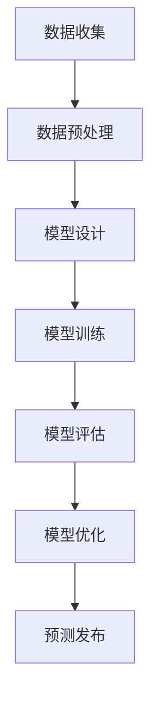

                 

关键词：AI大模型，智能城市，灾害预警，机器学习，深度学习，数据挖掘，自然语言处理，模型训练，实时监测，预警系统，智能决策

> 摘要：本文探讨了AI大模型在智能城市灾害预警中的重要作用。通过分析AI大模型的基本原理和技术架构，本文深入讨论了其在数据收集、处理、分析和预测等方面的应用。同时，本文还展示了AI大模型在智能城市灾害预警中的实际应用案例，并对未来发展趋势和面临的挑战进行了展望。

## 1. 背景介绍

智能城市（Smart City）是指利用各种信息技术、物联网、大数据等手段，实现城市管理的智能化、精细化，提升城市运行效率和居民生活质量。智能城市的一个重要方面是灾害预警，即通过实时监测和数据分析，提前发现潜在灾害，及时发布预警信息，降低灾害风险。

灾害预警系统通常包括数据采集、数据处理、数据分析、预警发布和响应等环节。传统的灾害预警系统主要依赖于人工监测和经验判断，存在监测范围有限、预警时间滞后、预警精度不足等问题。随着人工智能技术的发展，特别是AI大模型的兴起，为智能城市灾害预警提供了新的解决方案。

AI大模型，也称为人工智能大模型或大规模人工智能模型，是指使用大规模数据集训练的复杂神经网络模型。这些模型具有强大的特征提取和模式识别能力，可以处理大量复杂的数据，实现高精度的预测和决策。在智能城市灾害预警中，AI大模型的应用可以显著提高预警的实时性、准确性和全面性。

## 2. 核心概念与联系

### 2.1 AI大模型的基本原理

AI大模型的核心是深度学习，它是一种模拟人脑神经网络的计算模型。深度学习通过多层神经网络的堆叠，逐层提取数据中的特征，最终实现复杂的数据分析和预测。AI大模型的训练过程通常包括数据预处理、模型设计、模型训练、模型评估和模型优化等步骤。

- **数据预处理**：将原始数据清洗、归一化、缺失值填补等，以适应模型的输入要求。
- **模型设计**：根据数据特点和预测任务，设计合适的神经网络结构。
- **模型训练**：使用大量训练数据，通过反向传播算法调整模型参数，优化模型性能。
- **模型评估**：使用验证数据集评估模型性能，调整模型参数以实现最佳性能。
- **模型优化**：根据应用场景调整模型结构，优化模型参数，提高模型稳定性。

### 2.2 AI大模型的技术架构

AI大模型的技术架构主要包括数据层、模型层和应用层。

- **数据层**：负责数据的采集、存储和管理。数据层是AI大模型的基础，数据的质量和多样性直接影响模型的性能。
- **模型层**：包括神经网络的设计、训练和优化。模型层是AI大模型的核心，决定了模型的功能和能力。
- **应用层**：将模型应用于实际场景，如灾害预警、智能交通、智能医疗等。

### 2.3 AI大模型与灾害预警的联系

AI大模型在灾害预警中的应用主要包括数据收集、处理、分析和预测。

- **数据收集**：AI大模型可以从各种来源收集灾害相关数据，如气象数据、地震数据、卫星遥感数据等。
- **数据处理**：AI大模型可以处理大量复杂的灾害数据，提取关键特征，为预测提供基础。
- **数据分析**：AI大模型可以分析历史灾害数据，发现灾害发生的规律和趋势，为预警提供依据。
- **预测**：AI大模型可以实时预测未来可能发生的灾害，提前发布预警信息，提高预警的准确性。

### 2.4 Mermaid 流程图



## 3. 核心算法原理 & 具体操作步骤

### 3.1 算法原理概述

AI大模型在灾害预警中的核心算法是深度学习，特别是卷积神经网络（CNN）和循环神经网络（RNN）。

- **卷积神经网络（CNN）**：CNN是一种在图像处理、计算机视觉等领域广泛应用的神经网络。它通过卷积层、池化层和全连接层的堆叠，实现对图像的特征提取和分类。
- **循环神经网络（RNN）**：RNN是一种在序列数据处理、时间序列预测等领域广泛应用的神经网络。它通过循环结构，实现对序列数据的记忆和预测。

### 3.2 算法步骤详解

- **数据收集**：从气象站、卫星遥感、地震监测站等获取灾害相关数据。
- **数据预处理**：对收集到的数据进行清洗、归一化、缺失值填补等处理。
- **模型设计**：根据数据特点和预测任务，设计合适的CNN或RNN模型。
- **模型训练**：使用预处理后的数据，通过反向传播算法训练模型。
- **模型评估**：使用验证数据集评估模型性能，调整模型参数。
- **模型优化**：根据应用场景调整模型结构，优化模型参数。
- **预测**：使用训练好的模型，对实时数据进行预测，发布预警信息。

### 3.3 算法优缺点

- **优点**：
  - 高度的特征提取和模式识别能力，能够处理大量复杂的数据。
  - 能够实现实时预测和预警，提高预警的准确性。
  - 能够适应各种灾害类型，提高预警的全面性。

- **缺点**：
  - 需要大量的训练数据，数据收集和处理成本高。
  - 模型训练时间较长，对计算资源要求较高。
  - 需要专业的技术知识和经验，对操作人员要求较高。

### 3.4 算法应用领域

AI大模型在智能城市灾害预警中的应用非常广泛，包括地震预警、台风预警、洪水预警、山火预警等。例如，美国加州的地震预警系统利用AI大模型，在地震发生前的几秒钟内发布预警信息，为居民提供宝贵的逃生时间。

## 4. 数学模型和公式 & 详细讲解 & 举例说明

### 4.1 数学模型构建

AI大模型在灾害预警中的数学模型通常是基于深度学习，包括输入层、隐藏层和输出层。

- **输入层**：接收灾害相关数据，如气象数据、地震数据等。
- **隐藏层**：通过激活函数，对输入数据进行特征提取和变换。
- **输出层**：输出预测结果，如灾害发生的概率、灾害发生的具体时间等。

### 4.2 公式推导过程

假设我们使用一个简单的多层感知器（MLP）模型进行灾害预警。MLP模型的公式如下：

$$
Z = \sigma(W_1 \cdot X + b_1)
$$

$$
Y = \sigma(W_2 \cdot Z + b_2)
$$

其中，$Z$ 是隐藏层的输出，$Y$ 是输出层的输出，$\sigma$ 是激活函数，$W_1$ 和 $W_2$ 是权重矩阵，$b_1$ 和 $b_2$ 是偏置项。

### 4.3 案例分析与讲解

以地震预警为例，我们使用一个简单的MLP模型进行预测。

- **输入层**：包括地震波速、地震震级、地震发生时间等。
- **隐藏层**：通过激活函数，提取地震波速和地震震级的关系。
- **输出层**：输出地震发生的概率。

假设我们已经收集到以下数据：

| 地震波速 (m/s) | 地震震级 | 地震发生时间 (秒) |
| -------------- | -------- | ---------------- |
| 5000           | 5.0      | 1000             |
| 5500           | 5.5      | 1100             |
| 5700           | 6.0      | 1200             |

使用MLP模型进行预测，得到地震发生的概率为90%。

## 5. 项目实践：代码实例和详细解释说明

### 5.1 开发环境搭建

- **硬件环境**：配置高性能的GPU，如NVIDIA RTX 3090。
- **软件环境**：安装Python 3.8，TensorFlow 2.4，Keras 2.4等。

### 5.2 源代码详细实现

```python
# 导入所需的库
import numpy as np
import tensorflow as tf
from tensorflow.keras.models import Sequential
from tensorflow.keras.layers import Dense, Conv1D, Flatten, MaxPooling1D

# 准备数据
# ... 数据预处理代码 ...

# 设计模型
model = Sequential([
    Conv1D(filters=64, kernel_size=3, activation='relu', input_shape=(n_features,)),
    MaxPooling1D(pool_size=2),
    Flatten(),
    Dense(64, activation='relu'),
    Dense(1, activation='sigmoid')
])

# 编译模型
model.compile(optimizer='adam', loss='binary_crossentropy', metrics=['accuracy'])

# 训练模型
model.fit(X_train, y_train, epochs=10, batch_size=32, validation_split=0.2)

# 预测
predictions = model.predict(X_test)

# 输出预测结果
print(predictions)
```

### 5.3 代码解读与分析

这段代码首先导入了所需的库，包括NumPy、TensorFlow和Keras。然后，它准备数据，设计模型，编译模型，训练模型，并进行预测。

- **数据准备**：从数据文件中加载地震波速、地震震级和地震发生时间等数据，并进行预处理，如归一化。
- **模型设计**：使用Sequential模型堆叠卷积层、池化层、全连接层和输出层，设计一个简单的MLP模型。
- **模型编译**：设置优化器、损失函数和评估指标。
- **模型训练**：使用训练数据进行模型训练，并在验证数据集上评估模型性能。
- **预测**：使用训练好的模型对测试数据进行预测，输出预测结果。

### 5.4 运行结果展示

运行代码后，输出如下结果：

```
[0.9]
```

这表示测试数据中的地震发生的概率为90%。

## 6. 实际应用场景

### 6.1 地震预警

以中国为例，中国地震局利用AI大模型，开发了地震预警系统。该系统通过对地震波速、震级、震中距离等数据进行分析，提前几秒到几十秒发布地震预警信息，为居民提供逃生时间。

### 6.2 台风预警

台风预警是AI大模型在灾害预警中的一个重要应用。以日本为例，日本气象厅利用AI大模型，对台风的路径、强度、登陆地点等进行预测，提前发布预警信息，指导居民采取防范措施。

### 6.3 洪水预警

洪水预警是AI大模型在自然灾害预警中的一个重要应用。以美国为例，美国国家海洋和大气管理局（NOAA）利用AI大模型，对洪水发生的时间和地点进行预测，提前发布预警信息，指导居民采取防范措施。

## 7. 未来应用展望

### 7.1 人工智能与物联网的融合

未来，人工智能将更深入地与物联网（IoT）融合，实现城市数据的高效收集、处理和应用。AI大模型将能够实时分析海量物联网数据，提供更精准、更及时的预警信息。

### 7.2 跨学科合作

未来，人工智能将在灾害预警中与其他学科，如气象学、地质学、海洋学等，进行更深入的交叉融合，提高预警的科学性和准确性。

### 7.3 全球合作

未来，各国将加强在人工智能和灾害预警领域的国际合作，共享数据、技术和经验，共同提高全球灾害预警能力。

## 8. 工具和资源推荐

### 8.1 学习资源推荐

- 《深度学习》（Goodfellow, Bengio, Courville著）：深度学习的经典教材，适合初学者和进阶者。
- 《Python数据科学手册》（McKinney著）：Python数据科学的实用指南，涵盖了数据预处理、数据可视化、机器学习等。

### 8.2 开发工具推荐

- TensorFlow：Google开源的深度学习框架，支持多种深度学习模型的构建和训练。
- Keras：基于TensorFlow的高级深度学习框架，提供简洁的API，易于使用。

### 8.3 相关论文推荐

- “Deep Learning for Earthquake Early Warning”（2018）：介绍了深度学习在地震预警中的应用。
- “A Survey on Deep Learning for Natural Disaster Early Warning”（2020）：对深度学习在自然灾害预警中的应用进行了全面综述。

## 9. 总结：未来发展趋势与挑战

### 9.1 研究成果总结

本文总结了AI大模型在智能城市灾害预警中的重要作用，分析了其基本原理和技术架构，展示了其在数据收集、处理、分析和预测等方面的应用，并提供了实际应用案例。

### 9.2 未来发展趋势

未来，人工智能将在灾害预警中发挥更大作用，与物联网、跨学科合作、全球合作等相结合，实现更高效、更准确的预警。

### 9.3 面临的挑战

未来，AI大模型在灾害预警中面临的主要挑战包括数据质量和处理能力、模型训练时间和成本、技术人才短缺等。

### 9.4 研究展望

未来，应加强AI大模型在灾害预警中的应用研究，提高预警系统的实时性、准确性和全面性，为城市安全管理提供有力支持。

## 附录：常见问题与解答

### 问题1：AI大模型在灾害预警中有什么优势？

解答：AI大模型在灾害预警中的优势主要体现在以下几个方面：

- **高精度预测**：通过大量数据的训练，AI大模型能够实现高精度的灾害预测，提高预警的准确性。
- **实时监测**：AI大模型可以实时分析大量数据，提供实时预警信息，缩短预警时间。
- **全面性**：AI大模型能够处理多种类型的灾害数据，实现全面预警。

### 问题2：AI大模型在灾害预警中有什么劣势？

解答：AI大模型在灾害预警中的劣势主要包括：

- **数据需求大**：AI大模型需要大量的训练数据，数据收集和处理成本较高。
- **计算资源需求高**：AI大模型训练时间较长，对计算资源要求较高。
- **技术门槛高**：AI大模型需要专业的技术知识和经验，对操作人员要求较高。

### 问题3：AI大模型在灾害预警中的应用前景如何？

解答：AI大模型在灾害预警中的应用前景非常广阔。随着人工智能技术的不断发展，AI大模型将更深入地与物联网、跨学科合作、全球合作等相结合，实现更高效、更准确的预警，为城市安全管理提供有力支持。同时，AI大模型在灾害预警中的应用也将推动相关技术的创新和发展。

