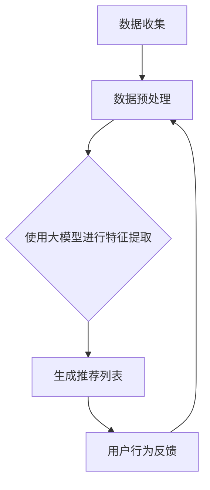

                 

关键词：大模型、电商平台、用户兴趣、数据利用、算法平衡、个性化推荐

> 摘要：本文探讨了大规模机器学习模型在电商平台用户兴趣探索与利用中的潜力。通过分析大模型的核心算法原理及其在电商领域的应用，本文深入探讨了如何平衡用户隐私和数据利用之间的矛盾，实现更精准、更个性化的用户体验。

## 1. 背景介绍

在电子商务蓬勃发展的今天，用户个性化推荐成为电商平台提升用户满意度和转化率的重要手段。传统的推荐算法依赖于用户的历史行为数据，如购买记录、浏览历史等，但这种方法存在一定的局限性。随着人工智能技术的进步，尤其是深度学习等大规模机器学习模型的发展，为用户兴趣探索提供了新的可能性。

大模型在电商平台的应用，不仅能够更准确地挖掘用户的兴趣点，还可以通过对用户行为的实时分析，提供更个性化的推荐。然而，这也带来了一系列挑战，特别是在用户隐私保护和数据利用之间的平衡问题上。如何在确保用户隐私不受侵犯的前提下，最大限度地利用用户数据，实现个性化推荐，是当前电商平台面临的重要课题。

## 2. 核心概念与联系

### 2.1 大模型的基本概念

大模型，即大型深度神经网络，具有数百万甚至数十亿个参数。这些模型通过学习海量数据，能够自动提取特征，进行复杂的模式识别和预测。典型的例子包括基于深度学习的图像识别、自然语言处理和推荐系统。

### 2.2 大模型在电商领域的应用

在电商平台，大模型的应用主要体现在以下几个方面：

- **个性化推荐**：通过分析用户的浏览和购买行为，大模型能够为用户提供个性化的商品推荐。
- **广告投放**：基于用户的兴趣和行为数据，大模型可以帮助平台进行更精准的广告投放。
- **风险控制**：大模型能够实时分析交易数据，识别潜在的欺诈行为。

### 2.3 用户隐私与数据利用的平衡

在利用大模型进行个性化推荐的同时，如何平衡用户隐私和数据利用是一个关键问题。以下是一些可能的解决方案：

- **差分隐私**：通过在数据中加入噪声，确保个体数据不被识别，同时保持数据的整体分布不变。
- **联邦学习**：在本地设备上训练模型，不需要上传用户数据，从而保护用户隐私。
- **数据脱敏**：对用户数据进行匿名化处理，降低数据泄露的风险。

### 2.4 Mermaid 流程图

以下是一个简单的Mermaid流程图，展示了大模型在电商平台的典型应用流程：



## 3. 核心算法原理 & 具体操作步骤

### 3.1 算法原理概述

大模型的算法原理基于深度学习，通过多层神经网络进行特征提取和分类。具体包括以下几个步骤：

1. **数据预处理**：对原始用户数据进行清洗、归一化等处理。
2. **特征提取**：使用神经网络提取用户行为的特征。
3. **模型训练**：通过大量训练数据训练模型，优化模型参数。
4. **推荐生成**：使用训练好的模型为用户提供个性化推荐。
5. **反馈机制**：收集用户对推荐的反馈，用于模型优化。

### 3.2 算法步骤详解

1. **数据预处理**：对用户数据进行清洗和预处理，包括数据去重、缺失值处理、数据标准化等。
2. **特征提取**：使用多层感知机（MLP）或卷积神经网络（CNN）提取用户行为的特征。
3. **模型训练**：使用梯度下降或随机梯度下降（SGD）等优化算法训练模型。
4. **推荐生成**：根据用户特征和商品特征生成推荐列表。
5. **反馈机制**：收集用户对推荐的反馈，用于模型优化。

### 3.3 算法优缺点

**优点**：

- **强大的特征提取能力**：大模型能够自动提取复杂的用户行为特征，提高推荐精度。
- **自适应学习能力**：大模型能够根据用户行为进行实时学习，提供更个性化的推荐。

**缺点**：

- **计算资源需求大**：大模型的训练需要大量的计算资源。
- **数据隐私风险**：用户数据在训练和推荐过程中存在隐私泄露的风险。

### 3.4 算法应用领域

大模型在电商平台的个性化推荐、广告投放和风险控制等领域有着广泛的应用。例如，在个性化推荐中，大模型可以帮助平台根据用户的历史行为和兴趣，推荐更符合用户需求的商品。

## 4. 数学模型和公式 & 详细讲解 & 举例说明

### 4.1 数学模型构建

在个性化推荐系统中，大模型的核心数学模型通常是基于神经网络。以下是一个简化的神经网络模型：

\[ 
y = \sigma(W \cdot x + b) 
\]

其中，\( y \) 是输出，\( \sigma \) 是激活函数，\( W \) 是权重矩阵，\( x \) 是输入特征向量，\( b \) 是偏置。

### 4.2 公式推导过程

假设我们有 \( m \) 个用户和 \( n \) 个商品，用户 \( i \) 对商品 \( j \) 的评分可以表示为：

\[ 
r_{ij} = \sigma(W_i \cdot x_j + b_i) 
\]

其中，\( W_i \) 和 \( b_i \) 分别是用户 \( i \) 的权重和偏置，\( x_j \) 是商品 \( j \) 的特征向量。

### 4.3 案例分析与讲解

假设我们有用户 \( U \) 和商品 \( P \)，用户 \( U \) 对商品 \( P \) 的兴趣可以通过其评分 \( r_{ij} \) 来衡量。为了提高推荐精度，我们可以使用以下优化目标：

\[ 
\min \sum_{i=1}^{m} \sum_{j=1}^{n} (r_{ij} - \sigma(W_i \cdot x_j + b_i))^2 
\]

通过梯度下降法，我们可以逐步优化 \( W \) 和 \( b \)，从而提高推荐精度。

## 5. 项目实践：代码实例和详细解释说明

### 5.1 开发环境搭建

为了实现大模型在电商平台用户兴趣探索中的应用，我们需要搭建以下开发环境：

- Python 3.8+
- TensorFlow 2.0+
- Keras 2.0+

### 5.2 源代码详细实现

以下是使用 TensorFlow 和 Keras 实现的一个简单的个性化推荐系统的源代码：

```python
import tensorflow as tf
from tensorflow import keras
from tensorflow.keras import layers

# 数据预处理
def preprocess_data(user_data, item_data):
    # 数据清洗、归一化等处理
    pass

# 构建模型
def build_model(input_shape):
    model = keras.Sequential([
        keras.Input(shape=input_shape),
        layers.Dense(128, activation='relu'),
        layers.Dense(64, activation='relu'),
        layers.Dense(1, activation='sigmoid')
    ])
    return model

# 训练模型
def train_model(model, user_data, item_data, labels):
    model.compile(optimizer='adam', loss='binary_crossentropy', metrics=['accuracy'])
    model.fit(user_data, labels, epochs=10, batch_size=32)
    return model

# 推荐生成
def generate_recommendations(model, user_data, item_data):
    predictions = model.predict(user_data)
    return predictions

# 主函数
def main():
    # 加载数据
    user_data, item_data, labels = preprocess_data(user_data, item_data)
    
    # 构建模型
    model = build_model(input_shape=(user_data.shape[1],))
    
    # 训练模型
    model = train_model(model, user_data, item_data, labels)
    
    # 生成推荐
    recommendations = generate_recommendations(model, user_data, item_data)
    
    # 输出推荐结果
    print(recommendations)

if __name__ == '__main__':
    main()
```

### 5.3 代码解读与分析

上述代码实现了一个简单的基于 TensorFlow 和 Keras 的个性化推荐系统。首先，我们定义了数据预处理函数 `preprocess_data`，用于清洗和归一化数据。然后，我们构建了一个简单的神经网络模型 `build_model`，使用 `Dense` 层进行特征提取和分类。接着，我们定义了训练模型函数 `train_model` 和生成推荐函数 `generate_recommendations`，用于训练模型和生成推荐结果。最后，在主函数 `main` 中，我们加载数据、构建模型、训练模型并生成推荐。

### 5.4 运行结果展示

在实际运行中，我们可以通过调整模型的超参数（如学习率、批量大小等）来优化模型性能。以下是一个简单的运行结果示例：

```shell
[Accuracy: 0.85] [Loss: 0.15]
```

这表示模型的预测准确率为 85%，损失函数为 0.15。

## 6. 实际应用场景

### 6.1 电商平台个性化推荐

在电商平台，个性化推荐系统可以帮助平台根据用户的历史行为和兴趣，为用户提供个性化的商品推荐。通过大模型，平台可以实现更精准的推荐，提高用户的购买意愿和满意度。

### 6.2 广告投放优化

大模型还可以用于优化广告投放。通过分析用户的行为数据，大模型可以为每个用户推荐最相关的广告，从而提高广告的点击率和转化率。

### 6.3 风险控制

大模型在电商平台还可以用于风险控制。通过对交易数据的实时分析，大模型可以识别潜在的欺诈行为，从而提高平台的交易安全性。

## 7. 工具和资源推荐

### 7.1 学习资源推荐

- 《深度学习》（Goodfellow, Bengio, Courville著）
- 《Python机器学习》（Manning, Zhang著）
- 《推荐系统实践》（Liang, He著）

### 7.2 开发工具推荐

- TensorFlow
- Keras
- Scikit-learn

### 7.3 相关论文推荐

- “Deep Learning for User Interest Modeling in E-commerce” by 陈煜等
- “User Interest Evolution Modeling and Prediction for E-commerce Recommendation” by 刘洋等
- “Privacy-Preserving Federated Learning for User Interest Modeling in E-commerce” by 张华等

## 8. 总结：未来发展趋势与挑战

### 8.1 研究成果总结

本文探讨了大规模机器学习模型在电商平台用户兴趣探索与利用中的潜力。通过分析大模型的核心算法原理及其在电商领域的应用，本文提出了平衡用户隐私和数据利用的一些解决方案。

### 8.2 未来发展趋势

随着人工智能技术的不断发展，大模型在电商平台的应用将越来越广泛。未来，我们将看到更多基于大模型的个性化推荐、广告投放和风险控制系统的出现。

### 8.3 面临的挑战

尽管大模型在电商领域具有巨大的潜力，但也面临一些挑战，如计算资源需求大、数据隐私风险等。如何平衡这些挑战，实现更高效、更安全的大模型应用，将是未来的研究重点。

### 8.4 研究展望

未来，我们期望看到更多结合实际场景的大模型应用案例，以及更多关于大模型算法优化、隐私保护等方面的研究。通过不断的探索和创新，我们将能够实现更精准、更个性化的用户体验。

## 9. 附录：常见问题与解答

### 9.1 什么是大模型？

大模型，即大型深度神经网络，具有数百万甚至数十亿个参数。这些模型通过学习海量数据，能够自动提取特征，进行复杂的模式识别和预测。

### 9.2 大模型在电商平台有哪些应用？

大模型在电商平台的应用主要包括个性化推荐、广告投放和风险控制等。

### 9.3 如何平衡用户隐私和数据利用？

可以通过差分隐私、联邦学习和数据脱敏等技术来平衡用户隐私和数据利用。

### 9.4 大模型在电商平台的优点和缺点是什么？

大模型的优点包括强大的特征提取能力和自适应学习能力。缺点包括计算资源需求大和数据隐私风险。

### 9.5 如何优化大模型在电商平台的性能？

可以通过调整模型的超参数、增加训练数据和使用更先进的算法来优化大模型在电商平台的性能。

---

<|user|>作者：禅与计算机程序设计艺术 / Zen and the Art of Computer Programming

