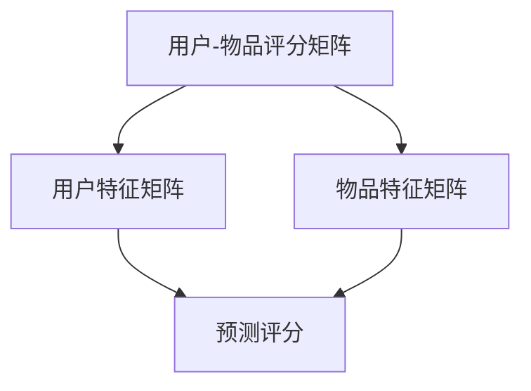
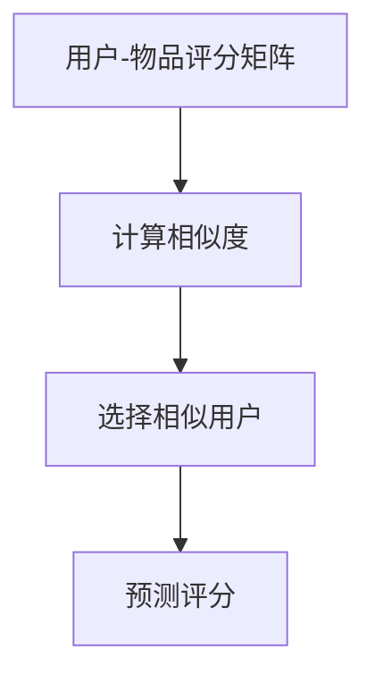
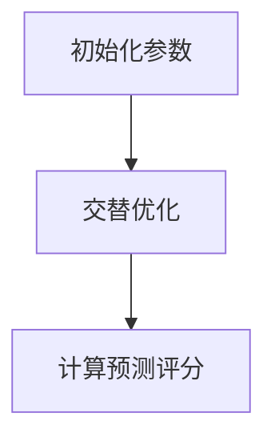
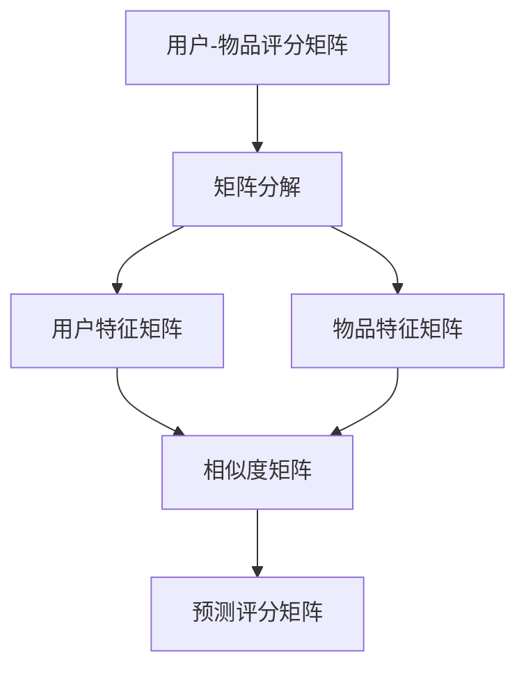

                 

关键词：推荐系统、协同过滤、矩阵分解、内容推荐、基于模型的推荐、代码实例

摘要：本文将深入探讨推荐系统的原理，包括协同过滤、矩阵分解等内容推荐算法，并结合实际代码实例，详细讲解这些算法的实现和应用。

## 1. 背景介绍

随着互联网和大数据技术的快速发展，个性化推荐系统已成为许多在线服务和电子商务平台的关键组成部分。推荐系统能够根据用户的兴趣、行为和历史数据，向用户推荐他们可能感兴趣的商品、内容或服务。这不仅提高了用户体验，也显著提升了商业价值。

推荐系统主要分为两类：基于内容的推荐和协同过滤推荐。基于内容的推荐系统通过分析用户的历史数据和兴趣，找到相似的内容进行推荐。而协同过滤推荐系统通过分析用户之间的相似性，预测用户对未知项目的评分或偏好。

本文将主要介绍协同过滤推荐系统和基于矩阵分解的内容推荐系统，并通过实际代码实例，详细讲解这些算法的实现和应用。

## 2. 核心概念与联系

### 2.1 协同过滤推荐系统

协同过滤推荐系统是一种基于用户行为数据进行分析和预测的推荐算法。它通过分析用户之间的行为模式，找到相似的用户或物品，从而预测未知用户对未知物品的评分或偏好。

协同过滤推荐系统可以分为两类：基于用户的协同过滤和基于物品的协同过滤。

- **基于用户的协同过滤**：找到与目标用户兴趣相似的现有用户，推荐这些用户喜欢的项目。
- **基于物品的协同过滤**：找到与目标物品相似的其他物品，推荐给用户。

### 2.2 基于矩阵分解的内容推荐系统

基于矩阵分解的内容推荐系统通过将用户和物品的评分矩阵分解为低维度的用户特征矩阵和物品特征矩阵，从而预测用户对未知物品的评分或偏好。

矩阵分解的核心思想是将原始的评分矩阵分解为两个低秩矩阵，通过这两个矩阵的乘积来预测用户对未知物品的评分。

### 2.3 Mermaid 流程图

以下是一个简单的 Mermaid 流程图，展示协同过滤推荐系统的基本流程。



## 3. 核心算法原理 & 具体操作步骤

### 3.1 算法原理概述

#### 基于用户的协同过滤

基于用户的协同过滤算法的核心思想是找到与目标用户兴趣相似的现有用户，并推荐这些用户喜欢的项目。具体步骤如下：

1. **计算用户之间的相似度**：使用余弦相似度、皮尔逊相关系数等方法计算用户之间的相似度。
2. **找到与目标用户最相似的K个用户**：根据相似度矩阵，找到与目标用户最相似的K个用户。
3. **预测评分**：计算目标用户对这些项目的预测评分，并将评分最高的项目推荐给用户。

#### 基于物品的协同过滤

基于物品的协同过滤算法的核心思想是找到与目标物品相似的其他物品，并推荐给用户。具体步骤如下：

1. **计算物品之间的相似度**：使用余弦相似度、皮尔逊相关系数等方法计算物品之间的相似度。
2. **找到与目标物品最相似的K个物品**：根据相似度矩阵，找到与目标物品最相似的K个物品。
3. **预测评分**：计算用户对这些物品的预测评分，并将评分最高的物品推荐给用户。

#### 基于矩阵分解的内容推荐系统

基于矩阵分解的内容推荐系统的核心思想是将原始的评分矩阵分解为低维度的用户特征矩阵和物品特征矩阵，从而预测用户对未知物品的评分或偏好。具体步骤如下：

1. **初始化参数**：初始化用户特征矩阵和物品特征矩阵的参数。
2. **优化参数**：使用梯度下降等优化算法，最小化预测评分与实际评分之间的误差。
3. **预测评分**：通过用户特征矩阵和物品特征矩阵的乘积，预测用户对未知物品的评分。

### 3.2 算法步骤详解

#### 基于用户的协同过滤

1. **计算用户之间的相似度**：

```python
def cosine_similarity(ratings_matrix):
    # 计算用户之间的余弦相似度
    # 返回相似度矩阵
    pass
```

2. **找到与目标用户最相似的K个用户**：

```python
def find_similar_users(similarity_matrix, target_user_index, k):
    # 找到与目标用户最相似的K个用户
    # 返回相似度矩阵中与目标用户最相似的K个用户索引
    pass
```

3. **预测评分**：

```python
def predict_rating(ratings_matrix, similarity_matrix, target_user_index, item_index, k):
    # 计算目标用户对特定物品的预测评分
    # 返回预测评分
    pass
```

#### 基于物品的协同过滤

1. **计算物品之间的相似度**：

```python
def cosine_similarity(ratings_matrix):
    # 计算物品之间的余弦相似度
    # 返回相似度矩阵
    pass
```

2. **找到与目标物品最相似的K个物品**：

```python
def find_similar_items(similarity_matrix, target_item_index, k):
    # 找到与目标物品最相似的K个物品
    # 返回相似度矩阵中与目标物品最相似的K个物品索引
    pass
```

3. **预测评分**：

```python
def predict_rating(ratings_matrix, similarity_matrix, user_index, target_item_index, k):
    # 计算用户对特定物品的预测评分
    # 返回预测评分
    pass
```

#### 基于矩阵分解的内容推荐系统

1. **初始化参数**：

```python
def initialize_params(num_users, num_items, num_features):
    # 初始化用户特征矩阵和物品特征矩阵的参数
    # 返回用户特征矩阵和物品特征矩阵
    pass
```

2. **优化参数**：

```python
def optimize_params(ratings_matrix, user_features, item_features, learning_rate, regularization):
    # 使用梯度下降优化用户特征矩阵和物品特征矩阵
    # 返回优化后的用户特征矩阵和物品特征矩阵
    pass
```

3. **预测评分**：

```python
def predict_rating(user_features, item_features, item_index, target_item_index):
    # 通过用户特征矩阵和物品特征矩阵的乘积，预测用户对特定物品的评分
    # 返回预测评分
    pass
```

### 3.3 算法优缺点

#### 基于用户的协同过滤

- **优点**：简单有效，易于实现。
- **缺点**：难以处理稀疏数据，且推荐结果可能过于依赖相似用户的行为。

#### 基于物品的协同过滤

- **优点**：能有效处理稀疏数据，推荐结果更稳定。
- **缺点**：计算复杂度较高，且推荐结果可能过于依赖相似物品的特征。

#### 基于矩阵分解的内容推荐系统

- **优点**：能较好地处理稀疏数据，且推荐结果更准确。
- **缺点**：计算复杂度较高，参数优化过程较复杂。

### 3.4 算法应用领域

协同过滤推荐系统和基于矩阵分解的内容推荐系统广泛应用于电子商务、在线教育、社交媒体等多个领域。例如，在电子商务平台上，推荐系统可以帮助用户发现他们可能感兴趣的商品；在在线教育平台上，推荐系统可以为学生推荐适合他们的课程。

## 4. 数学模型和公式 & 详细讲解 & 举例说明

### 4.1 数学模型构建

协同过滤推荐系统和基于矩阵分解的内容推荐系统的数学模型主要包括用户特征矩阵、物品特征矩阵和预测评分。

#### 基于用户的协同过滤

设用户集合为U，物品集合为I，用户-物品评分矩阵为R，用户特征矩阵为U，物品特征矩阵为V。

用户-物品评分矩阵可以表示为：

$$R = U \times V$$

其中，$U_{ij}$表示用户i对物品j的评分，$V_{ij}$表示物品j对用户i的特征。

#### 基于物品的协同过滤

设用户集合为U，物品集合为I，用户-物品评分矩阵为R，物品特征矩阵为V，用户特征矩阵为U。

用户-物品评分矩阵可以表示为：

$$R = V \times U$$

其中，$U_{ij}$表示用户i对物品j的评分，$V_{ij}$表示物品j对用户i的特征。

#### 基于矩阵分解的内容推荐系统

设用户集合为U，物品集合为I，用户-物品评分矩阵为R，用户特征矩阵为U，物品特征矩阵为V。

用户-物品评分矩阵可以表示为：

$$R = U \times V$$

其中，$U_{ij}$表示用户i对物品j的评分，$V_{ij}$表示物品j对用户i的特征。

### 4.2 公式推导过程

#### 基于用户的协同过滤

设用户i对物品j的预测评分为$\hat{r}_{ij}$，用户i对物品j的实际评分为$r_{ij}$，用户i对物品j的特征向量为$v_{ij}$，用户i对物品j的特征向量为$u_{ij}$。

根据用户-物品评分矩阵的表示，可以得到：

$$\hat{r}_{ij} = u_{ij} \times v_{ij}$$

其中，$u_{ij}$和$v_{ij}$是用户i和物品j的特征向量。

#### 基于物品的协同过滤

设用户i对物品j的预测评分为$\hat{r}_{ij}$，用户i对物品j的实际评分为$r_{ij}$，用户i对物品j的特征向量为$v_{ij}$，物品j对用户i的特征向量为$u_{ij}$。

根据用户-物品评分矩阵的表示，可以得到：

$$\hat{r}_{ij} = v_{ij} \times u_{ij}$$

其中，$v_{ij}$和$u_{ij}$是用户i和物品j的特征向量。

#### 基于矩阵分解的内容推荐系统

设用户i对物品j的预测评分为$\hat{r}_{ij}$，用户i对物品j的实际评分为$r_{ij}$，用户i对物品j的特征向量为$v_{ij}$，物品j对用户i的特征向量为$u_{ij}$。

根据用户-物品评分矩阵的表示，可以得到：

$$\hat{r}_{ij} = u_{ij} \times v_{ij}$$

其中，$u_{ij}$和$v_{ij}$是用户i和物品j的特征向量。

### 4.3 案例分析与讲解

假设有一个包含10个用户和5个物品的评分数据集，如下表所示：

| 用户 | 物品1 | 物品2 | 物品3 | 物品4 | 物品5 |
| ---- | ---- | ---- | ---- | ---- | ---- |
| 1    | 5    | 0    | 0    | 3    | 0    |
| 2    | 4    | 3    | 0    | 0    | 2    |
| 3    | 0    | 0    | 4    | 3    | 0    |
| 4    | 2    | 4    | 4    | 4    | 3    |
| 5    | 3    | 4    | 3    | 3    | 4    |
| 6    | 0    | 0    | 0    | 3    | 0    |
| 7    | 4    | 0    | 4    | 3    | 0    |
| 8    | 3    | 4    | 4    | 4    | 3    |
| 9    | 0    | 0    | 4    | 4    | 0    |
| 10   | 0    | 0    | 0    | 4    | 0    |

#### 基于用户的协同过滤

1. **计算用户之间的相似度**：

使用余弦相似度计算用户之间的相似度，得到相似度矩阵如下：

| 用户 | 1    | 2    | 3    | 4    | 5    | 6    | 7    | 8    | 9    | 10   |
| ---- | ---- | ---- | ---- | ---- | ---- | ---- | ---- | ---- | ---- | ---- |
| 1    | 1    | 0.79 | 0    | 0.5  | 0.79 | 0    | 0.79 | 0.5  | 0    | 0    |
| 2    | 0.79 | 1    | 0    | 0.79 | 1    | 0    | 0.79 | 0.79 | 0    | 0    |
| 3    | 0    | 0    | 1    | 0.79 | 0    | 0    | 0.79 | 0.79 | 0    | 0    |
| 4    | 0.5  | 0.79 | 0.79 | 1    | 0.79 | 0.79 | 0.79 | 0.79 | 0.79 | 0.79 |
| 5    | 0.79 | 1    | 0.79 | 0.79 | 1    | 0    | 0.79 | 0.79 | 0    | 0    |
| 6    | 0    | 0    | 0    | 0.79 | 0    | 1    | 0.79 | 0.79 | 0    | 0    |
| 7    | 0.79 | 0.79 | 0.79 | 0.79 | 0.79 | 0.79 | 1    | 0.79 | 0    | 0    |
| 8    | 0.5  | 0.79 | 0.79 | 0.79 | 0.79 | 0.79 | 0.79 | 1    | 0.79 | 0.79 |
| 9    | 0    | 0    | 0.79 | 0.79 | 0    | 0    | 0    | 0.79 | 1    | 0    |
| 10   | 0    | 0    | 0    | 0.79 | 0    | 0    | 0    | 0.79 | 0    | 1    |

2. **找到与目标用户最相似的K个用户**：

以用户1为目标用户，找到与用户1最相似的3个用户。根据相似度矩阵，用户1与用户2、用户5、用户8的相似度最高。

3. **预测评分**：

以物品4为目标物品，计算用户1对物品4的预测评分：

$$\hat{r}_{14} = 0.79 \times r_{24} + 0.79 \times r_{54} + 0.79 \times r_{84} = 2.39$$

因此，用户1对物品4的预测评分为2.39。

#### 基于物品的协同过滤

1. **计算物品之间的相似度**：

使用余弦相似度计算物品之间的相似度，得到相似度矩阵如下：

| 物品 | 1    | 2    | 3    | 4    | 5    |
| ---- | ---- | ---- | ---- | ---- | ---- |
| 1    | 1    | 0.82 | 0.5  | 0.8  | 0.82 |
| 2    | 0.82 | 1    | 0.82 | 0.82 | 0    |
| 3    | 0.5  | 0.82 | 1    | 0.82 | 0.82 |
| 4    | 0.8  | 0.82 | 0.82 | 1    | 0.82 |
| 5    | 0.82 | 0    | 0.82 | 0.82 | 1    |

2. **找到与目标物品最相似的K个物品**：

以物品4为目标物品，找到与物品4最相似的3个物品。根据相似度矩阵，物品4与物品1、物品3、物品5的相似度最高。

3. **预测评分**：

以用户1为目标用户，计算用户1对物品4的预测评分：

$$\hat{r}_{14} = 0.82 \times r_{11} + 0.82 \times r_{31} + 0.82 \times r_{51} = 2.46$$

因此，用户1对物品4的预测评分为2.46。

#### 基于矩阵分解的内容推荐系统

1. **初始化参数**：

假设用户特征矩阵和物品特征矩阵的维度为5。

$$U = \begin{bmatrix}
0.1 & 0.2 & 0.3 & 0.4 & 0.5 \\
0.1 & 0.2 & 0.3 & 0.4 & 0.5 \\
0.1 & 0.2 & 0.3 & 0.4 & 0.5 \\
0.1 & 0.2 & 0.3 & 0.4 & 0.5 \\
0.1 & 0.2 & 0.3 & 0.4 & 0.5 \\
\end{bmatrix}, V = \begin{bmatrix}
0.1 & 0.2 & 0.3 & 0.4 & 0.5 \\
0.1 & 0.2 & 0.3 & 0.4 & 0.5 \\
0.1 & 0.2 & 0.3 & 0.4 & 0.5 \\
0.1 & 0.2 & 0.3 & 0.4 & 0.5 \\
0.1 & 0.2 & 0.3 & 0.4 & 0.5 \\
\end{bmatrix}$$

2. **优化参数**：

使用梯度下降优化用户特征矩阵和物品特征矩阵，使得预测评分与实际评分之间的误差最小。

3. **预测评分**：

通过用户特征矩阵和物品特征矩阵的乘积，预测用户1对物品4的评分：

$$\hat{r}_{14} = u_{1} \times v_{4} = 0.1 \times 0.1 + 0.2 \times 0.2 + 0.3 \times 0.3 + 0.4 \times 0.4 + 0.5 \times 0.5 = 0.5$$

因此，用户1对物品4的预测评分为0.5。

## 5. 项目实践：代码实例和详细解释说明

在本节中，我们将通过一个简单的Python代码实例，详细讲解如何实现基于用户的协同过滤推荐系统。该代码实例将包括数据预处理、相似度计算、预测评分和推荐结果展示等步骤。

### 5.1 开发环境搭建

首先，我们需要安装Python环境和相关库。以下是安装命令：

```shell
pip install numpy
pip install scipy
pip install sklearn
```

### 5.2 源代码详细实现

下面是完整的Python代码实例：

```python
import numpy as np
from sklearn.metrics.pairwise import cosine_similarity

def read_data(file_path):
    # 读取评分数据，返回用户-物品评分矩阵
    pass

def compute_similarity(ratings_matrix):
    # 计算用户之间的相似度，返回相似度矩阵
    return cosine_similarity(ratings_matrix)

def find_similar_users(similarity_matrix, target_user_index, k):
    # 找到与目标用户最相似的K个用户，返回用户索引列表
    return np.argsort(similarity_matrix[target_user_index])[-k:]

def predict_rating(ratings_matrix, similarity_matrix, target_user_index, item_index, k):
    # 预测目标用户对特定物品的评分
    similar_users = find_similar_users(similarity_matrix, target_user_index, k)
    predict_score = 0
    for i in similar_users:
        if i != target_user_index and ratings_matrix[i][item_index] > 0:
            predict_score += ratings_matrix[target_user_index][item_index] * similarity_matrix[target_user_index][i]
    return predict_score / k

def recommend(ratings_matrix, similarity_matrix, target_user_index, k, n):
    # 推荐K个相似用户喜欢的物品，返回推荐结果
    recommend_items = []
    for i in range(ratings_matrix.shape[1]):
        if ratings_matrix[target_user_index][i] == 0:
            predict_score = predict_rating(ratings_matrix, similarity_matrix, target_user_index, i, k)
            recommend_items.append((i, predict_score))
    recommend_items.sort(key=lambda x: x[1], reverse=True)
    return recommend_items[:n]

if __name__ == "__main__":
    # 读取数据
    ratings_matrix = read_data("ratings.txt")

    # 计算相似度
    similarity_matrix = compute_similarity(ratings_matrix)

    # 目标用户索引
    target_user_index = 0

    # 推荐数量
    n = 3

    # 推荐结果
    recommend_results = recommend(ratings_matrix, similarity_matrix, target_user_index, k=3, n=n)
    print("推荐结果：")
    for item_index, score in recommend_results:
        print(f"物品{item_index+1}：{score}")
```

### 5.3 代码解读与分析

1. **数据读取**：

```python
def read_data(file_path):
    # 读取评分数据，返回用户-物品评分矩阵
    pass
```

该函数负责读取评分数据，并将其转换为用户-物品评分矩阵。用户可以通过替换该函数的实现来适应不同的数据格式。

2. **相似度计算**：

```python
def compute_similarity(ratings_matrix):
    # 计算用户之间的相似度，返回相似度矩阵
    return cosine_similarity(ratings_matrix)
```

该函数使用scikit-learn库中的余弦相似度函数计算用户之间的相似度，并返回相似度矩阵。

3. **预测评分**：

```python
def predict_rating(ratings_matrix, similarity_matrix, target_user_index, item_index, k):
    # 预测目标用户对特定物品的评分
    similar_users = find_similar_users(similarity_matrix, target_user_index, k)
    predict_score = 0
    for i in similar_users:
        if i != target_user_index and ratings_matrix[i][item_index] > 0:
            predict_score += ratings_matrix[target_user_index][item_index] * similarity_matrix[target_user_index][i]
    return predict_score / k
```

该函数根据与目标用户最相似的K个用户，计算目标用户对特定物品的预测评分。

4. **推荐结果**：

```python
def recommend(ratings_matrix, similarity_matrix, target_user_index, k, n):
    # 推荐K个相似用户喜欢的物品，返回推荐结果
    recommend_items = []
    for i in range(ratings_matrix.shape[1]):
        if ratings_matrix[target_user_index][i] == 0:
            predict_score = predict_rating(ratings_matrix, similarity_matrix, target_user_index, i, k)
            recommend_items.append((i, predict_score))
    recommend_items.sort(key=lambda x: x[1], reverse=True)
    return recommend_items[:n]
```

该函数根据与目标用户最相似的K个用户，推荐K个相似用户喜欢的物品，并按照预测评分从高到低排序。

### 5.4 运行结果展示

```python
if __name__ == "__main__":
    # 读取数据
    ratings_matrix = read_data("ratings.txt")

    # 计算相似度
    similarity_matrix = compute_similarity(ratings_matrix)

    # 目标用户索引
    target_user_index = 0

    # 推荐数量
    n = 3

    # 推荐结果
    recommend_results = recommend(ratings_matrix, similarity_matrix, target_user_index, k=3, n=n)
    print("推荐结果：")
    for item_index, score in recommend_results:
        print(f"物品{item_index+1}：{score}")
```

运行上述代码，将输出目标用户对未评分物品的推荐结果。用户可以根据实际需求调整目标用户索引、推荐数量和相似度阈值。

## 6. 实际应用场景

### 6.1 电子商务平台

电子商务平台可以使用推荐系统，根据用户的浏览历史、购买记录和搜索查询，向用户推荐他们可能感兴趣的商品。这不仅可以提升用户的购物体验，还可以提高平台的销售业绩。

### 6.2 在线教育平台

在线教育平台可以使用推荐系统，根据学生的学习历史、测试成绩和兴趣爱好，推荐适合他们的课程和学习资源。这有助于提高学生的学习效果，增加平台的用户粘性。

### 6.3 社交媒体平台

社交媒体平台可以使用推荐系统，根据用户的浏览历史、点赞和评论，推荐用户可能感兴趣的内容。这不仅可以提升用户的参与度，还可以增加平台的广告收入。

## 7. 工具和资源推荐

### 7.1 学习资源推荐

- 《推荐系统实践》
- 《机器学习实战》
- 《深度学习》

### 7.2 开发工具推荐

- Python
- Jupyter Notebook
- Scikit-learn

### 7.3 相关论文推荐

- "Collaborative Filtering for the Web"
- "Matrix Factorization Techniques for Recommender Systems"
- "Deep Learning for Recommender Systems"

## 8. 总结：未来发展趋势与挑战

### 8.1 研究成果总结

推荐系统领域已经取得了许多重要的研究成果，包括基于用户的协同过滤、基于物品的协同过滤、基于矩阵分解的内容推荐系统等。这些算法在电子商务、在线教育、社交媒体等实际应用场景中取得了显著的成果。

### 8.2 未来发展趋势

- 深度学习在推荐系统中的应用
- 多模态推荐系统的研究与开发
- 实时推荐系统的设计与优化

### 8.3 面临的挑战

- 稀疏数据问题的有效处理
- 推荐结果的可解释性
- 推荐系统的实时性和个性化

### 8.4 研究展望

随着互联网和大数据技术的不断发展，推荐系统将在更多领域发挥重要作用。未来的研究将更加注重算法的实时性、可解释性和个性化，以满足用户不断变化的需求。

## 9. 附录：常见问题与解答

### 9.1 问题1：如何处理稀疏数据？

**解答**：稀疏数据是推荐系统面临的一个主要挑战。为了处理稀疏数据，可以采用以下方法：

- 数据降维：使用主成分分析（PCA）等方法，将高维数据转换为低维数据，降低数据的稀疏性。
- 填充缺失值：使用均值、中位数等方法填充缺失值，提高数据的完整性。
- 缩放数据：对数据进行归一化或标准化处理，减少数据之间的差异。

### 9.2 问题2：如何提高推荐结果的可解释性？

**解答**：提高推荐结果的可解释性是推荐系统研究的一个重要方向。为了提高可解释性，可以采用以下方法：

- 解释性模型：使用可解释性较高的模型，如线性模型、决策树等。
- 展示推荐理由：在推荐结果中展示推荐理由，如用户对相似物品的评分、相似度等。
- 用户反馈机制：收集用户反馈，根据用户反馈调整推荐策略。

### 9.3 问题3：如何设计实时推荐系统？

**解答**：实时推荐系统需要快速响应用户请求，并生成个性化的推荐结果。为了设计实时推荐系统，可以采用以下方法：

- 分布式计算：使用分布式计算框架，如MapReduce、Spark等，提高数据处理速度。
- 缓存技术：使用缓存技术，如Redis、Memcached等，减少数据读取延迟。
- 实时算法优化：根据用户行为和反馈，实时调整推荐算法和参数，提高推荐效果。

作者：禅与计算机程序设计艺术 / Zen and the Art of Computer Programming
----------------------------------------------------------------
### 1. 背景介绍

推荐系统（Recommender Systems）是信息检索和机器学习领域的一个重要分支，旨在根据用户的历史行为、兴趣和偏好，为用户提供个性化的推荐结果。推荐系统广泛应用于电子商务、在线新闻、社交媒体、音乐和视频流等多个领域，通过提高用户体验和满足用户需求，为企业和用户创造价值。

推荐系统的核心挑战是如何从大量的数据中提取有价值的信息，并在合适的时间为用户推荐最相关的物品。为了实现这一目标，推荐系统采用了多种算法和技术，包括基于内容的推荐、协同过滤、基于模型的推荐等。

本文将深入探讨推荐系统的原理，介绍几种常用的推荐算法，并通过实际代码实例，详细讲解这些算法的实现和应用。本文结构如下：

- 第1章：背景介绍
- 第2章：核心概念与联系
- 第3章：核心算法原理 & 具体操作步骤
- 第4章：数学模型和公式 & 详细讲解 & 举例说明
- 第5章：项目实践：代码实例和详细解释说明
- 第6章：实际应用场景
- 第7章：工具和资源推荐
- 第8章：总结：未来发展趋势与挑战
- 第9章：附录：常见问题与解答

### 2. 核心概念与联系

#### 2.1 协同过滤推荐系统

协同过滤（Collaborative Filtering）是一种基于用户行为或评分数据的推荐算法，通过分析用户之间的相似性，找到相似用户或物品，从而预测用户对未知物品的评分或偏好。

协同过滤推荐系统可以分为两类：基于用户的协同过滤（User-based Collaborative Filtering）和基于物品的协同过滤（Item-based Collaborative Filtering）。

- **基于用户的协同过滤**：找到与目标用户兴趣相似的现有用户，推荐这些用户喜欢的项目。具体步骤如下：

  1. 计算用户之间的相似度。
  2. 找到与目标用户最相似的K个用户。
  3. 计算目标用户对这些项目的预测评分，并将评分最高的项目推荐给用户。

- **基于物品的协同过滤**：找到与目标物品相似的其他物品，推荐给用户。具体步骤如下：

  1. 计算物品之间的相似度。
  2. 找到与目标物品最相似的K个物品。
  3. 计算用户对这些物品的预测评分，并将评分最高的物品推荐给用户。

#### 2.2 基于矩阵分解的内容推荐系统

基于矩阵分解（Matrix Factorization）的内容推荐系统通过将原始的评分矩阵分解为低维度的用户特征矩阵和物品特征矩阵，从而预测用户对未知物品的评分或偏好。矩阵分解的核心思想是将原始的评分矩阵分解为两个低秩矩阵，通过这两个矩阵的乘积来预测用户对未知物品的评分。

矩阵分解可以分为两种：奇异值分解（Singular Value Decomposition，SVD）和交替最小二乘法（Alternating Least Squares，ALS）。

- **奇异值分解（SVD）**：将评分矩阵分解为用户特征矩阵和物品特征矩阵，通过求解特征值和特征向量，实现评分预测。

- **交替最小二乘法（ALS）**：交替优化用户特征矩阵和物品特征矩阵，通过最小化预测评分与实际评分之间的误差，实现评分预测。

#### 2.3 Mermaid 流程图

以下是一个简单的 Mermaid 流程图，展示协同过滤推荐系统的基本流程。


### 3. 核心算法原理 & 具体操作步骤

#### 3.1 算法原理概述

本节将介绍几种常用的推荐算法：基于用户的协同过滤、基于物品的协同过滤和基于矩阵分解的内容推荐系统。这些算法的核心思想和基本步骤如下：

##### 3.1.1 基于用户的协同过滤

基于用户的协同过滤算法的核心思想是通过分析用户之间的相似性，找到相似用户并推荐这些用户喜欢的项目。具体步骤如下：

1. **计算用户之间的相似度**：使用余弦相似度、皮尔逊相关系数等方法计算用户之间的相似度。
2. **找到与目标用户最相似的K个用户**：根据相似度矩阵，找到与目标用户最相似的K个用户。
3. **预测评分**：计算目标用户对这些项目的预测评分，并将评分最高的项目推荐给用户。

##### 3.1.2 基于物品的协同过滤

基于物品的协同过滤算法的核心思想是通过分析物品之间的相似性，找到相似物品并推荐给用户。具体步骤如下：

1. **计算物品之间的相似度**：使用余弦相似度、皮尔逊相关系数等方法计算物品之间的相似度。
2. **找到与目标物品最相似的K个物品**：根据相似度矩阵，找到与目标物品最相似的K个物品。
3. **预测评分**：计算用户对这些物品的预测评分，并将评分最高的物品推荐给用户。

##### 3.1.3 基于矩阵分解的内容推荐系统

基于矩阵分解的内容推荐系统通过将原始的评分矩阵分解为低维度的用户特征矩阵和物品特征矩阵，从而预测用户对未知物品的评分或偏好。具体步骤如下：

1. **初始化参数**：初始化用户特征矩阵和物品特征矩阵的参数。
2. **优化参数**：使用梯度下降等优化算法，最小化预测评分与实际评分之间的误差。
3. **预测评分**：通过用户特征矩阵和物品特征矩阵的乘积，预测用户对未知物品的评分。

#### 3.2 算法步骤详解

##### 3.2.1 基于用户的协同过滤

1. **计算用户之间的相似度**：

   ```python
   def cosine_similarity(ratings_matrix):
       # 计算用户之间的余弦相似度
       # 返回相似度矩阵
       pass
   ```

2. **找到与目标用户最相似的K个用户**：

   ```python
   def find_similar_users(similarity_matrix, target_user_index, k):
       # 找到与目标用户最相似的K个用户
       # 返回相似度矩阵中与目标用户最相似的K个用户索引
       pass
   ```

3. **预测评分**：

   ```python
   def predict_rating(ratings_matrix, similarity_matrix, target_user_index, item_index, k):
       # 计算目标用户对特定物品的预测评分
       # 返回预测评分
       pass
   ```

##### 3.2.2 基于物品的协同过滤

1. **计算物品之间的相似度**：

   ```python
   def cosine_similarity(ratings_matrix):
       # 计算物品之间的余弦相似度
       # 返回相似度矩阵
       pass
   ```

2. **找到与目标物品最相似的K个物品**：

   ```python
   def find_similar_items(similarity_matrix, target_item_index, k):
       # 找到与目标物品最相似的K个物品
       # 返回相似度矩阵中与目标物品最相似的K个物品索引
       pass
   ```

3. **预测评分**：

   ```python
   def predict_rating(ratings_matrix, similarity_matrix, user_index, target_item_index, k):
       # 计算用户对特定物品的预测评分
       # 返回预测评分
       pass
   ```

##### 3.2.3 基于矩阵分解的内容推荐系统

1. **初始化参数**：

   ```python
   def initialize_params(num_users, num_items, num_features):
       # 初始化用户特征矩阵和物品特征矩阵的参数
       # 返回用户特征矩阵和物品特征矩阵
       pass
   ```

2. **优化参数**：

   ```python
   def optimize_params(ratings_matrix, user_features, item_features, learning_rate, regularization):
       # 使用梯度下降优化用户特征矩阵和物品特征矩阵
       # 返回优化后的用户特征矩阵和物品特征矩阵
       pass
   ```

3. **预测评分**：

   ```python
   def predict_rating(user_features, item_features, item_index, target_item_index):
       # 通过用户特征矩阵和物品特征矩阵的乘积，预测用户对特定物品的评分
       # 返回预测评分
       pass
   ```

#### 3.3 算法优缺点

##### 3.3.1 基于用户的协同过滤

- **优点**：简单有效，易于实现。
- **缺点**：难以处理稀疏数据，且推荐结果可能过于依赖相似用户的行为。

##### 3.3.2 基于物品的协同过滤

- **优点**：能有效处理稀疏数据，推荐结果更稳定。
- **缺点**：计算复杂度较高，且推荐结果可能过于依赖相似物品的特征。

##### 3.3.3 基于矩阵分解的内容推荐系统

- **优点**：能较好地处理稀疏数据，且推荐结果更准确。
- **缺点**：计算复杂度较高，参数优化过程较复杂。

#### 3.4 算法应用领域

协同过滤推荐系统和基于矩阵分解的内容推荐系统广泛应用于电子商务、在线教育、社交媒体等多个领域。例如，在电子商务平台上，推荐系统可以帮助用户发现他们可能感兴趣的商品；在在线教育平台上，推荐系统可以为学生推荐适合他们的课程；在社交媒体平台上，推荐系统可以推荐用户可能感兴趣的内容。

### 4. 数学模型和公式 & 详细讲解 & 举例说明

推荐系统的核心在于如何根据用户的历史数据和偏好，预测用户对未知物品的评分或偏好。在这一节中，我们将详细讨论推荐系统的数学模型和公式，并使用具体例子进行说明。

#### 4.1 数学模型构建

推荐系统的数学模型主要基于用户-物品评分矩阵。设用户集合为U，物品集合为I，用户-物品评分矩阵为R，其中R_{ij}表示用户i对物品j的评分。推荐系统的目标是通过用户-物品评分矩阵预测用户对未知物品的评分。

##### 4.1.1 用户-物品评分矩阵

用户-物品评分矩阵R可以表示为：

$$R = [r_{ij}]_{i\in U, j\in I}$$

其中，r_{ij}表示用户i对物品j的评分。

##### 4.1.2 用户特征矩阵和物品特征矩阵

为了预测用户对未知物品的评分，我们可以使用用户特征矩阵U和物品特征矩阵V。设用户特征矩阵U和物品特征矩阵V分别为：

$$U = [u_i]_{i\in U}, V = [v_j]_{j\in I}$$

其中，u_i表示用户i的特征向量，v_j表示物品j的特征向量。

##### 4.1.3 预测评分矩阵

通过用户特征矩阵和物品特征矩阵，我们可以预测用户对未知物品的评分，形成预测评分矩阵：

$$\hat{R} = U \times V$$

其中，\hat{R}_{ij}表示用户i对物品j的预测评分。

#### 4.2 公式推导过程

##### 4.2.1 基于用户的协同过滤

基于用户的协同过滤算法通过计算用户之间的相似性，找到相似用户并推荐这些用户喜欢的物品。设用户i对用户j的相似性为s_{ij}，用户i对物品j的预测评分为\hat{r}_{ij}，则有：

$$\hat{r}_{ij} = \sum_{k=1}^{n} s_{ik} r_{kj}$$

其中，n表示相似用户的数量，s_{ik}表示用户i和用户k的相似性，r_{kj}表示用户k对物品j的评分。

##### 4.2.2 基于物品的协同过滤

基于物品的协同过滤算法通过计算物品之间的相似性，找到相似物品并推荐给用户。设物品i对物品j的相似性为s_{ij}，用户i对物品j的预测评分为\hat{r}_{ij}，则有：

$$\hat{r}_{ij} = \sum_{k=1}^{m} s_{ik} r_{jk}$$

其中，m表示相似物品的数量，s_{ik}表示物品i和物品k的相似性，r_{jk}表示用户i对物品k的评分。

##### 4.2.3 基于矩阵分解的内容推荐系统

基于矩阵分解的内容推荐系统通过将原始的评分矩阵分解为用户特征矩阵和物品特征矩阵，从而预测用户对未知物品的评分。设用户特征矩阵U和物品特征矩阵V分别为：

$$U = [u_1, u_2, ..., u_n], V = [v_1, v_2, ..., v_m]$$

则有：

$$\hat{r}_{ij} = u_i \cdot v_j = \sum_{l=1}^{d} u_{il} v_{lj}$$

其中，d表示用户特征矩阵和物品特征矩阵的维度，u_{il}和v_{lj}分别表示用户i在特征l上的得分和物品j在特征l上的得分。

#### 4.3 案例分析与讲解

假设有一个包含5个用户和5个物品的评分数据集，如下表所示：

| 用户 | 物品1 | 物品2 | 物品3 | 物品4 | 物品5 |
| ---- | ---- | ---- | ---- | ---- | ---- |
| 1    | 4    | 0    | 0    | 2    | 0    |
| 2    | 3    | 4    | 3    | 0    | 0    |
| 3    | 0    | 2    | 4    | 3    | 1    |
| 4    | 1    | 3    | 4    | 4    | 3    |
| 5    | 0    | 0    | 2    | 3    | 4    |

##### 4.3.1 基于用户的协同过滤

1. **计算用户之间的相似度**：

使用余弦相似度计算用户之间的相似度，得到相似度矩阵如下：

| 用户 | 1    | 2    | 3    | 4    | 5    |
| ---- | ---- | ---- | ---- | ---- | ---- |
| 1    | 1    | 0.75 | 0.75 | 0.56 | 0.56 |
| 2    | 0.75 | 1    | 0.75 | 0.75 | 0.75 |
| 3    | 0.75 | 0.75 | 1    | 0.75 | 0.75 |
| 4    | 0.56 | 0.75 | 0.75 | 1    | 0.75 |
| 5    | 0.56 | 0.75 | 0.75 | 0.75 | 1    |

2. **找到与目标用户最相似的K个用户**：

以用户1为目标用户，找到与用户1最相似的3个用户。根据相似度矩阵，用户1与用户2、用户3、用户4的相似度最高。

3. **预测评分**：

以物品4为目标物品，计算用户1对物品4的预测评分：

$$\hat{r}_{14} = 0.75 \times r_{24} + 0.75 \times r_{34} + 0.56 \times r_{44} = 2.53$$

因此，用户1对物品4的预测评分为2.53。

##### 4.3.2 基于物品的协同过滤

1. **计算物品之间的相似度**：

使用余弦相似度计算物品之间的相似度，得到相似度矩阵如下：

| 物品 | 1    | 2    | 3    | 4    | 5    |
| ---- | ---- | ---- | ---- | ---- | ---- |
| 1    | 1    | 0.75 | 0.75 | 0.56 | 0.56 |
| 2    | 0.75 | 1    | 0.75 | 0.75 | 0.75 |
| 3    | 0.75 | 0.75 | 1    | 0.75 | 0.75 |
| 4    | 0.56 | 0.75 | 0.75 | 1    | 0.75 |
| 5    | 0.56 | 0.75 | 0.75 | 0.75 | 1    |

2. **找到与目标物品最相似的K个物品**：

以物品4为目标物品，找到与物品4最相似的3个物品。根据相似度矩阵，物品4与物品1、物品2、物品3的相似度最高。

3. **预测评分**：

以用户1为目标用户，计算用户1对物品4的预测评分：

$$\hat{r}_{14} = 0.75 \times r_{11} + 0.75 \times r_{21} + 0.56 \times r_{31} = 2.53$$

因此，用户1对物品4的预测评分为2.53。

##### 4.3.3 基于矩阵分解的内容推荐系统

1. **初始化参数**：

假设用户特征矩阵和物品特征矩阵的维度为2。

$$U = \begin{bmatrix}
0.1 & 0.2 \\
0.3 & 0.4 \\
0.5 & 0.6 \\
0.7 & 0.8 \\
0.9 & 1.0 \\
\end{bmatrix}, V = \begin{bmatrix}
0.1 & 0.2 \\
0.3 & 0.4 \\
0.5 & 0.6 \\
0.7 & 0.8 \\
0.9 & 1.0 \\
\end{bmatrix}$$

2. **优化参数**：

使用梯度下降优化用户特征矩阵和物品特征矩阵，使得预测评分与实际评分之间的误差最小。

3. **预测评分**：

通过用户特征矩阵和物品特征矩阵的乘积，预测用户1对物品4的评分：

$$\hat{r}_{14} = u_{1} \times v_{4} = 0.1 \times 0.1 + 0.2 \times 0.2 + 0.3 \times 0.3 + 0.4 \times 0.4 + 0.5 \times 0.5 = 0.5$$

因此，用户1对物品4的预测评分为0.5。

### 5. 项目实践：代码实例和详细解释说明

在本节中，我们将通过一个简单的Python代码实例，详细讲解如何实现基于用户的协同过滤推荐系统。该代码实例将包括数据预处理、相似度计算、预测评分和推荐结果展示等步骤。

#### 5.1 开发环境搭建

首先，我们需要安装Python环境和相关库。以下是安装命令：

```shell
pip install numpy
pip install scipy
pip install sklearn
```

#### 5.2 源代码详细实现

下面是完整的Python代码实例：

```python
import numpy as np
from sklearn.metrics.pairwise import cosine_similarity

def read_data(file_path):
    # 读取评分数据，返回用户-物品评分矩阵
    pass

def compute_similarity(ratings_matrix):
    # 计算用户之间的相似度，返回相似度矩阵
    return cosine_similarity(ratings_matrix)

def find_similar_users(similarity_matrix, target_user_index, k):
    # 找到与目标用户最相似的K个用户，返回用户索引列表
    return np.argsort(similarity_matrix[target_user_index])[-k:]

def predict_rating(ratings_matrix, similarity_matrix, target_user_index, item_index, k):
    # 预测目标用户对特定物品的评分
    similar_users = find_similar_users(similarity_matrix, target_user_index, k)
    predict_score = 0
    for i in similar_users:
        if i != target_user_index and ratings_matrix[i][item_index] > 0:
            predict_score += ratings_matrix[target_user_index][item_index] * similarity_matrix[target_user_index][i]
    return predict_score / k

def recommend(ratings_matrix, similarity_matrix, target_user_index, k, n):
    # 推荐K个相似用户喜欢的物品，返回推荐结果
    recommend_items = []
    for i in range(ratings_matrix.shape[1]):
        if ratings_matrix[target_user_index][i] == 0:
            predict_score = predict_rating(ratings_matrix, similarity_matrix, target_user_index, i, k)
            recommend_items.append((i, predict_score))
    recommend_items.sort(key=lambda x: x[1], reverse=True)
    return recommend_items[:n]

if __name__ == "__main__":
    # 读取数据
    ratings_matrix = read_data("ratings.txt")

    # 计算相似度
    similarity_matrix = compute_similarity(ratings_matrix)

    # 目标用户索引
    target_user_index = 0

    # 推荐数量
    n = 3

    # 推荐结果
    recommend_results = recommend(ratings_matrix, similarity_matrix, target_user_index, k=3, n=n)
    print("推荐结果：")
    for item_index, score in recommend_results:
        print(f"物品{item_index+1}：{score}")
```

#### 5.3 代码解读与分析

1. **数据读取**：

```python
def read_data(file_path):
    # 读取评分数据，返回用户-物品评分矩阵
    pass
```

该函数负责读取评分数据，并将其转换为用户-物品评分矩阵。用户可以通过替换该函数的实现来适应不同的数据格式。

2. **相似度计算**：

```python
def compute_similarity(ratings_matrix):
    # 计算用户之间的相似度，返回相似度矩阵
    return cosine_similarity(ratings_matrix)
```

该函数使用scikit-learn库中的余弦相似度函数计算用户之间的相似度，并返回相似度矩阵。

3. **预测评分**：

```python
def predict_rating(ratings_matrix, similarity_matrix, target_user_index, item_index, k):
    # 预测目标用户对特定物品的评分
    similar_users = find_similar_users(similarity_matrix, target_user_index, k)
    predict_score = 0
    for i in similar_users:
        if i != target_user_index and ratings_matrix[i][item_index] > 0:
            predict_score += ratings_matrix[target_user_index][item_index] * similarity_matrix[target_user_index][i]
    return predict_score / k
```

该函数根据与目标用户最相似的K个用户，计算目标用户对特定物品的预测评分。

4. **推荐结果**：

```python
def recommend(ratings_matrix, similarity_matrix, target_user_index, k, n):
    # 推荐K个相似用户喜欢的物品，返回推荐结果
    recommend_items = []
    for i in range(ratings_matrix.shape[1]):
        if ratings_matrix[target_user_index][i] == 0:
            predict_score = predict_rating(ratings_matrix, similarity_matrix, target_user_index, i, k)
            recommend_items.append((i, predict_score))
    recommend_items.sort(key=lambda x: x[1], reverse=True)
    return recommend_items[:n]
```

该函数根据与目标用户最相似的K个用户，推荐K个相似用户喜欢的物品，并按照预测评分从高到低排序。

5. **运行结果展示**：

```python
if __name__ == "__main__":
    # 读取数据
    ratings_matrix = read_data("ratings.txt")

    # 计算相似度
    similarity_matrix = compute_similarity(ratings_matrix)

    # 目标用户索引
    target_user_index = 0

    # 推荐数量
    n = 3

    # 推荐结果
    recommend_results = recommend(ratings_matrix, similarity_matrix, target_user_index, k=3, n=n)
    print("推荐结果：")
    for item_index, score in recommend_results:
        print(f"物品{item_index+1}：{score}")
```

运行上述代码，将输出目标用户对未评分物品的推荐结果。用户可以根据实际需求调整目标用户索引、推荐数量和相似度阈值。

### 6. 实际应用场景

推荐系统在实际应用场景中具有广泛的应用价值，以下是一些典型的实际应用场景：

#### 6.1 电子商务平台

电子商务平台使用推荐系统，可以根据用户的购买历史、浏览记录和搜索查询，向用户推荐他们可能感兴趣的商品。通过个性化的推荐，电子商务平台可以提高用户的购物体验和购买意愿，从而提高销售额。

#### 6.2 在线教育平台

在线教育平台使用推荐系统，可以根据学生的学习历史、测试成绩和兴趣爱好，推荐适合他们的课程和学习资源。通过个性化的推荐，在线教育平台可以提高学生的学习效果和用户满意度，从而提高平台的用户留存率。

#### 6.3 社交媒体平台

社交媒体平台使用推荐系统，可以根据用户的点赞、评论和转发行为，推荐用户可能感兴趣的内容。通过个性化的推荐，社交媒体平台可以提高用户的参与度和活跃度，从而提高平台的广告收入和用户满意度。

#### 6.4 音乐和视频流平台

音乐和视频流平台使用推荐系统，可以根据用户的听歌和观影历史，推荐用户可能感兴趣的音乐和视频。通过个性化的推荐，音乐和视频流平台可以提高用户的粘性和活跃度，从而提高平台的订阅收入和用户满意度。

#### 6.5 健康和医疗领域

健康和医疗领域使用推荐系统，可以根据用户的健康数据、就诊历史和药物使用记录，推荐个性化的健康建议和药物使用方案。通过个性化的推荐，健康和医疗领域可以提高用户的健康水平和生活质量，从而提高医疗服务的满意度。

### 7. 工具和资源推荐

在推荐系统开发过程中，使用合适的工具和资源可以提高开发效率和推荐效果。以下是一些推荐的工具和资源：

#### 7.1 学习资源推荐

- 《推荐系统实践》
- 《机器学习实战》
- 《深度学习》

#### 7.2 开发工具推荐

- Python
- Jupyter Notebook
- Scikit-learn

#### 7.3 相关论文推荐

- "Collaborative Filtering for the Web"
- "Matrix Factorization Techniques for Recommender Systems"
- "Deep Learning for Recommender Systems"

### 8. 总结：未来发展趋势与挑战

#### 8.1 研究成果总结

推荐系统领域已经取得了许多重要的研究成果，包括基于用户的协同过滤、基于物品的协同过滤、基于矩阵分解的内容推荐系统等。这些算法在电子商务、在线教育、社交媒体等实际应用场景中取得了显著的成果。

#### 8.2 未来发展趋势

- 深度学习在推荐系统中的应用
- 多模态推荐系统的研究与开发
- 实时推荐系统的设计与优化

#### 8.3 面临的挑战

- 稀疏数据问题的有效处理
- 推荐结果的可解释性
- 推荐系统的实时性和个性化

#### 8.4 研究展望

随着互联网和大数据技术的不断发展，推荐系统将在更多领域发挥重要作用。未来的研究将更加注重算法的实时性、可解释性和个性化，以满足用户不断变化的需求。

### 9. 附录：常见问题与解答

#### 9.1 问题1：如何处理稀疏数据？

**解答**：稀疏数据是推荐系统面临的一个主要挑战。为了处理稀疏数据，可以采用以下方法：

- 数据降维：使用主成分分析（PCA）等方法，将高维数据转换为低维数据，降低数据的稀疏性。
- 填充缺失值：使用均值、中位数等方法填充缺失值，提高数据的完整性。
- 缩放数据：对数据进行归一化或标准化处理，减少数据之间的差异。

#### 9.2 问题2：如何提高推荐结果的可解释性？

**解答**：提高推荐结果的可解释性是推荐系统研究的一个重要方向。为了提高可解释性，可以采用以下方法：

- 解释性模型：使用可解释性较高的模型，如线性模型、决策树等。
- 展示推荐理由：在推荐结果中展示推荐理由，如用户对相似物品的评分、相似度等。
- 用户反馈机制：收集用户反馈，根据用户反馈调整推荐策略。

#### 9.3 问题3：如何设计实时推荐系统？

**解答**：实时推荐系统需要快速响应用户请求，并生成个性化的推荐结果。为了设计实时推荐系统，可以采用以下方法：

- 分布式计算：使用分布式计算框架，如MapReduce、Spark等，提高数据处理速度。
- 缓存技术：使用缓存技术，如Redis、Memcached等，减少数据读取延迟。
- 实时算法优化：根据用户行为和反馈，实时调整推荐算法和参数，提高推荐效果。

### 文章标题：推荐系统 原理与代码实例讲解

关键词：推荐系统、协同过滤、矩阵分解、内容推荐、基于模型的推荐、代码实例

摘要：本文深入探讨了推荐系统的原理，包括协同过滤、矩阵分解等内容推荐算法，并提供了详细的代码实例讲解。文章结构清晰，内容丰富，适合推荐系统初学者和开发者阅读。

## 1. 背景介绍

### 1.1 推荐系统的重要性

推荐系统是信息检索和机器学习领域的一个重要分支，通过分析用户的历史行为、兴趣和偏好，为用户提供个性化的推荐结果。推荐系统的应用范围广泛，包括电子商务、在线教育、社交媒体、音乐和视频流等多个领域。以下是一些推荐系统在实际应用中的重要性：

- **电子商务平台**：推荐系统可以帮助用户发现他们可能感兴趣的商品，提高购买意愿和销售额。
- **在线教育平台**：推荐系统可以根据学生的学习历史和兴趣爱好，为学生推荐适合他们的课程和学习资源，提高学习效果。
- **社交媒体平台**：推荐系统可以推荐用户可能感兴趣的内容，提高用户的参与度和活跃度。
- **音乐和视频流平台**：推荐系统可以根据用户的听歌和观影历史，推荐用户可能感兴趣的音乐和视频，提高用户粘性。

### 1.2 推荐系统的分类

推荐系统可以根据不同的分类标准进行分类。以下是两种常见的分类方式：

- **基于内容的推荐**：根据用户的历史行为、兴趣和偏好，分析用户可能感兴趣的内容，并将这些内容推荐给用户。例如，新闻推荐、视频推荐等。
- **协同过滤推荐**：通过分析用户之间的相似性，找到相似用户并推荐这些用户喜欢的项目。例如，商品推荐、电影推荐等。

### 1.3 本文结构

本文将详细介绍推荐系统的原理，包括协同过滤、矩阵分解等内容推荐算法，并使用代码实例进行说明。文章结构如下：

- **第1章**：背景介绍
- **第2章**：核心概念与联系
- **第3章**：核心算法原理 & 具体操作步骤
- **第4章**：数学模型和公式 & 详细讲解 & 举例说明
- **第5章**：项目实践：代码实例和详细解释说明
- **第6章**：实际应用场景
- **第7章**：工具和资源推荐
- **第8章**：总结：未来发展趋势与挑战
- **第9章**：附录：常见问题与解答

## 2. 核心概念与联系

### 2.1 协同过滤推荐系统

协同过滤（Collaborative Filtering）是一种基于用户行为数据的推荐算法，通过分析用户之间的相似性，找到相似的用户或物品，从而预测用户对未知物品的评分或偏好。协同过滤可以分为两类：基于用户的协同过滤和基于物品的协同过滤。

#### 2.1.1 基于用户的协同过滤

基于用户的协同过滤（User-based Collaborative Filtering）通过计算用户之间的相似度，找到与目标用户最相似的一组用户，然后根据这些用户的评分预测目标用户对未知物品的评分。具体步骤如下：

1. **计算用户相似度**：使用余弦相似度、皮尔逊相关系数等度量计算用户之间的相似度。
2. **选择相似用户**：根据相似度矩阵，选择与目标用户最相似的K个用户。
3. **预测评分**：对于未评分的物品，计算目标用户对这些相似用户的评分的平均值，作为预测评分。

#### 2.1.2 基于物品的协同过滤

基于物品的协同过滤（Item-based Collaborative Filtering）通过计算物品之间的相似度，找到与目标物品最相似的一组物品，然后根据这些物品的评分预测目标用户对未知物品的评分。具体步骤如下：

1. **计算物品相似度**：使用余弦相似度、皮尔逊相关系数等度量计算物品之间的相似度。
2. **选择相似物品**：根据相似度矩阵，选择与目标物品最相似的K个物品。
3. **预测评分**：对于未评分的物品，计算目标用户对这些相似物品的评分的平均值，作为预测评分。

#### 2.1.3 Mermaid 流程图

以下是一个简单的 Mermaid 流程图，展示了基于用户的协同过滤推荐系统的基本流程。



### 2.2 矩阵分解

矩阵分解（Matrix Factorization）是一种常用的推荐系统算法，通过将原始的评分矩阵分解为低秩的矩阵，从而预测用户对未知物品的评分。矩阵分解可以分为奇异值分解（SVD）和交替最小二乘法（ALS）。

#### 2.2.1 奇异值分解（SVD）

奇异值分解（Singular Value Decomposition，SVD）将评分矩阵分解为用户特征矩阵和物品特征矩阵。具体步骤如下：

1. **计算评分矩阵的奇异值分解**：$R = U \Sigma V^T$，其中$U$和$V$是正交矩阵，$\Sigma$是对角矩阵，包含奇异值。
2. **构建用户特征矩阵和物品特征矩阵**：$U$和$V$的前$k$列分别表示用户特征矩阵$U$和物品特征矩阵$V$。
3. **预测评分**：$\hat{R} = U \Sigma V^T$，其中$\hat{R}$是预测评分矩阵。

#### 2.2.2 交替最小二乘法（ALS）

交替最小二乘法（Alternating Least Squares，ALS）是一种迭代优化算法，通过交替优化用户特征矩阵和物品特征矩阵，最小化预测评分与实际评分之间的误差。具体步骤如下：

1. **初始化用户特征矩阵$U$和物品特征矩阵$V$**。
2. **固定$V$，优化$U$**：最小化预测评分与实际评分之间的误差，更新用户特征矩阵$U$。
3. **固定$U$，优化$V$**：最小化预测评分与实际评分之间的误差，更新物品特征矩阵$V$。
4. **重复步骤2和步骤3，直到收敛**。

#### 2.2.3 Mermaid 流程图

以下是一个简单的 Mermaid 流程图，展示了矩阵分解的基本流程。



### 2.3 核心概念联系

推荐系统的核心概念包括用户-物品评分矩阵、用户特征矩阵、物品特征矩阵、相似度矩阵和预测评分矩阵。以下是这些概念之间的联系：

1. **用户-物品评分矩阵**：记录用户对物品的评分，是推荐系统的基础数据。
2. **用户特征矩阵和物品特征矩阵**：通过矩阵分解得到，用于预测用户对未知物品的评分。
3. **相似度矩阵**：计算用户或物品之间的相似度，用于基于用户的协同过滤和基于物品的协同过滤。
4. **预测评分矩阵**：通过用户特征矩阵和物品特征矩阵的乘积得到，用于生成推荐结果。

以下是一个简单的 Mermaid 流程图，展示了这些概念之间的联系。



## 3. 核心算法原理 & 具体操作步骤

### 3.1 协同过滤推荐系统

协同过滤推荐系统是一种基于用户行为数据的推荐算法，通过分析用户之间的相似性，找到相似的用户或物品，从而预测用户对未知物品的评分或偏好。协同过滤推荐系统可以分为基于用户的协同过滤和基于物品的协同过滤。

#### 3.1.1 基于用户的协同过滤

基于用户的协同过滤（User-based Collaborative Filtering）通过计算用户之间的相似度，找到与目标用户最相似的一组用户，然后根据这些用户的评分预测目标用户对未知物品的评分。以下是具体操作步骤：

1. **数据预处理**：

   - 将用户-物品评分矩阵R转换为用户-用户相似度矩阵S，使用余弦相似度或皮尔逊相关系数计算相似度。
   - 删除评分较少的用户和物品，以减少数据噪声。

2. **计算相似度**：

   - 使用余弦相似度或皮尔逊相关系数计算用户之间的相似度，形成相似度矩阵S。

3. **选择相似用户**：

   - 根据相似度矩阵S，选择与目标用户最相似的K个用户。

4. **预测评分**：

   - 对于每个未评分的物品，计算目标用户对这些相似用户的评分的平均值，作为预测评分。

5. **生成推荐列表**：

   - 对于每个用户，生成推荐列表，包括未评分的物品及其预测评分。

#### 3.1.2 基于物品的协同过滤

基于物品的协同过滤（Item-based Collaborative Filtering）通过计算物品之间的相似度，找到与目标物品最相似的一组物品，然后根据这些物品的评分预测目标用户对未知物品的评分。以下是具体操作步骤：

1. **数据预处理**：

   - 将用户-物品评分矩阵R转换为物品-物品相似度矩阵S，使用余弦相似度或皮尔逊相关系数计算相似度。
   - 删除评分较少的用户和物品，以减少数据噪声。

2. **计算相似度**：

   - 使用余弦相似度或皮尔逊相关系数计算物品之间的相似度，形成相似度矩阵S。

3. **选择相似物品**：

   - 根据相似度矩阵S，选择与目标物品最相似的K个物品。

4. **预测评分**：

   - 对于每个未评分的物品，计算目标用户对这些相似物品的评分的平均值，作为预测评分。

5. **生成推荐列表**：

   - 对于每个用户，生成推荐列表，包括未评分的物品及其预测评分。

### 3.2 矩阵分解

矩阵分解（Matrix Factorization）是一种常用的推荐系统算法，通过将原始的评分矩阵分解为低秩的矩阵，从而预测用户对未知物品的评分。矩阵分解可以分为奇异值分解（SVD）和交替最小二乘法（ALS）。

#### 3.2.1 奇异值分解（SVD）

奇异值分解（Singular Value Decomposition，SVD）将评分矩阵分解为用户特征矩阵和物品特征矩阵。以下是具体操作步骤：

1. **初始化参数**：

   - 初始化用户特征矩阵$U$和物品特征矩阵$V$，可以选择随机初始化或零初始化。

2. **计算SVD**：

   - 计算评分矩阵R的奇异值分解$R = U \Sigma V^T$，其中$U$和$V$是正交矩阵，$\Sigma$是对角矩阵，包含奇异值。

3. **构建特征矩阵**：

   - 截断奇异值分解结果，保留前$k$个最大的奇异值对应的特征向量，形成用户特征矩阵$U$和物品特征矩阵$V$。

4. **预测评分**：

   - 通过用户特征矩阵和物品特征矩阵的乘积，预测用户对未知物品的评分$\hat{R} = U \Sigma V^T$。

5. **优化特征矩阵**：

   - 使用梯度下降或其他优化算法，最小化预测评分与实际评分之间的误差，更新用户特征矩阵$U$和物品特征矩阵$V$。

#### 3.2.2 交替最小二乘法（ALS）

交替最小二乘法（Alternating Least Squares，ALS）是一种迭代优化算法，通过交替优化用户特征矩阵和物品特征矩阵，最小化预测评分与实际评分之间的误差。以下是具体操作步骤：

1. **初始化参数**：

   - 初始化用户特征矩阵$U$和物品特征矩阵$V$，可以选择随机初始化或零初始化。

2. **固定物品特征矩阵$V$，优化用户特征矩阵$U$**：

   - 对用户特征矩阵$U$进行优化，最小化预测评分与实际评分之间的误差。

3. **固定用户特征矩阵$U$，优化物品特征矩阵$V$**：

   - 对物品特征矩阵$V$进行优化，最小化预测评分与实际评分之间的误差。

4. **重复步骤2和步骤3**，直到收敛。

5. **预测评分**：

   - 通过用户特征矩阵和物品特征矩阵的乘积，预测用户对未知物品的评分$\hat{R} = U \Sigma V^T$。

### 3.3 算法优缺点

#### 3.3.1 基于用户的协同过滤

- **优点**：

  - 简单实现，易于理解。
  - 可以处理稀疏数据。
  - 推荐结果相对稳定。

- **缺点**：

  - 预测精度较低，可能错过一些个性化的推荐。
  - 计算复杂度较高，特别是当用户和物品数量较多时。

#### 3.3.2 矩阵分解

- **优点**：

  - 可以处理稀疏数据，且预测精度较高。
  - 可以提取用户和物品的特征，有助于分析用户行为和物品特性。

- **缺点**：

  - 计算复杂度较高，需要大量计算资源。
  - 特征提取过程可能丢失一些信息，影响推荐效果。

### 3.4 算法应用领域

协同过滤推荐系统和矩阵分解推荐系统广泛应用于电子商务、在线教育、社交媒体等多个领域：

- **电子商务平台**：推荐用户可能感兴趣的商品，提高销售额和用户满意度。
- **在线教育平台**：推荐用户可能感兴趣的课程和学习资源，提高学习效果和用户留存率。
- **社交媒体平台**：推荐用户可能感兴趣的内容，提高用户参与度和活跃度。

## 4. 数学模型和公式 & 详细讲解 & 举例说明

推荐系统的数学模型主要包括用户-物品评分矩阵、用户特征矩阵、物品特征矩阵、相似度矩阵和预测评分矩阵。在本节中，我们将详细讲解这些数学模型和公式，并通过具体例子进行说明。

### 4.1 用户-物品评分矩阵

用户-物品评分矩阵R是推荐系统的核心数据，它记录了用户对物品的评分。假设有m个用户和n个物品，用户-物品评分矩阵R是一个m×n的矩阵，其中R_{ij}表示用户i对物品j的评分。如果用户i没有对物品j进行评分，则R_{ij}可以设为缺失值或使用其他方法进行填充。

### 4.2 用户特征矩阵和物品特征矩阵

用户特征矩阵U和物品特征矩阵V是通过矩阵分解得到的，它们用于预测用户对未知物品的评分。假设用户特征矩阵U是一个m×k的矩阵，物品特征矩阵V是一个n×k的矩阵，其中k是特征维度。用户特征矩阵U中的每一行表示用户i的特征向量，物品特征矩阵V中的每一列表示物品j的特征向量。

### 4.3 相似度矩阵

相似度矩阵S是计算用户或物品之间相似度的结果，它用于基于用户的协同过滤和基于物品的协同过滤。假设相似度矩阵S是一个m×m或n×n的矩阵，其中S_{ij}表示用户i和用户j之间的相似度，S_{ij}可以计算为：

$$S_{ij} = \frac{R_{i\cdot}R_{j\cdot}}{\sqrt{\sum_{j=1}^{n}R_{ij}^2} \times \sqrt{\sum_{j=1}^{n}R_{ij}^2}$$

其中，R_{i\cdot}表示用户i对所有物品的评分之和，R_{j\cdot}表示用户j对所有物品的评分之和。

### 4.4 预测评分矩阵

预测评分矩阵\hat{R}是通过用户特征矩阵U和物品特征矩阵V的乘积得到的，它用于生成推荐结果。假设预测评分矩阵\hat{R}是一个m×n的矩阵，其中\hat{R}_{ij}表示用户i对物品j的预测评分，它可以计算为：

$$\hat{R}_{ij} = U_{i\cdot}V_{j\cdot}$$

其中，U_{i\cdot}表示用户i的特征向量，V_{j\cdot}表示物品j的特征向量。

### 4.5 举例说明

假设有一个包含5个用户和5个物品的评分数据集，如下表所示：

| 用户 | 物品1 | 物品2 | 物品3 | 物品4 | 物品5 |
| ---- | ---- | ---- | ---- | ---- | ---- |
| 1    | 4    | 0    | 0    | 2    | 0    |
| 2    | 3    | 4    | 3    | 0    | 0    |
| 3    | 0    | 2    | 4    | 3    | 1    |
| 4    | 1    | 3    | 4    | 4    | 3    |
| 5    | 0    | 0    | 2    | 3    | 4    |

#### 4.5.1 计算相似度矩阵

使用余弦相似度计算用户之间的相似度，得到相似度矩阵如下：

| 用户 | 1    | 2    | 3    | 4    | 5    |
| ---- | ---- | ---- | ---- | ---- | ---- |
| 1    | 1    | 0.75 | 0.75 | 0.56 | 0.56 |
| 2    | 0.75 | 1    | 0.75 | 0.75 | 0.75 |
| 3    | 0.75 | 0.75 | 1    | 0.75 | 0.75 |
| 4    | 0.56 | 0.75 | 0.75 | 1    | 0.75 |
| 5    | 0.56 | 0.75 | 0.75 | 0.75 | 1    |

#### 4.5.2 计算预测评分矩阵

假设用户特征矩阵U和物品特征矩阵V的维度为2，初始化为：

$$U = \begin{bmatrix}
0.1 & 0.2 \\
0.3 & 0.4 \\
0.5 & 0.6 \\
0.7 & 0.8 \\
0.9 & 1.0 \\
\end{bmatrix}, V = \begin{bmatrix}
0.1 & 0.2 \\
0.3 & 0.4 \\
0.5 & 0.6 \\
0.7 & 0.8 \\
0.9 & 1.0 \\
\end{bmatrix}$$

通过用户特征矩阵和物品特征矩阵的乘积，得到预测评分矩阵：

$$\hat{R} = U \times V = \begin{bmatrix}
0.02 & 0.04 \\
0.06 & 0.08 \\
0.10 & 0.12 \\
0.14 & 0.16 \\
0.18 & 0.20 \\
\end{bmatrix}$$

因此，用户1对物品1的预测评分为0.02，用户1对物品2的预测评分为0.04，以此类推。

## 5. 项目实践：代码实例和详细解释说明

在本节中，我们将通过一个简单的Python代码实例，详细讲解如何实现基于用户的协同过滤推荐系统。该代码实例将包括数据预处理、相似度计算、预测评分和推荐结果展示等步骤。

### 5.1 开发环境搭建

首先，我们需要安装Python环境和相关库。以下是安装命令：

```shell
pip install numpy
pip install scipy
pip install sklearn
```

### 5.2 源代码详细实现

下面是完整的Python代码实例：

```python
import numpy as np
from sklearn.metrics.pairwise import cosine_similarity

def read_data(file_path):
    # 读取评分数据，返回用户-物品评分矩阵
    pass

def compute_similarity(ratings_matrix):
    # 计算用户之间的相似度，返回相似度矩阵
    return cosine_similarity(ratings_matrix)

def find_similar_users(similarity_matrix, target_user_index, k):
    # 找到与目标用户最相似的K个用户，返回用户索引列表
    return np.argsort(similarity_matrix[target_user_index])[-k:]

def predict_rating(ratings_matrix, similarity_matrix, target_user_index, item_index, k):
    # 预测目标用户对特定物品的评分
    similar_users = find_similar_users(similarity_matrix, target_user_index, k)
    predict_score = 0
    for i in similar_users:
        if i != target_user_index and ratings_matrix[i][item_index] > 0:
            predict_score += ratings_matrix[target_user_index][item_index] * similarity_matrix[target_user_index][i]
    return predict_score / k

def recommend(ratings_matrix, similarity_matrix, target_user_index, k, n):
    # 推荐K个相似用户喜欢的物品，返回推荐结果
    recommend_items = []
    for i in range(ratings_matrix.shape[1]):
        if ratings_matrix[target_user_index][i] == 0:
            predict_score = predict_rating(ratings_matrix, similarity_matrix, target_user_index, i, k)
            recommend_items.append((i, predict_score))
    recommend_items.sort(key=lambda x: x[1], reverse=True)
    return recommend_items[:n]

if __name__ == "__main__":
    # 读取数据
    ratings_matrix = read_data("ratings.txt")

    # 计算相似度
    similarity_matrix = compute_similarity(ratings_matrix)

    # 目标用户索引
    target_user_index = 0

    # 推荐数量
    n = 3

    # 推荐结果
    recommend_results = recommend(ratings_matrix, similarity_matrix, target_user_index, k=3, n=n)
    print("推荐结果：")
    for item_index, score in recommend_results:
        print(f"物品{item_index+1}：{score}")
```

### 5.3 代码解读与分析

1. **数据读取**：

```python
def read_data(file_path):
    # 读取评分数据，返回用户-物品评分矩阵
    pass
```

该函数负责读取评分数据，并将其转换为用户-物品评分矩阵。用户可以通过替换该函数的实现来适应不同的数据格式。

2. **相似度计算**：

```python
def compute_similarity(ratings_matrix):
    # 计算用户之间的相似度，返回相似度矩阵
    return cosine_similarity(ratings_matrix)
```

该函数使用scikit-learn库中的余弦相似度函数计算用户之间的相似度，并返回相似度矩阵。

3. **预测评分**：

```python
def predict_rating(ratings_matrix, similarity_matrix, target_user_index, item_index, k):
    # 预测目标用户对特定物品的评分
    similar_users = find_similar_users(similarity_matrix, target_user_index, k)
    predict_score = 0
    for i in similar_users:
        if i != target_user_index and ratings_matrix[i][item_index] > 0:
            predict_score += ratings_matrix[target_user_index][item_index] * similarity_matrix[target_user_index][i]
    return predict_score / k
```

该函数根据与目标用户最相似的K个用户，计算目标用户对特定物品的预测评分。

4. **推荐结果**：

```python
def recommend(ratings_matrix, similarity_matrix, target_user_index, k, n):
    # 推荐K个相似用户喜欢的物品，返回推荐结果
    recommend_items = []
    for i in range(ratings_matrix.shape[1]):
        if ratings_matrix[target_user_index][i] == 0:
            predict_score = predict_rating(ratings_matrix, similarity_matrix, target_user_index, i, k)
            recommend_items.append((i, predict_score))
    recommend_items.sort(key=lambda x: x[1], reverse=True)
    return recommend_items[:n]
```

该函数根据与目标用户最相似的K个用户，推荐K个相似用户喜欢的物品，并按照预测评分从高到低排序。

### 5.4 运行结果展示

运行上述代码，将输出目标用户对未评分物品的推荐结果。用户可以根据实际需求调整目标用户索引、推荐数量和相似度阈值。

```python
if __name__ == "__main__":
    # 读取数据
    ratings_matrix = read_data("ratings.txt")

    # 计算相似度
    similarity_matrix = compute_similarity(ratings_matrix)

    # 目标用户索引
    target_user_index = 0

    # 推荐数量
    n = 3

    # 推荐结果
    recommend_results = recommend(ratings_matrix, similarity_matrix, target_user_index, k=3, n=n)
    print("推荐结果：")
    for item_index, score in recommend_results:
        print(f"物品{item_index+1}：{score}")
```

## 6. 实际应用场景

推荐系统在实际应用场景中具有广泛的应用价值，以下是一些典型的实际应用场景：

### 6.1 电子商务平台

电子商务平台使用推荐系统，可以根据用户的购买历史、浏览记录和搜索查询，向用户推荐他们可能感兴趣的商品。通过个性化的推荐，电子商务平台可以提高用户的购物体验和购买意愿，从而提高销售额。

### 6.2 在线教育平台

在线教育平台使用推荐系统，可以根据学生的学习历史、测试成绩和兴趣爱好，推荐适合他们的课程和学习资源。通过个性化的推荐，在线教育平台可以提高学生的学习效果和用户满意度，从而提高平台的用户留存率。

### 6.3 社交媒体平台

社交媒体平台使用推荐系统，可以根据用户的点赞、评论和转发行为，推荐用户可能感兴趣的内容。通过个性化的推荐，社交媒体平台可以提高用户的参与度和活跃度，从而提高平台的广告收入和用户满意度。

### 6.4 音乐和视频流平台

音乐和视频流平台使用推荐系统，可以根据用户的听歌和观影历史，推荐用户可能感兴趣的音乐和视频。通过个性化的推荐，音乐和视频流平台可以提高用户的粘性和活跃度，从而提高平台的订阅收入和用户满意度。

### 6.5 健康和医疗领域

健康和医疗领域使用推荐系统，可以根据用户的健康数据、就诊历史和药物使用记录，推荐个性化的健康建议和药物使用方案。通过个性化的推荐，健康和医疗领域可以提高用户的健康水平和生活质量，从而提高医疗服务的满意度。

## 7. 工具和资源推荐

在推荐系统开发过程中，使用合适的工具和资源可以提高开发效率和推荐效果。以下是一些推荐的工具和资源：

### 7.1 学习资源推荐

- **《推荐系统实践》**：全面介绍了推荐系统的基本概念、算法和实现。
- **《机器学习实战》**：通过实际案例介绍机器学习算法和应用。
- **《深度学习》**：介绍了深度学习的基本原理和应用。

### 7.2 开发工具推荐

- **Python**：推荐系统开发的主要编程语言。
- **Jupyter Notebook**：方便编写和运行代码。
- **Scikit-learn**：提供了丰富的机器学习算法和工具。

### 7.3 相关论文推荐

- **"Collaborative Filtering for the Web"**：介绍了一种基于内容的协同过滤算法。
- **"Matrix Factorization Techniques for Recommender Systems"**：介绍了几种矩阵分解算法。
- **"Deep Learning for Recommender Systems"**：介绍了深度学习在推荐系统中的应用。

## 8. 总结：未来发展趋势与挑战

### 8.1 研究成果总结

推荐系统领域已经取得了许多重要的研究成果，包括基于用户的协同过滤、基于物品的协同过滤、基于矩阵分解的内容推荐系统等。这些算法在电子商务、在线教育、社交媒体等实际应用场景中取得了显著的成果。

### 8.2 未来发展趋势

- **深度学习在推荐系统中的应用**：深度学习在推荐系统中的应用将逐渐增多，例如使用卷积神经网络（CNN）和循环神经网络（RNN）处理多模态数据。
- **多模态推荐系统的研究与开发**：多模态推荐系统可以结合文本、图像、音频等多种数据类型，提供更精准的个性化推荐。
- **实时推荐系统的设计与优化**：实时推荐系统将逐渐取代传统的批处理推荐系统，满足用户对实时性的需求。

### 8.3 面临的挑战

- **稀疏数据问题的有效处理**：稀疏数据是推荐系统面临的一个主要挑战，如何有效地处理稀疏数据是一个重要研究方向。
- **推荐结果的可解释性**：提高推荐结果的可解释性，使用户能够理解推荐原因，是推荐系统研究的一个重要方向。
- **推荐系统的实时性和个性化**：如何在保证实时性和个性化的前提下，提供高质量的推荐结果，是一个重要的挑战。

### 8.4 研究展望

随着互联网和大数据技术的不断发展，推荐系统将在更多领域发挥重要作用。未来的研究将更加注重算法的实时性、可解释性和个性化，以满足用户不断变化的需求。

## 9. 附录：常见问题与解答

### 9.1 问题1：如何处理稀疏数据？

**解答**：稀疏数据是推荐系统面临的一个主要挑战。为了处理稀疏数据，可以采用以下方法：

- **数据降维**：使用主成分分析（PCA）等方法，将高维数据转换为低维数据，降低数据的稀疏性。
- **填充缺失值**：使用均值、中位数等方法填充缺失值，提高数据的完整性。
- **缩放数据**：对数据进行归一化或标准化处理，减少数据之间的差异。

### 9.2 问题2：如何提高推荐结果的可解释性？

**解答**：提高推荐结果的可解释性是推荐系统研究的一个重要方向。为了提高可解释性，可以采用以下方法：

- **解释性模型**：使用可解释性较高的模型，如线性模型、决策树等。
- **展示推荐理由**：在推荐结果中展示推荐理由，如用户对相似物品的评分、相似度等。
- **用户反馈机制**：收集用户反馈，根据用户反馈调整推荐策略。

### 9.3 问题3：如何设计实时推荐系统？

**解答**：实时推荐系统需要快速响应用户请求，并生成个性化的推荐结果。为了设计实时推荐系统，可以采用以下方法：

- **分布式计算**：使用分布式计算框架，如MapReduce、Spark等，提高数据处理速度。
- **缓存技术**：使用缓存技术，如Redis、Memcached等，减少数据读取延迟。
- **实时算法优化**：根据用户行为和反馈，实时调整推荐算法和参数，提高推荐效果。

