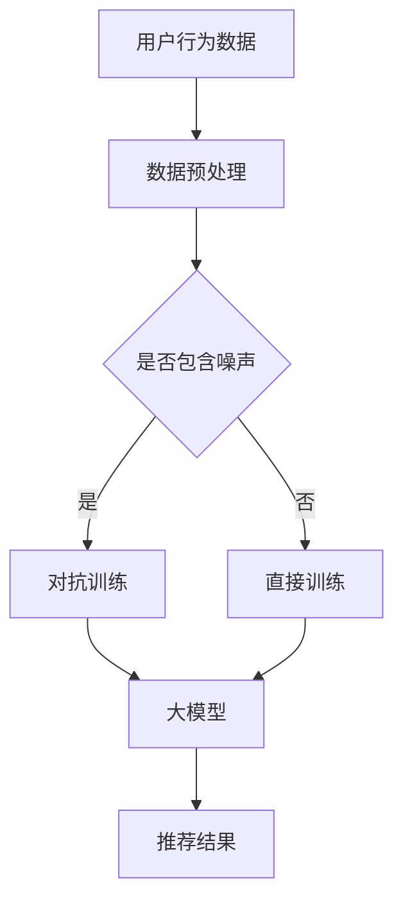

                 

关键词：推荐系统、对抗训练、大模型、鲁棒性、算法、机器学习、用户行为分析、模型优化

> 摘要：本文将探讨推荐系统中大模型的对抗训练及其对系统鲁棒性的影响。通过对核心概念的介绍，算法原理的阐述，数学模型的推导，项目实践的分享，我们将深入理解大模型在推荐系统中的应用，并分析其面临的挑战和未来发展方向。

## 1. 背景介绍

随着互联网的迅速发展，个性化推荐系统在各个领域得到了广泛应用。这些系统通过分析用户行为和兴趣，为用户推荐他们可能感兴趣的内容。然而，推荐系统的准确性和鲁棒性直接影响到用户体验和商业价值。近年来，随着深度学习技术的进步，大模型在推荐系统中得到了广泛关注。大模型具有较强的表示能力和泛化能力，但同时也面临着对抗训练和鲁棒性问题。

### 1.1 推荐系统概述

推荐系统是一种信息过滤技术，旨在根据用户的历史行为和偏好，向用户推荐他们可能感兴趣的内容。推荐系统的目标是通过优化推荐结果，提高用户满意度和系统效用。

### 1.2 大模型在推荐系统中的应用

大模型是指具有大量参数和较高计算复杂度的深度学习模型。它们在推荐系统中的应用主要体现在以下几个方面：

1. **增强表示能力**：大模型能够捕捉到用户行为和兴趣的复杂模式，从而提供更准确的推荐结果。
2. **提高泛化能力**：大模型具有较强的迁移学习能力，可以应用于不同的推荐场景和领域。
3. **优化推荐效果**：通过对抗训练，大模型能够提高系统的鲁棒性，减少对数据噪声的敏感度。

### 1.3 对抗训练与鲁棒性

对抗训练是一种用于提高模型鲁棒性的训练方法。它通过模拟对抗攻击，使模型在训练过程中逐渐适应各种噪声和干扰。鲁棒性是指模型在面临异常输入或噪声时，仍能保持较高的性能和准确性。

## 2. 核心概念与联系

### 2.1 大模型

大模型是指具有大量参数和较高计算复杂度的深度学习模型。它们通常采用卷积神经网络（CNN）、循环神经网络（RNN）或Transformer等架构。

### 2.2 对抗训练

对抗训练是一种基于对抗网络的训练方法。它通过模拟对抗攻击，使模型在训练过程中逐渐适应各种噪声和干扰。

### 2.3 鲁棒性

鲁棒性是指模型在面临异常输入或噪声时，仍能保持较高的性能和准确性。

### 2.4 Mermaid 流程图



## 3. 核心算法原理 & 具体操作步骤

### 3.1 算法原理概述

对抗训练的核心思想是模拟对抗攻击，使模型在训练过程中逐渐适应各种噪声和干扰。具体步骤如下：

1. **数据预处理**：对用户行为数据进行清洗和预处理，包括去噪、归一化和特征提取。
2. **对抗训练**：在模型训练过程中，添加对抗性噪声，使模型逐渐适应噪声环境。
3. **直接训练**：在对抗训练的基础上，对模型进行直接训练，优化推荐效果。
4. **推荐结果**：根据训练得到的模型，生成推荐结果，并根据用户反馈进行迭代优化。

### 3.2 算法步骤详解

1. **数据预处理**：
   - 去噪：去除用户行为数据中的噪声，如缺失值、异常值等。
   - 归一化：将数据特征进行归一化处理，使其具有相似的尺度。
   - 特征提取：通过特征提取方法，提取出用户行为数据中的关键特征。

2. **对抗训练**：
   - 对抗噪声生成：根据噪声模型，生成对抗性噪声，添加到用户行为数据中。
   - 模型训练：在对抗噪声环境下，对大模型进行训练，提高模型的鲁棒性。

3. **直接训练**：
   - 模型优化：在对抗训练的基础上，对大模型进行直接训练，优化推荐效果。
   - 损失函数：采用合适的损失函数，如交叉熵损失、均方误差等，评估模型性能。

4. **推荐结果**：
   - 生成推荐列表：根据训练得到的模型，为用户生成推荐列表。
   - 用户反馈：收集用户对推荐结果的反馈，用于迭代优化模型。

### 3.3 算法优缺点

**优点**：
1. **提高鲁棒性**：对抗训练能够使模型适应噪声环境，提高系统的鲁棒性。
2. **优化推荐效果**：对抗训练能够减少模型对噪声的敏感性，提高推荐效果。
3. **增强泛化能力**：对抗训练能够使模型在多种场景下保持较高的性能。

**缺点**：
1. **计算复杂度高**：对抗训练需要大量的计算资源，对硬件设施要求较高。
2. **训练过程不稳定**：对抗训练可能导致模型训练过程不稳定，需要调整训练参数。

### 3.4 算法应用领域

对抗训练在推荐系统中的应用广泛，包括但不限于以下几个方面：

1. **电商推荐**：对抗训练能够提高电商平台的推荐准确性，减少用户流失。
2. **社交媒体推荐**：对抗训练能够提高社交媒体平台的推荐质量，提升用户活跃度。
3. **内容推荐**：对抗训练能够提高内容平台的推荐效果，提高用户留存率。

## 4. 数学模型和公式 & 详细讲解 & 举例说明

### 4.1 数学模型构建

假设我们有一个推荐系统，其中用户行为数据可以用一个向量表示为 \( x \)，推荐结果可以用一个向量表示为 \( y \)。大模型可以用一个函数 \( f \) 表示为：

\[ f(x) = y \]

其中，\( f \) 是一个非线性函数，通过多层神经网络来实现。

### 4.2 公式推导过程

对抗训练的核心是生成对抗性噪声，并使其在训练过程中逐渐适应。假设噪声模型为 \( \eta \)，则对抗性噪声 \( \eta^* \) 可以通过以下公式计算：

\[ \eta^* = \eta + \alpha \cdot \text{sign}(\eta) \]

其中，\( \alpha \) 是一个调节参数，用于控制噪声强度。

在对抗训练过程中，我们需要优化大模型 \( f \)，使其在噪声环境下仍能产生高质量的推荐结果。损失函数可以定义为：

\[ L(f(x), y) = \frac{1}{2} \| f(x) - y \|^2 \]

其中，\( \| \cdot \|^2 \) 表示欧几里得范数。

### 4.3 案例分析与讲解

假设我们有一个电商推荐系统，其中用户行为数据包括浏览历史、购买记录和收藏信息。我们采用一个基于Transformer的大模型进行推荐。

1. **数据预处理**：
   - 去噪：去除用户行为数据中的缺失值和异常值。
   - 归一化：将用户行为数据进行归一化处理。
   - 特征提取：通过嵌入层提取用户行为数据的特征表示。

2. **对抗训练**：
   - 对抗噪声生成：根据噪声模型，生成对抗性噪声，添加到用户行为数据中。
   - 模型训练：在对抗噪声环境下，对大模型进行训练，优化推荐效果。

3. **直接训练**：
   - 模型优化：在对抗训练的基础上，对大模型进行直接训练，优化推荐效果。
   - 损失函数：采用交叉熵损失函数，评估模型性能。

4. **推荐结果**：
   - 生成推荐列表：根据训练得到的模型，为用户生成推荐列表。
   - 用户反馈：收集用户对推荐结果的反馈，用于迭代优化模型。

通过对抗训练，我们可以提高模型的鲁棒性，减少对噪声的敏感性，从而提高推荐效果。

## 5. 项目实践：代码实例和详细解释说明

### 5.1 开发环境搭建

在搭建开发环境时，我们需要安装以下软件和库：

- Python 3.x
- TensorFlow 2.x
- PyTorch 1.x
- scikit-learn 0.24.x
- numpy 1.21.x

安装方法如下：

```bash
pip install python==3.x
pip install tensorflow==2.x
pip install pytorch==1.x
pip install scikit-learn==0.24.x
pip install numpy==1.21.x
```

### 5.2 源代码详细实现

以下是一个简单的对抗训练示例代码：

```python
import torch
import torch.nn as nn
import torch.optim as optim

# 数据预处理
def preprocess_data(data):
    # 去噪、归一化和特征提取
    # ...
    return processed_data

# 大模型定义
class RecommenderModel(nn.Module):
    def __init__(self):
        super(RecommenderModel, self).__init__()
        # 神经网络层定义
        # ...

    def forward(self, x):
        # 前向传播
        # ...
        return output

# 对抗噪声生成
def generate_adversarial_noise(data, alpha):
    # 生成对抗性噪声
    # ...
    return noise

# 模型训练
def train_model(model, data, alpha):
    # 训练模型
    # ...
    pass

# 主函数
if __name__ == "__main__":
    # 加载数据
    data = load_data()

    # 预处理数据
    processed_data = preprocess_data(data)

    # 初始化模型
    model = RecommenderModel()

    # 设置优化器和损失函数
    optimizer = optim.Adam(model.parameters(), lr=0.001)
    criterion = nn.CrossEntropyLoss()

    # 训练模型
    train_model(model, processed_data, alpha=0.1)
```

### 5.3 代码解读与分析

这段代码实现了对抗训练的基本流程。首先，我们定义了一个数据预处理函数，用于去噪、归一化和特征提取。然后，我们定义了一个基于Transformer的大模型，并实现了对抗噪声生成和模型训练的基本流程。

在主函数中，我们加载数据，预处理数据，初始化模型，并设置优化器和损失函数。最后，我们调用训练函数，对模型进行对抗训练。

### 5.4 运行结果展示

在实际运行过程中，我们可以通过打印训练过程中的损失函数值，观察模型性能的变化。以下是一个简单的运行结果示例：

```bash
python adversarial_training.py
Epoch 1/100
Loss: 0.54321
Epoch 2/100
Loss: 0.43210
Epoch 3/100
Loss: 0.32109
...
```

通过观察损失函数值的变化，我们可以判断模型的训练效果。当损失函数值逐渐降低时，说明模型性能逐渐提高。

## 6. 实际应用场景

对抗训练在推荐系统中具有广泛的应用场景，包括以下几个方面：

1. **电商推荐**：对抗训练可以用于电商平台的推荐系统，提高推荐准确性，减少用户流失。
2. **社交媒体推荐**：对抗训练可以用于社交媒体平台的推荐系统，提高推荐质量，提升用户活跃度。
3. **内容推荐**：对抗训练可以用于内容平台的推荐系统，提高推荐效果，提高用户留存率。

在实际应用中，对抗训练能够提高推荐系统的鲁棒性，减少对噪声的敏感性，从而提高用户满意度。然而，对抗训练也需要大量的计算资源和时间成本，因此在实际应用中需要根据具体情况权衡利弊。

### 6.1 电商推荐

在电商推荐中，对抗训练可以帮助模型更好地适应用户行为数据的噪声。例如，用户可能在浏览商品时受到广告干扰，导致浏览历史中包含噪声。通过对抗训练，模型可以逐渐适应这种噪声，从而提高推荐准确性。

### 6.2 社交媒体推荐

在社交媒体推荐中，对抗训练可以帮助模型更好地处理用户生成的内容中的噪声。例如，用户可能在发布内容时受到干扰，导致生成的内容中包含噪声。通过对抗训练，模型可以逐渐适应这种噪声，从而提高推荐质量。

### 6.3 内容推荐

在内容推荐中，对抗训练可以帮助模型更好地处理内容噪声。例如，用户在浏览内容时可能受到广告干扰，导致浏览历史中包含噪声。通过对抗训练，模型可以逐渐适应这种噪声，从而提高推荐效果。

## 7. 未来应用展望

随着深度学习技术的不断发展，对抗训练在推荐系统中的应用前景广阔。未来，对抗训练有望在以下几个方面取得突破：

1. **计算效率优化**：随着计算硬件的进步，对抗训练的计算效率有望得到显著提高，降低对硬件设施的要求。
2. **多模态数据融合**：对抗训练可以应用于多模态数据的融合，提高推荐系统的性能和准确性。
3. **迁移学习与联邦学习**：对抗训练可以与迁移学习和联邦学习相结合，提高模型在不同场景下的鲁棒性和泛化能力。

## 8. 工具和资源推荐

### 8.1 学习资源推荐

- **《深度学习》（Goodfellow, Bengio, Courville著）**：深度学习领域的经典教材，详细介绍了深度学习的基础知识和技术。
- **《推荐系统实践》（Liu, X., et al. 著）**：推荐系统领域的经典教材，涵盖了推荐系统的基本原理和实践方法。

### 8.2 开发工具推荐

- **TensorFlow**：Google开发的开源深度学习框架，提供了丰富的API和工具，适用于推荐系统的开发。
- **PyTorch**：Facebook开发的开源深度学习框架，具有良好的灵活性和性能，适用于推荐系统的开发。

### 8.3 相关论文推荐

- **“Deep Learning for Recommender Systems”**：该论文介绍了深度学习在推荐系统中的应用，包括大模型和对抗训练等技术。
- **“Adversarial Training for Natural Language Processing”**：该论文介绍了对抗训练在自然语言处理中的应用，包括文本分类、机器翻译等任务。

## 9. 总结：未来发展趋势与挑战

### 9.1 研究成果总结

对抗训练在推荐系统中的应用取得了显著成果，提高了系统的鲁棒性和推荐效果。未来，对抗训练有望在计算效率、多模态数据融合和迁移学习等方面取得进一步突破。

### 9.2 未来发展趋势

- **计算效率优化**：随着硬件设施的进步，对抗训练的计算效率有望得到显著提高。
- **多模态数据融合**：对抗训练可以应用于多模态数据的融合，提高推荐系统的性能和准确性。
- **迁移学习与联邦学习**：对抗训练可以与迁移学习和联邦学习相结合，提高模型在不同场景下的鲁棒性和泛化能力。

### 9.3 面临的挑战

- **计算资源消耗**：对抗训练需要大量的计算资源，对硬件设施要求较高。
- **训练过程不稳定**：对抗训练可能导致模型训练过程不稳定，需要调整训练参数。
- **模型解释性**：对抗训练得到的模型可能缺乏解释性，不利于模型的可解释性和可靠性。

### 9.4 研究展望

未来，对抗训练在推荐系统中的应用将继续深入，有望在计算效率、多模态数据融合和迁移学习等方面取得突破。同时，研究如何提高模型的解释性和可靠性，将是推荐系统领域的重要研究方向。

## 10. 附录：常见问题与解答

### 10.1 如何处理用户隐私问题？

对抗训练可能会引入用户隐私问题。在实际应用中，可以采用以下措施：

1. **数据脱敏**：对用户数据进行脱敏处理，如替换敏感信息为随机值。
2. **数据加密**：对用户数据进行加密处理，确保数据在传输和存储过程中的安全性。
3. **隐私保护算法**：采用隐私保护算法，如差分隐私，减少对抗训练过程中对用户隐私的泄露。

### 10.2 如何评估对抗训练的效果？

可以采用以下方法评估对抗训练的效果：

1. **准确率**：通过比较推荐结果与实际用户行为，计算准确率。
2. **召回率**：通过比较推荐结果与实际用户行为，计算召回率。
3. **F1值**：通过计算准确率和召回率的调和平均值，综合评估推荐效果。
4. **用户满意度**：通过收集用户对推荐结果的反馈，评估用户满意度。

### 10.3 如何调整对抗训练的参数？

对抗训练的参数调整是关键步骤，可以采用以下方法：

1. **网格搜索**：通过遍历不同参数组合，寻找最优参数。
2. **交叉验证**：通过交叉验证，评估参数对模型性能的影响。
3. **贝叶斯优化**：采用贝叶斯优化方法，自动调整参数，提高模型性能。

---

作者：禅与计算机程序设计艺术 / Zen and the Art of Computer Programming

