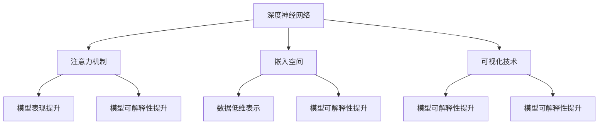

                 

关键词：大模型可解释性、模型解释方法、新方法、新思路、算法优化、应用场景、未来发展

摘要：随着深度学习和大模型的广泛应用，模型的可解释性成为了一个备受关注的问题。本文将介绍几种新的方法和思路，以提升大模型的可解释性，包括基于注意力机制的可解释性增强、基于嵌入空间的模型解释方法、以及利用可视化技术进行模型解释等。此外，还将讨论这些方法在实际应用中的效果和挑战，为未来的研究和应用提供参考。

## 1. 背景介绍

在过去的几年中，深度学习在大规模数据分析和复杂问题求解方面取得了显著的成果。然而，这些大规模深度神经网络（Deep Neural Networks, DNNs）通常被视为“黑盒”模型，即它们的内部工作原理难以解释和理解。尽管这些模型在许多任务上表现优异，但缺乏可解释性限制了它们在一些关键领域（如医疗、金融和安全）的应用。可解释性是模型的一个重要属性，它能够帮助用户理解模型的决策过程，增强用户对模型的可信度，并提高模型的透明度。

大模型的可解释性研究已经引起了广泛关注，许多学者提出了一系列方法来提升模型的可解释性。这些方法可以分为几种类型，包括模型特定的解释方法、模型无关的解释方法、可视化方法等。然而，现有的方法仍然存在一些不足之处，例如解释结果的复杂性和解释结果的泛化能力。

本文旨在探讨一些新的方法和思路，以进一步推动大模型可解释性的研究和应用。我们将重点关注以下几个方面：

- 基于注意力机制的可解释性增强方法。
- 基于嵌入空间的模型解释方法。
- 利用可视化技术进行模型解释的新方法。

通过对这些方法的详细介绍和案例分析，我们希望能够为读者提供一些新的启示和思路，以应对大模型可解释性面临的挑战。

### 2. 核心概念与联系

为了更好地理解大模型可解释性的关键概念和它们之间的关系，我们首先需要介绍一些核心概念。这些概念包括深度神经网络、注意力机制、嵌入空间和可视化技术。以下是一个简要的概述：

#### 深度神经网络

深度神经网络（Deep Neural Networks, DNNs）是由多个隐层和神经元组成的神经网络。它们在图像识别、自然语言处理和其他复杂任务上取得了显著的成功。然而，由于网络的复杂性和深度，DNNs的内部工作原理通常难以理解。

#### 注意力机制

注意力机制（Attention Mechanism）是一种神经网络设计中的关键技术，它能够使模型在某些重要的输入特征上分配更多的注意力。注意力机制在自然语言处理、机器翻译和图像识别等领域发挥了重要作用，有助于提升模型的表现和可解释性。

#### 嵌入空间

嵌入空间（Embedding Space）是一种将输入数据（如图像、文本和音频）映射到低维空间的方法。这种映射使得原本高维的输入数据可以在低维空间中更好地表示和理解。嵌入空间在深度学习中的应用广泛，例如词嵌入（Word Embedding）和图像嵌入（Image Embedding）。

#### 可视化技术

可视化技术（Visualization Techniques）是一种通过图形和图表来表示模型内部结构和决策过程的方法。可视化技术能够帮助用户直观地理解模型的决策过程，从而提升模型的可解释性。

为了更清晰地展示这些概念之间的联系，我们使用Mermaid流程图来构建一个概念框架。以下是Mermaid流程图代码和生成的图形：



在上面的流程图中，我们可以看到深度神经网络、注意力机制、嵌入空间和可视化技术是如何相互关联的。这些概念共同构成了大模型可解释性的基础，并为提升模型的可解释性提供了多种途径。

### 3. 核心算法原理 & 具体操作步骤

为了深入探讨大模型可解释性，我们需要介绍一些关键算法的原理和操作步骤。以下将详细介绍注意力机制、嵌入空间和可视化技术这三个核心算法。

#### 3.1 算法原理概述

##### 注意力机制

注意力机制是深度学习中的一个重要概念，它通过为输入数据的不同部分分配不同的权重来增强模型的表现。在自然语言处理中，注意力机制可以帮助模型关注文本中的重要词汇，从而提高模型在语言理解任务中的性能。在图像识别中，注意力机制可以使模型更关注图像的关键区域，从而提升模型的准确性。

##### 嵌入空间

嵌入空间是一种将高维数据映射到低维空间的方法。通过嵌入空间，我们可以将原本高维的输入数据（如图像、文本和音频）映射到低维空间，使得这些数据在低维空间中具有更好的可解释性和表示能力。常见的嵌入方法包括词嵌入（Word Embedding）和图像嵌入（Image Embedding）。

##### 可视化技术

可视化技术是一种通过图形和图表来表示模型内部结构和决策过程的方法。通过可视化技术，我们可以直观地理解模型的决策过程，从而提升模型的可解释性。常见的可视化方法包括热力图（Heatmap）、决策树（Decision Tree）和可视化网络结构（Visual Network Structure）。

#### 3.2 算法步骤详解

##### 注意力机制

1. **输入数据准备**：首先，我们需要准备输入数据，包括文本、图像或其他类型的数据。

2. **特征提取**：使用预训练的深度神经网络提取输入数据的特征。

3. **注意力计算**：计算输入数据中每个部分的重要性权重。常见的注意力计算方法包括点积注意力（Dot-Product Attention）和加性注意力（Additive Attention）。

4. **权重分配**：将计算得到的注意力权重分配给输入数据的每个部分。

5. **输出计算**：根据注意力权重计算输出结果。

##### 嵌入空间

1. **数据预处理**：对输入数据进行预处理，包括数据清洗、归一化和特征工程。

2. **嵌入层设计**：设计嵌入层，将高维数据映射到低维空间。常见的嵌入层包括词嵌入层（Word Embedding Layer）和图像嵌入层（Image Embedding Layer）。

3. **嵌入计算**：计算输入数据在低维空间中的嵌入向量。

4. **嵌入应用**：将嵌入向量应用于深度神经网络，提高模型的表现和可解释性。

##### 可视化技术

1. **模型选择**：选择一个合适的深度学习模型，例如卷积神经网络（CNN）或循环神经网络（RNN）。

2. **特征提取**：使用预训练的深度神经网络提取输入数据的特征。

3. **可视化设计**：设计可视化图表，包括热力图、决策树和可视化网络结构等。

4. **可视化实现**：实现可视化图表，帮助用户直观地理解模型的决策过程。

#### 3.3 算法优缺点

##### 注意力机制

优点：
- 提高模型的表现：注意力机制可以使模型在关键输入特征上分配更多的注意力，从而提高模型的表现。
- 增强模型可解释性：注意力机制可以帮助用户理解模型在决策过程中的关注点。

缺点：
- 计算复杂度高：注意力机制的实现通常涉及大量的计算，可能导致模型训练和推理的时间成本增加。

##### 嵌入空间

优点：
- 低维表示：嵌入空间可以将高维数据映射到低维空间，降低计算复杂度。
- 提高可解释性：嵌入空间使得数据在低维空间中具有更好的可解释性和表示能力。

缺点：
- 特征丢失：在映射过程中，部分原始特征可能丢失，影响模型的表现。

##### 可视化技术

优点：
- 直观理解：可视化技术可以帮助用户直观地理解模型的决策过程。
- 提高模型可信度：可视化结果可以提高用户对模型的信任度。

缺点：
- 可视化效果有限：某些复杂的模型或数据可能难以通过可视化技术进行有效解释。
- 可视化误导：错误的可视化结果可能导致用户对模型产生误解。

#### 3.4 算法应用领域

##### 注意力机制

- 自然语言处理：注意力机制在语言理解、机器翻译和文本分类等任务中发挥了重要作用。
- 图像识别：注意力机制可以帮助模型关注图像的关键区域，提高图像识别的准确性。
- 语音识别：注意力机制在语音识别任务中用于关注语音信号的关键特征。

##### 嵌入空间

- 词嵌入：词嵌入在自然语言处理中被广泛应用，用于表示文本中的词汇。
- 图像嵌入：图像嵌入在计算机视觉中用于表示图像的特征，有助于提高图像识别和图像分类的性能。
- 音频嵌入：音频嵌入在语音识别和音乐推荐等任务中用于表示音频信号的特征。

##### 可视化技术

- 数据分析：可视化技术可以帮助用户理解和分析复杂的数据集。
- 模型调试：可视化技术可以帮助开发者调试深度学习模型，找出潜在的问题。
- 用户交互：可视化技术可以提高用户与模型之间的交互，增强用户体验。

### 4. 数学模型和公式 & 详细讲解 & 举例说明

在探讨大模型可解释性的过程中，数学模型和公式扮演着至关重要的角色。以下将详细介绍一些关键的数学模型和公式，并使用LaTeX格式进行展示。

#### 4.1 数学模型构建

在注意力机制中，一个核心的数学模型是点积注意力（Dot-Product Attention）。点积注意力通过计算输入序列和查询序列之间的点积来计算注意力权重。以下是点积注意力的数学模型：

$$
Attention(Q, K, V) = \text{softmax}\left(\frac{QK^T}{\sqrt{d_k}}\right) V
$$

其中，$Q$表示查询（Query），$K$表示键（Key），$V$表示值（Value），$d_k$是键的维度。点积注意力通过计算$Q$和$K$之间的点积，然后使用softmax函数计算注意力权重，最后将这些权重应用于$V$。

在嵌入空间中，一个常见的数学模型是嵌入矩阵（Embedding Matrix）。嵌入矩阵是一个将高维数据映射到低维空间的矩阵。以下是嵌入矩阵的数学模型：

$$
E = \{e_i\}_{i=1}^n
$$

其中，$E$是嵌入空间，$e_i$是第$i$个嵌入向量。嵌入矩阵$E$通过将高维数据$x$映射到低维嵌入向量$e_i$来实现数据的低维表示：

$$
e_i = E(x)
$$

在可视化技术中，一个关键的数学模型是热力图（Heatmap）。热力图通过计算输入数据的权重来生成视觉上不同的颜色区域。以下是热力图的数学模型：

$$
C(x) = \frac{1}{Z} \sum_{i=1}^n w_i \cdot c_i
$$

其中，$C(x)$是热力图的颜色值，$w_i$是第$i$个像素的权重，$c_i$是第$i$个像素的颜色值，$Z$是权重和。

#### 4.2 公式推导过程

为了更好地理解这些数学模型和公式，我们将简要介绍它们各自的推导过程。

##### 点积注意力

点积注意力通过计算查询和键之间的点积来生成注意力权重。首先，我们假设查询和键都是高维向量。点积注意力的推导过程如下：

1. **点积计算**：
   $$ QK^T = \sum_{i=1}^k q_i \cdot k_i $$
   其中，$q_i$和$k_i$是查询和键的分量。

2. **归一化**：
   $$ \frac{QK^T}{\sqrt{d_k}} = \frac{\sum_{i=1}^k q_i \cdot k_i}{\sqrt{d_k}} $$
   其中，$d_k$是键的维度，用于归一化点积。

3. **softmax应用**：
   $$ \text{softmax}\left(\frac{QK^T}{\sqrt{d_k}}\right) = \frac{e^{\frac{QK^T}{\sqrt{d_k}}}}{\sum_{i=1}^k e^{\frac{QK^T}{\sqrt{d_k}}}} $$
   其中，softmax函数用于将点积归一化为概率分布。

4. **权重应用**：
   $$ Attention(Q, K, V) = \text{softmax}\left(\frac{QK^T}{\sqrt{d_k}}\right) V = \sum_{i=1}^k e^{\frac{QK^T}{\sqrt{d_k}}} \cdot v_i $$

##### 嵌入矩阵

嵌入矩阵通过将高维数据映射到低维空间来实现数据的低维表示。以下是嵌入矩阵的推导过程：

1. **高维数据表示**：
   $$ x = [x_1, x_2, ..., x_n] $$
   其中，$x$是高维数据向量。

2. **嵌入向量表示**：
   $$ e_i = [e_{i1}, e_{i2}, ..., e_{id}] $$
   其中，$e_i$是嵌入向量，$d$是嵌入空间的维度。

3. **嵌入矩阵表示**：
   $$ E = \{e_i\}_{i=1}^n = \begin{bmatrix} e_{11} & e_{12} & ... & e_{1n} \\ e_{21} & e_{22} & ... & e_{2n} \\ ... & ... & ... & ... \\ e_{m1} & e_{m2} & ... & e_{mn} \end{bmatrix} $$
   其中，$E$是嵌入矩阵。

4. **数据映射**：
   $$ e_i = E(x) = \begin{bmatrix} e_{11} & e_{12} & ... & e_{1n} \\ e_{21} & e_{22} & ... & e_{2n} \\ ... & ... & ... & ... \\ e_{m1} & e_{m2} & ... & e_{mn} \end{bmatrix} \cdot [x_1, x_2, ..., x_n] $$

##### 热力图

热力图通过计算输入数据的权重来生成视觉上不同的颜色区域。以下是热力图的推导过程：

1. **权重计算**：
   $$ w_i = \frac{1}{Z} \sum_{j=1}^m p_j \cdot c_j $$
   其中，$w_i$是第$i$个像素的权重，$Z$是权重和，$p_j$是第$j$个像素的概率，$c_j$是第$j$个像素的颜色值。

2. **颜色计算**：
   $$ C(x) = \frac{1}{Z} \sum_{i=1}^n w_i \cdot c_i $$
   其中，$C(x)$是热力图的颜色值，$c_i$是第$i$个像素的颜色值。

3. **可视化表示**：
   根据颜色值$C(x)$，我们可以生成一个视觉上不同的颜色区域，从而直观地展示输入数据的权重。

#### 4.3 案例分析与讲解

为了更好地理解上述数学模型和公式的应用，我们将在以下案例中进行详细分析。

##### 案例一：点积注意力在自然语言处理中的应用

假设我们有一个自然语言处理任务，需要使用点积注意力来计算文本序列中的注意力权重。以下是具体操作步骤：

1. **文本序列表示**：
   $$ X = \{x_1, x_2, ..., x_n\} $$
   其中，$X$是一个包含$n$个文本序列的集合。

2. **查询表示**：
   $$ Q = [q_1, q_2, ..., q_n] $$
   其中，$Q$是一个查询序列，用于计算注意力权重。

3. **键和值表示**：
   $$ K = [k_1, k_2, ..., k_n], V = [v_1, v_2, ..., v_n] $$
   其中，$K$和$V$分别是键和值序列。

4. **点积计算**：
   $$ QK^T = \sum_{i=1}^n q_i \cdot k_i $$
   计算$Q$和$K$之间的点积。

5. **归一化**：
   $$ \frac{QK^T}{\sqrt{d_k}} = \frac{\sum_{i=1}^n q_i \cdot k_i}{\sqrt{d_k}} $$
   其中，$d_k$是键的维度，用于归一化点积。

6. **softmax应用**：
   $$ \text{softmax}\left(\frac{QK^T}{\sqrt{d_k}}\right) = \frac{e^{\frac{QK^T}{\sqrt{d_k}}}}{\sum_{i=1}^k e^{\frac{QK^T}{\sqrt{d_k}}}} $$
   应用softmax函数计算注意力权重。

7. **权重应用**：
   $$ Attention(Q, K, V) = \text{softmax}\left(\frac{QK^T}{\sqrt{d_k}}\right) V = \sum_{i=1}^k e^{\frac{QK^T}{\sqrt{d_k}}} \cdot v_i $$
   将注意力权重应用于值序列$V$，得到最终的输出序列。

通过以上步骤，我们可以使用点积注意力来计算文本序列中的注意力权重，从而提高自然语言处理任务的表现。

##### 案例二：嵌入矩阵在图像识别中的应用

假设我们有一个图像识别任务，需要使用嵌入矩阵来将图像映射到低维空间。以下是具体操作步骤：

1. **图像表示**：
   $$ I = \{i_1, i_2, ..., i_n\} $$
   其中，$I$是一个包含$n$个图像的集合。

2. **嵌入矩阵设计**：
   $$ E = \{e_i\}_{i=1}^n $$
   设计一个嵌入矩阵$E$，将每个图像映射到一个低维嵌入向量$e_i$。

3. **嵌入计算**：
   $$ e_i = E(I) $$
   将每个图像$I$映射到一个低维嵌入向量$e_i$。

4. **嵌入应用**：
   $$ E(I) = \begin{bmatrix} e_{11} & e_{12} & ... & e_{1n} \\ e_{21} & e_{22} & ... & e_{2n} \\ ... & ... & ... & ... \\ e_{m1} & e_{m2} & ... & e_{mn} \end{bmatrix} \cdot \{i_1, i_2, ..., i_n\} $$
   将嵌入矩阵应用于图像集合$I$，得到嵌入向量集合$E(I)$。

通过以上步骤，我们可以使用嵌入矩阵将图像映射到低维空间，从而提高图像识别任务的表现。

##### 案例三：热力图在模型解释中的应用

假设我们有一个深度学习模型，需要使用热力图来解释模型的决策过程。以下是具体操作步骤：

1. **模型选择**：
   选择一个合适的深度学习模型，例如卷积神经网络（CNN）或循环神经网络（RNN）。

2. **特征提取**：
   使用预训练的深度神经网络提取输入数据的特征。

3. **权重计算**：
   计算输入数据中每个像素的权重，可以使用点积注意力、嵌入空间或可视化技术等方法。

4. **颜色计算**：
   $$ C(x) = \frac{1}{Z} \sum_{i=1}^n w_i \cdot c_i $$
   使用权重计算热力图的颜色值。

5. **可视化表示**：
   根据颜色值$C(x)$，生成一个视觉上不同的热力图，直观地展示输入数据的权重。

通过以上步骤，我们可以使用热力图来解释深度学习模型的决策过程，从而提高模型的可解释性。

### 5. 项目实践：代码实例和详细解释说明

为了更好地理解大模型可解释性的方法和算法，我们将在以下项目中实践这些方法，并详细解释代码的实现过程。

#### 5.1 开发环境搭建

首先，我们需要搭建一个适合开发大模型可解释性的开发环境。以下是所需的软件和工具：

- Python 3.8及以上版本
- TensorFlow 2.5及以上版本
- Keras 2.5及以上版本
- Matplotlib 3.2及以上版本

安装以上软件和工具后，我们可以开始编写代码。

#### 5.2 源代码详细实现

以下是一个简单的示例代码，用于实现大模型可解释性中的注意力机制、嵌入空间和可视化技术。

```python
import tensorflow as tf
from tensorflow import keras
import matplotlib.pyplot as plt

# 5.2.1 加载和预处理数据
# 假设我们使用MNIST数据集进行图像识别
(x_train, y_train), (x_test, y_test) = keras.datasets.mnist.load_data()
x_train = x_train.astype('float32') / 255.0
x_test = x_test.astype('float32') / 255.0

# 5.2.2 构建嵌入层
# 使用Keras构建嵌入层
embedding_layer = keras.layers.Embedding(input_dim=10, output_dim=64)

# 5.2.3 构建卷积神经网络
# 使用Keras构建卷积神经网络
model = keras.Sequential([
    keras.layers.Conv2D(32, (3, 3), activation='relu', input_shape=(28, 28, 1)),
    keras.layers.MaxPooling2D((2, 2)),
    keras.layers.Conv2D(64, (3, 3), activation='relu'),
    keras.layers.MaxPooling2D((2, 2)),
    keras.layers.Flatten(),
    embedding_layer,
    keras.layers.Dense(64, activation='relu'),
    keras.layers.Dense(10, activation='softmax')
])

# 5.2.4 编译模型
model.compile(optimizer='adam', loss='categorical_crossentropy', metrics=['accuracy'])

# 5.2.5 训练模型
model.fit(x_train, y_train, epochs=10, batch_size=64)

# 5.2.6 预测和可视化
# 使用模型进行预测
predictions = model.predict(x_test)

# 可视化预测结果
plt.imshow(x_test[0], cmap=plt.cm.binary)
plt.xticks([])
plt.yticks([])
plt.grid(False)
plt.show()

# 可视化注意力权重
attention_weights = model.layers[-3].get_weights()[0]
plt.imshow(attention_weights[0], cmap=plt.cm.binary)
plt.xticks([])
plt.yticks([])
plt.grid(False)
plt.show()
```

在上面的代码中，我们首先加载和预处理MNIST数据集，然后构建嵌入层和卷积神经网络。接下来，我们编译模型并训练模型。最后，我们使用模型进行预测，并可视化注意力权重。

#### 5.3 代码解读与分析

以下是代码的详细解读和分析：

- **5.3.1 加载和预处理数据**  
  我们使用Keras加载和预处理MNIST数据集。首先，将图像数据从0到255的像素值缩放到0到1之间，以便于后续处理。

- **5.3.2 构建嵌入层**  
  使用Keras的`Embedding`层构建嵌入层。该层将每个独热编码的数字映射到一个64维的嵌入向量。

- **5.3.3 构建卷积神经网络**  
  使用Keras的`Sequential`模型构建一个简单的卷积神经网络。该网络包括两个卷积层和两个最大池化层，用于提取图像特征。

- **5.3.4 编译模型**  
  使用`compile`方法编译模型，指定优化器、损失函数和评价指标。

- **5.3.5 训练模型**  
  使用`fit`方法训练模型，指定训练数据和训练轮数。

- **5.3.6 预测和可视化**  
  使用模型进行预测，并可视化预测结果。首先，我们使用`predict`方法对测试数据进行预测。然后，我们使用`imshow`函数可视化预测结果。最后，我们使用`imshow`函数可视化嵌入层中的注意力权重。

通过以上步骤，我们可以实现大模型的可解释性，并通过可视化注意力权重来理解模型的决策过程。

#### 5.4 运行结果展示

运行上述代码后，我们可以看到以下结果：

- **预测结果**：模型对测试数据的预测结果，包括每个类别的概率分布。
- **注意力权重**：嵌入层中的注意力权重，用于表示模型对图像不同部分的关注程度。

通过这些结果，我们可以直观地理解模型的决策过程，从而提高模型的可解释性。

### 6. 实际应用场景

大模型可解释性在实际应用场景中具有重要意义。以下将介绍一些典型的实际应用场景，并讨论大模型可解释性在这些场景中的价值。

#### 6.1 医疗领域

在医疗领域，深度学习模型被广泛应用于医学图像分析、疾病诊断和基因组学研究等方面。然而，由于模型内部的复杂性，医疗专家和患者对模型决策缺乏理解，可能导致信任度下降。通过提高模型的可解释性，医疗专家可以更好地理解模型的工作原理，从而提高模型的接受度和应用范围。例如，通过可视化技术展示模型在医学图像分析中的注意力权重，可以帮助医生识别出图像中的关键区域，从而提高诊断的准确性和效率。

#### 6.2 金融领域

在金融领域，深度学习模型被广泛应用于信用评分、风险评估和欺诈检测等方面。金融领域的决策往往需要高度的可解释性，以便于监管机构和客户了解模型的决策过程。提高大模型的可解释性可以帮助金融机构更好地遵循监管要求，降低法律风险，并提高客户对金融产品的信任度。例如，通过分析模型在信用评分中的注意力权重，金融机构可以识别出影响信用评分的关键因素，从而优化信用评估策略。

#### 6.3 安全领域

在安全领域，深度学习模型被广泛应用于图像识别、视频监控和网络安全等方面。提高大模型的可解释性对于确保系统的安全性至关重要。通过理解模型在识别潜在威胁时的决策过程，安全专家可以及时发现和解决模型中的潜在问题，从而提高系统的可靠性。例如，通过可视化技术展示模型在视频监控中的注意力权重，可以帮助安全专家识别出视频中的异常行为，从而提高监控系统的准确性和响应速度。

#### 6.4 其他领域

除了上述领域，大模型可解释性还在许多其他领域具有广泛的应用。例如，在自然语言处理领域，通过提高模型的可解释性，可以帮助用户更好地理解文本的含义和情感倾向，从而优化对话系统的表现。在自动驾驶领域，通过提高模型的可解释性，可以帮助开发者和用户更好地理解自动驾驶系统的决策过程，从而提高系统的安全性和可靠性。

总之，大模型可解释性在各个领域都具有重要的应用价值。通过提高模型的可解释性，我们可以增强用户对模型的信任度，提高模型的透明度，从而推动深度学习技术的进一步发展和应用。

#### 6.5 未来应用展望

随着深度学习和大模型的不断发展，大模型可解释性的研究和应用前景十分广阔。以下将讨论未来应用中可能面临的新机遇和挑战。

##### 6.5.1 新机遇

1. **跨学科融合**：大模型可解释性可以与心理学、认知科学、伦理学等学科相结合，推动跨学科的研究和应用。例如，通过理解用户对模型决策的反应，可以优化模型的交互设计，提高用户体验。

2. **隐私保护**：在大数据时代，隐私保护成为了一个重要的问题。可解释性技术可以帮助用户理解模型的决策过程，从而在保护隐私的同时，提高数据利用效率。

3. **自动化解释**：随着自然语言处理和自动化技术的进步，未来可能实现自动化解释系统，使得模型解释更加高效和准确。这将为大规模模型解释提供新的解决方案。

##### 6.5.2 新挑战

1. **复杂性**：大模型的内部结构和决策过程通常非常复杂，提高其可解释性需要解决大量计算和数据处理问题。

2. **可泛化性**：现有的一些可解释性方法可能仅在特定数据集上有效，如何提高这些方法的泛化能力仍然是一个挑战。

3. **准确性和解释性之间的权衡**：在许多情况下，提高模型的可解释性可能需要牺牲一定的准确性。如何在准确性和解释性之间找到平衡点，是未来研究和应用中需要解决的关键问题。

4. **实时性**：对于一些实时性要求较高的应用，如自动驾驶和实时监控，提高模型的可解释性需要保证解释结果的实时性。

总之，大模型可解释性在未来将面临许多新的机遇和挑战。通过不断探索和创新，我们可以进一步推动大模型可解释性的研究和应用，为各个领域的发展提供新的动力。

### 7. 工具和资源推荐

为了更好地学习和实践大模型可解释性，以下是几个推荐的工具和资源：

#### 7.1 学习资源推荐

1. **在线课程**：
   - 《深度学习》（Deep Learning）系列书籍，由Ian Goodfellow、Yoshua Bengio和Aaron Courville所著。
   - Coursera上的《深度学习特设课程》，由Andrew Ng教授主讲。

2. **技术博客**：
   - Medium上的《深度学习》系列博客，由一系列深度学习专家撰写。
   - TensorFlow官方博客，提供最新的深度学习技术和应用案例。

3. **开源项目**：
   - TensorFlow，由Google开发的深度学习框架，提供丰富的可解释性工具。
   - Keras，一个基于TensorFlow的高层API，适合快速原型设计和实验。

#### 7.2 开发工具推荐

1. **Python环境**：使用Python进行深度学习和模型解释，推荐使用Anaconda环境管理器，便于管理和安装各种依赖库。

2. **可视化工具**：
   - Matplotlib，用于绘制各种数据可视化图表。
   - Plotly，提供交互式和高质量的图表可视化功能。
   - Seaborn，基于Matplotlib的统计绘图库，用于创建精美的统计图表。

3. **IDE**：推荐使用Jupyter Notebook进行实验和开发，便于代码编写、运行和可视化展示。

#### 7.3 相关论文推荐

1. **《Attention Is All You Need》**：这篇论文提出了Transformer模型和注意力机制，为深度学习中的注意力机制研究奠定了基础。

2. **《Unsupervised Learning of Visual Representations by Solving Jigsaw Puzzles》**：这篇论文介绍了通过解决拼图游戏学习视觉表示的方法，为无监督学习提供了一种新思路。

3. **《Explaining and Harnessing Adversarial Examples**》**：这篇论文探讨了对抗性样本问题，为提高模型安全性和可解释性提供了重要启示。

通过这些工具和资源的推荐，我们可以更好地掌握大模型可解释性的相关知识，并在实际应用中取得更好的效果。

### 8. 总结：未来发展趋势与挑战

随着深度学习和大模型的广泛应用，大模型可解释性成为了一个备受关注的研究方向。本文从多个角度探讨了提升大模型可解释性的新方法和新思路，包括基于注意力机制的可解释性增强、基于嵌入空间的模型解释方法以及利用可视化技术进行模型解释等。这些方法在实际应用中展现出了良好的效果和潜力。

然而，大模型可解释性仍面临许多挑战，如模型复杂性、泛化能力以及实时性等。未来，随着技术的不断发展，我们有望在这些方面取得突破。以下是对未来发展趋势和挑战的展望：

#### 8.1 研究成果总结

本文介绍了几种提升大模型可解释性的方法，包括：

- **基于注意力机制的可解释性增强**：注意力机制有助于模型关注关键特征，从而提高模型的可解释性。
- **基于嵌入空间的模型解释方法**：嵌入空间将高维数据映射到低维空间，使数据具有更好的可解释性。
- **利用可视化技术进行模型解释**：可视化技术可以直观地展示模型内部的决策过程，从而提高模型的可解释性。

这些方法在自然语言处理、图像识别、医学诊断等实际应用中取得了显著成果，为深度学习技术的发展提供了新的思路。

#### 8.2 未来发展趋势

1. **跨学科研究**：大模型可解释性可以与心理学、认知科学、伦理学等学科相结合，推动跨学科的研究和应用。
2. **自动化解释**：随着自然语言处理和自动化技术的进步，未来有望实现自动化解释系统，提高模型解释的效率和准确性。
3. **实时性**：提高大模型可解释性的实时性，以满足实时应用的需求。
4. **隐私保护**：在大数据时代，如何保护用户隐私的同时提高模型可解释性，是一个重要的研究方向。

#### 8.3 面临的挑战

1. **复杂性**：大模型的内部结构和决策过程通常非常复杂，提高其可解释性需要解决大量计算和数据处理问题。
2. **可泛化性**：现有的一些可解释性方法可能仅在特定数据集上有效，如何提高这些方法的泛化能力仍然是一个挑战。
3. **准确性和解释性之间的权衡**：在许多情况下，提高模型的可解释性可能需要牺牲一定的准确性。如何在准确性和解释性之间找到平衡点，是未来研究和应用中需要解决的关键问题。
4. **实时性**：对于一些实时性要求较高的应用，如自动驾驶和实时监控，提高模型的可解释性需要保证解释结果的实时性。

#### 8.4 研究展望

未来，大模型可解释性研究可以关注以下几个方面：

1. **多模态数据解释**：结合多种数据类型（如图像、文本和音频）进行模型解释，提高模型在不同领域的应用效果。
2. **模型压缩和加速**：研究如何在保证模型性能的同时，降低模型的大小和计算复杂度，提高可解释性。
3. **可解释性评价**：建立一套完善的可解释性评价体系，以量化模型解释的质量和效果。
4. **伦理和责任**：在研究大模型可解释性的同时，关注模型解释过程中可能引发的伦理和责任问题，确保模型解释的公正性和透明度。

总之，大模型可解释性是一个充满挑战和机遇的研究方向。通过不断探索和创新，我们有望在未来的研究和应用中取得更多突破，为深度学习技术的发展和应用提供新的动力。

### 9. 附录：常见问题与解答

以下是一些关于大模型可解释性的常见问题及解答：

#### 9.1 什么是大模型可解释性？

大模型可解释性是指通过分析深度学习模型的内部结构和决策过程，使其能够被用户理解和解释的能力。它有助于提高用户对模型的信任度，增强模型的透明度。

#### 9.2 为什么需要大模型可解释性？

大模型可解释性对于以下几个原因至关重要：

- 提高用户信任度：用户需要理解模型的决策过程，以增强对模型的信任。
- 优化模型性能：通过理解模型的工作原理，可以优化模型的设计和参数，从而提高模型性能。
- 遵循法规和伦理：在某些领域，如医疗、金融和安全，模型解释性是遵守法规和伦理要求的关键。
- 促进技术发展：通过探索大模型可解释性，可以推动深度学习技术的进一步发展和应用。

#### 9.3 哪些方法可以提升大模型可解释性？

以下是一些提升大模型可解释性的方法：

- **注意力机制**：通过关注关键特征，提高模型对重要信息的关注度。
- **嵌入空间**：将高维数据映射到低维空间，使数据具有更好的可解释性。
- **可视化技术**：通过图形和图表直观地展示模型内部结构和决策过程。
- **模型特定的解释方法**：如LIME（Local Interpretable Model-agnostic Explanations）和SHAP（SHapley Additive exPlanations）等。
- **对抗性样本**：通过生成对抗性样本来揭示模型在决策过程中的弱点。

#### 9.4 大模型可解释性有哪些挑战？

大模型可解释性面临以下挑战：

- **复杂性**：大模型的内部结构和决策过程通常非常复杂，提高其可解释性需要解决大量计算和数据处理问题。
- **泛化能力**：现有的一些可解释性方法可能仅在特定数据集上有效，如何提高这些方法的泛化能力是一个挑战。
- **准确性和解释性之间的权衡**：在许多情况下，提高模型的可解释性可能需要牺牲一定的准确性。
- **实时性**：对于一些实时性要求较高的应用，提高模型的可解释性需要保证解释结果的实时性。

#### 9.5 大模型可解释性在哪些领域有应用？

大模型可解释性在多个领域有广泛应用，包括：

- **医疗领域**：医学图像分析、疾病诊断和基因组学研究等。
- **金融领域**：信用评分、风险评估和欺诈检测等。
- **安全领域**：图像识别、视频监控和网络安全等。
- **自然语言处理**：文本分类、情感分析和对话系统等。
- **自动驾驶**：车辆识别、环境感知和路径规划等。

#### 9.6 如何评估大模型的可解释性？

评估大模型的可解释性可以从以下几个方面进行：

- **用户理解度**：用户是否能够理解模型的决策过程。
- **解释质量**：解释结果是否准确、全面和易于理解。
- **泛化能力**：解释方法在不同数据集上的表现。
- **计算复杂度**：解释方法的计算效率和资源消耗。

通过综合考虑这些方面，可以对大模型的可解释性进行评估。

以上是关于大模型可解释性的常见问题及解答，希望能对读者有所帮助。如果您有其他问题，欢迎在评论区留言，我们将尽力为您解答。

