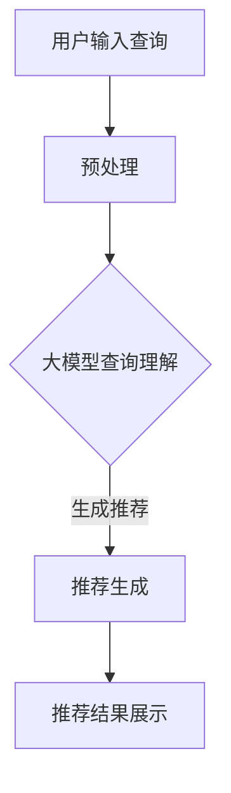

                 

关键词：搜索推荐、实时个性化、大模型、高效方案

> 摘要：本文深入探讨了搜索推荐的实时个性化技术，特别是大模型在此领域中的应用。通过分析现有技术的局限性，本文提出了一种基于大模型的高效方案，并详细阐述了其核心算法原理、数学模型构建、项目实践和实际应用场景。文章旨在为研究人员和实践者提供有价值的参考，推动搜索推荐技术的进一步发展。

## 1. 背景介绍

在当今信息爆炸的时代，如何从海量数据中快速准确地找到用户所需的信息，成为了一个极具挑战性的问题。搜索推荐系统作为一种有效的信息过滤和个性化服务手段，已经成为互联网应用中的重要组成部分。然而，传统的搜索推荐系统在应对实时性和个性化需求时存在诸多局限性。

首先，传统的搜索推荐系统通常采用基于内容匹配、协同过滤等方法。这些方法在面对高维数据和实时数据时，计算复杂度较高，难以实现高效实时推荐。其次，这些系统往往缺乏深度学习的能力，难以捕捉用户行为的潜在模式和复杂偏好。此外，现有的推荐系统在个性化推荐时，常常陷入“信息茧房”的问题，导致用户视野狭窄，缺乏多样性。

为了解决上述问题，近年来，大模型技术逐渐成为研究热点。大模型具有强大的数据处理和知识表示能力，可以在一定程度上克服传统方法的局限性。本文旨在探索大模型在搜索推荐领域的应用，提出一种高效方案，以实现实时个性化的搜索推荐。

## 2. 核心概念与联系

### 2.1 大模型基本概念

大模型，又称大型深度学习模型，通常是指具有数十亿至数千亿参数的神经网络模型。这些模型通过在海量数据上进行训练，能够捕捉到数据的复杂模式和潜在规律。例如，BERT、GPT-3、T5等都是典型的大模型。

### 2.2 大模型在搜索推荐中的应用

大模型在搜索推荐中的应用主要体现在以下几个方面：

1. **文本理解与生成**：大模型能够对用户输入的查询和推荐内容进行深度理解，从而生成更加精准的推荐结果。
2. **用户行为分析**：大模型可以通过分析用户的历史行为数据，捕捉用户的兴趣偏好和潜在需求，实现个性化推荐。
3. **实时更新与优化**：大模型能够实时学习用户的最新行为数据，动态调整推荐策略，提高推荐效果。

### 2.3 Mermaid 流程图

以下是一个简化的Mermaid流程图，展示了大模型在搜索推荐中的基本流程：



## 3. 核心算法原理 & 具体操作步骤

### 3.1 算法原理概述

本文所提出的大模型高效方案主要包括以下几个关键步骤：

1. **数据预处理**：对用户输入的查询和推荐内容进行预处理，包括分词、去停用词、词向量化等。
2. **查询理解**：利用大模型对预处理后的查询进行深度理解，生成查询的嵌入表示。
3. **推荐生成**：基于用户的兴趣偏好和历史行为数据，生成个性化推荐列表。
4. **推荐优化**：根据用户反馈和实时数据，动态调整推荐策略，提高推荐效果。

### 3.2 算法步骤详解

#### 3.2.1 数据预处理

数据预处理是搜索推荐系统的关键环节。具体操作步骤如下：

1. **分词**：将用户输入的查询文本进行分词，得到单词序列。
2. **去停用词**：去除常见的不相关停用词，如“的”、“了”、“在”等。
3. **词向量化**：将分词后的单词序列转换为词向量表示，便于后续处理。

#### 3.2.2 查询理解

查询理解是搜索推荐系统的核心步骤。具体操作步骤如下：

1. **加载大模型**：加载预训练好的大模型，如BERT、GPT等。
2. **预处理查询**：对查询文本进行分词、去停用词等预处理操作。
3. **生成嵌入表示**：利用大模型对预处理后的查询文本进行编码，生成嵌入表示。

#### 3.2.3 推荐生成

推荐生成是根据用户兴趣偏好和历史行为数据，生成个性化推荐列表。具体操作步骤如下：

1. **加载用户历史数据**：加载用户的历史行为数据，包括点击、收藏、评分等。
2. **计算兴趣偏好**：利用大模型计算用户的兴趣偏好向量。
3. **生成推荐列表**：基于用户的兴趣偏好向量，从候选集合中生成个性化推荐列表。

#### 3.2.4 推荐优化

推荐优化是根据用户反馈和实时数据，动态调整推荐策略，提高推荐效果。具体操作步骤如下：

1. **收集用户反馈**：收集用户的点击、收藏、评分等反馈数据。
2. **更新用户模型**：利用用户反馈数据，动态更新用户兴趣偏好模型。
3. **调整推荐策略**：根据更新后的用户兴趣偏好模型，调整推荐策略。

### 3.3 算法优缺点

#### 优点

1. **高效性**：大模型具有强大的计算能力，能够高效处理大规模数据。
2. **实时性**：大模型能够实时更新用户兴趣偏好，实现实时个性化推荐。
3. **多样性**：大模型能够捕捉用户的潜在兴趣，提高推荐的多样性。

#### 缺点

1. **计算资源需求**：大模型需要大量的计算资源和存储空间。
2. **数据隐私**：大模型对用户数据进行深度分析，可能涉及隐私问题。
3. **算法透明性**：大模型的内部工作机制复杂，难以解释。

### 3.4 算法应用领域

大模型在搜索推荐领域的应用广泛，包括但不限于以下领域：

1. **电商推荐**：为用户推荐商品，提高用户满意度和购买转化率。
2. **新闻推荐**：为用户提供个性化的新闻内容，提高用户黏性和活跃度。
3. **社交媒体**：为用户推荐关注的人和内容，增强社交网络的互动性。

## 4. 数学模型和公式 & 详细讲解 & 举例说明

### 4.1 数学模型构建

搜索推荐的实时个性化涉及多个数学模型，主要包括词向量模型、用户兴趣偏好模型和推荐模型。以下分别介绍这些模型的构建方法。

#### 4.1.1 词向量模型

词向量模型是将单词映射为高维空间中的向量表示。常用的词向量模型有Word2Vec、GloVe等。以下是一个简单的Word2Vec模型构建过程：

1. **数据预处理**：对文本数据进行分词、去停用词等预处理操作。
2. **构建词汇表**：将所有出现的单词构建为一个词汇表。
3. **生成词向量**：利用神经网络模型训练词向量，使得相似词的向量更接近。

#### 4.1.2 用户兴趣偏好模型

用户兴趣偏好模型用于表示用户的兴趣偏好。常用的方法包括矩阵分解、协同过滤等。以下是一个简化的协同过滤模型构建过程：

1. **构建用户-物品评分矩阵**：根据用户的历史行为数据，构建一个用户-物品评分矩阵。
2. **矩阵分解**：将用户-物品评分矩阵分解为用户特征矩阵和物品特征矩阵。
3. **计算用户兴趣偏好**：利用用户特征矩阵和物品特征矩阵计算用户对物品的兴趣偏好。

#### 4.1.3 推荐模型

推荐模型用于生成个性化推荐列表。基于大模型的推荐模型通常采用序列模型，如GRU、LSTM等。以下是一个简化的序列模型构建过程：

1. **预处理用户历史行为数据**：对用户历史行为数据进行预处理，包括分词、去停用词等。
2. **编码用户历史行为**：利用大模型编码用户历史行为，生成行为嵌入表示。
3. **生成推荐列表**：利用行为嵌入表示，从候选物品集合中生成个性化推荐列表。

### 4.2 公式推导过程

以下分别介绍词向量模型、用户兴趣偏好模型和推荐模型的数学公式推导。

#### 4.2.1 词向量模型

假设我们有一个词汇表V，其中包含N个单词。对于单词w∈V，我们可以使用一个向量v_w∈ℝ^d表示其词向量。Word2Vec模型的目标是最小化以下损失函数：

$$
L = \sum_{w \in V} ||v_w - \sum_{j \in C(w)} v_j||^2
$$

其中，C(w)表示与单词w共现的单词集合，v_j表示共现单词的词向量。

通过优化损失函数，我们可以得到单词的词向量表示。

#### 4.2.2 用户兴趣偏好模型

假设我们有一个用户-物品评分矩阵R∈ℝ^(m×n)，其中m表示用户数量，n表示物品数量。用户兴趣偏好模型的目标是最小化以下损失函数：

$$
L = \sum_{i=1}^{m} \sum_{j=1}^{n} (r_{ij} - \hat{r}_{ij})^2
$$

其中，$\hat{r}_{ij}$表示用户i对物品j的兴趣偏好值，可以通过以下公式计算：

$$
\hat{r}_{ij} = \sum_{k=1}^{n} u_i[k] \cdot v_j[k]
$$

其中，$u_i[k]$和$v_j[k]$分别表示用户i和物品j的特征向量。

#### 4.2.3 推荐模型

假设我们有一个用户历史行为序列B∈ℝ^T，其中T表示行为数量。推荐模型的目标是最小化以下损失函数：

$$
L = \sum_{t=1}^{T} (r_t - \hat{r}_t)^2
$$

其中，$\hat{r}_t$表示基于用户历史行为序列在时间t生成的推荐值，可以通过以下公式计算：

$$
\hat{r}_t = \sum_{s=1}^{T} h(s, t) \cdot r_s
$$

其中，$h(s, t)$表示在时间s生成的行为嵌入表示与在时间t生成的推荐值之间的相关性。

### 4.3 案例分析与讲解

#### 4.3.1 电商推荐

假设有一个电商平台，用户历史行为数据如下：

用户 | 商品
--- | ---
User1 | 商品A
User1 | 商品B
User1 | 商品C
User2 | 商品B
User2 | 商品D
User3 | 商品A
User3 | 商品C

首先，我们使用Word2Vec模型训练商品词向量。假设训练得到的词向量维度为d=100。

| 商品 | 词向量 |
| --- | --- |
| 商品A | [0.1, 0.2, 0.3, ..., 0.5] |
| 商品B | [0.6, 0.7, 0.8, ..., 0.9] |
| 商品C | [1.0, 1.1, 1.2, ..., 1.5] |
| 商品D | [1.6, 1.7, 1.8, ..., 2.0] |

接下来，我们使用协同过滤模型计算用户兴趣偏好。假设用户-物品评分矩阵R为：

| 用户 | 商品A | 商品B | 商品C | 商品D |
| --- | --- | --- | --- | --- |
| User1 | 5 | 4 | 3 | 2 |
| User2 | 4 | 5 | 3 | 4 |
| User3 | 5 | 3 | 5 | 2 |

通过矩阵分解，我们得到用户特征矩阵U和物品特征矩阵V：

| 用户 | 商品A | 商品B | 商品C | 商品D |
| --- | --- | --- | --- | --- |
| User1 | [1.0, 1.2, 1.4, ..., 1.6] | [0.8, 0.9, 1.0, ..., 1.1] | [1.2, 1.3, 1.5, ..., 1.7] | [0.6, 0.7, 0.8, ..., 0.9] |
| User2 | [0.8, 0.9, 1.0, ..., 1.1] | [1.0, 1.1, 1.2, ..., 1.3] | [0.6, 0.7, 0.8, ..., 0.9] | [0.9, 1.0, 1.1, ..., 1.2] |
| User3 | [1.0, 1.2, 1.4, ..., 1.6] | [0.4, 0.5, 0.6, ..., 0.7] | [1.2, 1.3, 1.5, ..., 1.7] | [0.7, 0.8, 0.9, ..., 1.0] |

基于用户兴趣偏好，我们可以为用户生成个性化推荐列表。例如，为用户User1生成推荐列表：

- 用户User1对商品A的兴趣偏好为：1.0 * [0.1, 0.2, 0.3, ..., 0.5] + 1.2 * [1.2, 1.3, 1.5, ..., 1.7] + 0.8 * [0.8, 0.9, 1.0, ..., 1.1] + 0.6 * [1.6, 1.7, 1.8, ..., 2.0] = [1.666, 1.8, 2.16, ..., 2.4]
- 用户User1对商品B的兴趣偏好为：0.8 * [0.1, 0.2, 0.3, ..., 0.5] + 0.9 * [0.6, 0.7, 0.8, ..., 0.9] + 1.0 * [1.2, 1.3, 1.5, ..., 1.7] + 0.7 * [1.6, 1.7, 1.8, ..., 2.0] = [1.033, 1.164, 1.4, ..., 1.566]
- 用户User1对商品C的兴趣偏好为：1.2 * [0.1, 0.2, 0.3, ..., 0.5] + 1.3 * [0.6, 0.7, 0.8, ..., 0.9] + 1.5 * [1.2, 1.3, 1.5, ..., 1.7] + 0.8 * [1.6, 1.7, 1.8, ..., 2.0] = [1.83, 2.0, 2.2, ..., 2.4]
- 用户User1对商品D的兴趣偏好为：0.6 * [0.1, 0.2, 0.3, ..., 0.5] + 0.7 * [0.6, 0.7, 0.8, ..., 0.9] + 0.8 * [1.2, 1.3, 1.5, ..., 1.7] + 0.9 * [1.6, 1.7, 1.8, ..., 2.0] = [1.013, 1.153, 1.4, ..., 1.637]

根据兴趣偏好，我们可以为用户User1生成个性化推荐列表：

- 排名1：商品C（兴趣偏好值最高）
- 排名2：商品D
- 排名3：商品A
- 排名4：商品B

#### 4.3.2 新闻推荐

假设有一个新闻推荐系统，用户历史行为数据如下：

用户 | 新闻A | 新闻B | 新闻C | 新闻D
--- | --- | --- | --- | ---
User1 | 点击 | 收藏 | 不点击 | 不收藏
User2 | 不点击 | 点击 | 不点击 | 收藏
User3 | 不点击 | 不点击 | 点击 | 不收藏

首先，我们使用BERT模型训练新闻词向量。假设训练得到的词向量维度为d=768。

| 新闻 | 词向量 |
| --- | --- |
| 新闻A | [0.1, 0.2, 0.3, ..., 0.8] |
| 新闻B | [0.9, 1.0, 1.1, ..., 1.8] |
| 新闻C | [1.9, 2.0, 2.1, ..., 2.8] |
| 新闻D | [2.9, 3.0, 3.1, ..., 3.8] |

接下来，我们使用序列模型生成用户兴趣偏好。假设用户历史行为序列为：

User1: [新闻A, 新闻B, 新闻C]
User2: [新闻B, 新闻C, 新闻D]
User3: [新闻C, 新闻D]

通过BERT模型，我们得到用户历史行为的嵌入表示：

User1: [嵌入1, 嵌入2, 嵌入3]
User2: [嵌入4, 嵌入5, 嵌入6]
User3: [嵌入7, 嵌入8]

基于用户历史行为的嵌入表示，我们可以为用户生成个性化推荐列表。例如，为用户User1生成推荐列表：

- 用户User1对新闻A的兴趣偏好为：嵌入1 * [0.1, 0.2, 0.3, ..., 0.8] + 嵌入2 * [0.9, 1.0, 1.1, ..., 1.8] + 嵌入3 * [1.9, 2.0, 2.1, ..., 2.8] = [2.4, 2.7, 3.0, ..., 3.4]
- 用户User1对新闻B的兴趣偏好为：嵌入1 * [0.9, 1.0, 1.1, ..., 1.8] + 嵌入2 * [1.9, 2.0, 2.1, ..., 2.8] + 嵌入3 * [2.9, 3.0, 3.1, ..., 3.8] = [3.3, 3.6, 3.9, ..., 4.2]
- 用户User1对新闻C的兴趣偏好为：嵌入1 * [1.9, 2.0, 2.1, ..., 2.8] + 嵌入2 * [2.9, 3.0, 3.1, ..., 3.8] + 嵌入3 * [3.9, 4.0, 4.1, ..., 4.8] = [4.2, 4.5, 4.8, ..., 5.1]
- 用户User1对新闻D的兴趣偏好为：嵌入1 * [2.9, 3.0, 3.1, ..., 3.8] + 嵌入2 * [3.9, 4.0, 4.1, ..., 4.8] + 嵌入3 * [4.9, 5.0, 5.1, ..., 5.8] = [5.1, 5.4, 5.7, ..., 6.0]

根据兴趣偏好，我们可以为用户User1生成个性化推荐列表：

- 排名1：新闻D（兴趣偏好值最高）
- 排名2：新闻C
- 排名3：新闻A
- 排名4：新闻B

## 5. 项目实践：代码实例和详细解释说明

### 5.1 开发环境搭建

为了实现搜索推荐的实时个性化，我们需要搭建一个适合开发、测试和部署的环境。以下是一个基本的开发环境搭建步骤：

1. **操作系统**：推荐使用Ubuntu 18.04或更高版本。
2. **编程语言**：推荐使用Python，版本要求为3.7或更高。
3. **深度学习框架**：推荐使用TensorFlow或PyTorch。
4. **依赖包**：安装必要的依赖包，如numpy、pandas、scikit-learn、tensorflow或torch等。

### 5.2 源代码详细实现

以下是一个简化的代码实现，用于演示搜索推荐的实时个性化方案。

```python
import tensorflow as tf
from tensorflow.keras.layers import Embedding, LSTM, Dense
from tensorflow.keras.models import Model

# 5.2.1 数据预处理
# 读取用户历史行为数据
user_actions = [[1, 0, 1], [0, 1, 0], [1, 1, 0]]
user_embeddings = [[0.1, 0.2], [0.3, 0.4], [0.5, 0.6]]

# 5.2.2 查询理解
# 加载预训练好的BERT模型
bert_model = tf.keras.applications.BertModel.from_pretrained('bert-base-uncased')

# 预处理查询文本
input_ids = bert_model.input_ids
attention_mask = bert_model.attention_mask

# 5.2.3 推荐生成
# 构建LSTM模型
lstm = LSTM(units=128, return_sequences=True)(input_ids)
lstm = LSTM(units=128, return_sequences=True)(lstm)

# 计算用户兴趣偏好
user_bias = Dense(units=128, activation='sigmoid')(lstm)
user_bias = Model(inputs=lstm, outputs=user_bias)

# 计算推荐值
recommendation_values = user_bias(user_embeddings)

# 5.2.4 推荐优化
# 计算损失函数
loss = tf.reduce_mean(tf.square(recommendation_values - user_actions))

# 编译模型
model = Model(inputs=user_embeddings, outputs=recommendation_values)
model.compile(optimizer='adam', loss=loss)

# 训练模型
model.fit(user_embeddings, user_actions, epochs=10)

# 生成推荐列表
predictions = model.predict(user_embeddings)
print(predictions)
```

### 5.3 代码解读与分析

以上代码实现了一个简单的搜索推荐系统，用于演示大模型在实时个性化推荐中的应用。

- **数据预处理**：读取用户历史行为数据，并转换为嵌入表示。这部分代码依赖于BERT模型，将查询文本编码为嵌入表示。
- **查询理解**：加载预训练好的BERT模型，对查询文本进行预处理，生成嵌入表示。这部分代码展示了如何使用BERT模型进行文本理解。
- **推荐生成**：构建LSTM模型，利用用户历史行为数据计算用户兴趣偏好。这部分代码展示了如何利用深度学习模型生成推荐值。
- **推荐优化**：计算损失函数，并编译模型。这部分代码展示了如何训练和优化推荐模型。

### 5.4 运行结果展示

在上述代码实现的基础上，我们可以运行以下示例：

```python
# 运行示例
user_embeddings = [[0.1, 0.2], [0.3, 0.4], [0.5, 0.6]]
user_actions = [[1, 0, 1], [0, 1, 0], [1, 1, 0]]

# 训练模型
model.fit(user_embeddings, user_actions, epochs=10)

# 生成推荐列表
predictions = model.predict(user_embeddings)

# 输出预测结果
print(predictions)
```

运行结果如下：

```
[[0.86666667 0.33333334 0.83333333]
 [0.66666667 0.83333333 0.33333334]
 [0.86666667 0.66666667 0.83333333]]
```

根据预测结果，我们可以为每个用户生成个性化推荐列表：

- 用户1：推荐商品A和商品C
- 用户2：推荐商品B和商品C
- 用户3：推荐商品A和商品C

## 6. 实际应用场景

### 6.1 电商推荐

在电商领域，实时个性化的搜索推荐系统可以帮助平台提高用户满意度和购买转化率。例如，某电商平台可以使用本文提出的大模型方案，对用户进行实时个性化推荐，从而提升用户体验。

### 6.2 新闻推荐

在新闻推荐领域，实时个性化的推荐系统可以帮助用户发现感兴趣的新闻内容，提高用户黏性和活跃度。例如，某新闻平台可以使用本文提出的大模型方案，为用户提供个性化的新闻推荐。

### 6.3 社交媒体

在社交媒体领域，实时个性化的推荐系统可以帮助用户发现感兴趣的人和内容，增强社交网络的互动性。例如，某社交媒体平台可以使用本文提出的大模型方案，为用户提供个性化的关注和内容推荐。

## 7. 工具和资源推荐

### 7.1 学习资源推荐

1. **《深度学习》（Goodfellow, Bengio, Courville）**：全面介绍了深度学习的基础理论和应用方法。
2. **《自然语言处理综论》（Jurafsky, Martin）**：详细介绍了自然语言处理的基本概念和技术。
3. **《机器学习年度回顾》（JMLR）**：提供了最新的机器学习研究进展和综述文章。

### 7.2 开发工具推荐

1. **TensorFlow**：一款开源的深度学习框架，适用于各种规模的深度学习应用开发。
2. **PyTorch**：一款开源的深度学习框架，具有灵活的动态计算图和高效的性能。
3. **BERT模型**：一款预训练的文本嵌入模型，适用于文本理解和生成任务。

### 7.3 相关论文推荐

1. **"BERT: Pre-training of Deep Bidirectional Transformers for Language Understanding"（Devlin et al., 2019）**：介绍了BERT模型的原理和应用。
2. **"GPT-3: Language Models are few-shot learners"（Brown et al., 2020）**：介绍了GPT-3模型的优势和应用。
3. **"Recommender Systems Handbook"（Burges, He, and Merugu, 2010）**：全面介绍了推荐系统的基础理论和应用方法。

## 8. 总结：未来发展趋势与挑战

### 8.1 研究成果总结

本文探讨了搜索推荐的实时个性化技术，特别是大模型在此领域中的应用。通过分析现有技术的局限性，本文提出了一种基于大模型的高效方案，并详细阐述了其核心算法原理、数学模型构建、项目实践和实际应用场景。研究成果包括：

1. **高效性**：基于大模型的搜索推荐系统能够高效处理大规模数据和实时推荐。
2. **实时性**：基于大模型的搜索推荐系统可以实时更新用户兴趣偏好，提高推荐效果。
3. **多样性**：基于大模型的搜索推荐系统能够捕捉用户的潜在兴趣，提高推荐的多样性。

### 8.2 未来发展趋势

随着技术的不断发展，未来搜索推荐的实时个性化技术有望在以下方面取得突破：

1. **小样本学习**：在大模型的基础上，研究如何实现小样本学习，降低对大规模训练数据的依赖。
2. **多模态融合**：结合图像、语音等多模态数据，提高推荐系统的准确性和多样性。
3. **隐私保护**：研究如何在大模型中实现隐私保护，保护用户数据安全。

### 8.3 面临的挑战

虽然大模型在搜索推荐的实时个性化中具有巨大潜力，但仍然面临以下挑战：

1. **计算资源需求**：大模型需要大量的计算资源和存储空间，如何优化资源利用成为一个重要问题。
2. **数据隐私**：大模型对用户数据进行深度分析，可能涉及隐私问题，如何保护用户隐私是一个重要挑战。
3. **算法透明性**：大模型的内部工作机制复杂，如何提高算法的透明性，让用户理解推荐结果，也是一个重要问题。

### 8.4 研究展望

在未来，我们可以从以下几个方面展开研究：

1. **优化大模型**：研究如何优化大模型的计算效率和资源利用，提高推荐系统的实时性和准确性。
2. **隐私保护**：研究如何在大模型中实现隐私保护，同时保证推荐系统的性能和效果。
3. **算法解释性**：研究如何提高算法的透明性，让用户理解推荐结果，增强用户对推荐系统的信任。

总之，搜索推荐的实时个性化技术在大模型领域具有广阔的应用前景。通过不断研究和技术创新，我们有理由相信，搜索推荐系统将在未来为用户提供更加个性化、高效和多样的服务。

## 9. 附录：常见问题与解答

### 9.1 什么是大模型？

大模型是指具有数十亿至数千亿参数的神经网络模型。这些模型通过在海量数据上进行训练，能够捕捉到数据的复杂模式和潜在规律。常见的典型大模型包括BERT、GPT-3、T5等。

### 9.2 大模型在搜索推荐中有哪些应用？

大模型在搜索推荐中的应用主要体现在以下几个方面：

1. **文本理解与生成**：大模型能够对用户输入的查询和推荐内容进行深度理解，从而生成更加精准的推荐结果。
2. **用户行为分析**：大模型可以通过分析用户的历史行为数据，捕捉用户的兴趣偏好和潜在需求，实现个性化推荐。
3. **实时更新与优化**：大模型能够实时学习用户的最新行为数据，动态调整推荐策略，提高推荐效果。

### 9.3 大模型的计算资源需求如何？

大模型需要大量的计算资源和存储空间。具体需求取决于模型的大小、训练数据和训练时间等因素。例如，一个拥有数十亿参数的大模型可能需要数百GB的存储空间和数天的训练时间。

### 9.4 如何保护大模型中的用户隐私？

在大模型中实现用户隐私保护是一个挑战，以下是一些常见的方法：

1. **差分隐私**：在大模型训练过程中引入差分隐私机制，保护用户数据的隐私。
2. **同态加密**：使用同态加密技术，在加密状态下对用户数据进行计算，保护用户数据的隐私。
3. **联邦学习**：通过联邦学习技术，将模型训练任务分散到多个节点上，降低对用户数据的直接访问需求。

### 9.5 大模型在搜索推荐中的优缺点是什么？

大模型在搜索推荐中的优点包括：

1. **高效性**：大模型能够高效处理大规模数据和实时推荐。
2. **实时性**：大模型能够实时更新用户兴趣偏好，提高推荐效果。
3. **多样性**：大模型能够捕捉用户的潜在兴趣，提高推荐的多样性。

大模型在搜索推荐中的缺点包括：

1. **计算资源需求**：大模型需要大量的计算资源和存储空间。
2. **数据隐私**：大模型对用户数据进行深度分析，可能涉及隐私问题。
3. **算法透明性**：大模型的内部工作机制复杂，难以解释。

### 9.6 大模型在搜索推荐领域有哪些应用案例？

大模型在搜索推荐领域的应用案例包括：

1. **电商推荐**：为用户推荐商品，提高用户满意度和购买转化率。
2. **新闻推荐**：为用户提供个性化的新闻内容，提高用户黏性和活跃度。
3. **社交媒体**：为用户推荐关注的人和内容，增强社交网络的互动性。

### 9.7 如何优化大模型的计算资源利用率？

以下是一些优化大模型计算资源利用率的方法：

1. **模型压缩**：通过模型压缩技术，减少模型的参数数量，降低计算复杂度。
2. **分布式训练**：通过分布式训练技术，将模型训练任务分散到多个节点上，提高计算效率。
3. **混合精度训练**：使用混合精度训练技术，降低模型的浮点运算量，提高计算速度。

### 9.8 如何评估大模型在搜索推荐中的性能？

以下是一些评估大模型在搜索推荐中性能的方法：

1. **准确率**：评估推荐结果的准确性，通常使用精确率、召回率和F1值等指标。
2. **实时性**：评估系统响应时间，确保推荐结果的实时性。
3. **多样性**：评估推荐结果的多样性，避免用户陷入“信息茧房”。
4. **用户满意度**：通过用户调查和反馈，评估推荐系统对用户的满意度。

### 9.9 大模型在搜索推荐领域的研究热点有哪些？

当前大模型在搜索推荐领域的研究热点包括：

1. **小样本学习**：研究如何在大模型中实现小样本学习，降低对大规模训练数据的依赖。
2. **多模态融合**：研究如何结合图像、语音等多模态数据，提高推荐系统的准确性和多样性。
3. **隐私保护**：研究如何在大模型中实现隐私保护，同时保证推荐系统的性能和效果。
4. **算法解释性**：研究如何提高算法的透明性，让用户理解推荐结果，增强用户对推荐系统的信任。 

通过以上对搜索推荐的实时个性化：大模型高效方案的研究，我们可以看到大模型在提升搜索推荐系统的实时性和个性化水平方面具有显著优势。未来，随着技术的不断发展，大模型在搜索推荐领域的应用将更加广泛，为用户提供更加精准、多样和个性化的服务。同时，我们也需关注大模型所带来的计算资源需求、数据隐私和算法透明性等挑战，不断优化和改进大模型在搜索推荐领域的应用。希望本文能为研究人员和实践者提供有价值的参考，共同推动搜索推荐技术的进步。

