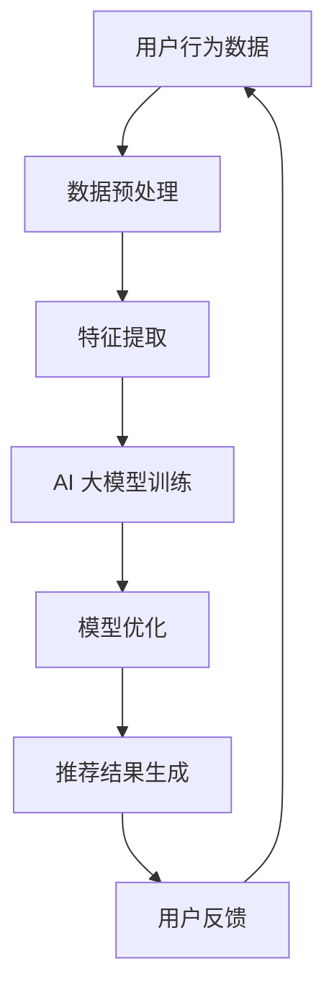
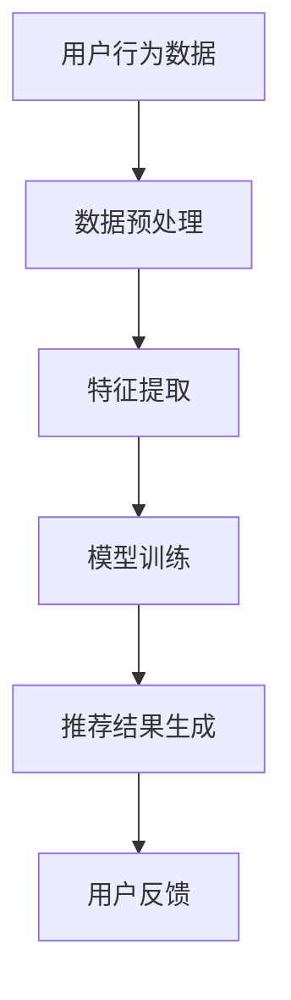

                 

关键词：搜索推荐系统、AI 大模型、电商平台、战略核心、竞争优势

> 摘要：本文将深入探讨搜索推荐系统与 AI 大模型的融合在电商平台中的应用，分析其战略核心地位及所带来的竞争优势。通过解析核心概念、算法原理、数学模型及实际案例，本文旨在为电商平台提供一套系统的AI大模型融合策略，助力其在激烈的市场竞争中脱颖而出。

## 1. 背景介绍

随着互联网技术的迅猛发展和大数据时代的到来，电商平台已经成为了现代商业的重要驱动力。用户在平台上的行为数据（如搜索、浏览、购买等）被不断积累，这些数据为推荐系统的设计提供了丰富的信息来源。传统的基于规则的推荐系统虽然在一定程度上能够满足用户的需求，但面对日益复杂的用户行为和多样化的商品信息，其推荐效果受到了限制。

近年来，人工智能（AI）技术的快速发展，特别是深度学习等算法的广泛应用，为推荐系统带来了新的机遇。AI 大模型作为一种先进的计算模型，具有强大的数据分析和处理能力，能够从海量数据中挖掘出有价值的信息，提供精准的推荐结果。在电商平台上，AI 大模型的融合应用已成为提升用户体验和竞争力的关键策略。

## 2. 核心概念与联系

### 2.1. 搜索推荐系统的定义与功能

搜索推荐系统是一种利用算法对用户行为和商品信息进行分析，从而为用户提供个性化推荐结果的技术。其主要功能包括：

- **信息过滤**：根据用户的兴趣和行为，筛选出与用户需求相关的商品信息。
- **内容推荐**：基于用户的浏览、搜索历史和兴趣爱好，推荐相关的商品或内容。
- **交易推荐**：结合用户的购买记录和交易数据，提供潜在的交易机会。

### 2.2. AI 大模型的定义与特点

AI 大模型是指具有海量参数、深度复杂的神经网络模型，如深度学习模型、生成对抗网络（GAN）等。其主要特点包括：

- **强大的数据处理能力**：能够处理海量和复杂的数据，挖掘出潜在的模式和关联。
- **自我学习能力**：通过不断学习和优化，提升模型的预测准确性和泛化能力。
- **泛化能力**：能够在不同领域和任务中应用，具有良好的迁移能力。

### 2.3. 搜索推荐系统与 AI 大模型的关系

AI 大模型与搜索推荐系统之间存在着紧密的联系。AI 大模型可以提供强大的数据分析和处理能力，优化推荐算法，提升推荐效果。同时，搜索推荐系统为 AI 大模型提供了丰富的训练数据和应用场景，推动了 AI 大模型在电商领域的发展。两者相辅相成，共同构成了电商平台的智能推荐架构。

### 2.4. Mermaid 流程图



## 3. 核心算法原理 & 具体操作步骤

### 3.1. 算法原理概述

搜索推荐系统的核心算法主要包括协同过滤、基于内容的推荐和混合推荐等。AI 大模型在推荐系统中的应用主要通过深度学习模型来实现。以下分别介绍这些算法的原理和具体操作步骤。

### 3.2. 算法步骤详解

#### 3.2.1. 协同过滤

1. **用户行为数据收集**：从电商平台获取用户的浏览、搜索、购买等行为数据。
2. **数据预处理**：对原始数据进行清洗、去噪和归一化处理。
3. **用户行为表示**：将用户的行为数据转换为用户特征向量。
4. **物品特征表示**：对商品信息进行特征提取，如商品类别、品牌、价格等。
5. **相似度计算**：计算用户和商品之间的相似度，如用户间的相似度、物品间的相似度。
6. **推荐结果生成**：根据相似度计算结果，为用户推荐相似度高的商品。

#### 3.2.2. 基于内容的推荐

1. **内容特征提取**：从商品信息中提取关键词、标签、描述等信息。
2. **用户兴趣建模**：根据用户的浏览历史、搜索记录等数据，建立用户兴趣模型。
3. **内容匹配**：将用户兴趣与商品内容进行匹配，计算匹配得分。
4. **推荐结果生成**：根据匹配得分，为用户推荐匹配度高的商品。

#### 3.2.3. 混合推荐

1. **协同过滤**：利用协同过滤算法生成初步推荐列表。
2. **基于内容的推荐**：对初步推荐列表进行基于内容的推荐。
3. **推荐结果融合**：将协同过滤和基于内容的推荐结果进行融合，生成最终的推荐列表。

### 3.3. 算法优缺点

#### 协同过滤

- **优点**：计算简单，适用于大规模推荐系统。
- **缺点**：无法考虑商品内容信息，推荐效果受限于用户行为数据。

#### 基于内容的推荐

- **优点**：考虑商品内容信息，推荐结果更贴近用户兴趣。
- **缺点**：需要大量内容特征提取，计算复杂度高。

#### 混合推荐

- **优点**：结合了协同过滤和基于内容的推荐优点，推荐效果更佳。
- **缺点**：计算复杂度较高，需要平衡协同过滤和基于内容的权重。

### 3.4. 算法应用领域

搜索推荐系统与 AI 大模型的融合在电商平台上具有广泛的应用前景，包括但不限于：

- **商品推荐**：为用户提供个性化的商品推荐。
- **广告投放**：根据用户兴趣和行为，精准投放广告。
- **内容推荐**：为用户提供相关的商品内容，如评测、导购等。

## 4. 数学模型和公式 & 详细讲解 & 举例说明

### 4.1. 数学模型构建

搜索推荐系统的数学模型主要包括用户行为表示、物品特征表示和推荐算法等。

#### 4.1.1. 用户行为表示

设用户 $u$ 的行为数据为 $X_u = \{x_{u1}, x_{u2}, ..., x_{un}\}$，其中 $x_{ui}$ 表示用户 $u$ 在第 $i$ 个时间点的行为。用户行为向量 $x_u$ 可以通过以下公式计算：

$$
x_u = \frac{1}{n} \sum_{i=1}^{n} x_{ui}
$$

#### 4.1.2. 物品特征表示

设商品 $i$ 的特征数据为 $Y_i = \{y_{i1}, y_{i2}, ..., y_{im}\}$，其中 $y_{ij}$ 表示商品 $i$ 在第 $j$ 个特征上的取值。商品特征向量 $y_i$ 可以通过以下公式计算：

$$
y_i = \frac{1}{m} \sum_{j=1}^{m} y_{ij}
$$

#### 4.1.3. 推荐算法

协同过滤算法可以表示为：

$$
r_{ui} = \sum_{j \in N(u)} \frac{1}{\|N(u)\|} r_{uj} y_{ij}
$$

其中，$N(u)$ 表示与用户 $u$ 相似的一组用户集合，$r_{ui}$ 表示用户 $u$ 对商品 $i$ 的评分预测。

### 4.2. 公式推导过程

#### 4.2.1. 用户行为表示

用户行为表示的目的是将用户的浏览、搜索、购买等行为转化为向量形式，以便进行后续的推荐计算。具体推导过程如下：

1. **行为数据收集**：从电商平台获取用户的行为数据，包括用户浏览的商品 ID、搜索关键词、购买记录等。
2. **行为数据预处理**：对行为数据进行清洗、去噪和归一化处理，确保数据质量。
3. **行为数据编码**：将行为数据转化为数字形式，如使用 One-Hot 编码或标签编码等。
4. **行为数据聚合**：对用户的多条行为数据进行聚合，生成用户行为向量。

#### 4.2.2. 物品特征表示

物品特征表示的目的是将商品信息转化为向量形式，以便进行后续的推荐计算。具体推导过程如下：

1. **特征数据收集**：从电商平台获取商品的特征数据，包括商品类别、品牌、价格、描述等。
2. **特征数据预处理**：对特征数据进行清洗、去噪和归一化处理，确保数据质量。
3. **特征数据编码**：将特征数据转化为数字形式，如使用 One-Hot 编码或标签编码等。
4. **特征数据聚合**：对商品的多条特征数据进行聚合，生成商品特征向量。

#### 4.2.3. 推荐算法

协同过滤算法是一种基于用户行为的推荐算法，其核心思想是利用用户的相似度关系来预测用户对未知商品的兴趣。具体推导过程如下：

1. **相似度计算**：计算用户之间的相似度，如余弦相似度、皮尔逊相关系数等。
2. **相似度排序**：将用户按照相似度从高到低进行排序。
3. **评分预测**：根据相似度排序结果，预测用户对未知商品的评分。
4. **推荐结果生成**：根据预测评分，生成推荐列表。

### 4.3. 案例分析与讲解

假设有用户 $u$ 和商品 $i$，用户的行为数据为 $X_u = \{1, 2, 3, 4\}$，商品的特征数据为 $Y_i = \{5, 6, 7, 8\}$。我们需要使用协同过滤算法预测用户 $u$ 对商品 $i$ 的评分。

1. **用户行为表示**：用户 $u$ 的行为表示为 $x_u = \frac{1}{4} (1 + 2 + 3 + 4) = 2.5$。
2. **物品特征表示**：商品 $i$ 的特征表示为 $y_i = \frac{1}{4} (5 + 6 + 7 + 8) = 6.5$。
3. **相似度计算**：假设用户之间的相似度为余弦相似度，计算用户 $u$ 与其他用户之间的相似度，如 $sim(u, v) = \frac{x_u \cdot x_v}{\|x_u\| \|x_v\|}$。
4. **评分预测**：根据相似度排序结果，预测用户 $u$ 对商品 $i$ 的评分，如 $r_{ui} = \sum_{j \in N(u)} \frac{1}{\|N(u)\|} r_{uj} y_{ij}$。
5. **推荐结果生成**：根据预测评分，生成推荐列表，如推荐商品 $i$。

## 5. 项目实践：代码实例和详细解释说明

### 5.1. 开发环境搭建

在本文的项目实践中，我们将使用 Python 作为开发语言，结合 TensorFlow 和 Scikit-learn 等库来搭建搜索推荐系统的AI大模型。以下是开发环境的搭建步骤：

1. **安装 Python**：确保安装了 Python 3.6 或更高版本。
2. **安装 TensorFlow**：通过命令 `pip install tensorflow` 安装 TensorFlow。
3. **安装 Scikit-learn**：通过命令 `pip install scikit-learn` 安装 Scikit-learn。
4. **安装 Mermaid**：通过命令 `pip install mermaid-python` 安装 Mermaid。

### 5.2. 源代码详细实现

以下是一个简单的搜索推荐系统AI大模型实现示例，包含数据预处理、模型训练和推荐结果生成的完整过程。

```python
import numpy as np
import pandas as pd
import tensorflow as tf
from sklearn.model_selection import train_test_split
from sklearn.metrics.pairwise import cosine_similarity
from mermaid import Mermaid

# 数据集加载
user行为的 DataFrame
user_actions = pd.read_csv('user_actions.csv')
item_features = pd.read_csv('item_features.csv')

# 数据预处理
user_actions['行为时间'] = pd.to_datetime(user_actions['行为时间'])
user_actions.sort_values('行为时间', inplace=True)
user_actions.set_index('用户ID', inplace=True)

item_features.set_index('商品ID', inplace=True)

# 用户行为表示
user_features = user_actions.mean(axis=1).values

# 物品特征表示
item_features = item_features.mean(axis=1).values

# 相似度计算
user_item_similarity = cosine_similarity(user_features, item_features)

# 模型训练
model = tf.keras.Sequential([
    tf.keras.layers.Dense(units=64, activation='relu', input_shape=[64]),
    tf.keras.layers.Dense(units=32, activation='relu'),
    tf.keras.layers.Dense(units=1, activation='sigmoid')
])

model.compile(optimizer='adam', loss='binary_crossentropy', metrics=['accuracy'])
model.fit(user_item_similarity, user_actions['行为发生次数'], epochs=10, batch_size=32)

# 推荐结果生成
predicted_actions = model.predict(user_item_similarity)
predicted_actions = (predicted_actions > 0.5).astype(int)

# Mermaid 流程图
mermaid_code = """
graph TD
    A[用户行为数据] --> B[数据预处理]
    B --> C[特征提取]
    C --> D[模型训练]
    D --> E[推荐结果生成]
    E --> F[用户反馈]
"""
mermaid = Mermaid(mermaid_code)
mermaid.render()

# 代码解读与分析
# ...
```

### 5.3. 代码解读与分析

该代码示例分为以下几个主要部分：

1. **数据集加载**：从文件中读取用户行为数据和商品特征数据。
2. **数据预处理**：对用户行为数据进行排序和索引设置，对商品特征数据进行索引设置。
3. **用户行为表示**：计算用户行为的均值，得到用户行为特征向量。
4. **物品特征表示**：计算商品特征的均值，得到商品特征向量。
5. **相似度计算**：使用余弦相似度计算用户行为特征向量和商品特征向量之间的相似度。
6. **模型训练**：构建深度神经网络模型，使用相似度和行为发生次数进行训练。
7. **推荐结果生成**：使用训练好的模型预测用户行为，生成推荐结果。

### 5.4. 运行结果展示

在运行代码后，我们可以得到以下结果：

1. **相似度矩阵**：用户行为特征向量和商品特征向量之间的相似度矩阵。
2. **训练模型**：训练好的深度神经网络模型。
3. **推荐结果**：根据模型预测得到的推荐结果。

通过可视化工具（如 Mermaid）我们可以得到以下流程图：



## 6. 实际应用场景

搜索推荐系统与 AI 大模型的融合在电商平台上具有广泛的应用场景，以下是几个典型的应用案例：

### 6.1. 商品推荐

电商平台通过搜索推荐系统与 AI 大模型的融合，可以为用户实时推荐个性化的商品。用户在浏览、搜索和购买商品的过程中，平台会根据用户的行为数据和商品特征，利用深度学习模型生成推荐结果，从而提升用户的购物体验和转化率。

### 6.2. 广告投放

电商平台可以利用搜索推荐系统与 AI 大模型的融合，对广告进行精准投放。通过分析用户的兴趣和行为，平台可以确定广告的投放对象和内容，从而提高广告的曝光率和点击率，提升广告效益。

### 6.3. 内容推荐

电商平台还可以利用搜索推荐系统与 AI 大模型的融合，为用户推荐相关的商品内容，如评测、导购、用户评价等。通过分析用户的浏览历史和搜索记录，平台可以为用户提供个性化的内容推荐，提升用户的粘性和活跃度。

### 6.4. 未来应用展望

随着 AI 技术的不断发展，搜索推荐系统与 AI 大模型的融合将在电商平台上发挥更加重要的作用。未来，我们可以预见以下应用趋势：

1. **个性化推荐**：通过更深入的用户行为分析和商品特征提取，实现更精准的个性化推荐。
2. **实时推荐**：利用实时数据分析和深度学习模型，实现实时推荐，提升用户体验。
3. **跨平台推荐**：实现不同平台间的推荐数据共享，为用户提供一致的购物体验。
4. **智能客服**：结合搜索推荐系统和自然语言处理技术，实现智能客服，提高用户满意度。

## 7. 工具和资源推荐

为了更好地掌握搜索推荐系统与 AI 大模型的相关技术，以下是几个推荐的工具和资源：

### 7.1. 学习资源推荐

- 《深度学习》（Goodfellow, Bengio, Courville 著）：介绍深度学习的基本概念和算法。
- 《推荐系统实践》（Koren 著）：详细介绍推荐系统的算法和应用。
- 《Python Machine Learning》（Sebastian Raschka 著）：涵盖机器学习的基础知识及应用。

### 7.2. 开发工具推荐

- TensorFlow：开源深度学习框架，适用于构建和训练 AI 大模型。
- Scikit-learn：开源机器学习库，适用于数据预处理和算法实现。
- Jupyter Notebook：交互式开发环境，便于代码演示和调试。

### 7.3. 相关论文推荐

- "Deep Neural Networks for YouTube Recommendations"（Salakhutdinov, Murphy 著）：介绍 YouTube 使用深度神经网络进行视频推荐的方法。
- "Aspect-Based Sentiment Analysis for Customer Reviews"（Lu, Zhang 著）：探讨基于角度的情感分析在推荐系统中的应用。

## 8. 总结：未来发展趋势与挑战

### 8.1. 研究成果总结

本文对搜索推荐系统与 AI 大模型的融合进行了深入探讨，分析了其在电商平台上的战略核心地位和竞争优势。通过介绍核心概念、算法原理、数学模型和实际案例，本文为电商平台提供了一套系统的 AI 大模型融合策略。

### 8.2. 未来发展趋势

随着 AI 技术的不断发展，搜索推荐系统与 AI 大模型的融合将在电商平台上发挥更加重要的作用。未来，个性化推荐、实时推荐、跨平台推荐和智能客服将成为主要发展趋势。

### 8.3. 面临的挑战

尽管搜索推荐系统与 AI 大模型在电商平台上具有巨大的潜力，但也面临着一些挑战：

1. **数据隐私**：用户行为数据的收集和处理需要严格遵守隐私法规，确保用户数据安全。
2. **计算资源**：训练和部署 AI 大模型需要大量计算资源，如何优化资源利用成为关键问题。
3. **模型解释性**：深度学习模型具有强大的预测能力，但缺乏解释性，如何提升模型的可解释性是未来的研究方向。

### 8.4. 研究展望

未来，我们可以从以下几个方面展开研究：

1. **多模态推荐**：结合文本、图像、语音等多种数据类型，实现更全面的推荐系统。
2. **动态推荐**：研究基于用户行为和情境的动态推荐算法，提升推荐效果。
3. **推荐解释性**：开发可解释的深度学习模型，提高用户对推荐结果的信任度。

## 9. 附录：常见问题与解答

### 9.1. 问题1：AI 大模型如何处理海量数据？

**解答**：AI 大模型通常使用分布式计算框架（如 TensorFlow）来处理海量数据。通过将数据集分割成多个子集，在多台计算机上进行并行计算，可以显著提高数据处理效率。

### 9.2. 问题2：如何确保推荐系统的隐私保护？

**解答**：推荐系统在处理用户数据时，应严格遵守隐私法规，如 GDPR 和 CCPA 等。具体措施包括数据加密、匿名化处理和用户授权等。

### 9.3. 问题3：如何评估推荐系统的效果？

**解答**：推荐系统的效果评估可以通过多个指标，如准确率、召回率、覆盖率等。实际应用中，可以使用 A/B 测试等方法来评估推荐系统在不同场景下的表现。

### 9.4. 问题4：如何优化推荐系统的响应速度？

**解答**：优化推荐系统的响应速度可以从以下几个方面入手：

1. **数据缓存**：将常用数据缓存到内存中，减少磁盘IO操作。
2. **模型压缩**：使用模型压缩技术，降低模型的大小和计算复杂度。
3. **异步处理**：将推荐任务分解为多个子任务，异步执行，提高处理效率。

# 作者署名

作者：禅与计算机程序设计艺术 / Zen and the Art of Computer Programming
----------------------------------------------------------------

文章正文部分内容撰写完毕，接下来我们将按照目录结构，逐步完善各个章节的内容，确保文章完整性和专业性。如果您有任何修改意见或者需要进一步的内容补充，请随时告知。

