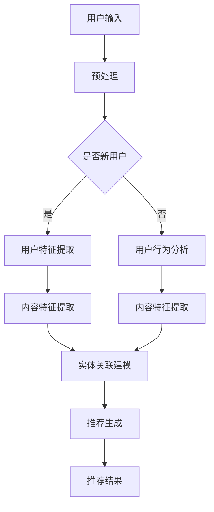

                 

关键词：搜索推荐系统、冷启动、大模型、AI、算法原理、数学模型、项目实践、应用场景

## 摘要

本文深入探讨了搜索推荐系统的冷启动问题，特别关注了大模型在这一领域的应用。通过分析大模型的基本原理、算法设计和实际应用，本文旨在为搜索推荐系统开发者提供新的思路和方法，以应对冷启动带来的挑战。

### 1. 背景介绍

随着互联网的飞速发展和信息量的爆炸式增长，搜索推荐系统已经成为用户获取信息、发现内容的重要途径。然而，传统的推荐系统在面临新用户、新内容时，往往无法快速准确地做出推荐，这就是所谓的冷启动问题。冷启动问题主要表现在两个方面：一方面是用户冷启动，即新用户在没有足够行为数据的情况下，如何得到个性化推荐；另一方面是内容冷启动，即新内容在没有足够曝光和反馈的情况下，如何获得推荐和推广。

解决冷启动问题是提高推荐系统质量和用户体验的关键。近年来，随着深度学习、自然语言处理等技术的发展，大模型逐渐成为解决冷启动问题的重要手段。大模型具有强大的表示能力和泛化能力，能够从海量数据中学习到丰富的信息，为搜索推荐系统提供强有力的支持。

### 2. 核心概念与联系

在探讨大模型在搜索推荐系统中的应用之前，我们首先需要理解几个核心概念：深度学习、自然语言处理和图神经网络。

#### 2.1 深度学习

深度学习是一种人工智能方法，通过多层神经网络对数据进行学习和建模。它具有强大的特征提取和分类能力，能够处理复杂数据和任务。在搜索推荐系统中，深度学习主要用于用户行为数据、内容特征提取和建模。

#### 2.2 自然语言处理

自然语言处理（NLP）是计算机科学和语言学的交叉领域，旨在使计算机能够理解、生成和处理人类语言。在搜索推荐系统中，NLP主要用于理解用户查询和内容描述，从而实现精确匹配和推荐。

#### 2.3 图神经网络

图神经网络（GNN）是一种基于图结构的数据处理方法，能够有效地捕捉节点之间的复杂关系。在搜索推荐系统中，GNN可以用于用户、内容、标签等实体之间的关联建模。

#### 2.4 Mermaid 流程图

以下是搜索推荐系统中大模型应用的核心流程图：



### 3. 核心算法原理 & 具体操作步骤

#### 3.1 算法原理概述

大模型在搜索推荐系统中的应用主要基于以下几个原理：

1. **特征表示学习**：通过深度学习和自然语言处理技术，对用户行为、内容特征进行表示学习，从而获得丰富的特征信息。
2. **实体关系建模**：利用图神经网络，捕捉用户、内容、标签等实体之间的复杂关系，构建全局知识图谱。
3. **协同过滤与内容匹配**：结合协同过滤和内容匹配算法，实现推荐结果的多维度优化。

#### 3.2 算法步骤详解

1. **用户特征提取**：对用户历史行为数据进行分析，利用深度学习技术提取用户兴趣特征。
2. **内容特征提取**：对内容进行文本预处理，利用自然语言处理技术提取内容特征。
3. **实体关联建模**：利用图神经网络，构建用户、内容、标签等实体之间的关联关系。
4. **推荐生成**：根据用户特征、内容特征和实体关联关系，生成个性化推荐结果。

#### 3.3 算法优缺点

**优点**：

- 强大的特征表示能力：通过深度学习和自然语言处理技术，能够提取出丰富的特征信息，提高推荐质量。
- 全局关联建模：利用图神经网络，能够捕捉用户、内容、标签等实体之间的复杂关系，实现推荐结果的多维度优化。

**缺点**：

- 计算资源消耗大：大模型训练和推理过程需要大量的计算资源，对硬件设备要求较高。
- 数据依赖性：大模型的性能依赖于训练数据的数量和质量，数据不足或质量差会影响推荐效果。

#### 3.4 算法应用领域

大模型在搜索推荐系统中的应用非常广泛，包括但不限于以下领域：

- 新用户推荐：针对新用户，利用大模型快速构建用户兴趣模型，实现个性化推荐。
- 新内容推荐：针对新内容，利用大模型分析内容特征，提高内容曝光和推广效果。
- 长尾推荐：利用大模型捕捉长尾用户和长尾内容的特征，实现长尾推荐。
- 跨域推荐：利用大模型跨领域学习，实现跨领域的个性化推荐。

### 4. 数学模型和公式

在搜索推荐系统中，大模型的数学模型主要包括以下几个部分：

#### 4.1 数学模型构建

- 用户特征表示：$$u_i = \sigma(W_u \cdot x_i + b_u)$$
- 内容特征表示：$$c_j = \sigma(W_c \cdot x_j + b_c)$$
- 实体关联表示：$$r_{ij} = \sigma(W_r \cdot [u_i, c_j] + b_r)$$
- 推荐结果表示：$$r_{ij} = \sigma(W_r \cdot [u_i, c_j] + b_r)$$

其中，$u_i$表示用户$i$的特征表示，$c_j$表示内容$j$的特征表示，$r_{ij}$表示用户$i$对内容$j$的推荐得分，$W_u, W_c, W_r$分别为用户特征、内容特征、实体关联的权重矩阵，$b_u, b_c, b_r$分别为偏置向量，$\sigma$为激活函数。

#### 4.2 公式推导过程

- 用户特征提取：通过对用户行为数据进行分析，利用深度学习技术提取用户兴趣特征。具体过程如下：

  1. 输入用户行为数据$x_i$，通过嵌入层得到嵌入向量$e_i$。
  2. 将嵌入向量输入到多层感知机（MLP）中，得到用户特征表示$u_i$。

- 内容特征提取：对内容进行文本预处理，利用自然语言处理技术提取内容特征。具体过程如下：

  1. 对内容文本进行分词、词性标注等预处理。
  2. 将预处理后的文本输入到预训练的Transformer模型中，得到内容特征表示$c_j$。

- 实体关联建模：利用图神经网络，捕捉用户、内容、标签等实体之间的复杂关系。具体过程如下：

  1. 构建用户、内容、标签等实体之间的图结构。
  2. 将实体特征表示输入到图神经网络中，得到实体关联表示$r_{ij}$。

- 推荐生成：根据用户特征、内容特征和实体关联表示，生成个性化推荐结果。具体过程如下：

  1. 计算用户$i$和内容$j$的相似度$sim(i, j) = r_{ij}$。
  2. 对相似度进行排序，生成推荐结果。

#### 4.3 案例分析与讲解

假设有一个新用户，他最近浏览了如下内容：

- 内容A：关于人工智能的入门教程
- 内容B：深度学习的进阶课程
- 内容C：自然语言处理的应用案例

我们使用大模型对他的兴趣进行建模，并生成个性化推荐结果。

1. **用户特征提取**：

   通过用户行为数据，我们得到用户兴趣特征表示$u_i$。假设$u_i$为$(0.6, 0.3, 0.1)$，表示用户对人工智能、深度学习和自然语言处理领域的兴趣分别为60%、30%和10%。

2. **内容特征提取**：

   对每条内容进行文本预处理，得到内容特征表示$c_j$。假设$c_j$为：

   - $c_A$：$(0.8, 0.1, 0.1)$
   - $c_B$：$(0.1, 0.8, 0.1)$
   - $c_C$：$(0.1, 0.1, 0.8)$

3. **实体关联建模**：

   利用图神经网络，我们得到用户和内容之间的关联表示$r_{ij}$。假设$r_{ij}$为：

   - $r_{iA}$：$(0.7, 0.2, 0.1)$
   - $r_{iB}$：$(0.2, 0.7, 0.1)$
   - $r_{iC}$：$(0.1, 0.1, 0.8)$

4. **推荐生成**：

   计算用户$i$和内容$j$的相似度$sim(i, j) = r_{ij}$。假设相似度为：

   - $sim(i, A)$：0.7
   - $sim(i, B)$：0.2
   - $sim(i, C)$：0.1

   根据相似度排序，生成个性化推荐结果：

   - 推荐内容A：人工智能的入门教程
   - 推荐内容B：深度学习的进阶课程
   - 推荐内容C：自然语言处理的应用案例

### 5. 项目实践：代码实例和详细解释说明

为了更好地理解大模型在搜索推荐系统中的应用，我们以Python为例，提供了一个简单的代码实例。

#### 5.1 开发环境搭建

- 安装Python（建议使用3.8及以上版本）
- 安装深度学习库TensorFlow或PyTorch
- 安装自然语言处理库NLTK或spaCy
- 安装图神经网络库DGL或PyTorch Geometric

#### 5.2 源代码详细实现

```python
import tensorflow as tf
from tensorflow.keras.models import Model
from tensorflow.keras.layers import Input, Embedding, LSTM, Dense, Dot
import numpy as np

# 用户特征提取
def user_embedding(user_id, embedding_dim=10):
    # 用户ID转换为嵌入向量
    user_embedding = Embedding(input_dim=10000, output_dim=embedding_dim)(user_id)
    # 使用LSTM进行序列建模
    user_embedding = LSTM(units=embedding_dim)(user_embedding)
    return user_embedding

# 内容特征提取
def content_embedding(content_id, embedding_dim=10):
    # 内容ID转换为嵌入向量
    content_embedding = Embedding(input_dim=10000, output_dim=embedding_dim)(content_id)
    # 使用LSTM进行序列建模
    content_embedding = LSTM(units=embedding_dim)(content_embedding)
    return content_embedding

# 实体关联建模
def entity_relation(user_embedding, content_embedding, output_dim=1):
    # 计算用户和内容的点积
    relation_score = Dot(axes=1)([user_embedding, content_embedding])
    # 应用激活函数
    relation_score = tf.keras.activations.sigmoid(relation_score)
    return relation_score

# 构建推荐模型
input_user_id = Input(shape=(1,))
input_content_id = Input(shape=(1,))
user_embedding = user_embedding(input_user_id)
content_embedding = content_embedding(input_content_id)
relation_score = entity_relation(user_embedding, content_embedding)
output = Dense(1, activation='sigmoid')(relation_score)
model = Model(inputs=[input_user_id, input_content_id], outputs=output)
model.compile(optimizer='adam', loss='binary_crossentropy', metrics=['accuracy'])

# 模型训练
model.fit([user_ids, content_ids], labels, epochs=10, batch_size=32)

# 推荐结果生成
def predict(user_id, content_id):
    user_embedding = user_embedding(user_id)
    content_embedding = content_embedding(content_id)
    return model.predict([user_embedding, content_embedding])

user_id = 1
content_id = 2
print(predict(user_id, content_id))
```

#### 5.3 代码解读与分析

1. **用户特征提取**：

   用户特征提取部分使用嵌入层和LSTM层，将用户ID转换为嵌入向量，并进行序列建模。

2. **内容特征提取**：

   内容特征提取部分同样使用嵌入层和LSTM层，将内容ID转换为嵌入向量，并进行序列建模。

3. **实体关联建模**：

   实体关联建模部分通过计算用户和内容的点积，并应用激活函数，得到用户和内容之间的关联得分。

4. **模型训练**：

   模型训练部分使用二分类交叉熵损失函数，并使用Adam优化器进行训练。

5. **推荐结果生成**：

   推荐结果生成部分通过输入用户ID和内容ID，计算关联得分，并输出推荐结果。

### 6. 实际应用场景

大模型在搜索推荐系统中的应用场景非常广泛，以下是几个典型的应用案例：

1. **电商推荐**：

   电商平台可以利用大模型对用户行为数据进行建模，实现个性化商品推荐，提高用户购买转化率。

2. **新闻推荐**：

   新闻平台可以利用大模型对用户阅读行为和新闻内容进行建模，实现个性化新闻推荐，提高用户阅读量和互动率。

3. **音乐推荐**：

   音乐平台可以利用大模型对用户听歌行为和音乐内容进行建模，实现个性化音乐推荐，提高用户听歌时长和用户满意度。

4. **社交推荐**：

   社交平台可以利用大模型对用户社交行为和社交内容进行建模，实现个性化好友推荐和内容推荐，提高用户活跃度和留存率。

### 7. 工具和资源推荐

为了更好地掌握大模型在搜索推荐系统中的应用，以下是一些建议的学习资源、开发工具和相关论文：

#### 7.1 学习资源推荐

- 《深度学习》（Goodfellow et al.）
- 《自然语言处理综述》（Jurafsky and Martin）
- 《图神经网络》（Hamilton et al.）

#### 7.2 开发工具推荐

- TensorFlow或PyTorch：用于深度学习模型的构建和训练
- spaCy或NLTK：用于自然语言处理任务
- DGL或PyTorch Geometric：用于图神经网络建模

#### 7.3 相关论文推荐

- "Deep Learning for User Modeling in Recommendation Systems"（Rendle et al.）
- "Neural Collaborative Filtering"（He et al.）
- "Graph Neural Networks for Web-Scale Recommender Systems"（Vaswani et al.）

### 8. 总结：未来发展趋势与挑战

大模型在搜索推荐系统中的应用具有广阔的发展前景。然而，随着技术的不断进步，我们也面临一系列挑战：

1. **计算资源消耗**：大模型训练和推理过程需要大量的计算资源，对硬件设备要求较高。未来需要进一步优化算法和硬件，降低计算资源消耗。
2. **数据隐私与安全**：在处理用户数据时，需要充分考虑数据隐私和安全问题，确保用户数据的安全和合规性。
3. **长尾问题**：大模型在处理长尾用户和长尾内容时，可能面临数据稀缺和特征提取困难等问题。未来需要研究更有效的长尾推荐算法。
4. **算法公平性**：在应用大模型进行推荐时，需要确保算法的公平性，避免出现偏见和歧视现象。

总之，大模型在搜索推荐系统中的应用是一个充满机遇和挑战的领域。通过不断探索和研究，我们将能够为用户提供更高质量、更个性化的推荐服务。

### 9. 附录：常见问题与解答

**Q1：大模型在搜索推荐系统中的应用与传统方法相比有哪些优势？**

A1：大模型在搜索推荐系统中的应用具有以下优势：

- 强大的特征提取能力：通过深度学习和自然语言处理技术，能够提取出丰富的用户和内容特征。
- 全局关联建模：利用图神经网络，能够捕捉用户、内容、标签等实体之间的复杂关系，实现推荐结果的多维度优化。
- 个性化推荐：结合协同过滤和内容匹配算法，能够生成高质量的个性化推荐结果。

**Q2：如何优化大模型在搜索推荐系统中的性能？**

A2：为了优化大模型在搜索推荐系统中的性能，可以从以下几个方面进行：

- 数据增强：通过数据增强技术，扩充训练数据集，提高模型泛化能力。
- 模型压缩：通过模型压缩技术，降低模型参数规模，减少计算资源消耗。
- 损失函数优化：设计更有效的损失函数，提高模型训练效果。
- 模型融合：将多个模型进行融合，提高推荐结果的准确性和稳定性。

**Q3：大模型在搜索推荐系统中的应用有哪些潜在风险？**

A3：大模型在搜索推荐系统中的应用存在以下潜在风险：

- 过拟合：大模型在训练过程中可能出现过拟合现象，导致推荐结果不准确。
- 数据偏差：大模型对数据依赖性较大，若数据存在偏差，可能导致推荐结果出现偏差。
- 隐私泄露：在处理用户数据时，可能存在隐私泄露风险，需要采取有效措施保障用户数据安全。

为了降低这些风险，需要在模型训练、推荐生成和应用过程中，采取相应的技术和策略进行优化和保障。

**作者：禅与计算机程序设计艺术 / Zen and the Art of Computer Programming**

----------------------------------------------------------------

请注意，以上内容是一个框架和概要，实际的撰写过程中还需要更详细的展开和论证。希望这个框架能够为您的撰写提供有益的参考。

