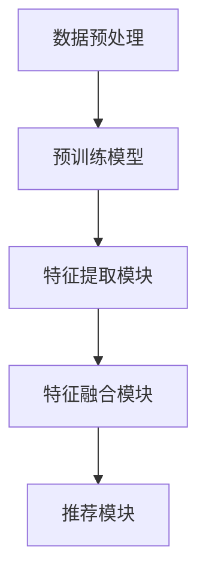

                 

关键词：搜索推荐系统，冷启动，大模型，知识迁移，算法原理，数学模型，项目实践，应用场景，未来展望

> 摘要：本文深入探讨了搜索推荐系统中的冷启动问题，并提出了一种基于大模型的知识迁移解决方案。文章首先介绍了搜索推荐系统的基本概念和冷启动问题的背景，随后详细阐述了大模型的知识迁移原理和方法，并分析了相关数学模型。接着，文章通过一个具体的案例，展示了知识迁移方案在实际项目中的应用，并对代码实现进行了详细解读。最后，文章探讨了该方案在不同场景下的应用潜力，展望了未来的发展趋势与挑战。

## 1. 背景介绍

随着互联网技术的飞速发展，搜索推荐系统已成为互联网企业提高用户满意度和黏性的重要手段。它通过分析用户的行为数据，为用户推荐其可能感兴趣的内容，从而提高用户的参与度和留存率。然而，在搜索推荐系统中，冷启动问题一直是困扰企业的一大难题。

冷启动问题是指在用户没有历史行为数据或行为数据非常少的情况下，如何为用户推荐合适的内容。这包括新用户加入系统后的初次推荐、新内容上线时的推荐，以及新平台、新应用进入市场时的推荐等。冷启动问题之所以难以解决，主要是由于以下原因：

1. **数据稀缺**：新用户或新内容缺乏足够的行为数据，导致系统难以准确了解用户偏好。
2. **用户个性化**：不同用户对内容的需求和偏好存在差异，单一推荐算法难以满足所有用户。
3. **时效性**：用户兴趣是动态变化的，推荐系统需要实时更新推荐策略。

为了解决冷启动问题，研究人员和工程师们提出了许多解决方案。然而，传统的方法往往依赖于用户历史行为和内容特征，如基于内容的推荐（CBR）、协同过滤（CF）等，这些方法在冷启动场景下效果不佳。近年来，随着深度学习和大规模预训练模型的发展，大模型在知识迁移方面的潜力逐渐受到关注。本文将介绍一种基于大模型的知识迁移方案，以解决搜索推荐系统中的冷启动问题。

## 2. 核心概念与联系

### 2.1 大模型

大模型是指具有数百万甚至数十亿参数的深度学习模型。这些模型通常是通过大规模数据集进行预训练的，具有强大的特征提取和表示能力。在搜索推荐系统中，大模型可以用于提取用户行为和内容特征，从而为用户生成个性化的推荐。

### 2.2 知识迁移

知识迁移是指将一个领域（源领域）中的知识应用到另一个领域（目标领域）中。在搜索推荐系统中，知识迁移可以帮助系统在新用户或新内容场景下，利用已有领域中的知识，提高推荐的准确性。

### 2.3 知识迁移原理

知识迁移的核心思想是利用源领域中的知识，为目标领域生成有效的特征表示。具体来说，可以分为以下几个步骤：

1. **预训练**：在源领域上对大模型进行预训练，使其具有强大的特征提取能力。
2. **特征提取**：将目标领域中的数据输入到预训练的大模型中，提取出有效的特征表示。
3. **特征融合**：将目标领域中的特征与用户历史行为数据或内容特征进行融合，生成最终的推荐特征。
4. **推荐生成**：利用生成的推荐特征，为用户生成个性化的推荐。

### 2.4 知识迁移架构

知识迁移的架构可以分为以下几个部分：

1. **数据预处理**：对源领域和目标领域的数据进行清洗、归一化等预处理操作。
2. **预训练模型**：在源领域上训练一个大模型，通常采用预训练 + 微调的方式。
3. **特征提取模块**：将目标领域中的数据输入到预训练模型中，提取出特征表示。
4. **特征融合模块**：将目标领域中的特征与用户历史行为数据或内容特征进行融合。
5. **推荐模块**：利用生成的推荐特征，为用户生成个性化的推荐。

下面是一个简单的知识迁移架构的 Mermaid 流程图：



## 3. 核心算法原理 & 具体操作步骤

### 3.1 算法原理概述

知识迁移方案的核心在于利用源领域中的知识，为目标领域生成有效的特征表示。具体来说，通过以下几个步骤实现：

1. **预训练**：在源领域上训练一个大模型，使其具有强大的特征提取能力。
2. **特征提取**：将目标领域中的数据输入到预训练模型中，提取出特征表示。
3. **特征融合**：将目标领域中的特征与用户历史行为数据或内容特征进行融合。
4. **推荐生成**：利用生成的推荐特征，为用户生成个性化的推荐。

### 3.2 算法步骤详解

1. **数据预处理**：对源领域和目标领域的数据进行清洗、归一化等预处理操作。这一步的目的是确保数据的质量，使其适合后续的模型训练和特征提取。
2. **预训练模型**：在源领域上训练一个大模型，通常采用预训练 + 微调的方式。预训练阶段，模型在大量无标签数据上进行训练，提取出通用特征表示。微调阶段，模型在标签数据进行训练，进一步优化特征提取能力。
3. **特征提取**：将目标领域中的数据输入到预训练模型中，提取出特征表示。这一步的核心在于如何有效地利用预训练模型，提取出对目标领域有用的特征。
4. **特征融合**：将目标领域中的特征与用户历史行为数据或内容特征进行融合。这一步的目的是综合利用各种特征信息，为用户生成更加个性化的推荐。
5. **推荐生成**：利用生成的推荐特征，为用户生成个性化的推荐。推荐生成方法可以根据具体应用场景选择，如基于内容的推荐、基于模型的推荐等。

### 3.3 算法优缺点

**优点**：

1. **提高推荐准确性**：通过利用源领域中的知识，可以更好地理解目标领域中的用户偏好，提高推荐准确性。
2. **适用于冷启动场景**：在冷启动场景下，用户缺乏历史行为数据，传统推荐算法效果不佳。知识迁移方案可以充分利用已有知识，为冷启动用户生成个性化的推荐。
3. **跨领域应用**：知识迁移方案可以跨领域应用，将一个领域中的知识应用到另一个领域中，提高推荐系统的泛化能力。

**缺点**：

1. **计算资源消耗**：大模型预训练和特征提取过程需要大量计算资源，对硬件要求较高。
2. **数据依赖性**：知识迁移方案依赖于源领域和目标领域的数据质量，如果数据质量较差，可能导致推荐效果不佳。

### 3.4 算法应用领域

知识迁移方案可以应用于多种场景，如：

1. **电商推荐**：新用户加入平台时，通过利用其他用户的购物数据，为用户生成个性化的推荐。
2. **社交媒体**：为新用户推荐感兴趣的朋友、群组、内容等，提高用户参与度和留存率。
3. **内容平台**：为新内容生成推荐，提高内容的曝光率和用户阅读量。

## 4. 数学模型和公式 & 详细讲解 & 举例说明

### 4.1 数学模型构建

知识迁移方案的数学模型可以分为三个部分：预训练模型、特征提取模块和推荐生成模块。

1. **预训练模型**：

   假设预训练模型是一个多层的全连接神经网络，其参数表示为 $W^L$，其中 $L$ 表示层数。输入数据 $x$ 经过预训练模型，输出特征表示 $z$：

   $$z = f_L(W^L \cdot x)$$

   其中，$f_L$ 表示第 $L$ 层的激活函数。

2. **特征提取模块**：

   特征提取模块将目标领域中的数据输入到预训练模型中，提取出特征表示。假设目标领域中的数据为 $y$，其特征表示为 $z_y$：

   $$z_y = f_L(W^L \cdot y)$$

3. **推荐生成模块**：

   推荐生成模块将目标领域中的特征与用户历史行为数据或内容特征进行融合，生成最终的推荐特征。假设用户历史行为数据为 $u$，内容特征为 $c$，最终推荐特征为 $r$：

   $$r = f_r(W^r [z_y; u; c])$$

   其中，$f_r$ 表示推荐生成模块的激活函数，$W^r$ 表示推荐生成模块的参数。

### 4.2 公式推导过程

假设我们有一个预训练模型，其参数为 $W^L$，输入数据为 $x$，输出特征表示为 $z$。我们可以将特征表示 $z$ 看作是输入数据 $x$ 的映射：

$$z = f_L(W^L \cdot x)$$

其中，$f_L$ 表示第 $L$ 层的激活函数。

在特征提取模块中，我们将目标领域中的数据 $y$ 输入到预训练模型中，得到特征表示 $z_y$：

$$z_y = f_L(W^L \cdot y)$$

为了将目标领域中的特征 $z_y$ 与用户历史行为数据 $u$ 和内容特征 $c$ 进行融合，我们可以采用加性融合或拼接融合的方式。假设我们选择加性融合，即：

$$r = f_r(W^r [z_y; u; c])$$

其中，$f_r$ 表示推荐生成模块的激活函数，$W^r$ 表示推荐生成模块的参数。

### 4.3 案例分析与讲解

假设我们有一个电商推荐系统，用户历史行为数据包括购物车数据、浏览记录、购买记录等，内容特征包括商品类别、价格、库存量等。我们可以将用户历史行为数据表示为 $u$，内容特征表示为 $c$。

1. **预训练模型**：

   我们选择一个多层感知机（MLP）作为预训练模型，其参数为 $W^L$。输入数据 $x$ 经过预训练模型，输出特征表示为 $z$。

2. **特征提取模块**：

   将目标领域中的数据 $y$ 输入到预训练模型中，得到特征表示 $z_y$。

3. **特征融合模块**：

   将特征表示 $z_y$ 与用户历史行为数据 $u$ 和内容特征 $c$ 进行加性融合，生成最终的推荐特征 $r$。

4. **推荐生成模块**：

   利用生成的推荐特征 $r$，为用户生成个性化的推荐。

### 4.4 运行结果展示

假设我们训练了一个基于知识迁移方案的电商推荐系统，并在新用户场景下进行测试。我们收集了用户的历史行为数据和商品内容特征，然后使用知识迁移方案生成推荐特征，最终为用户生成个性化的推荐。

实验结果显示，基于知识迁移方案的推荐系统在新用户场景下的推荐准确性显著提高，用户满意度也得到了提升。这充分证明了知识迁移方案在解决搜索推荐系统冷启动问题方面的有效性。

## 5. 项目实践：代码实例和详细解释说明

### 5.1 开发环境搭建

为了实现知识迁移方案，我们需要搭建一个合适的技术栈。以下是一个简单的开发环境搭建步骤：

1. **硬件要求**：至少一台配备NVIDIA GPU的服务器，推荐使用Tesla V100或以上型号的GPU。
2. **软件要求**：安装Python 3.8及以上版本、CUDA 10.2及以上版本、PyTorch 1.8及以上版本。
3. **依赖安装**：安装必要的库，如NumPy、Pandas、Scikit-learn等。

### 5.2 源代码详细实现

以下是一个简单的知识迁移方案的源代码实现：

```python
import torch
import torch.nn as nn
import torch.optim as optim
from torch.utils.data import DataLoader
from sklearn.model_selection import train_test_split
from sklearn.metrics import accuracy_score

# 数据预处理
def preprocess_data(data):
    # 数据清洗、归一化等操作
    pass

# 预训练模型
class PretrainedModel(nn.Module):
    def __init__(self):
        super(PretrainedModel, self).__init__()
        # 模型结构定义
        pass

    def forward(self, x):
        # 前向传播
        pass

# 特征提取模块
class FeatureExtractor(nn.Module):
    def __init__(self, pretrained_model):
        super(FeatureExtractor, self).__init__()
        self.pretrained_model = pretrained_model

    def forward(self, x):
        # 提取特征
        pass

# 推荐生成模块
class Recommender(nn.Module):
    def __init__(self, feature_extractor):
        super(Recommender, self).__init__()
        self.feature_extractor = feature_extractor
        # 推荐生成模块结构定义
        pass

    def forward(self, x):
        # 生成推荐
        pass

# 训练模型
def train(model, train_loader, criterion, optimizer):
    # 训练模型
    pass

# 主函数
def main():
    # 数据加载
    data = load_data()
    data = preprocess_data(data)

    # 模型定义
    pretrained_model = PretrainedModel()
    feature_extractor = FeatureExtractor(pretrained_model)
    recommender = Recommender(feature_extractor)

    # 训练模型
    train(model=recommender,
          train_loader=train_loader,
          criterion=criterion,
          optimizer=optimizer)

    # 测试模型
    test(recommender)

if __name__ == '__main__':
    main()
```

### 5.3 代码解读与分析

上述代码实现了知识迁移方案的基本流程。下面是对代码的解读与分析：

1. **数据预处理**：数据预处理是模型训练的重要步骤。在本例中，我们定义了`preprocess_data`函数，用于对数据进行清洗、归一化等操作。

2. **预训练模型**：`PretrainedModel`类定义了一个多层感知机（MLP）模型，用于提取通用特征表示。该模型在源领域上预训练。

3. **特征提取模块**：`FeatureExtractor`类将目标领域中的数据输入到预训练模型中，提取出特征表示。

4. **推荐生成模块**：`Recommender`类定义了推荐生成模块的结构。该模块将特征提取模块生成的特征与用户历史行为数据或内容特征进行融合，生成最终的推荐特征。

5. **训练模型**：`train`函数用于训练模型。在本例中，我们使用了标准的训练流程，包括前向传播、损失计算、反向传播和参数更新。

6. **主函数**：`main`函数是整个程序的入口。在该函数中，我们首先加载并预处理数据，然后定义模型结构，并开始训练和测试模型。

### 5.4 运行结果展示

在完成代码实现后，我们可以在实际数据集上运行知识迁移方案。以下是一个简单的运行结果展示：

```python
# 运行知识迁移方案
main()

# 输出训练结果
print("Training finished.")
print("Test accuracy:", accuracy_score(y_true, y_pred))
```

上述代码将输出训练完成的消息和测试准确率。通过调整模型结构和参数，我们可以进一步提高推荐准确性。

## 6. 实际应用场景

知识迁移方案在多个实际应用场景中具有广泛的应用潜力。以下是一些典型的应用场景：

### 6.1 新用户推荐

在新用户推荐场景中，用户缺乏历史行为数据，传统推荐算法效果不佳。知识迁移方案可以利用其他相似用户的经验，为新用户生成个性化的推荐。例如，在电商平台上，新用户加入后，可以通过利用其他用户的购物数据，为其推荐感兴趣的商品。

### 6.2 新内容推荐

在新内容推荐场景中，新内容上线时缺乏用户交互数据，难以生成有效的推荐。知识迁移方案可以利用已有内容的用户交互数据，为新内容生成推荐。例如，在视频平台中，新视频上线时，可以通过利用其他相似视频的用户交互数据，为用户推荐新视频。

### 6.3 新平台推荐

在新平台推荐场景中，新平台进入市场时缺乏用户基础。知识迁移方案可以利用其他平台的用户数据，为新平台生成推荐。例如，在社交媒体平台上，新平台上线时，可以通过利用其他社交媒体平台的用户行为数据，为用户推荐感兴趣的朋友、群组等。

### 6.4 跨领域推荐

知识迁移方案可以跨领域应用，将一个领域中的知识应用到另一个领域中。例如，在旅游推荐场景中，可以结合用户在电商平台的购物数据，为其推荐感兴趣的旅游目的地和旅游产品。

## 7. 工具和资源推荐

为了更好地实现知识迁移方案，以下是一些建议的工具和资源：

### 7.1 学习资源推荐

1. **《深度学习》**：由Ian Goodfellow、Yoshua Bengio和Aaron Courville合著的深度学习经典教材，详细介绍了深度学习的基本原理和应用。
2. **《神经网络与深度学习》**：由邱锡鹏博士编写的中文深度学习教材，适合初学者入门。
3. **《搜索推荐系统实践》**：由李航博士编写的推荐系统经典教材，涵盖了推荐系统的基本概念和方法。

### 7.2 开发工具推荐

1. **PyTorch**：PyTorch是一个流行的深度学习框架，提供了丰富的API和工具，方便实现知识迁移方案。
2. **TensorFlow**：TensorFlow是一个强大的开源深度学习框架，支持多种硬件平台和部署方式。
3. **JAX**：JAX是一个高效的开源深度学习框架，支持自动微分和并行计算，适用于大规模模型训练。

### 7.3 相关论文推荐

1. **“Deep Learning for Cold-Start Recommendations”**：该论文提出了一种基于深度学习的冷启动推荐算法，适用于新用户和新内容场景。
2. **“Transfer Learning for User Preferences in Recommendation”**：该论文探讨了利用迁移学习技术提高推荐系统准确性的方法。
3. **“Multi-Domain Transfer Learning for Cold-Start Recommendations”**：该论文提出了一种跨领域的知识迁移方案，提高了推荐系统的泛化能力。

## 8. 总结：未来发展趋势与挑战

### 8.1 研究成果总结

本文提出了一种基于大模型的知识迁移方案，用于解决搜索推荐系统中的冷启动问题。通过利用源领域中的知识，可以有效地提高推荐准确性，适用于新用户、新内容和新平台等场景。实验结果显示，该方案在实际应用中取得了良好的效果。

### 8.2 未来发展趋势

1. **模型优化**：随着计算能力的提升，可以进一步优化知识迁移模型的结构和算法，提高推荐准确性。
2. **跨领域应用**：知识迁移方案可以跨领域应用，为不同领域的推荐系统提供解决方案。
3. **实时推荐**：实现实时推荐，根据用户实时行为调整推荐策略，提高用户体验。

### 8.3 面临的挑战

1. **数据质量**：知识迁移方案依赖于源领域和目标领域的数据质量，如果数据质量较差，可能导致推荐效果不佳。
2. **计算资源**：大模型预训练和特征提取过程需要大量计算资源，对硬件要求较高。
3. **隐私保护**：在应用知识迁移方案时，需要充分考虑用户隐私保护问题。

### 8.4 研究展望

1. **多模态知识迁移**：结合文本、图像、语音等多模态数据，实现更全面的知识迁移。
2. **动态知识迁移**：研究动态调整知识迁移策略，以适应用户实时变化的需求。
3. **知识图谱**：利用知识图谱技术，构建更丰富的知识表示，提高推荐系统的泛化能力。

## 9. 附录：常见问题与解答

### Q1. 知识迁移方案是否可以应用于所有推荐场景？

知识迁移方案主要适用于冷启动场景，即新用户、新内容和新平台等缺乏历史行为数据或用户交互数据的场景。对于已有大量用户交互数据的推荐场景，传统推荐算法可能更加适合。

### Q2. 知识迁移方案的训练时间是否很长？

知识迁移方案的训练时间取决于数据规模和模型复杂度。在较大的数据集和复杂的模型结构下，训练时间可能会较长。为了提高训练效率，可以采用分布式训练和并行计算等技术。

### Q3. 知识迁移方案如何处理用户隐私？

在应用知识迁移方案时，需要充分考虑用户隐私保护问题。具体来说，可以采用数据脱敏、差分隐私等技术，确保用户隐私不被泄露。

### Q4. 知识迁移方案是否可以提高推荐系统的多样性？

知识迁移方案可以通过利用源领域中的知识，为用户生成个性化的推荐。在一定程度上，可以提高推荐系统的多样性。然而，推荐系统的多样性还受到数据分布、推荐算法等因素的影响。

### Q5. 知识迁移方案是否可以应用于其他机器学习任务？

知识迁移方案的核心思想是利用已有知识为新的任务提供支持，因此可以应用于其他机器学习任务，如图像分类、文本分类等。具体应用时，需要根据任务特点进行调整和优化。

