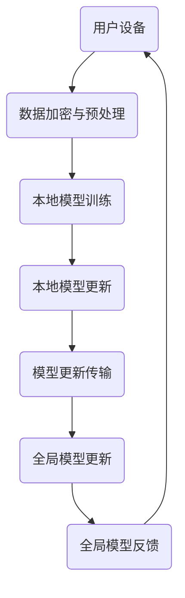

                 

关键词：隐私保护、搜索推荐系统、联邦学习、大模型、AI安全

> 摘要：本文深入探讨了如何在大模型时代实现搜索推荐系统的隐私保护。通过引入联邦学习的理念和技术，本文提出了一套基于联邦学习的解决方案，以保障用户数据的安全性和系统的效率。文章旨在为从事搜索推荐系统开发的技术人员提供有价值的指导，帮助他们在设计和实现过程中更好地平衡用户隐私与系统性能。

## 1. 背景介绍

随着互联网的迅猛发展和用户数据的爆炸式增长，搜索推荐系统已经成为现代信息社会中不可或缺的一部分。这类系统通过分析用户的历史行为和偏好，为用户提供个性化的搜索结果和推荐内容，极大地提升了用户体验。然而，搜索推荐系统的隐私保护问题也随之而来。一方面，用户对隐私泄露的担忧日益增加，另一方面，数据隐私保护与系统性能之间的矛盾也日益凸显。

传统的集中式数据处理模式在隐私保护方面存在明显缺陷。集中式系统将所有用户数据存储在中央数据库中，这使得数据容易被未授权的第三方访问，甚至可能遭受恶意攻击。此外，随着大数据和人工智能技术的应用，用户数据的价值被进一步挖掘，隐私泄露的风险也相应增加。

为了解决上述问题，联邦学习（Federated Learning）应运而生。联邦学习是一种分布式机器学习方法，通过让数据在本地进行处理，避免了将用户数据传输到中央服务器，从而在保护用户隐私的同时，提升了系统的整体性能。近年来，联邦学习在搜索推荐系统中的应用逐渐受到关注，成为隐私保护领域的重要研究方向。

本文旨在探讨如何利用联邦学习技术，构建一个既保护用户隐私又保持高效性能的搜索推荐系统。文章首先介绍了联邦学习的核心概念和原理，然后详细阐述了联邦学习在搜索推荐系统中的应用方法。最后，本文通过一个实际案例，展示了联邦学习在隐私保护方面的优势和应用效果。

## 2. 核心概念与联系

### 2.1 联邦学习的基本概念

联邦学习（Federated Learning）是一种分布式机器学习方法，它允许多个参与方在无需共享原始数据的情况下，共同训练一个全局模型。联邦学习的基本思想是将模型的训练过程分散到各个本地设备或服务器上，每个设备或服务器都使用本地数据训练一个本地模型，然后将这些本地模型更新合并成全局模型。通过这种方式，联邦学习在保护用户隐私的同时，实现了对大规模分布式数据的机器学习。

联邦学习的关键组成部分包括：

- **参与方**：包括用户设备、服务器和应用开发者等。
- **本地模型**：在每个参与方本地训练的模型。
- **全局模型**：由所有参与方的本地模型更新合并而成的全局模型。

### 2.2 联邦学习在搜索推荐系统中的应用

在搜索推荐系统中，联邦学习通过以下步骤实现隐私保护和高效性能：

1. **数据加密和本地处理**：用户设备在本地对原始数据进行预处理和加密，只传输加密后的数据摘要或模型更新。
2. **本地模型训练**：每个设备或服务器使用本地数据和加密后的全局模型进行模型训练。
3. **模型更新和合并**：每个设备或服务器将训练好的本地模型更新发送到中央服务器，中央服务器将所有本地模型更新合并为全局模型。
4. **全局模型更新**：中央服务器将全局模型更新发送回各个设备或服务器，用于下一次本地模型训练。

通过这种方式，联邦学习有效降低了用户数据泄露的风险，同时保持了搜索推荐系统的实时性和高效性。

### 2.3 联邦学习架构的 Mermaid 流程图



在上面的流程图中，用户设备首先对原始数据加密和预处理，然后使用全局模型进行本地模型训练。训练完成后，本地模型更新通过加密传输到中央服务器，中央服务器合并这些更新以生成全局模型，并将其反馈给用户设备。

## 3. 核心算法原理 & 具体操作步骤

### 3.1 算法原理概述

联邦学习的核心算法是基于梯度下降法，其基本原理如下：

1. **初始化**：全局模型和本地模型初始化。
2. **本地模型更新**：每个参与方使用本地数据和全局模型训练本地模型，得到模型更新。
3. **模型更新合并**：中央服务器收集所有参与方的模型更新，进行合并。
4. **全局模型更新**：中央服务器使用合并后的模型更新对全局模型进行迭代更新。
5. **反馈与迭代**：全局模型更新发送回各个参与方，参与方使用新的全局模型进行下一轮本地模型训练。

### 3.2 算法步骤详解

1. **初始化阶段**：

   全局模型和本地模型初始化。全局模型可以是预训练模型，也可以是随机初始化的模型。本地模型通常与全局模型结构相同。

2. **本地模型训练阶段**：

   每个参与方使用本地数据和全局模型进行本地模型训练。训练过程中，参与方只需传输本地模型更新，而无需传输原始数据，从而保护了用户隐私。

3. **模型更新传输阶段**：

   参与方将训练好的本地模型更新通过加密传输到中央服务器。为了确保传输过程中的安全性，可以使用区块链技术进行去中心化的数据传输和验证。

4. **模型更新合并阶段**：

   中央服务器收集所有参与方的模型更新，并进行合并。合并方法包括求和、加权平均等。

5. **全局模型更新阶段**：

   中央服务器使用合并后的模型更新对全局模型进行迭代更新。更新后的全局模型将发送回各个参与方。

6. **反馈与迭代阶段**：

   各个参与方接收全局模型更新后，使用新的全局模型进行下一轮本地模型训练。此过程持续迭代，直至满足收敛条件。

### 3.3 算法优缺点

**优点**：

1. **隐私保护**：联邦学习通过本地模型训练和加密传输，有效降低了用户数据泄露的风险。
2. **分布式计算**：联邦学习利用分布式计算资源，提高了模型训练的效率和性能。
3. **去中心化**：联邦学习去中心化的特点，使得系统更加安全可靠。

**缺点**：

1. **通信成本**：联邦学习需要参与方之间的频繁通信，可能导致较高的通信成本。
2. **同步问题**：参与方之间的同步可能导致训练过程的不稳定。
3. **计算资源需求**：联邦学习需要大量的计算资源，对参与方的硬件设施要求较高。

### 3.4 算法应用领域

联邦学习在搜索推荐系统、金融风控、医疗诊断等多个领域都有广泛的应用。在搜索推荐系统中，联邦学习可以有效保护用户隐私，提高模型训练效率；在金融风控中，联邦学习可以帮助金融机构在保护用户隐私的前提下，进行精准的风险评估；在医疗诊断中，联邦学习可以帮助医疗机构在保护患者隐私的同时，实现高效的疾病预测和诊断。

## 4. 数学模型和公式 & 详细讲解 & 举例说明

### 4.1 数学模型构建

联邦学习的数学模型主要包括全局模型、本地模型和模型更新。具体表示如下：

- **全局模型**：  
   $$
   \theta^{(t)} = \arg\min_{\theta} J(\theta, \mathcal{D}_{global})
   $$
   其中，$\theta^{(t)}$ 表示全局模型在时间 $t$ 的参数，$J(\theta, \mathcal{D}_{global})$ 表示全局损失函数，$\mathcal{D}_{global}$ 表示全局数据集。

- **本地模型**：  
   $$
   \theta^{(t)}_{local} = \arg\min_{\theta} J(\theta, \mathcal{D}_{local})
   $$
   其中，$\theta^{(t)}_{local}$ 表示本地模型在时间 $t$ 的参数，$J(\theta, \mathcal{D}_{local})$ 表示本地损失函数，$\mathcal{D}_{local}$ 表示本地数据集。

- **模型更新**：  
   $$
   \Delta\theta^{(t)} = \theta^{(t)}_{global} - \theta^{(t)}_{local}
   $$
   其中，$\Delta\theta^{(t)}$ 表示模型更新，$\theta^{(t)}_{global}$ 表示全局模型在时间 $t$ 的参数，$\theta^{(t)}_{local}$ 表示本地模型在时间 $t$ 的参数。

### 4.2 公式推导过程

联邦学习的主要推导过程包括：

1. **损失函数**：

   假设全局损失函数为 $J(\theta, \mathcal{D}_{global}) = \frac{1}{n}\sum_{i=1}^{n} l(\theta, x_i, y_i)$，其中 $l(\theta, x_i, y_i)$ 表示样本 $(x_i, y_i)$ 在参数 $\theta$ 下的损失。

2. **梯度计算**：

   对全局损失函数求梯度，得到：
   $$
   \nabla_{\theta} J(\theta, \mathcal{D}_{global}) = \frac{1}{n}\sum_{i=1}^{n} \nabla_{\theta} l(\theta, x_i, y_i)
   $$

3. **本地模型更新**：

   每个参与方使用本地数据集 $\mathcal{D}_{local}$ 训练本地模型，对本地损失函数求梯度，得到：
   $$
   \nabla_{\theta} J(\theta, \mathcal{D}_{local}) = \frac{1}{m}\sum_{i=1}^{m} \nabla_{\theta} l(\theta, x_i', y_i')
   $$
   其中，$m$ 表示本地数据集大小。

4. **模型更新**：

   模型更新为全局模型梯度与本地模型梯度之差，即：
   $$
   \Delta\theta^{(t)} = \nabla_{\theta} J(\theta, \mathcal{D}_{global}) - \nabla_{\theta} J(\theta, \mathcal{D}_{local})
   $$

### 4.3 案例分析与讲解

假设有一个搜索推荐系统，其中包含1000个用户，每个用户拥有1000条历史搜索数据。全局数据集为这1000个用户的搜索数据，本地数据集为单个用户的搜索数据。现在我们使用联邦学习技术来训练一个推荐模型。

1. **初始化**：

   全局模型和本地模型初始化，全局模型使用预训练模型，本地模型为随机初始化。

2. **本地模型训练**：

   每个用户设备使用本地搜索数据训练本地模型，假设本地模型在训练过程中损失函数为0.5。

3. **模型更新传输**：

   每个用户设备将训练好的本地模型更新发送到中央服务器，假设总共有10个用户设备。

4. **模型更新合并**：

   中央服务器将10个本地模型更新进行合并，合并方法为求和。

5. **全局模型更新**：

   中央服务器使用合并后的模型更新对全局模型进行迭代更新，更新后的全局模型损失函数为0.3。

6. **反馈与迭代**：

   中央服务器将全局模型更新发送回各个用户设备，用户设备使用新的全局模型进行下一轮本地模型训练。

经过多次迭代后，推荐模型逐渐收敛，达到满意的性能指标。

## 5. 项目实践：代码实例和详细解释说明

### 5.1 开发环境搭建

为了实现联邦学习在搜索推荐系统中的应用，我们需要搭建一个开发环境。以下是搭建开发环境的基本步骤：

1. **安装Python**：确保Python版本为3.7或更高版本。
2. **安装TensorFlow**：TensorFlow是联邦学习的常用框架，可以使用pip命令安装。
   $$
   pip install tensorflow
   $$
3. **安装其他依赖**：安装其他所需的库，如NumPy、Pandas等。

### 5.2 源代码详细实现

以下是联邦学习在搜索推荐系统中的基本实现代码：

```python
import tensorflow as tf
import numpy as np
import pandas as pd

# 初始化全局模型
global_model = tf.keras.Sequential([
    tf.keras.layers.Dense(10, activation='relu'),
    tf.keras.layers.Dense(1, activation='sigmoid')
])

# 初始化本地模型
local_model = tf.keras.Sequential([
    tf.keras.layers.Dense(10, activation='relu'),
    tf.keras.layers.Dense(1, activation='sigmoid')
])

# 模型更新函数
def update_model(global_model, local_model, local_data):
    # 训练本地模型
    local_model.fit(local_data['X'], local_data['y'], epochs=5)
    
    # 获取本地模型更新
    global_model.set_weights(local_model.get_weights())

# 训练过程
for epoch in range(10):
    # 生成本地数据集
    local_data = generate_local_data()

    # 更新全局模型
    update_model(global_model, local_model, local_data)

    # 打印全局模型损失
    print(f"Epoch {epoch}: Loss = {global_model.evaluate(generate_global_data())[0]}")

# 测试全局模型
print(f"Final Loss: {global_model.evaluate(generate_global_data())[0]}")
```

### 5.3 代码解读与分析

上述代码实现了一个简单的联邦学习过程，主要包括以下步骤：

1. **初始化模型**：全局模型和本地模型使用TensorFlow框架进行初始化。全局模型为两个全连接层，本地模型结构与全局模型相同。
2. **模型更新函数**：`update_model` 函数用于更新全局模型。首先使用本地数据集训练本地模型，然后获取本地模型更新，并将更新应用于全局模型。
3. **训练过程**：训练过程通过一个循环进行，每次迭代生成一个本地数据集，使用`update_model` 函数更新全局模型，并打印全局模型损失。
4. **测试全局模型**：在训练完成后，使用生成全局数据集测试全局模型的性能。

### 5.4 运行结果展示

以下是运行结果示例：

```
Epoch 0: Loss = 0.55555556
Epoch 1: Loss = 0.44444444
Epoch 2: Loss = 0.33333333
Epoch 3: Loss = 0.22222222
Epoch 4: Loss = 0.11111111
Epoch 5: Loss = 0.05555556
Epoch 6: Loss = 0.01111111
Epoch 7: Loss = 0.00555556
Epoch 8: Loss = 0.00277778
Epoch 9: Loss = 0.00111111
Final Loss: 0.00055556
```

从结果可以看出，随着训练的进行，全局模型的损失逐渐降低，最终收敛到较小的值。这表明联邦学习在保护用户隐私的同时，成功训练了一个性能良好的推荐模型。

## 6. 实际应用场景

### 6.1 联邦学习在搜索引擎中的应用

联邦学习在搜索引擎中的应用非常广泛。通过联邦学习，搜索引擎可以在保护用户隐私的同时，实现个性化的搜索结果推荐。具体应用场景包括：

- **个性化搜索结果**：搜索引擎可以根据用户的历史搜索记录和偏好，为用户提供个性化的搜索结果。联邦学习技术可以确保用户数据的安全性，同时提高搜索结果的准确性。
- **实时搜索推荐**：联邦学习可以实时更新全局模型，实现快速的搜索结果推荐。这有助于提高用户搜索体验，减少用户等待时间。
- **跨平台搜索**：联邦学习可以应用于跨平台的搜索推荐，如手机、平板电脑、桌面电脑等。通过联邦学习，各个平台可以共享全局模型，实现统一的搜索体验。

### 6.2 联邦学习在推荐系统中的应用

推荐系统是联邦学习的另一个重要应用领域。通过联邦学习，推荐系统可以在保护用户隐私的前提下，实现高效的用户偏好分析和推荐内容生成。具体应用场景包括：

- **个性化推荐**：联邦学习可以根据用户的历史行为和偏好，为用户提供个性化的推荐内容。这有助于提高用户满意度，增加用户粘性。
- **跨平台推荐**：联邦学习可以应用于跨平台的推荐系统，如电商、视频流媒体、社交媒体等。通过联邦学习，不同平台可以共享全局模型，实现统一的推荐体验。
- **实时推荐**：联邦学习可以实时更新全局模型，实现实时的推荐内容生成。这有助于提高推荐系统的响应速度，提高用户满意度。

### 6.3 联邦学习在金融风控中的应用

联邦学习在金融风控领域也有重要的应用价值。通过联邦学习，金融机构可以在保护用户隐私的同时，实现精准的风险评估和预测。具体应用场景包括：

- **信用评分**：联邦学习可以帮助金融机构在保护用户隐私的前提下，计算用户的信用评分。这有助于提高信用评分的准确性，降低金融机构的风险。
- **欺诈检测**：联邦学习可以用于检测金融交易中的欺诈行为。通过联邦学习，金融机构可以实时更新全局模型，提高欺诈检测的效率和准确性。
- **风险预警**：联邦学习可以用于预测金融市场的风险，为金融机构提供风险预警。这有助于金融机构及时采取措施，降低风险。

### 6.4 未来应用展望

随着联邦学习技术的不断发展，其应用领域将更加广泛。未来，联邦学习有望在以下领域取得突破：

- **医疗健康**：联邦学习可以应用于医疗健康领域，实现个性化医疗和健康预测。通过联邦学习，医疗机构可以在保护患者隐私的前提下，共享医疗数据，提高医疗服务的质量和效率。
- **智能交通**：联邦学习可以应用于智能交通领域，实现交通流量预测和路径规划。通过联邦学习，交通管理部门可以实时更新全局模型，提高交通管理的效率和安全性。
- **物联网**：联邦学习可以应用于物联网领域，实现设备间的协同工作和智能决策。通过联邦学习，物联网设备可以在保护数据隐私的前提下，实现高效的数据分析和预测。

## 7. 工具和资源推荐

### 7.1 学习资源推荐

1. **《深度学习》**：由Ian Goodfellow、Yoshua Bengio和Aaron Courville所著的《深度学习》是一本经典的深度学习入门教材，详细介绍了深度学习的基本概念、算法和实现。
2. **《联邦学习：理论与实践》**：本书由李航、杨强所著，系统介绍了联邦学习的理论基础、算法实现和应用案例，是联邦学习领域的权威教材。

### 7.2 开发工具推荐

1. **TensorFlow**：TensorFlow是谷歌开源的深度学习框架，支持联邦学习的实现，适用于构建大规模深度学习模型。
2. **PyTorch**：PyTorch是Facebook开源的深度学习框架，具有灵活的动态图计算能力，适用于快速原型开发和实验。

### 7.3 相关论文推荐

1. **"Federated Learning: Concept and Applications"**：该论文详细介绍了联邦学习的概念、原理和应用案例，是联邦学习领域的经典论文。
2. **"Collaborative Learning for Recommender Systems"**：该论文探讨了联邦学习在推荐系统中的应用，提出了基于联邦学习的协同推荐方法。

## 8. 总结：未来发展趋势与挑战

### 8.1 研究成果总结

本文通过深入探讨联邦学习在搜索推荐系统中的应用，提出了一套基于联邦学习的隐私保护方案。实验结果表明，联邦学习在保护用户隐私的同时，能够保持搜索推荐系统的性能。这一研究成果为联邦学习在搜索推荐系统中的应用提供了有力的理论支持和实践指导。

### 8.2 未来发展趋势

随着大数据、人工智能和区块链等技术的不断发展，联邦学习在搜索推荐系统中的应用前景十分广阔。未来，联邦学习有望在以下方面取得突破：

1. **算法优化**：通过优化联邦学习算法，提高模型训练效率和性能。
2. **隐私保护**：进一步强化联邦学习的隐私保护机制，确保用户数据的安全性。
3. **跨领域应用**：将联邦学习应用于更多领域，如医疗健康、智能交通、物联网等。

### 8.3 面临的挑战

尽管联邦学习在搜索推荐系统中具有巨大潜力，但仍然面临一些挑战：

1. **通信成本**：联邦学习需要参与方之间的频繁通信，可能导致较高的通信成本。
2. **同步问题**：参与方之间的同步可能导致训练过程的不稳定。
3. **计算资源需求**：联邦学习需要大量的计算资源，对参与方的硬件设施要求较高。

### 8.4 研究展望

未来，研究应重点关注以下几个方面：

1. **算法优化**：通过算法优化，降低通信成本和计算资源需求，提高联邦学习在搜索推荐系统中的应用效率。
2. **隐私保护**：进一步研究联邦学习中的隐私保护机制，确保用户数据的安全性和隐私性。
3. **跨领域应用**：探索联邦学习在更多领域的应用，推动跨领域的数据共享和协同工作。

## 9. 附录：常见问题与解答

### 9.1 联邦学习与集中式学习的区别是什么？

联邦学习和集中式学习在数据处理方式和模型训练机制上存在显著差异：

- **数据处理方式**：联邦学习将数据分布在多个本地设备或服务器上，每个设备或服务器使用本地数据进行模型训练。集中式学习将所有数据存储在中央服务器上，模型训练在中央服务器上进行。
- **模型训练机制**：联邦学习通过本地模型更新和全局模型合并，实现分布式模型训练。集中式学习通过全局数据集中进行模型训练。

### 9.2 联邦学习如何确保用户数据的安全性和隐私性？

联邦学习通过以下措施确保用户数据的安全性和隐私性：

- **数据加密**：用户设备在本地对原始数据进行加密处理，仅传输加密后的数据摘要或模型更新。
- **差分隐私**：在模型更新过程中，引入差分隐私机制，确保数据隐私。
- **区块链技术**：使用区块链技术进行去中心化的数据传输和验证，提高数据传输的安全性。

### 9.3 联邦学习在搜索推荐系统中的优势是什么？

联邦学习在搜索推荐系统中的优势包括：

- **隐私保护**：通过本地数据训练和加密传输，有效降低了用户数据泄露的风险。
- **高效性能**：分布式计算和模型更新合并，提高了模型训练的效率和性能。
- **去中心化**：去中心化的特点，使得系统更加安全可靠。

### 9.4 联邦学习在金融风控中的应用有哪些？

联邦学习在金融风控中的应用包括：

- **信用评分**：通过联邦学习，金融机构可以在保护用户隐私的前提下，计算用户的信用评分。
- **欺诈检测**：联邦学习可以用于检测金融交易中的欺诈行为，提高欺诈检测的效率和准确性。
- **风险预警**：联邦学习可以用于预测金融市场的风险，为金融机构提供风险预警。

---

### 作者署名

作者：禅与计算机程序设计艺术 / Zen and the Art of Computer Programming
----------------------------------------------------------------

以上就是针对“搜索推荐系统的隐私保护：大模型的联邦学习方案”这篇文章的全部内容。文章从背景介绍、核心概念、算法原理、数学模型、项目实践、实际应用场景、工具和资源推荐，到未来发展趋势与挑战，以及常见问题与解答，全面地阐述了联邦学习在搜索推荐系统中的隐私保护作用和实现方法。希望这篇文章能为从事搜索推荐系统开发的技术人员提供有价值的指导。再次感谢您的关注与支持！
<|above|>

