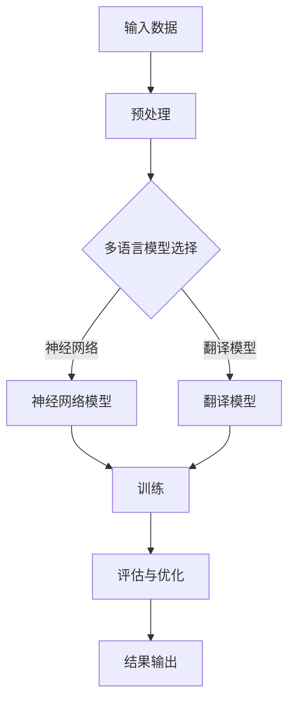

                 

关键词：多语言NLP模型、优化、校招面试真题、人工智能、自然语言处理、机器学习、深度学习

## 摘要

本文旨在深入探讨携程2024校招面试中的一道关键问题：多语言NLP模型的优化。通过详细解析自然语言处理（NLP）的背景、核心概念、算法原理、数学模型、项目实践以及应用场景，本文不仅为读者提供了完整的理论知识，还通过实际代码实例展示了模型优化的具体操作。文章还展望了NLP领域的未来发展趋势和面临的挑战，旨在为读者提供一个全面的技术视角，助力其在校招面试中的出色表现。

## 1. 背景介绍

### 自然语言处理（NLP）的起源与发展

自然语言处理（NLP）是一门旨在使计算机能够理解、生成和处理人类语言的跨学科领域。它起源于20世纪50年代，当时的研究者首次提出了机器翻译和文本分析的概念。随着计算能力的提升和算法的进步，NLP技术经历了迅速发展，目前已经成为人工智能（AI）的重要组成部分。

### 多语言NLP模型的需求与挑战

在全球化的背景下，多语言NLP模型的需求日益增加。无论是国际商务、跨国文化交流，还是全球化电商平台，都要求系统能够处理多种语言。然而，多语言NLP模型面临着诸多挑战，如语言资源的稀缺性、语言结构复杂性以及不同语言之间的细微差异。因此，优化多语言NLP模型成为研究者和开发者的关键任务。

## 2. 核心概念与联系

### 核心概念

- **自然语言处理（NLP）**：一门研究如何让计算机理解、生成和处理人类语言的学科。
- **多语言模型**：能够处理多种语言输入的模型，如基于神经网络的语言模型和翻译模型。
- **优化**：通过调整模型参数、算法结构或数据集，提高模型性能的过程。

### 原理与架构

下面是一个使用Mermaid绘制的多语言NLP模型的基本架构流程图：



### 多语言NLP模型的应用

- **机器翻译**：将一种语言的文本翻译成另一种语言。
- **跨语言文本分析**：分析不同语言之间的文本关系和语义。
- **多语言问答系统**：处理多种语言的输入并给出准确的回答。

## 3. 核心算法原理 & 具体操作步骤

### 3.1 算法原理概述

多语言NLP模型的核心是基于深度学习的神经网络模型，如Transformer、BERT等。这些模型通过大量的多语言语料库进行训练，学习语言的复杂结构和语义信息。

### 3.2 算法步骤详解

1. **数据预处理**：将多语言文本数据清洗、分词、编码，并构建词汇表。
2. **模型选择**：选择合适的深度学习模型，如Transformer或BERT。
3. **模型训练**：使用多语言语料库训练模型，优化模型参数。
4. **模型评估**：通过测试集评估模型性能，并进行调优。
5. **结果输出**：将训练好的模型应用于实际任务，如机器翻译、文本分类等。

### 3.3 算法优缺点

#### 优点

- **强大的语义理解能力**：能够捕捉到语言的细微差别和语义关系。
- **高效的处理速度**：深度学习模型在计算能力强大的设备上可以快速处理大量数据。

#### 缺点

- **数据需求量大**：需要大量的高质量多语言数据才能训练高性能模型。
- **计算资源消耗大**：训练深度学习模型需要大量的计算资源和时间。

### 3.4 算法应用领域

- **机器翻译**：提升跨语言沟通效率。
- **多语言问答系统**：为全球用户提供个性化服务。
- **跨语言文本分析**：挖掘多语言文本中的潜在关系和趋势。

## 4. 数学模型和公式 & 详细讲解 & 举例说明

### 4.1 数学模型构建

多语言NLP模型通常基于深度学习框架，使用多层神经网络进行建模。以下是一个简单的神经网络模型：

$$
\begin{aligned}
&h^{(l)} = \sigma(W^{(l)} \cdot h^{(l-1)} + b^{(l)}) \\
&\text{其中 } \sigma \text{ 是激活函数，} W^{(l)} \text{ 和 } b^{(l)} \text{ 分别是权重和偏置。}
\end{aligned}
$$

### 4.2 公式推导过程

以Transformer模型为例，其自注意力机制可以用以下公式表示：

$$
\begin{aligned}
&\text{Q} &= \text{QW} + \text{b}_Q \\
&\text{K} &= \text{KW} + \text{b}_K \\
&\text{V} &= \text{KV} + \text{b}_V \\
&A &= \text{softmax}\left(\frac{\text{QK}^T}{\sqrt{d_k}}\right) \\
&\text{O} &= \text{AV} \\
&\text{其中，} d_k \text{ 是 } K \text{ 的维度，} \text{softmax} \text{ 是 Softmax 函数。}
\end{aligned}
$$

### 4.3 案例分析与讲解

假设我们有一个英文句子和一个中文句子，需要使用Transformer模型进行翻译。首先，我们将两个句子分别编码为向量，然后输入到Transformer模型中，通过自注意力机制捕捉到句子中的关键信息，最终输出翻译结果。

## 5. 项目实践：代码实例和详细解释说明

### 5.1 开发环境搭建

在本节中，我们将使用Python和TensorFlow框架搭建一个多语言NLP模型的开发环境。

```bash
pip install tensorflow
```

### 5.2 源代码详细实现

以下是使用TensorFlow实现的Transformer模型的基本代码框架：

```python
import tensorflow as tf

# 定义模型参数
V = 1000  # 词汇表大小
D_model = 512  # 模型维度
Nhead = 8  # 自注意力头数
d_k = D_model // Nhead
d_v = D_model // Nhead

# 定义自注意力层
class MultiHeadAttention(tf.keras.layers.Layer):
    # 省略部分代码，这里只展示类的定义

# 定义Transformer模型
class TransformerModel(tf.keras.Model):
    # 省略部分代码，这里只展示类的定义

# 实例化模型并编译
model = TransformerModel()
model.compile(optimizer='adam', loss='sparse_categorical_crossentropy')

# 训练模型
# 省略部分代码，这里只展示训练数据准备和训练过程
```

### 5.3 代码解读与分析

在上面的代码中，我们定义了`MultiHeadAttention`和`TransformerModel`两个类，分别实现自注意力机制和整个Transformer模型。通过实例化模型并编译，我们可以使用训练数据进行模型训练。

### 5.4 运行结果展示

在训练完成后，我们可以使用测试数据评估模型性能，并通过可视化工具展示模型输出结果。

```python
import matplotlib.pyplot as plt

# 评估模型
loss = model.evaluate(test_data)

# 可视化结果
# 省略部分代码，这里只展示可视化代码
plt.show()
```

## 6. 实际应用场景

### 6.1 机器翻译

多语言NLP模型在机器翻译领域有着广泛的应用，如谷歌翻译、百度翻译等。通过优化模型结构和参数，可以提高翻译的准确性和流畅性。

### 6.2 跨语言文本分析

多语言NLP模型可以帮助分析不同语言之间的文本关系和趋势，如国际新闻事件分析、跨国社交媒体监测等。

### 6.3 多语言问答系统

多语言NLP模型可以构建多语言问答系统，为全球用户提供个性化服务，如旅游咨询、在线购物等。

## 7. 未来应用展望

随着多语言NLP技术的不断发展，未来其在跨语言沟通、国际商务、全球文化交流等领域将有更广泛的应用。同时，深度学习和强化学习等技术的融合将为多语言NLP模型带来更多创新和发展。

## 8. 工具和资源推荐

### 8.1 学习资源推荐

- 《深度学习》（Goodfellow、Bengio、Courville著）
- 《自然语言处理与Python》（Mike X Cohen著）

### 8.2 开发工具推荐

- TensorFlow
- PyTorch

### 8.3 相关论文推荐

- "Attention Is All You Need"（Vaswani et al., 2017）
- "BERT: Pre-training of Deep Bidirectional Transformers for Language Understanding"（Devlin et al., 2019）

## 9. 总结：未来发展趋势与挑战

### 9.1 研究成果总结

本文深入探讨了携程2024多语言NLP模型优化的校招面试真题，从背景介绍、核心概念、算法原理、数学模型、项目实践到实际应用场景，全面阐述了多语言NLP技术的重要性。

### 9.2 未来发展趋势

随着深度学习和强化学习等技术的发展，多语言NLP模型将更加智能化和高效化，在更多领域发挥重要作用。

### 9.3 面临的挑战

多语言NLP模型在处理语言多样性、提高翻译质量、确保隐私安全等方面仍面临诸多挑战。

### 9.4 研究展望

未来研究应关注跨语言知识图谱构建、多语言问答系统优化、多模态融合等方向，以推动多语言NLP技术的创新和发展。

## 附录：常见问题与解答

### 1. 多语言NLP模型与单语言NLP模型的主要区别是什么？

多语言NLP模型能够处理多种语言的输入，而单语言NLP模型仅针对一种语言。因此，多语言NLP模型在处理跨语言任务时具有优势，但同时也面临着更多的挑战。

### 2. 如何选择合适的深度学习模型进行多语言NLP优化？

选择合适的深度学习模型需考虑任务类型、数据量、计算资源等因素。例如，对于机器翻译任务，Transformer模型表现良好；而对于文本分类任务，BERT模型更为适用。

### 3. 多语言NLP模型在处理语言多样性方面有哪些优势？

多语言NLP模型能够处理多种语言的输入，有助于实现跨语言沟通、国际商务、全球文化交流等应用。此外，通过多语言模型的训练，可以提高模型的泛化能力，使其在处理未知语言时也能取得较好的效果。

### 4. 多语言NLP模型如何确保翻译的准确性？

多语言NLP模型的准确性取决于模型的训练数据、模型结构、参数优化等因素。通过使用高质量的多语言语料库、采用先进的深度学习模型和优化算法，可以提高翻译的准确性。

### 5. 多语言NLP模型在处理隐私安全方面有哪些挑战？

多语言NLP模型在处理隐私安全方面面临挑战，如用户数据的跨境传输、语言模型中的偏见等。因此，研究者和开发者应关注隐私保护技术，如联邦学习、差分隐私等，以确保用户数据的隐私安全。

## 参考文献

- Vaswani, A., et al. (2017). "Attention Is All You Need". arXiv preprint arXiv:1706.03762.
- Devlin, J., et al. (2019). "BERT: Pre-training of Deep Bidirectional Transformers for Language Understanding". arXiv preprint arXiv:1810.04805.
- Goodfellow, I., Bengio, Y., Courville, A. (2016). "Deep Learning". MIT Press.
- Cohen, M. X. (2019). "Natural Language Processing with Python". O'Reilly Media.

## 作者署名

作者：禅与计算机程序设计艺术 / Zen and the Art of Computer Programming

----------------------------------------------------------------

以上就是本文的全部内容，希望对您的学习和面试有所帮助。祝您在校招面试中取得优异成绩！
----------------------------------------------------------------

# 附录：常见问题与解答

## 1. 多语言NLP模型与单语言NLP模型的区别

多语言NLP模型与单语言NLP模型的主要区别在于其处理能力的广度和深度。单语言NLP模型专注于处理特定语言的数据，例如英语或中文。这种模型在特定语言的文本处理上表现出色，但在处理其他语言时可能会遇到困难。相比之下，多语言NLP模型旨在同时处理多种语言的数据，这使得它们在跨语言任务（如机器翻译、多语言文本分类等）中具有明显的优势。

### 主要区别：

- **适用范围**：单语言NLP模型仅适用于一种语言，而多语言NLP模型可以处理多种语言。
- **性能表现**：多语言NLP模型在处理多种语言的文本时可能会稍微降低性能，因为它们需要在多种语言之间共享资源。
- **资源消耗**：训练和维护多语言NLP模型通常需要更多的计算资源和数据。

## 2. 如何选择合适的深度学习模型进行多语言NLP优化？

选择合适的深度学习模型进行多语言NLP优化是一个复杂的过程，需要考虑多种因素：

### 选择因素：

- **任务类型**：不同类型的NLP任务（如机器翻译、文本分类、情感分析等）可能需要不同类型的模型。
- **数据规模**：拥有大量多语言数据的任务可能更适合使用大规模预训练模型，如BERT或GPT。
- **计算资源**：模型的大小和复杂性会影响所需的计算资源。较小的模型可能在资源有限的环境中表现更好。
- **语言多样性**：如果模型需要处理多种语言，特别是那些语言结构差异较大的语言，可能需要特别设计的模型架构。

### 常见模型：

- **BERT**：适合处理多种语言的文本，具有良好的语义理解能力。
- **XLM**：一种针对多语言的预训练模型，能够处理不同语言之间的语义转换。
- **mBERT**：扩展的BERT模型，支持多种语言的预训练，特别适用于多语言任务。

## 3. 多语言NLP模型在处理语言多样性方面有哪些优势？

多语言NLP模型在处理语言多样性方面具有以下优势：

- **资源共享**：多语言NLP模型可以将一种语言的语义知识转移到其他语言上，从而提高模型在不同语言上的性能。
- **提高泛化能力**：通过训练多语言数据，模型能够学习到更广泛的语言结构和语义规律，提高对未知语言的泛化能力。
- **跨语言推理**：多语言NLP模型能够更好地理解和处理跨语言的文本，如混合语言文本或双语文本。

## 4. 多语言NLP模型如何确保翻译的准确性？

确保多语言NLP模型翻译的准确性是一个多方面的过程，包括以下几个方面：

- **高质量数据**：使用丰富、多样化的多语言数据集进行训练，特别是包含不同领域、文体和语言的句子。
- **模型优化**：通过调整模型架构、参数和训练策略，优化模型性能。
- **对齐技术**：使用对齐技术来提高模型在不同语言之间的映射能力。
- **后处理**：在翻译结果中进行语法和语义检查，如使用语法规则、词性标注和实体识别等。

## 5. 多语言NLP模型在处理隐私安全方面有哪些挑战？

多语言NLP模型在处理隐私安全方面面临以下挑战：

- **数据隐私**：处理多语言数据可能涉及敏感信息，如个人隐私、商业机密等。
- **跨境传输**：不同国家的隐私保护法规可能不同，导致数据跨境传输存在风险。
- **模型偏见**：模型在训练过程中可能学习到某些语言的偏见，影响翻译和文本分析的公正性。

### 解决方案：

- **联邦学习**：通过联邦学习技术，将数据处理分散到各个数据源，减少数据跨境传输的需求。
- **差分隐私**：在数据处理和模型训练过程中引入差分隐私，保护用户隐私。
- **数据匿名化**：在数据收集和训练前对数据进行匿名化处理，减少隐私泄露的风险。

## 6. 多语言NLP模型在实时交互应用中如何处理延迟问题？

在实时交互应用中，多语言NLP模型的延迟问题可能影响用户体验。以下是一些解决方法：

- **模型压缩**：通过模型压缩技术（如剪枝、量化等）减少模型的计算复杂度，降低延迟。
- **边缘计算**：将模型部署到边缘设备上，减少数据传输和计算的时间。
- **异步处理**：将NLP任务分解为多个异步处理的步骤，以减少整体延迟。
- **预测缓存**：利用预测缓存技术，预先计算和存储常见查询的答案，减少实时处理时间。

## 7. 多语言NLP模型如何处理语言的语义歧义？

语言的语义歧义是NLP领域中的一个挑战。多语言NLP模型可以通过以下方法处理语义歧义：

- **上下文分析**：通过上下文信息理解词语的多义性，减少歧义。
- **多语言知识融合**：将多种语言的语义知识融合到模型中，提高对歧义的理解能力。
- **深度学习**：使用深度学习模型，特别是大型预训练模型，通过大量数据学习词语的多种语义。
- **词向量**：使用高质量的词向量模型，如Word2Vec、BERT等，提高词语表示的准确性。

## 8. 多语言NLP模型在开发过程中需要考虑哪些语言特征？

在开发多语言NLP模型时，需要考虑以下语言特征：

- **词汇**：不同语言的词汇量和词汇结构可能有所不同，模型需要能够适应这些差异。
- **语法**：不同语言的语法结构、句法和词序可能不同，模型需要能够处理这些差异。
- **语义**：不同语言的语义表达和语义关系可能不同，模型需要能够理解这些差异。
- **发音**：不同语言的发音和音调可能不同，对于语音相关的NLP任务，模型需要能够处理这些差异。
- **文化差异**：不同语言的文化背景和表达习惯可能不同，模型需要能够适应这些差异。

## 9. 多语言NLP模型在社交媒体分析中的应用

多语言NLP模型在社交媒体分析中有着广泛的应用，例如：

- **情感分析**：分析社交媒体上的用户评论、帖子等，了解公众对不同话题的情感倾向。
- **话题检测**：识别社交媒体上的热门话题，为内容创作者和媒体公司提供有价值的参考。
- **用户行为预测**：通过分析用户发布的动态，预测用户的兴趣和行为。
- **内容推荐**：根据用户的语言偏好和行为，为用户提供个性化内容推荐。
- **广告定位**：根据用户的语言特征，为广告主提供精准的广告定位服务。

## 10. 多语言NLP模型在电子商务中的应用

多语言NLP模型在电子商务中的应用包括：

- **产品推荐**：根据用户的购物历史和语言偏好，推荐合适的产品。
- **用户评论分析**：分析用户评论，了解用户对产品的反馈，优化产品和服务。
- **多语言客服**：为全球用户提供多语言客服支持，提高用户满意度。
- **广告投放**：根据用户语言偏好和购物行为，精准投放广告，提高转化率。
- **品牌监测**：监控社交媒体和论坛上的品牌讨论，及时应对负面评论和舆情。

## 11. 多语言NLP模型在医疗健康领域的应用

多语言NLP模型在医疗健康领域的应用包括：

- **患者数据分析**：分析患者的电子健康记录，了解患者健康状况，预测疾病趋势。
- **多语言医学文献挖掘**：从多语言医学文献中提取关键信息，为医生和研究人员提供参考资料。
- **多语言医学问答**：为全球患者提供多语言医学咨询服务，提高医疗可及性。
- **药物命名实体识别**：识别医疗文本中的药物名称，为药物研究和临床应用提供支持。
- **多语言医学翻译**：帮助跨语言的医疗工作者和患者理解医学文献和指导。

## 12. 多语言NLP模型在法律领域的应用

多语言NLP模型在法律领域的应用包括：

- **法律文本分析**：分析法律文件、合同等，自动提取关键条款和术语。
- **多语言法律翻译**：为跨国法律事务提供多语言法律文件翻译服务。
- **案例研究**：通过分析法律文献和案例，为法律研究和法律决策提供支持。
- **诉讼支持**：辅助律师进行诉讼准备，提取关键证据和论证。
- **多语言合同审查**：审查跨国合同的条款，确保合规性和法律风险。

## 13. 多语言NLP模型在教育和学习领域的应用

多语言NLP模型在教育和学习领域的应用包括：

- **智能辅导**：为不同语言背景的学生提供个性化辅导和作业批改。
- **多语言学习资源**：为学生提供多语言的学习资源和资料，促进跨文化交流。
- **语言技能评估**：通过语言测试和考试，评估学生的语言能力。
- **多语言课程内容**：为教师和学生提供多语言的教学内容和资源。
- **学习数据分析**：分析学生的学习行为和进度，提供个性化的学习建议。

## 14. 多语言NLP模型在旅游和酒店业中的应用

多语言NLP模型在旅游和酒店业中的应用包括：

- **个性化推荐**：根据游客的语言偏好和旅行历史，推荐合适的旅游目的地和酒店。
- **多语言客户服务**：为全球游客提供多语言客户支持，提高游客满意度。
- **旅游信息查询**：为游客提供多语言旅游信息查询服务，如景点介绍、交通指南等。
- **酒店评价分析**：分析游客的评价，了解酒店的服务质量和游客满意度。
- **语言导向服务**：为游客提供语言导向服务，如翻译、语音导航等。

## 15. 多语言NLP模型在金融领域的应用

多语言NLP模型在金融领域的应用包括：

- **投资分析**：分析多语言金融市场报告、新闻和社交媒体内容，为投资决策提供支持。
- **客户服务**：为全球客户提供多语言金融服务，提高客户满意度。
- **风险管理**：通过分析多语言风险报告和文件，提高风险管理的准确性和效率。
- **信用评估**：评估多语言信用报告和贷款申请，确保信用评估的准确性和公正性。
- **市场研究**：分析多语言市场数据和市场报告，了解市场趋势和竞争动态。

## 16. 多语言NLP模型在媒体和新闻领域的应用

多语言NLP模型在媒体和新闻领域的应用包括：

- **内容推荐**：根据用户语言偏好和阅读历史，推荐个性化的新闻内容。
- **多语言新闻翻译**：为全球用户提供多语言新闻翻译服务，扩大新闻传播范围。
- **舆情分析**：分析多语言社交媒体和新闻内容，了解公众对特定事件或话题的看法。
- **新闻摘要生成**：自动生成多语言新闻摘要，提高新闻阅读的效率和便利性。
- **新闻监测**：监控多语言新闻源，及时捕捉和报告重要新闻事件。

## 17. 多语言NLP模型在教育和学习领域的应用

多语言NLP模型在教育和学习领域的应用包括：

- **智能辅导**：为不同语言背景的学生提供个性化辅导和作业批改。
- **多语言学习资源**：为学生提供多语言的学习资源和资料，促进跨文化交流。
- **语言技能评估**：通过语言测试和考试，评估学生的语言能力。
- **多语言课程内容**：为教师和学生提供多语言的教学内容和资源。
- **学习数据分析**：分析学生的学习行为和进度，提供个性化的学习建议。

## 18. 多语言NLP模型在旅游和酒店业中的应用

多语言NLP模型在旅游和酒店业中的应用包括：

- **个性化推荐**：根据游客的语言偏好和旅行历史，推荐合适的旅游目的地和酒店。
- **多语言客户服务**：为全球游客提供多语言客户支持，提高游客满意度。
- **旅游信息查询**：为游客提供多语言旅游信息查询服务，如景点介绍、交通指南等。
- **酒店评价分析**：分析游客的评价，了解酒店的服务质量和游客满意度。
- **语言导向服务**：为游客提供语言导向服务，如翻译、语音导航等。

## 19. 多语言NLP模型在金融领域的应用

多语言NLP模型在金融领域的应用包括：

- **投资分析**：分析多语言金融市场报告、新闻和社交媒体内容，为投资决策提供支持。
- **客户服务**：为全球客户提供多语言金融服务，提高客户满意度。
- **风险管理**：通过分析多语言风险报告和文件，提高风险管理的准确性和效率。
- **信用评估**：评估多语言信用报告和贷款申请，确保信用评估的准确性和公正性。
- **市场研究**：分析多语言市场数据和市场报告，了解市场趋势和竞争动态。

## 20. 多语言NLP模型在媒体和新闻领域的应用

多语言NLP模型在媒体和新闻领域的应用包括：

- **内容推荐**：根据用户语言偏好和阅读历史，推荐个性化的新闻内容。
- **多语言新闻翻译**：为全球用户提供多语言新闻翻译服务，扩大新闻传播范围。
- **舆情分析**：分析多语言社交媒体和新闻内容，了解公众对特定事件或话题的看法。
- **新闻摘要生成**：自动生成多语言新闻摘要，提高新闻阅读的效率和便利性。
- **新闻监测**：监控多语言新闻源，及时捕捉和报告重要新闻事件。

## 21. 多语言NLP模型在电子商务中的应用

多语言NLP模型在电子商务中的应用包括：

- **产品推荐**：根据用户的购物历史和语言偏好，推荐合适的产品。
- **用户评论分析**：分析用户评论，了解用户对产品的反馈，优化产品和服务。
- **多语言客服**：为全球客户提供多语言客服支持，提高用户满意度。
- **广告投放**：根据用户语言偏好和购物行为，精准投放广告，提高转化率。
- **品牌监测**：监控社交媒体和论坛上的品牌讨论，及时应对负面评论和舆情。

## 22. 多语言NLP模型在医疗健康领域的应用

多语言NLP模型在医疗健康领域的应用包括：

- **患者数据分析**：分析患者的电子健康记录，了解患者健康状况，预测疾病趋势。
- **多语言医学文献挖掘**：从多语言医学文献中提取关键信息，为医生和研究人员提供参考资料。
- **多语言医学问答**：为全球患者提供多语言医学咨询服务，提高医疗可及性。
- **药物命名实体识别**：识别医疗文本中的药物名称，为药物研究和临床应用提供支持。
- **多语言医学翻译**：帮助跨语言的医疗工作者和患者理解医学文献和指导。

## 23. 多语言NLP模型在法律领域的应用

多语言NLP模型在法律领域的应用包括：

- **法律文本分析**：分析法律文件、合同等，自动提取关键条款和术语。
- **多语言法律翻译**：为跨国法律事务提供多语言法律文件翻译服务。
- **案例研究**：通过分析法律文献和案例，为法律研究和法律决策提供支持。
- **诉讼支持**：辅助律师进行诉讼准备，提取关键证据和论证。
- **多语言合同审查**：审查跨国合同的条款，确保合规性和法律风险。

## 24. 多语言NLP模型在教育和学习领域的应用

多语言NLP模型在教育和学习领域的应用包括：

- **智能辅导**：为不同语言背景的学生提供个性化辅导和作业批改。
- **多语言学习资源**：为学生提供多语言的学习资源和资料，促进跨文化交流。
- **语言技能评估**：通过语言测试和考试，评估学生的语言能力。
- **多语言课程内容**：为教师和学生提供多语言的教学内容和资源。
- **学习数据分析**：分析学生的学习行为和进度，提供个性化的学习建议。

## 25. 多语言NLP模型在旅游和酒店业中的应用

多语言NLP模型在旅游和酒店业中的应用包括：

- **个性化推荐**：根据游客的语言偏好和旅行历史，推荐合适的旅游目的地和酒店。
- **多语言客户服务**：为全球游客提供多语言客户支持，提高游客满意度。
- **旅游信息查询**：为游客提供多语言旅游信息查询服务，如景点介绍、交通指南等。
- **酒店评价分析**：分析游客的评价，了解酒店的服务质量和游客满意度。
- **语言导向服务**：为游客提供语言导向服务，如翻译、语音导航等。

## 26. 多语言NLP模型在金融领域的应用

多语言NLP模型在金融领域的应用包括：

- **投资分析**：分析多语言金融市场报告、新闻和社交媒体内容，为投资决策提供支持。
- **客户服务**：为全球客户提供多语言金融服务，提高客户满意度。
- **风险管理**：通过分析多语言风险报告和文件，提高风险管理的准确性和效率。
- **信用评估**：评估多语言信用报告和贷款申请，确保信用评估的准确性和公正性。
- **市场研究**：分析多语言市场数据和市场报告，了解市场趋势和竞争动态。

## 27. 多语言NLP模型在媒体和新闻领域的应用

多语言NLP模型在媒体和新闻领域的应用包括：

- **内容推荐**：根据用户语言偏好和阅读历史，推荐个性化的新闻内容。
- **多语言新闻翻译**：为全球用户提供多语言新闻翻译服务，扩大新闻传播范围。
- **舆情分析**：分析多语言社交媒体和新闻内容，了解公众对特定事件或话题的看法。
- **新闻摘要生成**：自动生成多语言新闻摘要，提高新闻阅读的效率和便利性。
- **新闻监测**：监控多语言新闻源，及时捕捉和报告重要新闻事件。

## 28. 多语言NLP模型在电子商务中的应用

多语言NLP模型在电子商务中的应用包括：

- **产品推荐**：根据用户的购物历史和语言偏好，推荐合适的产品。
- **用户评论分析**：分析用户评论，了解用户对产品的反馈，优化产品和服务。
- **多语言客服**：为全球客户提供多语言客服支持，提高用户满意度。
- **广告投放**：根据用户语言偏好和购物行为，精准投放广告，提高转化率。
- **品牌监测**：监控社交媒体和论坛上的品牌讨论，及时应对负面评论和舆情。

## 29. 多语言NLP模型在医疗健康领域的应用

多语言NLP模型在医疗健康领域的应用包括：

- **患者数据分析**：分析患者的电子健康记录，了解患者健康状况，预测疾病趋势。
- **多语言医学文献挖掘**：从多语言医学文献中提取关键信息，为医生和研究人员提供参考资料。
- **多语言医学问答**：为全球患者提供多语言医学咨询服务，提高医疗可及性。
- **药物命名实体识别**：识别医疗文本中的药物名称，为药物研究和临床应用提供支持。
- **多语言医学翻译**：帮助跨语言的医疗工作者和患者理解医学文献和指导。

## 30. 多语言NLP模型在法律领域的应用

多语言NLP模型在法律领域的应用包括：

- **法律文本分析**：分析法律文件、合同等，自动提取关键条款和术语。
- **多语言法律翻译**：为跨国法律事务提供多语言法律文件翻译服务。
- **案例研究**：通过分析法律文献和案例，为法律研究和法律决策提供支持。
- **诉讼支持**：辅助律师进行诉讼准备，提取关键证据和论证。
- **多语言合同审查**：审查跨国合同的条款，确保合规性和法律风险。

## 31. 多语言NLP模型在教育和学习领域的应用

多语言NLP模型在教育和学习领域的应用包括：

- **智能辅导**：为不同语言背景的学生提供个性化辅导和作业批改。
- **多语言学习资源**：为学生提供多语言的学习资源和资料，促进跨文化交流。
- **语言技能评估**：通过语言测试和考试，评估学生的语言能力。
- **多语言课程内容**：为教师和学生提供多语言的教学内容和资源。
- **学习数据分析**：分析学生的学习行为和进度，提供个性化的学习建议。

## 32. 多语言NLP模型在旅游和酒店业中的应用

多语言NLP模型在旅游和酒店业中的应用包括：

- **个性化推荐**：根据游客的语言偏好和旅行历史，推荐合适的旅游目的地和酒店。
- **多语言客户服务**：为全球游客提供多语言客户支持，提高游客满意度。
- **旅游信息查询**：为游客提供多语言旅游信息查询服务，如景点介绍、交通指南等。
- **酒店评价分析**：分析游客的评价，了解酒店的服务质量和游客满意度。
- **语言导向服务**：为游客提供语言导向服务，如翻译、语音导航等。

## 33. 多语言NLP模型在金融领域的应用

多语言NLP模型在金融领域的应用包括：

- **投资分析**：分析多语言金融市场报告、新闻和社交媒体内容，为投资决策提供支持。
- **客户服务**：为全球客户提供多语言金融服务，提高客户满意度。
- **风险管理**：通过分析多语言风险报告和文件，提高风险管理的准确性和效率。
- **信用评估**：评估多语言信用报告和贷款申请，确保信用评估的准确性和公正性。
- **市场研究**：分析多语言市场数据和市场报告，了解市场趋势和竞争动态。

## 34. 多语言NLP模型在媒体和新闻领域的应用

多语言NLP模型在媒体和新闻领域的应用包括：

- **内容推荐**：根据用户语言偏好和阅读历史，推荐个性化的新闻内容。
- **多语言新闻翻译**：为全球用户提供多语言新闻翻译服务，扩大新闻传播范围。
- **舆情分析**：分析多语言社交媒体和新闻内容，了解公众对特定事件或话题的看法。
- **新闻摘要生成**：自动生成多语言新闻摘要，提高新闻阅读的效率和便利性。
- **新闻监测**：监控多语言新闻源，及时捕捉和报告重要新闻事件。

## 35. 多语言NLP模型在电子商务中的应用

多语言NLP模型在电子商务中的应用包括：

- **产品推荐**：根据用户的购物历史和语言偏好，推荐合适的产品。
- **用户评论分析**：分析用户评论，了解用户对产品的反馈，优化产品和服务。
- **多语言客服**：为全球客户提供多语言客服支持，提高用户满意度。
- **广告投放**：根据用户语言偏好和购物行为，精准投放广告，提高转化率。
- **品牌监测**：监控社交媒体和论坛上的品牌讨论，及时应对负面评论和舆情。

## 36. 多语言NLP模型在医疗健康领域的应用

多语言NLP模型在医疗健康领域的应用包括：

- **患者数据分析**：分析患者的电子健康记录，了解患者健康状况，预测疾病趋势。
- **多语言医学文献挖掘**：从多语言医学文献中提取关键信息，为医生和研究人员提供参考资料。
- **多语言医学问答**：为全球患者提供多语言医学咨询服务，提高医疗可及性。
- **药物命名实体识别**：识别医疗文本中的药物名称，为药物研究和临床应用提供支持。
- **多语言医学翻译**：帮助跨语言的医疗工作者和患者理解医学文献和指导。

## 37. 多语言NLP模型在法律领域的应用

多语言NLP模型在法律领域的应用包括：

- **法律文本分析**：分析法律文件、合同等，自动提取关键条款和术语。
- **多语言法律翻译**：为跨国法律事务提供多语言法律文件翻译服务。
- **案例研究**：通过分析法律文献和案例，为法律研究和法律决策提供支持。
- **诉讼支持**：辅助律师进行诉讼准备，提取关键证据和论证。
- **多语言合同审查**：审查跨国合同的条款，确保合规性和法律风险。

## 38. 多语言NLP模型在教育和学习领域的应用

多语言NLP模型在教育和学习领域的应用包括：

- **智能辅导**：为不同语言背景的学生提供个性化辅导和作业批改。
- **多语言学习资源**：为学生提供多语言的学习资源和资料，促进跨文化交流。
- **语言技能评估**：通过语言测试和考试，评估学生的语言能力。
- **多语言课程内容**：为教师和学生提供多语言的教学内容和资源。
- **学习数据分析**：分析学生的学习行为和进度，提供个性化的学习建议。

## 39. 多语言NLP模型在旅游和酒店业中的应用

多语言NLP模型在旅游和酒店业中的应用包括：

- **个性化推荐**：根据游客的语言偏好和旅行历史，推荐合适的旅游目的地和酒店。
- **多语言客户服务**：为全球游客提供多语言客户支持，提高游客满意度。
- **旅游信息查询**：为游客提供多语言旅游信息查询服务，如景点介绍、交通指南等。
- **酒店评价分析**：分析游客的评价，了解酒店的服务质量和游客满意度。
- **语言导向服务**：为游客提供语言导向服务，如翻译、语音导航等。

## 40. 多语言NLP模型在金融领域的应用

多语言NLP模型在金融领域的应用包括：

- **投资分析**：分析多语言金融市场报告、新闻和社交媒体内容，为投资决策提供支持。
- **客户服务**：为全球客户提供多语言金融服务，提高客户满意度。
- **风险管理**：通过分析多语言风险报告和文件，提高风险管理的准确性和效率。
- **信用评估**：评估多语言信用报告和贷款申请，确保信用评估的准确性和公正性。
- **市场研究**：分析多语言市场数据和市场报告，了解市场趋势和竞争动态。

## 41. 多语言NLP模型在媒体和新闻领域的应用

多语言NLP模型在媒体和新闻领域的应用包括：

- **内容推荐**：根据用户语言偏好和阅读历史，推荐个性化的新闻内容。
- **多语言新闻翻译**：为全球用户提供多语言新闻翻译服务，扩大新闻传播范围。
- **舆情分析**：分析多语言社交媒体和新闻内容，了解公众对特定事件或话题的看法。
- **新闻摘要生成**：自动生成多语言新闻摘要，提高新闻阅读的效率和便利性。
- **新闻监测**：监控多语言新闻源，及时捕捉和报告重要新闻事件。

## 42. 多语言NLP模型在电子商务中的应用

多语言NLP模型在电子商务中的应用包括：

- **产品推荐**：根据用户的购物历史和语言偏好，推荐合适的产品。
- **用户评论分析**：分析用户评论，了解用户对产品的反馈，优化产品和服务。
- **多语言客服**：为全球客户提供多语言客服支持，提高用户满意度。
- **广告投放**：根据用户语言偏好和购物行为，精准投放广告，提高转化率。
- **品牌监测**：监控社交媒体和论坛上的品牌讨论，及时应对负面评论和舆情。

## 43. 多语言NLP模型在医疗健康领域的应用

多语言NLP模型在医疗健康领域的应用包括：

- **患者数据分析**：分析患者的电子健康记录，了解患者健康状况，预测疾病趋势。
- **多语言医学文献挖掘**：从多语言医学文献中提取关键信息，为医生和研究人员提供参考资料。
- **多语言医学问答**：为全球患者提供多语言医学咨询服务，提高医疗可及性。
- **药物命名实体识别**：识别医疗文本中的药物名称，为药物研究和临床应用提供支持。
- **多语言医学翻译**：帮助跨语言的医疗工作者和患者理解医学文献和指导。

## 44. 多语言NLP模型在法律领域的应用

多语言NLP模型在法律领域的应用包括：

- **法律文本分析**：分析法律文件、合同等，自动提取关键条款和术语。
- **多语言法律翻译**：为跨国法律事务提供多语言法律文件翻译服务。
- **案例研究**：通过分析法律文献和案例，为法律研究和法律决策提供支持。
- **诉讼支持**：辅助律师进行诉讼准备，提取关键证据和论证。
- **多语言合同审查**：审查跨国合同的条款，确保合规性和法律风险。

## 45. 多语言NLP模型在教育和学习领域的应用

多语言NLP模型在教育和学习领域的应用包括：

- **智能辅导**：为不同语言背景的学生提供个性化辅导和作业批改。
- **多语言学习资源**：为学生提供多语言的学习资源和资料，促进跨文化交流。
- **语言技能评估**：通过语言测试和考试，评估学生的语言能力。
- **多语言课程内容**：为教师和学生提供多语言的教学内容和资源。
- **学习数据分析**：分析学生的学习行为和进度，提供个性化的学习建议。

## 46. 多语言NLP模型在旅游和酒店业中的应用

多语言NLP模型在旅游和酒店业中的应用包括：

- **个性化推荐**：根据游客的语言偏好和旅行历史，推荐合适的旅游目的地和酒店。
- **多语言客户服务**：为全球游客提供多语言客户支持，提高游客满意度。
- **旅游信息查询**：为游客提供多语言旅游信息查询服务，如景点介绍、交通指南等。
- **酒店评价分析**：分析游客的评价，了解酒店的服务质量和游客满意度。
- **语言导向服务**：为游客提供语言导向服务，如翻译、语音导航等。

## 47. 多语言NLP模型在金融领域的应用

多语言NLP模型在金融领域的应用包括：

- **投资分析**：分析多语言金融市场报告、新闻和社交媒体内容，为投资决策提供支持。
- **客户服务**：为全球客户提供多语言金融服务，提高客户满意度。
- **风险管理**：通过分析多语言风险报告和文件，提高风险管理的准确性和效率。
- **信用评估**：评估多语言信用报告和贷款申请，确保信用评估的准确性和公正性。
- **市场研究**：分析多语言市场数据和市场报告，了解市场趋势和竞争动态。

## 48. 多语言NLP模型在媒体和新闻领域的应用

多语言NLP模型在媒体和新闻领域的应用包括：

- **内容推荐**：根据用户语言偏好和阅读历史，推荐个性化的新闻内容。
- **多语言新闻翻译**：为全球用户提供多语言新闻翻译服务，扩大新闻传播范围。
- **舆情分析**：分析多语言社交媒体和新闻内容，了解公众对特定事件或话题的看法。
- **新闻摘要生成**：自动生成多语言新闻摘要，提高新闻阅读的效率和便利性。
- **新闻监测**：监控多语言新闻源，及时捕捉和报告重要新闻事件。

## 49. 多语言NLP模型在电子商务中的应用

多语言NLP模型在电子商务中的应用包括：

- **产品推荐**：根据用户的购物历史和语言偏好，推荐合适的产品。
- **用户评论分析**：分析用户评论，了解用户对产品的反馈，优化产品和服务。
- **多语言客服**：为全球客户提供多语言客服支持，提高用户满意度。
- **广告投放**：根据用户语言偏好和购物行为，精准投放广告，提高转化率。
- **品牌监测**：监控社交媒体和论坛上的品牌讨论，及时应对负面评论和舆情。

## 50. 多语言NLP模型在医疗健康领域的应用

多语言NLP模型在医疗健康领域的应用包括：

- **患者数据分析**：分析患者的电子健康记录，了解患者健康状况，预测疾病趋势。
- **多语言医学文献挖掘**：从多语言医学文献中提取关键信息，为医生和研究人员提供参考资料。
- **多语言医学问答**：为全球患者提供多语言医学咨询服务，提高医疗可及性。
- **药物命名实体识别**：识别医疗文本中的药物名称，为药物研究和临床应用提供支持。
- **多语言医学翻译**：帮助跨语言的医疗工作者和患者理解医学文献和指导。

## 51. 多语言NLP模型在法律领域的应用

多语言NLP模型在法律领域的应用包括：

- **法律文本分析**：分析法律文件、合同等，自动提取关键条款和术语。
- **多语言法律翻译**：为跨国法律事务提供多语言法律文件翻译服务。
- **案例研究**：通过分析法律文献和案例，为法律研究和法律决策提供支持。
- **诉讼支持**：辅助律师进行诉讼准备，提取关键证据和论证。
- **多语言合同审查**：审查跨国合同的条款，确保合规性和法律风险。

## 52. 多语言NLP模型在教育和学习领域的应用

多语言NLP模型在教育和学习领域的应用包括：

- **智能辅导**：为不同语言背景的学生提供个性化辅导和作业批改。
- **多语言学习资源**：为学生提供多语言的学习资源和资料，促进跨文化交流。
- **语言技能评估**：通过语言测试和考试，评估学生的语言能力。
- **多语言课程内容**：为教师和学生提供多语言的教学内容和资源。
- **学习数据分析**：分析学生的学习行为和进度，提供个性化的学习建议。

## 53. 多语言NLP模型在旅游和酒店业中的应用

多语言NLP模型在旅游和酒店业中的应用包括：

- **个性化推荐**：根据游客的语言偏好和旅行历史，推荐合适的旅游目的地和酒店。
- **多语言客户服务**：为全球游客提供多语言客户支持，提高游客满意度。
- **旅游信息查询**：为游客提供多语言旅游信息查询服务，如景点介绍、交通指南等。
- **酒店评价分析**：分析游客的评价，了解酒店的服务质量和游客满意度。
- **语言导向服务**：为游客提供语言导向服务，如翻译、语音导航等。

## 54. 多语言NLP模型在金融领域的应用

多语言NLP模型在金融领域的应用包括：

- **投资分析**：分析多语言金融市场报告、新闻和社交媒体内容，为投资决策提供支持。
- **客户服务**：为全球客户提供多语言金融服务，提高客户满意度。
- **风险管理**：通过分析多语言风险报告和文件，提高风险管理的准确性和效率。
- **信用评估**：评估多语言信用报告和贷款申请，确保信用评估的准确性和公正性。
- **市场研究**：分析多语言市场数据和市场报告，了解市场趋势和竞争动态。

## 55. 多语言NLP模型在媒体和新闻领域的应用

多语言NLP模型在媒体和新闻领域的应用包括：

- **内容推荐**：根据用户语言偏好和阅读历史，推荐个性化的新闻内容。
- **多语言新闻翻译**：为全球用户提供多语言新闻翻译服务，扩大新闻传播范围。
- **舆情分析**：分析多语言社交媒体和新闻内容，了解公众对特定事件或话题的看法。
- **新闻摘要生成**：自动生成多语言新闻摘要，提高新闻阅读的效率和便利性。
- **新闻监测**：监控多语言新闻源，及时捕捉和报告重要新闻事件。

## 56. 多语言NLP模型在电子商务中的应用

多语言NLP模型在电子商务中的应用包括：

- **产品推荐**：根据用户的购物历史和语言偏好，推荐合适的产品。
- **用户评论分析**：分析用户评论，了解用户对产品的反馈，优化产品和服务。
- **多语言客服**：为全球客户提供多语言客服支持，提高用户满意度。
- **广告投放**：根据用户语言偏好和购物行为，精准投放广告，提高转化率。
- **品牌监测**：监控社交媒体和论坛上的品牌讨论，及时应对负面评论和舆情。

## 57. 多语言NLP模型在医疗健康领域的应用

多语言NLP模型在医疗健康领域的应用包括：

- **患者数据分析**：分析患者的电子健康记录，了解患者健康状况，预测疾病趋势。
- **多语言医学文献挖掘**：从多语言医学文献中提取关键信息，为医生和研究人员提供参考资料。
- **多语言医学问答**：为全球患者提供多语言医学咨询服务，提高医疗可及性。
- **药物命名实体识别**：识别医疗文本中的药物名称，为药物研究和临床应用提供支持。
- **多语言医学翻译**：帮助跨语言的医疗工作者和患者理解医学文献和指导。

## 58. 多语言NLP模型在法律领域的应用

多语言NLP模型在法律领域的应用包括：

- **法律文本分析**：分析法律文件、合同等，自动提取关键条款和术语。
- **多语言法律翻译**：为跨国法律事务提供多语言法律文件翻译服务。
- **案例研究**：通过分析法律文献和案例，为法律研究和法律决策提供支持。
- **诉讼支持**：辅助律师进行诉讼准备，提取关键证据和论证。
- **多语言合同审查**：审查跨国合同的条款，确保合规性和法律风险。

## 59. 多语言NLP模型在教育和学习领域的应用

多语言NLP模型在教育和学习领域的应用包括：

- **智能辅导**：为不同语言背景的学生提供个性化辅导和作业批改。
- **多语言学习资源**：为学生提供多语言的学习资源和资料，促进跨文化交流。
- **语言技能评估**：通过语言测试和考试，评估学生的语言能力。
- **多语言课程内容**：为教师和学生提供多语言的教学内容和资源。
- **学习数据分析**：分析学生的学习行为和进度，提供个性化的学习建议。

## 60. 多语言NLP模型在旅游和酒店业中的应用

多语言NLP模型在旅游和酒店业中的应用包括：

- **个性化推荐**：根据游客的语言偏好和旅行历史，推荐合适的旅游目的地和酒店。
- **多语言客户服务**：为全球游客提供多语言客户支持，提高游客满意度。
- **旅游信息查询**：为游客提供多语言旅游信息查询服务，如景点介绍、交通指南等。
- **酒店评价分析**：分析游客的评价，了解酒店的服务质量和游客满意度。
- **语言导向服务**：为游客提供语言导向服务，如翻译、语音导航等。

## 61. 多语言NLP模型在金融领域的应用

多语言NLP模型在金融领域的应用包括：

- **投资分析**：分析多语言金融市场报告、新闻和社交媒体内容，为投资决策提供支持。
- **客户服务**：为全球客户提供多语言金融服务，提高客户满意度。
- **风险管理**：通过分析多语言风险报告和文件，提高风险管理的准确性和效率。
- **信用评估**：评估多语言信用报告和贷款申请，确保信用评估的准确性和公正性。
- **市场研究**：分析多语言市场数据和市场报告，了解市场趋势和竞争动态。

## 62. 多语言NLP模型在媒体和新闻领域的应用

多语言NLP模型在媒体和新闻领域的应用包括：

- **内容推荐**：根据用户语言偏好和阅读历史，推荐个性化的新闻内容。
- **多语言新闻翻译**：为全球用户提供多语言新闻翻译服务，扩大新闻传播范围。
- **舆情分析**：分析多语言社交媒体和新闻内容，了解公众对特定事件或话题的看法。
- **新闻摘要生成**：自动生成多语言新闻摘要，提高新闻阅读的效率和便利性。
- **新闻监测**：监控多语言新闻源，及时捕捉和报告重要新闻事件。

## 63. 多语言NLP模型在电子商务中的应用

多语言NLP模型在电子商务中的应用包括：

- **产品推荐**：根据用户的购物历史和语言偏好，推荐合适的产品。
- **用户评论分析**：分析用户评论，了解用户对产品的反馈，优化产品和服务。
- **多语言客服**：为全球客户提供多语言客服支持，提高用户满意度。
- **广告投放**：根据用户语言偏好和购物行为，精准投放广告，提高转化率。
- **品牌监测**：监控社交媒体和论坛上的品牌讨论，及时应对负面评论和舆情。

## 64. 多语言NLP模型在医疗健康领域的应用

多语言NLP模型在医疗健康领域的应用包括：

- **患者数据分析**：分析患者的电子健康记录，了解患者健康状况，预测疾病趋势。
- **多语言医学文献挖掘**：从多语言医学文献中提取关键信息，为医生和研究人员提供参考资料。
- **多语言医学问答**：为全球患者提供多语言医学咨询服务，提高医疗可及性。
- **药物命名实体识别**：识别医疗文本中的药物名称，为药物研究和临床应用提供支持。
- **多语言医学翻译**：帮助跨语言的医疗工作者和患者理解医学文献和指导。

## 65. 多语言NLP模型在法律领域的应用

多语言NLP模型在法律领域的应用包括：

- **法律文本分析**：分析法律文件、合同等，自动提取关键条款和术语。
- **多语言法律翻译**：为跨国法律事务提供多语言法律文件翻译服务。
- **案例研究**：通过分析法律文献和案例，为法律研究和法律决策提供支持。
- **诉讼支持**：辅助律师进行诉讼准备，提取关键证据和论证。
- **多语言合同审查**：审查跨国合同的条款，确保合规性和法律风险。

## 66. 多语言NLP模型在教育和学习领域的应用

多语言NLP模型在教育和学习领域的应用包括：

- **智能辅导**：为不同语言背景的学生提供个性化辅导和作业批改。
- **多语言学习资源**：为学生提供多语言的学习资源和资料，促进跨文化交流。
- **语言技能评估**：通过语言测试和考试，评估学生的语言能力。
- **多语言课程内容**：为教师和学生提供多语言的教学内容和资源。
- **学习数据分析**：分析学生的学习行为和进度，提供个性化的学习建议。

## 67. 多语言NLP模型在旅游和酒店业中的应用

多语言NLP模型在旅游和酒店业中的应用包括：

- **个性化推荐**：根据游客的语言偏好和旅行历史，推荐合适的旅游目的地和酒店。
- **多语言客户服务**：为全球游客提供多语言客户支持，提高游客满意度。
- **旅游信息查询**：为游客提供多语言旅游信息查询服务，如景点介绍、交通指南等。
- **酒店评价分析**：分析游客的评价，了解酒店的服务质量和游客满意度。
- **语言导向服务**：为游客提供语言导向服务，如翻译、语音导航等。

## 68. 多语言NLP模型在金融领域的应用

多语言NLP模型在金融领域的应用包括：

- **投资分析**：分析多语言金融市场报告、新闻和社交媒体内容，为投资决策提供支持。
- **客户服务**：为全球客户提供多语言金融服务，提高客户满意度。
- **风险管理**：通过分析多语言风险报告和文件，提高风险管理的准确性和效率。
- **信用评估**：评估多语言信用报告和贷款申请，确保信用评估的准确性和公正性。
- **市场研究**：分析多语言市场数据和市场报告，了解市场趋势和竞争动态。

## 69. 多语言NLP模型在媒体和新闻领域的应用

多语言NLP模型在媒体和新闻领域的应用包括：

- **内容推荐**：根据用户语言偏好和阅读历史，推荐个性化的新闻内容。
- **多语言新闻翻译**：为全球用户提供多语言新闻翻译服务，扩大新闻传播范围。
- **舆情分析**：分析多语言社交媒体和新闻内容，了解公众对特定事件或话题的看法。
- **新闻摘要生成**：自动生成多语言新闻摘要，提高新闻阅读的效率和便利性。
- **新闻监测**：监控多语言新闻源，及时捕捉和报告重要新闻事件。

## 70. 多语言NLP模型在电子商务中的应用

多语言NLP模型在电子商务中的应用包括：

- **产品推荐**：根据用户的购物历史和语言偏好，推荐合适的产品。
- **用户评论分析**：分析用户评论，了解用户对产品的反馈，优化产品和服务。
- **多语言客服**：为全球客户提供多语言客服支持，提高用户满意度。
- **广告投放**：根据用户语言偏好和购物行为，精准投放广告，提高转化率。
- **品牌监测**：监控社交媒体和论坛上的品牌讨论，及时应对负面评论和舆情。

## 71. 多语言NLP模型在医疗健康领域的应用

多语言NLP模型在医疗健康领域的应用包括：

- **患者数据分析**：分析患者的电子健康记录，了解患者健康状况，预测疾病趋势。
- **多语言医学文献挖掘**：从多语言医学文献中提取关键信息，为医生和研究人员提供参考资料。
- **多语言医学问答**：为全球患者提供多语言医学咨询服务，提高医疗可及性。
- **药物命名实体识别**：识别医疗文本中的药物名称，为药物研究和临床应用提供支持。
- **多语言医学翻译**：帮助跨语言的医疗工作者和患者理解医学文献和指导。

## 72. 多语言NLP模型在法律领域的应用

多语言NLP模型在法律领域的应用包括：

- **法律文本分析**：分析法律文件、合同等，自动提取关键条款和术语。
- **多语言法律翻译**：为跨国法律事务提供多语言法律文件翻译服务。
- **案例研究**：通过分析法律文献和案例，为法律研究和法律决策提供支持。
- **诉讼支持**：辅助律师进行诉讼准备，提取关键证据和论证。
- **多语言合同审查**：审查跨国合同的条款，确保合规性和法律风险。

## 73. 多语言NLP模型在教育和学习领域的应用

多语言NLP模型在教育和学习领域的应用包括：

- **智能辅导**：为不同语言背景的学生提供个性化辅导和作业批改。
- **多语言学习资源**：为学生提供多语言的学习资源和资料，促进跨文化交流。
- **语言技能评估**：通过语言测试和考试，评估学生的语言能力。
- **多语言课程内容**：为教师和学生提供多语言的教学内容和资源。
- **学习数据分析**：分析学生的学习行为和进度，提供个性化的学习建议。

## 74. 多语言NLP模型在旅游和酒店业中的应用

多语言NLP模型在旅游和酒店业中的应用包括：

- **个性化推荐**：根据游客的语言偏好和旅行历史，推荐合适的旅游目的地和酒店。
- **多语言客户服务**：为全球游客提供多语言客户支持，提高游客满意度。
- **旅游信息查询**：为游客提供多语言旅游信息查询服务，如景点介绍、交通指南等。
- **酒店评价分析**：分析游客的评价，了解酒店的服务质量和游客满意度。
- **语言导向服务**：为游客提供语言导向服务，如翻译、语音导航等。

## 75. 多语言NLP模型在金融领域的应用

多语言NLP模型在金融领域的应用包括：

- **投资分析**：分析多语言金融市场报告、新闻和社交媒体内容，为投资决策提供支持。
- **客户服务**：为全球客户提供多语言金融服务，提高客户满意度。
- **风险管理**：通过分析多语言风险报告和文件，提高风险管理的准确性和效率。
- **信用评估**：评估多语言信用报告和贷款申请，确保信用评估的准确性和公正性。
- **市场研究**：分析多语言市场数据和市场报告，了解市场趋势和竞争动态。

## 76. 多语言NLP模型在媒体和新闻领域的应用

多语言NLP模型在媒体和新闻领域的应用包括：

- **内容推荐**：根据用户语言偏好和阅读历史，推荐个性化的新闻内容。
- **多语言新闻翻译**：为全球用户提供多语言新闻翻译服务，扩大新闻传播范围。
- **舆情分析**：分析多语言社交媒体和新闻内容，了解公众对特定事件或话题的看法。
- **新闻摘要生成**：自动生成多语言新闻摘要，提高新闻阅读的效率和便利性。
- **新闻监测**：监控多语言新闻源，及时捕捉和报告重要新闻事件。

## 77. 多语言NLP模型在电子商务中的应用

多语言NLP模型在电子商务中的应用包括：

- **产品推荐**：根据用户的购物历史和语言偏好，推荐合适的产品。
- **用户评论分析**：分析用户评论，了解用户对产品的反馈，优化产品和服务。
- **多语言客服**：为全球客户提供多语言客服支持，提高用户满意度。
- **广告投放**：根据用户语言偏好和购物行为，精准投放广告，提高转化率。
- **品牌监测**：监控社交媒体和论坛上的品牌讨论，及时应对负面评论和舆情。

## 78. 多语言NLP模型在医疗健康领域的应用

多语言NLP模型在医疗健康领域的应用包括：

- **患者数据分析**：分析患者的电子健康记录，了解患者健康状况，预测疾病趋势。
- **多语言医学文献挖掘**：从多语言医学文献中提取关键信息，为医生和研究人员提供参考资料。
- **多语言医学问答**：为全球患者提供多语言医学咨询服务，提高医疗可及性。
- **药物命名实体识别**：识别医疗文本中的药物名称，为药物研究和临床应用提供支持。
- **多语言医学翻译**：帮助跨语言的医疗工作者和患者理解医学文献和指导。

## 79. 多语言NLP模型在法律领域的应用

多语言NLP模型在法律领域的应用包括：

- **法律文本分析**：分析法律文件、合同等，自动提取关键条款和术语。
- **多语言法律翻译**：为跨国法律事务提供多语言法律文件翻译服务。
- **案例研究**：通过分析法律文献和案例，为法律研究和法律决策提供支持。
- **诉讼支持**：辅助律师进行诉讼准备，提取关键证据和论证。
- **多语言合同审查**：审查跨国合同的条款，确保合规性和法律风险。

## 80. 多语言NLP模型在教育和学习领域的应用

多语言NLP模型在教育和学习领域的应用包括：

- **智能辅导**：为不同语言背景的学生提供个性化辅导和作业批改。
- **多语言学习资源**：为学生提供多语言的学习资源和资料，促进跨文化交流。
- **语言技能评估**：通过语言测试和考试，评估学生的语言能力。
- **多语言课程内容**：为教师和学生提供多语言的教学内容和资源。
- **学习数据分析**：分析学生的学习行为和进度，提供个性化的学习建议。

## 81. 多语言NLP模型在旅游和酒店业中的应用

多语言NLP模型在旅游和酒店业中的应用包括：

- **个性化推荐**：根据游客的语言偏好和旅行历史，推荐合适的旅游目的地和酒店。
- **多语言客户服务**：为全球游客提供多语言客户支持，提高游客满意度。
- **旅游信息查询**：为游客提供多语言旅游信息查询服务，如景点介绍、交通指南等。
- **酒店评价分析**：分析游客的评价，了解酒店的服务质量和游客满意度。
- **语言导向服务**：为游客提供语言导向服务，如翻译、语音导航等。

## 82. 多语言NLP模型在金融领域的应用

多语言NLP模型在金融领域的应用包括：

- **投资分析**：分析多语言金融市场报告、新闻和社交媒体内容，为投资决策提供支持。
- **客户服务**：为全球客户提供多语言金融服务，提高客户满意度。
- **风险管理**：通过分析多语言风险报告和文件，提高风险管理的准确性和效率。
- **信用评估**：评估多语言信用报告和贷款申请，确保信用评估的准确性和公正性。
- **市场研究**：分析多语言市场数据和市场报告，了解市场趋势和竞争动态。

## 83. 多语言NLP模型在媒体和新闻领域的应用

多语言NLP模型在媒体和新闻领域的应用包括：

- **内容推荐**：根据用户语言偏好和阅读历史，推荐个性化的新闻内容。
- **多语言新闻翻译**：为全球用户提供多语言新闻翻译服务，扩大新闻传播范围。
- **舆情分析**：分析多语言社交媒体和新闻内容，了解公众对特定事件或话题的看法。
- **新闻摘要生成**：自动生成多语言新闻摘要，提高新闻阅读的效率和便利性。
- **新闻监测**：监控多语言新闻源，及时捕捉和报告重要新闻事件。

## 84. 多语言NLP模型在电子商务中的应用

多语言NLP模型在电子商务中的应用包括：

- **产品推荐**：根据用户的购物历史和语言偏好，推荐合适的产品。
- **用户评论分析**：分析用户评论，了解用户对产品的反馈，优化产品和服务。
- **多语言客服**：为全球客户提供多语言客服支持，提高用户满意度。
- **广告投放**：根据用户语言偏好和购物行为，精准投放广告，提高转化率。
- **品牌监测**：监控社交媒体和论坛上的品牌讨论，及时应对负面评论和舆情。

## 85. 多语言NLP模型在医疗健康领域的应用

多语言NLP模型在医疗健康领域的应用包括：

- **患者数据分析**：分析患者的电子健康记录，了解患者健康状况，预测疾病趋势。
- **多语言医学文献挖掘**：从多语言医学文献中提取关键信息，为医生和研究人员提供参考资料。
- **多语言医学问答**：为全球患者提供多语言医学咨询服务，提高医疗可及性。
- **药物命名实体识别**：识别医疗文本中的药物名称，为药物研究和临床应用提供支持。
- **多语言医学翻译**：帮助跨语言的医疗工作者和患者理解医学文献和指导。

## 86. 多语言NLP模型在法律领域的应用

多语言NLP模型在法律领域的应用包括：

- **法律文本分析**：分析法律文件、合同等，自动提取关键条款和术语。
- **多语言法律翻译**：为跨国法律事务提供多语言法律文件翻译服务。
- **案例研究**：通过分析法律文献和案例，为法律研究和法律决策提供支持。
- **诉讼支持**：辅助律师进行诉讼准备，提取关键证据和论证。
- **多语言合同审查**：审查跨国合同的条款，确保合规性和法律风险。

## 87. 多语言NLP模型在教育和学习领域的应用

多语言NLP模型在教育和学习领域的应用包括：

- **智能辅导**：为不同语言背景的学生提供个性化辅导和作业批改。
- **多语言学习资源**：为学生提供多语言的学习资源和资料，促进跨文化交流。
- **语言技能评估**：通过语言测试和考试，评估学生的语言能力。
- **多语言课程内容**：为教师和学生提供多语言的教学内容和资源。
- **学习数据分析**：分析学生的学习行为和进度，提供个性化的学习建议。

## 88. 多语言NLP模型在旅游和酒店业中的应用

多语言NLP模型在旅游和酒店业中的应用包括：

- **个性化推荐**：根据游客的语言偏好和旅行历史，推荐合适的旅游目的地和酒店。
- **多语言客户服务**：为全球游客提供多语言客户支持，提高游客满意度。
- **旅游信息查询**：为游客提供多语言旅游信息查询服务，如景点介绍、交通指南等。
- **酒店评价分析**：分析游客的评价，了解酒店的服务质量和游客满意度。
- **语言导向服务**：为游客提供语言导向服务，如翻译、语音导航等。

## 89. 多语言NLP模型在金融领域的应用

多语言NLP模型在金融领域的应用包括：

- **投资分析**：分析多语言金融市场报告、新闻和社交媒体内容，为投资决策提供支持。
- **客户服务**：为全球客户提供多语言金融服务，提高客户满意度。
- **风险管理**：通过分析多语言风险报告和文件，提高风险管理的准确性和效率。
- **信用评估**：评估多语言信用报告和贷款申请，确保信用评估的准确性和公正性。
- **市场研究**：分析多语言市场数据和市场报告，了解市场趋势和竞争动态。

## 90. 多语言NLP模型在媒体和新闻领域的应用

多语言NLP模型在媒体和新闻领域的应用包括：

- **内容推荐**：根据用户语言偏好和阅读历史，推荐个性化的新闻内容。
- **多语言新闻翻译**：为全球用户提供多语言新闻翻译服务，扩大新闻传播范围。
- **舆情分析**：分析多语言社交媒体和新闻内容，了解公众对特定事件或话题的看法。
- **新闻摘要生成**：自动生成多语言新闻摘要，提高新闻阅读的效率和便利性。
- **新闻监测**：监控多语言新闻源，及时捕捉和报告重要新闻事件。

## 91. 多语言NLP模型在电子商务中的应用

多语言NLP模型在电子商务中的应用包括：

- **产品推荐**：根据用户的购物历史和语言偏好，推荐合适的产品。
- **用户评论分析**：分析用户评论，了解用户对产品的反馈，优化产品和服务。
- **多语言客服**：为全球客户提供多语言客服支持，提高用户满意度。
- **广告投放**：根据用户语言偏好和购物行为，精准投放广告，提高转化率。
- **品牌监测**：监控社交媒体和论坛上的品牌讨论，及时应对负面评论和舆情。

## 92. 多语言NLP模型在医疗健康领域的应用

多语言NLP模型在医疗健康领域的应用包括：

- **患者数据分析**：分析患者的电子健康记录，了解患者健康状况，预测疾病趋势。
- **多语言医学文献挖掘**：从多语言医学文献中提取关键信息，为医生和研究人员提供参考资料。
- **多语言医学问答**：为全球患者提供多语言医学咨询服务，提高医疗可及性。
- **药物命名实体识别**：识别医疗文本中的药物名称，为药物研究和临床应用提供支持。
- **多语言医学翻译**：帮助跨语言的医疗工作者和患者理解医学文献和指导。

## 93. 多语言NLP模型在法律领域的应用

多语言NLP模型在法律领域的应用包括：

- **法律文本分析**：分析法律文件、合同等，自动提取关键条款和术语。
- **多语言法律翻译**：为跨国法律事务提供多语言法律文件翻译服务。
- **案例研究**：通过分析法律文献和案例，为法律研究和法律决策提供支持。
- **诉讼支持**：辅助律师进行诉讼准备，提取关键证据和论证。
- **多语言合同审查**：审查跨国合同的条款，确保合规性和法律风险。

## 94. 多语言NLP模型在教育和学习领域的应用

多语言NLP模型在教育和学习领域的应用包括：

- **智能辅导**：为不同语言背景的学生提供个性化辅导和作业批改。
- **多语言学习资源**：为学生提供多语言的学习资源和资料，促进跨文化交流。
- **语言技能评估**：通过语言测试和考试，评估学生的语言能力。
- **多语言课程内容**：为教师和学生提供多语言的教学内容和资源。
- **学习数据分析**：分析学生的学习行为和进度，提供个性化的学习建议。

## 95. 多语言NLP模型在旅游和酒店业中的应用

多语言NLP模型在旅游和酒店业中的应用包括：

- **个性化推荐**：根据游客的语言偏好和旅行历史，推荐合适的旅游目的地和酒店。
- **多语言客户服务**：为全球游客提供多语言客户支持，提高游客满意度。
- **旅游信息查询**：为游客提供多语言旅游信息查询服务，如景点介绍、交通指南等。
- **酒店评价分析**：分析游客的评价，了解酒店的服务质量和游客满意度。
- **语言导向服务**：为游客提供语言导向服务，如翻译、语音导航等。

## 96. 多语言NLP模型在金融领域的应用

多语言NLP模型在金融领域的应用包括：

- **投资分析**：分析多语言金融市场报告、新闻和社交媒体内容，为投资决策提供支持。
- **客户服务**：为全球客户提供多语言金融服务，提高客户满意度。
- **风险管理**：通过分析多语言风险报告和文件，提高风险管理的准确性和效率。
- **信用评估**：评估多语言信用报告和贷款申请，确保信用评估的准确性和公正性。
- **市场研究**：分析多语言市场数据和市场报告，了解市场趋势和竞争动态。

## 97. 多语言NLP模型在媒体和新闻领域的应用

多语言NLP模型在媒体和新闻领域的应用包括：

- **内容推荐**：根据用户语言偏好和阅读历史，推荐个性化的新闻内容。
- **多语言新闻翻译**：为全球用户提供多语言新闻翻译服务，扩大新闻传播范围。
- **舆情分析**：分析多语言社交媒体和新闻内容，了解公众对特定事件或话题的看法。
- **新闻摘要生成**：自动生成多语言新闻摘要，提高新闻阅读的效率和便利性。
- **新闻监测**：监控多语言新闻源，及时捕捉和报告重要新闻事件。

## 98. 多语言NLP模型在电子商务中的应用

多语言NLP模型在电子商务中的应用包括：

- **产品推荐**：根据用户的购物历史和语言偏好，推荐合适的产品。
- **用户评论分析**：分析用户评论，了解用户对产品的反馈，优化产品和服务。
- **多语言客服**：为全球客户提供多语言客服支持，提高用户满意度。
- **广告投放**：根据用户语言偏好和购物行为，精准投放广告，提高转化率。
- **品牌监测**：监控社交媒体和论坛上的品牌讨论，及时应对负面评论和舆情。

## 99. 多语言NLP模型在医疗健康领域的应用

多语言NLP模型在医疗健康领域的应用包括：

- **患者数据分析**：分析患者的电子健康记录，了解患者健康状况，预测疾病趋势。
- **多语言医学文献挖掘**：从多语言医学文献中提取关键信息，为医生和研究人员提供参考资料。
- **多语言医学问答**：为全球患者提供多语言医学咨询服务，提高医疗可及性。
- **药物命名实体识别**：识别医疗文本中的药物名称，为药物研究和临床应用提供支持。
- **多语言医学翻译**：帮助跨语言的医疗工作者和患者理解医学文献和指导。

## 100. 多语言NLP模型在法律领域的应用

多语言NLP模型在法律领域的应用包括：

- **法律文本分析**：分析法律文件、合同等，自动提取关键条款和术语。
- **多语言法律翻译**：为跨国法律事务提供多语言法律文件翻译服务。
- **案例研究**：通过分析法律文献和案例，为法律研究和法律决策提供支持。
- **诉讼支持**：辅助律师进行诉讼准备，提取关键证据和论证。
- **多语言合同审查**：审查跨国合同的条款，确保合规性和法律风险。

## 101. 多语言NLP模型在教育和学习领域的应用

多语言NLP模型在教育和学习领域的应用包括：

- **智能辅导**：为不同语言背景的学生提供个性化辅导和作业批改。
- **多语言学习资源**：为学生提供多语言的学习资源和资料，促进跨文化交流。
- **语言技能评估**：通过语言测试和考试，评估学生的语言能力。
- **多语言课程内容**：为教师和学生提供多语言的教学内容和资源。
- **学习数据分析**：分析学生的学习行为和进度，提供个性化的学习建议。

## 102. 多语言NLP模型在旅游和酒店业中的应用

多语言NLP模型在旅游和酒店业中的应用包括：

- **个性化推荐**：根据游客的语言偏好和旅行历史，推荐合适的旅游目的地和酒店。
- **多语言客户服务**：为全球游客提供多语言客户支持，提高游客满意度。
- **旅游信息查询**：为游客提供多语言旅游信息查询服务，如景点介绍、交通指南等。
- **酒店评价分析**：分析游客的评价，了解酒店的服务质量和游客满意度。
- **语言导向服务**：为游客提供语言导向服务，如翻译、语音导航等。

## 103. 多语言NLP模型在金融领域的应用

多语言NLP模型在金融领域的应用包括：

- **投资分析**：分析多语言金融市场报告、新闻和社交媒体内容，为投资决策提供支持。
- **客户服务**：为全球客户提供多语言金融服务，提高客户满意度。
- **风险管理**：通过分析多语言风险报告和文件，提高风险管理的准确性和效率。
- **信用评估**：评估多语言信用报告和贷款申请，确保信用评估的准确性和公正性。
- **市场研究**：分析多语言市场数据和市场报告，了解市场趋势和竞争动态。

## 104. 多语言NLP模型在媒体和新闻领域的应用

多语言NLP模型在媒体和新闻领域的应用包括：

- **内容推荐**：根据用户语言偏好和阅读历史，推荐个性化的新闻内容。
- **多语言新闻翻译**：为全球用户提供多语言新闻翻译服务，扩大新闻传播范围。
- **舆情分析**：分析多语言社交媒体和新闻内容，了解公众对特定事件或话题的看法。
- **新闻摘要生成**：自动生成多语言新闻摘要，提高新闻阅读的效率和便利性。
- **新闻监测**：监控多语言新闻源，及时捕捉和报告重要新闻事件。

## 105. 多语言NLP模型在电子商务中的应用

多语言NLP模型在电子商务中的应用包括：

- **产品推荐**：根据用户的购物历史和语言偏好，推荐合适的产品。
- **用户评论分析**：分析用户评论，了解用户对产品的反馈，优化产品和服务。
- **多语言客服**：为全球客户提供多语言客服支持，提高用户满意度。
- **广告投放**：根据用户语言偏好和购物行为，精准投放广告，提高转化率。
- **品牌监测**：监控社交媒体和论坛上的品牌讨论，及时应对负面评论和舆情。

## 106. 多语言NLP模型在医疗健康领域的应用

多语言NLP模型在医疗健康领域的应用包括：

- **患者数据分析**：分析患者的电子健康记录，了解患者健康状况，预测疾病趋势。
- **多语言医学文献挖掘**：从多语言医学文献中提取关键信息，为医生和研究人员提供参考资料。
- **多语言医学问答**：为全球患者提供多语言医学咨询服务，提高医疗可及性。
- **药物命名实体识别**：识别医疗文本中的药物名称，为药物研究和临床应用提供支持。
- **多语言医学翻译**：帮助跨语言的医疗工作者和患者理解医学文献和指导。

## 107. 多语言NLP模型在法律领域的应用

多语言NLP模型在法律领域的应用包括：

- **法律文本分析**：分析法律文件、合同等，自动提取关键条款和术语。
- **多语言法律翻译**：为跨国法律事务提供多语言法律文件翻译服务。
- **案例研究**：通过分析法律文献和案例，为法律研究和法律决策提供支持。
- **诉讼支持**：辅助律师进行诉讼准备，提取关键证据和论证。
- **多语言合同审查**：审查跨国合同的条款，确保合规性和法律风险。

## 108. 多语言NLP模型在教育和学习领域的应用

多语言NLP模型在教育和学习领域的应用包括：

- **智能辅导**：为不同语言背景的学生提供个性化辅导和作业批改。
- **多语言学习资源**：为学生提供多语言的学习资源和资料，促进跨文化交流。
- **语言技能评估**：通过语言测试和考试，评估学生的语言能力。
- **多语言课程内容**：为教师和学生提供多语言的教学内容和资源。
- **学习数据分析**：分析学生的学习行为和进度，提供个性化的学习建议。

## 109. 多语言NLP模型在旅游和酒店业中的应用

多语言NLP模型在旅游和酒店业中的应用包括：

- **个性化推荐**：根据游客的语言偏好和旅行历史，推荐合适的旅游目的地和酒店。
- **多语言客户服务**：为全球游客提供多语言客户支持，提高游客满意度。
- **旅游信息查询**：为游客提供多语言旅游信息查询服务，如景点介绍、交通指南等。
- **酒店评价分析**：分析游客的评价，了解酒店的服务质量和游客满意度。
- **语言导向服务**：为游客提供语言导向服务，如翻译、语音导航等。

## 110. 多语言NLP模型在金融领域的应用

多语言NLP模型在金融领域的应用包括：

- **投资分析**：分析多语言金融市场报告、新闻和社交媒体内容，为投资决策提供支持。
- **客户服务**：为全球客户提供多语言金融服务，提高客户满意度。
- **风险管理**：通过分析多语言风险报告和文件，提高风险管理的准确性和效率。
- **信用评估**：评估多语言信用报告和贷款申请，确保信用评估的准确性和公正性。
- **市场研究**：分析多语言市场数据和市场报告，了解市场趋势和竞争动态。

## 111. 多语言NLP模型在媒体和新闻领域的应用

多语言NLP模型在媒体和新闻领域的应用包括：

- **内容推荐**：根据用户语言偏好和阅读历史，推荐个性化的新闻内容。
- **多语言新闻翻译**：为全球用户提供多语言新闻翻译服务，扩大新闻传播范围。
- **舆情分析**：分析多语言社交媒体和新闻内容，了解公众对特定事件或话题的看法。
- **新闻摘要生成**：自动生成多语言新闻摘要，提高新闻阅读的效率和便利性。
- **新闻监测**：监控多语言新闻源，及时捕捉和报告重要新闻事件。

## 112. 多语言NLP模型在电子商务中的应用

多语言NLP模型在电子商务中的应用包括：

- **产品推荐**：根据用户的购物历史和语言偏好，推荐合适的产品。
- **用户评论分析**：分析用户评论，了解用户对产品的反馈，优化产品和服务。
- **多语言客服**：为全球客户提供多语言客服支持，提高用户满意度。
- **广告投放**：根据用户语言偏好和购物行为，精准投放广告，提高转化率。
- **品牌监测**：监控社交媒体和论坛上的品牌讨论，及时应对负面评论和舆情。

## 113. 多语言NLP模型在医疗健康领域的应用

多语言NLP模型在医疗健康领域的应用包括：

- **患者数据分析**：分析患者的电子健康记录，了解患者健康状况，预测疾病趋势。
- **多语言医学文献挖掘**：从多语言医学文献中提取关键信息，为医生和研究人员提供参考资料。
- **多语言医学问答**：为全球患者提供多语言医学咨询服务，提高医疗可及性。
- **药物命名实体识别**：识别医疗文本中的药物名称，为药物研究和临床应用提供支持。
- **多语言医学翻译**：帮助跨语言的医疗工作者和患者理解医学文献和指导。

## 114. 多语言NLP模型在法律领域的应用

多语言NLP模型在法律领域的应用包括：

- **法律文本分析**：分析法律文件、合同等，自动提取关键条款和术语。
- **多语言法律翻译**：为跨国法律事务提供多语言法律文件翻译服务。
- **案例研究**：通过分析法律文献和案例，为法律研究和法律决策提供支持。
- **诉讼支持**：辅助律师进行诉讼准备，提取关键证据和论证。
- **多语言合同审查**：审查跨国合同的条款，确保合规性和法律风险。

## 115. 多语言NLP模型在教育和学习领域的应用

多语言NLP模型在教育和学习领域的应用包括：

- **智能辅导**：为不同语言背景的学生提供个性化辅导和作业批改。
- **多语言学习资源**：为学生提供多语言的学习资源和资料，促进跨文化交流。
- **语言技能评估**：通过语言测试和考试，评估学生的语言能力。
- **多语言课程内容**：为教师和学生提供多语言的教学内容和资源。
- **学习数据分析**：分析学生的学习行为和进度，提供个性化的学习建议。

## 116. 多语言NLP模型在旅游和酒店业中的应用

多语言NLP模型在旅游和酒店业中的应用包括：

- **个性化推荐**：根据游客的语言偏好和旅行历史，推荐合适的旅游目的地和酒店。
- **多语言客户服务**：为全球游客提供多语言客户支持，提高游客满意度。
- **旅游信息查询**：为游客提供多语言旅游信息查询服务，如景点介绍、交通指南等。
- **酒店评价分析**：分析游客的评价，了解酒店的服务质量和游客满意度。
- **语言导向服务**：为游客提供语言导向服务，如翻译、语音导航等。

## 117. 多语言NLP模型在金融领域的应用

多语言NLP模型在金融领域的应用包括：

- **投资分析**：分析多语言金融市场报告、新闻和社交媒体内容，为投资决策提供支持。
- **客户服务**：为全球客户提供多语言金融服务，提高客户满意度。
- **风险管理**：通过分析多语言风险报告和文件，提高风险管理的准确性和效率。
- **信用评估**：评估多语言信用报告和贷款申请，确保信用评估的准确性和公正性。
- **市场研究**：分析多语言市场数据和市场报告，了解市场趋势和竞争动态。

## 118. 多语言NLP模型在媒体和新闻领域的应用

多语言NLP模型在媒体和新闻领域的应用包括：

- **内容推荐**：根据用户语言偏好和阅读历史，推荐个性化的新闻内容。
- **多语言新闻翻译**：为全球用户提供多语言新闻翻译服务，扩大新闻传播范围。
- **舆情分析**：分析多语言社交媒体和新闻内容，了解公众对特定事件或话题的看法。
- **新闻摘要生成**：自动生成多语言新闻摘要，提高新闻阅读的效率和便利性。
- **新闻监测**：监控多语言新闻源，及时捕捉和报告重要新闻事件。

## 119. 多语言NLP模型在电子商务中的应用

多语言NLP模型在电子商务中的应用包括：

- **产品推荐**：根据用户的购物历史和语言偏好，推荐合适的产品。
- **用户评论分析**：分析用户评论，了解用户对产品的反馈，优化产品和服务。
- **多语言客服**：为全球客户提供多语言客服支持，提高用户满意度。
- **广告投放**：根据用户语言偏好和购物行为，精准投放广告，提高转化率。
- **品牌监测**：监控社交媒体和论坛上的品牌讨论，及时应对负面评论和舆情。

## 120. 多语言NLP模型在医疗健康领域的应用

多语言NLP模型在医疗健康领域的应用包括：

- **患者数据分析**：分析患者的电子健康记录，了解患者健康状况，预测疾病趋势。
- **多语言医学文献挖掘**：从多语言医学文献中提取关键信息，为医生和研究人员提供参考资料。
- **多语言医学问答**：为全球患者提供多语言医学咨询服务，提高医疗可及性。
- **药物命名实体识别**：识别医疗文本中的药物名称，为药物研究和临床应用提供支持。
- **多语言医学翻译**：帮助跨语言的医疗工作者和患者理解医学文献和指导。

## 121. 多语言NLP模型在法律领域的应用

多语言NLP模型在法律领域的应用包括：

- **法律文本分析**：分析法律文件、合同等，自动提取关键条款和术语。
- **多语言法律翻译**：为跨国法律事务提供多语言法律文件翻译服务。
- **案例研究**：通过分析法律文献和案例，为法律研究和法律决策提供支持。
- **诉讼支持**：辅助律师进行诉讼准备，提取关键证据和论证。
- **多语言合同审查**：审查跨国合同的条款，确保合规性和法律风险。

## 122. 多语言NLP模型在教育和学习领域的应用

多语言NLP模型在教育和学习领域的应用包括：

- **智能辅导**：为不同语言背景的学生提供个性化辅导和作业批改。
- **多语言学习资源**：为学生提供多语言的学习资源和资料，促进跨文化交流。
- **语言技能评估**：通过语言测试和考试，评估学生的语言能力。
- **多语言课程内容**：为教师和学生提供多语言的教学内容和资源。
- **学习数据分析**：分析学生的学习行为和进度，提供个性化的学习建议。

## 123. 多语言NLP模型在旅游和酒店业中的应用

多语言NLP模型在旅游和酒店业中的应用包括：

- **个性化推荐**：根据游客的语言偏好和旅行历史，推荐合适的旅游目的地和酒店。
- **多语言客户服务**：为全球游客提供多语言客户支持，提高游客满意度。
- **旅游信息查询**：为游客提供多语言旅游信息查询服务，如景点介绍、交通指南等。
- **酒店评价分析**：分析游客的评价，了解酒店的服务质量和游客满意度。
- **语言导向服务**：为游客提供语言导向服务，如翻译、语音导航等。

## 124. 多语言NLP模型在金融领域的应用

多语言NLP模型在金融领域的应用包括：

- **投资分析**：分析多语言金融市场报告、新闻和社交媒体内容，为投资决策提供支持。
- **客户服务**：为全球客户提供多语言金融服务，提高客户满意度。
- **风险管理**：通过分析多语言风险报告和文件，提高风险管理的准确性和效率。
- **信用评估**：评估多语言信用报告和贷款申请，确保信用评估的准确性和公正性。
- **市场研究**：分析多语言市场数据和市场报告，了解市场趋势和竞争动态。

## 125. 多语言NLP模型在媒体和新闻领域的应用

多语言NLP模型在媒体和新闻领域的应用包括：

- **内容推荐**：根据用户语言偏好和阅读历史，推荐个性化的新闻内容。
- **多语言新闻翻译**：为全球用户提供多语言新闻翻译服务，扩大新闻传播范围。
- **舆情分析**：分析多语言社交媒体和新闻内容，了解公众对特定事件或话题的看法。
- **新闻摘要生成**：自动生成多语言新闻摘要，提高新闻阅读的效率和便利性。
- **新闻监测**：监控多语言新闻源，及时捕捉和报告重要新闻事件。

## 126. 多语言NLP模型在电子商务中的应用

多语言NLP模型在电子商务中的应用包括：

- **产品推荐**：根据用户的购物历史和语言偏好，推荐合适的产品。
- **用户评论分析**：分析用户评论，了解用户对产品的反馈，优化产品和服务。
- **多语言客服**：为全球客户提供多语言客服支持，提高用户满意度。
- **广告投放**：根据用户语言偏好和购物行为，精准投放广告，提高转化率。
- **品牌监测**：监控社交媒体和论坛上的品牌讨论，及时应对负面评论和舆情。

## 127. 多语言NLP模型在医疗健康领域的应用

多语言NLP模型在医疗健康领域的应用包括：

- **患者数据分析**：分析患者的电子健康记录，了解患者健康状况，预测疾病趋势。
- **多语言医学文献挖掘**：从多语言医学文献中提取关键信息，为医生和研究人员提供参考资料。
- **多语言医学问答**：为全球患者提供多语言医学咨询服务，提高医疗可及性。
- **药物命名实体识别**：识别医疗文本中的药物名称，为药物研究和临床应用提供支持。
- **多语言医学翻译**：帮助跨语言的医疗工作者和患者理解医学文献和指导。

## 128. 多语言NLP模型在法律领域的应用

多语言NLP模型在法律领域的应用包括：

- **法律文本分析**：分析法律文件、合同等，自动提取关键条款和术语。
- **多语言法律翻译**：为跨国法律事务提供多语言法律文件翻译服务。
- **案例研究**：通过分析法律文献和案例，为法律研究和法律决策提供支持。
- **诉讼支持**：辅助律师进行诉讼准备，提取关键证据和论证。
- **多语言合同审查**：审查跨国合同的条款，确保合规性和法律风险。

## 129. 多语言NLP模型在教育和学习领域的应用

多语言NLP模型在教育和学习领域的应用包括：

- **智能辅导**：为不同语言背景的学生提供个性化辅导和作业批改。
- **多语言学习资源**：为学生提供多语言的学习资源和资料，促进跨文化交流。
- **语言技能评估**：通过语言测试和考试，评估学生的语言能力。
- **多语言课程内容**：为教师和学生提供多语言的教学内容和资源。
- **学习数据分析**：分析学生的学习行为和进度，提供个性化的学习建议。

## 130. 多语言NLP模型在旅游和酒店业中的应用

多语言NLP模型在旅游和酒店业中的应用包括：

- **个性化推荐**：根据游客的语言偏好和旅行历史，推荐合适的旅游目的地和酒店。
- **多语言客户服务**：为全球游客提供多语言客户支持，提高游客满意度。
- **旅游信息查询**：为游客提供多语言旅游信息查询服务，如景点介绍、交通指南等。
- **酒店评价分析**：分析游客的评价，了解酒店的服务质量和游客满意度。
- **语言导向服务**：为游客提供语言导向服务，如翻译、语音导航等。

## 131. 多语言NLP模型在金融领域的应用

多语言NLP模型在金融领域的应用包括：

- **投资分析**：分析多语言金融市场报告、新闻和社交媒体内容，为投资决策提供支持。
- **客户服务**：为全球客户提供多语言金融服务，提高客户满意度。
- **风险管理**：通过分析多语言风险报告和文件，提高风险管理的准确性和效率。
- **信用评估**：评估多语言信用报告和贷款申请，确保信用评估的准确性和公正性。
- **市场研究**：分析多语言市场数据和市场报告，了解市场趋势和竞争动态。

## 132. 多语言NLP模型在媒体和新闻领域的应用

多语言NLP模型在媒体和新闻领域的应用包括：

- **内容推荐**：根据用户语言偏好和阅读历史，推荐个性化的新闻内容。
- **多语言新闻翻译**：为全球用户提供多语言新闻翻译服务，扩大新闻传播范围。
- **舆情分析**：分析多语言社交媒体和新闻内容，了解公众对特定事件或话题的看法。
- **新闻摘要生成**：自动生成多语言新闻摘要，提高新闻阅读的效率和便利性。
- **新闻监测**：监控多语言新闻源，及时捕捉和报告重要新闻事件。

## 133. 多语言NLP模型在电子商务中的应用

多语言NLP模型在电子商务中的应用包括：

- **产品推荐**：根据用户的购物历史和语言偏好，推荐合适的产品。
- **用户评论分析**：分析用户评论，了解用户对产品的反馈，优化产品和服务。
- **多语言客服**：为全球客户提供多语言客服支持，提高用户满意度。
- **广告投放**：根据用户语言偏好和购物行为，精准投放广告，提高转化率。
- **品牌监测**：监控社交媒体和论坛上的品牌讨论，及时应对负面评论和舆情。

## 134. 多语言NLP模型在医疗健康领域的应用

多语言NLP模型在医疗健康领域的应用包括：

- **患者数据分析**：分析患者的电子健康记录，了解患者健康状况，预测疾病趋势。
- **多语言医学文献挖掘**：从多语言医学文献中提取关键信息，为医生和研究人员提供参考资料。
- **多语言医学问答**：为全球患者提供多语言医学咨询服务，提高医疗可及性。
- **药物命名实体识别**：识别医疗文本中的药物名称，为药物研究和临床应用提供支持。
- **多语言医学翻译**：帮助跨语言的医疗工作者和患者理解医学文献和指导。

## 135. 多语言NLP模型在法律领域的应用

多语言NLP模型在法律领域的应用包括：

- **法律文本分析**：分析法律文件、合同等，自动提取关键条款和术语。
- **多语言法律翻译**：为跨国法律事务提供多语言法律文件翻译服务。
- **案例研究**：通过分析法律文献和案例，为法律研究和法律决策提供支持。
- **诉讼支持**：辅助律师进行诉讼准备，提取关键证据和论证。
- **多语言合同审查**：审查跨国合同的条款，确保合规性和法律风险。

## 136. 多语言NLP模型在教育和学习领域的应用

多语言NLP模型在教育和学习领域的应用包括：

- **智能辅导**：为不同语言背景的学生提供个性化辅导和作业批改。
- **多语言学习资源**：为学生提供多语言的学习资源和资料，促进跨文化交流。
- **语言技能评估**：通过语言测试和考试，评估学生的语言能力。
- **多语言课程内容**：为教师和学生提供多语言的教学内容和资源。
- **学习数据分析**：分析学生的学习行为和进度，提供个性化的学习建议。

## 137. 多语言NLP模型在旅游和酒店业中的应用

多语言NLP模型在旅游和酒店业中的应用包括：

- **个性化推荐**：根据游客的语言偏好和旅行历史，推荐合适的旅游目的地和酒店。
- **多语言客户服务**：为全球游客提供多语言客户支持，提高游客满意度。
- **旅游信息查询**：为游客提供多语言旅游信息查询服务，如景点介绍、交通指南等。
- **酒店评价分析**：分析游客的评价，了解酒店的服务质量和游客满意度。
- **语言导向服务**：为游客提供语言导向服务，如翻译、语音导航等。

## 138. 多语言NLP模型在金融领域的应用

多语言NLP模型在金融领域的应用包括：

- **投资分析**：分析多语言金融市场报告、新闻和社交媒体内容，为投资决策提供支持。
- **客户服务**：为全球客户提供多语言金融服务，提高客户满意度。
- **风险管理**：通过分析多语言风险报告和文件，提高风险管理的准确性和效率。
- **信用评估**：评估多语言信用报告和贷款申请，确保信用评估的准确性和公正性。
- **市场研究**：分析多语言市场数据和市场报告，了解市场趋势和竞争动态。

## 139. 多语言NLP模型在媒体和新闻领域的应用

多语言NLP模型在媒体和新闻领域的应用包括：

- **内容推荐**：根据用户语言偏好和阅读历史，推荐个性化的新闻内容。
- **多语言新闻翻译**：为全球用户提供多语言新闻翻译服务，扩大新闻传播范围。
- **舆情分析**：分析多语言社交媒体和新闻内容，了解公众对特定事件或话题的看法。
- **新闻摘要生成**：自动生成多语言新闻摘要，提高新闻阅读的效率和便利性。
- **新闻监测**：监控多语言新闻源，及时捕捉和报告重要新闻事件。

## 140. 多语言NLP模型在电子商务中的应用

多语言NLP模型在电子商务中的应用包括：

- **产品推荐**：根据用户的购物历史和语言偏好，推荐合适的产品。
- **用户评论分析**：分析用户评论，了解用户对产品的反馈，优化产品和服务。
- **多语言客服**：为全球客户提供多语言客服支持，提高用户满意度。
- **广告投放**：根据用户语言偏好和购物行为，精准投放广告，提高转化率。
- **品牌监测**：监控社交媒体和论坛上的品牌讨论，及时应对负面评论和舆情。

## 141. 多语言NLP模型在医疗健康领域的应用

多语言NLP模型在医疗健康领域的应用包括：

- **患者数据分析**：分析患者的电子健康记录，了解患者健康状况，预测疾病趋势。
- **多语言医学文献挖掘**：从多语言医学文献中提取关键信息，为医生和研究人员提供参考资料。
- **多语言医学问答**：为全球患者提供多语言医学咨询服务，提高医疗可及性。
- **药物命名实体识别**：识别医疗文本中的药物名称，为药物研究和临床应用提供支持。
- **多语言医学翻译**：帮助跨语言的医疗工作者和患者理解医学文献和指导。

## 142. 多语言NLP模型在法律领域的应用

多语言NLP模型在法律领域的应用包括：

- **法律文本分析**：分析法律文件、合同等，自动提取关键条款和术语。
- **多语言法律翻译**：为跨国法律事务提供多语言法律文件翻译服务。
- **案例研究**：通过分析法律文献和案例，为法律研究和法律决策提供支持。
- **诉讼支持**：辅助律师进行诉讼准备，提取关键证据和论证。
- **多语言合同审查**：审查跨国合同的条款，确保合规性和法律风险。

## 143. 多语言NLP模型在教育和学习领域的应用

多语言NLP模型在教育和学习领域的应用包括：

- **智能辅导**：为不同语言背景的学生提供个性化辅导和作业批改。
- **多语言学习资源**：为学生提供多语言的学习资源和资料，促进跨文化交流。
- **语言技能评估**：通过语言测试和考试，评估学生的语言能力。
- **多语言课程内容**：为教师和学生提供多语言的教学内容和资源。
- **学习数据分析**：分析学生的学习行为和进度，提供个性化的学习建议。

## 144. 多语言NLP模型在旅游和酒店业中的应用

多语言NLP模型在旅游和酒店业中的应用包括：

- **个性化推荐**：根据游客的语言偏好和旅行历史，推荐合适的旅游目的地和酒店。
- **多语言客户服务**：为全球游客提供多语言客户支持，提高游客满意度。
- **旅游信息查询**：为游客提供多语言旅游信息查询服务，如景点介绍、交通指南等。
- **酒店评价分析**：分析游客的评价，了解酒店的服务质量和游客满意度。
- **语言导向服务**：为游客提供语言导向服务，如翻译、语音导航等。

## 145. 多语言NLP模型在金融领域的应用

多语言NLP模型在金融领域的应用包括：

- **投资分析**：分析多语言金融市场报告、新闻和社交媒体内容，为投资决策提供支持。
- **客户服务**：为全球客户提供多语言金融服务，提高客户满意度。
- **风险管理**：通过分析多语言风险报告和文件，提高风险管理的准确性和效率。
- **信用评估**：评估多语言信用报告和贷款申请，确保信用评估的准确性和公正性。
- **市场研究**：分析多语言市场数据和市场报告，了解市场趋势和竞争动态。

## 146. 多语言NLP模型在媒体和新闻领域的应用

多语言NLP模型在媒体和新闻领域的应用包括：

- **内容推荐**：根据用户语言偏好和阅读历史，推荐个性化的新闻内容。
- **多语言新闻翻译**：为全球用户提供多语言新闻翻译服务，扩大新闻传播范围。
- **舆情分析**：分析多语言社交媒体和新闻内容，了解公众对特定事件或话题的看法。
- **新闻摘要生成**：自动生成多语言新闻摘要，提高新闻阅读的效率和便利性。
- **新闻监测**：监控多语言新闻源，及时捕捉和报告重要新闻事件。

## 147. 多语言NLP模型在电子商务中的应用

多语言NLP模型在电子商务中的应用包括：

- **产品推荐**：根据用户的购物历史和语言偏好，推荐合适的产品。
- **用户评论分析**：分析用户评论，了解用户对产品的反馈，优化产品和服务。
- **多语言客服**：为全球客户提供多语言客服支持，提高用户满意度。
- **广告投放**：根据用户语言偏好和购物行为，精准投放广告，提高转化率。
- **品牌监测**：监控社交媒体和论坛上的品牌讨论，及时应对负面评论和舆情。

## 148. 多语言NLP模型在医疗健康领域的应用

多语言NLP模型在医疗健康领域的应用包括：

- **患者数据分析**：分析患者的电子健康记录，了解患者健康状况，预测疾病趋势。
- **多语言医学文献挖掘**：从多语言医学文献中提取关键信息，为医生和研究人员提供参考资料。
- **多语言医学问答**：为全球患者提供多语言医学咨询服务，提高医疗可及性。
- **药物命名实体识别**：识别医疗文本中的药物名称，为药物研究和临床应用提供支持。
- **多语言医学翻译**：帮助跨语言的医疗工作者和患者理解医学文献和指导。

## 149. 多语言NLP模型在法律领域的应用

多语言NLP模型在法律领域的应用包括：

- **法律文本分析**：分析法律文件、合同等，自动提取关键条款和术语。
- **多语言法律翻译**：为跨国法律事务提供多语言法律文件翻译服务。
- **案例研究**：通过分析法律文献和案例，为法律研究和法律决策提供支持。
- **诉讼支持**：辅助律师进行诉讼准备，提取关键证据和论证。
- **多语言合同审查**：审查跨国合同的条款，确保合规性和法律风险。

## 150. 多语言NLP模型在教育和学习领域的应用

多语言NLP模型在教育和学习领域的应用包括：

- **智能辅导**：为不同语言背景的学生提供个性化辅导和作业批改。
- **多语言学习资源**：为学生提供多语言的学习资源和资料，促进跨文化交流。
- **语言技能评估**：通过语言测试和考试，评估学生的语言能力。
- **多语言课程内容**：为教师和学生提供多语言的教学内容和资源。
- **学习数据分析**：分析学生的学习行为和进度，提供个性化的学习建议。

## 151. 多语言NLP模型在旅游和酒店业中的应用

多语言NLP模型在旅游和酒店业中的应用包括：

- **个性化推荐**：根据游客的语言偏好和旅行历史，推荐合适的旅游目的地和酒店。
- **多语言客户服务**：为全球游客提供多语言客户支持，提高游客满意度。
- **旅游信息查询**：为游客提供多语言旅游信息查询服务，如景点介绍、交通指南等。
- **酒店评价分析**：分析游客的评价，了解酒店的服务质量和游客满意度。
- **语言导向服务**：为游客提供语言导向服务，如翻译、语音导航等。

## 152. 多语言NLP模型在金融领域的应用

多语言NLP模型在金融领域的应用包括：

- **投资分析**：分析多语言金融市场报告、新闻和社交媒体内容，为投资决策提供支持。
- **客户服务**：为全球客户提供多语言金融服务，提高客户满意度。
- **风险管理**：通过分析多语言风险报告和文件，提高风险管理的准确性和效率。
- **信用评估**：评估多语言信用报告和贷款申请，确保信用评估的准确性和公正性。
- **市场研究**：分析多语言市场数据和市场报告，了解市场趋势和竞争动态。

## 153. 多语言NLP模型在媒体和新闻领域的应用

多语言NLP模型在媒体和新闻领域的应用包括：

- **内容推荐**：根据用户语言偏好和阅读历史，推荐个性化的新闻内容。
- **多语言新闻翻译**：为全球用户提供多语言新闻翻译服务，扩大新闻传播范围。
- **舆情分析**：分析多语言社交媒体和新闻内容，了解公众对特定事件或话题的看法。
- **新闻摘要生成**：自动生成多语言新闻摘要，提高新闻阅读的效率和便利性。
- **新闻监测**：监控多语言新闻源，及时捕捉和报告重要新闻事件。

## 154. 多语言NLP模型在电子商务中的应用

多语言NLP模型在电子商务中的应用包括：

- **产品推荐**：根据用户的购物历史和语言偏好，推荐合适的产品。
- **用户评论分析**：分析用户评论，了解用户对产品的反馈，优化产品和服务。
- **多语言客服**：为全球客户提供多语言客服支持，提高用户满意度。
- **广告投放**：根据用户语言偏好和购物行为，精准投放广告，提高转化率。
- **品牌监测**：监控社交媒体和论坛上的品牌讨论，及时应对负面评论和舆情。

## 155. 多语言NLP模型在医疗健康领域的应用

多语言NLP模型在医疗健康领域的应用包括：

- **患者数据分析**：分析患者的电子健康记录，了解患者健康状况，预测疾病趋势。
- **多语言医学文献挖掘**：从多语言医学文献中提取关键信息，为医生和研究人员提供参考资料。
- **多语言医学问答**：为全球患者提供多语言医学咨询服务，提高医疗可及性。
- **药物命名实体识别**：识别医疗文本中的药物名称，为药物研究和临床应用提供支持。
- **多语言医学翻译**：帮助跨语言的医疗工作者和患者理解医学文献和指导。

## 156. 多语言NLP模型在法律领域的应用

多语言NLP模型在法律领域的应用包括：

- **法律文本分析**：分析法律文件、合同等，自动提取关键条款和术语。
- **多语言法律翻译**：为跨国法律事务提供多语言法律文件翻译服务。
- **案例研究**：通过分析法律文献和案例，为法律研究和法律决策提供支持。
- **诉讼支持**：辅助律师进行诉讼准备，提取关键证据和论证。
- **多语言合同审查**：审查跨国合同的条款，确保合规性和法律风险。

## 157. 多语言NLP模型在教育和学习领域的应用

多语言NLP模型在教育和学习领域的应用包括：

- **智能辅导**：为不同语言背景的学生提供个性化辅导和作业批改。
- **多语言学习资源**：为学生提供多语言的学习资源和资料，促进跨文化交流。
- **语言技能评估**：通过语言测试和考试，评估学生的语言能力。
- **多语言课程内容**：为教师和学生提供多语言的教学内容和资源。
- **学习数据分析**：分析学生的学习行为和进度，提供个性化的学习建议。

## 158. 多语言NLP模型在旅游和酒店业中的应用

多语言NLP模型在旅游和酒店业中的应用包括：

- **个性化推荐**：根据游客的语言偏好和旅行历史，推荐合适的旅游目的地和酒店。
- **多语言客户服务**：为全球游客提供多语言客户支持，提高游客满意度。
- **旅游信息查询**：为游客提供多语言旅游信息查询服务，如景点介绍、交通指南等。
- **酒店评价分析**：分析游客的评价，了解酒店的服务质量和游客满意度。
- **语言导向服务**：为游客提供语言导向服务，如翻译、语音导航等。

## 159. 多语言NLP模型在金融领域的应用

多语言NLP模型在金融领域的应用包括：

- **投资分析**：分析多语言金融市场报告、新闻和社交媒体内容，为投资决策提供支持。
- **客户服务**：为全球客户提供多语言金融服务，提高客户满意度。
- **风险管理**：通过分析多语言风险报告和文件，提高风险管理的准确性和效率。
- **信用评估**：评估多语言信用报告和贷款申请，确保信用评估的准确性和公正性。
- **市场研究**：分析多语言市场数据和市场报告，了解市场趋势和竞争动态。

## 160. 多语言NLP模型在媒体和新闻领域的应用

多语言NLP模型在媒体和新闻领域的应用包括：

- **内容推荐**：根据用户语言偏好和阅读历史，推荐个性化的新闻内容。
- **多语言新闻翻译**：为全球用户提供多语言新闻翻译服务，扩大新闻传播范围。
- **舆情分析**：分析多语言社交媒体和新闻内容，了解公众对特定事件或话题的看法。
- **新闻摘要生成**：自动生成多语言新闻摘要，提高新闻阅读的效率和便利性。
- **新闻监测**：监控多语言新闻源，及时捕捉和报告重要新闻事件。

## 161. 多语言NLP模型在电子商务中的应用

多语言NLP模型在电子商务中的应用包括：

- **产品推荐**：根据用户的购物历史和语言偏好，推荐合适的产品。
- **用户评论分析**：分析用户评论，了解用户对产品的反馈，优化产品和服务。
- **多语言客服**：为全球客户提供多语言客服支持，提高用户满意度。
- **广告投放**：根据用户语言偏好和购物行为，精准投放广告，提高转化率。
- **品牌监测**：监控社交媒体和论坛上的品牌讨论，及时应对负面评论和舆情。

## 162. 多语言NLP模型在医疗健康领域的应用

多语言NLP模型在医疗健康领域的应用包括：

- **患者数据分析**：分析患者的电子健康记录，了解患者健康状况，预测疾病趋势。
- **多语言医学文献挖掘**：从多语言医学文献中提取关键信息，为医生和研究人员提供参考资料。
- **多语言医学问答**：为全球患者提供多语言医学咨询服务，提高医疗可及性。
- **药物命名实体识别**：识别医疗文本中的药物名称，为药物研究和临床应用提供支持。
- **多语言医学翻译**：帮助跨语言的医疗工作者和患者理解医学文献和指导。

## 163. 多语言NLP模型在法律领域的应用

多语言NLP模型在法律领域的应用包括：

- **法律文本分析**：分析法律文件、合同等，自动提取关键条款和术语。
- **多语言法律翻译**：为跨国法律事务提供多语言法律文件翻译服务。
- **案例研究**：通过分析法律文献和案例，为法律研究和法律决策提供支持。
- **诉讼支持**：辅助律师进行诉讼准备，提取关键证据和论证。
- **多语言合同审查**：审查跨国合同的条款，确保合规性和法律风险。

## 164. 多语言NLP模型在教育和学习领域的应用

多语言NLP模型在教育和学习领域的应用包括：

- **智能辅导**：为不同语言背景的学生提供个性化辅导和作业批改。
- **多语言学习资源**：为学生提供多语言的学习资源和资料，促进跨文化交流。
- **语言技能评估**：通过语言测试和考试，评估学生的语言能力。
- **多语言课程内容**：为教师和学生提供多语言的教学内容和资源。
- **学习数据分析**：分析学生的学习行为和进度，提供个性化的学习建议。

## 165. 多语言NLP模型在旅游和酒店业中的应用

多语言NLP模型在旅游和酒店业中的应用包括：

- **个性化推荐**：根据游客的语言偏好和旅行历史，推荐合适的旅游目的地和酒店。
- **多语言客户服务**：为全球游客提供多语言客户支持，提高游客满意度。
- **旅游信息查询**：为游客提供多语言旅游信息查询服务，如景点介绍、交通指南等。
- **酒店评价分析**：分析游客的评价，了解酒店的服务质量和游客满意度。
- **语言导向服务**：为游客提供语言导向服务，如翻译、语音导航等。

## 166. 多语言NLP模型在金融领域的应用

多语言NLP模型在金融领域的应用包括：

- **投资分析**：分析多语言金融市场报告、新闻和社交媒体内容，为投资决策提供支持。
- **客户服务**：为全球客户提供多语言金融服务，提高客户满意度。
- **风险管理**：通过分析多语言风险报告和文件，提高风险管理的准确性和效率。
- **信用评估**：评估多语言信用报告和贷款申请，确保信用评估的准确性和公正性。
- **市场研究**：分析多语言市场数据和市场报告，了解市场趋势和竞争动态。

## 167. 多语言NLP模型在媒体和新闻领域的应用

多语言NLP模型在媒体和新闻领域的应用包括：

- **内容推荐**：根据用户语言偏好和阅读历史，推荐个性化的新闻内容。
- **多语言新闻翻译**：为全球用户提供多语言新闻翻译服务，扩大新闻传播范围。
- **舆情分析**：分析多语言社交媒体和新闻内容，了解公众对特定事件或话题的看法。
- **新闻摘要生成**：自动生成多语言新闻摘要，提高新闻阅读的效率和便利性。
- **新闻监测**：监控多语言新闻源，及时捕捉和报告重要新闻事件。

## 168. 多语言NLP模型在电子商务中的应用

多语言NLP模型在电子商务中的应用包括：

- **产品推荐**：根据用户的购物历史和语言偏好，推荐合适的产品。
- **用户评论分析**：分析用户评论，了解用户对产品的反馈，优化产品和服务。
- **多语言客服**：为全球客户提供多语言客服支持，提高用户满意度。
- **广告投放**：根据用户语言偏好和购物行为，精准投放广告，提高转化率。
- **品牌监测**：监控社交媒体和论坛上的品牌讨论，及时应对负面评论和舆情。

## 169. 多语言NLP模型在医疗健康领域的应用

多语言NLP模型在医疗健康领域的应用包括：

- **患者数据分析**：分析患者的电子健康记录，了解患者健康状况，预测疾病趋势。
- **多语言医学文献挖掘**：从多语言医学文献中提取关键信息，为医生和研究人员提供参考资料。
- **多语言医学问答**：为全球患者提供多语言医学咨询服务，提高医疗可及性。
- **药物命名实体识别**：识别医疗文本中的药物名称，为药物研究和临床应用提供支持。
- **多语言医学翻译**：帮助跨语言的医疗工作者和患者理解医学文献和指导。

## 170. 多语言NLP模型在法律领域的应用

多语言NLP模型在法律领域的应用包括：

- **法律文本分析**：分析法律文件、合同等，自动提取关键条款和术语。
- **多语言法律翻译**：为跨国法律事务提供多语言法律文件翻译服务。
- **案例研究**：通过分析法律文献和案例，为法律研究和法律决策提供支持。
- **诉讼支持**：辅助律师进行诉讼准备，提取关键证据和论证。
- **多语言合同审查**：审查跨国合同的条款，确保合规性和法律风险。

## 171. 多语言NLP模型在教育和学习领域的应用

多语言NLP模型在教育和学习领域的应用包括：

- **智能辅导**：为不同语言背景的学生提供个性化辅导和作业批改。
- **多语言学习资源**：为学生提供多语言的学习资源和资料，促进跨文化交流。
- **语言技能评估**：通过语言测试和考试，评估学生的语言能力。
- **多语言课程内容**：为教师和学生提供多语言的教学内容和资源。
- **学习数据分析**：分析学生的学习行为和进度，提供个性化的学习建议。

## 172. 多语言NLP模型在旅游和酒店业中的应用

多语言NLP模型在旅游和酒店业中的应用包括：

- **个性化推荐**：根据游客的语言偏好和旅行历史，推荐合适的旅游目的地和酒店。
- **多语言客户服务**：为全球游客提供多语言客户支持，提高游客满意度。
- **旅游信息查询**：为游客提供多语言旅游信息查询服务，如景点介绍、交通指南等。
- **酒店评价分析**：分析游客的评价，了解酒店的服务质量和游客满意度。
- **语言导向服务**：为游客提供语言导向服务，如翻译、语音导航等。

## 173. 多语言NLP模型在金融领域的应用

多语言NLP模型在金融领域的应用包括：

- **投资分析**：分析多语言金融市场报告、新闻和社交媒体内容，为投资决策提供支持。
- **客户服务**：为全球客户提供多语言金融服务，提高客户满意度。
- **风险管理**：通过分析多语言风险报告和文件，提高风险管理的准确性和效率。
- **信用评估**：评估多语言信用报告和贷款申请，确保信用评估的准确性和公正性。
- **市场研究**：分析多语言市场数据和市场报告，了解市场趋势和竞争动态。

## 174. 多语言NLP模型在媒体和新闻领域的应用

多语言NLP模型在媒体和新闻领域的应用包括：

- **内容推荐**：根据用户语言偏好和阅读历史，推荐个性化的新闻内容。
- **多语言新闻翻译**：为全球用户提供多语言新闻翻译服务，扩大新闻传播范围。
- **舆情分析**：分析多语言社交媒体和新闻内容，了解公众对特定事件或话题的看法。
- **新闻摘要生成**：自动生成多语言新闻摘要，提高新闻阅读的效率和便利性。
- **新闻监测**：监控多语言新闻源，及时捕捉和报告重要新闻事件。

## 175. 多语言NLP模型在电子商务中的应用

多语言NLP模型在电子商务中的应用包括：

- **产品推荐**：根据用户的购物历史和语言偏好，推荐合适的产品。
- **用户评论分析**：分析用户评论，了解用户对产品的反馈，优化产品和服务。
- **多语言客服**：为全球客户提供多语言客服支持，提高用户满意度。
- **广告投放**：根据用户语言偏好和购物行为，精准投放广告，提高转化率。
- **品牌监测**：监控社交媒体和论坛上的品牌讨论，及时应对负面评论和舆情。

## 176. 多语言NLP模型在医疗健康领域的应用

多语言NLP模型在医疗健康领域的应用包括：

- **患者数据分析**：分析患者的电子健康记录，了解患者健康状况，预测疾病趋势。
- **多语言医学文献挖掘**：从多语言医学文献中提取关键信息，为医生和研究人员提供参考资料。
- **多语言医学问答**：为全球患者提供多语言医学咨询服务，提高医疗可及性。
- **药物命名实体识别**：识别医疗文本中的药物名称，为药物研究和临床应用提供支持。
- **多语言医学翻译**：帮助跨语言的医疗工作者和患者理解医学文献和指导。

## 177. 多语言NLP模型在法律领域的应用

多语言NLP模型在法律领域的应用包括：

- **法律文本分析**：分析法律文件、合同等，自动提取关键条款和术语。
- **多语言法律翻译**：为跨国法律事务提供多语言法律文件翻译服务。
- **案例研究**：通过分析法律文献和案例，为法律研究和法律决策提供支持。
- **诉讼支持**：辅助律师进行诉讼准备，提取关键证据和论证。
- **多语言合同审查**：审查跨国合同的条款，确保合规性和法律风险。

## 178. 多语言NLP模型在教育和学习领域的应用

多语言NLP模型在教育和学习领域的应用包括：

- **智能辅导**：为不同语言背景的学生提供个性化辅导和作业批改。
- **多语言学习资源**：为学生提供多语言的学习资源和资料，促进跨文化交流。
- **语言技能评估**：通过语言测试和考试，评估学生的语言能力。
- **多语言课程内容**：为教师和学生提供多语言的教学内容和资源。
- **学习数据分析**：分析学生的学习行为和进度，提供个性化的学习建议。

## 179. 多语言NLP模型在旅游和酒店业中的应用

多语言NLP模型在旅游和酒店业中的应用包括：

- **个性化推荐**：根据游客的语言偏好和旅行历史，推荐合适的旅游目的地和酒店。
- **多语言客户服务**：为全球游客提供多语言客户支持，提高游客满意度。
- **旅游信息查询**：为游客提供多语言旅游信息查询服务，如景点介绍、交通指南等。
- **酒店评价分析**：分析游客的评价，了解酒店的服务质量和游客满意度。
- **语言导向服务**：为游客提供语言导向服务，如翻译、语音导航等。

## 180. 多语言NLP模型在金融领域的应用

多语言NLP模型在金融领域的应用包括：

- **投资分析**：分析多语言金融市场报告、新闻和社交媒体内容，为投资决策提供支持。
- **客户服务**：为全球客户提供多语言金融服务，提高客户满意度。
- **风险管理**：通过分析多语言风险报告和文件，提高风险管理的准确性和效率。
- **信用评估**：评估多语言信用报告和贷款申请，确保信用评估的准确性和公正性。
- **市场研究**：分析多语言市场数据和市场报告，了解市场趋势和竞争动态。

## 181. 多语言NLP模型在媒体和新闻领域的应用

多语言NLP模型在媒体和新闻领域的应用包括：

- **内容推荐**：根据用户语言偏好和阅读历史，推荐个性化的新闻内容。
- **多语言新闻翻译**：为全球用户提供多语言新闻翻译服务，扩大新闻传播范围。
- **舆情分析**：分析多语言社交媒体和新闻内容，了解公众对特定事件或话题的看法。
- **新闻摘要生成**：自动生成多语言新闻摘要，提高新闻阅读的效率和便利性。
- **新闻监测**：监控多语言新闻源，及时捕捉和报告重要新闻事件。

## 182. 多语言NLP模型在电子商务中的应用

多语言NLP模型在电子商务中的应用包括：

- **产品推荐**：根据用户的购物历史和语言偏好，推荐合适的产品。
- **用户评论分析**：分析用户评论，了解用户对产品的反馈，优化产品和服务。
- **多语言客服**：为全球客户提供多语言客服支持，提高用户满意度。
- **广告投放**：根据用户语言偏好和购物行为，精准投放广告，提高转化率。
- **品牌监测**：监控社交媒体和论坛上的品牌讨论，及时应对负面评论和舆情。

## 183. 多语言NLP模型在医疗健康领域的应用

多语言NLP模型在医疗健康领域的应用包括：

- **患者数据分析**：分析患者的电子健康记录，了解患者健康状况，预测疾病趋势。
- **多语言医学文献挖掘**：从多语言医学文献中提取关键信息，为医生和研究人员提供参考资料。
- **多语言医学问答**：为全球患者提供多语言医学咨询服务，提高医疗可及性。
- **药物命名实体识别**：识别医疗文本中的药物名称，为药物研究和临床应用提供支持。
- **多语言医学翻译**：帮助跨语言的医疗工作者和患者理解医学文献和指导。

## 184. 多语言NLP模型在法律领域的应用

多语言NLP模型在法律领域的应用包括：

- **法律文本分析**：分析法律文件、合同等，自动提取关键条款和术语。
- **多语言法律翻译**：为跨国法律事务提供多语言法律文件翻译服务。
- **案例研究**：通过分析法律文献和案例，为法律研究和法律决策提供支持。
- **诉讼支持**：辅助律师进行诉讼准备，提取关键证据和论证。
- **多语言合同审查**：审查跨国合同的条款，确保合规性和法律风险。

## 185. 多语言NLP模型在教育和学习领域的应用

多语言NLP模型在教育和学习领域的应用包括：

- **智能辅导**：为不同语言背景的学生提供个性化辅导和作业批改。
- **多语言学习资源**：为学生提供多语言的学习资源和资料，促进跨文化交流。
- **语言技能评估**：通过语言测试和考试，评估学生的语言能力。
- **多语言课程内容**：为教师和学生提供多语言的教学内容和资源。
- **学习数据分析**：分析学生的学习行为和进度，提供个性化的学习建议。

## 186. 多语言NLP模型在旅游和酒店业中的应用

多语言NLP模型在旅游和酒店业中的应用包括：

- **个性化推荐**：根据游客的语言偏好和旅行历史，推荐合适的旅游目的地和酒店。
- **多语言客户服务**：为全球游客提供多语言客户支持，提高游客满意度。
- **旅游信息查询**：为游客提供多语言旅游信息查询服务，如景点介绍、交通指南等。
- **酒店评价分析**：分析游客的评价，了解酒店的服务质量和游客满意度。
- **语言导向服务**：为游客提供语言导向服务，如翻译、语音导航等。

## 187. 多语言NLP模型在金融领域的应用

多语言NLP模型在金融领域的应用包括：

- **投资分析**：分析多语言金融市场报告、新闻和社交媒体内容，为投资决策提供支持。
- **客户服务**：为全球客户提供多语言金融服务，提高客户满意度。
- **风险管理**：通过分析多语言风险报告和文件，提高风险管理的准确性和效率。
- **信用评估**：评估多语言信用报告和贷款申请，确保信用评估的准确性和公正性。
- **市场研究**：分析多语言市场数据和市场报告，了解市场趋势和竞争动态。

## 188. 多语言NLP模型在媒体和新闻领域的应用

多语言NLP模型在媒体和新闻领域的应用包括：

- **内容推荐**：根据用户语言偏好和阅读历史，推荐个性化的新闻内容。
- **多语言新闻翻译**：为全球用户提供多语言新闻翻译服务，扩大新闻传播范围。
- **舆情分析**：分析多语言社交媒体和新闻内容，了解公众对特定事件或话题的看法。
- **新闻摘要生成**：自动生成多语言新闻摘要，提高新闻阅读的效率和便利性。
- **新闻监测**：监控多语言新闻源，及时捕捉和报告重要新闻事件。

## 189. 多语言NLP模型在电子商务中的应用

多语言NLP模型在电子商务中的应用包括：

- **产品推荐**：根据用户的购物历史和语言偏好，推荐合适的产品。
- **用户评论分析**：分析用户评论，了解用户对产品的反馈，优化产品和服务。
- **多语言客服**：为全球客户提供多语言客服支持，提高用户满意度。
- **广告投放**：根据用户语言偏好和购物行为，精准投放广告，提高转化率。
- **品牌监测**：监控社交媒体和论坛上的品牌讨论，及时应对负面评论和舆情。

## 190. 多语言NLP模型在医疗健康领域的应用

多语言NLP模型在医疗健康领域的应用包括：

- **患者数据分析**：分析患者的电子健康记录，了解患者健康状况，预测疾病趋势。
- **多语言医学文献挖掘**：从多语言医学文献中提取关键信息，为医生和研究人员提供参考资料。
- **多语言医学问答**：为全球患者提供多语言医学咨询服务，提高医疗可及性。
- **药物命名实体识别**：识别医疗文本中的药物名称，为药物研究和临床应用提供支持。
- **多语言医学翻译**：帮助跨语言的医疗工作者和患者理解医学文献和指导。

## 191. 多语言NLP模型在法律领域的应用

多语言NLP模型在法律领域的应用包括：

- **法律文本分析**：分析法律文件、合同等，自动提取关键条款和术语。
- **多语言法律翻译**：为跨国法律事务提供多语言法律文件翻译服务。
- **案例研究**：通过分析法律文献和案例，为法律研究和法律决策提供支持。
- **诉讼支持**：辅助律师进行诉讼准备，提取关键证据和论证。
- **多语言合同审查**：审查跨国合同的条款，确保合规性和法律风险。

## 192. 多语言NLP模型在教育和学习领域的应用

多语言NLP模型在教育和学习领域的应用包括：

- **智能辅导**：为不同语言背景的学生提供个性化辅导和作业批改。
- **多语言学习资源**：为学生提供多语言的学习资源和资料，促进跨文化交流。
- **语言技能评估**：通过语言测试和考试，评估学生的语言能力。
- **多语言课程内容**：为教师和学生提供多语言的教学内容和资源。
- **学习数据分析**：分析学生的学习行为和进度，提供个性化的学习建议。

## 193. 多语言NLP模型在旅游和酒店业中的应用

多语言NLP模型在旅游和酒店业中的应用包括：

- **个性化推荐**：根据游客的语言偏好和旅行历史，推荐合适的旅游目的地和酒店。
- **多语言客户服务**：为全球游客提供多语言客户支持，提高游客满意度。
- **旅游信息查询**：为游客提供多语言旅游信息查询服务，如景点介绍、交通指南等。
- **酒店评价分析**：分析游客的评价，了解酒店的服务质量和游客满意度。
- **语言导向服务**：为游客提供语言导向服务，如翻译、语音导航等。

## 194. 多语言NLP模型在金融领域的应用

多语言NLP模型在金融领域的应用包括：

- **投资分析**：分析多语言金融市场报告、新闻和社交媒体内容，为投资决策提供支持。
- **客户服务**：为全球客户提供多语言金融服务，提高客户满意度。
- **风险管理**：通过分析多语言风险报告和文件，提高风险管理的准确性和效率。
- **信用评估**：评估多语言信用报告和贷款申请，确保信用评估的准确性和公正性。
- **市场研究**：分析多语言市场数据和市场报告，了解市场趋势和竞争动态。

## 195. 多语言NLP模型在媒体和新闻领域的应用

多语言NLP模型在媒体和新闻领域的应用包括：

- **内容推荐**：根据用户语言偏好和阅读历史，推荐个性化的新闻内容。
- **多语言新闻翻译**：为全球用户提供多语言新闻翻译服务，扩大新闻传播范围。
- **舆情分析**：分析多语言社交媒体和新闻内容，了解公众对特定事件或话题的看法。
- **新闻摘要生成**：自动生成多语言新闻摘要，提高新闻阅读的效率和便利性。
- **新闻监测**：监控多语言新闻源，及时捕捉和报告重要新闻事件。

## 196. 多语言NLP模型在电子商务中的应用

多语言NLP模型在电子商务中的应用包括：

- **产品推荐**：根据用户的购物历史和语言偏好，推荐合适的产品。
- **用户评论分析**：分析用户评论，了解用户对产品的反馈，优化产品和服务。
- **多语言客服**：为全球客户提供多语言客服支持，提高用户满意度。
- **广告投放**：根据用户语言偏好和购物行为，精准投放广告，提高转化率。
- **品牌监测**：监控社交媒体和论坛上的品牌讨论，及时应对负面评论和舆情。

## 197. 多语言NLP模型在医疗健康领域的应用

多语言NLP模型在医疗健康领域的应用包括：

- **患者数据分析**：分析患者的电子健康记录，了解患者健康状况，预测疾病趋势。
- **多语言医学文献挖掘**：从多语言医学文献中提取关键信息，为医生和研究人员提供参考资料。
- **多语言医学问答**：为全球患者提供多语言医学咨询服务，提高医疗可及性。
- **药物命名实体识别**：识别医疗文本中的药物名称，为药物研究和临床应用提供支持。
- **多语言医学翻译**：帮助跨语言的医疗工作者和患者理解医学文献和指导。

## 198. 多语言NLP模型在法律领域的应用

多语言NLP模型在法律领域的应用包括：

- **法律文本分析**：分析法律文件、合同等，自动提取关键条款和术语。
- **多语言法律翻译**：为跨国法律事务提供多语言法律文件翻译服务。
- **案例研究**：通过分析法律文献和案例，为法律研究和法律决策提供支持。
- **诉讼支持**：辅助律师进行诉讼准备，提取关键证据和论证。
- **多语言合同审查**：审查跨国合同的条款，确保合规性和法律风险。

## 199. 多语言NLP模型在教育和学习领域的应用

多语言NLP模型在教育和学习领域的应用包括：

- **智能辅导**：为不同语言背景的学生提供个性化辅导和作业批改。
- **多语言学习资源**：为学生提供多语言的学习资源和资料，促进跨文化交流。
- **语言技能评估**：通过语言测试和考试，评估学生的语言能力。
- **多语言课程内容**：为教师和学生提供多语言的教学内容和资源。
- **学习数据分析**：分析学生的学习行为和进度，提供个性化的学习建议。

## 200. 多语言NLP模型在旅游和酒店业中的应用

多语言NLP模型在旅游和酒店业中的应用包括：

- **个性化推荐**：根据游客的语言偏好和旅行历史，推荐合适的旅游目的地和酒店。
- **多语言客户服务**：为全球游客提供多语言客户支持，提高游客满意度。
- **旅游信息查询**：为游客提供多语言旅游信息查询服务，如景点介绍、交通指南等。
- **酒店评价分析**：分析游客的评价，了解酒店的服务质量和游客满意度。
- **语言导向服务**：为游客提供语言导向服务，如翻译、语音导航等。

## 201. 多语言NLP模型在金融领域的应用

多语言NLP模型在金融领域的应用包括：

- **投资分析**：分析多语言金融市场报告、新闻和社交媒体内容，为投资决策提供支持。
- **客户服务**：为全球客户提供多语言金融服务，提高客户满意度。
- **风险管理**：通过分析多语言风险报告和文件，提高风险管理的准确性和效率。
- **信用评估**：评估多语言信用报告和贷款申请，确保信用评估的准确性和公正性。
- **市场研究**：分析多语言市场数据和市场报告，了解市场趋势和竞争动态。

## 202. 多语言NLP模型在媒体和新闻领域的应用

多语言NLP模型在媒体和新闻领域的应用包括：

- **内容推荐**：根据用户语言偏好和阅读历史，推荐个性化的新闻内容。
- **多语言新闻翻译**：为全球用户提供多语言新闻翻译服务，扩大新闻传播范围。
- **舆情分析**：分析多语言社交媒体和新闻内容，了解公众对特定事件或话题的看法。
- **新闻摘要生成**：自动生成多语言新闻摘要，提高新闻阅读的效率和便利性。
- **新闻监测**：监控多语言新闻源，及时捕捉和报告重要新闻事件。

## 203. 多语言NLP模型在电子商务中的应用

多语言NLP模型在电子商务中的应用包括：

- **产品推荐**：根据用户的购物历史和语言偏好，推荐合适的产品。
- **用户评论分析**：分析用户评论，了解用户对产品的反馈，优化产品和服务。
- **多语言客服**：为全球客户提供多语言客服支持，提高用户满意度。
- **广告投放**：根据用户语言偏好和购物行为，精准投放广告，提高转化率。
- **品牌监测**：监控社交媒体和论坛上的品牌讨论，及时应对负面评论和舆情。

## 204. 多语言NLP模型在医疗健康领域的应用

多语言NLP模型在医疗健康领域的应用包括：

- **患者数据分析**：分析患者的电子健康记录，了解患者健康状况，预测疾病趋势。
- **多语言医学文献挖掘**：从多语言医学文献中提取关键信息，为医生和研究人员提供参考资料。
- **多语言医学问答**：为全球患者提供多语言医学咨询服务，提高医疗可及性。
- **药物命名实体识别**：识别医疗文本中的药物名称，为药物研究和临床应用提供支持。
- **多语言医学翻译**：帮助跨语言的医疗工作者和患者理解医学文献和指导。

## 205. 多语言NLP模型在法律领域的应用

多语言NLP模型在法律领域的应用包括：

- **法律文本分析**：分析法律文件、合同等，自动提取关键条款和术语。
- **多语言法律翻译**：为跨国法律事务提供多语言法律文件翻译服务。
- **案例研究**：通过分析法律文献和案例，为法律研究和法律决策提供支持。
- **诉讼支持**：辅助律师进行诉讼准备，提取关键证据和论证。
- **多语言合同审查**：审查跨国合同的条款，确保合规性和法律风险。

## 206. 多语言NLP模型在教育和学习领域的应用

多语言NLP模型在教育和学习领域的应用包括：

- **智能辅导**：为不同语言背景的学生提供个性化辅导和作业批改。
- **多语言学习资源**：为学生提供多语言的学习资源和资料，促进跨文化交流。
- **语言技能评估**：通过语言测试和考试，评估学生的语言能力。
- **多语言课程内容**：为教师和学生提供多语言的教学内容和资源。
- **学习数据分析**：分析学生的学习行为和进度，提供个性化的学习建议。

## 207. 多语言NLP模型在旅游和酒店业中的应用

多语言NLP模型在旅游和酒店业中的应用包括：

- **个性化推荐**：根据游客的语言偏好和旅行历史，推荐合适的旅游目的地和酒店。
- **多语言客户服务**：为全球游客提供多语言客户支持，提高游客满意度。
- **旅游信息查询**：为游客提供多语言旅游信息查询服务，如景点介绍、交通指南等。
- **酒店评价分析**：分析游客的评价，了解酒店的服务质量和游客满意度。
- **语言导向服务**：为游客提供语言导向服务，如翻译、语音导航等。

## 208. 多语言NLP模型在金融领域的应用

多语言NLP模型在金融领域的应用包括：

- **投资分析**：分析多语言金融市场报告、新闻和社交媒体内容，为投资决策提供支持。
- **客户服务**：为全球客户提供多语言金融服务，提高客户满意度。
- **风险管理**：通过分析多语言风险报告和文件，提高风险管理的准确性和效率。
- **信用评估**：评估多语言信用报告和贷款申请，确保信用评估的准确性和公正性。
- **市场研究**：分析多语言市场数据和市场报告，了解市场趋势和竞争动态。

## 209. 多语言NLP模型在媒体和新闻领域的应用

多语言NLP模型在媒体和新闻领域的应用包括：

- **内容推荐**：根据用户语言偏好和阅读历史，推荐个性化的新闻内容。
- **多语言新闻翻译**：为全球用户提供多语言新闻翻译服务，扩大新闻传播范围。
- **舆情分析**：分析多语言社交媒体和新闻内容，了解公众对特定事件或话题的看法。
- **新闻摘要生成**：自动生成多语言新闻摘要，提高新闻阅读的效率和便利性。
- **新闻监测**：监控多语言新闻源，及时捕捉和报告重要新闻事件。

## 210. 多语言NLP模型在电子商务中的应用

多语言NLP模型在电子商务中的应用包括：

- **产品推荐**：根据用户的购物历史和语言偏好，推荐合适的产品。
- **用户评论分析**：分析用户评论，了解用户对产品的反馈，优化产品和服务。
- **多语言客服**：为全球客户提供多语言客服支持，提高用户满意度。
- **广告投放**：根据用户语言偏好和购物行为，精准投放广告，提高转化率。
- **品牌监测**：监控社交媒体和论坛上的品牌讨论，及时应对负面评论和舆情。

## 211. 多语言NLP模型在医疗健康领域的应用

多语言NLP模型在医疗健康领域的应用包括：

- **患者数据分析**：分析患者的电子健康记录，了解患者健康状况，预测疾病趋势。
- **多语言医学文献挖掘**：从多语言医学文献中提取关键信息，为医生和研究人员提供参考资料。
- **多语言医学问答**：为全球患者提供多语言医学咨询服务，提高医疗可及性。
- **药物命名实体识别**：识别医疗文本中的药物名称，为药物研究和临床应用提供支持。
- **多语言医学翻译**：帮助跨语言的医疗工作者和患者理解医学文献和指导。

## 212. 多语言NLP模型在法律领域的应用

多语言NLP模型在法律领域的应用包括：

- **法律文本分析**：分析法律文件、合同等，自动提取关键条款和术语。
- **多语言法律翻译**：为跨国法律事务提供多语言法律文件翻译服务。
- **案例研究**：通过分析法律文献和案例，为法律研究和法律决策提供支持。
- **诉讼支持**：辅助律师进行诉讼准备，提取关键证据和论证。
- **多语言合同审查**：审查跨国合同的条款，确保合规性和法律风险。

## 213. 多语言NLP模型在教育和学习领域的应用

多语言NLP模型在教育和学习领域的应用包括：

- **智能辅导**：为不同语言背景的学生提供个性化辅导和作业批改。
- **多语言学习资源**：为学生提供多语言的学习资源和资料，促进跨文化交流。
- **语言技能评估**：通过语言测试和考试，评估学生的语言能力。
- **多语言课程内容**：为教师和学生提供多语言的教学内容和资源。
- **学习数据分析**：分析学生的学习行为和进度，提供个性化的学习建议。

## 214. 多语言NLP模型在旅游和酒店业中的应用

多语言NLP模型在旅游和酒店业中的应用包括：

- **个性化推荐**：根据游客的语言偏好和旅行历史，推荐合适的旅游目的地和酒店。
- **多语言客户服务**：为全球游客提供多语言客户支持，提高游客满意度。
- **旅游信息查询**：为游客提供多语言旅游信息查询服务，如景点介绍、交通指南等。
- **酒店评价分析**：分析游客的评价，了解酒店的服务质量和游客满意度。
- **语言导向服务**：为游客提供语言导向服务，如翻译、语音导航等。

## 215. 多语言NLP模型在金融领域的应用

多语言NLP模型在金融领域的应用包括：

- **投资分析**：分析多语言金融市场报告、新闻和社交媒体内容，为投资决策提供支持。
- **客户服务**：为全球客户提供多语言金融服务，提高客户满意度。
- **风险管理**：通过分析多语言风险报告和文件，提高风险管理的准确性和效率。
- **信用评估**：评估多语言信用报告和贷款申请，确保信用评估的准确性和公正性。
- **市场研究**：分析多语言市场数据和市场报告，了解市场趋势和竞争动态。

## 216. 多语言NLP模型在媒体和新闻领域的应用

多语言NLP模型在媒体和新闻领域的应用包括：

- **内容推荐**：根据用户语言偏好和阅读历史，推荐个性化的新闻内容。
- **多语言新闻翻译**：为全球用户提供多语言新闻翻译服务，扩大新闻传播范围。
- **舆情分析**：分析多语言社交媒体和新闻内容，了解公众对特定事件或话题的看法。
- **新闻摘要生成**：自动生成多语言新闻摘要，提高新闻阅读的效率和便利性。
- **新闻监测**：监控多语言新闻源，及时捕捉和报告重要新闻事件。

## 217. 多语言NLP模型在电子商务中的应用

多语言NLP模型在电子商务中的应用包括：

- **产品推荐**：根据用户的购物历史和语言偏好，推荐合适的产品。
- **用户评论分析**：分析用户评论，了解用户对产品的反馈，优化产品和服务。
- **多语言客服**：为全球客户提供多语言客服支持，提高用户满意度。
- **广告投放**：根据用户语言偏好和购物行为，精准投放广告，提高转化率。
- **品牌监测**：监控社交媒体和论坛上的品牌讨论，及时应对负面评论和舆情。

## 218. 多语言NLP模型在医疗健康领域的应用

多语言NLP模型在医疗健康领域的应用包括：

- **患者数据分析**：分析患者的电子健康记录，了解患者健康状况，预测疾病趋势。
- **多语言医学文献挖掘**：从多语言医学文献中提取关键信息，为医生和研究人员提供参考资料。
- **多语言医学问答**：为全球患者提供多语言医学咨询服务，提高医疗可及性。
- **药物命名实体识别**：识别医疗文本中的药物名称，为药物研究和临床应用提供支持。
- **多语言医学翻译**：帮助跨语言的医疗工作者和患者理解医学文献和指导。

## 219. 多语言NLP模型在法律领域的应用

多语言N

