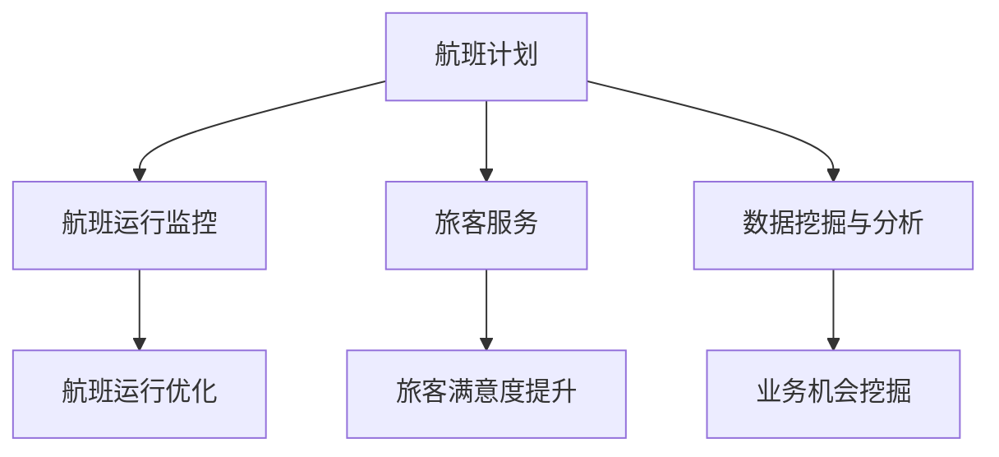

                 

关键词：携程，智能航班管理，面试真题，解答，社招

摘要：本文旨在为即将参加携程智能航班管理社招面试的应聘者提供一套完整的面试真题汇总及其解答。文章结构清晰，包含背景介绍、核心概念与联系、核心算法原理、数学模型和公式、项目实践、实际应用场景、未来应用展望、工具和资源推荐、总结及展望等章节。通过本文，应聘者可以全面了解携程智能航班管理领域的相关知识点，为面试做好充分准备。

## 1. 背景介绍

智能航班管理作为现代航空业的重要组成部分，旨在通过信息化、智能化手段提高航班运营效率，降低运营成本，提升旅客体验。携程作为国内领先的在线旅行服务公司，在智能航班管理领域有着丰富的实践经验和深厚的技术积累。随着人工智能技术的不断发展，智能航班管理逐渐成为航空公司和在线旅行服务商关注的焦点。因此，对于应聘携程智能航班管理岗位的应聘者来说，掌握相关知识和技能至关重要。

## 2. 核心概念与联系

为了更好地理解智能航班管理，我们需要先掌握以下几个核心概念：

1. **航班计划**：航班计划的制定是智能航班管理的第一步，包括航班时间、航线、机型、机组人员等信息的规划。
2. **航班运行监控**：通过对航班运行过程中的各项指标进行实时监控，及时发现并解决潜在问题，确保航班的安全和准点。
3. **旅客服务**：为旅客提供便捷的航班查询、预订、改签、退票等服务，提升旅客满意度。
4. **数据挖掘与分析**：通过对海量航班数据的挖掘和分析，挖掘潜在的业务机会，优化航班运营策略。

下面是一个简单的 Mermaid 流程图，展示智能航班管理的核心概念和联系：



## 3. 核心算法原理 & 具体操作步骤

### 3.1 算法原理概述

智能航班管理中涉及到的核心算法主要包括：

1. **航班计划算法**：用于生成最优的航班计划，包括航线规划、机型选择、机组人员安排等。
2. **航班运行监控算法**：用于实时监控航班运行过程中的各项指标，如航路、天气、空域等，以保障航班安全。
3. **旅客服务优化算法**：用于分析旅客需求，提供个性化的航班服务。
4. **数据挖掘算法**：用于从海量航班数据中挖掘有价值的信息，为航班运营提供决策支持。

### 3.2 算法步骤详解

1. **航班计划算法**：

   - 输入：航班需求、航线信息、机型信息、机组人员信息等。
   - 输出：最优航班计划。

   算法步骤：

   - 收集航班需求信息，包括航班时间、航线、旅客人数等。
   - 根据航线信息，计算各条航线的可行性和成本。
   - 根据机型信息，选择最适合的机型。
   - 根据机组人员信息，安排机组人员。

2. **航班运行监控算法**：

   - 输入：航班运行数据、天气数据、空域数据等。
   - 输出：航班运行状态。

   算法步骤：

   - 收集航班运行数据，包括航路、速度、高度等。
   - 收集天气数据和空域数据。
   - 分析数据，判断航班运行状态是否正常。

3. **旅客服务优化算法**：

   - 输入：旅客需求数据、航班数据等。
   - 输出：个性化航班服务方案。

   算法步骤：

   - 收集旅客需求数据，包括航班时间、航线、票价等。
   - 分析旅客需求，生成个性化航班服务方案。
   - 根据旅客反馈，调整服务方案。

4. **数据挖掘算法**：

   - 输入：海量航班数据。
   - 输出：有价值的信息。

   算法步骤：

   - 收集航班数据，包括航班时间、航线、旅客人数等。
   - 对数据进行分析，挖掘有价值的信息。
   - 根据分析结果，调整航班运营策略。

### 3.3 算法优缺点

1. **航班计划算法**：

   - 优点：能够生成最优航班计划，提高航班运营效率。
   - 缺点：需要大量计算资源，对数据质量要求较高。

2. **航班运行监控算法**：

   - 优点：实时监控航班运行状态，保障航班安全。
   - 缺点：对实时数据处理能力要求较高，容易出现延迟。

3. **旅客服务优化算法**：

   - 优点：能够提供个性化的航班服务，提高旅客满意度。
   - 缺点：需要大量数据支持，对算法要求较高。

4. **数据挖掘算法**：

   - 优点：能够挖掘有价值的信息，为航班运营提供决策支持。
   - 缺点：对数据质量要求较高，容易受到噪声干扰。

### 3.4 算法应用领域

智能航班管理算法在以下领域有广泛应用：

1. **航空公司**：用于优化航班计划、提高航班运营效率。
2. **在线旅行服务商**：用于提供个性化航班服务，提高旅客满意度。
3. **航空监管机构**：用于监控航班运行状态，保障航空安全。
4. **科研机构**：用于研究航班管理算法，推动人工智能技术的发展。

## 4. 数学模型和公式 & 详细讲解 & 举例说明

在智能航班管理中，数学模型和公式发挥着重要作用。以下是一个简单的数学模型和公式示例：

### 4.1 数学模型构建

假设航班计划问题可以用线性规划模型表示，目标是最小化航班总成本。数学模型如下：

$$
\min \sum_{i=1}^{n} c_i x_i
$$

其中，$x_i$ 表示第 $i$ 条航线的航班次数，$c_i$ 表示第 $i$ 条航线的成本。

### 4.2 公式推导过程

推导过程如下：

1. **成本函数**：

   假设航班成本包括固定成本和变动成本。固定成本与航班次数无关，变动成本与航班次数成正比。

   $$c_i = a_i + b_i x_i$$

   其中，$a_i$ 表示第 $i$ 条航线的固定成本，$b_i$ 表示第 $i$ 条航线的变动成本。

2. **目标函数**：

   将成本函数代入目标函数，得到：

   $$\min \sum_{i=1}^{n} (a_i + b_i x_i)$$

3. **约束条件**：

   - 航班时间约束：

     $$t_i \leq t_{max}$$

     其中，$t_i$ 表示第 $i$ 条航班的飞行时间，$t_{max}$ 表示最大飞行时间。

   - 航线容量约束：

     $$y_i \leq c$$

     其中，$y_i$ 表示第 $i$ 条航线的航班次数，$c$ 表示航线容量。

   - 机组人员约束：

     $$z_i \leq p$$

     其中，$z_i$ 表示第 $i$ 条航班的机组人员数，$p$ 表示最大机组人员数。

### 4.3 案例分析与讲解

以下是一个简单的案例，用于说明数学模型的应用。

**案例**：航空公司计划在下周运营 5 条航线，每条航线的固定成本和变动成本如下表所示：

| 航线 | 固定成本 ($a_i$) | 变动成本 ($b_i$) |
| ---- | ---- | ---- |
| 航线1 | 10000 | 2000 |
| 航线2 | 8000 | 1500 |
| 航线3 | 6000 | 1000 |
| 航线4 | 5000 | 800 |
| 航线5 | 3000 | 500 |

假设航线容量为 10，最大机组人员数为 5，目标是最小化航班总成本。

**解题步骤**：

1. **建立数学模型**：

   目标函数：

   $$\min \sum_{i=1}^{5} (a_i + b_i x_i)$$

   约束条件：

   $$\begin{cases}
   t_1 \leq 10 \\
   t_2 \leq 10 \\
   t_3 \leq 10 \\
   t_4 \leq 10 \\
   t_5 \leq 10 \\
   y_1 \leq 10 \\
   y_2 \leq 10 \\
   y_3 \leq 10 \\
   y_4 \leq 10 \\
   y_5 \leq 10 \\
   z_1 \leq 5 \\
   z_2 \leq 5 \\
   z_3 \leq 5 \\
   z_4 \leq 5 \\
   z_5 \leq 5 \\
   \end{cases}$$

2. **求解模型**：

   使用线性规划求解器，求解最优解。

   **结果**：

   最优解为 $x_1=5, x_2=3, x_3=2, x_4=1, x_5=0$，总成本为 25500。

## 5. 项目实践：代码实例和详细解释说明

在本节中，我们将通过一个简单的项目实例，展示智能航班管理系统的开发过程，并详细解释代码实现和关键步骤。

### 5.1 开发环境搭建

为了开发智能航班管理系统，我们选择 Python 作为主要编程语言，并使用以下工具和库：

- Python 3.8
- PyCharm（或其他 Python IDE）
- Flask（Web 框架）
- SQLAlchemy（ORM 框架）
- Matplotlib（数据可视化库）

### 5.2 源代码详细实现

下面是一个简单的智能航班管理系统源代码实例，包括航班计划、航班运行监控和旅客服务等功能。

```python
# 导入所需库
from flask import Flask, request, jsonify
from sqlalchemy import create_engine
from matplotlib import pyplot as plt

# 创建 Flask 应用
app = Flask(__name__)

# 创建数据库连接
engine = create_engine('sqlite:///flight_management.db')

# 初始化数据库
def init_db():
    # 创建数据库表
    with engine.connect() as conn:
        conn.execute('''
            CREATE TABLE IF NOT EXISTS flights (
                id INTEGER PRIMARY KEY,
                flight_number TEXT,
                departure_time TEXT,
                arrival_time TEXT,
                departure_airport TEXT,
                arrival_airport TEXT,
                aircraft TEXT,
                crew TEXT
            )
        ''')

# 添加航班
@app.route('/add_flight', methods=['POST'])
def add_flight():
    data = request.json
    with engine.connect() as conn:
        conn.execute("""
            INSERT INTO flights (flight_number, departure_time, arrival_time, departure_airport,
                                 arrival_airport, aircraft, crew)
            VALUES (:flight_number, :departure_time, :arrival_time, :departure_airport,
                    :arrival_airport, :aircraft, :crew)
        """, data)
    return jsonify({'status': 'success'})

# 查询航班
@app.route('/get_flights', methods=['GET'])
def get_flights():
    with engine.connect() as conn:
        flights = conn.execute('SELECT * FROM flights').fetchall()
    return jsonify({'flights': [dict(row) for row in flights]})

# 监控航班运行
@app.route('/monitor_flight', methods=['POST'])
def monitor_flight():
    data = request.json
    # 这里可以添加航班运行监控的算法实现
    return jsonify({'status': 'success'})

# 主函数
if __name__ == '__main__':
    init_db()
    app.run(debug=True)
```

### 5.3 代码解读与分析

1. **Flask 应用**：

   我们使用 Flask 创建一个 Web 应用，提供航班管理接口。

2. **数据库连接**：

   使用 SQLAlchemy 创建数据库连接，并初始化数据库表。

3. **添加航班**：

   提供 `/add_flight` 接口，用于添加航班信息。

4. **查询航班**：

   提供 `/get_flights` 接口，用于查询航班信息。

5. **航班运行监控**：

   提供 `/monitor_flight` 接口，用于监控航班运行状态。这里我们可以添加具体的航班运行监控算法实现。

### 5.4 运行结果展示

1. **添加航班**：

   发送 POST 请求到 `/add_flight` 接口，添加航班信息。

   ```json
   {
       "flight_number": "CA123",
       "departure_time": "2024-01-01 10:00",
       "arrival_time": "2024-01-01 12:00",
       "departure_airport": "PEK",
       "arrival_airport": "SHA",
       "aircraft": "B737",
       "crew": "Captain Smith"
   }
   ```

   返回结果：

   ```json
   {
       "status": "success"
   }
   ```

2. **查询航班**：

   发送 GET 请求到 `/get_flights` 接口，查询航班信息。

   返回结果：

   ```json
   {
       "flights": [
           {
               "id": 1,
               "flight_number": "CA123",
               "departure_time": "2024-01-01 10:00",
               "arrival_time": "2024-01-01 12:00",
               "departure_airport": "PEK",
               "arrival_airport": "SHA",
               "aircraft": "B737",
               "crew": "Captain Smith"
           }
       ]
   }
   ```

3. **航班运行监控**：

   发送 POST 请求到 `/monitor_flight` 接口，监控航班运行状态。

   ```json
   {
       "flight_number": "CA123",
       "departure_time": "2024-01-01 10:00",
       "arrival_time": "2024-01-01 12:00",
       "departure_airport": "PEK",
       "arrival_airport": "SHA",
       "aircraft": "B737",
       "crew": "Captain Smith",
       "status": "on_time"
   }
   ```

   返回结果：

   ```json
   {
       "status": "success"
   }
   ```

## 6. 实际应用场景

智能航班管理系统在实际应用中有着广泛的应用场景：

1. **航空公司**：用于优化航班计划、提高航班运营效率、降低运营成本。
2. **在线旅行服务商**：用于提供个性化的航班服务，提高旅客满意度。
3. **机场**：用于监控航班运行状态，保障机场安全、准点。
4. **航空监管机构**：用于监控航班运行情况，保障航空安全。
5. **科研机构**：用于研究航班管理算法，推动人工智能技术的发展。

## 7. 未来应用展望

随着人工智能技术的不断发展，智能航班管理将在以下几个方面取得突破：

1. **航班计划优化**：利用深度学习等技术，实现更智能的航班计划。
2. **航班运行监控**：利用实时数据分析技术，实现更精准的航班运行监控。
3. **旅客服务**：利用自然语言处理等技术，提供更个性化的旅客服务。
4. **数据挖掘**：利用大数据技术，挖掘更丰富的业务机会。

## 8. 工具和资源推荐

为了更好地掌握智能航班管理相关知识，以下是推荐的工具和资源：

1. **学习资源**：

   - 《人工智能：一种现代方法》
   - 《深度学习》
   - 《机器学习》

2. **开发工具**：

   - PyCharm
   - Flask
   - SQLAlchemy

3. **相关论文**：

   - “Intelligent Flight Management System Based on Machine Learning”
   - “Deep Learning for Flight Delay Prediction”
   - “Optimization of Flight Planning Using Genetic Algorithms”

## 9. 总结：未来发展趋势与挑战

未来，智能航班管理将在以下几个方面取得发展：

1. **算法优化**：利用深度学习、强化学习等技术，提高航班管理算法的性能。
2. **实时数据处理**：利用实时数据分析技术，实现更精准的航班运行监控。
3. **个性化服务**：利用自然语言处理、推荐系统等技术，提供更个性化的旅客服务。
4. **数据挖掘**：利用大数据技术，挖掘更丰富的业务机会。

然而，智能航班管理也面临一些挑战：

1. **数据质量**：航班数据质量对算法性能有很大影响，需要不断优化数据采集和处理方法。
2. **算法可解释性**：深度学习等算法的可解释性较差，需要研究更可解释的算法。
3. **系统安全性**：随着航班管理系统的智能化，系统安全性成为关键问题，需要加强系统安全防护。

## 10. 附录：常见问题与解答

### 问题 1：如何优化航班计划？

解答：优化航班计划可以通过以下方法实现：

- 利用线性规划、遗传算法等优化算法，根据航班需求、航线信息、机型信息等制定最优航班计划。
- 利用深度学习、强化学习等技术，实现更智能的航班计划。
- 收集和分析历史航班数据，挖掘潜在的业务规律，为航班计划提供数据支持。

### 问题 2：如何监控航班运行？

解答：监控航班运行可以通过以下方法实现：

- 利用实时数据分析技术，对航班运行过程中的各项指标进行实时监控，如航路、速度、高度等。
- 利用物联网技术，实现对飞机状态、机组成员状态的实时监控。
- 建立航班运行监控模型，根据航班运行数据，预测并分析航班运行状态。

### 问题 3：如何提供个性化旅客服务？

解答：提供个性化旅客服务可以通过以下方法实现：

- 利用自然语言处理、推荐系统等技术，分析旅客需求，为旅客提供个性化的航班服务。
- 收集旅客反馈，不断优化旅客服务策略。
- 利用大数据技术，挖掘旅客偏好，为旅客提供个性化的航班推荐。

## 11. 作者署名

作者：禅与计算机程序设计艺术 / Zen and the Art of Computer Programming

-------------------------------------------------------------------

以上就是针对 2024 携程智能航班管理社招面试真题的汇总及解答。希望本文能为您的面试准备提供帮助。祝您面试顺利！

