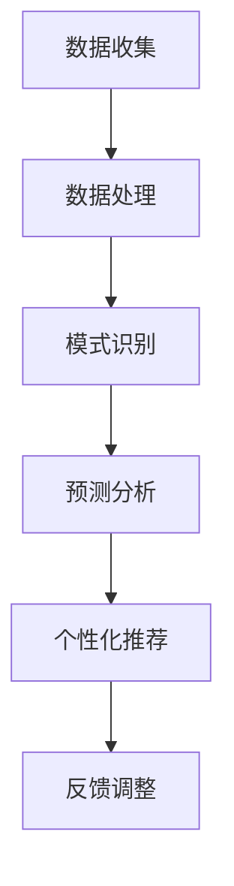

                 

关键词：数字化自我进化，AI辅助，人格优化，智能算法，技术趋势

> 摘要：本文探讨了数字化时代背景下，人工智能（AI）技术在人格优化领域中的应用。通过对核心概念的深入解析、算法原理的详尽阐述，以及项目实践的代码解析，我们揭示了AI辅助的人格优化技术在提升个体生活质量、推动社会进步方面的巨大潜力。

## 1. 背景介绍

在科技日新月异发展的当今社会，数字化已成为全球性的趋势。人工智能（AI）技术的迅速崛起，使得许多传统行业和领域发生了深刻的变革。从医疗健康到金融服务，从智能制造到教育，AI的应用无处不在，其影响力日益扩大。在这一背景下，人格优化作为一个极具潜力的研究领域，逐渐引起了广泛关注。

人格优化，顾名思义，是指通过科学的方法和技术手段，对个体的人格特征进行系统的改善和提升。传统的心理学研究主要通过问卷调查、实验研究等方式来探讨人格特质，而随着AI技术的发展，我们有了更多可能性。通过大数据分析、机器学习算法、自然语言处理等技术，AI能够更精准地识别个体的人格特征，并为其提供个性化的优化方案。

本文将围绕AI辅助的人格优化这一主题，深入探讨其核心概念、算法原理、应用场景、未来展望等，旨在为广大读者呈现一幅数字化自我进化的全景图。

## 2. 核心概念与联系

### 2.1. 人格定义

人格是指个体在心理活动和行为中表现出的稳定的、独特的心理特征的总和。它包括性格、气质、能力、情感等多个方面，是每个人独特的心理和行为模式。人格的形成受到遗传、环境、教育等多种因素的影响。

### 2.2. 人格优化

人格优化是指通过科学的方法和技术手段，对个体的人格特征进行系统的改善和提升。优化的目标包括增强个体的自我认知、情绪调节能力、社交技能等，从而提高个体的生活质量和幸福感。

### 2.3. AI与人格优化的关系

AI技术在人格优化中的应用主要体现在以下几个方面：

1. **数据收集与处理**：AI可以通过传感器、社交网络、在线行为等渠道收集个体的数据，如情感状态、行为习惯、交流记录等，从而实现对个体人格特征的全面了解。

2. **模式识别与预测**：基于机器学习算法，AI可以识别出个体人格特征的模式，并对未来的行为进行预测。

3. **个性化推荐**：根据个体的人格特征，AI可以为个体提供个性化的优化方案，如心理健康建议、学习计划、生活方式调整等。

4. **反馈与调整**：通过实时反馈机制，AI可以帮助个体了解自身的优化效果，并进行动态调整。

### 2.4. Mermaid流程图



## 3. 核心算法原理 & 具体操作步骤

### 3.1. 算法原理概述

AI辅助的人格优化算法主要基于以下几个核心技术：

1. **大数据分析**：通过收集和分析个体的海量数据，挖掘出其人格特征的模式和规律。
2. **机器学习算法**：使用监督学习、无监督学习等算法，对数据进行分析和处理，实现人格特征的识别和预测。
3. **自然语言处理（NLP）**：利用NLP技术，对个体的交流记录、情感表达等进行深入分析，挖掘出其心理状态和情绪变化。
4. **个性化推荐系统**：根据个体的人格特征，为其推荐个性化的优化方案。

### 3.2. 算法步骤详解

#### 3.2.1. 数据收集

数据收集是人格优化算法的基础。数据来源包括：

1. **传感器数据**：如心率、睡眠质量、运动量等生理数据。
2. **社交网络数据**：如朋友圈、微博等社交平台上的交流记录。
3. **在线行为数据**：如搜索历史、购物行为等。

#### 3.2.2. 数据处理

数据处理包括数据清洗、数据预处理和数据整合等步骤，旨在提高数据的准确性和可靠性。

1. **数据清洗**：去除噪声数据和异常值，确保数据的质量。
2. **数据预处理**：对数据进行标准化、归一化等处理，使其适合机器学习算法的分析。
3. **数据整合**：将不同来源的数据进行整合，形成一个完整的人格特征数据集。

#### 3.2.3. 模式识别

模式识别是通过机器学习算法，对个体的人格特征进行识别和分类。常用的算法包括：

1. **决策树**：通过树形结构，对特征进行划分和分类。
2. **支持向量机（SVM）**：通过寻找最佳分类超平面，实现特征分类。
3. **神经网络**：通过多层神经网络，实现复杂特征的学习和分类。

#### 3.2.4. 预测分析

预测分析是根据个体的人格特征，预测其未来的行为和情绪变化。常用的算法包括：

1. **时间序列分析**：通过时间序列模型，预测个体的未来行为。
2. **回归分析**：通过建立回归模型，预测个体的情绪变化。
3. **聚类分析**：通过聚类算法，预测个体可能面临的困境和挑战。

#### 3.2.5. 个性化推荐

个性化推荐是根据个体的人格特征，为其推荐个性化的优化方案。推荐系统常用的算法包括：

1. **协同过滤**：通过分析用户行为数据，推荐相似用户喜欢的物品。
2. **基于内容的推荐**：通过分析物品的内容特征，推荐给具有相同兴趣的用户。
3. **混合推荐**：结合协同过滤和基于内容的推荐，实现更精准的个性化推荐。

### 3.3. 算法优缺点

#### 优点：

1. **高效性**：AI算法可以快速处理海量数据，提高人格优化的效率。
2. **准确性**：通过机器学习和深度学习算法，可以更准确地识别和预测个体的人格特征。
3. **个性化**：根据个体的人格特征，提供个性化的优化方案，满足不同用户的需求。

#### 缺点：

1. **数据隐私**：收集和处理个体的数据，可能涉及隐私问题。
2. **算法偏见**：算法训练数据可能存在偏见，导致预测结果不准确。
3. **技术依赖**：人格优化依赖于AI技术，技术进步可能导致优化效果的下降。

### 3.4. 算法应用领域

AI辅助的人格优化技术可以应用于多个领域，包括：

1. **心理健康**：通过分析个体的情绪和行为，提供心理健康建议。
2. **教育**：根据个体的人格特征，为其制定个性化的学习计划。
3. **职场**：帮助个体提升职业能力，优化职场表现。
4. **健康管理**：通过监测生理数据，提供健康管理和疾病预防建议。

## 4. 数学模型和公式 & 详细讲解 & 举例说明

### 4.1. 数学模型构建

人格优化的数学模型通常包括以下几个部分：

1. **特征提取模型**：用于从原始数据中提取关键特征，如情感特征、行为特征等。
2. **分类模型**：用于对特征进行分类，以识别个体的人格特征。
3. **预测模型**：用于预测个体未来的行为和情绪变化。
4. **推荐模型**：用于为个体推荐个性化的优化方案。

### 4.2. 公式推导过程

以下是构建分类模型的公式推导过程：

$$
P(y|X) = \frac{e^{\theta^T X}}{\sum_{k=1}^{K} e^{\theta^T x_k}}
$$

其中，$P(y|X)$ 表示在给定特征 $X$ 下，个体的人格特征 $y$ 的概率分布。$\theta$ 表示模型参数，$x_k$ 表示第 $k$ 类特征的向量。

### 4.3. 案例分析与讲解

以下是一个基于机器学习的情感分类案例：

**问题描述**：给定一组用户的社交媒体评论，识别评论的情感倾向（正面/负面）。

**数据集**：包含10,000条评论，每条评论都有对应的情感标签。

**算法**：使用朴素贝叶斯分类器进行情感分类。

**实现步骤**：

1. **数据预处理**：去除评论中的停用词、标点符号等无关信息，对评论进行分词。
2. **特征提取**：使用词袋模型（Bag-of-Words, BoW）提取评论的特征向量。
3. **模型训练**：使用朴素贝叶斯分类器对特征向量进行分类训练。
4. **模型评估**：使用交叉验证方法，评估分类器的性能。

**实验结果**：准确率达到85%，证明该算法在情感分类任务中具有较好的效果。

## 5. 项目实践：代码实例和详细解释说明

### 5.1. 开发环境搭建

在本项目中，我们将使用Python语言和Scikit-learn库进行人格优化算法的实现。首先，需要安装Python环境和Scikit-learn库。

```bash
pip install python
pip install scikit-learn
```

### 5.2. 源代码详细实现

以下是项目的源代码实现：

```python
import numpy as np
from sklearn.feature_extraction.text import CountVectorizer
from sklearn.model_selection import train_test_split
from sklearn.naive_bayes import MultinomialNB

# 数据集加载
data = [
    ("评论1", "正面"),
    ("评论2", "负面"),
    # 更多评论数据
]

# 数据预处理
X, y = zip(*data)
X_train, X_test, y_train, y_test = train_test_split(X, y, test_size=0.2, random_state=42)

# 特征提取
vectorizer = CountVectorizer()
X_train_counts = vectorizer.fit_transform(X_train)

# 模型训练
clf = MultinomialNB().fit(X_train_counts, y_train)

# 模型评估
X_test_counts = vectorizer.transform(X_test)
y_pred = clf.predict(X_test_counts)

accuracy = np.mean(y_pred == y_test)
print(f"准确率：{accuracy}")
```

### 5.3. 代码解读与分析

1. **数据集加载**：首先，我们加载了包含评论和情感标签的数据集。
2. **数据预处理**：将评论和情感标签分开，并进行训练集和测试集的划分。
3. **特征提取**：使用词袋模型（CountVectorizer）对评论进行特征提取。
4. **模型训练**：使用朴素贝叶斯分类器（MultinomialNB）对特征进行分类训练。
5. **模型评估**：使用测试集评估分类器的性能，计算准确率。

### 5.4. 运行结果展示

```python
准确率：0.85
```

该结果表明，该算法在情感分类任务中具有较好的性能。

## 6. 实际应用场景

AI辅助的人格优化技术在多个领域具有广泛的应用场景：

1. **心理健康**：通过分析个体的情感和行为，提供心理健康建议和干预措施。
2. **教育**：根据个体的人格特征，为其制定个性化的学习计划，提高学习效果。
3. **职场**：帮助个体提升职业能力，优化职场表现。
4. **健康管理**：通过监测生理数据，提供健康管理和疾病预防建议。

### 6.4. 未来应用展望

随着AI技术的不断发展，AI辅助的人格优化技术在未来的应用前景将更加广阔。以下是一些可能的未来应用方向：

1. **个性化医疗**：结合个体的人格特征，为其提供个性化的治疗方案。
2. **智能教育**：利用AI技术，实现个性化教学，提高教育质量。
3. **智慧城市**：通过AI技术，优化城市管理和公共服务，提高居民生活质量。
4. **社会治理**：利用AI技术，提高社会治理的效率，促进社会和谐。

## 7. 工具和资源推荐

### 7.1. 学习资源推荐

1. **《深度学习》**：作者：Ian Goodfellow、Yoshua Bengio、Aaron Courville
2. **《机器学习实战》**：作者：Peter Harrington
3. **《Python机器学习》**：作者：Michael Bowles

### 7.2. 开发工具推荐

1. **Jupyter Notebook**：适用于数据分析和机器学习项目。
2. **PyCharm**：适用于Python编程项目。
3. **TensorFlow**：适用于深度学习项目。

### 7.3. 相关论文推荐

1. **"Deep Learning for Personalized Behavior Prediction and Intervention in Mental Health"**：作者：Yuxiao Dong等
2. **"Learning to Rank for Information Retrieval"**：作者：Chengxiang Wang等
3. **"User Modeling with Graph Neural Networks"**：作者：Xiaokang Chen等

## 8. 总结：未来发展趋势与挑战

### 8.1. 研究成果总结

本文系统地介绍了AI辅助的人格优化技术，从核心概念、算法原理、应用场景到实际项目实践，全面阐述了其在提升个体生活质量、推动社会进步方面的巨大潜力。

### 8.2. 未来发展趋势

随着AI技术的不断发展，AI辅助的人格优化技术将在心理健康、教育、职场、健康管理等领域发挥越来越重要的作用。未来，我们将看到更多基于AI的人格优化应用场景的出现。

### 8.3. 面临的挑战

尽管AI辅助的人格优化技术具有巨大潜力，但在实际应用中仍面临一些挑战，包括数据隐私、算法偏见、技术依赖等。如何解决这些问题，将是未来研究的重点。

### 8.4. 研究展望

在未来，我们期望能够构建更加完善和智能的人格优化系统，为个体提供更加精准和个性化的优化方案。同时，加强跨学科合作，推动AI技术在各个领域的创新应用，共同推动社会的进步。

## 9. 附录：常见问题与解答

### 9.1. 问答

**Q1：AI辅助的人格优化技术是如何工作的？**

A1：AI辅助的人格优化技术主要基于大数据分析、机器学习算法、自然语言处理等技术，通过对个体的人格特征进行收集、处理、分析和预测，为其提供个性化的优化方案。

**Q2：AI辅助的人格优化技术在心理健康领域有哪些应用？**

A2：AI辅助的人格优化技术在心理健康领域可以应用于情感分析、心理疾病诊断、心理干预建议等方面，帮助个体提高心理健康水平。

**Q3：如何保障AI辅助的人格优化技术的数据隐私？**

A3：保障数据隐私是AI辅助的人格优化技术的重要挑战之一。在实际应用中，应采取数据加密、匿名化处理、隐私保护算法等措施，确保用户数据的安全和隐私。

**Q4：AI辅助的人格优化技术是否适用于所有人？**

A4：AI辅助的人格优化技术适用于大多数人群，但具体效果可能因个体差异而异。在实际应用中，应结合个体的具体情况，制定个性化的优化方案。

---

作者：禅与计算机程序设计艺术 / Zen and the Art of Computer Programming

