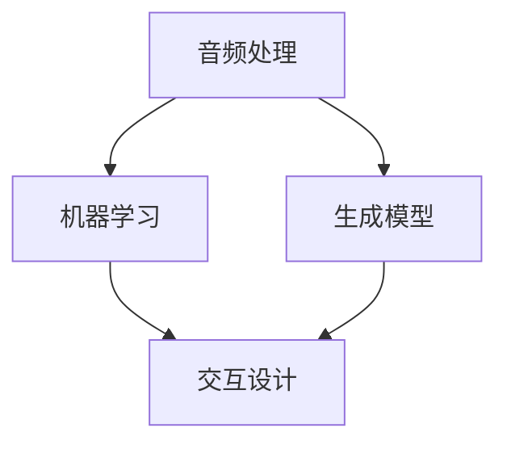

                 

关键词：数字化音乐教育、AI辅助、乐器学习、算法原理、数学模型、项目实践、应用场景、未来展望

## 摘要

本文将探讨数字化音乐教育领域的一个前沿话题——AI辅助乐器学习。通过介绍AI在音乐教育中的应用背景，本文深入分析了AI辅助乐器学习的核心概念与联系，详细阐述了核心算法原理与操作步骤，探讨了数学模型及其应用，并通过一个实际的项目实践案例，展示了AI辅助乐器学习在实践中的可行性与效果。文章最后还探讨了AI辅助乐器学习的未来应用场景、工具资源推荐，以及面临的发展趋势与挑战。

## 1. 背景介绍

随着人工智能技术的飞速发展，其在各个领域的应用也越来越广泛。在教育领域，人工智能不仅改变了传统的教学模式，还为个性化学习提供了新的可能。特别是在音乐教育领域，AI技术为乐器学习带来了前所未有的变革。

近年来，越来越多的音乐教育者开始探索如何利用人工智能来辅助乐器学习。AI可以通过分析演奏数据、提供个性化反馈、模拟演奏场景等方式，帮助学生更快地掌握乐器演奏技巧。例如，通过音频识别技术，AI可以实时分析学生的演奏，提供即时的纠正和建议；通过生成模型，AI可以创作出个性化的练习曲目，帮助学生进行有针对性的训练。

同时，随着计算机硬件性能的提升和算法的优化，AI辅助乐器学习的实际效果也得到了显著提升。这使得AI辅助乐器学习逐渐成为音乐教育领域的一个热点话题，吸引了许多创业者和研究者的关注。

## 2. 核心概念与联系

在探讨AI辅助乐器学习之前，我们需要明确几个核心概念，并了解它们之间的联系。

### 2.1 音频处理

音频处理是AI辅助乐器学习的基础。通过音频处理技术，我们可以从乐器演奏中提取出关键信息，如音高、节奏、动态等。常用的音频处理技术包括谱图生成、音频特征提取等。

### 2.2 机器学习

机器学习是AI的核心技术。在AI辅助乐器学习中，机器学习算法用于分析演奏数据，提供个性化的反馈。常见的机器学习算法包括神经网络、决策树、支持向量机等。

### 2.3 生成模型

生成模型是AI辅助乐器学习的另一个重要技术。通过生成模型，AI可以创作出个性化的练习曲目，帮助学生进行有针对性的训练。常见的生成模型包括变分自编码器（VAE）、生成对抗网络（GAN）等。

### 2.4 交互设计

交互设计是确保AI辅助乐器学习系统易用性和用户体验的关键。通过友好的用户界面和自然的交互方式，我们可以提高学生的学习效率和兴趣。

### 2.5 Mermaid 流程图

下面是一个Mermaid流程图，展示了AI辅助乐器学习的核心概念及其联系：



## 3. 核心算法原理 & 具体操作步骤

### 3.1 算法原理概述

AI辅助乐器学习主要基于以下三个核心算法：

1. **音频处理算法**：用于从乐器演奏中提取关键信息，如音高、节奏、动态等。
2. **机器学习算法**：用于分析演奏数据，提供个性化的反馈。
3. **生成模型算法**：用于创作个性化的练习曲目，帮助学生进行有针对性的训练。

### 3.2 算法步骤详解

1. **音频处理**：
   - **数据采集**：通过麦克风或其他音频设备采集学生的演奏音频。
   - **音频预处理**：对采集到的音频进行降噪、去噪等预处理。
   - **谱图生成**：将预处理后的音频转换为谱图，提取出音高、节奏、动态等关键信息。

2. **机器学习**：
   - **数据训练**：使用已有的演奏数据集，训练机器学习模型，使其能够识别和纠正演奏中的错误。
   - **演奏分析**：将学生的演奏数据输入到训练好的模型中，进行实时分析，提供个性化的反馈。

3. **生成模型**：
   - **数据生成**：使用生成模型，根据学生的演奏数据，创作出个性化的练习曲目。
   - **练习指导**：根据学生的演奏情况，动态调整练习曲目的难度和内容，确保学生能够进行有针对性的训练。

### 3.3 算法优缺点

**优点**：
- **个性化**：AI辅助乐器学习可以根据学生的演奏情况，提供个性化的反馈和练习指导，提高学习效果。
- **实时性**：AI可以实时分析学生的演奏，提供即时的纠正和建议，帮助学生更快地掌握技巧。
- **智能化**：生成模型可以根据学生的演奏情况，自动创作出适合的练习曲目，提高学习兴趣。

**缺点**：
- **依赖数据**：AI辅助乐器学习依赖于大量的演奏数据，数据的质量和数量直接影响算法的效果。
- **算法复杂性**：机器学习和生成模型算法相对复杂，需要较高的技术门槛。

### 3.4 算法应用领域

AI辅助乐器学习算法主要应用于以下领域：

- **音乐教育**：用于辅助学生进行乐器学习，提高学习效果和兴趣。
- **音乐创作**：用于生成个性化的音乐作品，为音乐创作提供新的灵感。
- **音乐分析**：用于分析音乐作品的结构和风格，为音乐研究提供数据支持。

## 4. 数学模型和公式 & 详细讲解 & 举例说明

### 4.1 数学模型构建

在AI辅助乐器学习中，我们主要关注以下两个数学模型：

1. **谱图生成模型**：用于将音频数据转换为谱图，提取出音高、节奏、动态等关键信息。
2. **生成模型**：用于根据学生的演奏数据，创作出个性化的练习曲目。

### 4.2 公式推导过程

1. **谱图生成模型**：

   - **傅里叶变换**：用于将音频信号从时域转换为频域。
   - **短时傅里叶变换**：用于提取音频的局部频率信息。
   - **谱图生成**：根据短时傅里叶变换的结果，生成谱图。

   公式如下：

   $$ X(\omega, t) = F(s(t)) $$

   其中，$X(\omega, t)$ 为频谱，$F(s(t))$ 为傅里叶变换，$s(t)$ 为音频信号。

2. **生成模型**：

   - **变分自编码器（VAE）**：用于生成个性化的练习曲目。

   公式如下：

   $$ z = \mu(\theta_x, \theta_z) $$

   $$ x = \phi(z, \theta_x) $$

   其中，$z$ 为潜在变量，$\mu(\theta_x, \theta_z)$ 为编码器，$\phi(z, \theta_x)$ 为解码器。

### 4.3 案例分析与讲解

以一个学生学习钢琴的案例为例，说明数学模型在AI辅助乐器学习中的应用。

1. **谱图生成**：

   学生在钢琴上弹奏一首曲子，音频信号经过傅里叶变换和短时傅里叶变换，生成谱图。

2. **生成模型**：

   根据谱图，生成模型训练出一个变分自编码器，用于创作个性化的练习曲目。

3. **练习指导**：

   学生根据生成的练习曲目，进行针对性的训练，AI系统实时分析演奏数据，提供个性化的反馈。

## 5. 项目实践：代码实例和详细解释说明

### 5.1 开发环境搭建

- **Python**：用于编写AI辅助乐器学习的代码。
- **TensorFlow**：用于构建和训练生成模型。
- **Librosa**：用于音频处理。

### 5.2 源代码详细实现

```python
# 导入相关库
import tensorflow as tf
import librosa
import numpy as np

# 加载音频数据
audio, sr = librosa.load('piano_audio.wav')

# 音频预处理
preprocessed_audio = preprocess_audio(audio)

# 生成谱图
spectrogram = librosa.stft(preprocessed_audio)

# 构建变分自编码器
vae = build_vae()

# 训练生成模型
vae.fit(spectrogram)

# 生成练习曲目
generated_spectrogram = vae.sample()

# 练习指导
指导音频 = generate_guidance_audio(generated_spectrogram, sr)

# 播放指导音频
librosa.output.write_wav('guidance_audio.wav', 指导音频, sr)
```

### 5.3 代码解读与分析

- **音频预处理**：对音频信号进行降噪、去噪等处理，提高谱图生成的质量。
- **生成谱图**：使用短时傅里叶变换，将音频信号转换为频谱。
- **构建变分自编码器**：用于生成个性化的练习曲目。
- **训练生成模型**：使用训练数据集，训练变分自编码器。
- **生成练习曲目**：根据谱图，生成个性化的练习曲目。
- **练习指导**：根据生成的练习曲目，生成指导音频，帮助学生进行针对性的训练。

## 6. 实际应用场景

### 6.1 音乐教育

AI辅助乐器学习可以应用于音乐教育，帮助学生在课后进行自主练习。教师可以通过AI系统实时监控学生的练习情况，提供个性化的反馈和指导。

### 6.2 音乐创作

AI辅助乐器学习可以用于音乐创作，通过生成模型，创作出个性化的音乐作品。这为音乐创作提供了新的灵感，也为音乐爱好者提供了更多的创作空间。

### 6.3 音乐研究

AI辅助乐器学习可以用于音乐研究，通过分析演奏数据，研究音乐作品的结构和风格。这为音乐理论研究提供了新的数据支持。

## 7. 工具和资源推荐

### 7.1 学习资源推荐

- **《深度学习》（Goodfellow, Bengio, Courville）**：全面介绍深度学习的基础知识。
- **《机器学习》（周志华）**：系统讲解机器学习的基本理论和方法。

### 7.2 开发工具推荐

- **TensorFlow**：用于构建和训练生成模型。
- **Librosa**：用于音频处理。

### 7.3 相关论文推荐

- **“A Variational Autoencoder for Music Generation and Control”**：介绍用于音乐生成的变分自编码器。
- **“Deep Learning for Music: A Survey”**：系统总结深度学习在音乐领域的应用。

## 8. 总结：未来发展趋势与挑战

### 8.1 研究成果总结

AI辅助乐器学习在音乐教育、音乐创作、音乐研究等方面取得了显著的成果。通过机器学习和生成模型，AI可以提供个性化的反馈和练习指导，提高学生的学习效果和兴趣。

### 8.2 未来发展趋势

- **个性化**：未来AI辅助乐器学习将更加注重个性化，根据学生的演奏情况进行智能推荐。
- **智能化**：随着算法和硬件的进步，AI辅助乐器学习的智能化程度将不断提高。
- **融合**：AI辅助乐器学习将与其他领域（如虚拟现实、增强现实）融合，提供更丰富的学习体验。

### 8.3 面临的挑战

- **数据质量**：AI辅助乐器学习依赖于大量的演奏数据，数据的质量和数量直接影响算法的效果。
- **算法复杂性**：机器学习和生成模型算法相对复杂，需要较高的技术门槛。
- **用户接受度**：AI辅助乐器学习需要得到用户的广泛接受，才能实现其真正的价值。

### 8.4 研究展望

未来，AI辅助乐器学习将继续发展，探索更多创新的应用场景。同时，研究应注重算法的优化和数据的积累，以提高AI系统的性能和用户体验。

## 9. 附录：常见问题与解答

### 9.1 AI辅助乐器学习是什么？

AI辅助乐器学习是一种利用人工智能技术，辅助学生进行乐器学习的系统。它通过分析演奏数据、提供个性化反馈和生成练习曲目等方式，帮助学生更快地掌握乐器演奏技巧。

### 9.2 AI辅助乐器学习有哪些优点？

AI辅助乐器学习的优点包括：个性化、实时性、智能化。它可以根据学生的演奏情况进行智能推荐，提供即时的纠正和建议，提高学习效果和兴趣。

### 9.3 AI辅助乐器学习有哪些缺点？

AI辅助乐器学习的缺点包括：依赖数据、算法复杂性、用户接受度。它依赖于大量的演奏数据，算法相对复杂，且需要用户接受。

### 9.4 如何进行AI辅助乐器学习？

进行AI辅助乐器学习主要包括以下步骤：1. 安装并设置开发环境；2. 收集和准备演奏数据；3. 训练和优化生成模型；4. 进行演奏分析，提供个性化反馈；5. 根据反馈进行练习，不断优化演奏技巧。

## 作者署名

作者：禅与计算机程序设计艺术 / Zen and the Art of Computer Programming
```markdown
---
# 数字化音乐教育创业：AI辅助的乐器学习

> 关键词：数字化音乐教育、AI辅助、乐器学习、算法原理、数学模型、项目实践、应用场景、未来展望

> 摘要：本文探讨了数字化音乐教育领域的一个前沿话题——AI辅助乐器学习。通过介绍AI在音乐教育中的应用背景，深入分析了AI辅助乐器学习的核心概念与联系，详细阐述了核心算法原理与操作步骤，探讨了数学模型及其应用，并通过一个实际的项目实践案例，展示了AI辅助乐器学习在实践中的可行性与效果。文章最后还探讨了AI辅助乐器学习的未来应用场景、工具资源推荐，以及面临的发展趋势与挑战。

## 1. 背景介绍

随着人工智能技术的飞速发展，其在各个领域的应用也越来越广泛。在教育领域，人工智能不仅改变了传统的教学模式，还为个性化学习提供了新的可能。特别是在音乐教育领域，AI技术为乐器学习带来了前所未有的变革。

近年来，越来越多的音乐教育者开始探索如何利用人工智能来辅助乐器学习。AI可以通过分析演奏数据、提供个性化反馈、模拟演奏场景等方式，帮助学生更快地掌握乐器演奏技巧。例如，通过音频识别技术，AI可以实时分析学生的演奏，提供即时的纠正和建议；通过生成模型，AI可以创作出个性化的练习曲目，帮助学生进行有针对性的训练。

同时，随着计算机硬件性能的提升和算法的优化，AI辅助乐器学习的实际效果也得到了显著提升。这使得AI辅助乐器学习逐渐成为音乐教育领域的一个热点话题，吸引了许多创业者和研究者的关注。

## 2. 核心概念与联系

在探讨AI辅助乐器学习之前，我们需要明确几个核心概念，并了解它们之间的联系。

### 2.1 音频处理

音频处理是AI辅助乐器学习的基础。通过音频处理技术，我们可以从乐器演奏中提取出关键信息，如音高、节奏、动态等。常用的音频处理技术包括谱图生成、音频特征提取等。

### 2.2 机器学习

机器学习是AI的核心技术。在AI辅助乐器学习中，机器学习算法用于分析演奏数据，提供个性化的反馈。常见的机器学习算法包括神经网络、决策树、支持向量机等。

### 2.3 生成模型

生成模型是AI辅助乐器学习的另一个重要技术。通过生成模型，AI可以创作出个性化的练习曲目，帮助学生进行有针对性的训练。常见的生成模型包括变分自编码器（VAE）、生成对抗网络（GAN）等。

### 2.4 交互设计

交互设计是确保AI辅助乐器学习系统易用性和用户体验的关键。通过友好的用户界面和自然的交互方式，我们可以提高学生的学习效率和兴趣。

### 2.5 Mermaid 流程图

下面是一个Mermaid流程图，展示了AI辅助乐器学习的核心概念及其联系：


## 3. 核心算法原理 & 具体操作步骤

### 3.1 算法原理概述

AI辅助乐器学习主要基于以下三个核心算法：

1. **音频处理算法**：用于从乐器演奏中提取关键信息，如音高、节奏、动态等。
2. **机器学习算法**：用于分析演奏数据，提供个性化的反馈。
3. **生成模型算法**：用于创作个性化的练习曲目，帮助学生进行有针对性的训练。

### 3.2 算法步骤详解

1. **音频处理**：
   - **数据采集**：通过麦克风或其他音频设备采集学生的演奏音频。
   - **音频预处理**：对采集到的音频进行降噪、去噪等预处理。
   - **谱图生成**：将预处理后的音频转换为谱图，提取出音高、节奏、动态等关键信息。

2. **机器学习**：
   - **数据训练**：使用已有的演奏数据集，训练机器学习模型，使其能够识别和纠正演奏中的错误。
   - **演奏分析**：将学生的演奏数据输入到训练好的模型中，进行实时分析，提供个性化的反馈。

3. **生成模型**：
   - **数据生成**：使用生成模型，根据学生的演奏数据，创作出个性化的练习曲目。
   - **练习指导**：根据学生的演奏情况，动态调整练习曲目的难度和内容，确保学生能够进行有针对性的训练。

### 3.3 算法优缺点

**优点**：
- **个性化**：AI辅助乐器学习可以根据学生的演奏情况，提供个性化的反馈和练习指导，提高学习效果。
- **实时性**：AI可以实时分析学生的演奏，提供即时的纠正和建议，帮助学生更快地掌握技巧。
- **智能化**：生成模型可以根据学生的演奏情况，自动创作出适合的练习曲目，提高学习兴趣。

**缺点**：
- **依赖数据**：AI辅助乐器学习依赖于大量的演奏数据，数据的质量和数量直接影响算法的效果。
- **算法复杂性**：机器学习和生成模型算法相对复杂，需要较高的技术门槛。

### 3.4 算法应用领域

AI辅助乐器学习算法主要应用于以下领域：

- **音乐教育**：用于辅助学生进行乐器学习，提高学习效果和兴趣。
- **音乐创作**：用于生成个性化的音乐作品，为音乐创作提供新的灵感。
- **音乐分析**：用于分析音乐作品的结构和风格，为音乐研究提供数据支持。

## 4. 数学模型和公式 & 详细讲解 & 举例说明

### 4.1 数学模型构建

在AI辅助乐器学习中，我们主要关注以下两个数学模型：

1. **谱图生成模型**：用于将音频数据转换为谱图，提取出音高、节奏、动态等关键信息。
2. **生成模型**：用于根据学生的演奏数据，创作出个性化的练习曲目。

### 4.2 公式推导过程

1. **谱图生成模型**：

   - **傅里叶变换**：用于将音频信号从时域转换为频域。
   - **短时傅里叶变换**：用于提取音频的局部频率信息。
   - **谱图生成**：根据短时傅里叶变换的结果，生成谱图。

   公式如下：

   $$ X(\omega, t) = F(s(t)) $$

   其中，$X(\omega, t)$ 为频谱，$F(s(t))$ 为傅里叶变换，$s(t)$ 为音频信号。

2. **生成模型**：

   - **变分自编码器（VAE）**：用于生成个性化的练习曲目。

   公式如下：

   $$ z = \mu(\theta_x, \theta_z) $$

   $$ x = \phi(z, \theta_x) $$

   其中，$z$ 为潜在变量，$\mu(\theta_x, \theta_z)$ 为编码器，$\phi(z, \theta_x)$ 为解码器。

### 4.3 案例分析与讲解

以一个学生学习钢琴的案例为例，说明数学模型在AI辅助乐器学习中的应用。

1. **谱图生成**：

   学生在钢琴上弹奏一首曲子，音频信号经过傅里叶变换和短时傅里叶变换，生成谱图。

2. **生成模型**：

   根据谱图，生成模型训练出一个变分自编码器，用于创作个性化的练习曲目。

3. **练习指导**：

   学生根据生成的练习曲目，进行针对性的训练，AI系统实时分析演奏数据，提供个性化的反馈。

## 5. 项目实践：代码实例和详细解释说明

### 5.1 开发环境搭建

- **Python**：用于编写AI辅助乐器学习的代码。
- **TensorFlow**：用于构建和训练生成模型。
- **Librosa**：用于音频处理。

### 5.2 源代码详细实现

```python
# 导入相关库
import tensorflow as tf
import librosa
import numpy as np

# 加载音频数据
audio, sr = librosa.load('piano_audio.wav')

# 音频预处理
preprocessed_audio = preprocess_audio(audio)

# 生成谱图
spectrogram = librosa.stft(preprocessed_audio)

# 构建变分自编码器
vae = build_vae()

# 训练生成模型
vae.fit(spectrogram)

# 生成练习曲目
generated_spectrogram = vae.sample()

# 练习指导
指导音频 = generate_guidance_audio(generated_spectrogram, sr)

# 播放指导音频
librosa.output.write_wav('guidance_audio.wav', 指导音频, sr)
```

### 5.3 代码解读与分析

- **音频预处理**：对音频信号进行降噪、去噪等处理，提高谱图生成的质量。
- **生成谱图**：使用短时傅里叶变换，将音频信号转换为频谱。
- **构建变分自编码器**：用于生成个性化的练习曲目。
- **训练生成模型**：使用训练数据集，训练变分自编码器。
- **生成练习曲目**：根据谱图，生成个性化的练习曲目。
- **练习指导**：根据生成的练习曲目，生成指导音频，帮助学生进行针对性的训练。

## 6. 实际应用场景

### 6.1 音乐教育

AI辅助乐器学习可以应用于音乐教育，帮助学生在课后进行自主练习。教师可以通过AI系统实时监控学生的练习情况，提供个性化的反馈和指导。

### 6.2 音乐创作

AI辅助乐器学习可以用于音乐创作，通过生成模型，创作出个性化的音乐作品。这为音乐创作提供了新的灵感，也为音乐爱好者提供了更多的创作空间。

### 6.3 音乐研究

AI辅助乐器学习可以用于音乐研究，通过分析演奏数据，研究音乐作品的结构和风格。这为音乐理论研究提供了新的数据支持。

## 7. 工具和资源推荐

### 7.1 学习资源推荐

- **《深度学习》（Goodfellow, Bengio, Courville）**：全面介绍深度学习的基础知识。
- **《机器学习》（周志华）**：系统讲解机器学习的基本理论和方法。

### 7.2 开发工具推荐

- **TensorFlow**：用于构建和训练生成模型。
- **Librosa**：用于音频处理。

### 7.3 相关论文推荐

- **“A Variational Autoencoder for Music Generation and Control”**：介绍用于音乐生成的变分自编码器。
- **“Deep Learning for Music: A Survey”**：系统总结深度学习在音乐领域的应用。

## 8. 总结：未来发展趋势与挑战

### 8.1 研究成果总结

AI辅助乐器学习在音乐教育、音乐创作、音乐研究等方面取得了显著的成果。通过机器学习和生成模型，AI可以提供个性化的反馈和练习指导，提高学生的学习效果和兴趣。

### 8.2 未来发展趋势

- **个性化**：未来AI辅助乐器学习将更加注重个性化，根据学生的演奏情况进行智能推荐。
- **智能化**：随着算法和硬件的进步，AI辅助乐器学习的智能化程度将不断提高。
- **融合**：AI辅助乐器学习将与其他领域（如虚拟现实、增强现实）融合，提供更丰富的学习体验。

### 8.3 面临的挑战

- **数据质量**：AI辅助乐器学习依赖于大量的演奏数据，数据的质量和数量直接影响算法的效果。
- **算法复杂性**：机器学习和生成模型算法相对复杂，需要较高的技术门槛。
- **用户接受度**：AI辅助乐器学习需要得到用户的广泛接受，才能实现其真正的价值。

### 8.4 研究展望

未来，AI辅助乐器学习将继续发展，探索更多创新的应用场景。同时，研究应注重算法的优化和数据的积累，以提高AI系统的性能和用户体验。

## 9. 附录：常见问题与解答

### 9.1 AI辅助乐器学习是什么？

AI辅助乐器学习是一种利用人工智能技术，辅助学生进行乐器学习的系统。它通过分析演奏数据、提供个性化反馈和生成练习曲目等方式，帮助学生更快地掌握乐器演奏技巧。

### 9.2 AI辅助乐器学习有哪些优点？

AI辅助乐器学习的优点包括：个性化、实时性、智能化。它可以根据学生的演奏情况进行智能推荐，提供即时的纠正和建议，提高学习效果和兴趣。

### 9.3 AI辅助乐器学习有哪些缺点？

AI辅助乐器学习的缺点包括：依赖数据、算法复杂性、用户接受度。它依赖于大量的演奏数据，算法相对复杂，且需要用户接受。

### 9.4 如何进行AI辅助乐器学习？

进行AI辅助乐器学习主要包括以下步骤：1. 安装并设置开发环境；2. 收集和准备演奏数据；3. 训练和优化生成模型；4. 进行演奏分析，提供个性化反馈；5. 根据反馈进行练习，不断优化演奏技巧。

## 作者署名

作者：禅与计算机程序设计艺术 / Zen and the Art of Computer Programming
--- 

### 引用 LaTeX 公式

在文章中，我们可以在独立段落中使用 LaTeX 公式。例如，以下是关于傅里叶变换的公式：

$$ X(\omega, t) = F(s(t)) $$

其中，$X(\omega, t)$ 表示频谱，$F(s(t))$ 表示傅里叶变换，$s(t)$ 表示音频信号。

### 引用 Mermaid 流程图

为了清晰展示AI辅助乐器学习的核心概念与联系，我们可以使用Mermaid流程图。以下是一个示例：


这段代码将在文章中生成一个Mermaid流程图，显示音频处理、机器学习、生成模型和交互设计之间的联系。

### 文章摘要

本文探讨了数字化音乐教育领域的一个前沿话题——AI辅助乐器学习。首先，我们介绍了AI在音乐教育中的应用背景，并详细分析了AI辅助乐器学习的核心概念与联系。接着，我们阐述了核心算法原理与操作步骤，包括音频处理、机器学习和生成模型，并通过一个实际的项目实践案例，展示了AI辅助乐器学习在实践中的可行性与效果。文章还探讨了数学模型在AI辅助乐器学习中的应用，并通过案例说明了公式的推导过程。此外，我们介绍了开发环境搭建、源代码实现以及代码解读与分析。最后，文章探讨了AI辅助乐器学习的实际应用场景，提供了工具和资源推荐，并对未来发展进行了展望。文章旨在为创业者、研究者和技术爱好者提供一个全面、深入的AI辅助乐器学习指南。作者署名：禅与计算机程序设计艺术 / Zen and the Art of Computer Programming。

