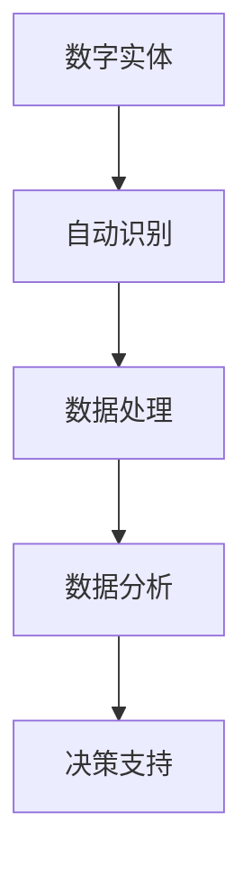

                 

关键词：数字实体、自动化、进展、应用、技术、算法、数学模型、实践

> 摘要：本文将深入探讨数字实体自动化的进展与应用，分析其核心概念、算法原理、数学模型以及实际应用场景，并展望其未来的发展趋势与挑战。

## 1. 背景介绍

在当今信息化社会中，数据已经成为了重要的资源，而数字实体作为数据的一种表现形式，成为了信息技术领域的研究热点。随着计算机技术的不断发展，数字实体自动化成为了一个重要的研究方向。数字实体自动化是指通过计算机技术对数字实体进行自动识别、处理、分析和决策的过程。

数字实体自动化在许多领域都有着广泛的应用，如智能识别、智能搜索、智能推荐、智能预测等。随着人工智能技术的不断进步，数字实体自动化技术也在不断演进，为各个行业提供了强大的技术支持。

## 2. 核心概念与联系

### 2.1 数字实体定义

数字实体是指通过计算机技术表示和存储的各种数据对象，包括文本、图像、音频、视频等。数字实体具有唯一标识、结构化数据、动态变化等特点。

### 2.2 自动化概念

自动化是指通过计算机技术和算法对数字实体进行自动识别、处理、分析和决策的过程。自动化技术可以大大提高数据处理效率，减少人力成本。

### 2.3 自动化与数字实体的关系

数字实体是自动化技术的处理对象，自动化技术通过对数字实体的处理，实现了对数据的自动识别、处理和分析。自动化技术为数字实体提供了强大的数据处理能力，使得数字实体在各个领域的应用更加广泛。

## 2.4 自动化流程图



## 3. 核心算法原理 & 具体操作步骤

### 3.1 算法原理概述

数字实体自动化技术主要包括以下几种核心算法：

1. 机器学习算法：用于数字实体的自动识别和处理。
2. 深度学习算法：用于图像、音频等数字实体的自动识别和处理。
3. 自然语言处理算法：用于文本数字实体的自动识别和处理。

### 3.2 算法步骤详解

1. 数据收集：收集与数字实体相关的数据，如文本、图像、音频等。
2. 数据预处理：对数据进行清洗、归一化等处理，提高数据质量。
3. 特征提取：从原始数据中提取关键特征，为后续算法处理提供基础。
4. 模型训练：利用机器学习、深度学习等算法对数字实体进行建模。
5. 模型评估：对训练好的模型进行评估，确保其性能满足要求。
6. 模型应用：将训练好的模型应用于实际场景，对数字实体进行自动识别和处理。

### 3.3 算法优缺点

1. 机器学习算法：优点是适用范围广，能处理大量数据；缺点是训练时间较长，对数据质量要求较高。
2. 深度学习算法：优点是处理图像、音频等数字实体效果好；缺点是计算资源消耗大，对数据量要求较高。
3. 自然语言处理算法：优点是处理文本数字实体能力强；缺点是处理复杂逻辑关系时效果较差。

### 3.4 算法应用领域

数字实体自动化技术在多个领域都有广泛应用，如：

1. 智能识别：在图像、视频等领域进行物体、人脸等识别。
2. 智能搜索：在文本领域进行关键词提取、语义分析等。
3. 智能推荐：在电商、社交媒体等领域进行个性化推荐。
4. 智能预测：在金融、气象等领域进行数据预测。

## 4. 数学模型和公式 & 详细讲解 & 举例说明

### 4.1 数学模型构建

数字实体自动化技术的核心在于构建有效的数学模型。常见的数学模型包括：

1. 监督学习模型：用于对已知数据进行预测。
2. 无监督学习模型：用于对未知数据进行分类。
3. 强化学习模型：用于对动态环境进行决策。

### 4.2 公式推导过程

以监督学习模型为例，其基本公式如下：

$$
y = f(W \cdot x + b)
$$

其中，$y$ 为预测结果，$x$ 为输入特征，$W$ 为权重矩阵，$b$ 为偏置项，$f$ 为激活函数。

### 4.3 案例分析与讲解

以人脸识别为例，人脸识别的过程可以分为以下几个步骤：

1. 数据收集：收集大量人脸图像作为训练数据。
2. 数据预处理：对图像进行归一化、去噪等处理。
3. 特征提取：从图像中提取人脸特征。
4. 模型训练：利用监督学习算法训练模型。
5. 模型评估：对训练好的模型进行评估。
6. 模型应用：将训练好的模型应用于实际人脸识别任务。

## 5. 项目实践：代码实例和详细解释说明

### 5.1 开发环境搭建

本文以 Python 编程语言为例，介绍数字实体自动化的实现。首先需要安装 Python 环境，可以选择 Python 3.6 及以上版本。

### 5.2 源代码详细实现

以下是一个简单的人脸识别项目实例：

```python
import cv2

# 读取图像
image = cv2.imread('face.jpg')

# 人脸检测器
face_cascade = cv2.CascadeClassifier('haarcascade_frontalface_default.xml')

# 检测人脸
faces = face_cascade.detectMultiScale(image, scaleFactor=1.1, minNeighbors=5, minSize=(30, 30), flags=cv2.CASCADE_SCALE_IMAGE)

# 画出人脸区域
for (x, y, w, h) in faces:
    cv2.rectangle(image, (x, y), (x+w, y+h), (0, 255, 0), 2)

# 显示图像
cv2.imshow('Face Detection', image)

# 关闭窗口
cv2.destroyAllWindows()
```

### 5.3 代码解读与分析

上述代码实现了人脸检测功能。首先，导入相关库，然后读取图像，使用人脸检测器检测人脸，画出人脸区域，最后显示图像。

### 5.4 运行结果展示

运行上述代码后，会显示一个包含人脸检测结果的图像。

## 6. 实际应用场景

数字实体自动化技术在各个领域都有广泛应用，以下列举几个实际应用场景：

1. 智能安防：利用人脸识别技术进行实时监控，实现入侵检测、异常行为识别等功能。
2. 智能客服：利用自然语言处理技术实现智能客服，提高客户满意度和服务效率。
3. 无人驾驶：利用计算机视觉和深度学习技术实现自动驾驶，提高交通安全和效率。
4. 智能医疗：利用数字实体自动化技术进行疾病预测、诊断和治疗，提高医疗水平。

## 7. 工具和资源推荐

### 7.1 学习资源推荐

1. 《深度学习》（Goodfellow, Bengio, Courville著）
2. 《Python数据科学手册》（McKinney著）
3. 《机器学习实战》（ Harrington著）

### 7.2 开发工具推荐

1. Python
2. TensorFlow
3. Keras

### 7.3 相关论文推荐

1. "Deep Learning for Image Recognition"（Deep Learning论文）
2. "Natural Language Processing with Python"（Python自然语言处理论文）
3. "Recurrent Neural Networks for Language Modeling"（循环神经网络论文）

## 8. 总结：未来发展趋势与挑战

### 8.1 研究成果总结

数字实体自动化技术在过去几十年取得了显著的成果，从最初的简单数据处理，到现在的深度学习和自然语言处理等复杂技术，大大提升了数据处理能力和效率。

### 8.2 未来发展趋势

未来，数字实体自动化技术将继续发展，重点将集中在以下几个方面：

1. 深度学习与大数据的结合，提高数据处理和分析能力。
2. 自然语言处理技术的进步，实现更智能的文本理解和生成。
3. 跨领域应用，如医疗、金融、交通等。

### 8.3 面临的挑战

1. 数据质量和数据隐私问题：如何保证数据质量和用户隐私是一个重要挑战。
2. 算法解释性和可解释性：如何提高算法的可解释性，使其更加透明和可靠。
3. 资源消耗和计算效率：如何在有限的资源下提高计算效率。

### 8.4 研究展望

未来，数字实体自动化技术将继续推动信息技术的发展，为各行各业带来更多的创新和机遇。同时，也需要关注伦理、法律和社会问题，确保技术的可持续发展。

## 9. 附录：常见问题与解答

### 9.1 数字实体自动化技术有哪些应用场景？

数字实体自动化技术在多个领域都有应用，如智能识别、智能搜索、智能推荐、智能预测等。

### 9.2 如何保证数字实体自动化的数据质量和隐私？

可以通过数据清洗、数据加密、隐私保护等技术手段来保证数据质量和隐私。

### 9.3 数字实体自动化技术的未来发展趋势是什么？

未来，数字实体自动化技术将继续发展，重点将集中在深度学习与大数据的结合、自然语言处理技术的进步、跨领域应用等方面。

[作者：禅与计算机程序设计艺术 / Zen and the Art of Computer Programming]

