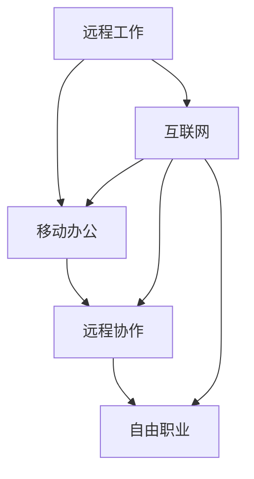

                 

关键词：数字游民，远程工作，创业，旅行，生活方式，远程协作，移动办公

> 摘要：本文将探讨数字游民这一新兴的生活方式，介绍如何通过现代信息技术实现边旅行边创业。文章将从数字游民的背景介绍、核心概念与联系、核心算法原理与操作步骤、数学模型和公式、项目实践、实际应用场景、未来应用展望、工具和资源推荐以及总结未来发展趋势与挑战等方面进行深入分析。

## 1. 背景介绍

数字游民（Digital Nomad）这一概念起源于互联网和远程工作的兴起。随着云计算、互联网和移动通信技术的发展，人们不再局限于传统的办公环境，可以在任何有网络连接的地方进行工作。数字游民群体由一群追求自由、探索世界和追求个人成长的人组成，他们通过互联网远程工作，实现边旅行边创业的生活方式。

### 数字游民的特点
- **灵活的工作时间**：数字游民可以自由安排工作时间和地点，不受传统工作时间表和办公地点的限制。
- **远程协作**：依靠互联网和远程协作工具，数字游民可以与全球的团队成员高效合作。
- **低成本生活**：选择在生活成本较低的地区旅行，数字游民可以节省大量费用。
- **个人成长**：通过不断探索和学习，数字游民实现个人成长和职业发展。

### 数字游民的发展趋势
- **全球化的工作环境**：随着远程工作的普及，越来越多的公司和企业开始接受和鼓励远程工作，为数字游民提供更多机会。
- **工作与生活的平衡**：数字游民通过实现工作与生活的平衡，提高生活质量和幸福感。
- **新兴行业的崛起**：以互联网、科技和创意产业为代表的行业为数字游民提供了丰富的就业机会。

## 2. 核心概念与联系

### 数字游民的核心概念

- **远程工作**：数字游民通过互联网远程接入公司服务器和工作平台，完成工作任务。
- **移动办公**：利用智能手机、平板电脑等移动设备，随时随地处理工作事务。
- **远程协作**：通过视频会议、即时通讯、项目管理工具等，与团队成员进行高效协作。
- **自由职业**：许多数字游民选择成为自由职业者，独立承接项目，实现个人价值。

### 数字游民的架构图



### 数字游民的联系

- **互联网**：作为数字游民的基石，互联网提供通信、数据传输、远程访问等功能。
- **移动设备**：智能手机、平板电脑等移动设备使数字游民随时保持在线和工作状态。
- **远程协作工具**：视频会议、即时通讯、项目管理工具等，支持团队间的远程协作。
- **自由职业平台**：如Upwork、Freelancer等，为数字游民提供寻找项目和合作机会的平台。

## 3. 核心算法原理 & 具体操作步骤

### 3.1 算法原理概述

数字游民实现边旅行边创业的关键在于远程工作与移动办公的有机结合。这需要一套高效的远程协作机制，包括：

- **任务调度算法**：根据团队成员的地理位置和工作时间，合理分配任务和项目。
- **即时通讯算法**：提供实时沟通和协作，确保团队成员之间信息传递的高效性。
- **数据同步算法**：确保所有团队成员都能访问到最新的数据和文件，保证协作的一致性。

### 3.2 算法步骤详解

1. **任务分配**：
   - 收集团队成员的地理位置和工作时间信息。
   - 根据任务要求和团队成员的能力，分配合适的任务。
   - 通过邮件、即时通讯等方式通知任务分配结果。

2. **即时通讯**：
   - 使用视频会议、即时通讯软件，组织在线会议和讨论。
   - 分享屏幕、文档，实时展示和交流。
   - 定期召开项目进展会议，确保项目按时完成。

3. **数据同步**：
   - 使用云端存储和协作工具，确保团队成员可以实时访问项目数据和文件。
   - 设置版本控制和权限管理，防止数据冲突和丢失。
   - 定期备份重要数据，确保数据的安全和完整性。

### 3.3 算法优缺点

- **优点**：
  - 高效协作：远程协作工具和算法提高团队协作效率。
  - 灵活性：团队成员可以自由选择工作时间和地点，提高生活质量。
  - 成本节约：降低办公场所和设备的投资，节省成本。

- **缺点**：
  - 时差问题：跨时区工作可能导致沟通和协作的困难。
  - 网络依赖：稳定网络连接对远程工作和协作至关重要。
  - 个人效率：缺乏面对面交流，可能影响团队凝聚力和个人效率。

### 3.4 算法应用领域

- **软件开发**：分布式团队可以通过远程协作工具和算法实现高效开发。
- **创意产业**：设计师、作家、音乐制作人等可以通过远程协作完成项目。
- **咨询服务**：咨询师、顾问等可以在全球范围内提供专业服务。

## 4. 数学模型和公式

### 4.1 数学模型构建

为了描述数字游民的生活成本和工作效率，我们可以构建一个简单的数学模型。假设：

- **C**：生活成本（包括住宿、餐饮、交通等）
- **E**：工作效率（单位时间内完成的工作量）
- **R**：收入（包括工资、项目收益等）

### 4.2 公式推导过程

1. **生活成本模型**：

   $$C = C_{base} + \alpha \cdot D$$

   其中，\(C_{base}\) 为基本生活成本，\(\alpha\) 为生活成本与距离的系数，\(D\) 为旅行距离。

2. **工作效率模型**：

   $$E = E_{base} \cdot (1 - \beta \cdot T)$$

   其中，\(E_{base}\) 为基本工作效率，\(\beta\) 为时区差异对工作效率的影响系数，\(T\) 为时区差异。

3. **收入模型**：

   $$R = R_{base} + \gamma \cdot E$$

   其中，\(R_{base}\) 为基本收入，\(\gamma\) 为工作效率对收入的贡献系数。

### 4.3 案例分析与讲解

假设一个数字游民：

- 基本生活成本为 \(C_{base} = 500\) 美元/月
- 生活成本与距离的系数为 \(\alpha = 0.1\)
- 基本工作效率为 \(E_{base} = 8\) 小时/天
- 时区差异对工作效率的影响系数为 \(\beta = 0.05\)
- 基本收入为 \(R_{base} = 5000\) 美元/月
- 工作效率对收入的贡献系数为 \(\gamma = 0.2\)

**计算生活成本**：

$$C = 500 + 0.1 \cdot D$$

例如，当旅行距离为 \(D = 1000\) 公里时，生活成本为：

$$C = 500 + 0.1 \cdot 1000 = 600$$ 美元/月

**计算工作效率**：

$$E = 8 \cdot (1 - 0.05 \cdot T)$$

例如，时区差异为 \(T = 1\) 小时，工作效率为：

$$E = 8 \cdot (1 - 0.05 \cdot 1) = 7.6$$ 小时/天

**计算收入**：

$$R = 5000 + 0.2 \cdot E$$

根据工作效率为 \(E = 7.6\) 小时/天，收入为：

$$R = 5000 + 0.2 \cdot 7.6 = 5015.2$$ 美元/月

通过这个简单的数学模型，我们可以分析数字游民在不同旅行距离和时区差异下的生活成本和工作收入。这有助于数字游民规划旅行路线，选择合适的工作地点，实现边旅行边创业的生活目标。

## 5. 项目实践：代码实例和详细解释说明

### 5.1 开发环境搭建

在开始项目实践之前，我们需要搭建一个适合远程工作和协作的开发环境。以下是搭建过程的简要步骤：

1. **选择合适的操作系统**：Windows、macOS 或 Linux，根据个人喜好和需求进行选择。
2. **安装必要的开发工具**：集成开发环境（如Visual Studio Code、IntelliJ IDEA）、版本控制工具（如Git）、远程协作工具（如Zoom、Slack）。
3. **配置云端存储和协作平台**：选择合适的云端存储和协作平台（如Google Drive、GitHub）。

### 5.2 源代码详细实现

以下是一个简单的示例项目，演示如何使用Python实现一个远程协作工具，支持任务分配、即时通讯和数据同步。

```python
import socket
import threading

# 任务分配服务器
class TaskServer:
    def __init__(self):
        self.clients = []
    
    def start_server(self, host, port):
        server_socket = socket.socket(socket.AF_INET, socket.SOCK_STREAM)
        server_socket.bind((host, port))
        server_socket.listen(5)
        
        print(f"任务分配服务器启动，监听端口：{port}")
        
        while True:
            client_socket, client_address = server_socket.accept()
            self.clients.append(client_socket)
            threading.Thread(target=self.handle_client, args=(client_socket,)).start()

    def handle_client(self, client_socket):
        while True:
            data = client_socket.recv(1024).decode()
            if not data:
                break
            print(f"收到客户端消息：{data}")
            # 进行任务分配处理
            response = "任务已分配，请开始工作。"
            client_socket.send(response.encode())
        
        client_socket.close()
        self.clients.remove(client_socket)

# 客户端
class TaskClient:
    def __init__(self, server_host, server_port):
        self.server_socket = socket.socket(socket.AF_INET, socket.SOCK_STREAM)
        self.server_socket.connect((server_host, server_port))
    
    def send_request(self, request):
        self.server_socket.send(request.encode())
        response = self.server_socket.recv(1024).decode()
        print(f"收到服务器响应：{response}")

# 数据同步服务器
class DataSyncServer:
    def __init__(self):
        self.clients = []
    
    def start_server(self, host, port):
        server_socket = socket.socket(socket.AF_INET, socket.SOCK_STREAM)
        server_socket.bind((host, port))
        server_socket.listen(5)
        
        print(f"数据同步服务器启动，监听端口：{port}")
        
        while True:
            client_socket, client_address = server_socket.accept()
            self.clients.append(client_socket)
            threading.Thread(target=self.handle_client, args=(client_socket,)).start()

    def handle_client(self, client_socket):
        while True:
            data = client_socket.recv(1024).decode()
            if not data:
                break
            print(f"收到客户端数据：{data}")
            # 进行数据同步处理
            response = "数据同步成功。"
            client_socket.send(response.encode())
        
        client_socket.close()
        self.clients.remove(client_socket)

# 数据同步客户端
class DataSyncClient:
    def __init__(self, server_host, server_port):
        self.server_socket = socket.socket(socket.AF_INET, socket.SOCK_STREAM)
        self.server_socket.connect((server_host, server_port))
    
    def send_data(self, data):
        self.server_socket.send(data.encode())
        response = self.server_socket.recv(1024).decode()
        print(f"收到服务器响应：{response}")

if __name__ == "__main__":
    # 启动任务分配服务器
    server = TaskServer()
    server.start_server("localhost", 8000)

    # 启动数据同步服务器
    sync_server = DataSyncServer()
    sync_server.start_server("localhost", 9000)

    # 客户端发送请求
    client = TaskClient("localhost", 8000)
    client.send_request("请求任务分配。")

    # 客户端发送数据
    sync_client = DataSyncClient("localhost", 9000)
    sync_client.send_data("同步数据内容。")
```

### 5.3 代码解读与分析

1. **任务分配服务器**：实现任务分配功能，接收客户端请求，进行任务分配，并将结果返回给客户端。
2. **客户端**：发送请求给任务分配服务器，接收任务分配结果。
3. **数据同步服务器**：接收客户端发送的数据，进行数据同步处理，并将同步结果返回给客户端。
4. **客户端**：发送数据给数据同步服务器，接收同步结果。

通过这个示例项目，我们可以看到如何使用Python实现简单的远程协作工具。实际应用中，可以根据需求扩展功能，如增加即时通讯、项目管理和任务调度等模块。

## 6. 实际应用场景

### 6.1 软件开发

远程协作在软件开发中具有广泛应用。分布式团队可以通过远程协作工具和算法，实现代码协同、bug跟踪、项目管理和进度控制。例如，使用Git进行版本控制，使用Jenkins进行自动化构建和测试，使用JIRA进行项目管理。

### 6.2 创意产业

设计师、作家、音乐制作人等创意工作者可以利用远程协作，实现跨地域的合作。通过云端存储和协作工具，设计师可以共享素材和设计文件，作家可以实时讨论故事情节，音乐制作人可以远程录制和混音。

### 6.3 咨询服务

咨询师、顾问等可以在全球范围内提供专业服务。通过远程会议和即时通讯，咨询师可以与客户进行实时沟通，提供咨询和建议。

### 6.4 教育培训

远程教育成为数字游民生活方式的一部分。教师可以通过远程教学平台，为学生提供在线课程、互动讨论和作业批改。学生可以随时随地学习，实现个性化教育。

## 7. 工具和资源推荐

### 7.1 学习资源推荐

- **书籍**：《远程工作指南》、《数字游民：逃离城市，拥抱世界》
- **在线课程**：Coursera、edX、Udemy 提供的远程工作和数字游民相关课程
- **博客和论坛**：Reddit、Quora、LinkedIn 上关于数字游民和远程工作的讨论

### 7.2 开发工具推荐

- **集成开发环境**：Visual Studio Code、IntelliJ IDEA
- **版本控制工具**：Git、SVN
- **远程协作工具**：Zoom、Slack、Trello
- **项目管理工具**：JIRA、Asana、Trello

### 7.3 相关论文推荐

- **论文1**：《分布式团队协作模型的研究》
- **论文2**：《远程工作的挑战与机遇》
- **论文3**：《数字游民的社交网络与职业发展》

## 8. 总结：未来发展趋势与挑战

### 8.1 研究成果总结

数字游民生活方式的兴起，推动了远程工作和移动办公的发展。通过远程协作工具和算法，分布式团队可以实现高效协作。同时，云端存储和协作平台的普及，为数字游民提供了丰富的资源和支持。

### 8.2 未来发展趋势

- **远程工作制度的普及**：越来越多的公司和企业将接受和鼓励远程工作，为数字游民提供更多机会。
- **数字游民群体的扩大**：随着技术的进步和远程工作环境的改善，数字游民群体将逐渐扩大。
- **多元化职业机会**：数字游民可以在全球范围内选择职业，实现个人价值和职业发展。

### 8.3 面临的挑战

- **网络稳定性**：稳定网络连接对远程工作和协作至关重要，尤其是在偏远地区。
- **时区差异**：跨时区工作可能导致沟通和协作的困难，需要合理安排工作时间和任务分配。
- **个人效率**：缺乏面对面交流，可能影响团队凝聚力和个人效率，需要加强沟通和协作机制。

### 8.4 研究展望

未来研究可以从以下几个方面展开：

- **智能协作算法**：研究更高效的智能协作算法，提高分布式团队的工作效率。
- **网络技术**：探索更稳定、更快速的远程网络技术，提升远程工作和协作的质量。
- **心理健康**：研究数字游民的心理健康问题，提供相应的心理支持和干预措施。

## 9. 附录：常见问题与解答

### Q1. 数字游民需要哪些技能？

A1. 数字游民需要具备以下技能：

- **远程协作能力**：熟练使用远程协作工具和算法。
- **自我管理能力**：合理安排时间和任务，确保工作进度和质量。
- **适应能力**：适应不同文化背景和工作环境。
- **沟通能力**：有效沟通和表达，确保团队协作和项目进展。

### Q2. 数字游民如何选择旅行地点？

A2. 数字游民选择旅行地点时，可以从以下几个方面考虑：

- **生活成本**：选择生活成本较低的地区，节省费用。
- **网络连接**：确保稳定的网络连接，支持远程工作和协作。
- **交通便利**：选择交通便利的地区，方便出行和联系。
- **文化体验**：选择具有丰富文化体验的地区，满足个人兴趣和需求。

### Q3. 数字游民如何保持社交联系？

A3. 数字游民可以通过以下方式保持社交联系：

- **线上社交**：参与线上社群、论坛和社交网络，与同行交流。
- **参加活动**：参加线上和线下的活动，结识新朋友。
- **志愿服务**：参与志愿服务项目，与社会建立联系。
- **线上学习**：通过在线课程和学习平台，结识志同道合的人。

### Q4. 数字游民如何保持工作效率？

A4. 数字游民可以采取以下措施保持工作效率：

- **合理安排时间**：制定工作计划，确保任务按时完成。
- **设立目标**：设定明确的目标和里程碑，激励自己努力工作。
- **创造工作环境**：创造一个舒适、专注的工作环境。
- **定期休息**：合理安排休息时间，保持身心健康。

### Q5. 数字游民如何平衡工作与生活？

A5. 数字游民可以通过以下方式平衡工作与生活：

- **灵活安排工作时间**：根据个人需求和喜好，灵活调整工作时间。
- **设定工作边界**：明确工作时间和休息时间，避免过度工作。
- **旅行规划**：合理安排旅行计划，确保工作与旅行相结合。
- **培养兴趣爱好**：在工作之余，培养兴趣爱好，丰富生活。

通过以上问题与解答，我们可以更好地了解数字游民的生活方式和工作方法，为实践边旅行边创业的生活方式提供指导。作者：禅与计算机程序设计艺术 / Zen and the Art of Computer Programming。

