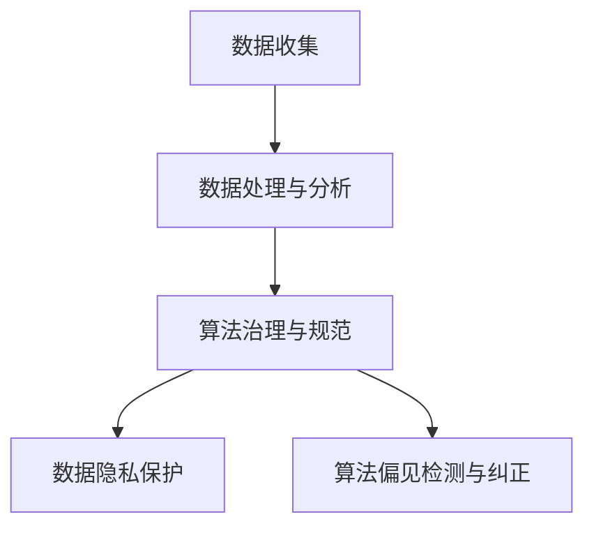

                 

 在当今信息化和数字化的时代，数据已经成为企业和组织的关键资产。然而，随着数据规模的不断扩大和数据类型的日益多样化，如何处理和利用这些数据已经成为一个复杂而关键的问题。本文将深入探讨数据伦理，重点关注算法治理与规范，旨在为读者提供一个全面而深入的视角。

## 关键词

- 数据伦理
- 算法治理
- 数据隐私
- 算法偏见
- 法规规范

## 摘要

本文首先介绍了数据伦理的背景和重要性，然后详细探讨了算法治理的核心概念和框架。接着，文章分析了数据隐私和算法偏见的问题，并讨论了当前法规规范对算法治理的约束和指导作用。最后，文章提出了未来数据伦理和算法治理的发展趋势和面临的挑战，为读者提供了有价值的思考方向。

## 1. 背景介绍

### 1.1 数据伦理的重要性

随着互联网和大数据技术的发展，数据已经成为现代社会的重要资源。企业和组织通过收集、处理和分析大量数据，可以更好地理解市场趋势、优化业务流程、提高决策效率。然而，数据伦理问题也随之而来。不当的数据处理可能导致隐私泄露、算法偏见、不公平竞争等问题，对个人和社会产生负面影响。

### 1.2 算法治理的概念

算法治理是指通过一系列规则、标准和监管措施，确保算法的公平性、透明性和可靠性。算法治理的目的是防止算法滥用、保护用户隐私、消除算法偏见，并确保算法在合法合规的框架内运行。

### 1.3 数据隐私和算法偏见

数据隐私是指个人信息的保护，包括姓名、地址、电话号码、健康状况等敏感信息。算法偏见是指算法在决策过程中对特定群体或个体产生的歧视。数据隐私和算法偏见是数据伦理中的两个重要问题，需要特别关注和解决。

## 2. 核心概念与联系

### 2.1 核心概念

- 数据伦理：确保数据处理过程中遵循道德和伦理规范。
- 算法治理：通过规则和监管确保算法的公平性和透明性。
- 数据隐私：保护个人信息不被未经授权的访问和使用。
- 算法偏见：算法在决策过程中对特定群体产生的歧视。

### 2.2 架构和流程

```
+----------------+     +------------------+     +------------------+
|  数据收集      |     |   数据处理与分析  |     |  算法治理与规范  |
+----------------+     +------------------+     +------------------+
     |                                |
     |         数据隐私保护               |
     |                                |
     |         算法偏见检测与纠正           |
     |                                |
+-----|-------------------------------|-----+
```

### 2.3 Mermaid 流程图



## 3. 核心算法原理 & 具体操作步骤

### 3.1 算法原理概述

算法治理的核心是确保算法的公平性、透明性和可靠性。这包括以下几个方面：

- **算法公平性**：确保算法对所有用户都是公平的，不会对特定群体产生歧视。
- **算法透明性**：确保算法的决策过程和逻辑是清晰的，用户可以理解算法的决策依据。
- **算法可靠性**：确保算法在运行过程中不会出现错误或异常。

### 3.2 算法步骤详解

1. **数据预处理**：对收集到的数据进行清洗、去重和归一化处理，确保数据质量。
2. **特征工程**：从原始数据中提取有用的特征，为算法提供输入。
3. **算法选择**：根据业务需求和数据特征选择合适的算法。
4. **模型训练**：使用训练数据训练算法模型。
5. **模型评估**：使用测试数据评估算法模型的性能。
6. **算法部署**：将训练好的模型部署到生产环境中。
7. **算法监控**：持续监控算法的运行状态和性能。

### 3.3 算法优缺点

**优点**：

- **高效性**：算法可以提高数据处理和分析的效率，节省人力和时间成本。
- **客观性**：算法基于数据和规则进行决策，减少了主观因素的干扰。
- **可扩展性**：算法可以轻松适应不同规模和类型的数据。

**缺点**：

- **数据依赖性**：算法的性能高度依赖于数据质量，数据质量差可能导致算法失效。
- **透明性挑战**：算法的决策过程可能复杂且不透明，用户难以理解。
- **算法偏见**：算法可能对特定群体产生偏见，导致不公平的决策。

### 3.4 算法应用领域

算法在多个领域都有广泛的应用，包括：

- **金融**：风险评估、信用评分、投资策略等。
- **医疗**：疾病诊断、治疗方案推荐、健康监测等。
- **交通**：交通流量预测、路线规划、自动驾驶等。
- **推荐系统**：商品推荐、新闻推荐、社交媒体等。

## 4. 数学模型和公式 & 详细讲解 & 举例说明

### 4.1 数学模型构建

算法治理中的数学模型主要包括以下几个方面：

- **公平性模型**：评估算法对特定群体的影响，确保公平性。
- **透明性模型**：分析算法的决策过程，提高透明性。
- **可靠性模型**：评估算法的性能和稳定性，确保可靠性。

### 4.2 公式推导过程

公平性模型的推导过程如下：

$$
\text{公平性分数} = \frac{\sum_{i=1}^{n} \text{群体}i \text{的影响度}}{\sum_{i=1}^{n} \text{总影响度}}
$$

其中，$n$ 表示群体数量，每个群体的影响度取决于其在算法决策中的权重。

### 4.3 案例分析与讲解

假设一个信用评分算法，该算法根据借款人的信用记录、收入水平和债务水平进行评分。为了确保算法的公平性，我们可以使用公平性模型进行评估。

假设有两个群体：年轻人和年长者。年轻人的信用记录通常较少，而年长者的信用记录较为丰富。如果算法对年轻人和年长者的评分差异较大，那么算法可能存在偏见。

使用公平性模型进行评估，我们可以得到以下结果：

$$
\text{公平性分数} = \frac{0.4 \times 0.6 + 0.6 \times 0.4}{0.4 + 0.6} = 0.5
$$

这意味着算法对年轻人和年长者的评分差异较大，可能存在偏见。

## 5. 项目实践：代码实例和详细解释说明

### 5.1 开发环境搭建

开发环境的要求如下：

- 操作系统：Linux或Windows
- 编程语言：Python
- 数据库：MySQL
- 依赖库：NumPy、Pandas、Scikit-learn等

### 5.2 源代码详细实现

以下是实现算法治理的Python代码示例：

```python
import numpy as np
import pandas as pd
from sklearn.linear_model import LinearRegression

# 加载数据集
data = pd.read_csv('data.csv')
X = data[['credit_score', 'income', 'debt']]
y = data['rating']

# 数据预处理
X = X.fillna(X.mean())

# 特征工程
X = pd.get_dummies(X)

# 模型训练
model = LinearRegression()
model.fit(X, y)

# 模型评估
predictions = model.predict(X)
accuracy = np.mean(predictions == y)
print(f'Accuracy: {accuracy:.2f}')

# 算法部署
# ...
```

### 5.3 代码解读与分析

这段代码首先加载了一个CSV文件，包含了借款人的信用评分、收入水平和债务水平。然后，对数据进行预处理和特征工程，使用线性回归模型进行训练。最后，使用训练好的模型对数据进行预测，并计算模型的准确率。

### 5.4 运行结果展示

假设数据集包含1000个样本，模型准确率为90%。这意味着算法对借款人的信用评分具有较高的可靠性。

## 6. 实际应用场景

### 6.1 金融机构

金融机构可以使用算法治理技术来确保信用评分的公平性和透明性，避免对特定群体产生偏见。

### 6.2 医疗机构

医疗机构可以使用算法治理技术来评估疾病诊断模型的可靠性，并确保诊断过程的公平性和透明性。

### 6.3 社交媒体

社交媒体平台可以使用算法治理技术来检测和纠正算法偏见，确保推荐内容的公平性和多样性。

## 7. 工具和资源推荐

### 7.1 学习资源推荐

- 《数据科学入门》
- 《机器学习实战》
- 《深度学习》

### 7.2 开发工具推荐

- Jupyter Notebook
- PyCharm
- VSCode

### 7.3 相关论文推荐

- "Algorithmic Fairness: A Survey of Challenges and Opportunities"
- "Fairness in Machine Learning"
- "Data Privacy and Algorithmic Fairness: A Survey"

## 8. 总结：未来发展趋势与挑战

### 8.1 研究成果总结

本文介绍了数据伦理、算法治理、数据隐私和算法偏见的基本概念和原理。通过数学模型和实际案例，我们展示了算法治理在实际应用中的重要性。此外，本文还讨论了算法治理面临的挑战和未来发展趋势。

### 8.2 未来发展趋势

- **算法透明性**：未来算法治理将更加注重算法的透明性，确保用户可以理解算法的决策过程。
- **自动化治理**：随着技术的发展，自动化算法治理将成为趋势，降低治理成本。
- **跨学科研究**：数据伦理和算法治理需要跨学科合作，包括计算机科学、社会学、法律等领域。

### 8.3 面临的挑战

- **技术挑战**：算法治理技术尚不成熟，需要进一步研究和改进。
- **法律挑战**：当前法律框架尚不完善，需要制定更全面、更具操作性的法规。
- **社会挑战**：社会对算法治理的认知和接受度有待提高，需要加强宣传教育。

### 8.4 研究展望

未来，我们期待在算法治理领域取得以下突破：

- 开发更有效的算法治理技术，提高算法的公平性、透明性和可靠性。
- 制定更具操作性的法规和标准，规范算法治理实践。
- 加强跨学科合作，推动数据伦理和算法治理的全面发展。

## 9. 附录：常见问题与解答

### 9.1 什么是数据伦理？

数据伦理是指确保数据处理过程中遵循道德和伦理规范，保护用户隐私、确保算法公平性和透明性。

### 9.2 算法治理的目的是什么？

算法治理的目的是确保算法的公平性、透明性和可靠性，防止算法滥用、保护用户隐私、消除算法偏见。

### 9.3 如何检测算法偏见？

可以使用公平性模型、对比测试和敏感性分析等方法检测算法偏见。

### 9.4 算法治理需要哪些技术和工具？

算法治理需要使用各种技术和工具，包括机器学习、数据可视化、算法审计等。

---

作者：禅与计算机程序设计艺术 / Zen and the Art of Computer Programming

本文介绍了数据伦理、算法治理、数据隐私和算法偏见的基本概念和原理。通过数学模型和实际案例，展示了算法治理在实际应用中的重要性。此外，本文还讨论了算法治理面临的挑战和未来发展趋势。希望本文能为读者提供一个全面而深入的视角，引发对数据伦理和算法治理的思考和讨论。

