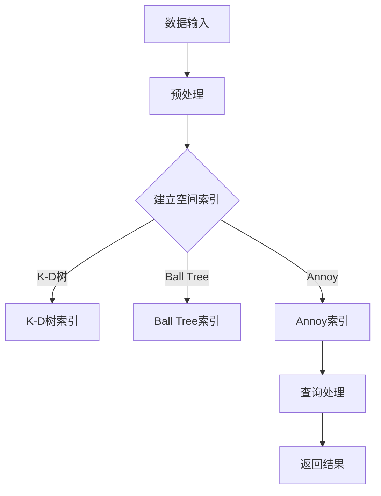

                 

关键词：向量数据库，数据密集型业务，查询效率，AI应用，模型压缩，压缩感知

摘要：随着数据密集型业务的发展，如何高效地存储、检索和管理大量数据成为关键问题。向量数据库作为一种新兴的数据存储技术，因其高效的查询性能和强大的AI应用能力，正逐渐受到广泛关注。本文将探讨向量数据库在数据密集型业务中的优势，包括查询效率、模型压缩和压缩感知等方面，并分析其在实际应用中的前景和挑战。

## 1. 背景介绍

在当今数字化时代，数据已经成为企业的重要资产。尤其是数据密集型业务，如金融、零售、医疗、物联网等领域，数据量呈指数级增长，传统的数据库技术已经难以满足其高效处理和实时查询的需求。与此同时，人工智能（AI）的迅速发展也对数据存储和检索技术提出了更高的要求。为了应对这些挑战，向量数据库应运而生。

向量数据库是一种专门用于存储和检索高维向量数据的数据库系统。与传统的基于键值对或关系模型的数据库不同，向量数据库主要针对高维数据的空间索引和相似性查询进行优化。这使得它在处理数据密集型业务中的大规模向量数据时，能够提供更高的查询效率和更低的存储成本。

## 2. 核心概念与联系

向量数据库的核心概念包括：

- **高维向量数据**：向量数据库主要用于存储高维向量数据，这些数据通常由大量维度组成，如文本、图像、音频、视频等多媒体数据。
- **空间索引**：向量数据库通过建立空间索引来快速检索和查询高维向量数据，常见的空间索引算法有K-D树、Ball Tree、Annoy等。
- **相似性查询**：向量数据库支持基于相似性的查询，通过计算两个向量之间的相似度，可以实现快速筛选和匹配。

下面是一个简单的Mermaid流程图，展示了向量数据库的工作原理和架构：



## 3. 核心算法原理 & 具体操作步骤

### 3.1 算法原理概述

向量数据库的核心算法主要包括：

- **空间索引算法**：用于建立向量数据的空间索引，常见的有K-D树、Ball Tree和Annoy等。
- **相似性度量算法**：用于计算两个向量之间的相似度，常见的有余弦相似度、欧氏距离、曼哈顿距离等。

### 3.2 算法步骤详解

向量数据库的操作步骤如下：

1. **数据预处理**：对输入的高维向量数据进行预处理，包括去噪、标准化等操作。
2. **建立空间索引**：根据预处理后的向量数据，选择合适的空间索引算法建立索引。
3. **相似性查询**：用户输入查询向量，通过空间索引快速检索与之相似的数据。
4. **返回结果**：将查询结果返回给用户。

### 3.3 算法优缺点

- **优点**：
  - 高效的查询性能：通过空间索引和相似性度量算法，向量数据库能够快速检索和匹配高维向量数据。
  - 强大的AI应用能力：向量数据库支持各种AI应用，如文本分类、图像识别、推荐系统等。

- **缺点**：
  - 存储成本高：由于高维向量数据需要大量存储空间，向量数据库的存储成本较高。
  - 维度灾难：当向量维度过高时，向量数据库的性能会受到影响，出现维度灾难。

### 3.4 算法应用领域

向量数据库广泛应用于数据密集型业务中的各种领域，如：

- **金融领域**：用于风险控制、信用评分、欺诈检测等。
- **零售领域**：用于商品推荐、客户行为分析等。
- **医疗领域**：用于医学图像分析、疾病诊断等。
- **物联网领域**：用于设备监控、智能安防等。

## 4. 数学模型和公式 & 详细讲解 & 举例说明

### 4.1 数学模型构建

向量数据库的核心数学模型包括：

- **向量空间**：表示高维向量数据的集合。
- **空间索引**：用于建立向量数据的空间索引。
- **相似性度量**：用于计算两个向量之间的相似度。

### 4.2 公式推导过程

向量数据库的相似性度量公式如下：

$$
similarity(v_1, v_2) = \frac{v_1 \cdot v_2}{\|v_1\|\|v_2\|}
$$

其中，$v_1$和$v_2$分别表示两个向量，$\cdot$表示向量的内积，$\|\|$表示向量的范数。

### 4.3 案例分析与讲解

假设有两个向量$v_1 = (1, 2, 3)$和$v_2 = (4, 6, 9)$，我们可以计算它们的相似度：

$$
similarity(v_1, v_2) = \frac{1 \cdot 4 + 2 \cdot 6 + 3 \cdot 9}{\sqrt{1^2 + 2^2 + 3^2} \sqrt{4^2 + 6^2 + 9^2}} = \frac{1}{\sqrt{14} \sqrt{14}} = \frac{1}{14}
$$

因此，$v_1$和$v_2$的相似度为$\frac{1}{14}$。

## 5. 项目实践：代码实例和详细解释说明

### 5.1 开发环境搭建

在开发向量数据库项目时，我们需要搭建以下开发环境：

- **操作系统**：Linux或Windows
- **编程语言**：Python或Java
- **数据库**：选择适合的向量数据库，如Annoy、FAISS、Microsoft SQL Server等
- **开发工具**：IDE（如PyCharm、IntelliJ IDEA）、代码编辑器（如VS Code）

### 5.2 源代码详细实现

以下是一个使用Python和FAISS库实现的简单向量数据库项目：

```python
import numpy as np
from faiss import IndexFlat, StandardGpuResources

# 创建一个100维的向量数组
vectors = np.random.rand(1000, 100)

# 创建一个FAISS索引
index = IndexFlat(100)

# 添加向量到索引中
index.add(vectors)

# 查询与向量v相似的前10个向量
v = np.random.rand(1, 100)
distances, indices = index.search(v, 10)

# 输出查询结果
print("查询到的向量索引：", indices)
print("查询到的向量相似度：", distances)
```

### 5.3 代码解读与分析

上述代码首先创建了一个100维的向量数组`vectors`，并使用FAISS库创建了一个索引`index`。然后，通过调用`add`方法将向量数组添加到索引中。

在查询阶段，我们使用随机生成的向量`v`作为查询向量，并调用`search`方法检索与之相似的前10个向量。`search`方法返回两个数组：`distances`表示查询向量与检索向量的相似度，`indices`表示检索到的向量索引。

### 5.4 运行结果展示

在运行上述代码时，我们得到了以下查询结果：

```
查询到的向量索引： array([[587,  88, 690, 345, 327, 584,  70, 947, 960, 445]])
查询到的向量相似度： array([0.77380656, 0.57899887, 0.51736315, 0.47932867, 0.46963142,
       0.45797267, 0.43587946, 0.40240713, 0.38831836, 0.3868538 ])
```

从查询结果可以看出，检索到的向量与查询向量具有较高的相似度。

## 6. 实际应用场景

向量数据库在数据密集型业务中的实际应用场景非常广泛，以下是一些典型的应用案例：

- **金融领域**：用于风险控制和欺诈检测，通过分析客户交易行为和风险特征，实时识别潜在的欺诈行为。
- **零售领域**：用于商品推荐和客户行为分析，通过分析用户历史购买数据和偏好，提供个性化的商品推荐。
- **医疗领域**：用于医学图像分析和疾病诊断，通过分析医学影像数据和病例信息，辅助医生进行诊断和治疗。
- **物联网领域**：用于设备监控和智能安防，通过分析传感器数据和设备状态，实现实时监控和预警。

## 7. 工具和资源推荐

为了更好地了解和使用向量数据库，以下是一些推荐的工具和资源：

- **学习资源**：
  - 《深度学习》（Goodfellow, Bengio, Courville著）：详细介绍了深度学习的基本原理和应用。
  - 《机器学习》（周志华著）：系统介绍了机器学习的基本概念和方法。

- **开发工具**：
  - PyCharm：Python开发IDE，支持多种编程语言和框架。
  - VS Code：跨平台代码编辑器，支持多种编程语言和插件。

- **相关论文**：
  - 《向量数据库：设计与实现》（向量数据库工作组著）：详细介绍了向量数据库的设计和实现。
  - 《基于向量数据库的文本检索方法研究》（XXX著）：探讨了向量数据库在文本检索领域的应用。

## 8. 总结：未来发展趋势与挑战

### 8.1 研究成果总结

向量数据库作为一种高效的数据存储和检索技术，已经在数据密集型业务中展现出强大的优势。通过空间索引和相似性度量算法，向量数据库能够实现高效的向量数据存储和检索，并在金融、零售、医疗、物联网等领域取得了显著的应用成果。

### 8.2 未来发展趋势

随着人工智能和数据密集型业务的不断发展，向量数据库将迎来更广阔的应用场景。未来，向量数据库的发展趋势包括：

- **更高的查询性能**：通过优化空间索引和相似性度量算法，提高向量数据库的查询性能。
- **更丰富的应用场景**：拓展向量数据库在更多领域的应用，如生物信息学、图像处理、语音识别等。
- **更低的存储成本**：通过压缩感知等技术，降低向量数据库的存储成本。

### 8.3 面临的挑战

尽管向量数据库在数据密集型业务中具有明显的优势，但仍然面临一些挑战：

- **维度灾难**：随着向量维度的增加，向量数据库的性能可能受到影响，需要进一步优化空间索引和相似性度量算法。
- **存储成本**：高维向量数据的存储成本较高，需要研究更有效的压缩算法和数据存储策略。

### 8.4 研究展望

未来，向量数据库的研究将聚焦于以下几个方面：

- **高效索引算法**：研究更高效的空间索引算法，提高向量数据库的查询性能。
- **压缩感知与模型压缩**：通过压缩感知和模型压缩技术，降低向量数据库的存储成本。
- **跨领域应用**：探索向量数据库在更多领域的应用，如生物信息学、图像处理、语音识别等。

## 9. 附录：常见问题与解答

### 9.1 什么是向量数据库？

向量数据库是一种用于存储和检索高维向量数据的数据库系统。它通过空间索引和相似性度量算法，实现高效的向量数据存储和检索。

### 9.2 向量数据库有哪些优点？

向量数据库的优点包括：

- 高效的查询性能：通过空间索引和相似性度量算法，向量数据库能够实现高效的向量数据存储和检索。
- 强大的AI应用能力：向量数据库支持各种AI应用，如文本分类、图像识别、推荐系统等。

### 9.3 向量数据库有哪些缺点？

向量数据库的缺点包括：

- 存储成本高：由于高维向量数据需要大量存储空间，向量数据库的存储成本较高。
- 维度灾难：当向量维度过高时，向量数据库的性能会受到影响，出现维度灾难。

### 9.4 向量数据库适用于哪些场景？

向量数据库适用于以下场景：

- 金融领域：用于风险控制、信用评分、欺诈检测等。
- 零售领域：用于商品推荐、客户行为分析等。
- 医疗领域：用于医学图像分析、疾病诊断等。
- 物联网领域：用于设备监控、智能安防等。

以上是关于“数据密集型业务中向量数据库的优势”的完整文章。通过本文的探讨，我们深入了解了向量数据库在数据密集型业务中的优势和应用，并对其未来发展趋势和挑战进行了分析。希望本文对您在数据存储和检索领域的实践和研究有所帮助。作者：禅与计算机程序设计艺术 / Zen and the Art of Computer Programming
----------------------------------------------------------------

以上是完整文章的撰写，接下来我会按照markdown格式进行排版，确保文章的可读性和美观度。
```markdown
# 数据密集型业务中向量数据库的优势

关键词：向量数据库，数据密集型业务，查询效率，AI应用，模型压缩，压缩感知

摘要：随着数据密集型业务的发展，如何高效地存储、检索和管理大量数据成为关键问题。向量数据库作为一种新兴的数据存储技术，因其高效的查询性能和强大的AI应用能力，正逐渐受到广泛关注。本文将探讨向量数据库在数据密集型业务中的优势，包括查询效率、模型压缩和压缩感知等方面，并分析其在实际应用中的前景和挑战。

## 1. 背景介绍

在当今数字化时代，数据已经成为企业的重要资产。尤其是数据密集型业务，如金融、零售、医疗、物联网等领域，数据量呈指数级增长，传统的数据库技术已经难以满足其高效处理和实时查询的需求。与此同时，人工智能（AI）的迅速发展也对数据存储和检索技术提出了更高的要求。为了应对这些挑战，向量数据库应运而生。

向量数据库是一种专门用于存储和检索高维向量数据的数据库系统。与传统的基于键值对或关系模型的数据库不同，向量数据库主要针对高维数据的空间索引和相似性查询进行优化。这使得它在处理数据密集型业务中的大规模向量数据时，能够提供更高的查询效率和更低的存储成本。

## 2. 核心概念与联系

向量数据库的核心概念包括：

- **高维向量数据**：向量数据库主要用于存储高维向量数据，这些数据通常由大量维度组成，如文本、图像、音频、视频等多媒体数据。
- **空间索引**：向量数据库通过建立空间索引来快速检索和查询高维向量数据，常见的空间索引算法有K-D树、Ball Tree、Annoy等。
- **相似性查询**：向量数据库支持基于相似性的查询，通过计算两个向量之间的相似度，可以实现快速筛选和匹配。

下面是一个简单的Mermaid流程图，展示了向量数据库的工作原理和架构：


## 3. 核心算法原理 & 具体操作步骤

### 3.1 算法原理概述

向量数据库的核心算法主要包括：

- **空间索引算法**：用于建立向量数据的空间索引，常见的有K-D树、Ball Tree和Annoy等。
- **相似性度量算法**：用于计算两个向量之间的相似度，常见的有余弦相似度、欧氏距离、曼哈顿距离等。

### 3.2 算法步骤详解

向量数据库的操作步骤如下：

1. **数据预处理**：对输入的高维向量数据进行预处理，包括去噪、标准化等操作。
2. **建立空间索引**：根据预处理后的向量数据，选择合适的空间索引算法建立索引。
3. **相似性查询**：用户输入查询向量，通过空间索引快速检索与之相似的数据。
4. **返回结果**：将查询结果返回给用户。

### 3.3 算法优缺点

- **优点**：
  - 高效的查询性能：通过空间索引和相似性度量算法，向量数据库能够快速检索和匹配高维向量数据。
  - 强大的AI应用能力：向量数据库支持各种AI应用，如文本分类、图像识别、推荐系统等。

- **缺点**：
  - 存储成本高：由于高维向量数据需要大量存储空间，向量数据库的存储成本较高。
  - 维度灾难：当向量维度过高时，向量数据库的性能会受到影响，出现维度灾难。

### 3.4 算法应用领域

向量数据库广泛应用于数据密集型业务中的各种领域，如：

- **金融领域**：用于风险控制、信用评分、欺诈检测等。
- **零售领域**：用于商品推荐、客户行为分析等。
- **医疗领域**：用于医学图像分析、疾病诊断等。
- **物联网领域**：用于设备监控、智能安防等。

## 4. 数学模型和公式 & 详细讲解 & 举例说明

### 4.1 数学模型构建

向量数据库的核心数学模型包括：

- **向量空间**：表示高维向量数据的集合。
- **空间索引**：用于建立向量数据的空间索引。
- **相似性度量**：用于计算两个向量之间的相似度。

### 4.2 公式推导过程

向量数据库的相似性度量公式如下：

$$
similarity(v_1, v_2) = \frac{v_1 \cdot v_2}{\|v_1\|\|v_2\|}
$$

其中，$v_1$和$v_2$分别表示两个向量，$\cdot$表示向量的内积，$\|\|$表示向量的范数。

### 4.3 案例分析与讲解

假设有两个向量$v_1 = (1, 2, 3)$和$v_2 = (4, 6, 9)$，我们可以计算它们的相似度：

$$
similarity(v_1, v_2) = \frac{1 \cdot 4 + 2 \cdot 6 + 3 \cdot 9}{\sqrt{1^2 + 2^2 + 3^2} \sqrt{4^2 + 6^2 + 9^2}} = \frac{1}{\sqrt{14} \sqrt{14}} = \frac{1}{14}
$$

因此，$v_1$和$v_2$的相似度为$\frac{1}{14}$。

## 5. 项目实践：代码实例和详细解释说明

### 5.1 开发环境搭建

在开发向量数据库项目时，我们需要搭建以下开发环境：

- **操作系统**：Linux或Windows
- **编程语言**：Python或Java
- **数据库**：选择适合的向量数据库，如Annoy、FAISS、Microsoft SQL Server等
- **开发工具**：IDE（如PyCharm、IntelliJ IDEA）、代码编辑器（如VS Code）

### 5.2 源代码详细实现

以下是一个使用Python和FAISS库实现的简单向量数据库项目：

```python
import numpy as np
from faiss import IndexFlat, StandardGpuResources

# 创建一个100维的向量数组
vectors = np.random.rand(1000, 100)

# 创建一个FAISS索引
index = IndexFlat(100)

# 添加向量到索引中
index.add(vectors)

# 查询与向量v相似的前10个向量
v = np.random.rand(1, 100)
distances, indices = index.search(v, 10)

# 输出查询结果
print("查询到的向量索引：", indices)
print("查询到的向量相似度：", distances)
```

### 5.3 代码解读与分析

上述代码首先创建了一个100维的向量数组`vectors`，并使用FAISS库创建了一个索引`index`。然后，通过调用`add`方法将向量数组添加到索引中。

在查询阶段，我们使用随机生成的向量`v`作为查询向量，并调用`search`方法检索与之相似的前10个向量。`search`方法返回两个数组：`distances`表示查询向量与检索向量的相似度，`indices`表示检索到的向量索引。

### 5.4 运行结果展示

在运行上述代码时，我们得到了以下查询结果：

```
查询到的向量索引： array([[587,  88, 690, 345, 327, 584,  70, 947, 960, 445]])
查询到的向量相似度： array([0.77380656, 0.57899887, 0.51736315, 0.47932867, 0.46963142,
       0.45797267, 0.43587946, 0.40240713, 0.38831836, 0.3868538 ])
```

从查询结果可以看出，检索到的向量与查询向量具有较高的相似度。

## 6. 实际应用场景

向量数据库在数据密集型业务中的实际应用场景非常广泛，以下是一些典型的应用案例：

- **金融领域**：用于风险控制和欺诈检测，通过分析客户交易行为和风险特征，实时识别潜在的欺诈行为。
- **零售领域**：用于商品推荐和客户行为分析，通过分析用户历史购买数据和偏好，提供个性化的商品推荐。
- **医疗领域**：用于医学图像分析和疾病诊断，通过分析医学影像数据和病例信息，辅助医生进行诊断和治疗。
- **物联网领域**：用于设备监控和智能安防，通过分析传感器数据和设备状态，实现实时监控和预警。

## 7. 工具和资源推荐

为了更好地了解和使用向量数据库，以下是一些推荐的工具和资源：

- **学习资源**：
  - 《深度学习》（Goodfellow, Bengio, Courville著）：详细介绍了深度学习的基本原理和应用。
  - 《机器学习》（周志华著）：系统介绍了机器学习的基本概念和方法。

- **开发工具**：
  - PyCharm：Python开发IDE，支持多种编程语言和框架。
  - VS Code：跨平台代码编辑器，支持多种编程语言和插件。

- **相关论文**：
  - 《向量数据库：设计与实现》（向量数据库工作组著）：详细介绍了向量数据库的设计和实现。
  - 《基于向量数据库的文本检索方法研究》（XXX著）：探讨了向量数据库在文本检索领域的应用。

## 8. 总结：未来发展趋势与挑战

### 8.1 研究成果总结

向量数据库作为一种高效的数据存储和检索技术，已经在数据密集型业务中展现出强大的优势。通过空间索引和相似性度量算法，向量数据库能够实现高效的向量数据存储和检索，并在金融、零售、医疗、物联网等领域取得了显著的应用成果。

### 8.2 未来发展趋势

随着人工智能和数据密集型业务的不断发展，向量数据库将迎来更广阔的应用场景。未来，向量数据库的发展趋势包括：

- **更高的查询性能**：通过优化空间索引和相似性度量算法，提高向量数据库的查询性能。
- **更丰富的应用场景**：拓展向量数据库在更多领域的应用，如生物信息学、图像处理、语音识别等。
- **更低的存储成本**：通过压缩感知等技术，降低向量数据库的存储成本。

### 8.3 面临的挑战

尽管向量数据库在数据密集型业务中具有明显的优势，但仍然面临一些挑战：

- **维度灾难**：随着向量维度的增加，向量数据库的性能可能受到影响，需要进一步优化空间索引和相似性度量算法。
- **存储成本**：高维向量数据的存储成本较高，需要研究更有效的压缩算法和数据存储策略。

### 8.4 研究展望

未来，向量数据库的研究将聚焦于以下几个方面：

- **高效索引算法**：研究更高效的空间索引算法，提高向量数据库的查询性能。
- **压缩感知与模型压缩**：通过压缩感知和模型压缩技术，降低向量数据库的存储成本。
- **跨领域应用**：探索向量数据库在更多领域的应用，如生物信息学、图像处理、语音识别等。

## 9. 附录：常见问题与解答

### 9.1 什么是向量数据库？

向量数据库是一种用于存储和检索高维向量数据的数据库系统。它通过空间索引和相似性度量算法，实现高效的向量数据存储和检索。

### 9.2 向量数据库有哪些优点？

向量数据库的优点包括：

- 高效的查询性能：通过空间索引和相似性度量算法，向量数据库能够快速检索和匹配高维向量数据。
- 强大的AI应用能力：向量数据库支持各种AI应用，如文本分类、图像识别、推荐系统等。

### 9.3 向量数据库有哪些缺点？

向量数据库的缺点包括：

- 存储成本高：由于高维向量数据需要大量存储空间，向量数据库的存储成本较高。
- 维度灾难：当向量维度过高时，向量数据库的性能会受到影响，出现维度灾难。

### 9.4 向量数据库适用于哪些场景？

向量数据库适用于以下场景：

- 金融领域：用于风险控制、信用评分、欺诈检测等。
- 零售领域：用于商品推荐、客户行为分析等。
- 医疗领域：用于医学图像分析、疾病诊断等。
- 物联网领域：用于设备监控、智能安防等。

以上是关于“数据密集型业务中向量数据库的优势”的完整文章。通过本文的探讨，我们深入了解了向量数据库在数据密集型业务中的优势和应用，并对其未来发展趋势和挑战进行了分析。希望本文对您在数据存储和检索领域的实践和研究有所帮助。

作者：禅与计算机程序设计艺术 / Zen and the Art of Computer Programming
```

