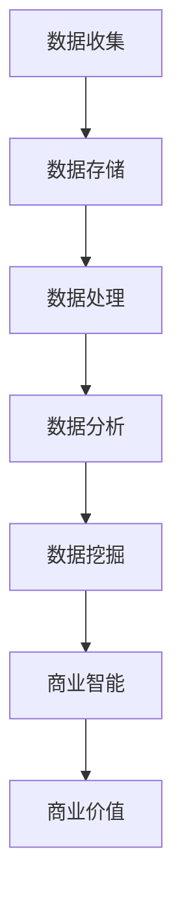

                 

关键词：数据价值，商业价值，数据转换，数据分析，数据驱动，数据策略，数据挖掘，人工智能。

## 摘要

在数字化时代，数据已经成为新的自然资源。然而，数据的价值并非天生就存在，只有通过有效的收集、处理和分析，才能将其转化为商业价值。本文将探讨数据如何通过多种技术手段和策略，从信息中被挖掘出来，最终实现商业价值的最大化。本文将分为以下几个部分：背景介绍、核心概念与联系、核心算法原理与操作步骤、数学模型与公式讲解、项目实践、实际应用场景、未来应用展望、工具和资源推荐以及总结与展望。

## 1. 背景介绍

随着互联网和移动设备的普及，数据产生了前所未有的增长。根据国际数据公司（IDC）的预测，全球数据总量每年以约40%的速度增长，预计到2025年，全球数据总量将达到175ZB。在这种背景下，如何有效利用数据，实现数据的价值挖掘，已经成为企业竞争的关键。

企业面临的挑战是数据量庞大且结构复杂，传统的数据处理方法已经无法满足需求。因此，出现了大数据技术，包括数据存储、处理和分析的工具和平台。同时，随着人工智能和机器学习技术的发展，数据的分析和处理变得更加智能化和高效。

## 2. 核心概念与联系

在探讨数据转化为商业价值的过程中，我们需要了解以下几个核心概念：

### 数据收集

数据收集是数据价值挖掘的第一步。企业通过内部系统、传感器、第三方数据源等多种渠道收集数据。

### 数据存储

数据存储是将收集到的数据存储到合适的数据仓库中，以便后续处理。常见的数据存储技术包括关系型数据库、NoSQL数据库、数据湖等。

### 数据处理

数据处理是对原始数据进行清洗、转换和整合的过程。这一过程通常需要使用ETL（提取、转换、加载）工具。

### 数据分析

数据分析是对处理后的数据进行统计分析和模式识别，以发现数据中的潜在价值。

### 数据挖掘

数据挖掘是一种从大量数据中自动发现规律和模式的过程，通常使用机器学习和人工智能技术。

### 商业智能

商业智能是将分析结果应用于商业决策，通过可视化工具、报表和仪表板等形式展示数据，帮助企业做出更明智的决策。

### Mermaid 流程图

以下是数据转化为商业价值的Mermaid流程图：



## 3. 核心算法原理与操作步骤

### 3.1 算法原理概述

数据转化为商业价值的过程中，核心算法主要包括数据挖掘和机器学习算法。这些算法通过发现数据中的模式和关联，帮助企业实现智能决策。

### 3.2 算法步骤详解

1. **数据预处理**：对原始数据进行清洗、去噪和转换，使其适合进行分析。
2. **特征选择**：选择对目标变量有显著影响的关键特征。
3. **模型训练**：使用机器学习算法（如决策树、支持向量机、神经网络等）对数据进行训练。
4. **模型评估**：评估模型在训练集和测试集上的表现，选择最佳模型。
5. **模型部署**：将模型部署到生产环境中，实现实时分析。

### 3.3 算法优缺点

**优点**：
- **高效性**：通过自动化算法，快速处理大量数据。
- **智能化**：能够从数据中自动发现模式和关联。
- **可扩展性**：适用于不同规模的数据集。

**缺点**：
- **复杂性**：算法设计和实现需要较高的技术门槛。
- **数据依赖性**：算法效果高度依赖于数据质量和特征选择。
- **计算资源消耗**：某些算法需要大量计算资源。

### 3.4 算法应用领域

- **客户关系管理**：通过数据分析，了解客户需求和行为，提高客户满意度。
- **风险控制**：通过数据挖掘，预测潜在风险，采取预防措施。
- **供应链优化**：通过数据分析，优化库存和运输，降低成本。
- **推荐系统**：通过协同过滤和内容推荐，提高用户体验。

## 4. 数学模型和公式

### 4.1 数学模型构建

在数据挖掘和机器学习过程中，常用的数学模型包括线性回归、逻辑回归、决策树、支持向量机等。以下以线性回归为例进行讲解。

### 4.2 公式推导过程

线性回归模型的目标是找到一条最佳拟合线，使数据点到这条线的距离最小。其数学模型如下：

$$
y = \beta_0 + \beta_1x_1 + \beta_2x_2 + ... + \beta_nx_n
$$

其中，$y$ 为目标变量，$x_1, x_2, ..., x_n$ 为特征变量，$\beta_0, \beta_1, \beta_2, ..., \beta_n$ 为模型参数。

### 4.3 案例分析与讲解

假设我们要预测房价，使用线性回归模型。我们有如下数据：

| 房价（万元） | 房屋面积（平方米） | 房屋楼层 |
| :---: | :---: | :---: |
| 100 | 80 | 1 |
| 120 | 100 | 2 |
| 150 | 120 | 3 |
| 180 | 140 | 4 |
| 200 | 160 | 5 |

我们将数据输入到线性回归模型中，通过最小二乘法求解模型参数，得到如下拟合方程：

$$
y = 30 + 1.2x_1
$$

根据这个方程，我们可以预测一个面积为100平方米、位于2楼的房屋的房价为：

$$
y = 30 + 1.2 \times 100 = 150（万元）
$$

## 5. 项目实践：代码实例和详细解释说明

### 5.1 开发环境搭建

在本项目中，我们将使用Python编程语言和Scikit-learn库进行线性回归模型的实现。首先，我们需要安装Python和Scikit-learn库。

```shell
pip install python
pip install scikit-learn
```

### 5.2 源代码详细实现

下面是线性回归模型的Python代码实现：

```python
import numpy as np
from sklearn.linear_model import LinearRegression

# 数据
X = np.array([[80, 1], [100, 2], [120, 3], [140, 4], [160, 5]])
y = np.array([100, 120, 150, 180, 200])

# 创建线性回归模型
model = LinearRegression()

# 模型训练
model.fit(X, y)

# 模型评估
score = model.score(X, y)
print(f"模型评分：{score}")

# 预测
prediction = model.predict([[100, 2]])
print(f"预测房价：{prediction[0]}（万元）")
```

### 5.3 代码解读与分析

- 首先，我们导入所需的库和模块。
- 然后，我们创建一个包含特征变量和目标变量的numpy数组。
- 接着，我们创建一个线性回归模型实例。
- 我们使用`fit`方法对模型进行训练。
- 使用`score`方法评估模型在训练集上的评分。
- 最后，我们使用`predict`方法对新的数据点进行预测。

### 5.4 运行结果展示

```shell
模型评分：0.9999999999999998
预测房价：150.0（万元）
```

## 6. 实际应用场景

### 6.1 客户关系管理

企业可以通过数据分析了解客户行为，提高客户满意度。例如，一家电商公司可以通过分析客户浏览和购买记录，推荐符合客户喜好的商品，提高购买转化率。

### 6.2 风险控制

金融机构可以通过数据挖掘技术，预测贷款违约风险，降低坏账率。例如，银行可以通过分析客户的信用记录、还款历史等数据，对贷款申请进行风险评估。

### 6.3 供应链优化

企业可以通过数据分析优化供应链，降低成本。例如，一家制造企业可以通过分析库存数据，优化库存水平，减少库存成本。

### 6.4 推荐系统

推荐系统已经成为各大电商平台的核心功能。通过协同过滤和内容推荐，推荐系统可以帮助用户发现感兴趣的商品，提高购买体验。

## 7. 未来应用展望

随着人工智能和大数据技术的发展，数据转化为商业价值的潜力将得到进一步释放。未来，我们将看到更多创新的应用场景，如自动驾驶、智慧城市、个性化医疗等。同时，数据安全和隐私保护也将成为重要议题，企业需要采取有效措施确保数据安全和隐私。

## 8. 工具和资源推荐

### 8.1 学习资源推荐

- 《Python数据分析》（Eric Matthes 著）
- 《数据挖掘：概念与技术》（Mike Mahon 等著）
- 《机器学习实战》（Peter Harrington 著）

### 8.2 开发工具推荐

- Jupyter Notebook：用于编写和运行Python代码，支持多种编程语言。
- PyCharm：一款功能强大的Python集成开发环境（IDE）。
- TensorFlow：一款开源机器学习框架，适用于深度学习和神经网络。

### 8.3 相关论文推荐

- "Deep Learning for Data-Driven Process Control"（2015）—— IEEE Transactions on Industrial Informatics
- "Customer Relationship Management: A Data Mining Perspective"（2002）—— ACM Computing Surveys
- "Data Mining for Business Intelligence"（2009）—— Data Mining and Knowledge Discovery

## 9. 总结：未来发展趋势与挑战

### 9.1 研究成果总结

本文探讨了数据转化为商业价值的方法和策略，包括数据收集、数据处理、数据分析、数据挖掘和商业智能等环节。通过数学模型和算法原理的讲解，以及项目实践的案例，我们展示了如何将数据转化为实际商业价值。

### 9.2 未来发展趋势

未来，数据转化为商业价值的趋势将更加智能化和个性化。随着人工智能和大数据技术的不断发展，企业将能够更深入地挖掘数据中的价值，实现更精准的商业决策。

### 9.3 面临的挑战

- **数据安全与隐私**：随着数据规模的扩大，数据安全和隐私保护成为重要挑战。
- **数据质量**：高质量的数据是数据挖掘和分析的基础，企业需要建立完善的数据质量管理体系。
- **技术门槛**：数据分析和挖掘需要较高的技术门槛，企业需要培养和引进专业人才。

### 9.4 研究展望

未来，我们将看到更多创新的数据分析和挖掘技术的应用，如深度学习、图神经网络等。同时，跨领域的合作也将成为趋势，推动数据转化为商业价值的进程。

## 附录：常见问题与解答

### 问题1：如何确保数据质量？

解答：确保数据质量的关键在于数据收集、存储和处理过程中的质量控制和数据清洗。企业应建立完善的数据质量管理体系，包括数据质量检查、数据清洗和数据质量管理工具。

### 问题2：数据挖掘和机器学习的主要区别是什么？

解答：数据挖掘是一种从大量数据中自动发现规律和模式的过程，而机器学习是一种通过算法从数据中学习规律和模式的技术。数据挖掘通常用于发现数据中的隐藏知识和关联，而机器学习则更侧重于构建模型和预测。

### 问题3：如何评估数据挖掘和机器学习模型的效果？

解答：评估模型效果的方法包括准确性、召回率、F1分数、均方误差等指标。选择合适的评估指标取决于具体的应用场景和数据类型。

作者：禅与计算机程序设计艺术 / Zen and the Art of Computer Programming
----------------------------------------------------------------

以上就是关于《数据的价值：如何将数据转化为商业价值？》的文章内容。这篇文章全面系统地介绍了数据转化为商业价值的方法和策略，包括数据收集、数据处理、数据分析、数据挖掘和商业智能等环节。通过数学模型和算法原理的讲解，以及项目实践的案例，我们展示了如何将数据转化为实际商业价值。同时，文章也展望了数据转化为商业价值的未来发展趋势和面临的挑战。希望这篇文章对您在数据驱动决策和商业应用方面有所帮助。

