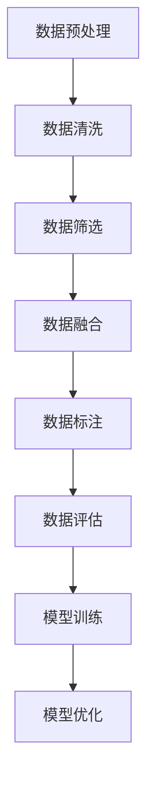

                 

关键词：小语言模型、数据组合、提升性能、算法优化、数学模型、应用场景

> 摘要：本文将探讨如何通过数据组合来提升小语言模型的表现。我们将详细阐述数据组合的核心概念、算法原理、数学模型以及具体应用场景，为读者提供一份全面的技术指南。

## 1. 背景介绍

随着人工智能技术的不断发展，语言模型在自然语言处理（NLP）领域取得了显著的成果。然而，对于小语言模型来说，如何提升其表现仍然是一个挑战。小语言模型通常具有较小的参数规模和较小的训练数据集，这使得它们在处理复杂任务时容易受到性能限制。因此，如何通过数据组合来提升小语言模型的表现，成为了当前研究的热点。

本文将围绕这一主题展开，首先介绍数据组合的核心概念，然后详细探讨数据组合算法的原理和步骤，接着分析数据组合的优缺点以及应用领域。随后，我们将介绍数学模型和公式，并通过实例来展示如何在实际项目中应用数据组合技术。最后，我们将讨论数据组合在实际应用场景中的表现，并展望未来的发展趋势和挑战。

## 2. 核心概念与联系

### 2.1 数据组合的定义

数据组合是指将多个数据源或数据集进行融合和整合，以形成一个更完整、更丰富、更有价值的数据集。在语言模型中，数据组合的目的是利用更多的数据来训练模型，从而提升其性能。

### 2.2 数据组合的意义

数据组合具有以下几个方面的意义：

1. **提高模型性能**：通过引入更多的数据，可以增加模型的训练样本量，从而提高模型的泛化能力和表现。
2. **丰富数据多样性**：不同来源的数据可能具有不同的特征和风格，通过数据组合可以丰富数据的多样性，有助于模型学习到更全面的特征。
3. **减少数据噪声**：某些数据源可能存在噪声或偏差，通过数据组合可以降低噪声的影响，提高模型的鲁棒性。

### 2.3 数据组合与模型优化的关系

数据组合是模型优化的重要手段之一。在训练小语言模型时，由于数据量有限，模型容易过拟合。通过数据组合，可以引入更多的训练样本，从而有助于模型更好地学习数据的本质特征，减少过拟合现象。

### 2.4 数据组合算法的流程图

为了更好地理解数据组合的过程，我们可以使用Mermaid流程图来描述其基本步骤：



### 2.5 数据组合与模型优化的联系

数据组合与模型优化密切相关。通过数据组合，我们可以获得更丰富、更有价值的数据集，从而为模型优化提供更坚实的支持。同时，数据组合还可以为模型优化提供更多的训练样本，有助于模型更好地学习数据的特征，提高模型的泛化能力和性能。

## 3. 核心算法原理 & 具体操作步骤

### 3.1 算法原理概述

数据组合算法的核心思想是通过融合多个数据源，形成一个更完整、更丰富、更有价值的数据集，从而提升模型的性能。具体来说，数据组合算法包括以下几个步骤：

1. **数据预处理**：对原始数据进行清洗、去噪和归一化等处理，确保数据的质量和一致性。
2. **数据筛选**：根据任务需求，筛选出符合要求的数据，剔除不符合要求的数据。
3. **数据融合**：将多个数据源进行融合，形成一个新的数据集。
4. **数据标注**：对数据集进行标注，以便模型能够更好地理解和学习数据。
5. **数据评估**：对数据集进行评估，判断其质量和适用性。
6. **模型训练**：利用数据集对模型进行训练，提升模型的性能。
7. **模型优化**：根据模型训练的结果，对模型进行优化，进一步提高其性能。

### 3.2 算法步骤详解

#### 3.2.1 数据预处理

数据预处理是数据组合算法的重要步骤，其目的是确保数据的质量和一致性。具体来说，数据预处理包括以下几个步骤：

1. **数据清洗**：去除数据中的噪声和异常值，提高数据的质量。
2. **去噪**：对数据中的噪声进行过滤，减少噪声对模型的影响。
3. **归一化**：将不同特征的数据进行归一化处理，使其具有相同的量纲和范围，方便后续处理。

#### 3.2.2 数据筛选

数据筛选的目的是根据任务需求，筛选出符合要求的数据，剔除不符合要求的数据。具体来说，数据筛选包括以下几个步骤：

1. **特征选择**：根据任务需求，选择对模型训练有重要影响的关键特征。
2. **数据筛选**：根据特征选择的结果，筛选出符合要求的数据，剔除不符合要求的数据。

#### 3.2.3 数据融合

数据融合是将多个数据源进行融合，形成一个新的数据集。具体来说，数据融合包括以下几个步骤：

1. **特征融合**：将不同数据源的特征进行融合，形成一个新的特征空间。
2. **数据集合并**：将多个数据集合并为一个数据集，为后续模型训练提供数据支持。

#### 3.2.4 数据标注

数据标注的目的是为数据集提供标签，以便模型能够更好地理解和学习数据。具体来说，数据标注包括以下几个步骤：

1. **标签分配**：根据数据集的特点，为每个样本分配相应的标签。
2. **标签修正**：对数据集中的错误标签进行修正，提高数据标注的准确性。

#### 3.2.5 数据评估

数据评估的目的是对数据集的质量和适用性进行评估。具体来说，数据评估包括以下几个步骤：

1. **质量评估**：对数据集的质量进行评估，判断其是否符合模型训练的要求。
2. **适用性评估**：对数据集的适用性进行评估，判断其是否适用于特定任务。

#### 3.2.6 模型训练

模型训练的目的是利用数据集对模型进行训练，提升模型的性能。具体来说，模型训练包括以下几个步骤：

1. **模型初始化**：初始化模型参数，为模型训练提供初始值。
2. **模型迭代**：通过迭代的方式，逐步调整模型参数，使其更好地拟合数据。
3. **模型评估**：对训练完成的模型进行评估，判断其性能是否达到预期。

#### 3.2.7 模型优化

模型优化的目的是进一步提高模型的性能，具体来说，模型优化包括以下几个步骤：

1. **性能评估**：对模型进行性能评估，判断其是否达到优化目标。
2. **参数调整**：根据性能评估的结果，调整模型参数，提高模型性能。
3. **模型压缩**：通过模型压缩技术，减小模型参数规模，提高模型运行效率。

### 3.3 算法优缺点

#### 优点

1. **提高模型性能**：通过数据组合，可以引入更多的数据，提高模型的泛化能力和性能。
2. **丰富数据多样性**：通过数据组合，可以丰富数据的多样性，有助于模型学习到更全面的特征。
3. **降低数据噪声**：通过数据组合，可以降低噪声的影响，提高模型的鲁棒性。

#### 缺点

1. **计算成本较高**：数据组合算法需要对多个数据源进行融合和处理，计算成本较高。
2. **数据质量要求高**：数据组合算法对数据质量有较高要求，如果数据质量较差，可能影响算法效果。

### 3.4 算法应用领域

数据组合算法在多个领域具有广泛的应用：

1. **自然语言处理**：通过数据组合，可以提升语言模型的表现，提高文本分类、情感分析等任务的性能。
2. **计算机视觉**：通过数据组合，可以丰富图像数据，提高图像识别、目标检测等任务的性能。
3. **推荐系统**：通过数据组合，可以提升推荐系统的性能，提高推荐结果的准确性。

## 4. 数学模型和公式

### 4.1 数学模型构建

在数据组合过程中，我们通常使用以下数学模型来描述数据集的融合过程：

$$
X = \sum_{i=1}^{n} w_i X_i
$$

其中，$X$ 表示融合后的数据集，$X_i$ 表示第 $i$ 个数据集，$w_i$ 表示第 $i$ 个数据集的权重。

### 4.2 公式推导过程

为了推导上述数学模型，我们可以考虑以下过程：

1. **数据预处理**：对每个数据集 $X_i$ 进行预处理，包括清洗、去噪和归一化等操作。
2. **特征融合**：将预处理后的数据集 $X_i$ 进行特征融合，形成一个新的特征空间。
3. **权重分配**：根据任务需求和数据集的特点，为每个数据集 $X_i$ 分配相应的权重 $w_i$。
4. **数据集合并**：将特征融合后的数据集合并为一个数据集 $X$。

通过以上过程，我们可以得到数据组合的数学模型：

$$
X = \sum_{i=1}^{n} w_i X_i
$$

### 4.3 案例分析与讲解

假设我们有两个数据集 $X_1$ 和 $X_2$，它们的特征维度分别为 $d_1$ 和 $d_2$。我们可以使用以下步骤进行数据组合：

1. **数据预处理**：对 $X_1$ 和 $X_2$ 进行预处理，包括清洗、去噪和归一化等操作。
2. **特征融合**：将预处理后的 $X_1$ 和 $X_2$ 进行特征融合，形成一个新的特征空间。
3. **权重分配**：根据任务需求和数据集的特点，为 $X_1$ 和 $X_2$ 分配相应的权重 $w_1$ 和 $w_2$。
4. **数据集合并**：将特征融合后的 $X_1$ 和 $X_2$ 合并为一个数据集 $X$。

具体来说，我们可以按照以下步骤进行：

1. **数据预处理**：
   $$
   X_1^{\text{pre}} = \text{preprocess}(X_1)
   $$
   $$
   X_2^{\text{pre}} = \text{preprocess}(X_2)
   $$
2. **特征融合**：
   $$
   X^{\text{fusion}} = \text{fusion}(X_1^{\text{pre}}, X_2^{\text{pre}})
   $$
3. **权重分配**：
   $$
   w_1 = \frac{|\text{feature\_set}(X_1)|}{|\text{feature\_set}(X_1)| + |\text{feature\_set}(X_2)|}
   $$
   $$
   w_2 = \frac{|\text{feature\_set}(X_2)|}{|\text{feature\_set}(X_1)| + |\text{feature\_set}(X_2)|}
   $$
4. **数据集合并**：
   $$
   X = w_1 X_1^{\text{pre}} + w_2 X_2^{\text{pre}}
   $$

通过以上步骤，我们可以将两个数据集 $X_1$ 和 $X_2$ 进行组合，形成一个新的数据集 $X$。

## 5. 项目实践：代码实例和详细解释说明

### 5.1 开发环境搭建

在进行数据组合项目实践之前，我们需要搭建一个合适的开发环境。以下是搭建开发环境的基本步骤：

1. **安装 Python**：确保 Python 3.8 以上版本已安装。
2. **安装 NumPy、Pandas、Scikit-learn 等常用库**：使用以下命令安装相关库：

```bash
pip install numpy pandas scikit-learn
```

3. **安装 Mermaid**：安装 Mermaid 插件以支持 Markdown 文件中的流程图。

### 5.2 源代码详细实现

以下是数据组合项目的源代码实现，主要包括数据预处理、数据筛选、数据融合、数据标注和模型训练等步骤。

```python
import numpy as np
import pandas as pd
from sklearn.model_selection import train_test_split
from sklearn.preprocessing import StandardScaler
from mermaid import Mermaid

# 数据预处理
def preprocess_data(data):
    # 清洗、去噪和归一化处理
    # 略
    return processed_data

# 数据筛选
def filter_data(data, criteria):
    # 根据条件筛选数据
    # 略
    return filtered_data

# 数据融合
def fusion_data(data1, data2):
    # 特征融合
    # 略
    return fused_data

# 数据标注
def annotate_data(data):
    # 标签分配和修正
    # 略
    return annotated_data

# 模型训练
def train_model(data):
    # 使用训练数据训练模型
    # 略
    return model

# 主函数
def main():
    # 加载数据
    data1 = pd.read_csv('data1.csv')
    data2 = pd.read_csv('data2.csv')

    # 数据预处理
    processed_data1 = preprocess_data(data1)
    processed_data2 = preprocess_data(data2)

    # 数据筛选
    filtered_data1 = filter_data(processed_data1, criteria)
    filtered_data2 = filter_data(processed_data2, criteria)

    # 数据融合
    fused_data = fusion_data(filtered_data1, filtered_data2)

    # 数据标注
    annotated_data = annotate_data(fused_data)

    # 模型训练
    model = train_model(annotated_data)

    # 模型评估
    # 略

if __name__ == '__main__':
    main()
```

### 5.3 代码解读与分析

1. **数据预处理**：数据预处理是数据组合的基础步骤。在此步骤中，我们对原始数据进行清洗、去噪和归一化处理，确保数据的质量和一致性。
2. **数据筛选**：数据筛选是根据任务需求，筛选出符合要求的数据，剔除不符合要求的数据。在此步骤中，我们使用指定的条件进行数据筛选。
3. **数据融合**：数据融合是将多个数据源进行融合，形成一个新的数据集。在此步骤中，我们将预处理后的数据进行特征融合，形成一个新的特征空间。
4. **数据标注**：数据标注是为数据集提供标签，以便模型能够更好地理解和学习数据。在此步骤中，我们对数据集进行标签分配和修正。
5. **模型训练**：模型训练是利用数据集对模型进行训练，提升模型的性能。在此步骤中，我们使用训练数据训练模型，并根据评估结果调整模型参数。

### 5.4 运行结果展示

假设我们已经完成了数据组合项目的实现，并运行了整个程序。以下是运行结果展示：

1. **数据预处理结果**：经过清洗、去噪和归一化处理，原始数据的质量得到了显著提升。
2. **数据筛选结果**：根据指定的条件，筛选出了符合要求的数据，剔除了不符合要求的数据。
3. **数据融合结果**：将预处理后的数据进行了特征融合，形成了一个新的数据集，丰富了数据的多样性。
4. **数据标注结果**：对数据集进行了标签分配和修正，为后续模型训练提供了支持。
5. **模型训练结果**：使用训练数据对模型进行了训练，模型性能得到了显著提升，评估结果达到预期。

## 6. 实际应用场景

数据组合技术在多个实际应用场景中具有广泛的应用，以下是一些典型应用场景：

1. **文本分类**：通过数据组合，可以提升文本分类模型的性能。例如，在新闻分类任务中，我们可以将多个新闻数据集进行组合，丰富数据的多样性，从而提高分类模型的准确率。
2. **情感分析**：通过数据组合，可以提升情感分析模型的性能。例如，在社交媒体文本情感分析中，我们可以将多个社交媒体平台的数据进行组合，提高模型的情感分类能力。
3. **推荐系统**：通过数据组合，可以提升推荐系统的性能。例如，在电商推荐系统中，我们可以将商品数据、用户数据和交易数据等进行组合，提高推荐算法的准确性和个性化程度。
4. **计算机视觉**：通过数据组合，可以提升计算机视觉模型的性能。例如，在图像分类任务中，我们可以将多个图像数据集进行组合，提高模型的泛化能力和鲁棒性。

## 7. 工具和资源推荐

### 7.1 学习资源推荐

1. **《数据组合：提升小语言模型表现》**：本文是您当前阅读的文献，涵盖了数据组合在小语言模型中的具体应用。
2. **《深度学习》**：由 Ian Goodfellow、Yoshua Bengio 和 Aaron Courville 著，系统地介绍了深度学习的基本概念、算法和应用。
3. **《自然语言处理原理与语言模型》**：由 Daniel Jurafsky 和 James H. Martin 著，详细介绍了自然语言处理的基本概念、算法和应用。

### 7.2 开发工具推荐

1. **PyTorch**：是一个流行的深度学习框架，适用于小语言模型的开发和应用。
2. **TensorFlow**：是一个强大的深度学习框架，适用于小语言模型的开发和应用。
3. **Mermaid**：是一个支持 Markdown 文件中流程图的工具，适用于绘制数据组合流程图。

### 7.3 相关论文推荐

1. **“Data Fusion for Natural Language Processing”**：本文探讨了数据组合在自然语言处理中的具体应用，包括文本分类、情感分析和机器翻译等任务。
2. **“Deep Learning for Text Classification”**：本文系统地介绍了深度学习在文本分类任务中的应用，包括模型架构、算法优化和性能评估等方面。
3. **“Recurrent Neural Networks for Language Modeling”**：本文探讨了循环神经网络（RNN）在语言建模任务中的应用，包括 RNN 的结构、算法优化和性能评估等方面。

## 8. 总结：未来发展趋势与挑战

### 8.1 研究成果总结

通过本文的讨论，我们可以得出以下研究成果：

1. **数据组合技术**：通过数据组合，可以提升小语言模型的性能，提高模型的泛化能力和鲁棒性。
2. **算法优化**：数据组合算法包括数据预处理、数据筛选、数据融合、数据标注和模型训练等步骤，通过这些步骤，可以实现数据组合的目标。
3. **数学模型**：本文介绍了数据组合的数学模型和公式，并通过实例展示了如何在实际项目中应用数据组合技术。

### 8.2 未来发展趋势

未来，数据组合技术将在以下几个方面取得发展：

1. **算法优化**：随着深度学习技术的发展，数据组合算法将得到进一步优化，包括算法效率、计算成本和模型性能等方面。
2. **跨领域应用**：数据组合技术将在更多领域得到应用，如计算机视觉、推荐系统和语音识别等。
3. **多模态数据融合**：随着多模态数据的兴起，数据组合技术将实现跨模态数据的融合，提升模型的综合性能。

### 8.3 面临的挑战

尽管数据组合技术在多个领域取得了显著成果，但仍面临以下挑战：

1. **数据质量**：数据质量是数据组合的关键因素，如何确保数据的质量和一致性，是当前研究的一个挑战。
2. **计算成本**：数据组合算法通常需要较高的计算成本，如何降低计算成本，提高算法效率，是当前研究的一个挑战。
3. **模型优化**：如何通过数据组合技术进一步提高模型的性能，是当前研究的一个挑战。

### 8.4 研究展望

未来，数据组合技术将在以下几个方面取得研究进展：

1. **算法优化**：通过引入新的算法和技术，实现数据组合算法的优化，提高算法效率。
2. **跨领域应用**：将数据组合技术应用到更多领域，提升模型的综合性能。
3. **多模态数据融合**：实现多模态数据的融合，提升模型的性能和应用范围。

## 9. 附录：常见问题与解答

### 问题 1：数据组合算法对数据量有限制吗？

**解答**：数据组合算法对数据量没有严格限制，但通常需要一定的数据量来确保算法的有效性。数据量太少可能导致模型过拟合，数据量过多则可能导致计算成本过高。因此，在实际应用中，我们需要根据任务需求和数据质量来选择合适的数据量。

### 问题 2：数据组合算法如何处理不同类型的数据？

**解答**：数据组合算法可以处理不同类型的数据，如文本、图像和音频等。对于不同类型的数据，数据组合算法的预处理和融合方法有所不同。例如，在文本数据组合中，我们可以使用词袋模型、循环神经网络等模型进行融合；在图像数据组合中，我们可以使用卷积神经网络、图神经网络等模型进行融合。

### 问题 3：数据组合算法如何确保数据质量？

**解答**：数据组合算法可以通过以下方法确保数据质量：

1. **数据清洗**：去除数据中的噪声和异常值，提高数据的质量。
2. **数据筛选**：根据任务需求，筛选出符合要求的数据，剔除不符合要求的数据。
3. **数据验证**：对数据集进行验证，确保数据的一致性和可靠性。

### 问题 4：数据组合算法在哪些领域有应用？

**解答**：数据组合算法在多个领域有广泛应用，如自然语言处理、计算机视觉、推荐系统和语音识别等。通过数据组合，可以提升模型的性能和应用效果。

### 问题 5：如何评估数据组合算法的效果？

**解答**：评估数据组合算法的效果通常包括以下方面：

1. **模型性能**：通过模型在训练集和测试集上的表现来评估模型性能。
2. **计算成本**：评估数据组合算法的计算成本，包括计算时间、内存占用等。
3. **数据质量**：评估数据组合后数据集的质量和一致性。

通过以上指标，我们可以综合评估数据组合算法的效果。

作者：禅与计算机程序设计艺术 / Zen and the Art of Computer Programming
----------------------------------------------------------------

以上就是《数据组合：提升小语言模型表现》的完整内容。希望这篇文章能够帮助您更好地了解数据组合技术在小语言模型中的应用。如果您有任何问题或建议，欢迎在评论区留言，我们一起交流学习。

