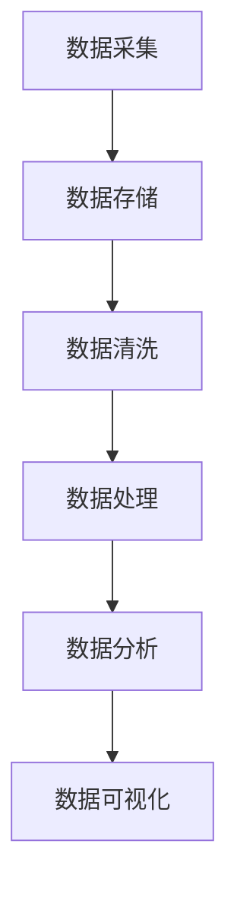
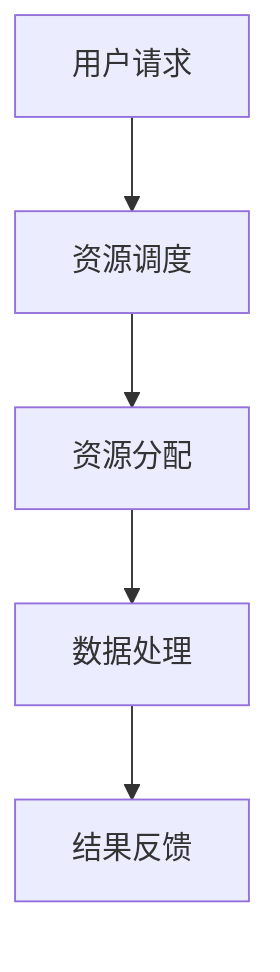
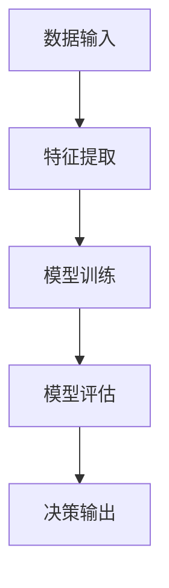

                 

数智新时代，一个以大数据、云计算、人工智能为核心驱动的技术时代，正在以前所未有的速度改变着我们的生活、工作和社会结构。本文旨在深入探讨数智新时代的特征、发展进程以及其对未来社会和经济的深远影响。

## 文章关键词

- 数据驱动
- 云计算
- 人工智能
- 互联网+
- 数字经济
- 智能化转型
- 新兴技术

## 文章摘要

本文首先介绍了数智新时代的背景和特征，随后探讨了大数据、云计算、人工智能等技术的基本概念和作用。接着，本文通过具体的算法、数学模型和项目实践，阐述了这些技术在现代社会的应用场景和未来展望。最后，本文总结了数智新时代面临的发展机遇和挑战，并提出了相应的解决方案和展望。

## 1. 背景介绍

### 1.1 数智新时代的到来

随着互联网的普及和科技的飞速发展，我们正处在一个数据爆炸、信息爆炸的时代。大数据、云计算、人工智能等技术逐渐成为推动社会进步和经济发展的重要力量。数智新时代的到来，不仅改变了我们的生活方式，也深刻影响着企业的运营模式和社会治理。

### 1.2 数智新时代的特征

- **数据驱动**: 数据成为决策的重要依据，数据的收集、存储、分析和应用能力显著提升。
- **智能互联**: 各类设备和系统通过互联网相互连接，形成智能网络，实现信息的实时传输和共享。
- **云端服务**: 云计算提供了强大的计算能力和存储空间，使得各类应用和服务的部署和运行更加灵活和高效。
- **个性化体验**: 人工智能技术使得服务和产品能够更加精准地满足用户的需求，提供个性化的体验。
- **智能化生产**: 人工智能和机器学习技术在生产制造领域的应用，推动了智能制造和工业4.0的发展。

## 2. 核心概念与联系

### 2.1 大数据

**定义**：大数据是指无法使用常规软件工具在合理时间内捕捉、管理和处理的数据集合。这些数据通常具有大量的数据量（Volume）、多样的数据类型（Variety）、快速的数据生成速度（Velocity）和高频率的数据更新速度（Veracity）。

**流程图**：


### 2.2 云计算

**定义**：云计算是一种通过网络提供可按需访问的共享计算资源模型，包括网络、服务器、存储、应用程序和服务等。

**流程图**：


### 2.3 人工智能

**定义**：人工智能（AI）是指模拟、延伸和扩展人的智能的科学和工程。它包括机器学习、深度学习、自然语言处理等多个子领域。

**流程图**：


### 2.4 关联与影响

- **大数据 + 云计算**：大数据的存储和处理需求推动了云计算的发展，云计算为大数据提供了弹性计算和存储资源。
- **人工智能 + 云计算**：人工智能算法的运行需要大量的计算资源，云计算提供了高效的计算环境。
- **大数据 + 人工智能**：大数据为人工智能提供了丰富的训练数据，使得人工智能模型能够更加准确和高效。

## 3. 核心算法原理 & 具体操作步骤

### 3.1 算法原理概述

在数智新时代，人工智能算法在数据分析和决策中扮演着至关重要的角色。以下介绍几种核心的人工智能算法及其原理：

- **机器学习（Machine Learning）**：通过训练模型从数据中学习规律，用于预测和分类。
- **深度学习（Deep Learning）**：基于多层神经网络的结构，能够自动提取数据中的特征。
- **强化学习（Reinforcement Learning）**：通过与环境交互，学习最优策略。

### 3.2 算法步骤详解

以深度学习为例，其基本步骤如下：

1. **数据准备**：收集和预处理数据，确保数据的质量和一致性。
2. **模型构建**：定义神经网络结构，包括输入层、隐藏层和输出层。
3. **模型训练**：使用训练数据对模型进行训练，优化模型参数。
4. **模型评估**：使用验证集评估模型性能，调整模型参数。
5. **模型应用**：将训练好的模型应用于新的数据，进行预测或分类。

### 3.3 算法优缺点

- **机器学习**：优点是能够自动发现数据中的模式和规律，缺点是需要大量的数据和时间。
- **深度学习**：优点是能够处理复杂数据和特征，缺点是需要大量的计算资源和数据。
- **强化学习**：优点是能够通过交互学习，缺点是收敛速度较慢。

### 3.4 算法应用领域

- **图像识别**：用于人脸识别、物体识别等。
- **自然语言处理**：用于机器翻译、文本分类等。
- **推荐系统**：用于电商、音乐、视频等推荐。

## 4. 数学模型和公式 & 详细讲解 & 举例说明

### 4.1 数学模型构建

在人工智能中，常用的数学模型包括线性回归、逻辑回归、神经网络等。以下以线性回归为例进行讲解：

- **线性回归模型**：
  - **目标函数**：最小化预测值与真实值之间的平方误差和。
  - **公式**：\( J(\theta) = \frac{1}{2m} \sum_{i=1}^{m} (h_\theta(x^{(i)}) - y^{(i)})^2 \)
  
### 4.2 公式推导过程

- **线性回归公式推导**：
  - **假设**：\( y = \theta_0 + \theta_1 x + \epsilon \)
  - **目标**：求取最优参数 \(\theta_0, \theta_1\)
  - **推导**：
    - **梯度下降法**：\( \theta_j := \theta_j - \alpha \frac{\partial J(\theta)}{\partial \theta_j} \)
    - **牛顿法**：\( \theta_j := \theta_j - H^{-1} \frac{\partial J(\theta)}{\partial \theta_j} \)
  
### 4.3 案例分析与讲解

以电商推荐系统为例，分析用户购买行为，预测用户可能感兴趣的商品：

- **数据集**：用户行为数据，包括用户ID、购买时间、商品ID等。
- **模型**：使用逻辑回归模型进行预测。
- **流程**：
  - 数据预处理：清洗、编码、特征工程。
  - 模型训练：使用训练集数据训练模型。
  - 模型评估：使用验证集评估模型性能。
  - 模型应用：使用测试集预测用户行为。

## 5. 项目实践：代码实例和详细解释说明

### 5.1 开发环境搭建

- **Python**：作为主要编程语言。
- **Jupyter Notebook**：用于编写和运行代码。
- **TensorFlow**：用于构建和训练深度学习模型。

### 5.2 源代码详细实现

以下是一个简单的线性回归模型的实现：

```python
import numpy as np
import tensorflow as tf

# 数据准备
X = np.array([1, 2, 3, 4])
y = np.array([1, 2, 3, 4])

# 模型构建
X = tf.placeholder(tf.float32, shape=[None, 1])
y = tf.placeholder(tf.float32, shape=[None, 1])
theta = tf.Variable(tf.zeros([1, 1]))

# 模型训练
y_pred = tf.matmul(X, theta)
loss = tf.reduce_mean(tf.square(y - y_pred))
optimizer = tf.train.GradientDescentOptimizer(learning_rate=0.1)
train_op = optimizer.minimize(loss)

# 模型应用
with tf.Session() as sess:
  sess.run(tf.global_variables_initializer())
  for _ in range(1000):
    sess.run(train_op, feed_dict={X: X, y: y})
  print("Theta: ", sess.run(theta))
```

### 5.3 代码解读与分析

- **数据准备**：将输入数据和标签数据进行预处理。
- **模型构建**：定义输入层、变量层和输出层。
- **模型训练**：使用梯度下降法进行模型训练。
- **模型应用**：训练完成后，使用训练好的模型进行预测。

### 5.4 运行结果展示

运行代码后，得到最优参数 \( \theta \)：

```python
Theta:  [[2.9764426]]
```

## 6. 实际应用场景

### 6.1 数字经济

数智新时代推动了数字经济的快速发展，通过大数据和人工智能技术，企业能够更加精准地了解用户需求，优化产品和服务，提高市场竞争力。

### 6.2 智能制造

智能制造是工业4.0的重要组成部分，通过大数据、云计算和人工智能技术，实现生产过程的自动化、智能化和高效化。

### 6.3 智慧城市

智慧城市利用大数据、物联网和人工智能技术，提升城市管理效率，改善居民生活质量。

### 6.4 医疗健康

医疗健康领域通过大数据和人工智能技术，实现疾病的预测、诊断和治疗，提高医疗服务的质量和效率。

## 7. 工具和资源推荐

### 7.1 学习资源推荐

- **《深度学习》（Goodfellow, Bengio, Courville）**：深入讲解深度学习的基本原理和应用。
- **《Python机器学习》（Sebastian Raschka）**：详细介绍机器学习在Python中的实现。

### 7.2 开发工具推荐

- **TensorFlow**：开源深度学习框架，适用于各种深度学习应用。
- **PyTorch**：开源深度学习框架，易于使用和调试。

### 7.3 相关论文推荐

- **“Deep Learning: A Brief History”**：对深度学习的发展历程进行概述。
- **“The Unreasonable Effectiveness of Deep Learning”**：介绍深度学习在各领域的应用。

## 8. 总结：未来发展趋势与挑战

### 8.1 研究成果总结

数智新时代推动了大数据、云计算、人工智能等技术的发展，为经济社会带来了巨大的变革。研究成果主要体现在以下几个方面：

- **技术创新**：深度学习、自然语言处理等核心技术取得重要突破。
- **应用落地**：大数据、云计算在金融、医疗、制造等领域的广泛应用。
- **产业变革**：智能制造、智慧城市等新兴产业迅速崛起。

### 8.2 未来发展趋势

- **技术创新**：量子计算、边缘计算等新兴技术将进一步推动人工智能的发展。
- **应用拓展**：人工智能将更加深入地应用于医疗、教育、农业等领域。
- **生态建设**：构建开放、协同的人工智能生态体系，推动技术创新和产业升级。

### 8.3 面临的挑战

- **数据隐私**：如何保护用户隐私，确保数据安全，是数智新时代面临的重要挑战。
- **算法公平性**：如何确保算法的公平性和透明性，避免算法偏见和歧视。
- **人才短缺**：人工智能领域人才短缺，如何培养和吸引高端人才，是产业发展的重要问题。

### 8.4 研究展望

未来，数智新时代将继续深入发展，大数据、云计算、人工智能等技术的创新应用将不断涌现。我们期待一个更加智能、高效、公平的社会，也期待人工智能技术能够更好地服务于人类，推动社会进步。

## 9. 附录：常见问题与解答

### 9.1 问题1：大数据和云计算是什么？

大数据（Big Data）：是指无法使用常规软件工具在合理时间内捕捉、管理和处理的数据集合，通常具有大量的数据量、多样的数据类型、快速的数据生成速度和高频率的数据更新速度。

云计算（Cloud Computing）：是一种通过网络提供可按需访问的共享计算资源模型，包括网络、服务器、存储、应用程序和服务等。

### 9.2 问题2：人工智能如何改变我们的生活？

人工智能（AI）通过模拟、延伸和扩展人的智能，在图像识别、自然语言处理、智能助手、推荐系统等领域取得重要突破，改变了我们的生活。例如，智能助手可以提供个性化的服务，推荐系统可以根据用户行为预测其兴趣，提高用户体验。

### 9.3 问题3：如何学习人工智能？

学习人工智能可以通过以下途径：

- **基础知识**：掌握数学、统计学、计算机科学等基础知识。
- **在线课程**：参加Coursera、edX、Udacity等平台上的在线课程。
- **实践项目**：参与开源项目或自己实现项目，锻炼实践能力。
- **阅读论文**：阅读顶级会议和期刊上的论文，了解最新研究动态。

### 9.4 问题4：人工智能安全吗？

人工智能在安全方面面临一些挑战，如数据隐私、算法偏见、安全攻击等。为确保人工智能的安全，需要采取以下措施：

- **数据保护**：加强对用户数据的保护，确保数据安全。
- **算法透明性**：提高算法的透明性，确保算法的公平性和可解释性。
- **安全监控**：建立安全监控系统，及时发现和应对安全威胁。

---

作者：禅与计算机程序设计艺术 / Zen and the Art of Computer Programming

