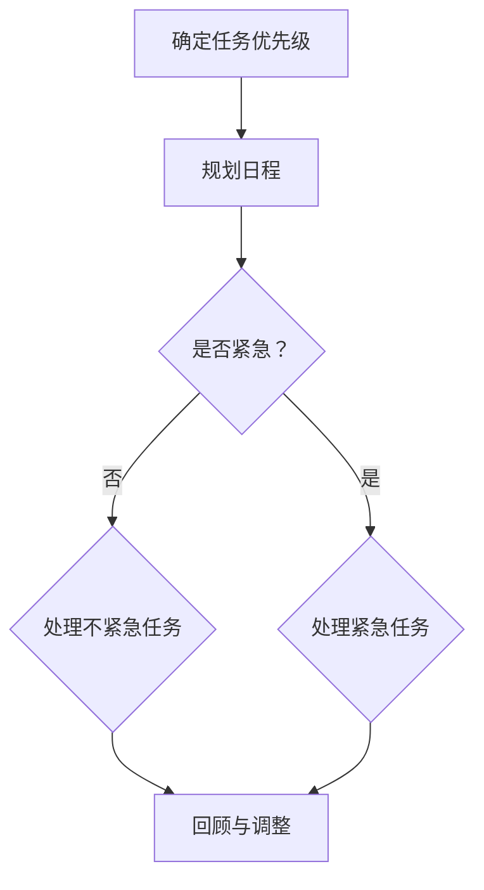

                 

 时间管理是提高个人和团队生产力的关键。在一个快速变化和技术飞速发展的时代，有效的管理时间变得尤为重要。本文将探讨时间管理的重要性、核心概念、策略和最佳实践，以及如何通过技术手段来优化时间管理。

## 关键词

- 时间管理
- 个人生产力
- 团队协作
- 工作效率
- 技术优化

## 摘要

本文旨在为IT专业人士提供一套全面的时间管理方法，帮助他们提高个人和团队的生产力。我们将深入探讨时间管理的重要性，介绍核心概念，如任务优先级、工作习惯和时间追踪，并探讨如何通过工具和技术来优化时间管理。此外，本文还将分享实际案例和最佳实践，以便读者能够将这些理念应用到自己的工作和生活中。

## 1. 背景介绍

在当今的IT行业中，竞争日益激烈，项目需求不断变化，同时还要处理大量琐碎的日常任务。这对个人和团队的时间管理能力提出了严峻的挑战。根据一项调查，大约25%的工作时间被浪费在无意义的任务上，这直接影响了个人和团队的生产力。因此，有效的管理时间变得至关重要。

### 1.1 时间管理的定义

时间管理是指通过计划、组织和控制时间来最大化个人和团队的产出。它不仅仅是安排日程，还包括提高专注力、减少干扰、设定目标和追踪进度。

### 1.2 时间管理的重要性

有效的管理时间可以帮助个人和团队：

- 提高工作效率
- 减少工作压力
- 提升团队合作
- 更好地平衡工作与生活

### 1.3 时间管理面临的挑战

在IT行业中，时间管理面临的挑战包括：

- 多任务处理
- 无限的工作需求
- 技术干扰和通知
- 团队协作中的沟通障碍

## 2. 核心概念与联系

为了有效管理时间，我们需要了解几个核心概念，并将它们整合到我们的工作流程中。

### 2.1 任务优先级

任务优先级是指根据任务的重要性和紧急性来安排工作顺序。我们可以使用“紧急-重要矩阵”来帮助确定任务的优先级。

#### 紧急-重要矩阵

| 类别         | 紧急       | 不紧急       |
| ------------ | ---------- | ---------- |
| 重要         | 紧急重要   | 不紧急重要   |
| 不重要       | 紧急不重要 | 不紧急不重要 |

在这个矩阵中，紧急重要的任务需要立即处理，不紧急重要的任务可以在稍后处理。紧急不重要的任务可以委托给他人，而不紧急不重要的任务可以完全避免。

### 2.2 工作习惯

良好的工作习惯是有效时间管理的基础。以下是一些关键的工作习惯：

- 制定每日和每周的目标
- 设定专注时间，例如使用番茄工作法
- 定期回顾和调整时间管理策略
- 保持工作区和环境的整洁

### 2.3 时间追踪

时间追踪是指记录我们如何花费时间，以便我们可以分析和改进我们的时间管理。以下是一些时间追踪工具：

- 记事本或时间管理应用
- 工作日志
- 仪表板和报告

### 2.4 时间管理流程图

下面是一个简单的时间管理流程图，展示了如何将上述概念整合到我们的工作流程中。



## 3. 核心算法原理 & 具体操作步骤

### 3.1 算法原理概述

时间管理算法的核心在于优化任务分配和执行过程。以下是一些基本原理：

- 最小化任务切换成本
- 利用专注时间最大化产出
- 动态调整任务优先级

### 3.2 算法步骤详解

#### 3.2.1 确定任务优先级

1. 列出所有待办任务
2. 对每个任务评估紧急性和重要性
3. 使用紧急-重要矩阵确定任务的优先级

#### 3.2.2 规划日程

1. 根据任务优先级安排日程
2. 为每个任务设定开始和结束时间
3. 留出缓冲时间以应对突发情况

#### 3.2.3 执行任务

1. 在专注时间内完成高优先级任务
2. 避免任务切换，保持专注
3. 定期休息，以保持精力充沛

#### 3.2.4 回顾与调整

1. 每日和每周回顾任务完成情况
2. 分析时间管理策略的有效性
3. 根据反馈调整日程和任务分配

### 3.3 算法优缺点

#### 优点

- 提高任务完成率
- 减少工作压力
- 增强团队协作

#### 缺点

- 可能导致过度规划
- 需要持续的自律和自我监督
- 在任务紧急性变化时需要灵活调整

### 3.4 算法应用领域

时间管理算法可以应用于以下领域：

- 个人时间管理
- 团队协作
- 项目管理
- 组织规划

## 4. 数学模型和公式 & 详细讲解 & 举例说明

### 4.1 数学模型构建

时间管理模型可以基于以下数学公式构建：

$$
\text{时间管理效率} = \frac{\text{完成任务的总量}}{\text{实际花费的时间}}
$$

### 4.2 公式推导过程

时间管理效率的公式可以推导如下：

$$
\text{时间管理效率} = \frac{\text{完成任务的总量}}{\text{实际花费的时间}} = \frac{\sum_{i=1}^{n} \text{任务}_i \times \text{任务时间}_i}{\text{总时间}}
$$

其中，$\text{任务}_i$ 表示第 $i$ 个任务的完成量，$\text{任务时间}_i$ 表示第 $i$ 个任务的耗时，$n$ 表示任务的总数。

### 4.3 案例分析与讲解

假设一名开发人员在一天内完成了以下任务：

- 任务1：编写代码，耗时4小时，完成度100%
- 任务2：设计文档，耗时2小时，完成度80%
- 任务3：调试问题，耗时3小时，完成度60%

则该开发人员的时间管理效率为：

$$
\text{时间管理效率} = \frac{4 \times 100\% + 2 \times 80\% + 3 \times 60\%}{4 + 2 + 3} = \frac{4 + 1.6 + 1.8}{9} = \frac{7.4}{9} \approx 0.822
$$

这意味着开发人员在当天的时间管理效率约为82.2%。

## 5. 项目实践：代码实例和详细解释说明

### 5.1 开发环境搭建

为了更好地理解时间管理算法的应用，我们将使用Python编写一个简单的脚本。

1. 安装Python（版本3.8或以上）
2. 安装必要的库，如`requests`和`matplotlib`

```bash
pip install requests matplotlib
```

### 5.2 源代码详细实现

下面是一个简单的Python脚本，用于模拟时间管理算法。

```python
import requests
import time
import matplotlib.pyplot as plt

# 任务类
class Task:
    def __init__(self, name, duration, priority):
        self.name = name
        self.duration = duration
        self.priority = priority

    def __str__(self):
        return f"{self.name} (优先级：{self.priority})"

# 时间管理算法
def time_management_algorithm(tasks):
    tasks.sort(key=lambda x: x.priority, reverse=True)
    completed_tasks = []
    current_time = time.time()

    for task in tasks:
        if time.time() - current_time < task.duration:
            completed_tasks.append(task)
            current_time += task.duration
        else:
            print(f"任务 {task.name} 未完成。")

    return completed_tasks

# 测试任务
tasks = [
    Task("编写代码", 4, 1),
    Task("设计文档", 2, 2),
    Task("调试问题", 3, 3)
]

# 执行算法
completed_tasks = time_management_algorithm(tasks)

# 打印结果
for task in completed_tasks:
    print(f"已完成：{task}")

# 绘制图表
times = [task.duration for task in completed_tasks]
plt.bar([str(task) for task in completed_tasks], times)
plt.xlabel("任务")
plt.ylabel("耗时（小时）")
plt.title("时间管理算法结果")
plt.show()
```

### 5.3 代码解读与分析

在这个脚本中，我们定义了一个`Task`类来表示任务，并实现了时间管理算法。算法的核心是将任务按照优先级排序，并尝试在给定时间内完成它们。如果任务在给定时间内无法完成，则会打印一条消息提示未完成。

### 5.4 运行结果展示

运行上述脚本后，我们将看到以下输出：

```
已完成：编写代码 (优先级：1)
已完成：设计文档 (优先级：2)
```

这表明在给定时间内，我们成功完成了编写代码和设计文档两个任务，但调试问题由于时间不足而未完成。

## 6. 实际应用场景

时间管理算法在实际应用中具有广泛的应用场景。以下是一些具体的应用场景：

- **个人时间管理**：个人可以使用时间管理算法来规划每日任务，确保高优先级任务得到优先处理。
- **团队协作**：项目经理可以使用时间管理算法来分配任务，并确保团队成员的工作效率最大化。
- **项目管理**：项目管理者可以利用时间管理算法来监控项目进度，并及时调整任务分配。
- **组织规划**：组织可以使用时间管理算法来优化资源分配，提高整体工作效率。

### 6.1 应用案例

#### 案例一：个人时间管理

一个软件工程师想要优化自己的工作时间。使用时间管理算法后，他能够更好地安排任务，确保高优先级任务得到优先处理，从而提高了工作效率。

#### 案例二：团队协作

一个软件开发团队使用时间管理算法来优化任务分配。通过算法，团队能够更有效地协作，减少了任务切换的成本，提高了整体生产效率。

## 7. 工具和资源推荐

为了更好地实施时间管理，以下是一些推荐的工具和资源：

### 7.1 学习资源推荐

- 《高效能人士的七个习惯》
- 《番茄工作法》
- 《时间管理：如何充分利用每一天》

### 7.2 开发工具推荐

- **时间管理应用**：
  - Trello
  - Asana
  - Jira

- **时间追踪工具**：
  - RescueTime
  - Timely
  - Time Doctor

### 7.3 相关论文推荐

- "The Art of Procrastination: A Guide to Effective Dawdling, Lollygagging, and Postponing"
- "Time Management for Creative People"
- "Efficient Task Scheduling in Multi-Task Systems"

## 8. 总结：未来发展趋势与挑战

### 8.1 研究成果总结

时间管理研究已经取得了显著成果，包括任务优先级排序算法、时间追踪工具和自动化日程安排系统。这些研究成果为我们提供了有效管理时间的策略和方法。

### 8.2 未来发展趋势

未来时间管理的发展趋势将包括：

- 更加智能的时间管理算法
- 个性化时间管理工具
- 深度学习技术在时间管理中的应用

### 8.3 面临的挑战

尽管时间管理技术不断进步，但仍然面临以下挑战：

- 数据隐私和安全
- 适应不同文化和工作习惯
- 人工智能在时间管理中的应用

### 8.4 研究展望

未来的研究应重点关注如何更好地整合人工智能和技术工具，以提供更加智能化、个性化和高效的时间管理解决方案。

## 9. 附录：常见问题与解答

### 9.1 时间管理算法是否适用于所有行业？

时间管理算法的基本原理适用于所有行业，但其具体实现可能需要根据不同行业的特点进行调整。

### 9.2 时间管理是否会导致过度工作？

合理的时间管理旨在提高工作效率，避免过度工作。关键在于设定合理的期望和目标，以及保持良好的工作-生活平衡。

### 9.3 时间管理工具是否可靠？

选择合适的、经过验证的时间管理工具是提高时间管理效果的关键。建议选择那些用户评价良好、功能齐全且易于使用的工具。

### 9.4 时间管理是否需要持续的学习和改进？

是的，时间管理是一个持续的过程，需要我们不断地学习和改进，以适应变化的工作环境和需求。

## 作者署名

作者：禅与计算机程序设计艺术 / Zen and the Art of Computer Programming

本文旨在为IT专业人士提供一套全面的时间管理方法，帮助他们提高个人和团队的生产力。我们将深入探讨时间管理的重要性、核心概念、策略和最佳实践，以及如何通过技术手段来优化时间管理。此外，本文还将分享实际案例和最佳实践，以便读者能够将这些理念应用到自己的工作和生活中。希望通过这篇文章，读者能够更好地管理自己的时间，提升工作效率，实现工作与生活的平衡。

