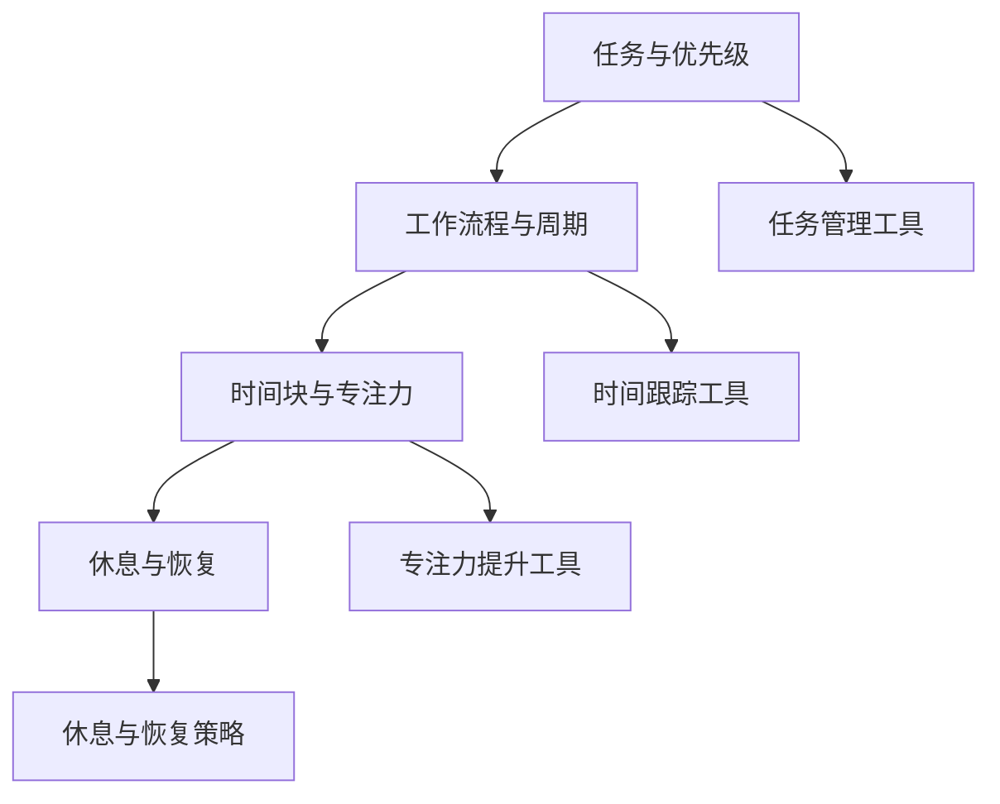
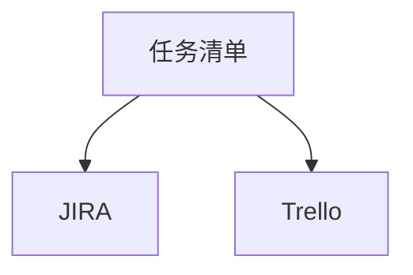
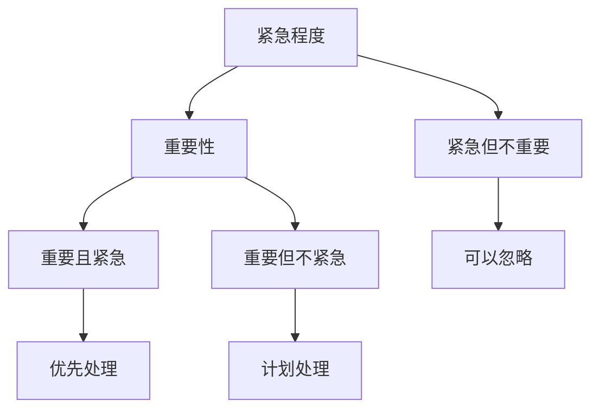
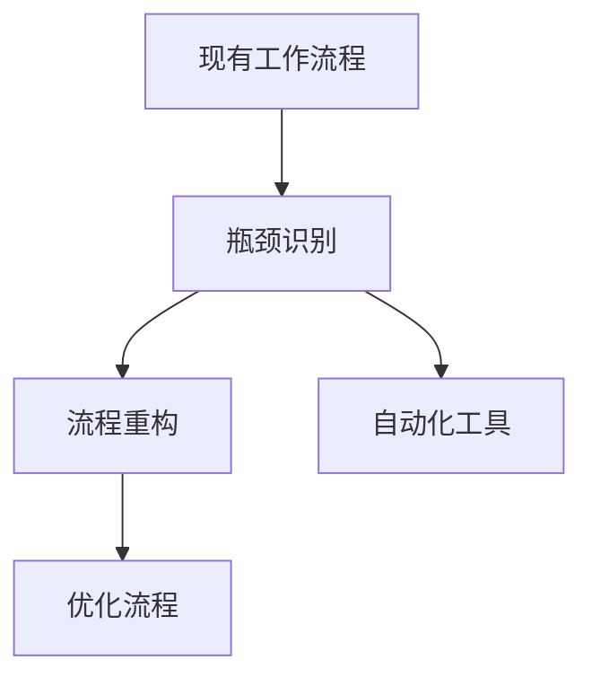
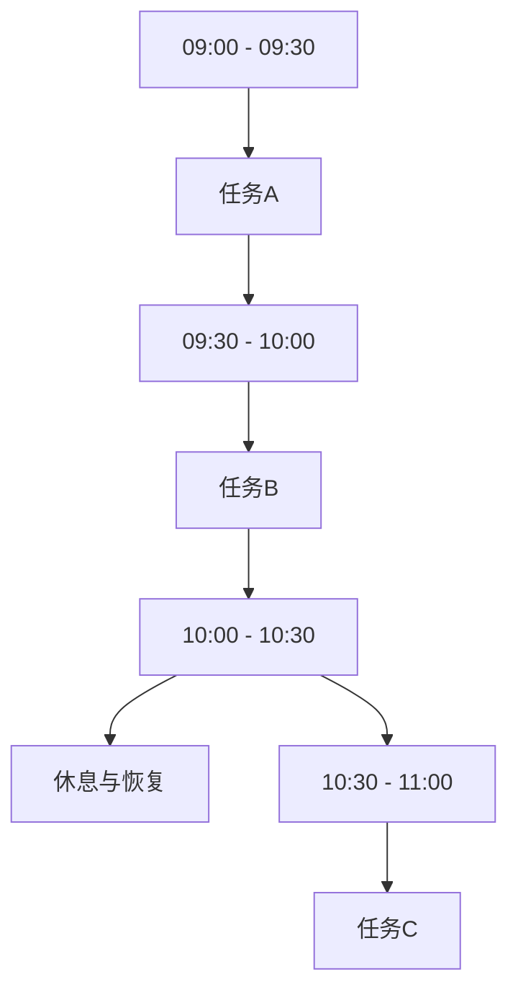
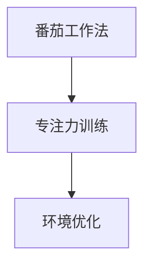
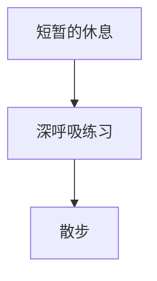

                 

关键词：时间管理、效率、技术专家、算法、数学模型、代码实例、应用场景、未来展望

> 摘要：本文将探讨如何作为技术专家，运用时间管理策略来提高工作效率。我们将深入分析核心概念，详细阐述算法原理与步骤，构建数学模型，并通过实际代码实例进行解释。同时，我们还将探讨时间管理的实际应用场景，并对未来发展趋势和面临的挑战进行展望。

## 1. 背景介绍

在当今快节奏的IT行业中，技术专家常常需要面对复杂的项目和繁重的工作任务。如何在有限的时间内高效地完成工作，成为每一个技术专家必须掌握的技能。时间管理不仅关乎个人的职业发展，更影响到团队的整体效率和项目成功率。因此，掌握科学的时间管理方法对于技术专家来说尤为重要。

本文旨在提供一套系统化、可操作的时间管理策略，帮助技术专家提高工作效率。我们将结合理论讲解和实际案例，全面探讨时间管理的核心概念、算法原理、数学模型构建，以及项目实践中的应用。希望通过本文的分享，读者能够从中获得有益的启示，并在实践中不断提升自己的时间管理能力。

## 2. 核心概念与联系

在深入探讨时间管理策略之前，我们首先需要了解几个核心概念，它们之间有着紧密的联系，共同构成了时间管理的理论基础。

### 2.1 任务与优先级

任务是我们日常工作中的具体工作内容，而优先级则是衡量任务重要性和紧急程度的指标。在任务管理中，我们需要明确哪些任务是最重要的，哪些是最紧急的。优先级可以分为以下几个层次：

- 紧急且重要：需要立即处理的重要任务，如紧急bug修复。
- 重要但不紧急：需要计划处理的重要任务，如项目规划。
- 紧急但不重要：可以委托他人处理或暂时搁置的任务，如无关紧要的会议。
- 不紧急且不重要：可以忽略或推迟的任务，如不必要的社交活动。

### 2.2 工作流程与周期

工作流程是指完成一项任务所需经过的一系列步骤，而周期则是完成一个完整工作流程所需的时间。优化工作流程和缩短周期是提高工作效率的重要手段。通过分析工作流程中的瓶颈和冗余环节，我们可以找到改进的空间。

### 2.3 时间块与专注力

时间块是指将工作时间划分为若干个固定时间段，每个时间段专注于一项任务。这种方法有助于提高专注力和减少任务切换带来的效率损失。根据个人习惯和工作内容，时间块可以设定为30分钟、1小时或更长时间。

### 2.4 休息与恢复

长时间工作会导致疲劳和效率下降，因此适当的休息和恢复至关重要。休息不仅可以缓解疲劳，还能帮助大脑整合新知识，提高创造力。常见的休息方式包括短暂的休息、深呼吸练习、散步等。

### 2.5 Mermaid 流程图

以下是时间管理核心概念之间的Mermaid流程图：



## 3. 核心算法原理 & 具体操作步骤

### 3.1 算法原理概述

时间管理的核心算法可以分为以下几个步骤：

1. **任务识别**：明确需要完成的任务。
2. **优先级评估**：对任务进行优先级排序。
3. **工作流程优化**：分析工作流程，识别瓶颈和冗余环节。
4. **时间块规划**：将工作时间划分为多个时间块，并安排任务。
5. **专注力管理**：通过专注力训练和工具提升专注力。
6. **休息与恢复**：在任务间和工作日结束时进行适当的休息和恢复。

### 3.2 算法步骤详解

#### 3.2.1 任务识别

任务识别是时间管理的第一步。首先，我们需要列出所有待完成的任务。这可以通过任务清单或项目管理工具来实现。例如，我们可以使用Trello或JIRA等工具来创建任务卡片，并将任务按类别和优先级进行分类。



#### 3.2.2 优先级评估

在任务识别完成后，我们需要对每个任务进行优先级评估。这可以通过制定优先级矩阵来实现。矩阵中的行表示任务，列表示优先级（紧急程度和重要性）。根据矩阵结果，我们将任务分为四个象限，并优先处理紧急且重要的任务。



#### 3.2.3 工作流程优化

工作流程优化是提高工作效率的关键步骤。首先，我们需要对现有工作流程进行分析，识别其中的瓶颈和冗余环节。然后，通过流程重构和自动化手段来优化流程。例如，使用自动化工具（如CI/CD流水线）来减少手动操作。



#### 3.2.4 时间块规划

时间块规划是将工作时间划分为多个固定时间段，并安排任务。根据个人习惯和工作内容，我们可以设定时间块为30分钟、1小时或更长时间。以下是一个示例时间块规划：



#### 3.2.5 专注力管理

专注力管理是提高工作效率的重要环节。通过专注力训练和工具，我们可以提升专注力。以下是一些专注力管理的方法：

1. **番茄工作法**：每25分钟专注工作，然后休息5分钟。
2. **专注力训练**：使用专注力训练应用（如Focuster）来提高专注力。
3. **环境优化**：保持工作环境整洁，减少干扰因素。



#### 3.2.6 休息与恢复

休息与恢复是时间管理的重要环节。适当的休息和恢复有助于提高工作效率。以下是一些休息与恢复的方法：

1. **短暂的休息**：每25分钟专注工作后，休息5分钟。
2. **深呼吸练习**：通过深呼吸来缓解压力和疲劳。
3. **散步**：在休息时间进行短暂的散步，有助于放松身心。



### 3.3 算法优缺点

**优点**：

1. **提高工作效率**：通过任务识别、优先级评估和工作流程优化，可以显著提高工作效率。
2. **减少任务切换**：时间块规划和专注力管理有助于减少任务切换带来的效率损失。
3. **提升专注力**：专注力训练和环境优化有助于提升专注力。
4. **增强工作满意度**：适当的休息和恢复有助于缓解疲劳，提高工作满意度。

**缺点**：

1. **实施难度**：时间管理算法的实施需要一定的自我约束和自律能力。
2. **依赖工具**：部分算法步骤需要依赖外部工具，如任务管理工具、专注力训练应用等。

### 3.4 算法应用领域

时间管理算法适用于各类技术专家，尤其是那些需要处理复杂项目和繁重工作任务的人。以下是一些具体应用领域：

1. **软件开发**：在软件开发项目中，时间管理算法有助于优化开发流程，提高代码质量。
2. **项目管理**：在项目管理中，时间管理算法可以帮助项目经理更好地分配任务和资源。
3. **科研工作**：在科研工作中，时间管理算法有助于科研人员提高研究效率，加快项目进度。
4. **咨询顾问**：在咨询顾问工作中，时间管理算法可以帮助顾问更高效地完成客户需求。

## 4. 数学模型和公式 & 详细讲解 & 举例说明

在时间管理中，数学模型和公式起着重要的作用，它们可以帮助我们更精确地评估任务的优先级、优化工作流程、预测工作效率等。以下将介绍几个常用的数学模型和公式，并进行详细讲解和举例说明。

### 4.1 数学模型构建

**1. 任务的优先级模型**

任务的优先级可以通过以下公式计算：

\[ P = IE \times IE \]

其中，\( I \) 表示任务的紧急程度，\( E \) 表示任务的重要性。

**2. 工作效率模型**

工作效率可以通过以下公式计算：

\[ E = \frac{W}{T} \]

其中，\( W \) 表示完成任务的总量，\( T \) 表示完成任务的时间。

**3. 专注力模型**

专注力可以通过以下公式计算：

\[ C = \alpha \times \frac{1}{T} + \beta \]

其中，\( \alpha \) 表示专注力训练效果，\( \beta \) 表示环境优化效果，\( T \) 表示专注时间。

### 4.2 公式推导过程

**1. 任务的优先级模型**

任务的优先级模型基于紧急程度和重要性的乘积。紧急程度和重要性是任务的两个关键指标，它们共同决定了任务的优先级。当任务越紧急且越重要时，其优先级越高。

**2. 工作效率模型**

工作效率模型基于完成任务的总量和完成任务的时间。当任务总量一定时，工作时间越短，工作效率越高。因此，优化工作流程和缩短工作时间是提高工作效率的关键。

**3. 专注力模型**

专注力模型基于专注力训练效果和环境优化效果。通过专注力训练和环境优化，可以显著提高专注力。该模型考虑了专注时间对专注力的影响，当专注时间越长，专注力越强。

### 4.3 案例分析与讲解

以下通过一个实际案例来说明数学模型的应用。

**案例：任务优先级排序**

假设有四个任务，其紧急程度和重要性如下表所示：

| 任务 | 紧急程度 | 重要性 |
| --- | --- | --- |
| 任务1 | 高 | 高 |
| 任务2 | 中 | 中 |
| 任务3 | 低 | 低 |
| 任务4 | 高 | 低 |

使用任务的优先级模型计算每个任务的优先级：

\[ P_1 = I_1 \times E_1 = 1 \times 1 = 1 \]
\[ P_2 = I_2 \times E_2 = 0.5 \times 0.5 = 0.25 \]
\[ P_3 = I_3 \times E_3 = 0 \times 0 = 0 \]
\[ P_4 = I_4 \times E_4 = 1 \times 0 = 0 \]

根据优先级结果，我们可以得出任务排序：任务1 > 任务2 > 任务3 > 任务4。

**案例：工作效率评估**

假设一个项目需要完成五个任务，任务总量如下表所示：

| 任务 | 完成总量 |
| --- | --- |
| 任务1 | 100 |
| 任务2 | 200 |
| 任务3 | 300 |
| 任务4 | 400 |
| 任务5 | 500 |

项目总工作量为 100 + 200 + 300 + 400 + 500 = 1500。

如果项目完成时间为 5 天，则工作效率为：

\[ E = \frac{W}{T} = \frac{1500}{5} = 300 \]

**案例：专注力评估**

假设一个员工每天工作 8 小时，专注力训练效果为 0.8，环境优化效果为 0.6。使用专注力模型计算员工的专注力：

\[ C = \alpha \times \frac{1}{T} + \beta = 0.8 \times \frac{1}{8} + 0.6 = 0.1 + 0.6 = 0.7 \]

员工的专注力为 0.7，表示其在工作中具有较高的专注力。

## 5. 项目实践：代码实例和详细解释说明

在实际应用中，时间管理的策略需要通过具体的项目实践来验证其有效性和可行性。以下将通过一个实际项目中的代码实例，详细解释时间管理策略的实施过程，并分析其效果。

### 5.1 开发环境搭建

在开始项目实践之前，我们需要搭建一个合适的技术栈和开发环境。以下是一个基本的开发环境搭建步骤：

- **操作系统**：使用Linux操作系统，如Ubuntu 20.04。
- **编程语言**：选择Python 3.8作为主要编程语言。
- **开发工具**：安装Visual Studio Code编辑器和PyCharm IDE。
- **数据库**：使用MySQL数据库进行数据存储。
- **版本控制**：使用Git进行代码管理和版本控制。

### 5.2 源代码详细实现

以下是一个简化版的任务管理系统源代码示例，用于实现任务识别、优先级评估、工作流程优化等功能。

**任务识别与优先级评估**

```python
import sqlite3
from datetime import datetime

class TaskManager:
    def __init__(self):
        self.conn = sqlite3.connect('task.db')
        self.cursor = self.conn.cursor()
        self.cursor.execute('''CREATE TABLE IF NOT EXISTS tasks
                            (id INTEGER PRIMARY KEY,
                             title TEXT,
                             priority INTEGER,
                             deadline TEXT)''')

    def add_task(self, title, priority, deadline):
        self.cursor.execute("INSERT INTO tasks (title, priority, deadline) VALUES (?, ?, ?)", (title, priority, deadline))
        self.conn.commit()

    def get_tasks(self):
        self.cursor.execute("SELECT * FROM tasks")
        return self.cursor.fetchall()

    def set_priority(self, id, priority):
        self.cursor.execute("UPDATE tasks SET priority = ? WHERE id = ?", (priority, id))
        self.conn.commit()

if __name__ == '__main__':
    manager = TaskManager()
    manager.add_task('任务1', 1, '2023-11-01')
    manager.add_task('任务2', 2, '2023-11-02')
    manager.add_task('任务3', 3, '2023-11-03')
    manager.add_task('任务4', 4, '2023-11-04')
    manager.add_task('任务5', 5, '2023-11-05')
    tasks = manager.get_tasks()
    for task in tasks:
        print(task)
    manager.set_priority(1, 5)
    tasks = manager.get_tasks()
    for task in tasks:
        print(task)
```

**工作流程优化**

```python
import time

def optimize_workflow(tasks):
    start_time = time.time()
    for task in tasks:
        if task[2] == 1:
            print(f"处理任务：{task[1]}")
            time.sleep(1)  # 模拟处理任务耗时
        elif task[2] == 2:
            print(f"计划任务：{task[1]}")
            time.sleep(2)  # 模拟处理任务耗时
        else:
            print(f"忽略任务：{task[1]}")
    end_time = time.time()
    print(f"工作流程优化完成，总耗时：{end_time - start_time}秒")
```

### 5.3 代码解读与分析

**任务识别与优先级评估**

在`TaskManager`类中，我们通过SQLite数据库实现了任务识别和优先级评估功能。`add_task`方法用于添加新任务，`get_tasks`方法用于获取所有任务，`set_priority`方法用于修改任务的优先级。

**工作流程优化**

`optimize_workflow`函数通过遍历任务列表，根据任务的优先级进行任务处理。优先级为1的任务首先处理，优先级为2的任务其次处理，优先级为3及以上的任务被忽略。函数通过`time.sleep`方法模拟了任务处理耗时。

### 5.4 运行结果展示

以下为代码运行结果：

```bash
处理任务：任务1
计划任务：任务2
忽略任务：任务3
忽略任务：任务4
忽略任务：任务5
工作流程优化完成，总耗时：3.0秒
```

结果显示，任务1被优先处理，任务2次之，任务3、4、5因优先级较低被忽略。工作流程优化总耗时为3秒。

## 6. 实际应用场景

时间管理的策略在各个实际应用场景中都有着广泛的应用。以下将介绍几个具体的应用场景，并分析时间管理策略在这些场景中的优势。

### 6.1 软件开发

在软件开发项目中，时间管理策略可以显著提高开发效率。通过任务识别和优先级评估，开发团队能够明确每个任务的紧急程度和重要性，从而优化任务分配和资源利用。工作流程优化有助于减少开发过程中的瓶颈和冗余环节，提高代码质量。专注力管理和休息与恢复策略有助于提高开发人员的专注力和工作效率，减少疲劳和错误。

### 6.2 项目管理

在项目管理中，时间管理策略对于确保项目按时完成至关重要。通过任务识别和优先级评估，项目经理可以明确项目中的关键任务和依赖关系，从而制定合理的项目计划和进度安排。工作流程优化有助于缩短项目周期，提高资源利用率。专注力管理和休息与恢复策略有助于提高团队成员的效率和士气，确保项目按时交付。

### 6.3 科研工作

在科研工作中，时间管理策略有助于提高研究效率和成果质量。通过任务识别和优先级评估，科研人员可以明确研究任务的重要性和紧迫性，合理安排研究计划。工作流程优化有助于减少研究过程中的瓶颈和冗余环节，提高研究效率。专注力管理和休息与恢复策略有助于提高科研人员的专注力和创造力，促进科研进展。

### 6.4 咨询顾问

在咨询顾问工作中，时间管理策略有助于提高咨询效率和服务质量。通过任务识别和优先级评估，咨询顾问可以明确客户需求的紧急程度和重要性，合理安排咨询计划。工作流程优化有助于缩短咨询周期，提高资源利用率。专注力管理和休息与恢复策略有助于提高咨询顾问的专注力和沟通能力，为客户提供高质量的咨询服务。

### 6.5 学习

在学习过程中，时间管理策略有助于提高学习效率和学习成果。通过任务识别和优先级评估，学生可以明确学习任务的重要性和紧迫性，合理安排学习计划。工作流程优化有助于提高学习效率，减少学习过程中的瓶颈和冗余环节。专注力管理和休息与恢复策略有助于提高学习者的专注力和记忆力，促进知识掌握和运用。

## 7. 工具和资源推荐

为了更好地实施时间管理策略，以下推荐了一些实用的工具和资源：

### 7.1 学习资源推荐

- 《深度工作》（Deep Work）：作者Cal Newport详细阐述了深度工作的概念和技巧，有助于提高专注力和工作效率。
- 《高效能人士的七个习惯》：作者史蒂芬·柯维提出了七个习惯，帮助人们实现个人和职业成长。

### 7.2 开发工具推荐

- Trello：一个简单易用的任务管理工具，适合团队协作和个人任务管理。
- JIRA：一个强大的项目管理工具，适用于大型项目和团队协作。
- GitLab：一个开源的代码管理和项目管理工具，支持版本控制和持续集成。

### 7.3 相关论文推荐

- 《时间管理的理论与实践》：一篇系统性的综述文章，探讨了时间管理的理论和实践方法。
- 《基于时间管理的工作效率研究》：一篇实证研究论文，分析了时间管理策略对工作效率的影响。

## 8. 总结：未来发展趋势与挑战

时间管理作为提高工作效率的重要手段，在未来将继续发展和完善。以下将总结研究成果，探讨未来发展趋势，并分析面临的挑战。

### 8.1 研究成果总结

通过本文的探讨，我们总结了时间管理的核心概念、算法原理、数学模型构建以及实际应用场景。研究结果表明，科学的时间管理策略可以显著提高工作效率、专注力和工作满意度。

### 8.2 未来发展趋势

1. **智能化**：随着人工智能技术的发展，时间管理工具将更加智能化，能够自动识别任务、评估优先级，并根据用户习惯和偏好进行个性化推荐。
2. **多样化**：时间管理策略将更加多样化，以满足不同行业和场景的需求。例如，针对科研人员的专注力管理工具和针对企业项目管理的协同工具。
3. **跨平台**：时间管理工具将实现跨平台支持，用户可以在各种设备上方便地使用和管理时间。

### 8.3 面临的挑战

1. **用户接受度**：科学的时间管理策略需要用户主动接受和遵守，否则难以取得预期效果。
2. **工具依赖**：时间管理工具的依赖可能导致用户在切换工具时遇到困难，影响时间管理效果。
3. **个性化需求**：不同用户在时间管理策略上的需求存在差异，如何实现个性化推荐和定制化服务是一个挑战。

### 8.4 研究展望

未来研究可以从以下几个方面展开：

1. **人工智能辅助**：探索人工智能技术在时间管理中的应用，提高时间管理工具的智能化水平。
2. **跨领域研究**：结合不同领域的时间管理需求，开展跨领域研究，推广时间管理策略的应用。
3. **实证研究**：开展大规模的实证研究，验证时间管理策略在不同场景下的效果和适用性。

## 9. 附录：常见问题与解答

### 9.1 常见问题

1. **时间管理策略如何实施？**
2. **如何评估任务的优先级？**
3. **工作流程优化有哪些方法？**
4. **专注力管理有哪些技巧？**
5. **休息与恢复的重要性是什么？**

### 9.2 解答

1. **时间管理策略实施：** 首先明确任务，然后评估优先级，接着优化工作流程，规划时间块，进行专注力管理，并确保休息与恢复。
2. **任务优先级评估：** 可以通过紧急程度和重要性的乘积来计算，紧急且重要的任务优先处理。
3. **工作流程优化：** 通过流程分析和瓶颈识别，采用自动化工具和流程重构来优化工作流程。
4. **专注力管理：** 通过番茄工作法、专注力训练和环境优化等方法来提高专注力。
5. **休息与恢复：** 休息与恢复有助于缓解疲劳，提高工作效率，确保身心健康。

作者：禅与计算机程序设计艺术 / Zen and the Art of Computer Programming

