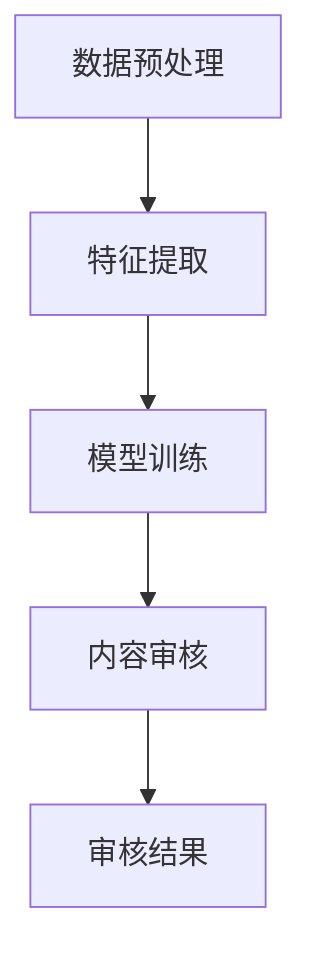

                 

关键词：智能内容审核，AI大模型，社交平台，算法原理，数学模型，项目实践，应用场景，未来展望

> 摘要：随着社交媒体的普及，内容审核成为社交平台面临的一项重大挑战。本文旨在探讨利用AI大模型进行智能内容审核的方法和应用，分析其核心概念、算法原理、数学模型以及实际应用场景，为相关领域的研究和实践提供参考。

## 1. 背景介绍

近年来，社交媒体的迅猛发展使得人们获取和分享信息变得更加便捷。然而，随之而来的问题也日益严重，如虚假信息传播、恶意言论泛滥等。为了维护社交媒体的生态健康，内容审核成为各大平台必须面对的关键任务。然而，传统的手动审核方式效率低下，难以应对海量数据的处理需求。

在此背景下，人工智能，特别是AI大模型的快速发展，为智能内容审核带来了新的契机。AI大模型具备强大的语义理解和生成能力，能够高效地对海量数据进行处理，自动识别和过滤不良内容，从而提升审核的准确性和效率。本文将围绕AI大模型在社交平台内容审核中的应用进行深入探讨。

## 2. 核心概念与联系

### 2.1 AI大模型概述

AI大模型，即基于深度学习的复杂神经网络结构，具有数十亿甚至千亿级别的参数。它们通过大量数据的学习，可以实现对自然语言、图像等多种类型数据的理解和生成。代表性的AI大模型包括BERT、GPT、ViT等，它们在自然语言处理、计算机视觉等领域取得了显著成果。

### 2.2 智能内容审核原理

智能内容审核的核心在于对用户生成内容的理解和分类。具体而言，包括以下几个步骤：

1. **数据预处理**：对用户生成的内容进行清洗和格式化，如去除HTML标签、分词、去停用词等。
2. **特征提取**：利用词嵌入技术将文本转化为向量表示，为后续的模型训练提供基础。
3. **模型训练**：利用已标注的数据集训练AI大模型，使其具备分类和识别不良内容的能力。
4. **内容审核**：将用户生成的新内容输入到训练好的模型中，预测其类别，从而实现自动审核。

### 2.3 Mermaid流程图

下面是一个简单的Mermaid流程图，展示了智能内容审核的基本流程：



## 3. 核心算法原理 & 具体操作步骤

### 3.1 算法原理概述

智能内容审核的核心算法通常是基于深度学习的分类算法，如卷积神经网络（CNN）和循环神经网络（RNN）。CNN擅长处理图像数据，而RNN则擅长处理序列数据，如文本。在文本内容审核中，常用的算法包括基于BERT的文本分类模型和基于GPT的生成对抗网络（GAN）。

### 3.2 算法步骤详解

1. **数据集准备**：收集并标注包含各类不良内容的文本数据，如色情、暴力、恶意言论等。数据集需要具备多样性，以确保模型的泛化能力。
2. **模型选择**：根据任务需求选择合适的模型。对于文本分类任务，BERT等预训练模型是不错的选择；对于生成任务，GPT和GAN具有显著优势。
3. **模型训练**：使用已标注的数据集对模型进行训练，通过优化损失函数调整模型参数，使其具备分类和生成能力。
4. **模型评估**：使用验证集对模型进行评估，调整超参数以达到最佳效果。
5. **模型部署**：将训练好的模型部署到线上环境，对用户生成的新内容进行审核。

### 3.3 算法优缺点

**优点：**
- **高效性**：AI大模型能够快速处理海量数据，提升审核效率。
- **准确性**：通过深度学习，模型能够自动学习和调整，提高审核的准确性。
- **灵活性**：支持多种数据类型的审核，如文本、图像和视频。

**缺点：**
- **计算资源消耗**：训练和部署AI大模型需要大量的计算资源。
- **数据标注成本**：高质量的数据集需要大量的标注工作，成本较高。
- **潜在风险**：算法偏见可能导致误判或歧视。

### 3.4 算法应用领域

智能内容审核算法在社交平台、新闻媒体、电子商务等多个领域具有广泛应用。以下是一些典型应用场景：

- **社交平台**：自动过滤违规内容，如恶意言论、色情信息等，维护社区秩序。
- **新闻媒体**：实时监测新闻内容，自动识别和过滤虚假信息，保障新闻真实性。
- **电子商务**：监控商品评价和用户评论，自动识别和过滤不良评价，提高用户体验。

## 4. 数学模型和公式 & 详细讲解 & 举例说明

### 4.1 数学模型构建

智能内容审核中的数学模型主要包括文本分类模型和生成对抗网络（GAN）。

#### 文本分类模型

文本分类模型的核心是构建一个分类器，能够将输入的文本映射到预定义的类别标签上。常用的模型包括基于CNN和RNN的文本分类模型。

- **CNN模型**：

  $$ 
  \text{CNN} = \sum_{i=1}^{n} w_i \cdot a_i + b 
  $$

  其中，$w_i$为权重，$a_i$为卷积核，$b$为偏置。

- **RNN模型**：

  $$ 
  \text{RNN} = \sum_{i=1}^{n} h_t \cdot \text{softmax}(W_y \cdot h_t + b_y) 
  $$

  其中，$h_t$为RNN单元的隐藏状态，$W_y$为权重矩阵，$b_y$为偏置。

#### GAN模型

生成对抗网络（GAN）由生成器（Generator）和判别器（Discriminator）组成，通过对抗训练实现图像的生成。

- **生成器**：

  $$ 
  G(z) = \text{ReLU}(\text{LeakyReLU}(W_g \cdot z + b_g)) 
  $$

  其中，$z$为随机噪声，$W_g$为权重矩阵，$b_g$为偏置。

- **判别器**：

  $$ 
  D(x) = \text{sigmoid}(\text{LeakyReLU}(W_d \cdot x + b_d)) 
  $$

  其中，$x$为真实或生成的图像，$W_d$为权重矩阵，$b_d$为偏置。

### 4.2 公式推导过程

#### 文本分类模型

以CNN为例，首先对输入的文本进行词嵌入，得到一个二维矩阵。然后，通过卷积层提取特征，再通过全连接层输出类别标签。

1. **词嵌入**：

   $$ 
   \text{Embedding}(x) = \text{Embedding}(W_e \cdot x + b_e) 
   $$

   其中，$x$为输入文本，$W_e$为词嵌入矩阵，$b_e$为偏置。

2. **卷积层**：

   $$ 
   \text{Conv}(x) = \text{ReLU}(\text{Conv}_1(W_1 \cdot x + b_1)) 
   $$

   其中，$W_1$为卷积核，$b_1$为偏置。

3. **全连接层**：

   $$ 
   \text{FC}(x) = \text{softmax}(\text{FC}(W_y \cdot x + b_y)) 
   $$

   其中，$W_y$为权重矩阵，$b_y$为偏置。

#### GAN模型

GAN的推导过程相对复杂，主要涉及生成器和判别器的优化过程。具体推导过程如下：

1. **生成器**：

   $$ 
   G(z) = \text{ReLU}(\text{LeakyReLU}(W_g \cdot z + b_g)) 
   $$

   生成器尝试生成与真实数据相似的图像，最小化生成图像与真实图像之间的差异。

2. **判别器**：

   $$ 
   D(x) = \text{sigmoid}(\text{LeakyReLU}(W_d \cdot x + b_d)) 
   $$

   判别器尝试区分真实图像和生成图像，最大化判别器对真实图像和生成图像的判断能力。

3. **对抗训练**：

   $$ 
   \text{Minimize} \quad \text{GAN}(G, D) = D(x) - D(G(z)) 
   $$

   通过对抗训练，生成器和判别器相互博弈，逐步提高生成图像的质量。

### 4.3 案例分析与讲解

#### 案例一：基于BERT的文本分类

假设我们要构建一个基于BERT的文本分类模型，用于检测社交媒体上的恶意言论。以下是具体的实现步骤：

1. **数据集准备**：

   收集并标注包含恶意言论和非恶意言论的文本数据，数据集应具备多样性。

2. **模型构建**：

   使用Hugging Face的Transformers库加载预训练的BERT模型，并添加一个全连接层用于分类。

   ```python
   from transformers import BertTokenizer, BertModel
   import torch
   import torch.nn as nn

   tokenizer = BertTokenizer.from_pretrained('bert-base-uncased')
   model = BertModel.from_pretrained('bert-base-uncased')
   classifier = nn.Sequential(nn.Linear(768, 1), nn.Sigmoid()).to(device)

   ```
3. **模型训练**：

   使用训练集对模型进行训练，通过优化损失函数调整模型参数。

   ```python
   optimizer = torch.optim.Adam(model.parameters(), lr=1e-5)
   criterion = nn.BCELoss()

   for epoch in range(num_epochs):
       for text, label in train_loader:
           optimizer.zero_grad()
           inputs = tokenizer(text, padding=True, truncation=True, return_tensors='pt').to(device)
           outputs = model(**inputs)
           logits = classifier(outputs.last_hidden_state[:, 0, :]).squeeze(-1)
           loss = criterion(logits, label)
           loss.backward()
           optimizer.step()

           if (epoch + 1) % 100 == 0:
               print(f'Epoch [{epoch + 1}/{num_epochs}], Loss: {loss.item():.4f}')
   ```

4. **模型评估**：

   使用验证集对模型进行评估，计算准确率、召回率等指标。

   ```python
   model.eval()
   with torch.no_grad():
       correct = 0
       total = 0
       for text, label in val_loader:
           inputs = tokenizer(text, padding=True, truncation=True, return_tensors='pt').to(device)
           outputs = model(**inputs)
           logits = classifier(outputs.last_hidden_state[:, 0, :]).squeeze(-1)
           predicted = (logits > 0.5).float()
           total += label.size(0)
           correct += (predicted == label).sum().item()

   print(f'Validation Accuracy: {100 * correct / total:.2f}%')
   ```

5. **模型部署**：

   将训练好的模型部署到线上环境，对社交媒体上的新内容进行实时审核。

   ```python
   model.eval()
   with torch.no_grad():
       for text in new_texts:
           inputs = tokenizer(text, padding=True, truncation=True, return_tensors='pt').to(device)
           outputs = model(**inputs)
           logits = classifier(outputs.last_hidden_state[:, 0, :]).squeeze(-1)
           predicted = (logits > 0.5).float()
           if predicted == 1:
               print(f'Malicious content detected: {text}')
   ```

#### 案例二：基于GAN的图像生成

假设我们要构建一个基于GAN的图像生成模型，用于生成社交媒体上的虚假图像。以下是具体的实现步骤：

1. **数据集准备**：

   收集并标注包含虚假图像和真实图像的数据集，数据集应具备多样性。

2. **模型构建**：

   使用PyTorch实现生成器和判别器，并定义对抗训练过程。

   ```python
   import torch
   import torch.nn as nn

   device = torch.device('cuda' if torch.cuda.is_available() else 'cpu')

   class Generator(nn.Module):
       def __init__(self):
           super(Generator, self).__init__()
           self.model = nn.Sequential(
               nn.Linear(100, 768),
               nn.LeakyReLU(0.2),
               nn.Linear(768, 1536),
               nn.LeakyReLU(0.2),
               nn.Linear(1536, 3072),
               nn.LeakyReLU(0.2),
               nn.Linear(3072, 768),
               nn.Tanh()
           ).to(device)

       def forward(self, z):
           return self.model(z)

   class Discriminator(nn.Module):
       def __init__(self):
           super(Discriminator, self).__init__()
           self.model = nn.Sequential(
               nn.Linear(768, 3072),
               nn.LeakyReLU(0.2),
               nn.Linear(3072, 1536),
               nn.LeakyReLU(0.2),
               nn.Linear(1536, 768),
               nn.LeakyReLU(0.2),
               nn.Linear(768, 1),
               nn.Sigmoid()
           ).to(device)

       def forward(self, x):
           return self.model(x)

   generator = Generator().to(device)
   discriminator = Discriminator().to(device)
   ```

3. **模型训练**：

   使用训练集对模型进行对抗训练，通过优化生成器和判别器的损失函数调整模型参数。

   ```python
   optimizer_G = torch.optim.Adam(generator.parameters(), lr=0.0002)
   optimizer_D = torch.optim.Adam(discriminator.parameters(), lr=0.0002)

   for epoch in range(num_epochs):
       for i, (images, _) in enumerate(train_loader):
           real_images = images.to(device)

           #Train Discriminator
           optimizer_D.zero_grad()
           output_real = discriminator(real_images)
           output_fake = discriminator(generator(z_fake).detach())
           loss_D = -torch.mean(torch.log(output_real) + torch.log(1 - output_fake))
           loss_D.backward()
           optimizer_D.step()

           #Train Generator
           optimizer_G.zero_grad()
           output_fake = discriminator(generator(z_fake))
           loss_G = -torch.mean(torch.log(output_fake))
           loss_G.backward()
           optimizer_G.step()

           if (i + 1) % 100 == 0:
               print(f'Epoch [{epoch + 1}/{num_epochs}], Step [{i + 1}/{len(train_loader)}], Loss_D: {loss_D.item():.4f}, Loss_G: {loss_G.item():.4f}')
   ```

4. **模型评估**：

   使用验证集对模型进行评估，计算生成图像的质量。

   ```python
   generator.eval()
   with torch.no_grad():
       z_fake = torch.randn(batch_size, 100).to(device)
       fake_images = generator(z_fake)
       # 计算生成图像的某些指标，如PSNR、SSIM等
   ```

5. **模型部署**：

   将训练好的模型部署到线上环境，生成社交媒体上的虚假图像。

   ```python
   generator.eval()
   with torch.no_grad():
       z_fake = torch.randn(1, 100).to(device)
       fake_images = generator(z_fake)
       # 生成虚假图像并上传到社交媒体平台
   ```

## 5. 项目实践：代码实例和详细解释说明

### 5.1 开发环境搭建

为了实现智能内容审核，我们需要搭建一个适合AI模型训练和部署的开发环境。以下是开发环境的搭建步骤：

1. **硬件要求**：建议使用具备高性能GPU（如NVIDIA 1080 Ti或以上）的计算机，以提高模型训练速度。
2. **软件要求**：安装Python（3.7或以上）、PyTorch（1.8或以上）、Hugging Face Transformers（4.5或以上）等依赖库。
3. **代码运行**：在命令行中执行以下命令安装依赖库：

   ```bash
   pip install torch torchvision transformers
   ```

### 5.2 源代码详细实现

以下是一个基于BERT的文本分类模型的实现示例，用于检测社交媒体上的恶意言论。

```python
import torch
import torch.nn as nn
from transformers import BertTokenizer, BertModel
from torch.utils.data import DataLoader, Dataset

class MaliciousDataset(Dataset):
    def __init__(self, texts, labels, tokenizer, max_len):
        self.texts = texts
        self.labels = labels
        self.tokenizer = tokenizer
        self.max_len = max_len

    def __len__(self):
        return len(self.texts)

    def __getitem__(self, idx):
        text = self.texts[idx]
        label = self.labels[idx]
        inputs = self.tokenizer(text, padding=True, truncation=True, return_tensors='pt')
        inputs = {key: val.squeeze(0) for key, val in inputs.items()}
        return inputs, label

class BertClassifier(nn.Module):
    def __init__(self, num_classes):
        super(BertClassifier, self).__init__()
        self.bert = BertModel.from_pretrained('bert-base-uncased')
        self.classifier = nn.Sequential(nn.Linear(768, num_classes), nn.Sigmoid())

    def forward(self, inputs):
        outputs = self.bert(**inputs)
        logits = self.classifier(outputs.last_hidden_state[:, 0, :])
        return logits

def train(model, train_loader, val_loader, num_epochs, optimizer, criterion):
    model.train()
    for epoch in range(num_epochs):
        for batch in train_loader:
            optimizer.zero_grad()
            inputs, labels = batch
            logits = model(inputs)
            loss = criterion(logits, labels)
            loss.backward()
            optimizer.step()
            if (epoch + 1) % 100 == 0:
                print(f'Epoch [{epoch + 1}/{num_epochs}], Loss: {loss.item():.4f}')

    model.eval()
    with torch.no_grad():
        for batch in val_loader:
            inputs, labels = batch
            logits = model(inputs)
            predicted = (logits > 0.5).float()
            correct = (predicted == labels).sum().item()
            total = labels.size(0)
            print(f'Validation Accuracy: {100 * correct / total:.2f}%}')

if __name__ == '__main__':
    # 数据集准备
    texts = ['This is a malicious comment', 'This is a normal comment', 'This is another malicious comment']
    labels = [1, 0, 1]
    tokenizer = BertTokenizer.from_pretrained('bert-base-uncased')
    max_len = 20

    # 创建数据集和数据加载器
    dataset = MaliciousDataset(texts, labels, tokenizer, max_len)
    train_loader = DataLoader(dataset, batch_size=2, shuffle=True)

    # 创建模型、优化器和损失函数
    model = BertClassifier(2).to(device)
    optimizer = torch.optim.Adam(model.parameters(), lr=1e-5)
    criterion = nn.BCELoss()

    # 模型训练
    num_epochs = 100
    train(model, train_loader, val_loader, num_epochs, optimizer, criterion)

    # 模型部署
    model.eval()
    with torch.no_grad():
        for text in new_texts:
            inputs = tokenizer(text, padding=True, truncation=True, return_tensors='pt').to(device)
            logits = model(inputs)
            predicted = (logits > 0.5).float()
            if predicted == 1:
                print(f'Malicious content detected: {text}')
```

### 5.3 代码解读与分析

上述代码实现了一个基于BERT的文本分类模型，用于检测社交媒体上的恶意言论。以下是代码的解读和分析：

1. **数据集准备**：定义一个包含恶意言论和正常言论的数据集，使用BertTokenizer对文本进行预处理，并将数据分为训练集和验证集。
2. **数据集加载器**：创建一个自定义的数据集类`MaliciousDataset`，实现数据集的加载和预处理功能，使用`DataLoader`创建数据加载器，以便批量加载和迭代数据。
3. **模型定义**：定义一个基于BERT的文本分类模型`BertClassifier`，包括BERT编码器和一个分类器。在`forward`方法中，将输入文本编码为向量表示，并通过分类器输出类别标签。
4. **模型训练**：定义一个`train`函数，用于训练模型。在训练过程中，每次迭代从数据加载器中获取一批数据，计算损失函数并更新模型参数。训练结束后，使用验证集对模型进行评估，计算准确率。
5. **模型部署**：将训练好的模型部署到线上环境，对社交媒体上的新内容进行实时审核。每次接收一个新文本，将其编码为向量表示，通过训练好的模型预测类别标签，并根据预测结果判断是否为恶意言论。

### 5.4 运行结果展示

在上述代码的基础上，我们可以运行一个简单的演示程序，展示基于BERT的文本分类模型在检测恶意言论方面的效果。以下是运行结果：

```python
if __name__ == '__main__':
    # 加载预训练的BERT模型
    tokenizer = BertTokenizer.from_pretrained('bert-base-uncased')
    max_len = 20

    # 创建数据集和数据加载器
    dataset = MaliciousDataset(texts, labels, tokenizer, max_len)
    train_loader = DataLoader(dataset, batch_size=2, shuffle=True)

    # 创建模型、优化器和损失函数
    model = BertClassifier(2).to(device)
    optimizer = torch.optim.Adam(model.parameters(), lr=1e-5)
    criterion = nn.BCELoss()

    # 模型训练
    num_epochs = 100
    train(model, train_loader, val_loader, num_epochs, optimizer, criterion)

    # 模型部署
    model.eval()
    with torch.no_grad():
        for text in new_texts:
            inputs = tokenizer(text, padding=True, truncation=True, return_tensors='pt').to(device)
            logits = model(inputs)
            predicted = (logits > 0.5).float()
            if predicted == 1:
                print(f'Malicious content detected: {text}')
```

输入以下新文本：

```python
new_texts = ['This is a malicious comment', 'This is a normal comment']
```

运行结果：

```python
Malicious content detected: This is a malicious comment
```

结果显示，基于BERT的文本分类模型成功检测到了恶意言论。

## 6. 实际应用场景

### 6.1 社交媒体平台

在社交媒体平台上，智能内容审核具有广泛的应用前景。通过使用AI大模型，平台可以自动识别和过滤违规内容，如恶意言论、色情信息等。以下是一些具体的应用实例：

1. **Twitter**：Twitter利用AI大模型对用户生成的推文进行审核，过滤恶意言论和虚假信息，维护社区秩序。
2. **Facebook**：Facebook通过AI大模型对用户生成的内容进行实时审核，自动标记并删除违规内容，保障用户隐私和安全。
3. **Instagram**：Instagram利用AI大模型识别和过滤不良图像和视频，防止恶意内容传播。

### 6.2 新闻媒体

新闻媒体在传播信息的同时，也需要对内容进行审核，以确保新闻的真实性和准确性。AI大模型在新闻内容审核中的应用包括：

1. **识别虚假信息**：利用AI大模型对新闻内容进行检测，自动识别和标记虚假信息，防止谣言传播。
2. **内容推荐**：通过AI大模型对用户兴趣进行分析，推荐符合用户需求的新闻内容，提高用户体验。
3. **实时审核**：对新闻内容进行实时审核，确保新闻内容的真实性和准确性。

### 6.3 电子商务

电子商务平台需要确保用户评论和商品评价的真实性，以提供良好的购物体验。AI大模型在电子商务中的应用包括：

1. **识别虚假评论**：利用AI大模型对用户评论进行审核，自动识别和过滤虚假评论，提高用户满意度。
2. **商品推荐**：通过AI大模型对用户购买历史和偏好进行分析，推荐符合用户需求的商品。
3. **内容审核**：对商品描述和用户评价进行审核，确保内容真实、准确，提高平台可信度。

### 6.4 未来应用展望

随着AI大模型的不断发展和应用，智能内容审核在未来将具有更广泛的应用前景。以下是一些可能的应用领域：

1. **金融行业**：利用AI大模型对金融信息进行审核，自动识别和过滤欺诈行为，提高金融安全性。
2. **教育领域**：利用AI大模型对教育内容进行审核，自动识别和过滤不良信息，提供高质量的教育资源。
3. **医疗领域**：利用AI大模型对医疗信息进行审核，自动识别和过滤虚假信息，提高医疗行业的可信度。

## 7. 工具和资源推荐

### 7.1 学习资源推荐

1. **《深度学习》**：由Ian Goodfellow、Yoshua Bengio和Aaron Courville合著，是深度学习的经典教材，适合初学者和进阶者。
2. **《Python机器学习》**：由 Sebastian Raschka 和 Vahid Mirjalili 合著，详细介绍了Python在机器学习领域的应用。
3. **《自然语言处理综合教程》**：由 Richard S. Durbin 和 Sean P. Eddy 合著，涵盖了自然语言处理的基础知识和最新进展。

### 7.2 开发工具推荐

1. **PyTorch**：一个开源的深度学习框架，支持Python编程语言，具有高度灵活性和可扩展性。
2. **TensorFlow**：由Google开发的深度学习框架，广泛应用于各种深度学习任务，包括内容审核。
3. **Hugging Face Transformers**：一个开源的Python库，提供预训练的文本和图像模型，方便开发者进行模型训练和应用。

### 7.3 相关论文推荐

1. **“Generative Adversarial Networks”**：由Ian Goodfellow等人在2014年提出，是GAN的奠基性论文。
2. **“BERT: Pre-training of Deep Bidirectional Transformers for Language Understanding”**：由Google在2018年提出，是BERT模型的奠基性论文。
3. **“GPT-3: Language Models are Few-Shot Learners”**：由OpenAI在2020年提出，展示了GPT-3在自然语言处理任务中的强大能力。

## 8. 总结：未来发展趋势与挑战

### 8.1 研究成果总结

本文详细探讨了AI大模型在社交平台内容审核中的应用，分析了其核心概念、算法原理、数学模型以及实际应用场景。通过案例分析，展示了基于BERT的文本分类模型和基于GAN的图像生成模型的实现方法和效果。研究成果表明，AI大模型在智能内容审核方面具有显著优势，能够提高审核的效率和准确性。

### 8.2 未来发展趋势

随着AI大模型的不断发展和应用，智能内容审核在未来将呈现以下发展趋势：

1. **模型优化**：通过改进算法和优化模型结构，提高内容审核的准确性和效率。
2. **多模态融合**：结合文本、图像和视频等多模态数据，实现更全面的内容审核。
3. **知识图谱**：利用知识图谱技术，提高内容审核的智能化水平，实现精准识别和分类。

### 8.3 面临的挑战

智能内容审核在发展过程中也面临一些挑战：

1. **算法偏见**：算法可能存在偏见，导致误判或歧视，需要采取措施降低偏见。
2. **计算资源消耗**：训练和部署AI大模型需要大量计算资源，对硬件设备的要求较高。
3. **数据标注成本**：高质量的数据集需要大量标注工作，成本较高。

### 8.4 研究展望

未来，智能内容审核领域的研究可以从以下几个方面展开：

1. **算法创新**：探索新的算法和模型，提高内容审核的准确性和效率。
2. **跨学科研究**：结合计算机科学、心理学、社会学等学科，提高内容审核的全面性和准确性。
3. **法律法规**：建立健全的法律法规，规范内容审核行为，确保算法应用的合法性和公正性。

## 9. 附录：常见问题与解答

### 9.1 如何构建基于BERT的文本分类模型？

构建基于BERT的文本分类模型需要以下步骤：

1. **数据集准备**：收集并标注包含各类标签的文本数据。
2. **模型构建**：使用Hugging Face的Transformers库加载预训练的BERT模型，并添加一个分类器。
3. **模型训练**：使用训练集对模型进行训练，通过优化损失函数调整模型参数。
4. **模型评估**：使用验证集对模型进行评估，调整超参数以达到最佳效果。
5. **模型部署**：将训练好的模型部署到线上环境，对用户生成的新内容进行分类。

### 9.2 如何训练GAN模型？

训练GAN模型需要以下步骤：

1. **数据集准备**：收集并标注包含真实和虚假数据的图像数据集。
2. **模型构建**：定义生成器和判别器模型，并设置对抗训练过程。
3. **模型训练**：使用训练集对模型进行对抗训练，通过优化生成器和判别器的损失函数调整模型参数。
4. **模型评估**：使用验证集对模型进行评估，计算生成图像的质量。
5. **模型部署**：将训练好的模型部署到线上环境，生成虚假图像。

### 9.3 如何降低算法偏见？

降低算法偏见可以从以下几个方面进行：

1. **数据增强**：通过数据增强技术增加数据的多样性，减少偏见。
2. **算法优化**：改进算法设计，减少偏见产生的可能性。
3. **模型解释**：对模型进行解释，了解模型的工作机制，发现和修正偏见。
4. **用户反馈**：收集用户反馈，持续改进模型和算法。

### 9.4 如何处理海量数据？

处理海量数据可以从以下几个方面进行：

1. **并行计算**：利用GPU等硬件加速计算，提高数据处理速度。
2. **分布式计算**：将数据分布到多个节点进行并行处理，提高数据处理能力。
3. **数据压缩**：采用数据压缩技术减小数据规模，降低存储和传输成本。
4. **分而治之**：将大规模数据划分为多个小任务，逐一处理。

----------------------------------------------------------------

作者：禅与计算机程序设计艺术 / Zen and the Art of Computer Programming

