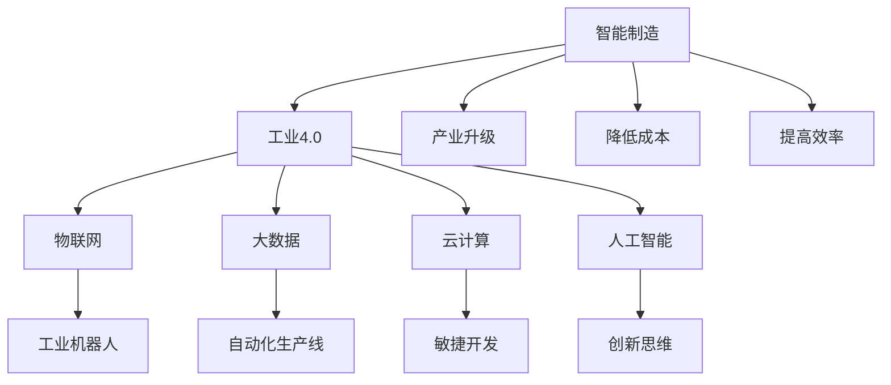

                 

关键词：智能制造、工业4.0、创业公司、转型升级、数字化、自动化、工业物联网、云计算、数据分析、机器学习、人工智能、工业机器人、物联网安全、敏捷开发、创新思维。

> 摘要：本文将探讨创业公司在智能制造与工业4.0时代下的转型升级之路。通过分析当前工业4.0的发展趋势、核心技术、挑战与机遇，提出创业公司应对策略，助力其实现产业升级和可持续发展。

## 1. 背景介绍

### 1.1 智能制造的定义

智能制造是指利用信息技术、传感器技术、控制技术等先进技术，实现制造过程的智能化、自动化和高效化。它不仅涵盖了传统的自动化制造，更强调了信息物理系统的集成和智能制造体系的建立。

### 1.2 工业4.0的概念

工业4.0，即第四次工业革命，是德国在2013年提出的一个概念。它旨在通过物联网、云计算、大数据、人工智能等先进技术的应用，实现制造业的智能化转型，推动工业生产方式的变革。

### 1.3 创业公司面临的挑战

随着工业4.0的普及，创业公司在市场竞争中面临着前所未有的挑战。传统制造模式已经无法满足市场需求，如何进行产业升级、提高生产效率、降低成本成为创业公司亟需解决的问题。

## 2. 核心概念与联系

### 2.1 智能制造与工业4.0的核心概念

**智能制造**：包括工业机器人、自动化生产线、物联网、大数据、云计算、人工智能等。

**工业4.0**：强调的是智能化、网络化、协同化、个性化、敏捷化的生产方式。

### 2.2 关联与影响

智能制造与工业4.0是相辅相成的，智能制造是实现工业4.0的重要基础，而工业4.0则为智能制造提供了广阔的应用场景和新的发展机遇。

### 2.3 Mermaid流程图



## 3. 核心算法原理 & 具体操作步骤

### 3.1 算法原理概述

智能制造与工业4.0的核心在于数据的收集、处理和应用。其中，机器学习算法在数据的分析和预测中起到了关键作用。

### 3.2 算法步骤详解

1. **数据收集**：通过传感器、物联网设备等收集生产过程中的各种数据。
2. **数据预处理**：对收集到的数据进行清洗、归一化、去噪等处理。
3. **特征提取**：从预处理后的数据中提取出对预测任务有意义的特征。
4. **模型训练**：使用机器学习算法对提取出的特征进行训练，建立预测模型。
5. **模型评估**：通过验证集对训练好的模型进行评估，调整模型参数。
6. **模型应用**：将训练好的模型应用到生产过程中，实现智能决策和优化。

### 3.3 算法优缺点

**优点**：高效率、高精度、自适应性强。

**缺点**：对数据质量和特征提取要求高，训练过程复杂。

### 3.4 算法应用领域

1. **生产计划优化**：根据历史数据和实时数据，预测生产需求和产能，优化生产计划。
2. **设备故障预测**：预测设备故障，提前进行维护，降低设备停机率。
3. **产品质量检测**：实时监测产品质量，提高产品合格率。
4. **能源管理**：优化能源使用，降低能源消耗。

## 4. 数学模型和公式 & 详细讲解 & 举例说明

### 4.1 数学模型构建

智能制造中的数学模型主要包括：

1. **线性回归模型**：用于预测生产需求和产能。
2. **支持向量机（SVM）**：用于分类和回归分析。
3. **神经网络**：用于复杂的非线性预测和分析。

### 4.2 公式推导过程

以线性回归模型为例，公式推导如下：

$$ y = wx + b $$

其中，$y$ 是因变量，$x$ 是自变量，$w$ 是权重，$b$ 是偏置。

### 4.3 案例分析与讲解

#### 案例一：生产计划优化

某创业公司通过收集生产数据，使用线性回归模型预测生产需求和产能。假设收集到的数据如下：

| 生产周期 | 需求量 |
| :---: | :---: |
| 1 | 100 |
| 2 | 120 |
| 3 | 110 |
| 4 | 130 |

通过线性回归模型，可以建立以下方程：

$$ y = 1.2x + 80 $$

根据方程，可以预测下一个生产周期的需求量。例如，当生产周期为5时，需求量预测为：

$$ y = 1.2 \times 5 + 80 = 130 $$

## 5. 项目实践：代码实例和详细解释说明

### 5.1 开发环境搭建

1. 安装Python 3.8及以上版本。
2. 安装Jupyter Notebook。
3. 安装必要的库，如NumPy、Pandas、Scikit-learn等。

### 5.2 源代码详细实现

```python
import numpy as np
import pandas as pd
from sklearn.linear_model import LinearRegression
from sklearn.metrics import mean_squared_error

# 读取数据
data = pd.read_csv('production_data.csv')
X = data['production周期的平方'].values.reshape(-1, 1)
y = data['需求量'].values

# 模型训练
model = LinearRegression()
model.fit(X, y)

# 模型评估
y_pred = model.predict(X)
mse = mean_squared_error(y, y_pred)
print('均方误差:', mse)

# 模型应用
new_cycle = np.array([[5]])
new_demand = model.predict(new_cycle)
print('预测需求量:', new_demand)
```

### 5.3 代码解读与分析

1. 导入必要的库。
2. 读取生产数据。
3. 进行数据预处理，将生产周期的平方作为自变量，需求量作为因变量。
4. 使用线性回归模型进行训练。
5. 使用训练好的模型进行预测，并计算均方误差。
6. 将预测结果应用到新的生产周期。

## 6. 实际应用场景

### 6.1 生产计划优化

通过机器学习算法，创业公司可以实现生产计划的优化。例如，根据历史数据和实时数据，预测生产需求和产能，调整生产计划，提高生产效率。

### 6.2 设备故障预测

通过机器学习算法，创业公司可以预测设备故障，提前进行维护，降低设备停机率。

### 6.3 产品质量检测

通过机器学习算法，创业公司可以实时监测产品质量，提高产品合格率。

### 6.4 能源管理

通过机器学习算法，创业公司可以优化能源使用，降低能源消耗。

## 7. 未来应用展望

随着人工智能技术的不断发展，智能制造与工业4.0将在未来得到更广泛的应用。创业公司应抓住这一机遇，积极进行技术创新，实现产业升级和可持续发展。

## 8. 工具和资源推荐

### 8.1 学习资源推荐

1. 《机器学习实战》
2. 《深度学习》
3. 《Python编程：从入门到实践》

### 8.2 开发工具推荐

1. Jupyter Notebook
2. PyCharm
3. Google Colab

### 8.3 相关论文推荐

1. " Industrie 4.0: A Vision for the Future of Manufacturing"
2. "Deep Learning for Industrial Applications"
3. "A Survey on Industrial Internet of Things: Architecture, Enabling Technologies, Security and Privacy, and Applications"

## 9. 总结：未来发展趋势与挑战

### 9.1 研究成果总结

智能制造与工业4.0已经成为制造业发展的趋势。通过人工智能、大数据、物联网等技术的应用，创业公司可以实现生产过程的智能化、自动化和高效化。

### 9.2 未来发展趋势

1. 智能制造技术的普及和深化。
2. 工业互联网的快速发展。
3. 人工智能在工业领域的应用。
4. 绿色制造和可持续发展。

### 9.3 面临的挑战

1. 技术人才短缺。
2. 数据安全与隐私保护。
3. 技术创新与市场应用的不平衡。
4. 政策法规的完善。

### 9.4 研究展望

创业公司应抓住智能制造与工业4.0的发展机遇，积极进行技术创新，推动产业升级。同时，关注数据安全与隐私保护，加强政策法规的研究，为智能制造与工业4.0的可持续发展奠定基础。

## 10. 附录：常见问题与解答

### 10.1 智能制造与工业4.0有什么区别？

智能制造是工业4.0的一个重要组成部分，工业4.0是一个更加全面的产业概念，包括智能制造、物联网、云计算、人工智能等技术的应用。

### 10.2 机器学习在智能制造中有哪些应用？

机器学习在智能制造中的应用非常广泛，包括生产计划优化、设备故障预测、产品质量检测、能源管理等方面。

### 10.3 如何保障智能制造数据的安全与隐私？

保障智能制造数据的安全与隐私需要从技术和管理两个方面进行。技术上，采用加密、身份验证等技术手段；管理上，建立健全的数据安全管理制度和流程。

### 10.4 创业公司如何进行智能制造的转型升级？

创业公司应从以下几个方面进行智能制造的转型升级：

1. 加强技术研发，提高智能制造技术水平。
2. 建立智能制造体系，实现生产过程的智能化。
3. 培养技术人才，提升企业核心竞争力。
4. 与产业链上下游企业合作，实现产业链的协同发展。

---

作者：禅与计算机程序设计艺术 / Zen and the Art of Computer Programming
----------------------------------------------------------------


