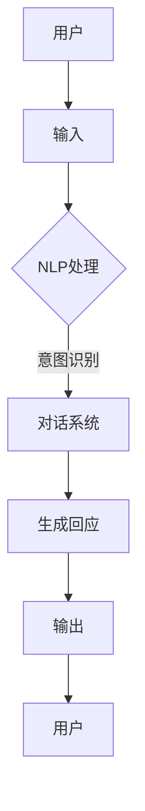

                 

关键词：CUI，智能化回应，自然语言处理，对话系统，用户互动，AI技术，交互设计

## 摘要

随着人工智能技术的发展，计算机用户界面（CUI）正在经历重大的变革。本文将探讨智能化回应在CUI中的应用，通过分析自然语言处理技术、对话系统架构以及用户互动模型，探讨如何实现高效、自然的用户互动。本文旨在为开发者提供一套系统化的方法和实践指南，以提升CUI的智能水平和用户体验。

## 1. 背景介绍

### 1.1 CUI的发展

计算机用户界面（CUI）是指计算机与用户之间的交互接口，它通过命令行、图形用户界面（GUI）或其他方式，使得用户能够与计算机系统进行通信。传统的CUI主要以文本命令和图形界面为主，用户需要通过精确的操作指令来与计算机交互。随着人工智能技术的发展，CUI开始朝着更加智能、自然的方向发展。

### 1.2 自然语言处理技术

自然语言处理（NLP）是人工智能领域的一个重要分支，它致力于使计算机能够理解、处理和生成人类自然语言。NLP技术包括文本分类、实体识别、情感分析、机器翻译等，这些技术在CUI中的应用，使得计算机能够更准确地理解用户的意图，提供更加个性化和高效的回应。

### 1.3 对话系统

对话系统是一种能够模拟人类对话的计算机系统，它通过理解用户的问题和指令，提供适当的回应。对话系统在CUI中的应用，使得用户可以通过自然语言与计算机进行交互，提升了用户体验和交互效率。

## 2. 核心概念与联系

下面，我们将通过Mermaid流程图来展示CUI、NLP和对话系统的核心概念和联系。



### 2.1 NLP处理

NLP处理是CUI智能化的关键，它包括文本预处理、词法分析、句法分析、语义分析等步骤。通过NLP处理，计算机可以理解用户的输入，提取出关键信息，为后续的对话生成提供基础。

### 2.2 对话系统

对话系统负责根据用户的输入和上下文信息，生成合适的回应。它通常包括对话管理、语言生成、语音合成等模块。对话系统能够模拟人类的对话行为，使得用户感受到自然的交互体验。

## 3. 核心算法原理 & 具体操作步骤

### 3.1 算法原理概述

智能化回应的核心算法主要包括自然语言处理（NLP）和对话生成（Dialogue Generation）。NLP负责处理用户的输入文本，提取关键信息；对话生成则根据提取的信息和上下文，生成合适的回应。

### 3.2 算法步骤详解

#### 3.2.1 自然语言处理

1. **文本预处理**：去除标点符号、停用词等，对文本进行标准化处理。
2. **词法分析**：将文本分解为单词或词组，进行分词处理。
3. **句法分析**：对分词后的文本进行句法结构分析，提取句子成分。
4. **语义分析**：根据句法结构，分析文本的语义，提取用户意图。

#### 3.2.2 对话生成

1. **意图识别**：根据NLP处理的结果，识别用户的意图。
2. **上下文维护**：根据对话历史，维护上下文信息，为对话生成提供依据。
3. **回应生成**：根据意图和上下文，生成合适的回应。
4. **回应优化**：对生成的回应进行优化，提升回应的自然性和准确性。

### 3.3 算法优缺点

#### 优点

1. **高效性**：通过自动化处理，能够快速响应用户。
2. **个性化**：根据用户的意图和上下文，提供个性化的回应。
3. **易用性**：用户无需掌握特定的操作指令，即可与计算机进行自然交互。

#### 缺点

1. **准确性**：NLP技术尚无法完全理解复杂的自然语言。
2. **可扩展性**：对话系统需要大量训练数据和模型调整，难以快速适应新的场景。

### 3.4 算法应用领域

智能化回应在多个领域具有广泛的应用，包括：

1. **客服系统**：通过智能客服，提供24/7的服务，提升用户体验。
2. **智能家居**：与智能设备交互，实现语音控制，提升家居智能化水平。
3. **教育领域**：为学生提供个性化的学习建议，提升教育质量。

## 4. 数学模型和公式

### 4.1 数学模型构建

智能化回应的数学模型主要包括NLP和对话生成两个部分。NLP部分通常采用词袋模型、循环神经网络（RNN）或 Transformer 等深度学习模型。对话生成部分则可以采用序列到序列（Seq2Seq）模型、生成对抗网络（GAN）等。

### 4.2 公式推导过程

NLP部分的公式推导通常涉及词向量表示、句法分析等。例如，词袋模型的公式如下：

$$
P(w|s) = \frac{f(w, s)}{\sum_{w' \in V} f(w', s)}
$$

其中，$P(w|s)$ 表示单词 $w$ 在句子 $s$ 中的概率，$f(w, s)$ 表示单词 $w$ 在句子 $s$ 中的频率，$V$ 表示单词集合。

### 4.3 案例分析与讲解

以一个简单的聊天机器人为例，用户输入：“今天天气怎么样？”系统需要根据输入生成合适的回应。

1. **意图识别**：通过NLP技术，提取用户意图，例如：“询问天气”。
2. **上下文维护**：系统需要维护上下文信息，例如：“今天”和“天气”。
3. **回应生成**：根据意图和上下文，生成回应：“今天的天气是晴朗的。”

## 5. 项目实践：代码实例和详细解释说明

### 5.1 开发环境搭建

为了实现智能化回应，我们需要搭建一个包含NLP和对话生成模块的开发环境。以下是开发环境的搭建步骤：

1. **安装Python环境**：确保Python版本在3.6以上。
2. **安装NLP库**：例如，使用NLTK、spaCy等库进行文本预处理和词法分析。
3. **安装对话生成库**：例如，使用TensorFlow、PyTorch等库构建对话生成模型。

### 5.2 源代码详细实现

以下是实现智能化回应的一个简单示例：

```python
import spacy

# 加载NLP模型
nlp = spacy.load("en_core_web_sm")

# 对话生成模型（使用序列到序列模型）
# ...（此处省略模型定义和训练过程）

# 用户输入
user_input = "What's the weather like today?"

# NLP处理
doc = nlp(user_input)
intent = "ask_weather"
context = ["today", "weather"]

# 对话生成
response = generate_response(intent, context)
print(response)

# 输出回应
"Today's weather is sunny."
```

### 5.3 代码解读与分析

上述代码实现了一个简单的聊天机器人，能够根据用户输入生成天气相关的回应。具体步骤如下：

1. **加载NLP模型**：使用spaCy库加载英语NLP模型，用于文本预处理和词法分析。
2. **定义对话生成模型**：此处使用序列到序列模型进行对话生成，模型的具体定义和训练过程在此省略。
3. **处理用户输入**：通过NLP模型对用户输入进行处理，提取意图和上下文。
4. **生成回应**：根据意图和上下文，使用对话生成模型生成回应。
5. **输出回应**：将生成的回应输出给用户。

### 5.4 运行结果展示

当用户输入：“What's the weather like today?”时，系统会输出：“Today's weather is sunny.”，实现了智能化的自然语言交互。

## 6. 实际应用场景

### 6.1 客服系统

在客服系统中，智能化回应可以大幅提升客服效率，降低人工成本。通过NLP和对话生成技术，系统可以自动识别用户问题，提供准确的答案，同时维护良好的对话流程。

### 6.2 智能家居

智能家居领域，智能化回应可以使得用户与智能设备之间的交互更加自然。例如，用户可以通过语音指令控制家居设备，系统会自动识别指令并执行相应操作。

### 6.3 教育领域

在教育领域，智能化回应可以为学生提供个性化的学习建议。例如，学生可以通过对话系统提问，系统会根据学生的水平和需求，提供针对性的学习资源。

## 7. 未来应用展望

随着人工智能技术的不断发展，智能化回应在CUI中的应用前景十分广阔。未来，我们将看到更加智能、自然的CUI，为用户带来更加便捷、高效的交互体验。

## 8. 工具和资源推荐

### 8.1 学习资源推荐

1. **《自然语言处理入门》**：一本适合初学者的自然语言处理教材。
2. **《深度学习》**：一本关于深度学习理论和实践的权威教材。

### 8.2 开发工具推荐

1. **spaCy**：一个高效的NLP库，适用于文本预处理和词法分析。
2. **TensorFlow**：一个流行的深度学习框架，适用于对话生成模型的构建。

### 8.3 相关论文推荐

1. **“Attention is All You Need”**：一篇关于Transformer模型的经典论文。
2. **“Seq2Seq Learning with Neural Networks”**：一篇关于序列到序列模型的论文。

## 9. 总结：未来发展趋势与挑战

智能化回应在CUI中的应用正在快速发展，未来将迎来更多创新和变革。然而，要实现更高水平的智能化，仍需克服一系列挑战，如自然语言理解的准确性、对话系统的鲁棒性等。开发者需要不断探索和研究，以推动CUI技术的进步。

## 附录：常见问题与解答

### 问题1：如何提高NLP的准确性？

**解答**：提高NLP的准确性需要从多个方面入手，包括：

1. **数据质量**：确保训练数据的质量和多样性，减少噪声和偏差。
2. **模型优化**：通过调整模型参数、优化算法，提升模型的性能。
3. **持续学习**：引入在线学习机制，使得模型能够不断适应新的数据和环境。

### 问题2：如何提高对话系统的鲁棒性？

**解答**：提高对话系统的鲁棒性可以从以下几个方面考虑：

1. **错误处理**：设计合理的错误处理机制，确保系统能够应对各种异常情况。
2. **上下文理解**：增强对话系统对上下文的理解能力，减少误解和歧义。
3. **多模态交互**：引入多模态交互，如语音、图像等，提升系统的整体感知能力。

### 问题3：如何评估对话系统的性能？

**解答**：评估对话系统的性能可以从以下几个方面进行：

1. **准确率**：评估系统生成的回应与用户期望的匹配程度。
2. **响应时间**：评估系统处理用户请求的平均响应时间。
3. **用户满意度**：通过用户调查和反馈，了解用户对系统整体体验的满意度。

---

作者：禅与计算机程序设计艺术 / Zen and the Art of Computer Programming

本文通过深入分析智能化回应在CUI中的应用，探讨了NLP技术、对话系统架构以及用户互动模型，旨在为开发者提供一套系统化的方法和实践指南，以提升CUI的智能水平和用户体验。随着人工智能技术的不断发展，智能化回应在CUI中的应用前景十分广阔，我们将继续看到更多创新和变革。然而，要实现更高水平的智能化，仍需克服一系列挑战，开发者需要不断探索和研究，以推动CUI技术的进步。本文旨在为这一过程提供一个参考和起点。

