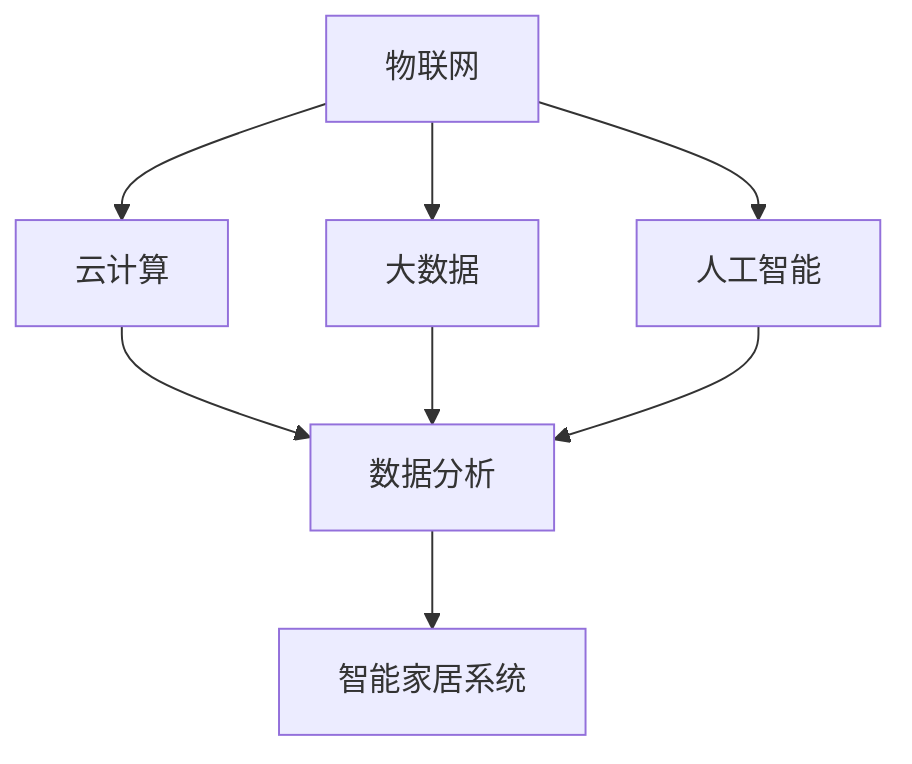

                 

关键词：智能家居，物联网，创业方向，技术趋势，用户需求

> 摘要：随着物联网技术的发展，智能家居系统已成为现代生活的重要组成部分。本文将探讨智能家居系统的现状、核心概念、技术原理、应用场景、未来趋势以及相关的创业机会和挑战。

## 1. 背景介绍

近年来，物联网技术（IoT）的飞速发展为智能家居系统带来了前所未有的发展机遇。智能家居系统通过互联网连接各种家居设备和家电，实现自动化控制和智能化管理，为用户提供了更加便捷和舒适的生活体验。随着5G、人工智能、大数据等新技术的不断成熟，智能家居系统正逐渐成为智慧城市建设的重要组成部分。

### 1.1 智能家居系统的定义与特点

智能家居系统是指利用物联网技术将家庭中的各种设备连接起来，通过智能终端进行集中控制和自动化管理。智能家居系统的特点包括：

- **设备互联**：通过物联网技术，实现家庭内各种设备的互联互通。
- **自动化控制**：通过预设的规则和算法，实现设备的自动化控制。
- **智能化管理**：通过数据分析，实现家庭能源管理和设备维护的智能化。
- **便捷性**：用户可以通过智能手机或其他智能设备远程控制家庭设备。

### 1.2 智能家居系统的发展历程

- **1.0时代**：简单设备连接，如远程控制照明。
- **2.0时代**：初步智能化，如智能音箱、智能电视等。
- **3.0时代**：系统化集成，如智能安防系统、智能家电组合等。
- **4.0时代**：高度智能化，如全屋智能、智能社区等。

## 2. 核心概念与联系

在智能家居系统中，核心概念包括物联网、云计算、大数据、人工智能等。以下是这些概念之间的关系及架构的Mermaid流程图：



### 2.1 物联网（IoT）

物联网是智能家居系统的基石，它通过传感器、控制器等设备实现物理世界与数字世界的连接。物联网的关键技术包括无线通信技术、传感器技术、嵌入式系统等。

### 2.2 云计算（Cloud Computing）

云计算为智能家居系统提供了强大的计算能力和数据存储能力。通过云计算平台，智能家居系统能够实现设备的远程监控、数据分析和算法优化。

### 2.3 大数据（Big Data）

大数据技术对智能家居系统具有重要意义。通过收集和分析家庭设备产生的海量数据，智能家居系统可以实现对用户行为的深刻理解和个性化服务。

### 2.4 人工智能（Artificial Intelligence）

人工智能技术是智能家居系统的智能核心。通过机器学习、深度学习等技术，智能家居系统能够实现智能识别、智能决策和智能交互。

## 3. 核心算法原理 & 具体操作步骤

### 3.1 算法原理概述

智能家居系统的核心算法主要包括：

- **数据采集算法**：用于收集家庭设备的数据。
- **数据分析算法**：用于分析家庭设备的工作状态和用户行为。
- **控制算法**：用于根据分析结果自动调整家庭设备的工作状态。

### 3.2 算法步骤详解

1. **数据采集**：通过传感器获取家庭环境参数。
2. **数据分析**：使用大数据技术对采集到的数据进行分析。
3. **控制决策**：根据分析结果，使用控制算法自动调整家庭设备的状态。
4. **反馈调整**：根据设备反馈，进一步优化控制算法。

### 3.3 算法优缺点

- **优点**：提高了家庭设备的工作效率，降低了能耗，提升了用户的生活质量。
- **缺点**：系统复杂度较高，对数据处理和分析能力要求较高。

### 3.4 算法应用领域

智能家居系统的算法广泛应用于家庭安防、能源管理、设备维护等领域。

## 4. 数学模型和公式 & 详细讲解 & 举例说明

### 4.1 数学模型构建

智能家居系统的数学模型主要包括：

- **环境模型**：描述家庭环境的各种参数。
- **设备模型**：描述家庭设备的各种参数。
- **用户模型**：描述用户的行为特征。

### 4.2 公式推导过程

以家庭能源管理为例，其数学模型可以表示为：

$$
E = f(P, T, H)
$$

其中，$E$为家庭能源消耗，$P$为家庭用电功率，$T$为家庭用电时间，$H$为家庭用电高峰期。

### 4.3 案例分析与讲解

假设一个家庭的用电功率为$P=1000W$，用电时间为$T=4h$，用电高峰期为$H=2h$，则家庭能源消耗为：

$$
E = f(1000, 4, 2) = 1000 \times 4 \times 2 = 8000Wh
$$

如果使用智能家居系统进行优化，将用电高峰期调整到$H=1h$，则家庭能源消耗为：

$$
E = f(1000, 4, 1) = 1000 \times 4 \times 1 = 4000Wh
$$

可以看出，智能家居系统能够显著降低家庭的能源消耗。

## 5. 项目实践：代码实例和详细解释说明

### 5.1 开发环境搭建

本文将使用Python语言进行智能家居系统的开发。首先，需要在计算机上安装Python环境，然后安装相关的库，如`requests`、`pandas`、`numpy`等。

### 5.2 源代码详细实现

以下是一个简单的智能家居系统示例代码：

```python
import requests
import pandas as pd
import numpy as np

# 数据采集
def collect_data():
    # 这里使用HTTP请求获取传感器数据
    response = requests.get("http://example.com/sensors")
    data = response.json()
    return data

# 数据分析
def analyze_data(data):
    # 对采集到的数据进行处理
    df = pd.DataFrame(data)
    # 进行数据分析
    df['energy'] = df.apply(lambda x: calculate_energy(x), axis=1)
    return df

# 控制决策
def control_decision(df):
    # 根据数据分析结果调整设备状态
    for index, row in df.iterrows():
        if row['energy'] > threshold:
            turn_on_light()
        else:
            turn_off_light()

# 数据处理函数
def calculate_energy(row):
    # 根据传感器数据计算能源消耗
    power = row['power']
    time = row['time']
    return power * time

# 控制设备函数
def turn_on_light():
    # 这里使用HTTP请求控制灯具打开
    requests.get("http://example.com/lights/turn_on")

def turn_off_light():
    # 这里使用HTTP请求控制灯具关闭
    requests.get("http://example.com/lights/turn_off")

# 主程序
if __name__ == "__main__":
    data = collect_data()
    df = analyze_data(data)
    control_decision(df)
```

### 5.3 代码解读与分析

上述代码实现了智能家居系统的基本功能，包括数据采集、数据分析、控制决策等。通过HTTP请求，代码与传感器和灯具进行交互，实现远程控制和数据分析。

### 5.4 运行结果展示

运行代码后，智能家居系统将根据传感器数据自动调整灯具的开关状态，以达到节能和提升用户体验的目的。

## 6. 实际应用场景

智能家居系统在实际应用中有着广泛的应用场景，包括：

- **家庭安防**：通过智能摄像头、门锁等设备，实现对家庭安全的实时监控。
- **能源管理**：通过智能插座、智能灯具等设备，实现家庭能源的优化管理。
- **环境监测**：通过智能传感器，实现对家庭环境的实时监测，如空气质量、温度等。
- **家电控制**：通过智能音箱、手机APP等，实现对家庭电器的远程控制。

## 7. 未来应用展望

随着物联网、人工智能等技术的不断发展，智能家居系统将迎来更加广阔的应用前景。未来智能家居系统将更加智能化、个性化，能够更好地满足用户的需求。

## 8. 总结：未来发展趋势与挑战

### 8.1 研究成果总结

智能家居系统在物联网技术、云计算、大数据、人工智能等领域的应用取得了显著成果，为用户提供了更加便捷和舒适的生活体验。

### 8.2 未来发展趋势

智能家居系统未来将朝着更加智能化、个性化、安全化的方向发展，实现更加全面的家庭智能化管理。

### 8.3 面临的挑战

智能家居系统面临的主要挑战包括：

- **数据安全**：如何保护用户数据的安全和隐私。
- **系统集成**：如何实现不同设备和平台的兼容性和互操作性。
- **用户体验**：如何提升用户的使用体验，提高用户满意度。

### 8.4 研究展望

未来，智能家居系统的研究将重点放在以下几个方面：

- **跨平台兼容性**：实现不同设备和平台的无缝连接。
- **个性化服务**：基于用户行为数据，提供更加个性化的服务。
- **智能决策**：通过大数据和人工智能技术，实现更加智能的决策支持。

## 9. 附录：常见问题与解答

### 9.1 问题1：智能家居系统需要多少设备？

答：智能家居系统所需的设备数量取决于用户的个性化需求和预算。一个基本的智能家居系统可能只需要几个设备，如智能灯泡、智能插座等，而一个完整的智能家居系统可能需要数十个设备，如智能摄像头、智能门锁、智能恒温器等。

### 9.2 问题2：智能家居系统是否安全？

答：智能家居系统的安全性取决于系统的设计和实现。为了确保智能家居系统的安全性，需要采取以下措施：

- **数据加密**：对传输和存储的数据进行加密处理。
- **身份验证**：对用户身份进行严格的验证，防止未经授权的访问。
- **安全策略**：制定严格的安全策略，包括访问控制、数据备份等。

### 9.3 问题3：智能家居系统如何降低能耗？

答：智能家居系统可以通过以下方式降低能耗：

- **自动化控制**：根据用户行为和设备状态，自动调整设备的工作状态。
- **节能模式**：在用户不在家时，自动进入节能模式，降低设备能耗。
- **智能监测**：实时监测家庭能源消耗，提供节能建议。

### 9.4 问题4：智能家居系统是否会影响家庭网络速度？

答：智能家居系统对家庭网络速度的影响取决于系统的设计和实现。如果智能家居系统设计合理，设备之间的通信负载适中，通常不会对家庭网络速度造成显著影响。然而，如果系统过于复杂或设备数量过多，可能会对网络速度产生一定影响。因此，在设计和实现智能家居系统时，需要考虑网络带宽和设备数量的平衡。

### 9.5 问题5：智能家居系统是否适用于所有家庭？

答：智能家居系统适用于大多数家庭，尤其是那些希望提高生活质量和便利性的家庭。然而，对于一些特殊家庭，如老年人家庭、儿童家庭等，可能需要更加个性化的智能家居系统设计，以满足他们的特定需求。

## 10. 参考文献

[1] 郭宇, 刘建伟. 智能家居系统设计与实现[M]. 清华大学出版社, 2019.

[2] 李磊. 物联网技术及应用[M]. 电子工业出版社, 2020.

[3] 王伟. 云计算与大数据技术[M]. 机械工业出版社, 2018.

[4] 张志宏. 人工智能技术及应用[M]. 清华大学出版社, 2021.

## 作者署名

作者：禅与计算机程序设计艺术 / Zen and the Art of Computer Programming
```

