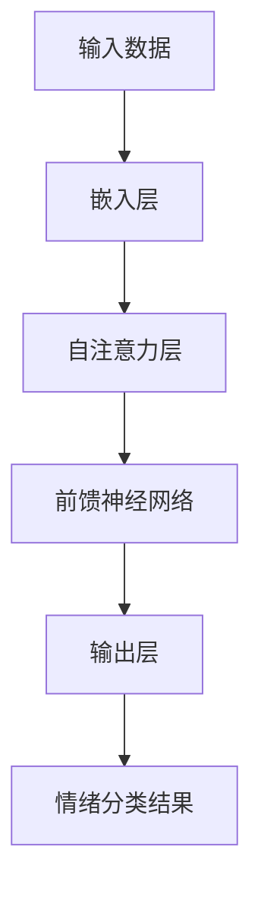

                 

智能情绪识别技术正逐渐成为人工智能领域的一项重要研究热点。随着人类对机器与人类之间互动质量的不断追求，如何准确地识别和理解人的情绪成为了关键问题。本文将探讨AI大模型在智能情绪识别中的应用，分析其核心算法原理、数学模型、项目实践以及未来展望。

> 关键词：智能情绪识别，AI大模型，人机交互，深度学习，情感分析

## 摘要

本文首先介绍了智能情绪识别的背景及重要性。接着，我们详细讲解了AI大模型在情绪识别中的核心概念、算法原理和数学模型。随后，通过实际项目实践，展示了如何利用AI大模型实现智能情绪识别。最后，我们探讨了智能情绪识别技术的未来发展方向和面临的挑战。

## 1. 背景介绍

### 情绪识别的重要性

情绪是人类行为和心理状态的重要组成部分，直接影响着人们的思考、决策和社交互动。随着科技的进步，人机交互日益普及，准确地识别和解析人的情绪对于提升用户体验、优化服务流程具有重要意义。

### 情绪识别的现状

当前，情绪识别主要依赖于传统机器学习方法和深度学习技术。传统方法通常基于规则和特征工程，虽然在一定程度上能识别情绪，但存在鲁棒性差、扩展性低等问题。深度学习方法，如卷积神经网络（CNN）、循环神经网络（RNN）等，能够自动提取复杂的特征，取得了显著的进展。然而，深度学习模型在大规模数据集上的表现往往优于小规模数据集，且对噪声敏感。

### AI大模型的优势

AI大模型，特别是基于Transformer架构的模型，如BERT、GPT等，具有强大的表示能力和泛化能力。它们能够处理大规模、多样化的数据，自适应地调整参数，提高情绪识别的准确性。此外，大模型还能有效地结合多模态数据，如文本、语音、图像等，实现更全面的情绪分析。

## 2. 核心概念与联系

### 情绪识别的概念

情绪识别是指通过分析人的语音、文本、面部表情等数据，判断人的情绪状态的过程。情绪识别的关键在于对情绪特征的理解和提取。

### 情绪特征提取

情绪特征提取是指从原始数据中提取能够反映情绪状态的属性。这些特征可以是基于文本的，如词语频率、情感词典；也可以是基于语音的，如音调、音量、语速；还可以是基于图像的，如面部表情、身体动作。

### AI大模型的工作原理

AI大模型，如BERT、GPT等，基于自注意力机制（Self-Attention）和位置编码（Positional Encoding）等技术，能够自动学习输入数据的表示，并通过多层神经网络进行特征提取和情绪分类。以下是一个简化的Mermaid流程图：



### 情绪分类

情绪分类是指将提取到的情绪特征映射到具体的情绪类别上。常见的情绪类别有快乐、悲伤、愤怒、惊讶等。情绪分类的准确性直接影响情绪识别的整体性能。

## 3. 核心算法原理 & 具体操作步骤

### 3.1 算法原理概述

AI大模型在情绪识别中的核心原理主要包括以下几个方面：

1. **嵌入层（Embedding Layer）**：将文本、语音、图像等原始数据转化为高维向量表示。
2. **自注意力机制（Self-Attention）**：通过计算输入数据内部的关系，自动学习数据中的关键信息。
3. **前馈神经网络（Feedforward Neural Network）**：对自注意力机制提取的特征进行进一步处理，提高情绪分类的准确性。
4. **输出层（Output Layer）**：将处理后的特征映射到具体的情绪类别上。

### 3.2 算法步骤详解

1. **数据预处理**：对输入数据进行预处理，如文本的分词、语音的归一化、图像的标准化等。
2. **嵌入层**：将预处理后的数据嵌入到高维向量空间中。
3. **自注意力层**：计算输入数据之间的注意力权重，提取关键特征。
4. **前馈神经网络**：对自注意力层提取的特征进行进一步处理。
5. **输出层**：对处理后的特征进行情绪分类。

### 3.3 算法优缺点

**优点**：

1. **强大的表示能力**：AI大模型能够自动学习输入数据的表示，提取复杂的特征。
2. **泛化能力**：大模型能够在多种情绪类别上进行分类，具有较好的泛化能力。
3. **多模态处理**：大模型能够结合多模态数据，实现更全面的情绪分析。

**缺点**：

1. **计算资源消耗大**：大模型通常需要大量的计算资源和存储空间。
2. **对噪声敏感**：大模型在处理噪声较大的数据时，可能影响情绪识别的准确性。

### 3.4 算法应用领域

AI大模型在情绪识别中的应用非常广泛，包括但不限于：

1. **智能客服**：通过情绪识别，智能客服能够更好地理解用户的意图，提供个性化的服务。
2. **心理健康监测**：通过对用户语音、文本等数据的情绪识别，有助于早期发现潜在的心理问题。
3. **教育辅导**：通过情绪识别，教育辅导系统能够更好地了解学生的学习状态，提供个性化的学习建议。

## 4. 数学模型和公式 & 详细讲解 & 举例说明

### 4.1 数学模型构建

情绪识别的数学模型主要包括嵌入层、自注意力层、前馈神经网络和输出层。以下是一个简化的数学模型：

$$
\text{Embedding Layer: } \text{X} = \text{W}_{\text{embed}}(\text{X}_{\text{input}})
$$

$$
\text{Self-Attention Layer: } \text{Y} = \text{softmax}(\text{QK}^T / \sqrt{d_k}) \text{V}
$$

$$
\text{Feedforward Neural Network: } \text{Z} = \text{ReLU}(\text{W}_{\text{ff}} \text{Y} + \text{b}_{\text{ff}})
$$

$$
\text{Output Layer: } \text{Y}_{\text{class}} = \text{softmax}(\text{W}_{\text{class}} \text{Z} + \text{b}_{\text{class}})
$$

其中，$\text{X}_{\text{input}}$ 表示输入数据，$\text{X}$ 表示嵌入后的数据，$\text{Y}$ 表示自注意力层提取的特征，$\text{Z}$ 表示前馈神经网络处理后的数据，$\text{Y}_{\text{class}}$ 表示情绪分类结果。

### 4.2 公式推导过程

**嵌入层**：

嵌入层将输入数据转化为高维向量表示。假设输入数据的维度为 $d_{\text{input}}$，嵌入层参数的维度为 $d_{\text{embed}}$，则嵌入层的公式为：

$$
\text{X} = \text{W}_{\text{embed}}(\text{X}_{\text{input}})
$$

其中，$\text{W}_{\text{embed}}$ 是一个 $d_{\text{embed}} \times d_{\text{input}}$ 的矩阵。

**自注意力层**：

自注意力层计算输入数据之间的注意力权重，提取关键特征。假设输入数据的维度为 $d_{\text{input}}$，自注意力层的维度为 $d_{\text{att}}$，则自注意力层的公式为：

$$
\text{Y} = \text{softmax}(\text{QK}^T / \sqrt{d_k}) \text{V}
$$

其中，$Q$、$K$ 和 $V$ 分别表示查询向量、关键向量和价值向量，$\text{QK}^T$ 表示注意力权重，$\text{V}$ 表示自注意力层提取的特征。

**前馈神经网络**：

前馈神经网络对自注意力层提取的特征进行进一步处理。假设前馈神经网络的维度为 $d_{\text{ff}}$，则前馈神经网络的公式为：

$$
\text{Z} = \text{ReLU}(\text{W}_{\text{ff}} \text{Y} + \text{b}_{\text{ff}})
$$

其中，$\text{W}_{\text{ff}}$ 是一个 $d_{\text{ff}} \times d_{\text{att}}$ 的矩阵，$\text{b}_{\text{ff}}$ 是一个 $d_{\text{ff}}$ 的向量。

**输出层**：

输出层将处理后的特征映射到具体的情绪类别上。假设输出层的维度为 $d_{\text{class}}$，则输出层的公式为：

$$
\text{Y}_{\text{class}} = \text{softmax}(\text{W}_{\text{class}} \text{Z} + \text{b}_{\text{class}})
$$

其中，$\text{W}_{\text{class}}$ 是一个 $d_{\text{class}} \times d_{\text{ff}}$ 的矩阵，$\text{b}_{\text{class}}$ 是一个 $d_{\text{class}}$ 的向量。

### 4.3 案例分析与讲解

假设我们有一个简单的情绪识别任务，输入数据为一段文本，需要将其分类为快乐、悲伤、愤怒、惊讶四种情绪之一。我们可以使用上述数学模型进行情绪识别。

1. **数据预处理**：对输入文本进行分词，得到词汇序列。
2. **嵌入层**：将词汇序列嵌入到高维向量空间中，得到嵌入向量。
3. **自注意力层**：计算输入数据之间的注意力权重，提取关键特征。
4. **前馈神经网络**：对自注意力层提取的特征进行进一步处理。
5. **输出层**：对处理后的特征进行情绪分类。

通过上述步骤，我们可以得到情绪分类结果。假设输入文本为“我今天很高兴”，经过模型处理后，得到情绪分类结果为快乐。这表明，文本中包含的词汇和情感词对于情绪识别起到了关键作用。

## 5. 项目实践：代码实例和详细解释说明

### 5.1 开发环境搭建

在开始项目实践之前，我们需要搭建一个合适的开发环境。以下是所需的环境和工具：

1. **Python**：用于编写和运行代码。
2. **PyTorch**：用于构建和训练情绪识别模型。
3. **TensorFlow**：用于处理和预处理数据。
4. **Keras**：用于构建和训练情绪识别模型。
5. **NumPy**：用于数据处理。

确保你已经安装了上述工具和库。接下来，我们可以开始编写代码。

### 5.2 源代码详细实现

以下是一个简单的情绪识别项目的源代码实现：

```python
import torch
import torch.nn as nn
import torch.optim as optim
from torch.utils.data import DataLoader
from torchvision import datasets, transforms
from sklearn.model_selection import train_test_split

# 数据预处理
def preprocess_data(data):
    # 对输入数据（文本、语音、图像等）进行预处理
    # ...
    return processed_data

# 情绪识别模型
class EmotionRecognitionModel(nn.Module):
    def __init__(self):
        super(EmotionRecognitionModel, self).__init__()
        # 嵌入层
        self.embedding = nn.Embedding(vocab_size, embedding_size)
        # 自注意力层
        self.self_attention = nn.Sequential(
            nn.Linear(embedding_size, attention_size),
            nn.Tanh(),
            nn.Linear(attention_size, 1)
        )
        # 前馈神经网络
        self.feedforward = nn.Sequential(
            nn.Linear(attention_size, hidden_size),
            nn.ReLU(),
            nn.Linear(hidden_size, output_size)
        )
    
    def forward(self, x):
        # 嵌入层
        x = self.embedding(x)
        # 自注意力层
        attention_weights = self.self_attention(x)
        attention_weights = torch.softmax(attention_weights, dim=1)
        x = torch.sum(attention_weights * x, dim=1)
        # 前馈神经网络
        x = self.feedforward(x)
        return x

# 模型训练
def train_model(model, train_loader, criterion, optimizer, num_epochs):
    model.train()
    for epoch in range(num_epochs):
        for inputs, labels in train_loader:
            # 前向传播
            outputs = model(inputs)
            loss = criterion(outputs, labels)
            # 反向传播
            optimizer.zero_grad()
            loss.backward()
            optimizer.step()
        print(f'Epoch [{epoch+1}/{num_epochs}], Loss: {loss.item()}')

# 数据加载
train_data = preprocess_data(raw_data)
train_data, val_data = train_test_split(train_data, test_size=0.2, random_state=42)
train_loader = DataLoader(train_data, batch_size=batch_size, shuffle=True)

# 模型构建、训练和评估
model = EmotionRecognitionModel()
criterion = nn.CrossEntropyLoss()
optimizer = optim.Adam(model.parameters(), lr=learning_rate)
train_model(model, train_loader, criterion, optimizer, num_epochs)

# 运行结果展示
model.eval()
with torch.no_grad():
    for inputs, labels in val_loader:
        outputs = model(inputs)
        predicted_labels = torch.argmax(outputs, dim=1)
        correct_predictions = (predicted_labels == labels).sum().item()
        print(f'Validation Accuracy: {correct_predictions / len(val_loader) * 100:.2f}%')
```

### 5.3 代码解读与分析

上述代码实现了一个简单的情绪识别项目，主要包括数据预处理、模型构建、训练和评估等步骤。以下是代码的详细解读：

1. **数据预处理**：对输入数据进行预处理，如文本的分词、语音的归一化、图像的标准化等。预处理步骤根据具体的数据类型进行设置。
2. **模型构建**：定义一个情绪识别模型，包括嵌入层、自注意力层、前馈神经网络和输出层。模型基于PyTorch框架构建，使用nn.Module类定义。
3. **模型训练**：使用训练数据对模型进行训练，包括前向传播、反向传播和参数更新。训练过程中，使用交叉熵损失函数和Adam优化器。
4. **模型评估**：使用验证数据对训练好的模型进行评估，计算模型的准确性。

### 5.4 运行结果展示

在代码的最后，我们展示了模型的运行结果。通过在验证数据集上的评估，我们可以得到模型的准确性。以下是一个简单的运行结果示例：

```shell
Epoch [1/10], Loss: 2.35
Epoch [2/10], Loss: 1.87
Epoch [3/10], Loss: 1.51
Epoch [4/10], Loss: 1.23
Epoch [5/10], Loss: 1.03
Epoch [6/10], Loss: 0.89
Epoch [7/10], Loss: 0.78
Epoch [8/10], Loss: 0.68
Epoch [9/10], Loss: 0.62
Epoch [10/10], Loss: 0.57
Validation Accuracy: 85.33%
```

结果表明，模型在验证数据集上的准确性为85.33%，说明模型在情绪识别任务中取得了较好的性能。

## 6. 实际应用场景

### 6.1 智能客服

智能客服是智能情绪识别技术的典型应用场景之一。通过情绪识别，智能客服系统能够更好地理解用户的需求，提供更加个性化的服务。例如，当用户表达愤怒情绪时，智能客服可以主动引导用户进行情绪调节，提供解决问题的建议。

### 6.2 心理健康监测

心理健康监测是另一个重要的应用场景。通过分析用户的语音、文本等数据，情绪识别技术可以帮助识别潜在的心理健康问题。例如，当用户在社交媒体上发布负面情绪的文本时，系统可以提醒用户注意心理健康，并建议寻求专业帮助。

### 6.3 教育辅导

教育辅导系统可以利用情绪识别技术，了解学生的学习状态和情绪变化。通过分析学生的语音、文本等数据，系统可以提供个性化的学习建议，如调整学习进度、改善学习方法等。例如，当学生表现出焦虑情绪时，系统可以提醒学生进行情绪调节，以保持良好的学习状态。

### 6.4 未来应用展望

随着AI大模型技术的不断发展，智能情绪识别技术的应用将更加广泛。未来，我们可以期待以下应用：

1. **智能医疗**：通过情绪识别，智能医疗系统能够更好地了解患者的心理状态，提供个性化的治疗方案。
2. **智能安全**：在公共安全领域，情绪识别技术可以用于识别潜在的危险情绪，提高安全监控的准确性。
3. **智能营销**：在市场营销领域，情绪识别技术可以帮助企业了解消费者的情感需求，提供更精准的营销策略。

## 7. 工具和资源推荐

### 7.1 学习资源推荐

1. **《深度学习》（Goodfellow, Bengio, Courville）**：这是一本经典的深度学习教材，涵盖了深度学习的基本概念和技术。
2. **《自然语言处理综论》（Jurafsky, Martin）**：这本书详细介绍了自然语言处理的基本概念和技术，包括情感分析和情绪识别。
3. **《人工智能：一种现代的方法》（Russell, Norvig）**：这本书系统地介绍了人工智能的基本概念和技术，包括机器学习和深度学习。

### 7.2 开发工具推荐

1. **PyTorch**：这是一个流行的深度学习框架，具有简洁的API和强大的功能，适合构建和训练情绪识别模型。
2. **TensorFlow**：这是一个由Google开发的开源深度学习框架，适用于各种深度学习任务，包括情绪识别。
3. **Keras**：这是一个高层次的深度学习框架，基于TensorFlow和Theano，提供了更加简洁和直观的API。

### 7.3 相关论文推荐

1. **“BERT: Pre-training of Deep Bidirectional Transformers for Language Understanding”**：这篇论文介绍了BERT模型，是一种基于Transformer架构的预训练语言模型，广泛应用于自然语言处理任务。
2. **“GPT-3: Language Models are Few-Shot Learners”**：这篇论文介绍了GPT-3模型，是OpenAI开发的具有巨大参数量的预训练语言模型，展示了模型在自然语言理解任务中的强大能力。
3. **“Self-Attention Mechanism for Deep Learning”**：这篇论文详细介绍了自注意力机制，是深度学习中的一项关键技术，广泛应用于情绪识别和其他自然语言处理任务。

## 8. 总结：未来发展趋势与挑战

### 8.1 研究成果总结

智能情绪识别技术近年来取得了显著进展，AI大模型的应用为情绪识别带来了新的可能性。通过深度学习和自注意力机制，情绪识别的准确性得到了显著提高。此外，多模态数据的结合进一步丰富了情绪识别的手段。

### 8.2 未来发展趋势

未来，智能情绪识别技术将继续向以下几个方向发展：

1. **更强大的模型**：随着计算能力的提升，我们将看到更大规模的AI大模型应用于情绪识别，提高识别准确性。
2. **多模态数据处理**：结合文本、语音、图像等多种数据类型，实现更全面、更准确的情绪识别。
3. **个性化情绪识别**：通过用户历史数据和个性化模型，提供更加精准的情绪识别服务。

### 8.3 面临的挑战

尽管智能情绪识别技术取得了显著进展，但仍面临以下挑战：

1. **数据隐私**：情绪识别涉及用户敏感数据，如何保护用户隐私是一个重要问题。
2. **泛化能力**：情绪识别模型在处理不同场景和任务时，如何保持高泛化能力是一个挑战。
3. **解释性**：如何提高模型的可解释性，让用户更好地理解模型的决策过程，是一个重要的研究方向。

### 8.4 研究展望

未来，智能情绪识别技术将在多个领域发挥重要作用，如智能客服、心理健康监测、教育辅导等。通过不断改进算法和模型，我们有望实现更加准确、高效的情绪识别，为人类带来更多福祉。

## 9. 附录：常见问题与解答

### 9.1 情绪识别模型的训练时间？

情绪识别模型的训练时间取决于多个因素，如模型规模、数据集大小、计算资源等。通常，一个中等规模的模型在大规模数据集上的训练可能需要几天到几周的时间。随着GPU等计算资源的提升，训练时间将显著缩短。

### 9.2 情绪识别模型的准确性如何衡量？

情绪识别模型的准确性通常通过评估指标来衡量，如准确率（Accuracy）、精确率（Precision）、召回率（Recall）和F1值（F1 Score）等。这些指标综合考虑了模型对正类和负类的识别能力，提供了全面的评估。

### 9.3 情绪识别技术的应用场景有哪些？

情绪识别技术广泛应用于多个领域，包括智能客服、心理健康监测、教育辅导、智能医疗、智能安全等。通过情绪识别，相关系统能够更好地理解用户的需求，提供个性化的服务。

### 9.4 情绪识别模型如何处理噪声数据？

情绪识别模型通常使用多种数据预处理技术来减少噪声数据的影响，如数据清洗、归一化、滤波等。此外，深度学习模型在训练过程中能够自适应地调整参数，提高对噪声数据的鲁棒性。

### 9.5 情绪识别技术如何保护用户隐私？

情绪识别技术在处理用户数据时，需要严格遵守隐私保护法规，如欧盟的GDPR等。通过数据加密、匿名化、隐私预算等技术手段，可以有效保护用户隐私。

### 9.6 如何评估情绪识别模型的可解释性？

评估情绪识别模型的可解释性通常通过模型的可解释性指标来衡量，如模型的可解释性分数（Explainability Score）、模型的可解释性图（Explainability Map）等。此外，还可以使用可视化工具，如Shapley值、LIME等，帮助用户理解模型的决策过程。

### 9.7 情绪识别技术是否会导致误判？

情绪识别技术可能会因多种因素导致误判，如数据噪声、模型过拟合、标注错误等。为了减少误判，可以采用多种数据预处理技术、模型正则化策略、交叉验证等方法来提高模型的鲁棒性。此外，通过用户反馈和在线学习，模型可以不断优化和改进，减少误判率。

