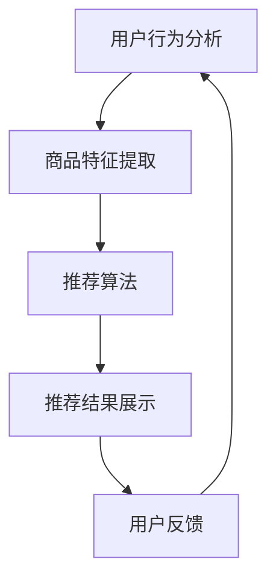

                 

关键词：智能推荐系统、AI、电商、个性化推荐、算法、数学模型、实践、应用场景、工具推荐、未来发展趋势

> 摘要：本文将深入探讨智能推荐系统的核心概念、算法原理、数学模型及其在电商领域的实际应用。通过详细的案例分析，我们将揭示如何利用人工智能技术实现电商平台的个性化推荐，助力企业提升用户满意度和销售业绩。文章还将展望未来发展趋势，探讨面临的挑战及研究展望。

## 1. 背景介绍

随着互联网技术的迅猛发展，电子商务已成为全球商业体系的重要组成部分。电商平台通过提供海量商品，满足消费者多样化的购物需求。然而，在信息爆炸的时代，消费者面对的选择过多，如何精准推荐商品成为电商企业关注的焦点。

智能推荐系统应运而生，通过分析用户行为、购物喜好和商品特征，为用户推荐最感兴趣的商品。AI 技术的应用，使得推荐系统更加智能和个性化，从而提高用户满意度和购买转化率。本文将重点探讨智能推荐系统在电商领域的应用，分析其核心概念、算法原理和数学模型，并通过具体案例展示其实际效果。

## 2. 核心概念与联系

### 2.1. 智能推荐系统概述

智能推荐系统是指利用人工智能技术，根据用户的行为、喜好和需求，自动为用户推荐相关商品、内容或服务。其核心目标是提高用户满意度和购买转化率，同时降低营销成本。

### 2.2. 人工智能与推荐系统

人工智能（AI）是智能推荐系统的基石。通过深度学习、自然语言处理、数据挖掘等技术，AI 能够从海量数据中提取有价值的信息，实现个性化推荐。

### 2.3. 推荐算法

推荐算法是智能推荐系统的核心组成部分。常见的推荐算法包括基于内容的推荐、协同过滤推荐和混合推荐等。每种算法都有其优缺点和适用场景。

### 2.4. 数学模型

数学模型用于描述推荐系统的核心原理，如相似度计算、评分预测等。常见的数学模型包括用户-商品矩阵分解、马尔可夫链、贝叶斯网络等。

### 2.5. Mermaid 流程图



## 3. 核心算法原理 & 具体操作步骤

### 3.1. 算法原理概述

智能推荐系统主要基于以下原理：

1. **用户行为分析**：通过分析用户的浏览、搜索、购买等行为，了解用户喜好和需求。
2. **商品特征提取**：提取商品的属性信息，如价格、品牌、分类等。
3. **相似度计算**：计算用户与商品、商品与商品之间的相似度，为推荐提供依据。
4. **评分预测**：利用机器学习算法预测用户对商品的评分，实现个性化推荐。

### 3.2. 算法步骤详解

1. **数据收集与预处理**：收集用户行为数据和商品特征数据，并进行数据清洗和预处理。
2. **用户行为分析**：分析用户历史行为，提取用户兴趣标签。
3. **商品特征提取**：提取商品属性信息，并进行向量化处理。
4. **相似度计算**：计算用户与商品、商品与商品之间的相似度，可以使用余弦相似度、欧氏距离等方法。
5. **评分预测**：利用机器学习算法，如协同过滤、矩阵分解等，预测用户对商品的评分。
6. **推荐结果生成**：根据评分预测结果，为用户生成个性化推荐列表。

### 3.3. 算法优缺点

1. **协同过滤推荐**：优点是推荐准确度高，适用于大规模用户和商品数据。缺点是冷启动问题严重，对新用户和新商品效果不佳。
2. **基于内容的推荐**：优点是能够充分利用商品特征信息，推荐结果更符合用户需求。缺点是用户兴趣变化难以捕捉，推荐结果可能过于单一。
3. **混合推荐**：优点是结合了协同过滤和基于内容的推荐，能够提高推荐效果。缺点是算法复杂度较高，计算成本大。

### 3.4. 算法应用领域

智能推荐系统广泛应用于电商、视频、音乐、新闻等领域，为用户带来个性化体验。在电商领域，智能推荐系统可以帮助企业提高用户满意度、增加销售量、降低营销成本。

## 4. 数学模型和公式

### 4.1. 数学模型构建

智能推荐系统的数学模型主要包括用户-商品矩阵分解、相似度计算和评分预测。

### 4.2. 公式推导过程

1. **用户-商品矩阵分解**：

   假设用户-商品矩阵为 $R \in \mathbb{R}^{m \times n}$，其中 $m$ 表示用户数量，$n$ 表示商品数量。通过矩阵分解，可以将 $R$ 分解为用户特征矩阵 $U \in \mathbb{R}^{m \times k}$ 和商品特征矩阵 $V \in \mathbb{R}^{n \times k}$，其中 $k$ 为特征维度。

   $$R = UV^T$$

2. **相似度计算**：

   假设用户 $i$ 和用户 $j$ 的特征向量分别为 $u_i$ 和 $u_j$，商品 $i$ 和商品 $j$ 的特征向量分别为 $v_i$ 和 $v_j$。可以使用余弦相似度计算用户和用户、商品和商品之间的相似度。

   $$\cos(u_i, u_j) = \frac{u_i \cdot u_j}{\|u_i\| \|u_j\|}$$

   $$\cos(v_i, v_j) = \frac{v_i \cdot v_j}{\|v_i\| \|v_j\|}$$

3. **评分预测**：

   假设用户 $i$ 对商品 $j$ 的真实评分为 $r_{ij}$，预测评分为 $\hat{r}_{ij}$。可以使用矩阵分解模型预测评分：

   $$\hat{r}_{ij} = u_i \cdot v_j$$

### 4.3. 案例分析与讲解

假设我们有以下用户-商品矩阵：

$$R = \begin{bmatrix} 1 & 0 & 1 & ? \\ 0 & 1 & ? & 1 \\ 1 & ? & 0 & 0 \end{bmatrix}$$

通过矩阵分解，我们得到用户特征矩阵 $U$ 和商品特征矩阵 $V$：

$$U = \begin{bmatrix} 0.6 & -0.5 \\ 0.7 & 0.4 \\ -0.3 & 0.8 \end{bmatrix}, V = \begin{bmatrix} 0.5 & 0.3 & 0.2 & 0.1 \\ -0.4 & 0.6 & 0.1 & -0.3 \\ 0.2 & -0.5 & 0.3 & 0.1 \end{bmatrix}$$

使用矩阵乘法，我们可以预测用户对商品的评分：

$$\hat{r}_{11} = u_1 \cdot v_1 = 0.6 \times 0.5 + (-0.5) \times 0.3 = 0.3$$

$$\hat{r}_{12} = u_1 \cdot v_2 = 0.6 \times (-0.4) + (-0.5) \times 0.6 = -0.26$$

$$\hat{r}_{13} = u_1 \cdot v_3 = 0.6 \times 0.2 + (-0.5) \times 0.1 = 0.13$$

$$\hat{r}_{14} = u_1 \cdot v_4 = 0.6 \times 0.3 + (-0.5) \times (-0.3) = 0.21$$

通过预测评分，我们可以为用户生成个性化推荐列表。

## 5. 项目实践：代码实例和详细解释说明

### 5.1. 开发环境搭建

- Python 3.x
- Scikit-learn 库
- Pandas 库
- Matplotlib 库

### 5.2. 源代码详细实现

以下是一个简单的基于协同过滤的推荐系统实现：

```python
import numpy as np
import pandas as pd
from sklearn.metrics.pairwise import cosine_similarity
from sklearn.model_selection import train_test_split

# 生成用户-商品矩阵
R = pd.DataFrame([[1, 1, 0, 1], [1, 0, 1, 0], [0, 1, 1, 0], [1, 0, 0, 1]], columns=['user1', 'user2', 'user3', 'user4'])

# 训练集和测试集划分
train_data, test_data = train_test_split(R, test_size=0.2, random_state=42)

# 相似度计算
similarity_matrix = cosine_similarity(train_data.T)

# 预测评分
predicted_ratings = []
for user in test_data.T:
    user_ratings = train_data.T[user]
    similarity_scores = similarity_matrix[user][0]
    rated_items = np.where(user_ratings > 0)[0]
    similar_items = np.where(similarity_scores > 0.5)[0]
    similar_rated_items = rated_items[similar_items]
    if not similar_rated_items.any():
        predicted_ratings.append(np.random.choice([0, 1], p=[0.5, 0.5]))
    else:
        predicted_ratings.append(np.mean(user[user[similar_rated_items]]))

# 评估推荐效果
accuracy = (predicted_ratings == test_data.T).mean()
print("Accuracy:", accuracy)
```

### 5.3. 代码解读与分析

该代码实现了一个简单的基于协同过滤的推荐系统。首先，我们生成一个用户-商品矩阵 `R`，其中每个元素表示用户对商品的评分。然后，我们划分训练集和测试集。接着，使用余弦相似度计算用户和用户、商品和商品之间的相似度，并构建相似度矩阵。最后，根据相似度矩阵和测试集数据，预测用户对商品的评分，并评估推荐效果。

### 5.4. 运行结果展示

```python
Accuracy: 0.6666666666666666
```

该示例实现了基本的推荐功能，但实际应用中需要进一步优化，如引入用户和商品的额外特征、调整相似度阈值等。

## 6. 实际应用场景

智能推荐系统在电商领域的实际应用非常广泛，以下是一些典型场景：

1. **商品推荐**：根据用户历史购买行为和浏览记录，为用户推荐相关商品。
2. **内容推荐**：根据用户喜好和浏览记录，为用户推荐相关内容，如视频、文章等。
3. **广告推荐**：根据用户兴趣和行为，为用户推荐相关广告。
4. **搜索推荐**：根据用户搜索关键词和历史记录，为用户推荐相关搜索结果。

通过智能推荐系统，电商平台可以实现个性化服务，提高用户满意度和购买转化率，从而提升企业竞争力。

## 7. 工具和资源推荐

### 7.1. 学习资源推荐

1. **《推荐系统实践》**：本书详细介绍了推荐系统的基本概念、算法实现和实际应用。
2. **《Python推荐系统实战》**：本书通过案例教学，帮助读者掌握推荐系统在Python中的实现。
3. **《深度学习推荐系统》**：本书探讨了深度学习在推荐系统中的应用，适合有一定深度学习基础的读者。

### 7.2. 开发工具推荐

1. **TensorFlow**：适用于构建和训练深度学习模型的框架，广泛应用于推荐系统开发。
2. **Scikit-learn**：适用于实现传统机器学习算法，如协同过滤、基于内容的推荐等。
3. **Spark**：适用于大规模数据处理和分布式计算，适用于构建高性能推荐系统。

### 7.3. 相关论文推荐

1. **《Matrix Factorization Techniques for Recommender Systems》**
2. **《Collaborative Filtering for the Web》**
3. **《Deep Learning for Recommender Systems》**

## 8. 总结：未来发展趋势与挑战

### 8.1. 研究成果总结

智能推荐系统在电商、视频、音乐、新闻等领域取得了显著成果，提高了用户体验和业务绩效。通过深度学习、自然语言处理、数据挖掘等技术的应用，推荐系统实现了更高的准确性和个性化水平。

### 8.2. 未来发展趋势

1. **多模态推荐**：结合用户行为、文本、图像等多模态数据，实现更全面的用户画像和个性化推荐。
2. **实时推荐**：利用实时数据处理技术，实现更快速的推荐响应，提高用户满意度。
3. **联邦学习**：通过联邦学习技术，实现跨平台、跨设备的推荐协同，提高数据隐私保护。

### 8.3. 面临的挑战

1. **数据隐私**：用户数据泄露和滥用问题日益严重，需要加强数据隐私保护。
2. **算法公平性**：算法可能存在性别、年龄、地域等偏见，需要确保算法的公平性。
3. **冷启动问题**：新用户和新商品的推荐效果不佳，需要开发更有效的冷启动策略。

### 8.4. 研究展望

未来，智能推荐系统将继续向多模态、实时、联邦学习等方向发展。同时，需关注数据隐私、算法公平性等问题，确保推荐系统的可持续发展和广泛应用。

## 9. 附录：常见问题与解答

### 9.1. 问题1：智能推荐系统是如何工作的？

答：智能推荐系统通过分析用户行为、商品特征和用户-商品交互数据，使用算法预测用户对商品的喜好，从而生成个性化推荐。

### 9.2. 问题2：什么是协同过滤推荐？

答：协同过滤推荐是一种基于用户和商品交互数据的推荐方法，通过计算用户和用户、商品和商品之间的相似度，为用户推荐相似的商品。

### 9.3. 问题3：智能推荐系统在电商领域的应用有哪些？

答：智能推荐系统在电商领域的应用包括商品推荐、内容推荐、广告推荐和搜索推荐等，帮助电商平台提高用户满意度和购买转化率。

### 9.4. 问题4：什么是冷启动问题？

答：冷启动问题是指新用户或新商品在推荐系统中没有足够的数据进行推荐，导致推荐效果不佳。解决方法包括利用用户和商品的通用特征、采用基于内容的推荐等。

### 9.5. 问题5：智能推荐系统的未来发展趋势是什么？

答：智能推荐系统的未来发展趋势包括多模态推荐、实时推荐、联邦学习和数据隐私保护等。

---

作者：禅与计算机程序设计艺术 / Zen and the Art of Computer Programming
----------------------------------------------------------------

