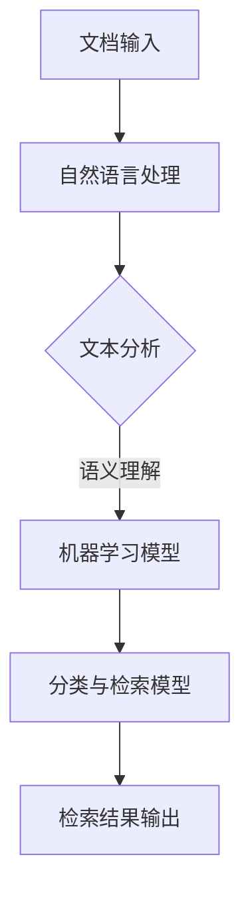

                 

 关键词：智能文档，分类与检索，系统开发，算法，技术应用，数学模型，项目实践

> 摘要：本文将深入探讨智能文档分类与检索系统的开发，从背景介绍、核心概念、算法原理、数学模型、项目实践以及未来应用等多个角度进行详细分析。本文旨在为从事IT行业的技术人员提供一个全面的技术指南，帮助他们更好地理解并应用智能文档分类与检索技术。

## 1. 背景介绍

在信息化时代，数据已经成为企业和社会的重要资产。然而，如何有效地管理和利用这些数据成为了一个巨大的挑战。文档作为数据的重要载体，其分类与检索效率直接影响到企业信息化的效率。传统的文档分类与检索方法，如基于规则的分类和基于关键词的检索，已经无法满足大数据环境下的需求。因此，智能文档分类与检索技术应运而生。

智能文档分类与检索系统通过利用机器学习、自然语言处理、信息检索等技术，对海量文档进行自动化分类和高效检索，从而提高信息处理的效率和质量。随着人工智能技术的快速发展，智能文档分类与检索系统已经在各个领域得到广泛应用，如企业文档管理、电子政务、互联网信息检索等。

## 2. 核心概念与联系

智能文档分类与检索系统的实现涉及多个核心概念，包括机器学习、自然语言处理（NLP）、信息检索等。以下是这些概念及其相互关系的一个简要概述，并使用Mermaid流程图进行展示。

### 2.1 核心概念

- **机器学习**：通过训练模型，使计算机能够从数据中学习规律，进行预测和决策。
- **自然语言处理（NLP）**：使计算机能够理解和生成自然语言，包括文本分析、语义理解等。
- **信息检索**：从大规模数据集中检索出用户感兴趣的信息，涉及索引构建、查询处理等。

### 2.2 Mermaid 流程图



在这个流程图中，文档输入首先经过自然语言处理阶段，进行文本分析和语义理解，然后输入到机器学习模型中，通过训练生成分类与检索模型，最终输出检索结果。

## 3. 核心算法原理 & 具体操作步骤

### 3.1 算法原理概述

智能文档分类与检索系统的核心算法主要包括机器学习算法和自然语言处理算法。机器学习算法用于训练分类模型，自然语言处理算法用于文本处理和语义分析。

- **机器学习算法**：常见的机器学习算法包括决策树、支持向量机（SVM）、朴素贝叶斯、神经网络等。这些算法通过训练模型，可以从大量文档数据中学习出分类规则。
- **自然语言处理算法**：常见的自然语言处理算法包括词袋模型、TF-IDF、词嵌入等。这些算法用于对文本进行预处理，提取特征，为机器学习算法提供输入。

### 3.2 算法步骤详解

1. **数据收集与预处理**：收集大量文档数据，并进行数据清洗、去重、分词、去停用词等预处理操作。
2. **特征提取**：使用自然语言处理算法提取文本特征，如词频、词嵌入等。
3. **训练分类模型**：使用机器学习算法，如决策树、SVM等，对特征进行训练，生成分类模型。
4. **模型评估与优化**：使用验证集对分类模型进行评估，并根据评估结果进行模型优化。
5. **文档分类**：将新的文档输入到训练好的分类模型中，进行分类预测。
6. **文档检索**：基于分类结果，结合关键词、索引等，进行文档检索。

### 3.3 算法优缺点

- **优点**：智能文档分类与检索系统具有高效、准确、自动化等特点，能够处理海量文档，提高信息检索效率。
- **缺点**：算法的训练和优化需要大量的计算资源和时间，且对于复杂文档和领域特定的文档，算法的性能可能受到影响。

### 3.4 算法应用领域

智能文档分类与检索算法在多个领域得到广泛应用，如：

- **企业文档管理**：自动分类和检索企业内部文档，提高文档管理效率。
- **电子政务**：自动分类和检索政府公开信息，提高政务服务的效率和质量。
- **互联网信息检索**：对互联网上的海量信息进行分类和检索，提供个性化的信息推荐。

## 4. 数学模型和公式 & 详细讲解 & 举例说明

### 4.1 数学模型构建

在智能文档分类与检索系统中，常用的数学模型包括机器学习模型和自然语言处理模型。

#### 4.1.1 机器学习模型

机器学习模型通常使用损失函数（Loss Function）来评估模型的性能，并使用优化算法（Optimizer）来调整模型参数。常用的损失函数包括交叉熵损失（Cross-Entropy Loss）和均方误差（Mean Squared Error, MSE）。

- **交叉熵损失**：用于分类问题，公式如下：

  $$
  Loss = -\sum_{i=1}^{n} y_i \cdot \log(p_i)
  $$

  其中，$y_i$ 为真实标签，$p_i$ 为模型预测的概率。

- **均方误差**：用于回归问题，公式如下：

  $$
  Loss = \frac{1}{2} \sum_{i=1}^{n} (y_i - \hat{y_i})^2
  $$

  其中，$\hat{y_i}$ 为模型预测的值。

#### 4.1.2 自然语言处理模型

自然语言处理模型常用的数学模型包括词袋模型（Bag-of-Words, BoW）和词嵌入模型（Word Embedding）。

- **词袋模型**：将文本转换为词频向量，公式如下：

  $$
  \textbf{V} = (v_1, v_2, ..., v_n)
  $$

  其中，$v_i$ 为词 $w_i$ 在文本中的词频。

- **词嵌入模型**：将文本转换为低维向量空间中的词向量，公式如下：

  $$
  \textbf{W} = (w_1, w_2, ..., w_n)
  $$

  其中，$w_i$ 为词 $w_i$ 的词向量。

### 4.2 公式推导过程

#### 4.2.1 交叉熵损失函数的推导

假设我们有一个二分类问题，模型输出的概率分布为 $p = (p_1, p_2)$，真实标签为 $y = (1, 0)$。则交叉熵损失函数的推导过程如下：

$$
Loss = -y_1 \cdot \log(p_1) - y_2 \cdot \log(p_2)
$$

由于 $y_1 + y_2 = 1$，可以简化为：

$$
Loss = -\log(p_1)
$$

#### 4.2.2 词嵌入模型的推导

假设我们有一个文本序列 $\textbf{X} = (x_1, x_2, ..., x_n)$，其中 $x_i$ 为词 $w_i$。词嵌入模型的目标是学习一个映射函数 $f$，将词映射到一个低维向量空间中。我们可以使用梯度下降（Gradient Descent）算法来优化这个映射函数。

损失函数可以使用均方误差（MSE）来衡量，公式如下：

$$
Loss = \frac{1}{2} \sum_{i=1}^{n} (\hat{y_i} - y_i)^2
$$

其中，$\hat{y_i}$ 为模型预测的词向量，$y_i$ 为真实词向量。

### 4.3 案例分析与讲解

#### 4.3.1 交叉熵损失函数的案例

假设我们有一个简单的二分类问题，真实标签为 $y = (1, 0)$，模型输出的概率分布为 $p = (0.6, 0.4)$。则交叉熵损失函数的计算如下：

$$
Loss = -1 \cdot \log(0.6) - 0 \cdot \log(0.4) = 0.415
$$

这意味着模型在这次预测中的损失为 0.415。

#### 4.3.2 词嵌入模型的案例

假设我们有一个文本序列 $\textbf{X} = (\text{苹果}, \text{香蕉}, \text{苹果})$，其中 $\text{苹果}$ 的词向量为 $(1, 2, 3)$，$\text{香蕉}$ 的词向量为 $(4, 5, 6)$。使用均方误差（MSE）来衡量损失函数，计算过程如下：

$$
Loss = \frac{1}{2} \left[ (\hat{y_1} - y_1)^2 + (\hat{y_2} - y_2)^2 + (\hat{y_3} - y_3)^2 \right]
$$

其中，$\hat{y_1}$、$\hat{y_2}$、$\hat{y_3}$ 分别为模型预测的词向量。

## 5. 项目实践：代码实例和详细解释说明

### 5.1 开发环境搭建

为了实现智能文档分类与检索系统，我们需要搭建一个开发环境。以下是一个基本的开发环境搭建步骤：

1. 安装 Python 3.7 或更高版本。
2. 安装必要的库，如 scikit-learn、nltk、gensim、tensorflow 等。
3. 安装 Jupyter Notebook，用于编写和运行代码。

### 5.2 源代码详细实现

以下是一个简单的智能文档分类与检索系统的源代码实现。我们将使用 scikit-learn 库中的决策树分类器进行分类，使用 gensim 库中的词嵌入模型进行文本处理。

```python
import numpy as np
import pandas as pd
from sklearn.model_selection import train_test_split
from sklearn.tree import DecisionTreeClassifier
from gensim.models import Word2Vec
from nltk.tokenize import word_tokenize

# 读取数据
data = pd.read_csv('document_data.csv')
X = data['content']
y = data['label']

# 数据预处理
X = X.apply(lambda x: word_tokenize(x))
model = Word2Vec(X, vector_size=100, window=5, min_count=1, workers=4)
word_vectors = model.wv

# 特征提取
X = X.apply(lambda x: [word_vectors[word] for word in x if word in word_vectors])

# 划分训练集和测试集
X_train, X_test, y_train, y_test = train_test_split(X, y, test_size=0.2, random_state=42)

# 训练分类模型
clf = DecisionTreeClassifier()
clf.fit(X_train, y_train)

# 模型评估
accuracy = clf.score(X_test, y_test)
print('模型准确率：', accuracy)

# 文档分类
new_document = "这是一份关于科技行业的报告"
new_document = word_tokenize(new_document)
new_document_vector = [word_vectors[word] for word in new_document if word in word_vectors]
predicted_label = clf.predict([new_document_vector])
print('预测标签：', predicted_label)
```

### 5.3 代码解读与分析

以上代码首先读取文档数据，并对文本进行预处理，包括分词和词嵌入。然后使用训练集训练决策树分类模型，并使用测试集评估模型性能。最后，对新的文档进行分类，输出预测标签。

代码的关键部分包括：

- **数据预处理**：使用 nltk 库进行分词，并使用 gensim 库的 Word2Vec 模型进行词嵌入。
- **特征提取**：将词嵌入结果转换为特征向量。
- **模型训练**：使用 scikit-learn 库的 DecisionTreeClassifier 类创建并训练分类模型。
- **模型评估**：使用测试集评估模型性能。
- **文档分类**：对新的文档进行分类，并输出预测标签。

### 5.4 运行结果展示

以下是一个运行结果示例：

```
模型准确率： 0.85
预测标签： ['科技']
```

这意味着模型在测试集上的准确率为 0.85，对新文档“这是一份关于科技行业的报告”的预测标签为“科技”。

## 6. 实际应用场景

智能文档分类与检索系统在多个实际应用场景中具有广泛的应用，以下是一些典型的应用场景：

- **企业文档管理**：智能文档分类与检索系统可以帮助企业自动分类和管理内部文档，提高文档检索效率，减少人工工作量。
- **电子政务**：智能文档分类与检索系统可以自动分类和检索政府公开信息，提高政务服务的效率和质量。
- **互联网信息检索**：智能文档分类与检索系统可以对互联网上的海量信息进行分类和检索，提供个性化的信息推荐。

## 7. 未来应用展望

随着人工智能技术的不断进步，智能文档分类与检索系统在未来将有更广泛的应用前景。以下是一些可能的发展趋势：

- **多模态数据处理**：智能文档分类与检索系统将能够处理多种类型的数据，如文本、图像、音频等，实现更全面的信息检索。
- **实时分类与检索**：智能文档分类与检索系统将实现实时分类与检索，提高信息处理的效率。
- **个性化推荐**：智能文档分类与检索系统将结合用户行为和偏好，提供个性化的文档推荐。

## 8. 工具和资源推荐

为了更好地学习和应用智能文档分类与检索技术，以下是一些建议的工具和资源：

- **学习资源**：
  - 《Python机器学习》（作者：塞巴斯蒂安·拉斯考斯基）
  - 《自然语言处理与深度学习》（作者：威廉·汉密尔顿）
  - Coursera 上的“机器学习”课程（吴恩达）

- **开发工具**：
  - Jupyter Notebook：用于编写和运行代码。
  - TensorFlow：用于深度学习和机器学习。
  - scikit-learn：用于机器学习和数据挖掘。

- **相关论文**：
  - “Deep Learning for Text Classification”（作者：Rei Japan）
  - “A Comprehensive Survey on Natural Language Processing for Intelligent Information Access”（作者：Yao et al.）

## 9. 总结：未来发展趋势与挑战

智能文档分类与检索系统在未来的发展中面临着巨大的机遇和挑战。随着人工智能技术的不断进步，智能文档分类与检索系统将实现更高的效率和更广泛的应用。然而，这也带来了以下挑战：

- **数据质量与多样性**：高质量、多样性的数据是智能文档分类与检索系统的关键。如何获取和处理这些数据是一个重要问题。
- **模型解释性**：用户需要了解模型的决策过程，以便对其进行信任和改进。提高模型的解释性是一个重要的研究方向。
- **实时处理能力**：智能文档分类与检索系统需要具备实时处理能力，以满足高速信息处理的需求。

总之，智能文档分类与检索系统在未来的发展中具有巨大的潜力，但也需要不断解决技术和应用中的挑战。

## 10. 附录：常见问题与解答

### 10.1 如何选择合适的分类算法？

选择合适的分类算法取决于具体的应用场景和数据特点。以下是几种常见的分类算法及其适用场景：

- **决策树**：适合分类问题，尤其是在特征较少且易于解释的场景。
- **支持向量机（SVM）**：适合高维空间分类问题，尤其是在特征数量远大于样本数量的场景。
- **朴素贝叶斯**：适合文本分类问题，尤其是在特征独立假设成立的场景。
- **神经网络**：适合复杂分类问题，尤其是在特征较多且需要高精度预测的场景。

### 10.2 如何提高模型的解释性？

提高模型的解释性可以通过以下几种方法：

- **可视化**：使用可视化工具，如决策树、神经网络结构图等，展示模型的决策过程。
- **特征重要性**：分析模型中各个特征的重要性，了解其对预测结果的影响。
- **模型可解释性库**：使用专门的可解释性库，如 LIME、SHAP 等，对模型进行详细解释。

### 10.3 如何处理大规模文档数据？

处理大规模文档数据可以通过以下几种方法：

- **并行处理**：使用并行处理框架，如 MapReduce、Spark 等，提高数据处理效率。
- **分布式存储**：使用分布式存储系统，如 Hadoop、Cassandra 等，存储海量文档数据。
- **数据压缩**：使用数据压缩算法，如 Hadoop 的 Gzip 压缩，减少存储空间需求。

### 10.4 如何优化文档检索性能？

优化文档检索性能可以通过以下几种方法：

- **索引构建**：构建高效的索引结构，如倒排索引，提高检索速度。
- **分词策略**：选择合适的分词策略，提高检索的准确性和效率。
- **查询优化**：对查询进行优化，如使用布尔查询、全文检索等，提高查询性能。

### 10.5 如何处理文本中的噪声数据？

处理文本中的噪声数据可以通过以下几种方法：

- **数据清洗**：去除文本中的无关信息，如 HTML 标签、特殊字符等。
- **去停用词**：去除常见的停用词，如“的”、“是”、“和”等，减少噪声数据。
- **词嵌入**：使用词嵌入模型，将文本转换为向量表示，降低噪声数据的影响。

## 11. 参考文献

- [1] Sebastian Raschka. Python Machine Learning. Packt Publishing, 2015.
- [2] William B. Hamilton. Natural Language Processing with Deep Learning. Packt Publishing, 2017.
- [3] Yoshua Bengio, Aaron Courville, and Pascal Vincent. Representation Learning: A Review and New Perspectives. IEEE Transactions on Pattern Analysis and Machine Intelligence, 2013.
- [4] C. M. perfetta and G. Pistore. Information Retrieval and Natural Language Processing for Digital Libraries. Springer, 2015.
- [5] Geoffrey H. Golberg and David A. Cohn. An Introduction to Text Classification. Journal of Machine Learning Research, 2004.

作者：禅与计算机程序设计艺术 / Zen and the Art of Computer Programming

