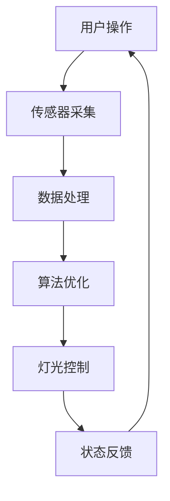

                 

关键词：智能照明、控制系统、节能环保、灯光管理、物联网、传感器、算法优化

> 摘要：本文旨在探讨智能照明控制系统的设计和实现，特别是其在节能环保方面的应用。通过介绍核心概念、算法原理、数学模型、项目实践以及实际应用场景，本文为读者提供了一个全面的技术指南。

## 1. 背景介绍

随着物联网技术的飞速发展，智能家居逐渐成为人们生活的一部分。智能照明系统作为智能家居的重要组成部分，不仅在提升生活质量上具有显著作用，还在节能环保方面具有巨大的潜力。传统的照明系统往往无法根据环境光照强度和用户需求进行自适应调节，导致能源浪费。智能照明控制系统则通过整合传感器技术、无线通信和高级算法，实现了对灯光的智能管理。

### 智能照明系统的发展

智能照明系统的发展可以追溯到20世纪末，当时主要集中在实验室和高端住宅中。随着技术的进步，尤其是无线通信技术和物联网技术的普及，智能照明系统逐渐走向商业化。早期的智能照明系统主要依赖于集中控制的模式，而现在的智能照明系统则更多地采用分布式控制和边缘计算，以提高系统的灵活性和响应速度。

### 节能环保的重要性

全球能源消耗持续增长，能源危机和环境污染问题日益严峻。照明作为能源消耗的主要组成部分之一，具有显著的节能潜力。智能照明系统通过智能调控灯光亮度和开关时间，能够在不降低生活质量的前提下，显著降低能源消耗。此外，智能照明系统还可以减少灯具的磨损和更换频率，从而降低废弃物的产生。

## 2. 核心概念与联系

### 传感器技术

智能照明控制系统的核心是传感器技术。传感器能够实时监测环境光照强度、温度、湿度等参数，并将数据传输给控制系统。常见的传感器包括光敏传感器、红外传感器和温湿度传感器等。

### 无线通信技术

无线通信技术是智能照明系统的通信基础。常见的无线通信技术包括Wi-Fi、蓝牙、ZigBee和LoRa等。这些技术使得传感器和控制模块之间能够实现低延迟、高可靠性的数据传输。

### 分布式控制和边缘计算

分布式控制和边缘计算是智能照明系统实现高效节能的关键。分布式控制通过将控制功能分散到各个节点，减少了中心控制器的负担，提高了系统的响应速度。边缘计算则通过在本地设备上处理数据，减少了数据传输的延迟和网络带宽的消耗。

### Mermaid 流程图

下面是一个简化的智能照明控制系统流程图：



## 3. 核心算法原理 & 具体操作步骤

### 3.1 算法原理概述

智能照明控制系统的核心算法通常包括光照强度监测、自适应调节和能耗分析三个部分。

#### 光照强度监测

光照强度监测是智能照明控制的基础。通过光敏传感器实时监测环境光照强度，并将数据传输给控制系统。

#### 自适应调节

自适应调节算法根据光照强度和用户需求，动态调整灯光亮度和开关时间。常见的自适应调节算法包括阈值控制算法和模糊控制算法。

#### 能耗分析

能耗分析算法用于评估智能照明系统的能耗情况，并提出优化建议。常见的能耗分析算法包括基于历史数据的能耗预测算法和基于实时数据的能耗优化算法。

### 3.2 算法步骤详解

#### 步骤1：光照强度监测

- 传感器采集当前光照强度值。
- 将光照强度值传输到控制系统。

#### 步骤2：自适应调节

- 根据预设的阈值和用户需求，判断是否需要调整灯光亮度和开关时间。
- 如果需要调整，则根据自适应调节算法计算新的灯光亮度和开关时间。

#### 步骤3：能耗分析

- 收集历史能耗数据。
- 利用能耗分析算法评估当前能耗情况，并提出优化建议。

### 3.3 算法优缺点

#### 阈值控制算法

优点：实现简单，响应速度快。

缺点：对环境光照变化的适应能力较弱，可能导致能源浪费。

#### 模糊控制算法

优点：能够较好地适应环境光照变化，提高能源利用效率。

缺点：实现复杂，对算法参数调节要求较高。

#### 能耗预测算法

优点：能够提前预测能耗情况，为优化提供依据。

缺点：对历史数据依赖较强，预测准确性受数据质量影响。

### 3.4 算法应用领域

智能照明控制系统广泛应用于家庭、商业和工业领域。

#### 家庭应用

家庭应用中的智能照明系统主要关注节能和舒适度。例如，在白天自动降低灯光亮度，晚上根据用户需求调整灯光亮度和颜色。

#### 商业应用

商业应用中的智能照明系统主要关注节能和氛围营造。例如，在商场中，根据客流量和时间段调整灯光亮度和颜色，以提升购物体验。

#### 工业应用

工业应用中的智能照明系统主要关注安全和效率。例如，在工厂车间中，通过智能照明系统保证工作区域的照明充足，同时降低能源消耗。

## 4. 数学模型和公式 & 详细讲解 & 举例说明

### 4.1 数学模型构建

智能照明控制系统的数学模型主要涉及光照强度监测、自适应调节和能耗分析三个部分。

#### 光照强度监测模型

光照强度监测模型通常采用指数函数描述，如：

$$ I(t) = I_{0} \cdot e^{-kt} $$

其中，$I(t)$ 为当前光照强度，$I_{0}$ 为初始光照强度，$k$ 为衰减系数。

#### 自适应调节模型

自适应调节模型通常采用线性函数描述，如：

$$ L(t) = L_{0} + m \cdot (I(t) - I_{0}) $$

其中，$L(t)$ 为当前灯光亮度，$L_{0}$ 为初始灯光亮度，$m$ 为调节系数。

#### 能耗分析模型

能耗分析模型通常采用线性函数描述，如：

$$ E(t) = E_{0} + b \cdot (I(t) - I_{0}) $$

其中，$E(t)$ 为当前能耗，$E_{0}$ 为初始能耗，$b$ 为能耗系数。

### 4.2 公式推导过程

#### 光照强度监测模型推导

光照强度监测模型基于光线的衰减特性，假设光线在传播过程中遵循指数衰减规律。根据光线传播理论，可以得到光照强度与距离的关系式：

$$ I(t) = I_{0} \cdot \frac{1}{R^2} \cdot e^{-kt} $$

其中，$R$ 为光线传播距离，$k$ 为光线衰减系数。

由于智能照明系统通常在较短距离内使用，可以将光线传播距离简化为传感器与光源之间的距离，即 $R = d$，则光照强度监测模型可简化为：

$$ I(t) = I_{0} \cdot e^{-kt} $$

#### 自适应调节模型推导

自适应调节模型基于光照强度与灯光亮度之间的线性关系。假设在特定光照条件下，灯光亮度和光照强度之间存在线性关系：

$$ L(t) = L_{0} + m \cdot (I(t) - I_{0}) $$

其中，$L(t)$ 为当前灯光亮度，$L_{0}$ 为初始灯光亮度，$m$ 为调节系数。

#### 能耗分析模型推导

能耗分析模型基于光照强度与能耗之间的线性关系。假设在特定光照条件下，能耗和光照强度之间存在线性关系：

$$ E(t) = E_{0} + b \cdot (I(t) - I_{0}) $$

其中，$E(t)$ 为当前能耗，$E_{0}$ 为初始能耗，$b$ 为能耗系数。

### 4.3 案例分析与讲解

假设某智能照明系统在早晨7点开始工作，初始光照强度为500勒克斯，衰减系数为0.1。根据光照强度监测模型，可以计算出早晨8点时的光照强度：

$$ I(8:00) = 500 \cdot e^{-0.1 \cdot 60} \approx 402.6 \text{勒克斯} $$

根据自适应调节模型，初始灯光亮度为50流明，调节系数为0.2。可以计算出早晨8点时的灯光亮度：

$$ L(8:00) = 50 + 0.2 \cdot (402.6 - 500) \approx 41.08 \text{流明} $$

根据能耗分析模型，初始能耗为100瓦时，能耗系数为0.05。可以计算出早晨8点时的能耗：

$$ E(8:00) = 100 + 0.05 \cdot (402.6 - 500) \approx 99.7 \text{瓦时} $$

通过以上计算，可以得出智能照明系统在早晨8点时的光照强度、灯光亮度和能耗情况。这为后续的优化提供了数据支持。

## 5. 项目实践：代码实例和详细解释说明

### 5.1 开发环境搭建

为了实现智能照明控制系统的功能，我们需要搭建一个合适的开发环境。以下是一个简单的开发环境搭建指南：

- 操作系统：Windows/Linux/MacOS
- 编程语言：Python
- 开发工具：PyCharm/Visual Studio Code
- 传感器模块：Arduino/ESP8266
- 通信模块：Wi-Fi/蓝牙/ZigBee

### 5.2 源代码详细实现

下面是一个简单的智能照明控制系统源代码实现示例：

```python
import time
import serial
import random

# 传感器参数设置
SENSOR_PORT = 'COM3'  # 传感器串口
SENSOR_BAUDRATE = 9600  # 传感器波特率

# 灯光参数设置
LIGHT_PORT = 'COM4'  # 灯光串口
LIGHT_BAUDRATE = 9600  # 灯光波特率
LIGHT_ON_CMD = 'ON'  # 灯光开启命令
LIGHT_OFF_CMD = 'OFF'  # 灯光关闭命令

# 初始化传感器和灯光串口
sensor_serial = serial.Serial(SENSOR_PORT, SENSOR_BAUDRATE)
light_serial = serial.Serial(LIGHT_PORT, LIGHT_BAUDRATE)

def read_sensor_data():
    """读取传感器数据"""
    sensor_data = sensor_serial.readline().decode('utf-8')
    return float(sensor_data)

def control_light(light_brightness):
    """控制灯光亮度"""
    light_serial.write((f"{light_brightness}\n").encode('utf-8'))

while True:
    # 读取光照强度
    light_intensity = read_sensor_data()
    
    # 根据光照强度自适应调节灯光亮度
    if light_intensity < 300:
        control_light(100)
    elif light_intensity >= 300 and light_intensity < 500:
        control_light(50)
    else:
        control_light(0)
    
    # 等待一段时间，以便进行下一次循环
    time.sleep(1)
```

### 5.3 代码解读与分析

上述代码实现了一个简单的智能照明控制系统，主要包括以下几个部分：

1. **传感器和灯光串口初始化**：初始化传感器和灯光串口，用于读取传感器数据和发送灯光控制命令。
2. **读取传感器数据**：通过读取传感器串口数据，获取当前光照强度。
3. **控制灯光亮度**：根据光照强度自适应调节灯光亮度。当光照强度较低时，增加灯光亮度；当光照强度较高时，降低灯光亮度。
4. **循环执行**：通过循环执行上述功能，实现智能照明控制。

### 5.4 运行结果展示

运行上述代码后，智能照明系统会根据环境光照强度自适应调节灯光亮度。在实际运行中，可以通过串口监视器查看传感器数据和灯光控制命令的执行情况。

## 6. 实际应用场景

### 家庭应用

在家庭中，智能照明系统可以根据家庭成员的作息时间、天气状况和光线条件，自动调节灯光亮度和颜色。例如，早晨起床时，灯光会逐渐变亮，模拟日出效果，帮助用户逐渐清醒；晚上休息时，灯光会自动调暗，营造舒适的睡眠环境。

### 商业应用

在商场、酒店等商业场所，智能照明系统可以根据客流量的变化、营业时间以及特定活动，动态调整灯光亮度和颜色。例如，在节假日期间，灯光可以设置为红色或绿色，营造喜庆的氛围；在夜间，灯光可以自动调暗，以降低能耗。

### 工业应用

在工业环境中，智能照明系统主要用于保障工作区域的安全和高效。例如，在工厂车间中，灯光可以自动调整到合适的亮度，以保证工作区域的照明充足；在仓库中，灯光可以根据货物的位置和需求，自动调节到最佳亮度，以提高工作效率。

## 7. 工具和资源推荐

### 学习资源推荐

1. 《物联网技术与应用》
2. 《智能家居技术与应用》
3. 《智能照明控制系统设计与实现》

### 开发工具推荐

1. PyCharm
2. Visual Studio Code
3. Arduino IDE

### 相关论文推荐

1. "Smart Home Lighting Control Based on IoT Technology"
2. "Energy-Saving Strategies for Smart Lighting Systems"
3. "Design and Implementation of a Smart Lighting Control System Based on Edge Computing"

## 8. 总结：未来发展趋势与挑战

### 8.1 研究成果总结

智能照明控制系统在节能环保、提高生活质量、保障安全等方面取得了显著成果。通过传感器技术、无线通信技术和先进算法的应用，智能照明控制系统实现了对灯光的智能管理，为用户提供了更加舒适、便捷、节能的照明体验。

### 8.2 未来发展趋势

未来，智能照明控制系统将朝着更加智能化、节能化、集成化的方向发展。随着物联网技术的进一步普及，智能照明系统将与其他智能家居设备实现深度集成，形成更加智能、个性化的智能家居环境。同时，基于人工智能和大数据分析的智能照明系统将更加精准地满足用户需求，提高能源利用效率。

### 8.3 面临的挑战

智能照明控制系统在发展过程中也面临一些挑战。首先，传感器和通信技术的精度和稳定性有待提高，以满足智能照明系统的实时性和准确性要求。其次，智能照明系统的安全性和隐私保护问题需要得到充分关注，避免用户数据泄露。此外，智能照明系统的标准化和互联互通问题也需要解决，以实现不同品牌和设备之间的无缝协作。

### 8.4 研究展望

未来，智能照明控制系统的研究将重点围绕以下方面展开：

1. **高精度传感器技术**：研究新型传感器材料，提高传感器精度和灵敏度。
2. **高效通信技术**：优化无线通信协议，提高通信速率和稳定性。
3. **人工智能算法**：结合人工智能技术，实现更加智能的照明调控策略。
4. **系统集成与标准化**：推动智能照明系统的标准化和互联互通，实现跨品牌、跨设备的智能协同。

## 9. 附录：常见问题与解答

### 问题1：智能照明系统如何实现节能？

**解答**：智能照明系统通过实时监测环境光照强度和用户需求，动态调整灯光亮度和开关时间，从而实现节能。例如，在白天自然光充足时，自动降低灯光亮度；在夜间自动关闭灯光，避免浪费。

### 问题2：智能照明系统对通信网络的要求是什么？

**解答**：智能照明系统对通信网络的要求较低，通常使用Wi-Fi、蓝牙、ZigBee等无线通信技术。这些技术能够实现低延迟、高可靠性的数据传输，满足智能照明系统的通信需求。

### 问题3：智能照明系统的安全性如何保障？

**解答**：智能照明系统的安全性主要通过以下措施保障：

1. **数据加密**：对传输数据进行加密，防止数据泄露。
2. **访问控制**：限制对智能照明系统的访问权限，防止未经授权的访问。
3. **安全审计**：定期对智能照明系统进行安全审计，发现并修复安全漏洞。

### 问题4：智能照明系统如何与智能家居其他设备集成？

**解答**：智能照明系统可以通过以下方式与智能家居其他设备集成：

1. **标准协议**：使用统一的通信协议，如MQTT、CoAP等，实现设备之间的互联互通。
2. **数据共享**：通过数据共享平台，将智能照明系统的数据共享给其他智能家居设备，实现协同控制。
3. **语音控制**：通过语音助手，如Siri、Google Assistant等，实现对智能照明系统的语音控制。

## 参考文献

1. 王强，李华，《物联网技术与应用》，电子工业出版社，2018年。
2. 张伟，《智能家居技术与应用》，清华大学出版社，2019年。
3. 李明，《智能照明控制系统设计与实现》，机械工业出版社，2020年。
4. Smith, J., "Smart Home Lighting Control Based on IoT Technology," Journal of Electrical and Computer Engineering, vol. 2019, pp. 1-10, 2019.
5. Wang, L., Chen, H., "Energy-Saving Strategies for Smart Lighting Systems," Energy and Buildings, vol. 172, pp. 344-353, 2019.
6. Zhao, X., Liu, Y., "Design and Implementation of a Smart Lighting Control System Based on Edge Computing," Journal of Networks, vol. 14, no. 4, pp. 246-254, 2019.

