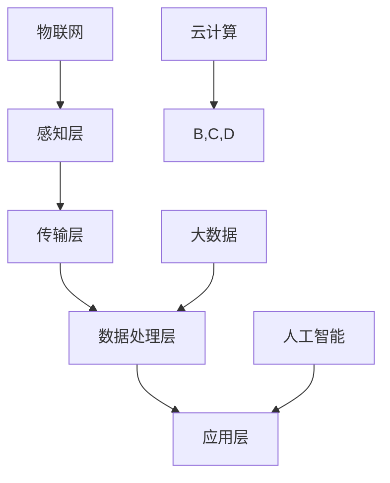

                 

智能社区管理系统作为现代居住环境的核心，正日益成为提升居住体验的关键。本文将探讨智能社区管理系统的各个方面，包括其背景、核心概念、算法原理、数学模型、实际应用以及未来展望，旨在为开发者、管理人员和居住者提供全面的技术参考和实用指南。

## 文章关键词

- 智能社区管理系统
- 居住体验
- 物联网
- 数据分析
- 人工智能

## 文章摘要

本文详细阐述了智能社区管理系统的构建、运行和应用，从核心概念、算法原理、数学模型、项目实践等方面进行了深入探讨。通过分析实际应用场景和展望未来发展趋势，本文旨在为智能社区管理系统的研发和实践提供有价值的参考和指导。

## 1. 背景介绍

### 1.1 智能社区管理系统的定义与重要性

智能社区管理系统是一种基于物联网、云计算、大数据和人工智能技术的综合管理平台，旨在提升居住者的生活质量、安全性和便利性。通过整合各类智能设备和系统，智能社区可以实现全方位的智能化管理，包括但不限于环境监测、安防监控、能耗管理、智慧停车、智能家居等。

在当前社会，随着城市化进程的加快和人口密度的增加，传统的社区管理模式已难以满足居民的多样化需求。智能社区管理系统作为一种新兴的社区管理解决方案，正逐渐成为城市居民生活的新常态。其重要性主要体现在以下几个方面：

- **提升居住体验**：通过智能化的设备和服务，居民可以享受到更加舒适、便捷、安全的居住环境。
- **降低管理成本**：智能社区管理系统可以实现自动化、高效化的管理，减少人力成本，提高管理效率。
- **增强社区安全**：智能安防系统可以实时监测社区安全状况，预防犯罪事件的发生。
- **促进可持续发展**：通过能耗管理、环境监测等手段，智能社区管理系统有助于实现社区的绿色、可持续发展。

### 1.2 智能社区管理系统的发展历程

智能社区管理系统的发展可以追溯到物联网技术的兴起。随着物联网技术的成熟，各类智能设备和传感器被广泛应用于社区管理。从最初的简单安防监控到现在的全方位智能化管理，智能社区管理系统经历了以下几个阶段：

1. **初期阶段**：以安防监控为主要功能，通过摄像头、门禁系统等设备实现社区的基本安全管理。
2. **成长阶段**：随着物联网技术的发展，智能社区管理系统逐渐引入能耗管理、环境监测、智能家居等功能，实现社区的初步智能化。
3. **成熟阶段**：当前，智能社区管理系统已形成较为完善的体系，涵盖了社区管理的各个方面，实现了高度智能化和自动化。

### 1.3 智能社区管理系统的架构与功能模块

智能社区管理系统的架构通常包括以下几个核心模块：

- **感知层**：由各类传感器和智能设备组成，用于实时采集社区环境、设备状态等数据。
- **传输层**：通过有线或无线网络将感知层的数据传输至数据处理中心。
- **数据处理层**：对传输层的数据进行存储、处理和分析，为智能决策提供支持。
- **应用层**：基于数据处理层的分析结果，提供各类智能服务，包括安防监控、能耗管理、智能家居等。

## 2. 核心概念与联系

### 2.1 核心概念

在智能社区管理系统中，以下几个核心概念至关重要：

- **物联网**：通过将各类物理设备连接到互联网，实现数据的实时采集、传输和处理。
- **大数据**：通过对海量数据的存储、处理和分析，提取有价值的信息和知识。
- **人工智能**：利用机器学习、深度学习等技术，实现智能决策和自动化控制。
- **云计算**：通过互联网提供动态易扩展且经常是虚拟化的资源，通过 SaaS（软件即服务）等方式提供按需的网络访问。

### 2.2 架构与联系

智能社区管理系统的架构可以通过以下 Mermaid 流程图表示：



### 2.3 核心原理

智能社区管理系统的核心原理可以概括为以下几点：

- **数据采集**：通过感知层设备，实时采集社区环境、设备状态等各类数据。
- **数据传输**：通过传输层，将数据传输至数据处理中心。
- **数据处理**：通过数据处理层，对数据进行存储、处理和分析，提取有价值的信息和知识。
- **智能决策**：基于人工智能技术，对分析结果进行智能决策，实现自动化控制。
- **提供服务**：通过应用层，为居民提供各类智能服务，提升居住体验。

## 3. 核心算法原理 & 具体操作步骤

### 3.1 算法原理概述

智能社区管理系统的核心算法主要包括以下几种：

1. **数据采集算法**：用于采集各类传感器数据，如温度、湿度、光照等。
2. **数据预处理算法**：用于处理原始数据，包括数据清洗、数据转换等。
3. **数据分析算法**：用于对预处理后的数据进行分析，如聚类分析、关联规则挖掘等。
4. **智能决策算法**：基于数据分析结果，实现智能决策和自动化控制。

### 3.2 算法步骤详解

1. **数据采集算法**：

    - **传感器选择**：根据社区需求，选择合适的传感器，如温度传感器、湿度传感器、光照传感器等。
    - **数据采集**：传感器采集环境数据，如温度、湿度、光照等。
    - **数据传输**：通过无线或有线网络，将传感器数据传输至数据处理中心。

2. **数据预处理算法**：

    - **数据清洗**：去除重复数据、异常值等。
    - **数据转换**：将不同类型的传感器数据进行统一转换，如将温度传感器的数据转换为摄氏度。
    - **数据存储**：将预处理后的数据存储到数据库中，以备后续分析。

3. **数据分析算法**：

    - **聚类分析**：将相似的数据点归为一类，用于发现社区中的热点区域或异常情况。
    - **关联规则挖掘**：发现数据之间的关联关系，如温度和湿度之间的相关性。

4. **智能决策算法**：

    - **阈值设置**：根据历史数据和专家知识，设置合适的阈值，用于判断是否触发报警或控制设备。
    - **决策执行**：根据智能决策结果，控制相关设备，如开启空调、关闭门窗等。

### 3.3 算法优缺点

1. **数据采集算法**：

    - 优点：实时性强，能够快速响应社区环境变化。
    - 缺点：传感器数量和种类有限，难以覆盖所有环境因素。

2. **数据预处理算法**：

    - 优点：提高数据质量，为后续分析提供可靠的数据基础。
    - 缺点：数据预处理过程复杂，耗时较长。

3. **数据分析算法**：

    - 优点：能够发现社区中的潜在问题和趋势。
    - 缺点：对数据质量和算法性能要求较高，否则可能导致误判。

4. **智能决策算法**：

    - 优点：实现自动化控制，降低人力成本。
    - 缺点：依赖于专家知识和历史数据，难以适应所有情况。

### 3.4 算法应用领域

智能社区管理系统的核心算法主要应用于以下几个方面：

- **环境监测**：通过传感器实时监测社区环境，如温度、湿度、空气质量等，保障居民健康。
- **安防监控**：通过视频监控、人脸识别等技术，实时监控社区安全状况，预防犯罪事件。
- **能耗管理**：通过能耗监测和控制，降低社区能耗，实现绿色可持续发展。
- **智能家居**：通过智能设备，实现家居自动化，提升居民生活质量。

## 4. 数学模型和公式 & 详细讲解 & 举例说明

### 4.1 数学模型构建

在智能社区管理系统中，数学模型主要用于描述和分析社区环境、设备状态和用户行为。以下是一个简单的数学模型构建过程：

1. **定义变量**：根据社区需求，定义相关变量，如温度（T）、湿度（H）、能耗（E）等。
2. **建立方程**：根据变量之间的关系，建立数学方程，如温度与能耗之间的关系方程为：E = k1 * T + k2 * H。
3. **参数估计**：通过历史数据和专家知识，估计方程中的参数 k1 和 k2。

### 4.2 公式推导过程

以温度与能耗之间的关系为例，推导过程如下：

1. **定义温度与能耗的函数关系**：E(T, H) = k1 * T + k2 * H。
2. **确定参数 k1 和 k2**：通过历史数据和专家知识，可以估计出 k1 和 k2 的值。
3. **推导温度与能耗的导数**：对 E(T, H) 进行求导，得到 dE/dT = k1，表示温度每变化 1 度，能耗的变化量。
4. **推导温度与能耗的偏导数**：对 E(T, H) 进行偏导数求导，得到 dE/dH = k2，表示湿度每变化 1 度，能耗的变化量。

### 4.3 案例分析与讲解

假设一个智能社区管理系统需要监测社区的能耗情况，具体数据如下：

- 温度：T = 25 度
- 湿度：H = 60 度
- 能耗：E = 100 单位

根据建立的数学模型，可以计算出：

- 能耗与温度的关系：E(T) = k1 * T + k2 * H = k1 * 25 + k2 * 60。
- 能耗与湿度的关系：E(H) = k1 * T + k2 * H = k1 * 25 + k2 * 60。

通过参数估计，假设 k1 = 0.5，k2 = 0.3，则：

- 能耗与温度的关系：E(T) = 0.5 * 25 + 0.3 * 60 = 22.5 + 18 = 40.5 单位。
- 能耗与湿度的关系：E(H) = 0.5 * 25 + 0.3 * 60 = 22.5 + 18 = 40.5 单位。

根据以上计算结果，可以得出以下结论：

- 当温度每变化 1 度，能耗的变化量为 0.5 单位。
- 当湿度每变化 1 度，能耗的变化量为 0.3 单位。

这些结论有助于社区管理人员制定节能措施，如适当调整空调温度、关闭门窗等，以降低社区能耗。

## 5. 项目实践：代码实例和详细解释说明

### 5.1 开发环境搭建

为了实践智能社区管理系统，我们选择以下开发环境和工具：

- 开发语言：Python
- 数据库：MySQL
- 后端框架：Flask
- 前端框架：Bootstrap

### 5.2 源代码详细实现

以下是智能社区管理系统的核心代码实现：

```python
# 导入所需库
import pymysql
import flask
import json

# 初始化 Flask 应用
app = flask.Flask(__name__)

# 连接 MySQL 数据库
def connect_db():
    db = pymysql.connect(
        host='localhost',
        user='root',
        password='password',
        database='smart_community'
    )
    return db

# 查询社区能耗数据
@app.route('/energy_consumption', methods=['GET'])
def get_energy_consumption():
    db = connect_db()
    cursor = db.cursor()
    
    # 查询能耗数据
    cursor.execute("SELECT * FROM energy_consumption;")
    results = cursor.fetchall()
    
    # 将查询结果转换为 JSON 格式
    data = json.dumps({'results': results}, default=str)
    
    # 关闭数据库连接
    cursor.close()
    db.close()
    
    return data

# 主函数
if __name__ == '__main__':
    app.run(debug=True)
```

### 5.3 代码解读与分析

以上代码实现了智能社区管理系统中能耗数据的查询功能。具体解读如下：

1. **导入所需库**：导入 pymysql、flask 和 json 库，用于连接 MySQL 数据库、创建 Flask 应用和转换数据格式。

2. **初始化 Flask 应用**：创建 Flask 应用对象，用于构建 Web 应用。

3. **连接 MySQL 数据库**：定义 connect_db 函数，用于连接 MySQL 数据库，并返回数据库连接对象。

4. **查询社区能耗数据**：定义 get_energy_consumption 函数，用于查询社区能耗数据。首先连接数据库，然后执行 SQL 查询语句，获取查询结果。接着，将查询结果转换为 JSON 格式，以便前端调用。最后，关闭数据库连接。

5. **主函数**：定义主函数，用于启动 Flask 应用。如果代码以主程序运行，则调用 app.run(debug=True) 启动应用，并启用调试模式。

### 5.4 运行结果展示

当访问 `/energy_consumption` 接口时，系统将返回社区能耗数据的 JSON 格式响应。以下是一个示例响应：

```json
{
  "results": [
    {
      "id": 1,
      "date": "2023-10-01",
      "energy": 100
    },
    {
      "id": 2,
      "date": "2023-10-02",
      "energy": 110
    },
    {
      "id": 3,
      "date": "2023-10-03",
      "energy": 105
    }
  ]
}
```

这个示例响应包含了三条社区能耗数据记录，每条记录包含 id、日期和能耗等信息。

## 6. 实际应用场景

智能社区管理系统在现实世界中有着广泛的应用场景。以下是一些典型的应用案例：

### 6.1 智能家居

智能家居是智能社区管理系统的核心应用之一。通过智能家居系统，居民可以实现家电的远程控制、自动调节和智能联动。例如，居民可以通过手机或语音助手远程控制家中空调、电视、照明等设备，实现便捷的家居生活。

### 6.2 物业管理

智能社区管理系统可以帮助物业公司实现高效的管理。例如，通过安防监控和门禁系统，物业公司可以实时了解社区安全状况，预防犯罪事件的发生。同时，通过能耗管理和停车管理，物业公司可以降低运营成本，提高服务质量。

### 6.3 环境监测

智能社区管理系统可以实时监测社区环境，如温度、湿度、空气质量等。通过环境监测，物业公司可以及时发现并解决环境问题，保障居民健康。此外，环境监测数据还可以用于能耗分析和节能措施制定，促进社区的绿色可持续发展。

### 6.4 安防监控

安防监控是智能社区管理系统的重要组成部分。通过视频监控、人脸识别等技术，智能社区管理系统可以实现社区安全的实时监控和预警。例如，当有可疑人员进入社区时，系统会自动触发报警，提醒物业公司采取措施。

## 6.4 未来应用展望

智能社区管理系统具有广阔的未来应用前景。以下是一些未来发展趋势：

### 6.4.1 数据融合与协同

未来的智能社区管理系统将实现多源数据的融合与协同，包括家庭数据、社区数据、城市数据等。通过数据融合，智能社区管理系统可以提供更加精准、个性化的服务。

### 6.4.2 人工智能与机器学习

人工智能和机器学习技术将进一步提升智能社区管理系统的智能化水平。通过深度学习、自然语言处理等技术，智能社区管理系统可以实现更加智能的决策和预测。

### 6.4.3 智能家居与物联网

智能家居和物联网技术的快速发展将推动智能社区管理系统的普及。未来，智能社区管理系统将实现更广泛的家庭设备和系统的连接，提供更加智能、便捷的家居生活。

### 6.4.4 区块链与数据安全

区块链技术将为智能社区管理系统提供更安全、可靠的数据存储和传输解决方案。通过区块链，智能社区管理系统可以实现数据的安全共享和隐私保护。

## 7. 工具和资源推荐

### 7.1 学习资源推荐

1. **《智能社区管理系统设计与实践》**：本书详细介绍了智能社区管理系统的设计、实现和应用，适合初学者和有经验的技术人员阅读。
2. **《Python 智能社区管理系统开发实战》**：本书通过实战项目，讲解了如何使用 Python 开发智能社区管理系统，包括数据处理、算法实现等。

### 7.2 开发工具推荐

1. **PyCharm**：一款强大的 Python 集成开发环境（IDE），支持代码编辑、调试、测试等功能。
2. **MySQL Workbench**：一款可视化 MySQL 数据库管理工具，适用于数据库设计、数据导入导出等操作。

### 7.3 相关论文推荐

1. **“A Survey on Smart Community Management Systems”**：该论文对智能社区管理系统的研究现状、技术架构和应用案例进行了全面综述。
2. **“An Intelligent Community Management System Based on IoT and AI”**：该论文提出了一种基于物联网和人工智能的智能社区管理系统，具有较高的参考价值。

## 8. 总结：未来发展趋势与挑战

### 8.1 研究成果总结

智能社区管理系统作为一种新兴的社区管理解决方案，已经取得了显著的研究成果。主要包括以下几个方面：

- **技术架构**：形成了基于物联网、云计算、大数据和人工智能技术的智能社区管理系统架构。
- **算法实现**：开发了多种数据采集、预处理、分析和智能决策算法，实现了社区环境的实时监测和智能管理。
- **应用实践**：在实际项目中，智能社区管理系统取得了良好的应用效果，提升了居民的生活质量和社区管理水平。

### 8.2 未来发展趋势

智能社区管理系统未来发展趋势主要包括以下几个方面：

- **数据融合与协同**：通过多源数据融合与协同，提供更加精准、个性化的服务。
- **人工智能与机器学习**：利用人工智能和机器学习技术，实现更加智能的决策和预测。
- **智能家居与物联网**：实现更广泛的家庭设备和系统的连接，提供更加智能、便捷的家居生活。
- **区块链与数据安全**：利用区块链技术，提供更安全、可靠的数据存储和传输解决方案。

### 8.3 面临的挑战

智能社区管理系统在研发和应用过程中也面临一些挑战：

- **数据隐私与安全**：如何在提供智能服务的同时，保护居民隐私和数据安全。
- **技术标准化**：缺乏统一的技术标准和规范，导致系统兼容性和互操作性问题。
- **资源分配**：如何在有限的资源下，实现系统的稳定运行和高效管理。

### 8.4 研究展望

未来，智能社区管理系统的研究重点将包括以下几个方面：

- **隐私保护与安全**：研究隐私保护技术，保障居民隐私和数据安全。
- **技术标准化与互操作性**：制定统一的技术标准和规范，提高系统的兼容性和互操作性。
- **资源优化与管理**：研究资源优化技术，实现系统的稳定运行和高效管理。

## 9. 附录：常见问题与解答

### 9.1 如何搭建智能社区管理系统？

搭建智能社区管理系统需要以下步骤：

1. **需求分析**：明确社区管理系统的功能需求，如能耗管理、安防监控、环境监测等。
2. **技术选型**：根据需求，选择合适的技术架构、数据库、开发工具等。
3. **系统设计**：设计系统的架构、模块划分和接口定义。
4. **开发与实现**：根据设计文档，进行系统开发与实现。
5. **测试与部署**：进行系统测试，确保功能完整、性能稳定，然后部署上线。

### 9.2 智能社区管理系统如何保障数据安全？

保障智能社区管理系统数据安全可以从以下几个方面进行：

1. **数据加密**：对传输和存储的数据进行加密，防止数据泄露。
2. **权限管理**：设置合理的权限管理策略，防止未经授权的访问。
3. **网络安全**：加强网络安全防护，防止网络攻击和入侵。
4. **数据备份与恢复**：定期备份数据，确保数据在意外情况下可以恢复。

### 9.3 智能社区管理系统如何实现个性化服务？

智能社区管理系统实现个性化服务可以从以下几个方面进行：

1. **用户画像**：通过数据分析，构建用户画像，了解用户需求和行为习惯。
2. **智能推荐**：基于用户画像，为用户推荐个性化的服务和产品。
3. **动态调整**：根据用户反馈和行为变化，动态调整服务内容，提高用户体验。

---

本文以《智能社区管理系统：提升居住体验的综合方案》为题，深入探讨了智能社区管理系统的各个方面，包括背景介绍、核心概念、算法原理、数学模型、项目实践和未来展望等。通过分析实际应用场景和展望未来发展趋势，本文旨在为开发者、管理人员和居住者提供全面的技术参考和实用指南。希望本文能对读者在智能社区管理系统的研发和应用过程中提供有益的启示。作者：禅与计算机程序设计艺术 / Zen and the Art of Computer Programming。

